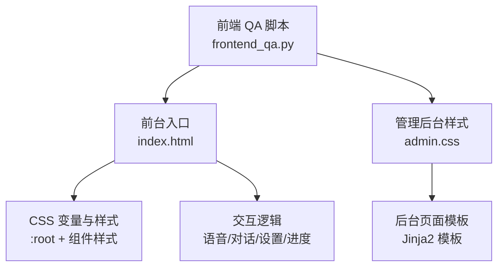
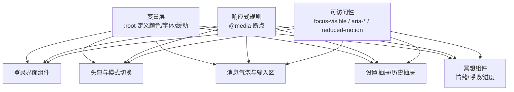
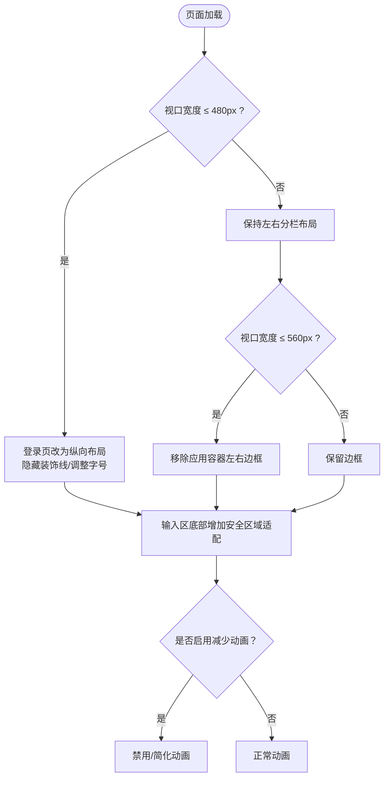
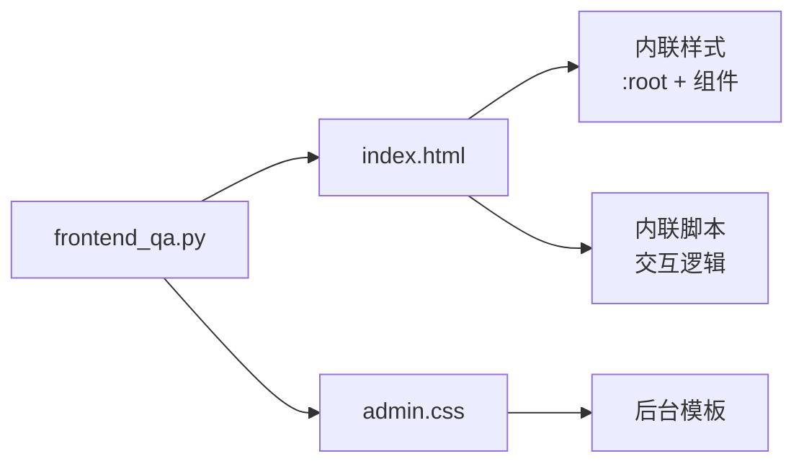

# 设计系统

<cite>
**本文引用的文件**   
- [hushai/meditation/static/index.html](file://hushai/meditation/static/index.html)
- [hushai/meditation/admin/static/css/admin.css](file://hushai/meditation/admin/static/css/admin.css)
- [.agents/skills/frontend-design/SKILL.md](file://.agents/skills/frontend-design/SKILL.md)
- [scripts/frontend_qa.py](file://scripts/frontend_qa.py)
</cite>

## 目录
1. [引言](#引言)
2. [项目结构](#项目结构)
3. [核心组件](#核心组件)
4. [架构总览](#架构总览)
5. [详细组件分析](#详细组件分析)
6. [依赖关系分析](#依赖关系分析)
7. [性能考量](#性能考量)
8. [故障排查指南](#故障排查指南)
9. [结论](#结论)
10. [附录](#附录)

## 引言
本设计系统围绕“极简禅意”的视觉语言，采用黑白为主、低饱和中性色为辅的配色体系，强调留白与呼吸感。通过 CSS 变量统一颜色、字体与动画缓动，构建可维护、可扩展的主题基础；以响应式策略适配移动端与桌面端；提供主题覆盖与动态切换能力；并内置可访问性规范（焦点管理、屏幕阅读器支持、键盘导航）。

## 项目结构
前端样式与交互集中在单页应用入口中，包含内联样式与脚本；管理后台使用独立样式文件。关键位置如下：
- 前台 SPA 入口与样式：[hushai/meditation/static/index.html](file://hushai/meditation/static/index.html)
- 管理后台样式：[hushai/meditation/admin/static/css/admin.css](file://hushai/meditation/admin/static/css/admin.css)
- 前端美学指导原则：[.agents/skills/frontend-design/SKILL.md](file://.agents/skills/frontend-design/SKILL.md)
- 前端质量检查脚本（含响应式与无障碍检测）：[scripts/frontend_qa.py](file://scripts/frontend_qa.py)

图表来源
- [hushai/meditation/static/index.html](file://hushai/meditation/static/index.html)
- [hushai/meditation/admin/static/css/admin.css](file://hushai/meditation/admin/static/css/admin.css)
- [scripts/frontend_qa.py](file://scripts/frontend_qa.py)

章节来源
- [hushai/meditation/static/index.html](file://hushai/meditation/static/index.html)
- [hushai/meditation/admin/static/css/admin.css](file://hushai/meditation/admin/static/css/admin.css)
- [scripts/frontend_qa.py](file://scripts/frontend_qa.py)

## 核心组件
本节聚焦设计系统的“原子层”：色彩、字体、动画与布局基元。

- 颜色变量（墨/纸/石阶）
  - 墨色：--ink, --ink-light
  - 纸张：--paper, --paper-warm, --paper-deep
  - 石阶灰度：--stone-50 ~ --stone-600
  - 用途：背景、文本、边框、阴影、状态提示等

- 字体变量
  - --font-display：展示标题字族
  - --font-body：正文阅读字族
  - --font-mono：代码/标签/小字号信息

- 动画缓动函数
  - --ease-out-expo：快速进入后柔和收尾
  - --ease-out-quart：平滑减速
  - --ease-in-out-sine：对称舒缓

- 布局与间距
  - 容器最大宽度与居中
  - 安全区域适配（env(safe-area-inset-bottom)）
  - 断点：480px、560px

章节来源
- [hushai/meditation/static/index.html](file://hushai/meditation/static/index.html)

## 架构总览
设计系统由“变量层 → 组件层 → 页面层”构成，并通过媒体查询与 prefers-reduced-motion 增强可访问性与响应式体验。

图表来源
- [hushai/meditation/static/index.html](file://hushai/meditation/static/index.html)

## 详细组件分析

### 1) 颜色与排版系统
- 颜色语义
  - 墨色用于主文本与强调元素，纸张色作为背景营造“纸本档案”质感，石阶灰度用于边框、次要信息与分隔线。
- 字体层级
  - 展示字体用于品牌与标题，正文字体保证中文长文可读性，等宽字体用于标签、数值与辅助信息。
- 动画节奏
  - 使用统一的缓动函数，确保微交互与页面转场的一致性。

章节来源
- [hushai/meditation/static/index.html](file://hushai/meditation/static/index.html)

### 2) 响应式设计策略
- 断点与布局
  - 480px：登录页左右分栏在窄屏下改为上下堆叠，装饰竖线与大字号符号隐藏或调整方向。
  - 560px：应用容器在小于该宽度时移除左右边框，使内容更贴近边缘。
- 安全区域
  - 底部输入区使用 env(safe-area-inset-bottom) 适配刘海屏与手势条设备。
- 减少动画偏好
  - 通过 prefers-reduced-motion 禁用或简化动画，提升敏感用户的使用体验。

图表来源
- [hushai/meditation/static/index.html](file://hushai/meditation/static/index.html)

章节来源
- [hushai/meditation/static/index.html](file://hushai/meditation/static/index.html)
- [scripts/frontend_qa.py](file://scripts/frontend_qa.py)

### 3) 主题定制与动态切换
- 覆盖默认样式
  - 在 :root 中重新定义 --ink、--paper、--stone-*、--font-* 与 --ease-* 变量即可全局替换主题。
- 创建自定义主题
  - 新增一组变量命名空间（例如 data-theme="dark"），在对应选择器下重写变量值，实现多主题并存。
- 动态切换主题
  - 通过 JavaScript 在根节点切换 data-theme 属性，配合 CSS 变量实现即时换肤。
  - 建议将用户主题偏好持久化到 localStorage，并在初始化时恢复。

章节来源
- [hushai/meditation/static/index.html](file://hushai/meditation/static/index.html)

### 4) 可访问性设计规范
- 焦点管理
  - 使用 :focus-visible 为键盘与触控设备提供清晰可见的焦点指示，避免不必要的鼠标焦点环。
- 屏幕阅读器支持
  - 为关键控件添加 aria-label，实时区域使用 aria-live 与 aria-relevant 描述更新。
- 键盘导航
  - 所有交互按钮具备可聚焦与可操作能力，表单元素具备合理的 tab 顺序。
- 减少动画偏好
  - 尊重 prefers-reduced-motion，对关键动画进行降级处理。

章节来源
- [hushai/meditation/static/index.html](file://hushai/meditation/static/index.html)
- [scripts/frontend_qa.py](file://scripts/frontend_qa.py)

### 5) 管理后台样式要点
- 变量体系
  - 管理后台使用独立的变量集，包括主色、强调色、背景层级、阴影与圆角等，形成与前台一致的“纸本档案”风格但更偏工具化。
- 布局与组件
  - 侧边栏固定、主内容自适应；卡片、表格、按钮、徽章等组件遵循统一的间距与层次。
- 可访问性
  - 提供跳过链接、清晰的焦点样式与对比度良好的文本/背景组合。

章节来源
- [hushai/meditation/admin/static/css/admin.css](file://hushai/meditation/admin/static/css/admin.css)

## 依赖关系分析
- 样式与脚本耦合
  - 前台样式与交互逻辑集中在 index.html 中，便于单文件部署与维护；管理后台样式独立于模板，便于复用。
- 外部资源
  - 字体通过 Google Fonts 引入，确保跨平台一致的字重与字形表现。
- 质量保障
  - 前端 QA 脚本对媒体查询与安全区域、可访问性属性进行检查，帮助团队维持一致性。

图表来源
- [hushai/meditation/static/index.html](file://hushai/meditation/static/index.html)
- [hushai/meditation/admin/static/css/admin.css](file://hushai/meditation/admin/static/css/admin.css)
- [scripts/frontend_qa.py](file://scripts/frontend_qa.py)

章节来源
- [hushai/meditation/static/index.html](file://hushai/meditation/static/index.html)
- [hushai/meditation/admin/static/css/admin.css](file://hushai/meditation/admin/static/css/admin.css)
- [scripts/frontend_qa.py](file://scripts/frontend_qa.py)

## 性能考量
- 动画与过渡
  - 优先使用 CSS 动画与 transform/opacity，减少重排与重绘；对复杂页面使用 prefers-reduced-motion 降级。
- 字体加载
  - 使用 preconnect 与子集字体，降低首屏阻塞；必要时提供本地回退字族。
- 资源体积
  - 将样式与脚本集中管理，避免重复定义；按需加载功能模块（如语音合成、历史记录抽屉）。

## 故障排查指南
- 样式未生效
  - 检查 :root 变量是否被覆盖；确认选择器优先级与加载顺序。
- 移动端布局异常
  - 核对 @media(max-width:480px) 与 @media(max-width:560px) 规则是否被其他样式覆盖。
- 安全区域遮挡
  - 确认输入区底部是否使用了 env(safe-area-inset-bottom)。
- 可访问性问题
  - 运行前端 QA 脚本，检查 aria-label、aria-live、:focus-visible 与 prefers-reduced-motion 的支持情况。

章节来源
- [scripts/frontend_qa.py](file://scripts/frontend_qa.py)

## 结论
本设计系统以“极简禅意”为核心，通过 CSS 变量统一视觉语言，结合响应式与可访问性规范，构建了稳定且易扩展的前端基础。建议在后续迭代中继续完善主题切换机制与组件文档，并以 QA 脚本持续保障质量。

## 附录

### 设计原则速览
- 排版：展示字体与正文字体搭配，等宽字体用于数据与标签
- 色彩：黑白为主，低饱和中性色为辅，强调留白与层次
- 动效：统一缓动函数，克制而富有节奏的微交互
- 空间：不对称与负空间的平衡，适度密度与呼吸感

章节来源
- [.agents/skills/frontend-design/SKILL.md](file://.agents/skills/frontend-design/SKILL.md)