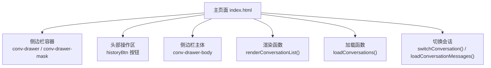
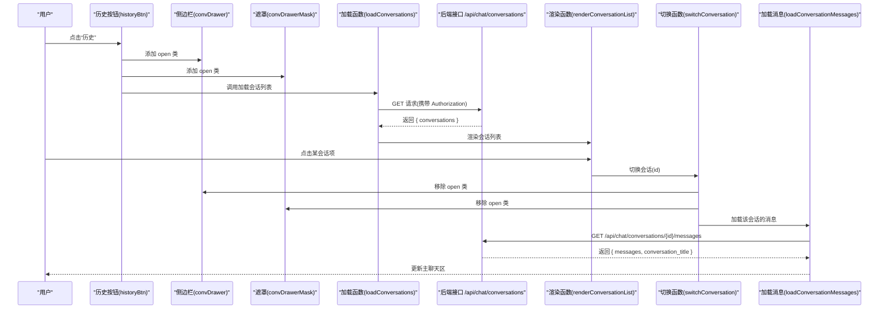
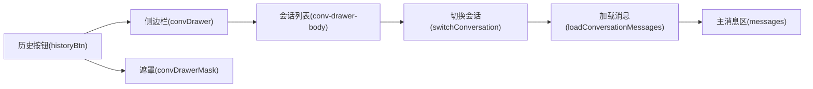

# 会话历史侧边栏

<cite>
**本文引用的文件**
- [index.html](file://hushai/meditation/static/index.html)
</cite>

## 目录
1. [引言](#引言)
2. [项目结构](#项目结构)
3. [核心组件](#核心组件)
4. [架构总览](#架构总览)
5. [详细组件分析](#详细组件分析)
6. [依赖关系分析](#依赖关系分析)
7. [性能考虑](#性能考虑)
8. [故障排查指南](#故障排查指南)
9. [结论](#结论)
10. [附录](#附录)

## 引言
本设计文档聚焦于 hush.ai 的“会话历史侧边栏”（对话历史抽屉）的 UI/UX 设计与实现说明。内容涵盖：
- 滑入滑出动画与遮罩层交互
- 会话列表展示（标题截断、日期格式化、活跃状态标识）
- 会话项交互行为（点击切换、悬停效果、选中状态）
- 空状态设计方案（提示信息文案与视觉引导）
- 搜索过滤功能的界面设计（输入框与结果高亮）
- 大量数据下的虚拟滚动优化与性能建议

该侧边栏位于主聊天界面的左侧，通过顶部“历史”按钮触发打开，用于查看并切换到已有会话。

## 项目结构
侧边栏相关的前端实现集中在单页应用的主入口文件中，包含 HTML 结构、CSS 样式与 JavaScript 逻辑。

图表来源
- [index.html:1038-1048](file://hushai/meditation/static/index.html#L1038-L1048)
- [index.html:1186-1254](file://hushai/meditation/static/index.html#L1186-L1254)

章节来源
- [index.html:1038-1048](file://hushai/meditation/static/index.html#L1038-L1048)
- [index.html:1186-1254](file://hushai/meditation/static/index.html#L1186-L1254)

## 核心组件
- 侧边栏容器与遮罩
  - 容器：固定定位在左侧，宽度 300px，默认隐藏（translateX(-100%)），添加 open 类后滑入（translateX(0)）。
  - 遮罩：全屏半透明背景，点击可关闭侧边栏。
- 头部区域
  - 标题：“对话历史”，右侧关闭按钮。
- 列表区域
  - 加载态提示、空态提示、会话项列表。
- 交互逻辑
  - 打开/关闭侧边栏
  - 拉取会话列表并渲染
  - 点击会话项切换当前会话并加载消息

章节来源
- [index.html:669-731](file://hushai/meditation/static/index.html#L669-L731)
- [index.html:1038-1048](file://hushai/meditation/static/index.html#L1038-L1048)
- [index.html:1186-1254](file://hushai/meditation/static/index.html#L1186-L1254)

## 架构总览
侧边栏的数据流与交互流程如下：

图表来源
- [index.html:1186-1254](file://hushai/meditation/static/index.html#L1186-L1254)

## 详细组件分析

### 滑入滑出动画与遮罩层交互
- 动画机制
  - 侧边栏使用 transform: translateX(-100%) 到 translateX(0) 的过渡，配合 ease-out-expo 缓动曲线，呈现顺滑滑入效果。
  - 遮罩层使用 opacity 从 0 到 1 的过渡，pointer-events 控制是否可点击。
- 交互行为
  - 点击“历史”按钮：为侧边栏和遮罩添加 open 类，同时触发加载会话列表。
  - 点击遮罩或关闭按钮：移除 open 类，侧边栏滑出。
- 无障碍与动效偏好
  - 全局支持 prefers-reduced-motion，减少动效时禁用不必要的过渡与动画。

章节来源
- [index.html:669-682](file://hushai/meditation/static/index.html#L669-L682)
- [index.html:1191-1200](file://hushai/meditation/static/index.html#L1191-L1200)
- [index.html:741-746](file://hushai/meditation/static/index.html#L741-L746)

### 会话列表展示设计
- 标题截断
  - 使用 text-overflow: ellipsis 与 white-space: nowrap 对长标题进行单行省略显示，避免破坏布局。
- 日期格式化
  - 使用 toLocaleDateString('zh-CN') 将更新时间格式化为本地化日期字符串，提升可读性。
- 活跃状态标识
  - 当会话 id 与当前会话一致时，为对应项添加 active 类，以边框与背景色区分当前会话。
- 列表结构与样式
  - 列表容器具备独立滚动条，适配移动端与桌面端。
  - 每个会话项包含标题与日期两行信息，间距与字体层级清晰。

章节来源
- [index.html:713-731](file://hushai/meditation/static/index.html#L713-L731)
- [index.html:1218-1235](file://hushai/meditation/static/index.html#L1218-L1235)

### 会话项交互行为
- 点击切换
  - 点击会话项后，先关闭侧边栏，再调用加载消息接口，并将当前会话 id 持久化到 localStorage。
- 悬停效果
  - 鼠标悬停时边框与背景变化，提供明确的交互反馈。
- 选中状态
  - 当前会话项带有 active 类，视觉上突出显示。

章节来源
- [index.html:1224-1240](file://hushai/meditation/static/index.html#L1224-L1240)

### 空状态设计方案
- 未登录
  - 若未检测到 token，显示“请先登录”提示。
- 无会话记录
  - 若后端返回空列表，显示“暂无对话记录”。
- 加载失败
  - 网络或鉴权异常时，显示“加载失败”。
- 视觉引导
  - 空态文本居中对齐，颜色与字号符合整体风格，保持界面简洁。

章节来源
- [index.html:1202-1216](file://hushai/meditation/static/index.html#L1202-L1216)
- [index.html:1218-1222](file://hushai/meditation/static/index.html#L1218-L1222)

### 搜索过滤功能（界面设计与建议）
当前实现未内置搜索过滤功能。以下为界面设计与交互建议，便于后续扩展：
- 输入框位置
  - 在侧边栏头部标题下方增加搜索输入框，保持与列表区域的视觉层次。
- 输入体验
  - 支持防抖输入（如 200ms），避免频繁重排；支持清空按钮与键盘回车快速筛选。
- 结果高亮
  - 匹配关键词在标题中进行高亮显示（例如加粗或底色标记），帮助用户快速定位。
- 空结果提示
  - 若无匹配结果，显示“未找到匹配的对话”等友好提示。
- 无障碍
  - 为输入框设置 aria-label，确保屏幕阅读器可用；高亮部分不改变语义结构。

[本节为概念性设计建议，不涉及具体源码]

### 大量会话数据的虚拟滚动优化与性能考虑
当前实现采用全量渲染，适合中小规模数据。当会话数量较大时，建议引入虚拟滚动以提升性能：
- 可视区域渲染
  - 仅渲染视口内可见的若干项，结合滚动事件动态计算偏移与高度占位。
- 高度估算
  - 为每项设置固定或估算高度，减少布局抖动；必要时异步测量真实高度并缓存。
- 增量更新
  - 新增会话时优先插入顶部，避免整表重绘；删除或更新时最小化 DOM 变更。
- 内存管理
  - 及时释放不可见项的事件监听与引用，防止内存泄漏。
- 兼容性
  - 在低性能设备上启用 reduced motion 与简化动画，保证流畅度。

[本节为通用性能建议，不涉及具体源码]

## 依赖关系分析
侧边栏模块与主界面其他部分的耦合点包括：
- 与头部按钮的绑定（打开/关闭）
- 与消息渲染函数的协作（切换会话后刷新主聊天区）
- 与认证状态的联动（未登录时的空态提示）

图表来源
- [index.html:1186-1254](file://hushai/meditation/static/index.html#L1186-L1254)

章节来源
- [index.html:1186-1254](file://hushai/meditation/static/index.html#L1186-L1254)

## 性能考虑
- 列表渲染
  - 当前使用 forEach 逐条创建节点并 appendChild，适用于少量数据；大数据场景建议虚拟滚动或分页加载。
- 事件绑定
  - 为每个会话项绑定 click 事件，注意在大量条目下可能带来额外开销；可采用事件委托至列表容器以减少监听器数量。
- 网络请求
  - 打开侧边栏即发起请求，建议在首次打开时缓存结果，并提供下拉刷新能力。
- 动画与重排
  - 使用 transform 与 opacity 进行动画，避免触发布局重排；减少不必要的样式切换。

章节来源
- [index.html:1218-1235](file://hushai/meditation/static/index.html#L1218-L1235)

## 故障排查指南
- 未登录导致无法加载
  - 现象：侧边栏显示“请先登录”。
  - 处理：检查本地 token 是否存在，确认登录流程成功。
- 鉴权过期
  - 现象：请求返回 401。
  - 处理：尝试刷新 token；若失败则清除认证并回到登录页。
- 网络错误
  - 现象：显示“加载失败”。
  - 处理：检查网络连接与后端服务可用性；重试加载。
- 列表为空
  - 现象：显示“暂无对话记录”。
  - 处理：确认后端返回的 conversations 是否为空数组。

章节来源
- [index.html:1202-1216](file://hushai/meditation/static/index.html#L1202-L1216)
- [index.html:1242-1254](file://hushai/meditation/static/index.html#L1242-L1254)

## 结论
会话历史侧边栏在当前实现中提供了清晰的滑入滑出动画、遮罩层交互、基础列表展示与切换能力。针对未来扩展，建议补充搜索过滤与虚拟滚动优化，以应对更复杂的使用场景与更大的数据规模。整体设计遵循简约、安静的视觉风格，兼顾无障碍与动效偏好，确保良好的用户体验。

## 附录
- 关键样式类名参考
  - 侧边栏容器：conv-drawer
  - 遮罩层：conv-drawer-mask
  - 列表容器：conv-drawer-body
  - 会话项：conv-item
  - 标题：conv-item-title
  - 日期：conv-item-date
  - 空态：conv-empty
  - 加载态：conv-list-loading

章节来源
- [index.html:669-731](file://hushai/meditation/static/index.html#L669-L731)