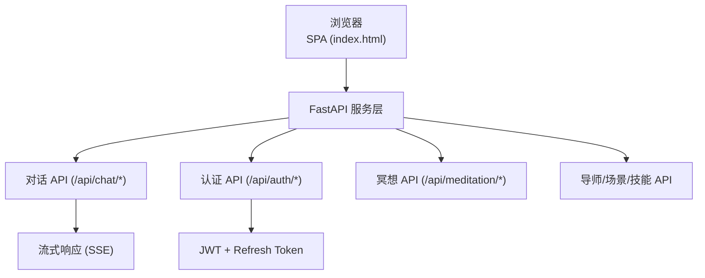
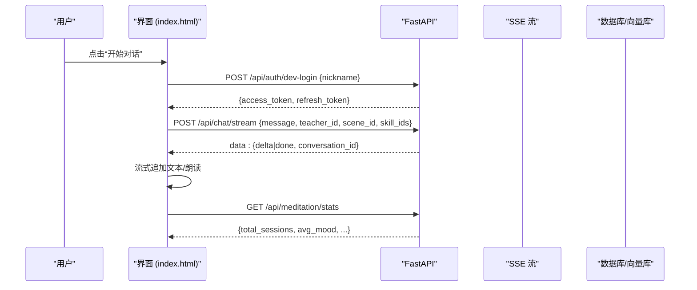
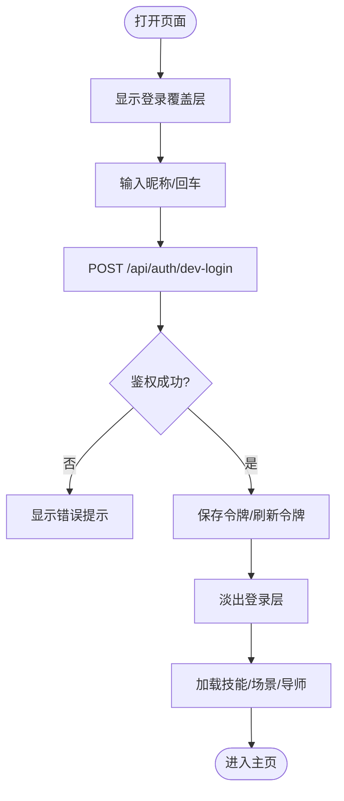
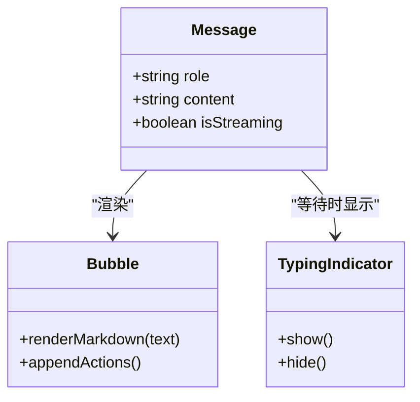
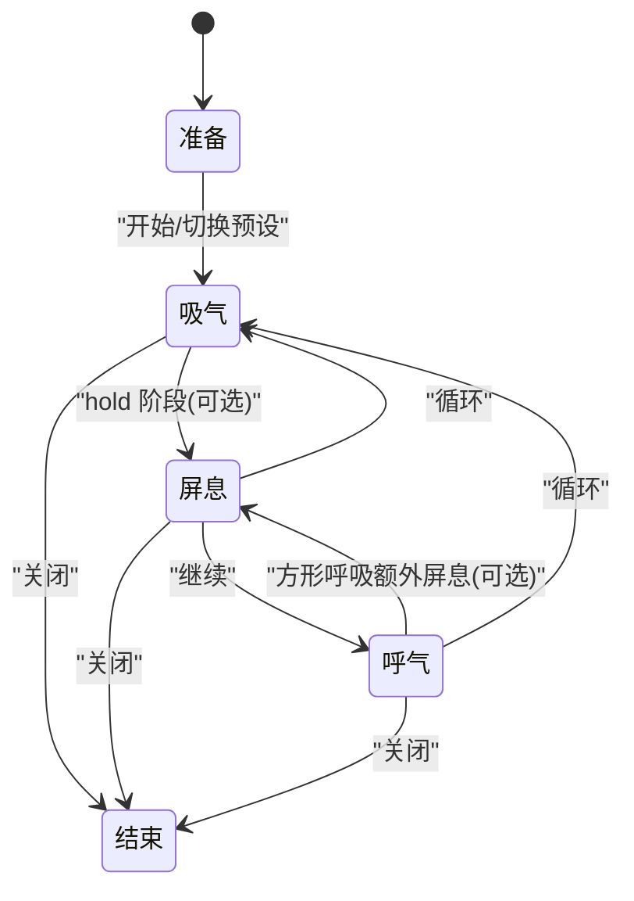
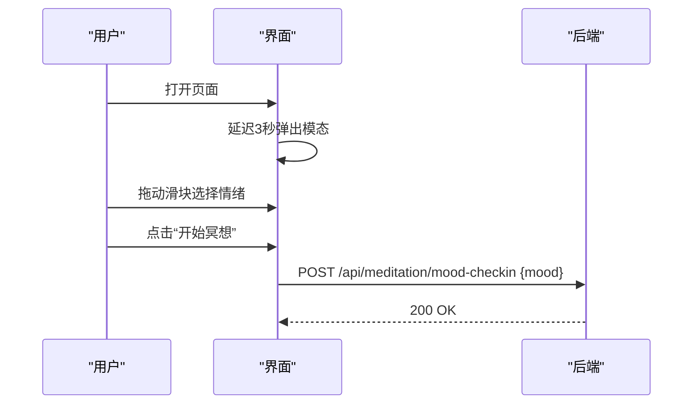
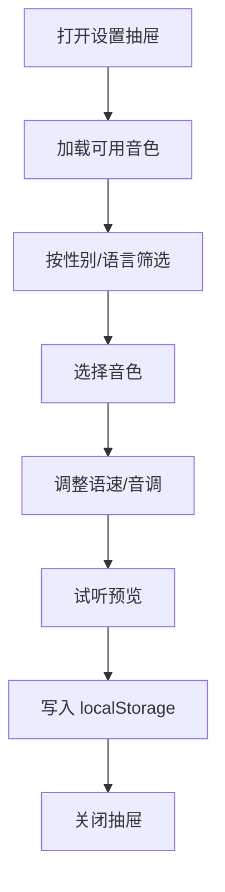
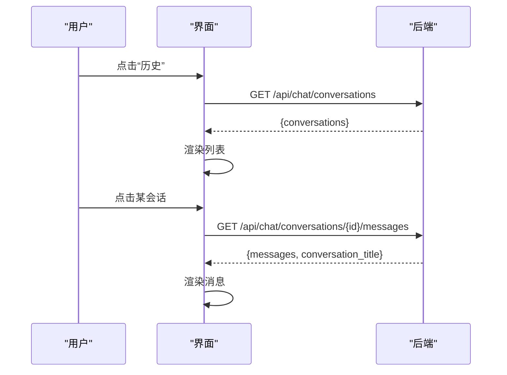
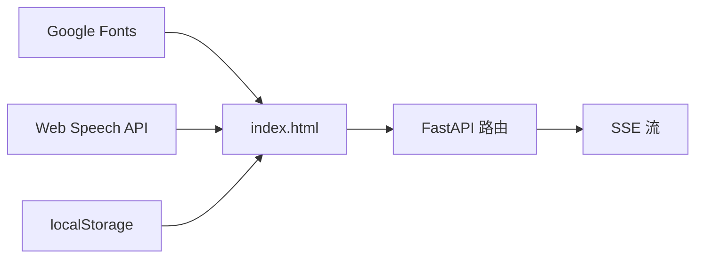

# 冥想界面设计

<cite>
**本文引用的文件**   
- [index.html](file://hushai/meditation/static/index.html)
- [README.md](file://README.md)
</cite>

## 目录
1. [引言](#引言)
2. [项目结构](#项目结构)
3. [核心组件](#核心组件)
4. [架构总览](#架构总览)
5. [详细组件分析](#详细组件分析)
6. [依赖关系分析](#依赖关系分析)
7. [性能与可访问性](#性能与可访问性)
8. [故障排查指南](#故障排查指南)
9. [结论](#结论)
10. [附录：设计规范清单](#附录设计规范清单)

## 引言
本设计文档面向 hush.ai 的冥想对话界面，聚焦禅意美学风格、色彩系统（墨色与纸张色调）、字体排版与视觉层次；并详细说明用户登录流程的品牌展示与渐进式加载动画、消息气泡规范（教师/用户区分、操作按钮、打字指示器）、呼吸练习引导界面的交互与动态反馈，以及情绪记录模态框、设置抽屉与会话历史侧边栏的实现细节。整体目标是在“安静、清明、陪伴”的情感基调下，提供低认知负荷、高可读性的冥想体验。

## 项目结构
前端为单页应用，入口为静态页面 index.html，包含样式、模板与脚本一体化实现。后端通过 FastAPI 暴露 REST/SSE 接口，前台以 Bearer Token 鉴权进行对话、进度、技能、导师等数据交互。

图表来源
- [README.md:100-132](file://README.md#L100-L132)
- [index.html:1161-1200](file://hushai/meditation/static/index.html#L1161-L1200)

章节来源
- [README.md:100-178](file://README.md#L100-L178)
- [index.html:1161-1200](file://hushai/meditation/static/index.html#L1161-L1200)

## 核心组件
- 登录覆盖层：品牌展示、情感文案、输入与错误提示、渐进式入场动画
- 头部导航：模式切换（冥想陪伴/知识库问答）、状态指示、导师选择、场景选择
- 消息区：欢迎语、教师/用户消息气泡、朗读控制、打字指示器、流式渲染
- 语音条：录音状态提示
- 输入区：自动高度、发送/语音按钮
- 设置抽屉：音色筛选、试听、语速/音调调节
- 会话历史侧边栏：列表加载、切换会话、消息回显
- 呼吸练习全屏引导：圆形动效、节奏预设、关闭控制
- 进度抽屉：统计卡片、本周进度、最近练习
- 情绪签到模态框：滑块评分、确认/跳过

章节来源
- [index.html:944-1160](file://hushai/meditation/static/index.html#L944-L1160)
- [index.html:1161-1600](file://hushai/meditation/static/index.html#L1161-L1600)
- [index.html:1600-2112](file://hushai/meditation/static/index.html#L1600-L2112)

## 架构总览
从 UI 到服务的调用路径如下：

图表来源
- [index.html:1584-1609](file://hushai/meditation/static/index.html#L1584-L1609)
- [index.html:1795-1891](file://hushai/meditation/static/index.html#L1795-L1891)
- [index.html:2025-2039](file://hushai/meditation/static/index.html#L2025-L2039)
- [README.md:182-227](file://README.md#L182-L227)

## 详细组件分析

### 禅意美学与视觉系统
- 色彩系统
  - 墨色：用于强调、主按钮、教师消息背景
  - 纸张色调：页面底色与浅色区域，营造温润质感
  - 石色系：边框、分割线、次要信息
- 字体排版
  - 标题/品牌：衬线体，优雅克制
  - 正文：中文衬线体，提升阅读舒适度
  - 标签/元信息：等宽字体，增强秩序感
- 视觉层次
  - 大留白、细线分隔、微阴影与圆角克制使用
  - 强调仅用于关键动作与当前状态
- 动效原则
  - 渐入、上移淡入、呼吸式闪烁
  - 尊重 prefers-reduced-motion，降低动效强度

章节来源
- [index.html:14-59](file://hushai/meditation/static/index.html#L14-L59)
- [index.html:82-106](file://hushai/meditation/static/index.html#L82-L106)
- [index.html:937-940](file://hushai/meditation/static/index.html#L937-L940)

### 用户登录流程（品牌展示与渐进式加载）
- 布局：左侧品牌符号与竖排大字，右侧表单与情感文案
- 动效：元素依次 fadeUp/lineGrow，营造“静水流深”的进入感
- 交互：昵称输入、回车提交、错误提示、禁用态与过渡
- 鉴权：成功后保存 token/refresh_token，隐藏覆盖层并加载功能模块

图表来源
- [index.html:944-967](file://hushai/meditation/static/index.html#L944-L967)
- [index.html:1584-1609](file://hushai/meditation/static/index.html#L1584-L1609)

章节来源
- [index.html:944-967](file://hushai/meditation/static/index.html#L944-L967)
- [index.html:1584-1609](file://hushai/meditation/static/index.html#L1584-L1609)

### 对话消息气泡规范
- 角色区分
  - 教师消息：左对齐，浅色气泡，左侧强调线，头像深色
  - 用户消息：右对齐，深色气泡，白色文字，头像浅色
- 内容渲染
  - 支持加粗、斜体、代码、链接与换行
- 操作按钮
  - 教师消息附带“朗读/停止”按钮，状态联动头部朗读指示
- 打字指示器
  - 三个点逐跳动画，表示正在生成
- 流式输出
  - 创建空气泡后增量拼接 delta，完成后补全 Markdown 与操作按钮

图表来源
- [index.html:417-462](file://hushai/meditation/static/index.html#L417-L462)
- [index.html:1694-1793](file://hushai/meditation/static/index.html#L1694-L1793)

章节来源
- [index.html:417-462](file://hushai/meditation/static/index.html#L417-L462)
- [index.html:1694-1793](file://hushai/meditation/static/index.html#L1694-L1793)

### 呼吸练习引导界面
- 全屏遮罩与居中圆形，配合 scale 与边框颜色变化表达吸气/屏息/呼气
- 三种预设：4-7-8、方形、平静，切换即重置并重新计时
- 顶部关闭按钮，底部指令文案与预设按钮组
- 无障碍：减少动效偏好下禁用 transform 过渡

图表来源
- [index.html:802-846](file://hushai/meditation/static/index.html#L802-L846)
- [index.html:1938-2008](file://hushai/meditation/static/index.html#L1938-L2008)

章节来源
- [index.html:802-846](file://hushai/meditation/static/index.html#L802-L846)
- [index.html:1938-2008](file://hushai/meditation/static/index.html#L1938-L2008)

### 情绪记录模态框
- 触发时机：登录后首次进入时延迟弹出
- 交互：滑块 1-10，实时数值显示，确认/跳过
- 数据上报：POST 情绪值至后端，失败不阻断流程

图表来源
- [index.html:1091-1108](file://hushai/meditation/static/index.html#L1091-L1108)
- [index.html:1893-1936](file://hushai/meditation/static/index.html#L1893-L1936)

章节来源
- [index.html:1091-1108](file://hushai/meditation/static/index.html#L1091-L1108)
- [index.html:1893-1936](file://hushai/meditation/static/index.html#L1893-L1936)

### 设置抽屉（语音设置）
- 音色筛选：全部/女声/男声/English，按语言与性别过滤
- 音色列表：选中高亮，支持预览播放
- 参数调节：语速、音调滑块，实时显示数值
- 恢复默认：清空本地配置并重置 UI

图表来源
- [index.html:1050-1089](file://hushai/meditation/static/index.html#L1050-L1089)
- [index.html:1440-1555](file://hushai/meditation/static/index.html#L1440-L1555)

章节来源
- [index.html:1050-1089](file://hushai/meditation/static/index.html#L1050-L1089)
- [index.html:1440-1555](file://hushai/meditation/static/index.html#L1440-L1555)

### 会话历史侧边栏
- 打开侧边栏：拉取对话列表，显示标题与更新时间
- 切换会话：请求该会话的消息列表，渲染到主消息区
- 空态与错误态：未登录、无记录、加载失败均有友好提示

图表来源
- [index.html:1038-1048](file://hushai/meditation/static/index.html#L1038-L1048)
- [index.html:1186-1267](file://hushai/meditation/static/index.html#L1186-L1267)

章节来源
- [index.html:1038-1048](file://hushai/meditation/static/index.html#L1038-L1048)
- [index.html:1186-1267](file://hushai/meditation/static/index.html#L1186-L1267)

### 进度抽屉（冥想追踪）
- 统计卡片：总次数、总时长、连续天数、平均情绪
- 本周进度：七天柱状化呈现
- 最近练习：时间、时长、情绪记录

章节来源
- [index.html:1124-1159](file://hushai/meditation/static/index.html#L1124-L1159)
- [index.html:2010-2083](file://hushai/meditation/static/index.html#L2010-L2083)

## 依赖关系分析
- 外部资源
  - Google Fonts：Cormorant Garamond、Noto Serif SC、JetBrains Mono
  - Web Speech API：语音识别与合成
- 内部依赖
  - 路由与状态：登录态、会话 ID、导师/场景/技能选择
  - 网络请求：fetch + SSE 流式读取
  - 本地存储：localStorage 持久化令牌与用户偏好

图表来源
- [index.html:10-12](file://hushai/meditation/static/index.html#L10-L12)
- [index.html:1161-1180](file://hushai/meditation/static/index.html#L1161-L1180)
- [index.html:1640-1659](file://hushai/meditation/static/index.html#L1640-L1659)

章节来源
- [index.html:10-12](file://hushai/meditation/static/index.html#L10-L12)
- [index.html:1161-1180](file://hushai/meditation/static/index.html#L1161-L1180)
- [index.html:1640-1659](file://hushai/meditation/static/index.html#L1640-L1659)

## 性能与可访问性
- 性能
  - 流式渲染避免长轮询阻塞，首字可见更快
  - 减少重绘：批量更新 DOM、按需渲染
  - 图片/图标采用内联 SVG，减少请求
- 可访问性
  - 语义化标签与 aria-live 播报新增消息
  - focus-visible 轮廓清晰，键盘可操作
  - 尊重 prefers-reduced-motion，禁用不必要动画

章节来源
- [index.html:1011-1016](file://hushai/meditation/static/index.html#L1011-L1016)
- [index.html:736-746](file://hushai/meditation/static/index.html#L736-L746)
- [index.html:937-940](file://hushai/meditation/static/index.html#L937-L940)

## 故障排查指南
- 登录失败或过期
  - 现象：无法获取 token 或 401 错误
  - 处理：自动尝试刷新 token；失败则清除本地令牌并回到登录页
- 网络异常或服务不可用
  - 现象：对话返回错误、进度加载失败
  - 处理：显示友好提示，允许重试
- 语音不可用
  - 现象：无法录音或朗读
  - 处理：检测浏览器能力，降级为纯文本交互
- 流式中断
  - 现象：SSE 提前结束
  - 处理：兜底显示已接收文本，提示稍后再试

章节来源
- [index.html:1611-1637](file://hushai/meditation/static/index.html#L1611-L1637)
- [index.html:1823-1891](file://hushai/meditation/static/index.html#L1823-L1891)
- [index.html:1640-1659](file://hushai/meditation/static/index.html#L1640-L1659)

## 结论
本界面以“墨色与纸张”的极简禅意为基调，通过克制的动效与清晰的视觉层次，构建安静、专注的冥想对话体验。登录流程强调品牌与情感连接，消息气泡兼顾可读性与可操作性，呼吸练习提供直观的动态反馈。结合进度与情绪记录，形成完整的正念闭环。后续可在多端适配、主题扩展与更丰富的可视化方面持续演进。

## 附录：设计规范清单
- 色彩
  - 墨色：强调、主按钮、教师消息背景
  - 纸张：页面底色、浅色区块
  - 石系：边框、分割线、次要信息
- 字体
  - 标题/品牌：Cormorant Garamond/Noto Serif SC
  - 正文：Noto Serif SC
  - 标签/元信息：JetBrains Mono
- 间距与网格
  - 统一 8px 基准，内容区最大宽度 560px
- 动效
  - fadeUp、lineGrow、breathe、msgAppear
  - 尊重 reduced motion
- 组件
  - 登录覆盖层、消息气泡、打字指示器、设置抽屉、会话历史侧边栏、呼吸练习全屏、进度抽屉、情绪模态框

章节来源
- [index.html:14-59](file://hushai/meditation/static/index.html#L14-L59)
- [index.html:82-106](file://hushai/meditation/static/index.html#L82-L106)
- [index.html:736-746](file://hushai/meditation/static/index.html#L736-L746)