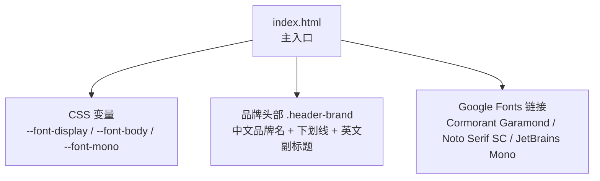
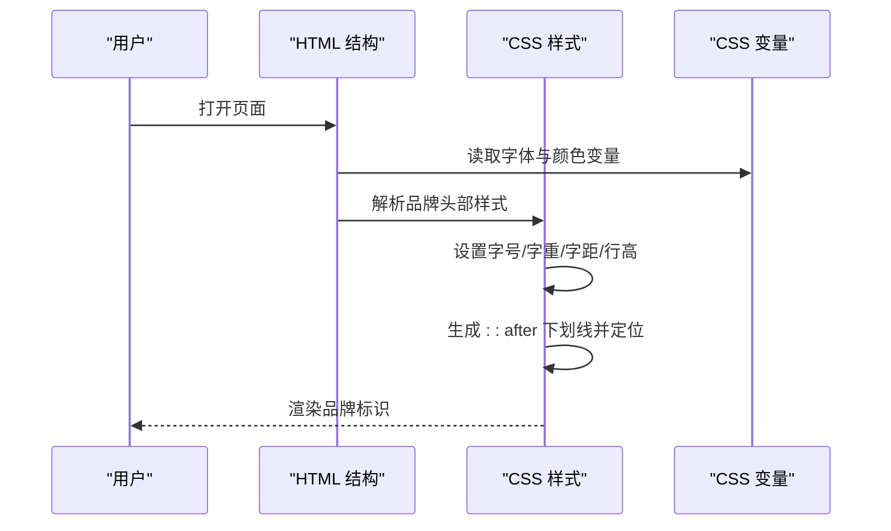
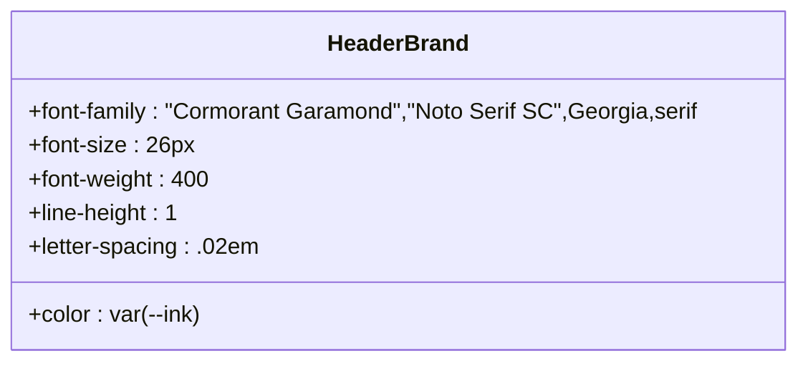
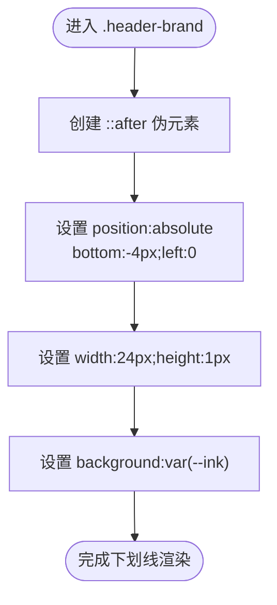
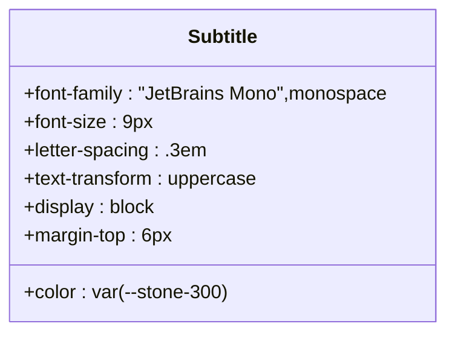
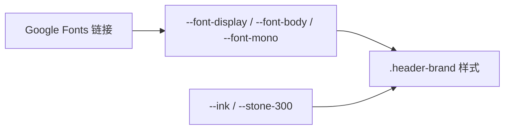

# 品牌标识设计

<cite>
**本文引用的文件**
- [hushai/meditation/static/index.html](file://hushai/meditation/static/index.html)
</cite>

## 目录
1. [引言](#引言)
2. [项目结构](#项目结构)
3. [核心组件](#核心组件)
4. [架构总览](#架构总览)
5. [详细组件分析](#详细组件分析)
6. [依赖关系分析](#依赖关系分析)
7. [性能与可访问性](#性能与可访问性)
8. [故障排查指南](#故障排查指南)
9. [结论](#结论)

## 引言
本设计文档聚焦 hush.ai 的品牌标识区域，围绕中文品牌名“小观”的字体、字号与字重规范，下划线装饰的实现细节，以及英文副标题“small view”的排版规则进行系统化说明。同时给出响应式适配策略、色彩系统应用与可访问性建议，确保在不同屏幕尺寸与设备环境下保持视觉一致性与可读性。

## 项目结构
品牌标识相关样式与结构集中在前端入口页面中，采用内联样式组织，便于快速迭代与统一管控。关键资源包括：
- 字体加载：通过 Google Fonts 引入 Cormorant Garamond、Noto Serif SC、JetBrains Mono
- CSS 变量：集中定义展示字体、正文字体、等宽字体及颜色体系
- 品牌头部区域：包含品牌名称、下划线装饰与英文副标题

图表来源
- [hushai/meditation/static/index.html:1-12](file://hushai/meditation/static/index.html#L1-L12)
- [hushai/meditation/static/index.html:24-45](file://hushai/meditation/static/index.html#L24-L45)
- [hushai/meditation/static/index.html:252-263](file://hushai/meditation/static/index.html#L252-L263)

章节来源
- [hushai/meditation/static/index.html:1-12](file://hushai/meditation/static/index.html#L1-L12)
- [hushai/meditation/static/index.html:24-45](file://hushai/meditation/static/index.html#L24-L45)
- [hushai/meditation/static/index.html:252-263](file://hushai/meditation/static/index.html#L252-L263)

## 核心组件
- 品牌名称“小观”
  - 字体族：优先使用 Cormorant Garamond，回退到 Noto Serif SC，再回退到 Georgia/serif
  - 字号：26px
  - 字重：400
  - 行高：紧凑（line-height: 1），字距微调（letter-spacing: .02em）
- 下划线装饰
  - 使用伪元素 ::after 实现
  - 定位：absolute，bottom: -4px，left: 0
  - 尺寸：width: 24px，height: 1px
  - 颜色：与品牌墨色一致（var(--ink)）
- 英文副标题“small view”
  - 字体族：JetBrains Mono（等宽）
  - 字号：9px
  - 字母间距：.3em
  - 文本转换：uppercase（大写）
  - 颜色：浅灰（var(--stone-300)）
  - 布局：块级显示，位于品牌名下方，顶部外边距 6px

章节来源
- [hushai/meditation/static/index.html:252-263](file://hushai/meditation/static/index.html#L252-L263)
- [hushai/meditation/static/index.html:24-45](file://hushai/meditation/static/index.html#L24-L45)

## 架构总览
品牌标识在页面中的渲染流程如下：
- HTML 结构提供品牌容器与子元素（中文品牌名与英文副标题）
- CSS 变量定义字体与颜色
- 样式规则控制字号、字重、字距、行高与装饰线
- 伪元素生成下划线装饰，绝对定位至品牌名底部

图表来源
- [hushai/meditation/static/index.html:252-263](file://hushai/meditation/static/index.html#L252-L263)
- [hushai/meditation/static/index.html:24-45](file://hushai/meditation/static/index.html#L24-L45)

## 详细组件分析

### 品牌名称“小观”
- 字体选择
  - 首选：Cormorant Garamond（优雅衬线）
  - 次选：Noto Serif SC（中文衬线）
  - 回退：Georgia/serif
- 字号与字重
  - 字号：26px
  - 字重：400（常规）
- 排版细节
  - 行高：1（紧凑）
  - 字距：.02em（轻微收紧）
  - 颜色：墨色（var(--ink)）

图表来源
- [hushai/meditation/static/index.html:252-255](file://hushai/meditation/static/index.html#L252-L255)
- [hushai/meditation/static/index.html:24-45](file://hushai/meditation/static/index.html#L24-L45)

章节来源
- [hushai/meditation/static/index.html:252-255](file://hushai/meditation/static/index.html#L252-L255)
- [hushai/meditation/static/index.html:24-45](file://hushai/meditation/static/index.html#L24-L45)

### 下划线装饰效果
- 实现方式
  - 使用 ::after 伪元素创建一条细线
- 位置与尺寸
  - bottom: -4px（相对父元素底部向下偏移）
  - left: 0（左对齐）
  - width: 24px（短横线）
  - height: 1px（极细线）
- 颜色
  - background: var(--ink)（与品牌墨色一致）

图表来源
- [hushai/meditation/static/index.html:257-259](file://hushai/meditation/static/index.html#L257-L259)

章节来源
- [hushai/meditation/static/index.html:257-259](file://hushai/meditation/static/index.html#L257-L259)

### 英文副标题“small view”
- 字体选择
  - JetBrains Mono（等宽）
- 字号与字距
  - 字号：9px
  - 字母间距：.3em（宽松）
- 文本转换
  - uppercase（全大写）
- 颜色与布局
  - 颜色：浅灰（var(--stone-300)）
  - 布局：display:block；margin-top:6px（置于品牌名下方）

图表来源
- [hushai/meditation/static/index.html:260-263](file://hushai/meditation/static/index.html#L260-L263)

章节来源
- [hushai/meditation/static/index.html:260-263](file://hushai/meditation/static/index.html#L260-L263)

### 响应式适配方案
- 当前状态
  - 品牌头部未针对 .header-brand 单独设置媒体查询断点
  - 整体页面存在移动端适配（如登录页在小屏下的布局调整），但品牌标识本身未显式缩放
- 建议策略
  - 在小屏（例如 max-width: 480px）将字号从 26px 降至 22px，保持可读性
  - 缩短下划线宽度为 18px，避免在小屏上显得过长
  - 副标题字号维持 9px，但可适当增加 letter-spacing 至 .35em 提升辨识度
  - 若需要更精细控制，可使用 clamp() 动态计算字号，保证在大屏与小屏间平滑过渡

[本节为概念性建议，不直接分析具体代码文件]

## 依赖关系分析
- 外部字体依赖
  - Google Fonts 引入 Cormorant Garamond、Noto Serif SC、JetBrains Mono
- 内部样式依赖
  - CSS 变量 --font-display、--font-body、--font-mono 被品牌标识复用
  - 颜色变量 --ink、--stone-300 用于品牌墨色与副标题浅灰

图表来源
- [hushai/meditation/static/index.html:1-12](file://hushai/meditation/static/index.html#L1-L12)
- [hushai/meditation/static/index.html:24-45](file://hushai/meditation/static/index.html#L24-L45)
- [hushai/meditation/static/index.html:252-263](file://hushai/meditation/static/index.html#L252-L263)

章节来源
- [hushai/meditation/static/index.html:1-12](file://hushai/meditation/static/index.html#L1-L12)
- [hushai/meditation/static/index.html:24-45](file://hushai/meditation/static/index.html#L24-L45)
- [hushai/meditation/static/index.html:252-263](file://hushai/meditation/static/index.html#L252-L263)

## 性能与可访问性
- 性能
  - 字体加载：使用 preconnect 与 display=swap 优化首屏体验
  - 伪元素绘制：::after 仅绘制 1px 线条，开销极低
- 可访问性
  - 对比度：品牌墨色与浅色背景具备良好对比度
  - 焦点可见性：全局 :focus-visible 提供清晰焦点指示
  - 动画偏好：支持 prefers-reduced-motion，减少不必要的动效

章节来源
- [hushai/meditation/static/index.html:1-12](file://hushai/meditation/static/index.html#L1-L12)
- [hushai/meditation/static/index.html:736-746](file://hushai/meditation/static/index.html#L736-L746)

## 故障排查指南
- 问题：下划线未显示或错位
  - 检查 .header-brand 是否设置了 position:relative（伪元素基于此定位）
  - 确认 ::after 的 bottom、left、width、height 值未被覆盖
- 问题：英文副标题不可见或重叠
  - 检查 display:block 与 margin-top 是否生效
  - 确认 color 与背景对比度足够
- 问题：字体未正确加载
  - 验证 Google Fonts 链接是否可用
  - 检查浏览器缓存与网络请求

章节来源
- [hushai/meditation/static/index.html:252-263](file://hushai/meditation/static/index.html#L252-L263)
- [hushai/meditation/static/index.html:1-12](file://hushai/meditation/static/index.html#L1-L12)

## 结论
品牌标识通过清晰的字体层级、精确的字号与字重、以及简洁的下划线装饰，构建了稳定且易识别的视觉锚点。英文副标题以等宽字体与大写字母间距强化技术感与克制感。建议在后续迭代中补充针对小屏的响应式规则，以确保在所有设备上保持一致的视觉与可读性表现。