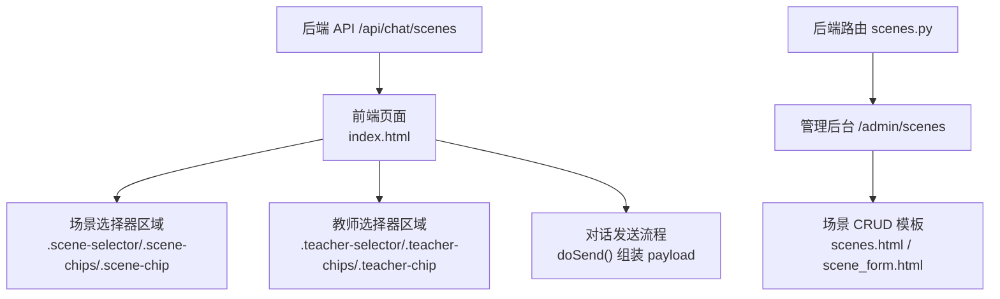
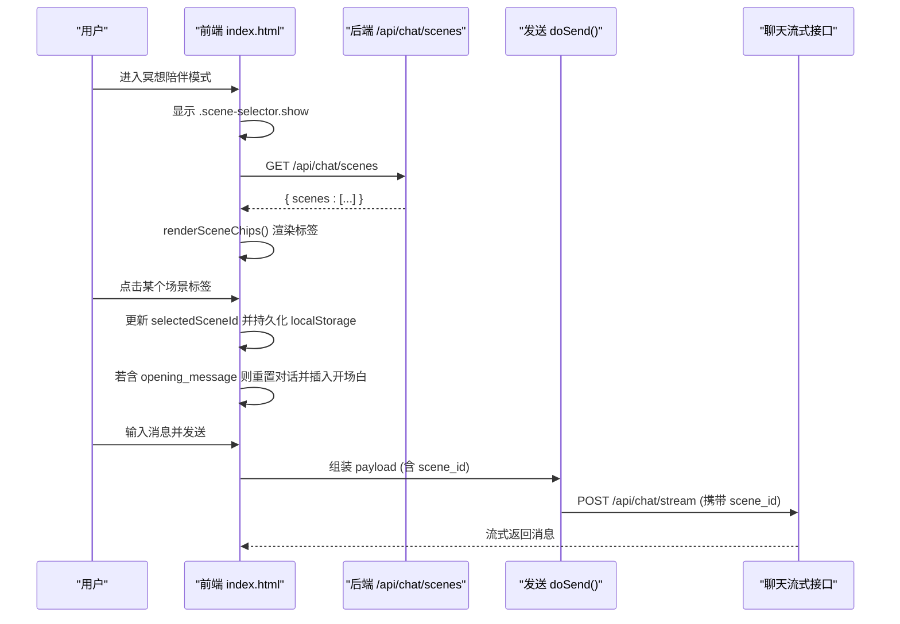
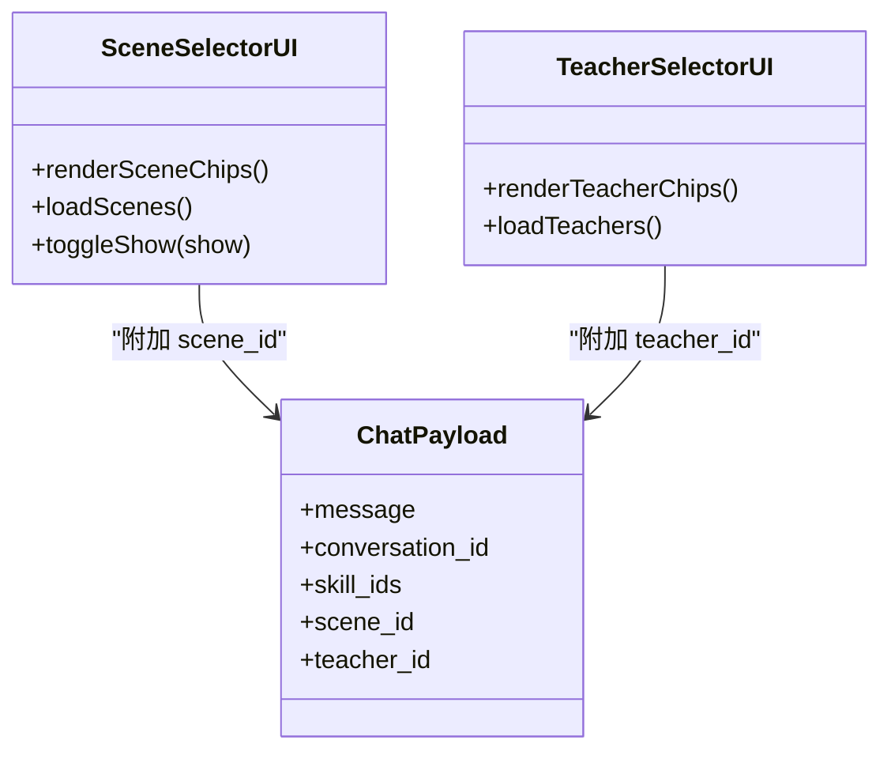

# 场景选择器

<cite>
**本文引用的文件**   
- [index.html](file://hushai/meditation/static/index.html)
- [scenes.py](file://hushai/meditation/admin/pages/scenes.py)
- [scenes.html](file://hushai/meditation/admin/templates/scenes.html)
</cite>

## 目录
1. [简介](#简介)
2. [项目结构](#项目结构)
3. [核心组件](#核心组件)
4. [架构总览](#架构总览)
5. [详细组件分析](#详细组件分析)
6. [依赖关系分析](#依赖关系分析)
7. [性能与可访问性](#性能与可访问性)
8. [故障排查指南](#故障排查指南)
9. [结论](#结论)

## 简介
本设计文档聚焦于 hush.ai 的“场景选择器”组件，面向 UI/UX 设计与实现细节。内容涵盖：
- 场景标签的视觉样式（圆角矩形容器、边框、背景色）
- 动画效果（::before 伪元素的 scaleX 变换、transform-origin、transition）
- 交互状态（默认、悬停、激活）
- 布局策略（flex-wrap 换行、间距、max-width）
- 展开动画（fadeUp 0.4s）以及与教师选择器的联动
- 数据动态加载、用户选择与状态同步机制

## 项目结构
场景选择器位于前端主页面中，包含 CSS 样式与内联脚本逻辑；后端提供场景数据接口与管理界面。

图表来源
- [index.html:331-361](file://hushai/meditation/static/index.html#L331-L361)
- [index.html:991-998](file://hushai/meditation/static/index.html#L991-L998)
- [index.html:1280-1315](file://hushai/meditation/static/index.html#L1280-L1315)
- [index.html:1799-1810](file://hushai/meditation/static/index.html#L1799-L1810)
- [scenes.py:39-60](file://hushai/meditation/admin/pages/scenes.py#L39-L60)
- [scenes.html:1-133](file://hushai/meditation/admin/templates/scenes.html#L1-L133)

章节来源
- [index.html:331-361](file://hushai/meditation/static/index.html#L331-L361)
- [index.html:991-998](file://hushai/meditation/static/index.html#L991-L998)
- [index.html:1280-1315](file://hushai/meditation/static/index.html#L1280-L1315)
- [index.html:1799-1810](file://hushai/meditation/static/index.html#L1799-L1810)
- [scenes.py:39-60](file://hushai/meditation/admin/pages/scenes.py#L39-L60)
- [scenes.html:1-133](file://hushai/meditation/admin/templates/scenes.html#L1-L133)

## 核心组件
- 容器与标题
  - 容器：.scene-selector，顶部有分隔线，默认隐藏，通过 .show 显示并触发 fadeUp 动画
  - 标题：.scene-label，小字号、等宽字体、大写、浅灰文字
- 标签列表与标签项
  - 列表：.scene-chips，使用 flex + flex-wrap 换行，gap 为 6px
  - 标签：.scene-chip，圆角矩形容器（由父级 overflow 与子级 ::before 共同营造），边框 var(--stone-200)，背景 var(--paper)，文字 var(--stone-500)
  - 激活态：.scene-chip.active，背景透明，文字白色 var(--paper)，边框深色 var(--ink)，并通过 ::before 填充背景
- 动画与过渡
  - 容器展开：animation: fadeUp 0.4s cubic-bezier(0.16,1,0.3,1) both
  - 标签悬停：border-color 加深至 var(--stone-400)，文字变黑 var(--ink)
  - 标签激活：::before 从 scaleX(0) 到 scaleX(1)，transform-origin: left，过渡时间 0.35s，缓动 cubic-bezier(0.16,1,0.3,1)
  - 整体 transition：all 0.3s cubic-bezier(0.25,1,0.5,1)

章节来源
- [index.html:331-361](file://hushai/meditation/static/index.html#L331-L361)

## 架构总览
场景选择器在前端负责渲染与交互，在用户切换模式或登录成功后加载场景数据，并在发送消息时将所选场景 ID 附加到请求载荷中。

图表来源
- [index.html:1269-1278](file://hushai/meditation/static/index.html#L1269-L1278)
- [index.html:1280-1315](file://hushai/meditation/static/index.html#L1280-L1315)
- [index.html:1799-1810](file://hushai/meditation/static/index.html#L1799-L1810)

## 详细组件分析

### 视觉设计与样式规范
- 容器与排版
  - 容器外边距与上边框：margin-top: 14px; padding-top: 14px; border-top: 1px solid var(--stone-100)
  - 标题：font-family: var(--font-mono); font-size: 9px; letter-spacing: .2em; color: var(--stone-400); text-transform: uppercase; margin-bottom: 10px
- 标签容器
  - 布局：display: flex; flex-wrap: wrap; gap: 6px
  - 标签项：padding: 5px 14px; border: 1px solid var(--stone-200); background: var(--paper); color: var(--stone-500); font-size: 12px; max-width: 100%; position: relative; overflow: hidden
  - 圆角说明：当前样式未显式设置 border-radius，但通过相对定位与溢出隐藏配合 ::before 可实现“填充式”激活效果；如需更明显的圆角，可在 .scene-chip 增加统一圆角值
- 颜色体系
  - 默认文本：var(--stone-500)
  - 悬停文本：var(--ink)
  - 激活文本：var(--paper)
  - 边框默认：var(--stone-200)
  - 边框悬停：var(--stone-400)
  - 边框激活：var(--ink)
  - 背景默认：var(--paper)
  - 背景激活：transparent（由 ::before 填充）

章节来源
- [index.html:331-361](file://hushai/meditation/static/index.html#L331-L361)

### 动画与过渡实现
- 容器展开动画
  - 关键帧：@keyframes fadeUp{ from{ opacity:0; transform:translateY(24px) } to{ opacity:1; transform:translateY(0) } }
  - 应用：.scene-selector{ animation: fadeUp .4s var(--ease-out-expo) both }
  - 显示控制：.scene-selector.show{ display:block }
- 标签项过渡
  - 通用过渡：transition: all .3s var(--ease-out-quart)
  - 悬停：border-color 加深，color 变深
  - 激活：::before 背景从 scaleX(0) 到 scaleX(1)，transform-origin: left，transition: transform .35s var(--ease-out-expo)
- 无障碍与减少动画
  - prefers-reduced-motion: reduce 时禁用相关过渡与动画，确保体验一致

章节来源
- [index.html:82-86](file://hushai/meditation/static/index.html#L82-L86)
- [index.html:331-361](file://hushai/meditation/static/index.html#L331-L361)
- [index.html:741-746](file://hushai/meditation/static/index.html#L741-L746)

### 交互状态定义
- 默认状态
  - 背景：var(--paper)
  - 文字：var(--stone-500)
  - 边框：var(--stone-200)
- 悬停状态
  - 边框：var(--stone-400)
  - 文字：var(--ink)
- 激活状态
  - 背景：transparent（由 ::before 填充）
  - 文字：var(--paper)
  - 边框：var(--ink)
  - 伪元素：::before 完全展开（scaleX(1)）

章节来源
- [index.html:331-361](file://hushai/meditation/static/index.html#L331-L361)

### 布局策略
- 换行与间距
  - 使用 flex-wrap: wrap 自动换行
  - 标签间间距 gap: 6px
- 宽度限制
  - 单个标签 max-width: 100% 防止溢出
  - 容器宽度受父级 app 约束（最大 560px），在小屏下自适应

章节来源
- [index.html:331-361](file://hushai/meditation/static/index.html#L331-L361)

### 与教师选择器的联动
- 显示时机
  - 切换到“冥想陪伴”模式时，显示 .scene-selector.show
  - 切换到“知识库问答”模式时，隐藏 .scene-selector
- 教师选择器
  - 教师选择器同样采用 fadeUp 0.4s 展开动画
  - 两者并列展示，互不干扰，但都受模式切换影响

章节来源
- [index.html:301-305](file://hushai/meditation/static/index.html#L301-L305)
- [index.html:331-361](file://hushai/meditation/static/index.html#L331-L361)
- [index.html:1269-1278](file://hushai/meditation/static/index.html#L1269-L1278)

### 数据加载与渲染
- 数据源
  - 前端调用 GET /api/chat/scenes 获取场景列表
- 渲染逻辑
  - 遍历 scenes 数组，为每个场景创建按钮元素，添加 class scene-chip 与 active（当 id 匹配 selectedSceneId）
  - 将按钮插入 #sceneChips 容器
- 初始显示
  - 若返回场景数量大于 0，则给 .scene-selector 添加 show 类以触发展开动画

章节来源
- [index.html:1280-1287](file://hushai/meditation/static/index.html#L1280-L1287)
- [index.html:1289-1315](file://hushai/meditation/static/index.html#L1289-L1315)

### 用户选择与状态同步
- 本地持久化
  - selectedSceneId 初始化自 localStorage.ll_scene_id
  - 切换场景时写入或移除 ll_scene_id
- 会话行为
  - 选中场景且存在 opening_message 时，重置对话并插入开场消息
  - 取消选中时，重置对话
- 发送消息
  - 在非知识库模式下，payload 中包含 scene_id（若已选择）

章节来源
- [index.html:1183-1184](file://hushai/meditation/static/index.html#L1183-L1184)
- [index.html:1296-1315](file://hushai/meditation/static/index.html#L1296-L1315)
- [index.html:1799-1810](file://hushai/meditation/static/index.html#L1799-L1810)

### 管理后台与数据维护
- 管理入口
  - 管理员可通过 /admin/scenes 查看、搜索、新建、编辑、删除场景
- 字段与排序
  - 支持名称、slug、描述、系统提示、开场消息、排序权重、启用状态
- 列表展示
  - 按 sort_order 升序与 created_at 降序排列，分页展示

章节来源
- [scenes.py:39-60](file://hushai/meditation/admin/pages/scenes.py#L39-L60)
- [scenes.html:1-133](file://hushai/meditation/admin/templates/scenes.html#L1-L133)

## 依赖关系分析
- 前端依赖
  - DOM 节点：#sceneSelector、#sceneChips
  - 全局变量：selectedSceneId、allScenes
  - 事件：模式切换按钮、场景标签点击
- 后端依赖
  - 接口：/api/chat/scenes（场景列表）
  - 管理接口：/admin/scenes（列表、新增、编辑、删除）

图表来源
- [index.html:1280-1315](file://hushai/meditation/static/index.html#L1280-L1315)
- [index.html:1799-1810](file://hushai/meditation/static/index.html#L1799-L1810)

章节来源
- [index.html:1280-1315](file://hushai/meditation/static/index.html#L1280-L1315)
- [index.html:1799-1810](file://hushai/meditation/static/index.html#L1799-L1810)

## 性能与可访问性
- 性能
  - 使用 CSS 过渡与 transform 提升动画性能，避免重排重绘
  - 列表渲染仅在数据变化时重建，减少不必要的 DOM 操作
- 可访问性
  - 按钮语义：使用 button 元素，具备焦点与键盘可达性
  - 减少动画：prefers-reduced-motion 下禁用过渡与动画
  - 提示文本：选中场景时设置 title 为 description 或 name，便于屏幕阅读器理解

章节来源
- [index.html:741-746](file://hushai/meditation/static/index.html#L741-L746)
- [index.html:1294-1295](file://hushai/meditation/static/index.html#L1294-L1295)

## 故障排查指南
- 场景列表为空
  - 检查 /api/chat/scenes 是否返回空数组；确认后端已创建并启用场景
- 无法显示场景选择器
  - 确认处于“冥想陪伴”模式；检查 .scene-selector.show 是否正确添加
- 选择后未生效
  - 检查 selectedSceneId 是否写入 localStorage；确认发送 payload 时包含 scene_id
- 动画异常
  - 检查浏览器是否启用了减少动画偏好；确认 keyframes 与 transition 未被覆盖

章节来源
- [index.html:1280-1287](file://hushai/meditation/static/index.html#L1280-L1287)
- [index.html:1269-1278](file://hushai/meditation/static/index.html#L1269-L1278)
- [index.html:1799-1810](file://hushai/meditation/static/index.html#L1799-L1810)

## 结论
场景选择器通过简洁的视觉语言与流畅的动画反馈，提供了清晰的选择路径。其布局与交互遵循一致的样式规范，并与教师选择器和对话发送流程紧密协作。通过本地持久化与后端数据联动，实现了稳定的状态同步与良好的用户体验。