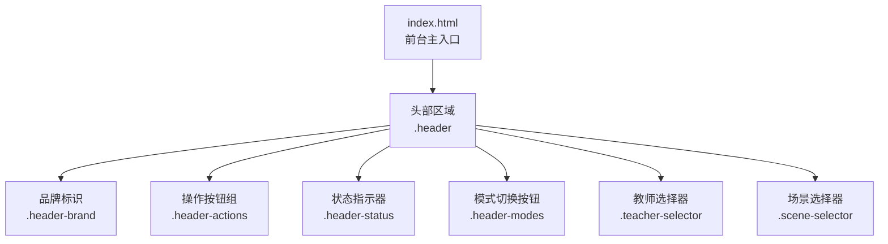
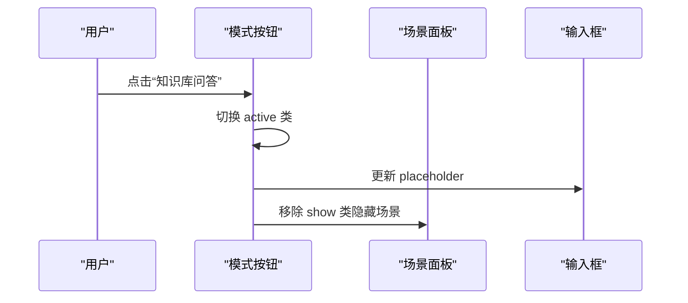
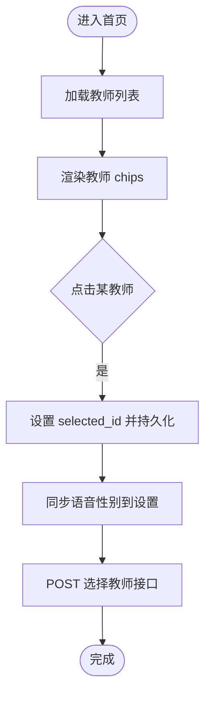
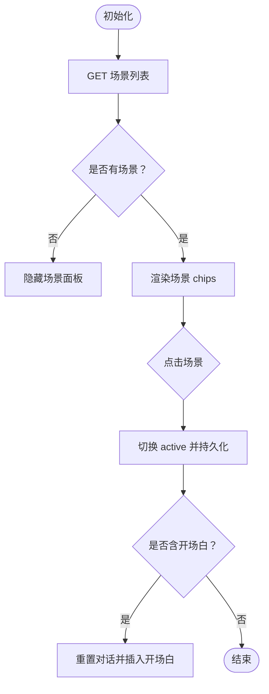
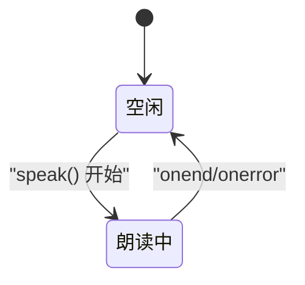
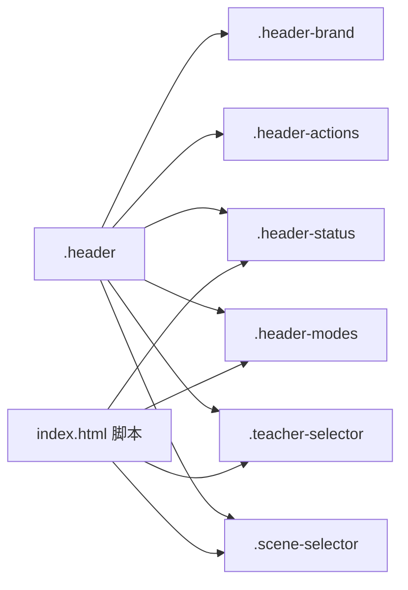
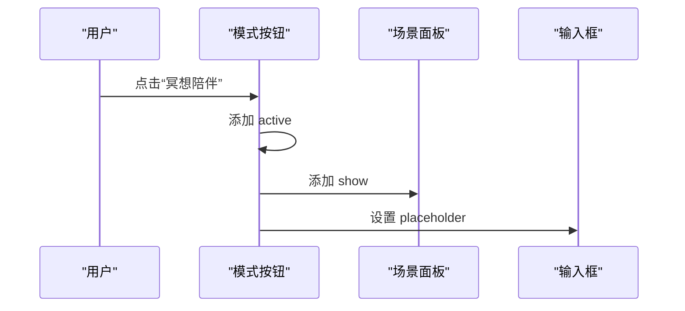
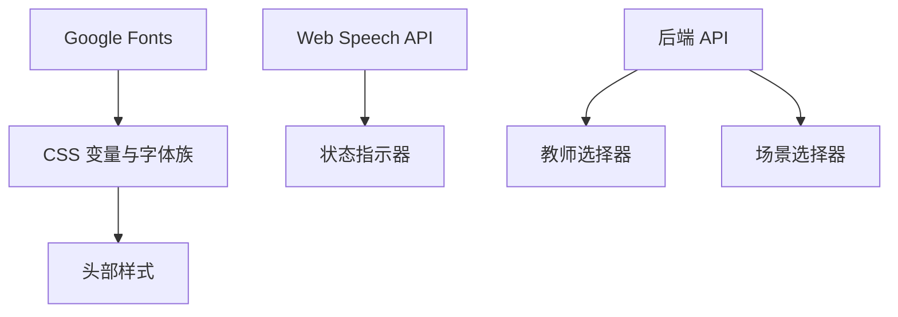

# 头部导航设计

<cite>
**本文引用的文件**
- [hushai/meditation/static/index.html](file://hushai/meditation/static/index.html)
</cite>

## 目录
1. [引言](#引言)
2. [项目结构](#项目结构)
3. [核心组件](#核心组件)
4. [架构总览](#架构总览)
5. [详细组件分析](#详细组件分析)
6. [依赖关系分析](#依赖关系分析)
7. [性能与可访问性](#性能与可访问性)
8. [故障排查指南](#故障排查指南)
9. [结论](#结论)

## 引言
本设计文档聚焦 hush.ai 前台 SPA 的“头部导航区域”，围绕品牌标识、模式切换按钮、教师选择器、场景选择器、状态指示器以及响应式布局进行系统化说明。目标是帮助设计师与前端工程师在统一的设计语言下，实现一致、可维护且无障碍的前端体验。

## 项目结构
- 前台主入口为单页应用，所有样式与交互逻辑集中在一个 HTML 文件中，包含内联 CSS 与 JavaScript。
- 头部导航位于页面顶部，包含品牌标识、操作按钮、连接/说话状态、模式切换、教师与场景选择等模块。

图表来源
- [hushai/meditation/static/index.html:236-362](file://hushai/meditation/static/index.html#L236-L362)

章节来源
- [hushai/meditation/static/index.html:236-362](file://hushai/meditation/static/index.html#L236-L362)

## 核心组件
本节对头部区域的各子组件进行拆解，涵盖视觉规范、交互行为与数据流。

### 品牌标识（Header Brand）
- 字体与字号
  - 展示字体：Cormorant Garamond / Noto Serif SC（衬线体），用于品牌名与小标题。
  - 辅助字体：JetBrains Mono（等宽体），用于英文副标与标签。
  - 字号：品牌名约 26px；副标约 9px，全大写，字距加宽。
- 下划线装饰
  - 使用伪元素在品牌名下方绘制短横线，宽度固定，颜色与墨色一致，营造编辑风格。
- 层级与间距
  - 品牌名与副标之间保留行高与上边距，确保呼吸感。
- 可访问性
  - 作为纯展示文本，无需额外 role；保持语义清晰即可。

章节来源
- [hushai/meditation/static/index.html:252-263](file://hushai/meditation/static/index.html#L252-L263)

### 模式切换按钮（Mode Buttons）
- 模式定义
  - 冥想陪伴：默认模式，支持教师与场景联动。
  - 知识库问答：隐藏场景选择，输入提示文案变化。
- 视觉状态
  - 未选中：透明背景 + 细边框 + 浅灰文字。
  - 悬停：边框加深，文字变深。
  - 激活：反色填充（深色背景 + 浅色文字）。
- 交互行为
  - 点击切换 active 类，同时更新输入框占位符与场景面板显隐。
  - 通过 JS 控制 .mode-btn.active 与 .scene-selector.show。
- 动画与过渡
  - 使用缓动曲线与 transition 实现平滑切换。

图表来源
- [hushai/meditation/static/index.html:289-298](file://hushai/meditation/static/index.html#L289-L298)
- [hushai/meditation/static/index.html:1269-1278](file://hushai/meditation/static/index.html#L1269-L1278)

章节来源
- [hushai/meditation/static/index.html:289-298](file://hushai/meditation/static/index.html#L289-L298)
- [hushai/meditation/static/index.html:1269-1278](file://hushai/meditation/static/index.html#L1269-L1278)

### 教师选择器（Teacher Selector）
- 数据结构
  - 列表项包含头像首字符、名称、描述信息。
- 界面呈现
  - 标签：“冥想搭子”。
  - 卡片式 chip：左侧圆形头像（首字符），右侧两行信息（名称 + 描述）。
  - 选中态：边框加深、背景微暖、头像深色。
- 交互行为
  - 点击后调用后端接口保存所选教师，并同步语音性别偏好。
  - 若教师配置了语音性别，自动更新音色筛选与列表。
- 数据来源
  - 登录后加载教师列表，渲染 chips，并持久化当前选择。

图表来源
- [hushai/meditation/static/index.html:301-329](file://hushai/meditation/static/index.html#L301-L329)
- [hushai/meditation/static/index.html:1372-1434](file://hushai/meditation/static/index.html#L1372-L1434)

章节来源
- [hushai/meditation/static/index.html:301-329](file://hushai/meditation/static/index.html#L301-L329)
- [hushai/meditation/static/index.html:1372-1434](file://hushai/meditation/static/index.html#L1372-L1434)

### 场景选择器（Scene Selector）
- 界面呈现
  - 标签：“场景”。
  - Chip 列表，选中态采用从左侧展开的背景遮罩动画。
- 交互行为
  - 点击切换 active 状态，本地持久化当前场景 ID。
  - 若场景存在开场白，清空对话并插入开场消息。
- 数据来源
  - 初始化时拉取场景列表，若无数据则不显示面板。

图表来源
- [hushai/meditation/static/index.html:334-362](file://hushai/meditation/static/index.html#L334-L362)
- [hushai/meditation/static/index.html:1280-1315](file://hushai/meditation/static/index.html#L1280-L1315)

章节来源
- [hushai/meditation/static/index.html:334-362](file://hushai/meditation/static/index.html#L334-L362)
- [hushai/meditation/static/index.html:1280-1315](file://hushai/meditation/static/index.html#L1280-L1315)

### 状态指示器（Status Indicator）
- 组成
  - 圆点 + 文本，显示连接与朗读状态。
- 视觉表现
  - 默认：灰色圆点 + 提示文本。
  - 朗读中：圆点变为深色并呼吸动画，文本更新为“正在为你朗读…”。
- 触发时机
  - 语音合成开始/结束事件驱动状态切换。

图表来源
- [hushai/meditation/static/index.html:277-288](file://hushai/meditation/static/index.html#L277-L288)
- [hushai/meditation/static/index.html:1678-1692](file://hushai/meditation/static/index.html#L1678-L1692)

章节来源
- [hushai/meditation/static/index.html:277-288](file://hushai/meditation/static/index.html#L277-L288)
- [hushai/meditation/static/index.html:1678-1692](file://hushai/meditation/static/index.html#L1678-L1692)

### 头部操作按钮（Header Actions）
- 功能
  - 进度、呼吸练习、历史、新对话。
- 交互
  - 打开对应抽屉或执行动作（如清空对话）。
- 视觉
  - 与模式按钮一致的边框与 hover 反馈。

章节来源
- [hushai/meditation/static/index.html:265-276](file://hushai/meditation/static/index.html#L265-276)
- [hushai/meditation/static/index.html:976-982](file://hushai/meditation/static/index.html#L976-L982)

## 架构总览
头部区域由 HTML 结构与内联 CSS 构成，JS 负责动态渲染教师与场景、处理模式切换与状态指示。整体遵循“低耦合、高内聚”的模块化组织方式，通过 class 名与 DOM 节点 id 进行松耦合绑定。

图表来源
- [hushai/meditation/static/index.html:236-362](file://hushai/meditation/static/index.html#L236-L362)
- [hushai/meditation/static/index.html:1269-1315](file://hushai/meditation/static/index.html#L1269-L1315)
- [hushai/meditation/static/index.html:1372-1434](file://hushai/meditation/static/index.html#L1372-L1434)

## 详细组件分析

### 品牌标识设计规范
- 字体族
  - 展示字体：Cormorant Garamond、Noto Serif SC。
  - 正文：Noto Serif SC。
  - 代码/标签：JetBrains Mono。
- 字号与字重
  - 品牌名：约 26px，常规字重。
  - 副标：约 9px，全大写，较宽字距。
- 下划线装饰
  - 使用伪元素绘制短横线，长度固定，位置紧贴品牌名底部。
- 色彩
  - 墨色为主，浅灰用于次要信息，强调对比度与可读性。

章节来源
- [hushai/meditation/static/index.html:24-45](file://hushai/meditation/static/index.html#L24-L45)
- [hushai/meditation/static/index.html:252-263](file://hushai/meditation/static/index.html#L252-L263)

### 模式切换按钮交互流程
- 点击“冥想陪伴”
  - 激活该按钮，显示场景面板，恢复默认占位符。
- 点击“知识库问答”
  - 激活该按钮，隐藏场景面板，更新占位符为知识库提问提示。

图表来源
- [hushai/meditation/static/index.html:1269-1278](file://hushai/meditation/static/index.html#L1269-L1278)

章节来源
- [hushai/meditation/static/index.html:1269-1278](file://hushai/meditation/static/index.html#L1269-L1278)

### 教师选择器 UI 细节
- 头像
  - 圆形容器，尺寸固定，内部显示教师首字符。
  - 选中态：深色背景；未选中：浅灰背景。
- 名称与描述
  - 名称加粗，描述截断显示，避免溢出。
- 交互
  - 点击后更新本地存储并调用后端接口保存选择。
  - 根据教师语音性别自动调整音色筛选。

章节来源
- [hushai/meditation/static/index.html:301-329](file://hushai/meditation/static/index.html#L301-L329)
- [hushai/meditation/static/index.html:1372-1434](file://hushai/meditation/static/index.html#L1372-L1434)

### 场景选择器交互细节
- 选中态
  - 背景从左至右展开动画，文本保持可见。
- 持久化
  - 将场景 ID 写入本地存储，刷新后恢复。
- 开场白
  - 若场景有开场白，自动清空并插入，提升引导体验。

章节来源
- [hushai/meditation/static/index.html:334-362](file://hushai/meditation/static/index.html#L334-L362)
- [hushai/meditation/static/index.html:1280-1315](file://hushai/meditation/static/index.html#L1280-L1315)

### 状态指示器视觉与动画
- 圆点
  - 默认灰色；朗读中变为深色并启用呼吸动画。
- 文本
  - 空闲：“安静地陪伴着你”；朗读中：“正在为你朗读…”。
- 触发
  - 基于 Web Speech API 的 onstart/onend/onerror 事件。

章节来源
- [hushai/meditation/static/index.html:277-288](file://hushai/meditation/static/index.html#L277-L288)
- [hushai/meditation/static/index.html:1678-1692](file://hushai/meditation/static/index.html#L1678-L1692)

### 响应式布局与移动端适配
- 容器
  - 最大宽度限制，居中显示；小屏去除左右边框。
- 头部
  - 在小屏幕下保持紧凑布局，按钮与状态合理换行。
- 字体与触控
  - 字号与行高保证可读性；按钮尺寸满足触控需求。
- 动画降级
  - 尊重 prefers-reduced-motion，禁用不必要的动画。

章节来源
- [hushai/meditation/static/index.html:72-78](file://hushai/meditation/static/index.html#L72-L78)
- [hushai/meditation/static/index.html:741-746](file://hushai/meditation/static/index.html#L741-L746)

## 依赖关系分析
- 外部资源
  - Google Fonts 预连接与加载，提供 Cormorant Garamond、Noto Serif SC、JetBrains Mono。
- 浏览器 API
  - Web Speech API（语音识别与合成）驱动状态指示与朗读功能。
- 网络请求
  - 教师列表、场景列表、技能列表等通过 fetch 获取，失败时优雅降级。

图表来源
- [hushai/meditation/static/index.html:10-12](file://hushai/meditation/static/index.html#L10-L12)
- [hushai/meditation/static/index.html:1372-1389](file://hushai/meditation/static/index.html#L1372-L1389)
- [hushai/meditation/static/index.html:1280-1287](file://hushai/meditation/static/index.html#L1280-L1287)
- [hushai/meditation/static/index.html:1678-1692](file://hushai/meditation/static/index.html#L1678-L1692)

章节来源
- [hushai/meditation/static/index.html:10-12](file://hushai/meditation/static/index.html#L10-L12)
- [hushai/meditation/static/index.html:1372-1389](file://hushai/meditation/static/index.html#L1372-L1389)
- [hushai/meditation/static/index.html:1280-1287](file://hushai/meditation/static/index.html#L1280-L1287)
- [hushai/meditation/static/index.html:1678-1692](file://hushai/meditation/static/index.html#L1678-L1692)

## 性能与可访问性
- 性能
  - 使用 CSS 变量集中管理主题与字体，减少重复计算。
  - 动画与过渡尽量使用 transform 与 opacity，降低重排。
  - 懒加载与按需渲染（教师/场景仅在需要时显示）。
- 可访问性
  - 关键按钮具备 title 与 aria-label，便于屏幕阅读器理解。
  - 焦点可见性增强，键盘操作友好。
  - 尊重 reduced motion 偏好，关闭不必要动画。

章节来源
- [hushai/meditation/static/index.html:736-746](file://hushai/meditation/static/index.html#L736-L746)
- [hushai/meditation/static/index.html:976-982](file://hushai/meditation/static/index.html#L976-L982)

## 故障排查指南
- 教师/场景未显示
  - 检查登录态与 token 是否有效；确认后端返回数据格式。
  - 查看控制台网络请求是否成功。
- 状态指示器无变化
  - 确认浏览器是否支持 Web Speech API；检查权限与事件回调。
- 模式切换无效
  - 检查相关按钮的 active 类是否正确切换；确认 JS 事件绑定是否存在。

章节来源
- [hushai/meditation/static/index.html:1372-1389](file://hushai/meditation/static/index.html#L1372-L1389)
- [hushai/meditation/static/index.html:1280-1287](file://hushai/meditation/static/index.html#L1280-L1287)
- [hushai/meditation/static/index.html:1678-1692](file://hushai/meditation/static/index.html#L1678-L1692)
- [hushai/meditation/static/index.html:1269-1278](file://hushai/meditation/static/index.html#L1269-L1278)

## 结论
头部导航以极简编辑风格为核心，通过清晰的字体层级、克制的装饰与一致的交互反馈，构建出宁静而高效的冥想陪伴入口。教师与场景选择器在视觉上简洁、在交互上直观，状态指示器以轻量动画传达系统状态。配合响应式设计与可访问性优化，整体体验在不同设备上保持一致性与可用性。