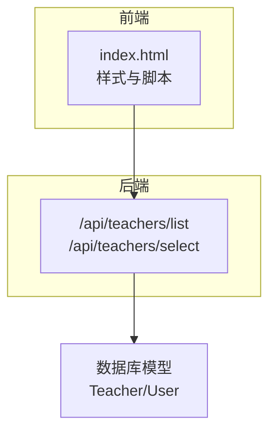
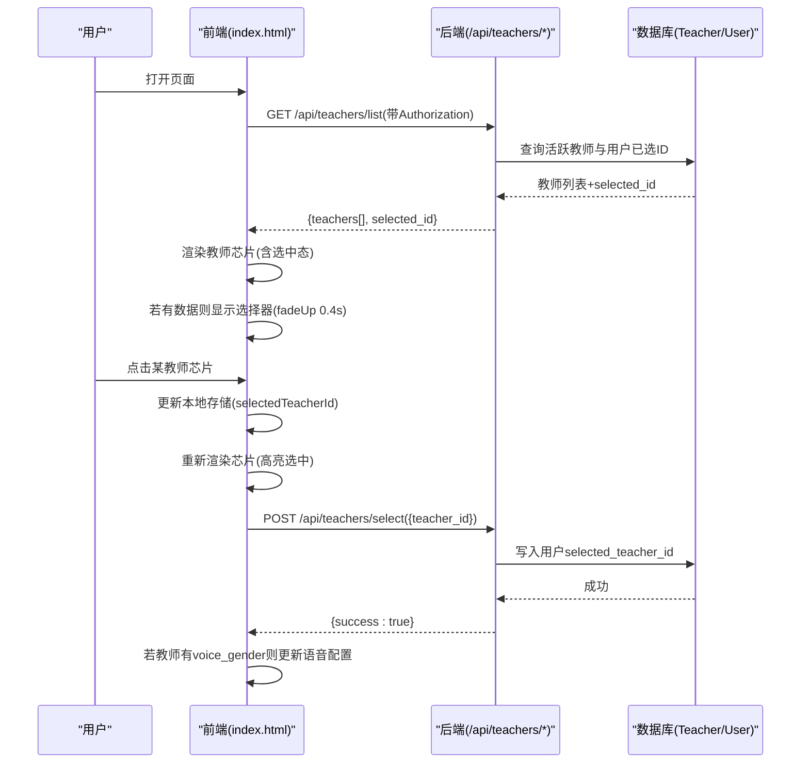
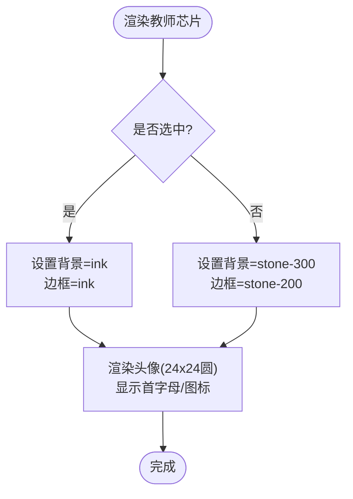
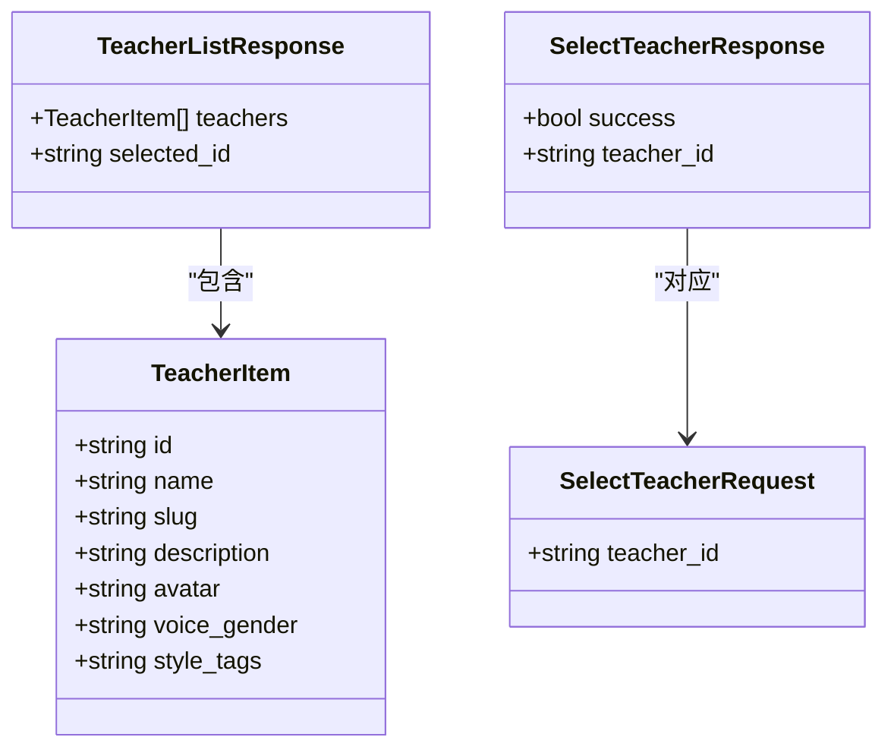

# 教师选择器

<cite>
**本文引用的文件**   
- [hushai/meditation/static/index.html](file://hushai/meditation/static/index.html)
- [hushai/meditation/api/teachers.py](file://hushai/meditation/api/teachers.py)
</cite>

## 目录
1. [简介](#简介)
2. [项目结构](#项目结构)
3. [核心组件](#核心组件)
4. [架构总览](#架构总览)
5. [详细组件分析](#详细组件分析)
6. [依赖关系分析](#依赖关系分析)
7. [性能与可访问性](#性能与可访问性)
8. [故障排查指南](#故障排查指南)
9. [结论](#结论)

## 简介
本设计文档聚焦 hush.ai 的“教师选择器”（冥想搭子）前端 UI/UX 实现，围绕以下目标展开：
- 教师头像：圆形容器 24x24px、首字母显示、背景色随状态变化（active: ink, inactive: stone-300）、边框处理。
- 教师信息展示：名称标签（12px、500字重）、描述文本（10px、stone-400颜色、单行省略）。
- 芯片布局：flex-wrap 换行、8px 间距、最大宽度限制。
- 交互状态：选中高亮（border-color: ink, background: paper-warm）、悬停反馈。
- 动画与边界：展开/收起使用 fadeUp 0.4s；空列表时隐藏区域。
- 数据加载与错误处理：未登录、网络异常、无数据等场景。

## 项目结构
教师选择器由前端静态页面与后端 API 共同构成：
- 前端：在静态 HTML 中定义样式与脚本，负责渲染教师芯片、处理用户交互、调用后端接口。
- 后端：提供教师列表、详情与选择接口，返回教师基本信息与当前用户已选教师 ID。

图表来源
- [hushai/meditation/static/index.html:300-329](file://hushai/meditation/static/index.html#L300-L329)
- [hushai/meditation/static/index.html:1368-1438](file://hushai/meditation/static/index.html#L1368-L1438)
- [hushai/meditation/api/teachers.py:58-86](file://hushai/meditation/api/teachers.py#L58-L86)
- [hushai/meditation/api/teachers.py:121-138](file://hushai/meditation/api/teachers.py#L121-L138)

章节来源
- [hushai/meditation/static/index.html:300-329](file://hushai/meditation/static/index.html#L300-L329)
- [hushai/meditation/static/index.html:1368-1438](file://hushai/meditation/static/index.html#L1368-L1438)
- [hushai/meditation/api/teachers.py:58-86](file://hushai/meditation/api/teachers.py#L58-L86)
- [hushai/meditation/api/teachers.py:121-138](file://hushai/meditation/api/teachers.py#L121-L138)

## 核心组件
- 教师选择器容器：包含标题标签与芯片列表，默认隐藏，有数据后以淡入上移动画展示。
- 教师芯片：每个芯片包含头像、名称、描述，支持点击切换选中态并持久化到本地存储。
- 交互逻辑：加载教师列表、渲染芯片、选择教师、更新全局语音性别配置、同步消息区头像。

章节来源
- [hushai/meditation/static/index.html:300-329](file://hushai/meditation/static/index.html#L300-L329)
- [hushai/meditation/static/index.html:1368-1438](file://hushai/meditation/static/index.html#L1368-L1438)

## 架构总览
教师选择器的关键流程如下：
- 初始化：检查认证令牌，若存在则请求教师列表。
- 渲染：根据返回的教师数组生成芯片节点，设置选中态类名。
- 交互：点击芯片触发选择，更新本地存储与界面，同时向后端提交选择结果。
- 联动：若教师携带语音性别，自动更新语音过滤与音色列表。

图表来源
- [hushai/meditation/static/index.html:1368-1438](file://hushai/meditation/static/index.html#L1368-L1438)
- [hushai/meditation/api/teachers.py:58-86](file://hushai/meditation/api/teachers.py#L58-L86)
- [hushai/meditation/api/teachers.py:121-138](file://hushai/meditation/api/teachers.py#L121-L138)

## 详细组件分析

### 教师头像设计与实现
- 容器尺寸：固定 24x24px，圆形（border-radius: 50%），内部使用 flex 居中显示首字母或图标。
- 背景色策略：
  - 非选中态：背景为 stone-300。
  - 选中态：背景为 ink。
- 边框处理：芯片整体边框在选中态变为 ink，非选中态为 stone-200；头像本身无边框，通过父容器边框表达选中态。
- 字体与字号：头像内文字使用 display 字体族，字号 12px，字重 400，确保首字母清晰可读。

图表来源
- [hushai/meditation/static/index.html:319-326](file://hushai/meditation/static/index.html#L319-L326)
- [hushai/meditation/static/index.html:311-318](file://hushai/meditation/static/index.html#L311-L318)

章节来源
- [hushai/meditation/static/index.html:319-326](file://hushai/meditation/static/index.html#L319-L326)
- [hushai/meditation/static/index.html:311-318](file://hushai/meditation/static/index.html#L311-L318)

### 教师信息展示结构
- 名称标签：字号 12px，字重 500，用于突出教师姓名。
- 描述文本：字号 10px，颜色 stone-400，最大宽度 120px，超出部分以省略号显示，保持单行整洁。
- 布局：名称与描述纵向排列，整体与头像横向对齐，形成紧凑的信息卡片。

章节来源
- [hushai/meditation/static/index.html:327-329](file://hushai/meditation/static/index.html#L327-L329)

### 教师芯片布局设计
- 容器：使用 flex 布局，允许换行（flex-wrap: wrap），芯片之间间距 8px（gap: 8px）。
- 最大宽度限制：描述文本最大宽度 120px，避免过长描述破坏布局；芯片整体宽度自适应内容。
- 视觉层次：选中态通过边框与背景强调，悬停态提升边框与文字颜色，增强可发现性。

章节来源
- [hushai/meditation/static/index.html:310-318](file://hushai/meditation/static/index.html#L310-L318)
- [hushai/meditation/static/index.html:327-329](file://hushai/meditation/static/index.html#L327-L329)

### 交互状态管理
- 选中高亮：选中态 border-color 为 ink，background 为 paper-warm，文字颜色 ink，形成明确焦点。
- 悬停反馈：hover 时边框变为 stone-400，文字变为 ink，提供轻量级交互提示。
- 本地持久化：选中教师 ID 写入 localStorage，刷新页面后恢复上次选择。
- 联动更新：若教师携带 voice_gender，自动更新语音性别过滤器与音色列表，并同步消息区教师头像。

章节来源
- [hushai/meditation/static/index.html:317-318](file://hushai/meditation/static/index.html#L317-L318)
- [hushai/meditation/static/index.html:1368-1438](file://hushai/meditation/static/index.html#L1368-L1438)

### 展开/收起动画与边界条件
- 展开动画：教师选择器容器默认 display:none，当有教师数据时添加 show 类，触发 fadeUp 0.4s 动画（ease-out-expo）。
- 收起行为：若无教师数据，不添加 show 类，区域保持隐藏。
- 过渡曲线：统一使用 ease-out-expo，保证动画自然流畅。

章节来源
- [hushai/meditation/static/index.html:301-305](file://hushai/meditation/static/index.html#L301-L305)
- [hushai/meditation/static/index.html:82-86](file://hushai/meditation/static/index.html#L82-L86)
- [hushai/meditation/static/index.html:1386-1388](file://hushai/meditation/static/index.html#L1386-L1388)

### 数据加载状态、错误处理与空状态
- 未登录：若请求返回 401，清除认证并跳转登录页。
- 网络异常：请求失败时静默处理（catch 分支），不中断主流程。
- 空列表：若 teachers 为空，不显示教师选择器区域。
- 初始选择：若后端返回 selected_id 且本地未保存，优先采用服务端选择并持久化。

章节来源
- [hushai/meditation/static/index.html:1372-1389](file://hushai/meditation/static/index.html#L1372-L1389)

## 依赖关系分析
- 前端依赖：
  - DOM 操作：动态创建按钮节点、插入 HTML、绑定 click 事件。
  - 本地存储：localStorage 读写 selectedTeacherId 与语音相关配置。
  - 网络请求：fetch 调用 /api/teachers/list 与 /api/teachers/select。
- 后端依赖：
  - FastAPI 路由与 Pydantic 模型：定义教师项、列表响应、选择请求/响应。
  - 数据库会话：异步 SQLAlchemy 查询 Teacher 与 User 表。
  - 认证中间件：从 Authorization 头提取 Bearer Token 并校验用户身份。

图表来源
- [hushai/meditation/api/teachers.py:32-45](file://hushai/meditation/api/teachers.py#L32-L45)
- [hushai/meditation/api/teachers.py:112-118](file://hushai/meditation/api/teachers.py#L112-L118)

章节来源
- [hushai/meditation/api/teachers.py:32-45](file://hushai/meditation/api/teachers.py#L32-L45)
- [hushai/meditation/api/teachers.py:112-118](file://hushai/meditation/api/teachers.py#L112-L118)

## 性能与可访问性
- 渲染优化：仅在数据变更时重建 chips 列表，避免频繁 DOM 操作。
- 动画性能：fadeUp 使用 transform 与 opacity，GPU 加速友好；时长 0.4s，节奏舒适。
- 可访问性：按钮元素具备语义化，focus-visible 提供键盘导航可见轮廓；颜色对比度满足基本可读性要求。

[本节为通用指导，无需具体文件引用]

## 故障排查指南
- 无法加载教师列表：
  - 检查 Authorization 头是否正确携带 Bearer Token。
  - 确认后端 /api/teachers/list 返回 200 且包含 teachers 字段。
- 选择无效：
  - 确认 /api/teachers/select 请求体包含 teacher_id。
  - 检查数据库中是否存在该教师记录。
- 界面未显示：
  - 若 teachers 为空，选择器不会显示，需确认后端返回数据。
- 语音未联动：
  - 若教师无 voice_gender，不会触发语音性别更新，属预期行为。

章节来源
- [hushai/meditation/static/index.html:1372-1389](file://hushai/meditation/static/index.html#L1372-L1389)
- [hushai/meditation/static/index.html:1410-1434](file://hushai/meditation/static/index.html#L1410-L1434)
- [hushai/meditation/api/teachers.py:58-86](file://hushai/meditation/api/teachers.py#L58-L86)
- [hushai/meditation/api/teachers.py:121-138](file://hushai/meditation/api/teachers.py#L121-L138)

## 结论
教师选择器通过简洁的芯片式布局与明确的选中态反馈，提供了直观的教师切换体验。其样式与交互严格遵循既定的设计规范：头像 24x24px 圆形、首字母显示、背景色随状态变化；名称与描述层级清晰；布局采用 flex-wrap 与 8px 间距；选中态高亮与悬停反馈一致；展开动画使用 fadeUp 0.4s；数据加载与错误处理稳健。整体实现兼顾美观、可用性与性能，适合作为冥想陪伴界面的重要入口组件。