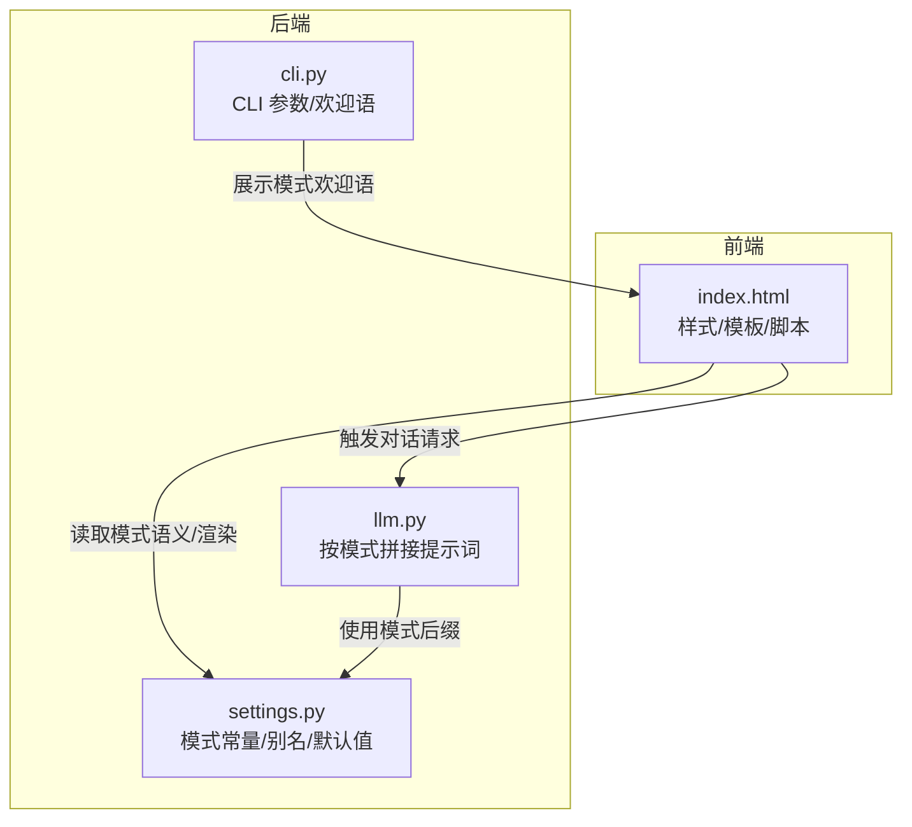
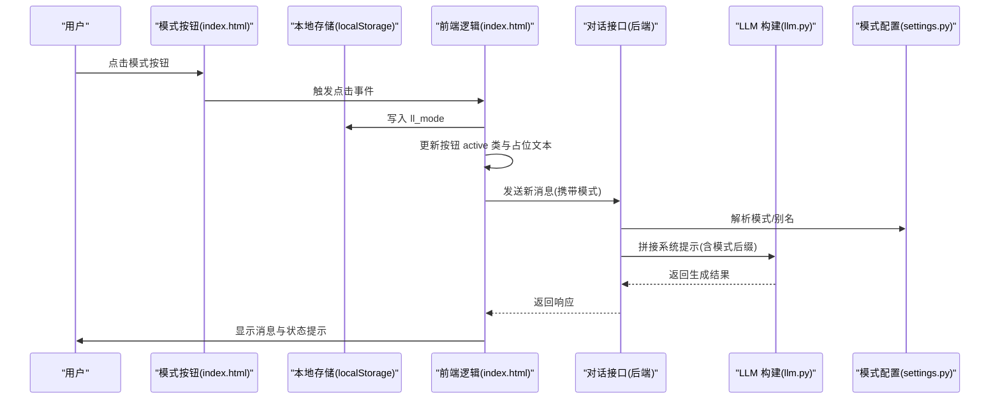
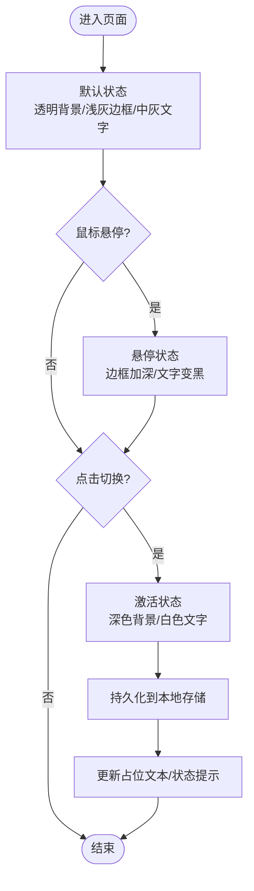
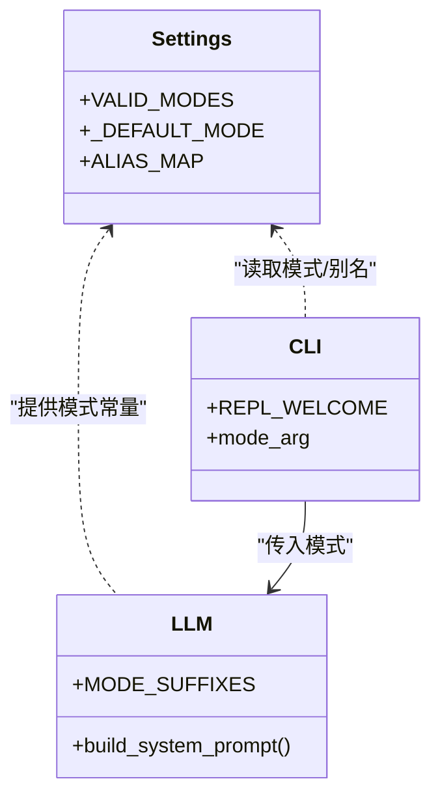
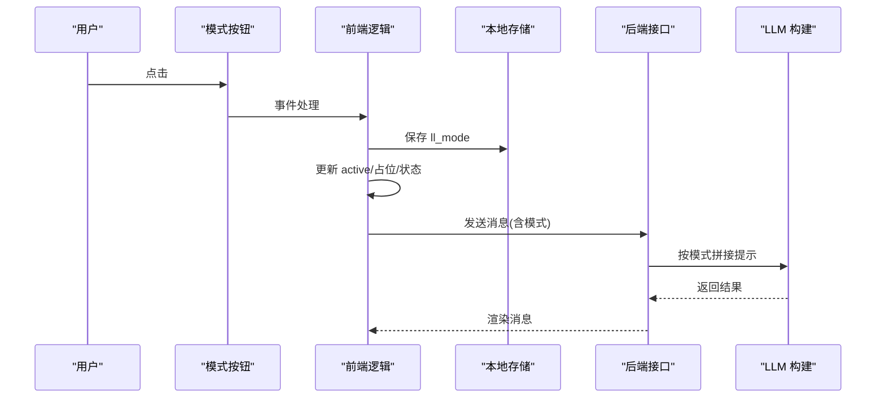
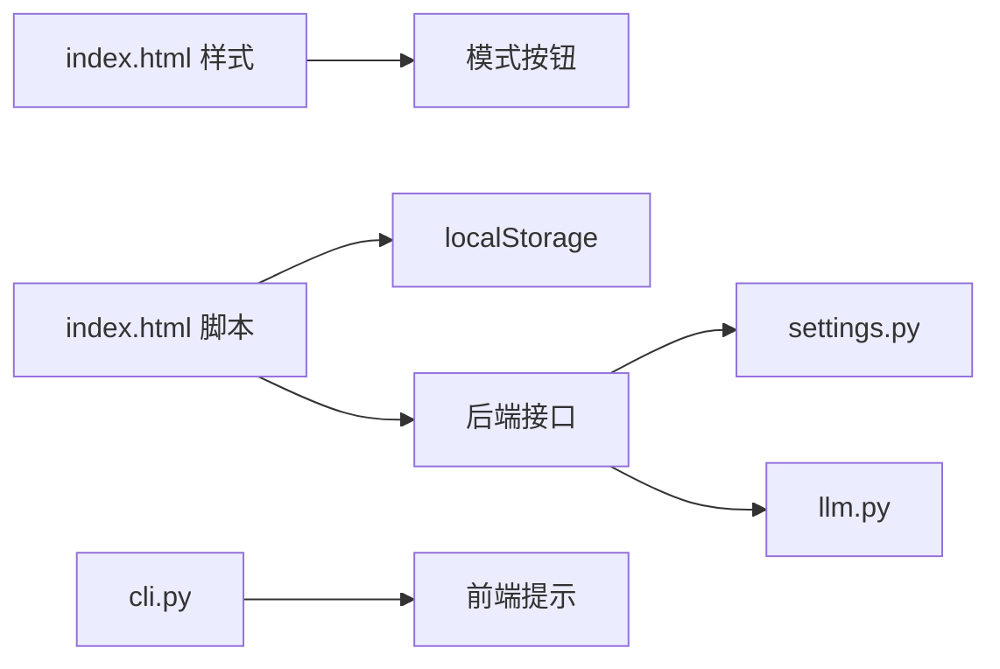

# 模式切换按钮

<cite>
**本文引用的文件**   
- [index.html](file://hushai/meditation/static/index.html)
- [cli.py](file://hushai/cli.py)
- [llm.py](file://hushai/llm.py)
- [settings.py](file://hushai/settings.py)
- [configuration.md](file://docs/configuration.md)
- [architecture.md](file://docs/architecture.md)
</cite>

## 目录
1. [简介](#简介)
2. [项目结构](#项目结构)
3. [核心组件](#核心组件)
4. [架构总览](#架构总览)
5. [详细组件分析](#详细组件分析)
6. [依赖关系分析](#依赖关系分析)
7. [性能与可访问性](#性能与可访问性)
8. [故障排查指南](#故障排查指南)
9. [结论](#结论)
10. [附录](#附录)

## 简介
本设计文档聚焦 hush.ai 的“模式切换”功能，围绕四种冥想模式的视觉与交互规范展开：平静（calm）、专注（focus）、激励（hype/inspire）、反PUA（pua/anti-manipulation）。文档从 UI/UX 视角定义按钮状态、动画过渡、选中持久化、移动端触摸优化与键盘导航，并说明模式切换对对话引擎的影响及用户提示机制。

## 项目结构
- 前端界面与交互逻辑集中在单页应用入口文件中，包含样式、模板与脚本。
- 后端 CLI 与配置模块定义了合法模式集合、别名映射与默认值，为前端提供语义来源。
- LLM 构建层根据模式拼接系统提示，驱动不同风格的对话体验。

图表来源
- [index.html:289-298](file://hushai/meditation/static/index.html#L289-L298)
- [settings.py:13-15](file://hushai/settings.py#L13-L15)
- [cli.py:16-20](file://hushai/cli.py#L16-L20)
- [llm.py:55-59](file://hushai/llm.py#L55-L59)

章节来源
- [index.html:289-298](file://hushai/meditation/static/index.html#L289-L298)
- [settings.py:13-15](file://hushai/settings.py#L13-L15)
- [cli.py:16-20](file://hushai/cli.py#L16-L20)
- [llm.py:55-59](file://hushai/llm.py#L55-L59)

## 核心组件
- 模式按钮组：用于在 calm/focus/hype/pua 之间切换，具备默认、悬停、激活三种状态与统一过渡曲线。
- 状态持久化：通过本地存储记录当前模式，刷新后恢复。
- 对话引擎联动：切换模式后更新会话上下文或提示词，影响后续生成风格。
- 用户提示：头部状态区与输入占位文本随模式变化，提供即时反馈。

章节来源
- [index.html:289-298](file://hushai/meditation/static/index.html#L289-L298)
- [index.html:1269-1278](file://hushai/meditation/static/index.html#L1269-L1278)
- [cli.py:16-20](file://hushai/cli.py#L16-L20)
- [llm.py:55-59](file://hushai/llm.py#L55-L59)

## 架构总览
模式切换在前端完成状态管理与 UI 反馈，同时向后端传递模式信息以调整对话策略。

图表来源
- [index.html:1269-1278](file://hushai/meditation/static/index.html#L1269-L1278)
- [settings.py:38-48](file://hushai/settings.py#L38-L48)
- [llm.py:55-59](file://hushai/llm.py#L55-L59)

## 详细组件分析

### 模式按钮视觉与交互规范
- 布局与层级
  - 位于头部区域，采用紧凑行内排列，间距一致，便于快速选择。
- 默认状态
  - 背景透明；边框浅色；文字色为中灰色调。
- 悬停状态
  - 边框加深；文字变深至近黑色，提升可感知度。
- 激活状态
  - 背景深色；文字白色；边框深色，形成强对比。
- 过渡动画
  - 时长 .25s；缓动函数 cubic-bezier(0.25,1,0.5,1)，确保切换顺滑不突兀。
- 焦点与可访问性
  - 支持 :focus-visible 轮廓；title 描述用途；aria-label 补充语义。
- 移动端触摸优化
  - 触控目标尺寸充足；避免误触；减少不必要的重绘。

图表来源
- [index.html:289-298](file://hushai/meditation/static/index.html#L289-L298)
- [index.html:1269-1278](file://hushai/meditation/static/index.html#L1269-L1278)

章节来源
- [index.html:289-298](file://hushai/meditation/static/index.html#L289-L298)
- [index.html:1269-1278](file://hushai/meditation/static/index.html#L1269-L1278)

### 模式语义与后端映射
- 合法模式集合
  - calm / focus / hype / plain / pua，其中 hype 对应“激励”，pua 对应“反PUA”。
- 别名映射
  - anti-anxiety/anxiety → calm；anti-procrastination/procrastination → focus；pump/energy → hype；anti-pua/antipua/drill → pua。
- 默认模式
  - calm。
- CLI 与欢迎语
  - 各模式提供不同的欢迎语，增强引导感。

图表来源
- [settings.py:13-15](file://hushai/settings.py#L13-L15)
- [settings.py:38-48](file://hushai/settings.py#L38-L48)
- [cli.py:16-20](file://hushai/cli.py#L16-L20)
- [llm.py:55-59](file://hushai/llm.py#L55-L59)

章节来源
- [settings.py:13-15](file://hushai/settings.py#L13-L15)
- [settings.py:38-48](file://hushai/settings.py#L38-L48)
- [cli.py:16-20](file://hushai/cli.py#L16-L20)
- [llm.py:55-59](file://hushai/llm.py#L55-L59)

### 模式切换流程与用户提示
- 切换动作
  - 点击模式按钮 → 更新 active 类 → 写入本地存储 → 更新输入占位文本与头部状态提示。
- 对话影响
  - 新消息发送时携带模式信息，后端据此拼接系统提示，改变回复风格。
- 用户提示
  - 头部状态区显示当前模式相关文案；输入框占位文本随模式变化，明确预期。

图表来源
- [index.html:1269-1278](file://hushai/meditation/static/index.html#L1269-L1278)
- [llm.py:55-59](file://hushai/llm.py#L55-L59)

章节来源
- [index.html:1269-1278](file://hushai/meditation/static/index.html#L1269-L1278)
- [llm.py:55-59](file://hushai/llm.py#L55-L59)

### 无障碍与键盘导航
- 焦点可见
  - 全局 :focus-visible 轮廓，保证键盘操作可见。
- 语义标注
  - 按钮 title 与 aria-label 完善，屏幕阅读器友好。
- 键盘操作
  - 支持 Tab 切换、Enter/Space 触发；Esc 关闭弹窗（如适用）。

章节来源
- [index.html:736-739](file://hushai/meditation/static/index.html#L736-L739)

### 移动端适配
- 触控目标
  - 按钮尺寸与间距满足手指操作需求。
- 动画降级
  - 尊重 prefers-reduced-motion，降低动画强度。
- 滚动与布局
  - 顶部固定、内容可滚动，避免遮挡。

章节来源
- [index.html:741-746](file://hushai/meditation/static/index.html#L741-L746)

## 依赖关系分析
- 前端样式与交互
  - 模式按钮样式与过渡由 CSS 变量与 transition 控制。
- 配置与别名
  - settings.py 提供合法模式、别名与默认值，确保前后端一致性。
- 提示词构建
  - llm.py 依据模式追加后缀，影响对话风格。
- CLI 与欢迎语
  - cli.py 提供各模式欢迎语，增强引导。

图表来源
- [index.html:289-298](file://hushai/meditation/static/index.html#L289-L298)
- [settings.py:13-15](file://hushai/settings.py#L13-L15)
- [llm.py:55-59](file://hushai/llm.py#L55-L59)
- [cli.py:16-20](file://hushai/cli.py#L16-L20)

章节来源
- [index.html:289-298](file://hushai/meditation/static/index.html#L289-L298)
- [settings.py:13-15](file://hushai/settings.py#L13-L15)
- [llm.py:55-59](file://hushai/llm.py#L55-L59)
- [cli.py:16-20](file://hushai/cli.py#L16-L20)

## 性能与可访问性
- 性能
  - 使用 CSS transition 实现轻量动画，避免复杂计算；减少 DOM 重排。
- 可访问性
  - 焦点可见、语义标签完整；遵循 reduced motion 偏好。
- 兼容性
  - 使用标准 CSS 变量与过渡属性，广泛兼容现代浏览器。

[本节为通用指导，无需具体文件引用]

## 故障排查指南
- 按钮无高亮
  - 检查是否成功添加 active 类；确认 localStorage 写入正常。
- 模式未生效
  - 确认后端接收到的模式值合法；检查别名映射是否正确。
- 动画异常
  - 检查 prefers-reduced-motion 设置；确认 transition 属性未被覆盖。
- 键盘不可用
  - 验证 :focus-visible 样式生效；确认 Enter/Space 事件绑定。

章节来源
- [index.html:736-739](file://hushai/meditation/static/index.html#L736-L739)
- [index.html:741-746](file://hushai/meditation/static/index.html#L741-L746)
- [settings.py:38-48](file://hushai/settings.py#L38-L48)

## 结论
模式切换按钮通过清晰的视觉状态、统一的过渡曲线与完善的可访问性，为用户提供稳定、直观的冥想模式选择体验。结合后端模式配置与提示词构建，不同模式能带来差异化的对话风格，满足用户在平静、专注、激励与反PUA场景下的多样化需求。

[本节为总结，无需具体文件引用]

## 附录

### 模式对照表
- calm（平静）：接纳情绪、语气平稳、少命令式
- focus（专注）：小步推进、不羞辱、不堆清单
- hype（激励）：鼓劲向前、简洁有力
- pua（反PUA）：教育性演练，谨慎使用

章节来源
- [configuration.md:37-38](file://docs/configuration.md#L37-L38)
- [architecture.md:8](file://docs/architecture.md#L8)
- [architecture.md:18](file://docs/architecture.md#L18)