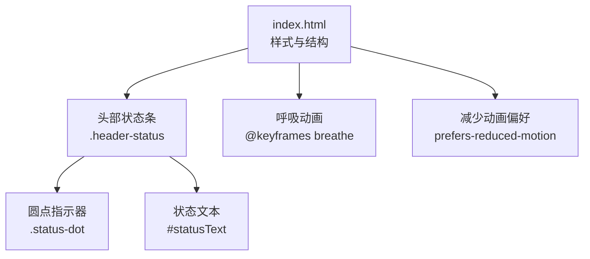
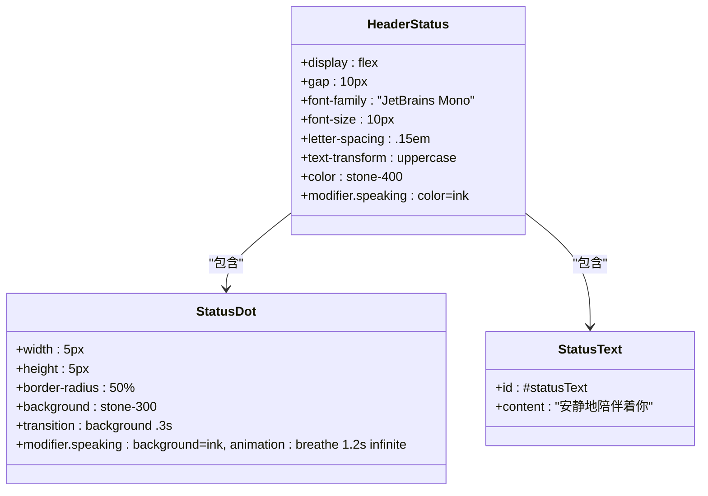
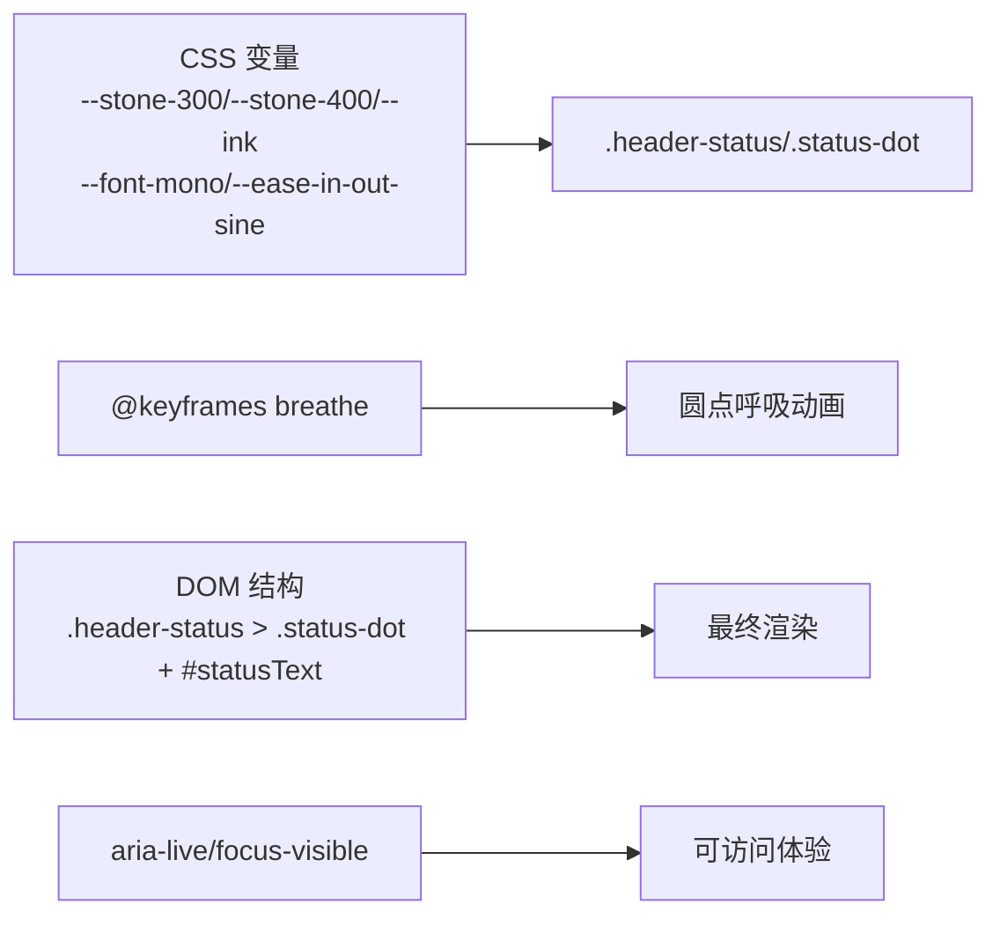

# 状态指示器

<cite>
**本文引用的文件**   
- [index.html](file://hushai/meditation/static/index.html)
- [frontend_qa.py](file://scripts/frontend_qa.py)
</cite>

## 目录
1. [简介](#简介)
2. [项目结构](#项目结构)
3. [核心组件](#核心组件)
4. [架构总览](#架构总览)
5. [详细组件分析](#详细组件分析)
6. [依赖关系分析](#依赖关系分析)
7. [性能与可访问性考量](#性能与可访问性考量)
8. [故障排查指南](#故障排查指南)
9. [结论](#结论)

## 简介
本设计文档聚焦 hush.ai 前端中的“连接状态指示器”组件，系统化阐述其视觉规范、交互反馈、动画与过渡、语义化状态表达以及无障碍支持。该组件位于冥想对话界面的头部区域，通过一个圆形点状图标与一行状态文本共同传达系统当前状态（如正常、说话中、错误等），并配合呼吸式动画与颜色变化提升用户感知与可用性。

## 项目结构
状态指示器相关样式与结构集中在冥想界面主文件中，包含：
- CSS 变量与全局字体定义
- 头部区域结构与状态条样式
- 呼吸动画关键帧
- 无障碍属性声明

图表来源
- [index.html:277-287](file://hushai/meditation/static/index.html#L277-L287)
- [index.html:92-94](file://hushai/meditation/static/index.html#L92-L94)
- [index.html:741-746](file://hushai/meditation/static/index.html#L741-L746)

章节来源
- [index.html:277-287](file://hushai/meditation/static/index.html#L277-L287)
- [index.html:92-94](file://hushai/meditation/static/index.html#L92-L94)
- [index.html:741-746](file://hushai/meditation/static/index.html#L741-L746)

## 核心组件
- 圆点指示器
  - 尺寸：5×5px 圆形
  - 默认色：stone-300
  - 活跃态色：ink
  - 过渡：背景色 .3s 平滑过渡
- 状态文本
  - 字体：JetBrains Mono（等宽）
  - 字号：10px
  - 字距：.15em
  - 大小写：全大写
  - 默认色：stone-400；说话态色：ink
- 呼吸动画
  - 名称：breathe
  - 时长：1.2s 循环
  - 缓动：ease-in-out-sine
  - 效果：透明度在 0.3 与 1 之间循环，营造“呼吸感”
- 状态容器
  - 类名：.header-status
  - 说话态修饰类：.speaking（用于切换颜色与动画）

章节来源
- [index.html:277-287](file://hushai/meditation/static/index.html#L277-L287)
- [index.html:92-94](file://hushai/meditation/static/index.html#L92-L94)

## 架构总览
状态指示器由“容器 + 圆点 + 文本”三部分构成，通过添加/移除修饰类实现状态切换，CSS 负责视觉与动画，HTML 提供语义化标记与无障碍属性。

图表来源
- [index.html:277-287](file://hushai/meditation/static/index.html#L277-L287)
- [index.html:983-986](file://hushai/meditation/static/index.html#L983-L986)

## 详细组件分析

### 连接状态指示器（圆点）
- 视觉规格
  - 形状：正圆
  - 尺寸：5×5px
  - 默认填充：stone-300
  - 活跃填充：ink
  - 过渡：background .3s
- 交互语义
  - 当系统进入“说话”状态时，容器获得 .speaking 修饰类，圆点变为 ink 并启动呼吸动画
  - 离开说话状态后，恢复 stone-300 且停止动画
- 无障碍
  - 圆点本身不承载可读文本，语义由容器与状态文本承担

章节来源
- [index.html:283-287](file://hushai/meditation/static/index.html#L283-L287)

### 说话状态（呼吸动画与高亮）
- 触发条件
  - 容器 .header-status 增加 .speaking 修饰类
- 视觉反馈
  - 文本颜色从 stone-400 变为 ink
  - 圆点颜色从 stone-300 变为 ink
  - 圆点启用 breathing 动画（1.2s 循环，ease-in-out-sine）
- 动画细节
  - @keyframes breathe：在 0%/100% 处 opacity=.3，50% 处 opacity=1
  - 使用 prefers-reduced-motion 媒体查询禁用动画以尊重用户偏好

章节来源
- [index.html:277-287](file://hushai/meditation/static/index.html#L277-L287)
- [index.html:92-94](file://hushai/meditation/static/index.html#L92-L94)
- [index.html:741-746](file://hushai/meditation/static/index.html#L741-L746)

### 状态文本排版
- 字体族：JetBrains Mono（等宽）
- 字号：10px
- 字距：.15em
- 大小写：全大写
- 颜色：默认 stone-400；说话态 ink
- 文案示例：安静地陪伴着你（实际内容随状态更新）

章节来源
- [index.html:277-281](file://hushai/meditation/static/index.html#L277-L281)
- [index.html:983-986](file://hushai/meditation/static/index.html#L983-L986)

### 语义化状态与颜色编码
- 正常状态
  - 文本颜色：stone-400
  - 圆点颜色：stone-300
  - 无动画
- 说话状态
  - 文本颜色：ink
  - 圆点颜色：ink
  - 圆点呼吸动画：1.2s 循环
- 错误状态（建议方案）
  - 参考登录错误提示的红色系 #8b4040，可在错误态将文本与圆点统一改为该色系，或为容器新增 .error 修饰类以集中管理
  - 建议在错误态保持 .3s 过渡，避免闪烁

章节来源
- [index.html:216-218](file://hushai/meditation/static/index.html#L216-L218)
- [index.html:277-287](file://hushai/meditation/static/index.html#L277-L287)

### 用户感知优化（渐进式变化与防闪烁）
- 渐进式变化
  - 所有颜色变更均使用 transition: background .3s，确保状态切换顺滑
- 防闪烁策略
  - 使用单一修饰类控制状态，避免频繁重排
  - 对呼吸动画采用无限循环但低对比度透明度变化，降低视觉干扰
- 减少动画偏好
  - 通过 prefers-reduced-motion 媒体查询，自动关闭呼吸动画与部分过渡，满足敏感用户

章节来源
- [index.html:283-287](file://hushai/meditation/static/index.html#L283-L287)
- [index.html:741-746](file://hushai/meditation/static/index.html#L741-L746)

### 无障碍访问支持
- aria-live 区域
  - 消息区使用 aria-live="polite" 与 aria-relevant="additions"，保证屏幕阅读器适时播报新增内容
  - 登录错误区域使用 role="status" 与 aria-live="polite"，确保错误信息被及时朗读
- 焦点可见性
  - 使用 :focus-visible 提供清晰的键盘导航反馈
- 建议扩展
  - 可为状态容器增加 aria-live="polite"，使状态文本变更也能被读屏器播报
  - 为圆点增加 aria-hidden="true"，避免重复朗读

章节来源
- [index.html:962](file://hushai/meditation/static/index.html#L962)
- [index.html:1010-1011](file://hushai/meditation/static/index.html#L1010-L1011)
- [index.html:736-739](file://hushai/meditation/static/index.html#L736-L739)

## 依赖关系分析
- 样式依赖
  - 颜色变量：--stone-300、--stone-400、--ink
  - 字体变量：--font-mono（映射到 JetBrains Mono）
  - 缓动函数：--ease-in-out-sine
- 动画依赖
  - @keyframes breathe 驱动呼吸动画
- 结构依赖
  - .header-status 作为状态容器，内部包含 .status-dot 与 #statusText
- 无障碍依赖
  - 全局 aria-live 区域与 focus-visible 样式

图表来源
- [index.html:24-45](file://hushai/meditation/static/index.html#L24-L45)
- [index.html:92-94](file://hushai/meditation/static/index.html#L92-L94)
- [index.html:277-287](file://hushai/meditation/static/index.html#L277-L287)
- [index.html:983-986](file://hushai/meditation/static/index.html#L983-L986)
- [index.html:736-739](file://hushai/meditation/static/index.html#L736-L739)

## 性能与可访问性考量
- 性能
  - 仅改变 background 与 opacity，GPU 友好
  - 使用 prefers-reduced-motion 减少不必要的动画开销
- 可访问性
  - 使用 aria-live 区域播报动态内容
  - 使用 :focus-visible 强化键盘可达性
  - 建议为状态容器补充 aria-live，以便状态文本变更被读屏器捕获

章节来源
- [index.html:741-746](file://hushai/meditation/static/index.html#L741-L746)
- [index.html:736-739](file://hushai/meditation/static/index.html#L736-L739)
- [index.html:962](file://hushai/meditation/static/index.html#L962)
- [index.html:1010-1011](file://hushai/meditation/static/index.html#L1010-L1011)

## 故障排查指南
- 检查要点
  - 确认 .header-status 是否正确使用 .speaking 修饰类切换状态
  - 确认呼吸动画未被 prefers-reduced-motion 意外禁用（若用户开启减少动画）
  - 确认状态文本与圆点颜色变量未覆盖导致异常
- 常见问题
  - 状态切换闪烁：检查是否存在多次快速切换修饰类导致的布局抖动
  - 读屏器未播报：确认 aria-live 区域存在且位置正确
- 自动化检查
  - 使用前端 QA 脚本检测 aria-label、role、aria-live、aria-pressed、aria-relevant 等属性使用情况，以及 prefers-reduced-motion 支持

章节来源
- [index.html:277-287](file://hushai/meditation/static/index.html#L277-L287)
- [index.html:741-746](file://hushai/meditation/static/index.html#L741-L746)
- [frontend_qa.py:173-193](file://scripts/frontend_qa.py#L173-L193)

## 结论
状态指示器通过极简的 5×5px 圆点与等宽小字号文本，结合呼吸动画与 .3s 过渡，实现了清晰、克制且富有生命力的状态表达。其设计遵循渐进式变化与无障碍优先原则，既保证了视觉一致性，也兼顾了不同用户的感知需求。建议在后续迭代中为状态容器补充 aria-live，并在错误态引入统一的 .error 修饰类以增强语义与可维护性。