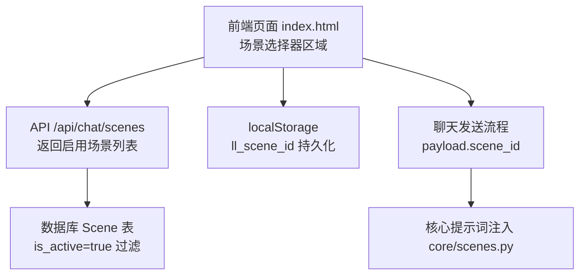
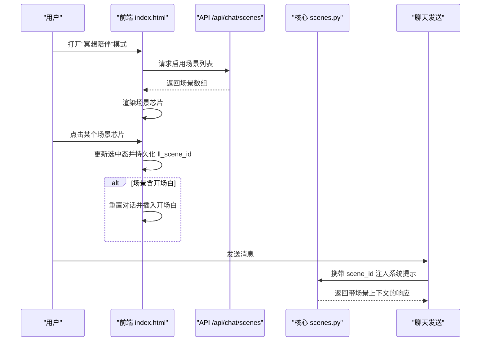
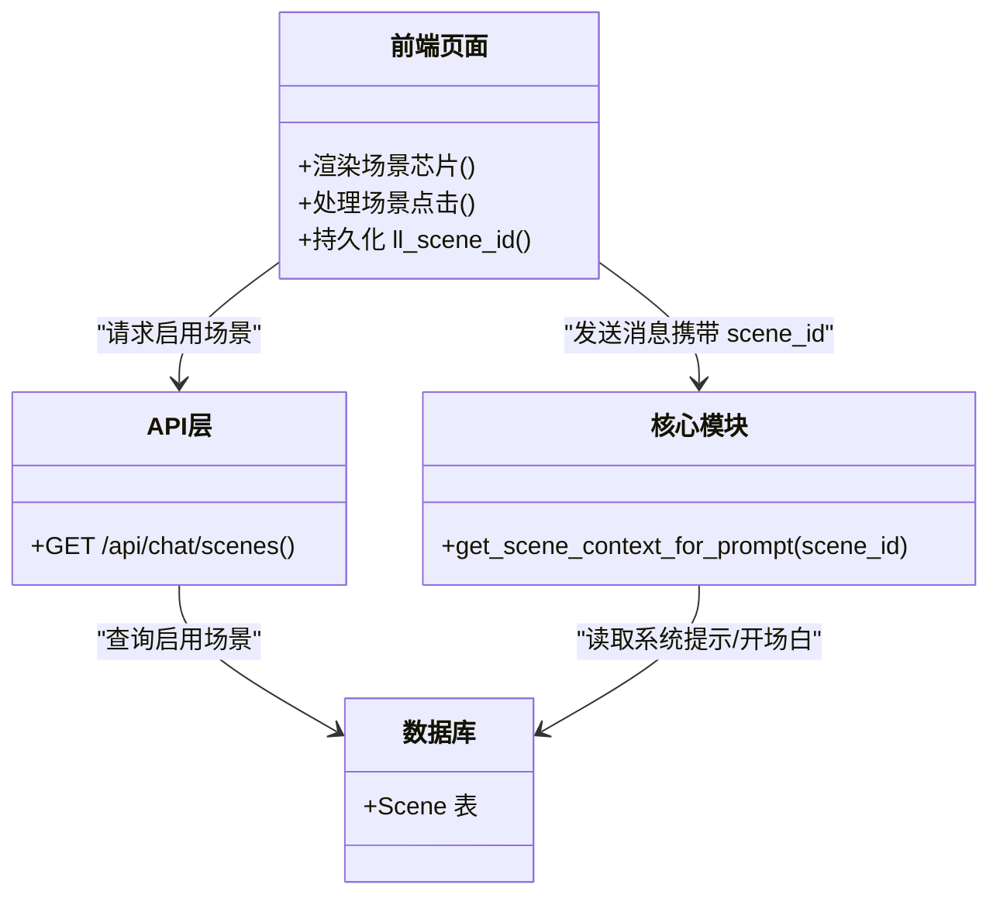

# 场景选择器

<cite>
**本文引用的文件**   
- [index.html](file://hushai/meditation/static/index.html)
- [chat.py](file://hushai/meditation/api/chat.py)
- [scenes.py（核心）](file://hushai/meditation/core/scenes.py)
- [scenes.py（管理端路由）](file://hushai/meditation/admin/pages/scenes.py)
- [scenes.html（管理端列表）](file://hushai/meditation/admin/templates/scenes.html)
- [scene_form.html（管理端表单）](file://hushai/meditation/admin/templates/scene_form.html)
</cite>

## 目录
1. [引言](#引言)
2. [项目结构](#项目结构)
3. [核心组件](#核心组件)
4. [架构总览](#架构总览)
5. [详细组件分析](#详细组件分析)
6. [依赖关系分析](#依赖关系分析)
7. [性能与体验优化建议](#性能与体验优化建议)
8. [故障排查指南](#故障排查指南)
9. [结论](#结论)

## 引言
本设计文档聚焦于 hush.ai 的“场景选择器”前端组件，围绕以下目标展开：
- 场景芯片的设计规范：标签样式、激活状态与过渡动画
- 场景选择器的展开/收起交互逻辑
- 选中状态的视觉反馈：背景填充动画与边框变化
- 场景分类与批量选择功能的设计建议
- 场景切换时的界面过渡效果
- 场景数据的动态加载与缓存机制

文档同时结合后端接口与管理端能力，确保设计与实现一致。

## 项目结构
场景选择器位于前端主页面中，通过 API 获取已启用的场景列表并渲染为可点击的“场景芯片”。当前实现为单选模式，支持持久化到本地存储，并在切换时触发对话重置与可选开场白注入。

图表来源
- [index.html:995-998](file://hushai/meditation/static/index.html#L995-L998)
- [chat.py:130-152](file://hushai/meditation/api/chat.py#L130-L152)
- [scenes.py（核心）:11-29](file://hushai/meditation/core/scenes.py#L11-L29)

章节来源
- [index.html:995-998](file://hushai/meditation/static/index.html#L995-L998)
- [chat.py:130-152](file://hushai/meditation/api/chat.py#L130-L152)
- [scenes.py（核心）:11-29](file://hushai/meditation/core/scenes.py#L11-L29)

## 核心组件
- 容器与标签
  - 容器类名：scene-selector
  - 标题标签：scene-label
  - 芯片容器：scene-chips
- 场景芯片
  - 类名：scene-chip
  - 文本包裹：span
  - 激活态：active
- 交互与状态
  - 展开/收起：通过 show 类控制显示
  - 选中态：active 类 + localStorage 持久化
  - 切换行为：清空会话、可选插入开场白

章节来源
- [index.html:334-361](file://hushai/meditation/static/index.html#L334-L361)
- [index.html:995-998](file://hushai/meditation/static/index.html#L995-L998)
- [index.html:1280-1315](file://hushai/meditation/static/index.html#L1280-L1315)

## 架构总览
场景选择器在前端负责展示与交互，后端提供启用场景列表，核心模块将选中的场景系统提示注入到对话上下文中。

图表来源
- [index.html:1269-1278](file://hushai/meditation/static/index.html#L1269-L1278)
- [index.html:1280-1315](file://hushai/meditation/static/index.html#L1280-L1315)
- [chat.py:130-152](file://hushai/meditation/api/chat.py#L130-L152)
- [scenes.py（核心）:11-29](file://hushai/meditation/core/scenes.py#L11-L29)

## 详细组件分析

### 场景芯片设计规范
- 布局与排版
  - 使用弹性布局横向排列，自动换行，间距统一
  - 单芯片最大宽度限制，避免溢出
- 字体与色彩
  - 默认文字颜色较浅，悬停加深，激活后反色显示
  - 边框默认浅色，悬停加深，激活后深色边框
- 激活态与过渡
  - 激活态通过伪元素从左侧缩放填充背景，形成“刷入”动效
  - 所有过渡采用缓动曲线，保证顺滑
- 无障碍
  - 按钮语义，键盘可达；减少动效偏好下禁用过渡

章节来源
- [index.html:334-361](file://hushai/meditation/static/index.html#L334-L361)
- [index.html:741-746](file://hushai/meditation/static/index.html#L741-L746)

### 展开/收起交互逻辑
- 模式联动
  - 切换到“冥想陪伴”模式时，显示场景选择器
  - 切换到“知识库问答”模式时，隐藏场景选择器
- 数据驱动显示
  - 当后端返回至少一个启用场景时，自动显示场景选择器
- 初始状态
  - 未登录或无可用场景时不显示

章节来源
- [index.html:1269-1278](file://hushai/meditation/static/index.html#L1269-L1278)
- [index.html:1280-1286](file://hushai/meditation/static/index.html#L1280-L1286)

### 选中态视觉反馈
- 视觉层次
  - 未选中：浅色边框与文字
  - 悬停：边框加深，文字变深
  - 选中：背景从左至右填充，文字反色，边框加深
- 持久化
  - 选中场景 ID 写入 localStorage，刷新后保持
- 交互结果
  - 选中场景且包含开场白时，自动清空对话并插入开场白
  - 取消选中时，清空对话

章节来源
- [index.html:1289-1315](file://hushai/meditation/static/index.html#L1289-L1315)

### 场景分类与批量选择（设计建议）
当前实现为单选。若需扩展为分类与批量选择，建议如下：
- 分类维度
  - 按主题/用途分组（如 MBCT、职场倦怠、情绪调节等），在顶部提供筛选标签
- 多选策略
  - 增加 Ctrl/Cmd 多选与全选/全清
  - 选中数量上限提示与防抖提交
- 数据结构
  - 场景对象增加 category 字段，前端据此分组渲染
- 交互细节
  - 批量操作区显示已选项计数
  - 提供“仅启用项可见”的开关

说明：以上为设计建议，仓库中尚未实现该功能。

### 场景切换时的界面过渡效果
- 场景面板展开/收起
  - 使用淡入上移动画，时长与缓动保持一致
- 对话内容过渡
  - 切换场景时重置对话，欢迎语以入场动画呈现
- 流式输出
  - 发送消息后以打字机方式逐步渲染，提升感知速度

章节来源
- [index.html:334-339](file://hushai/meditation/static/index.html#L334-L339)
- [index.html:1572-1581](file://hushai/meditation/static/index.html#L1572-L1581)
- [index.html:1762-1793](file://hushai/meditation/static/index.html#L1762-L1793)

### 场景数据的动态加载与缓存机制
- 动态加载
  - 进入“冥想陪伴”模式后，调用 /api/chat/scenes 获取启用场景
  - 若返回为空，则不显示场景选择器
- 本地缓存
  - 选中场景 ID 持久化到 localStorage，下次进入直接高亮
- 后端过滤
  - 仅返回 is_active=true 的场景，并按 sort_order 升序、创建时间降序排序
- 上下文注入
  - 发送消息时携带 scene_id，后端核心模块根据 ID 查询系统提示与开场白，注入对话上下文

章节来源
- [index.html:1280-1286](file://hushai/meditation/static/index.html#L1280-L1286)
- [index.html:1289-1315](file://hushai/meditation/static/index.html#L1289-L1315)
- [chat.py:130-152](file://hushai/meditation/api/chat.py#L130-L152)
- [scenes.py（核心）:11-29](file://hushai/meditation/core/scenes.py#L11-L29)

## 依赖关系分析
- 前端依赖
  - DOM 节点：sceneSelector、sceneChips
  - 事件：模式切换、场景点击、发送消息
  - 存储：localStorage(ll_scene_id)
- 后端依赖
  - 接口：GET /api/chat/scenes
  - 模型：Scene（is_active、sort_order、created_at）
  - 核心：get_scene_context_for_prompt 注入系统提示与开场白

图表来源
- [index.html:1280-1315](file://hushai/meditation/static/index.html#L1280-L1315)
- [chat.py:130-152](file://hushai/meditation/api/chat.py#L130-L152)
- [scenes.py（核心）:11-29](file://hushai/meditation/core/scenes.py#L11-L29)

## 性能与体验优化建议
- 列表渲染
  - 场景较多时，考虑虚拟滚动或分页加载
- 网络请求
  - 对 /api/chat/scenes 做短期缓存（内存或 sessionStorage），避免重复请求
- 动画性能
  - 优先使用 transform 与 opacity，减少重排
- 可访问性
  - 尊重 prefers-reduced-motion，禁用复杂过渡
- 错误处理
  - 接口失败时给出友好提示，并提供重试入口

[本节为通用建议，无需源码引用]

## 故障排查指南
- 场景选择器不显示
  - 检查是否处于“冥想陪伴”模式
  - 确认 /api/chat/scenes 返回非空
- 选中态丢失
  - 检查 localStorage 中 ll_scene_id 是否存在
- 切换场景无效
  - 确认 selectedSceneId 更新与 renderSceneChips 执行
  - 若场景有 opening_message，确认 resetConversation 与 addMsg 调用
- 场景未生效
  - 确认发送 payload 中包含 scene_id
  - 检查后端 get_scene_context_for_prompt 是否能查到对应场景

章节来源
- [index.html:1269-1278](file://hushai/meditation/static/index.html#L1269-L1278)
- [index.html:1280-1315](file://hushai/meditation/static/index.html#L1280-L1315)
- [scenes.py（核心）:11-29](file://hushai/meditation/core/scenes.py#L11-L29)

## 结论
场景选择器以简洁的芯片形态提供清晰的上下文切换能力，配合流畅的过渡与稳定的本地持久化，提升了用户体验。当前为单选模式，具备可扩展的分类与批量选择基础。建议在后续迭代中引入分类筛选、多选策略与更完善的错误提示，以满足更多业务场景需求。