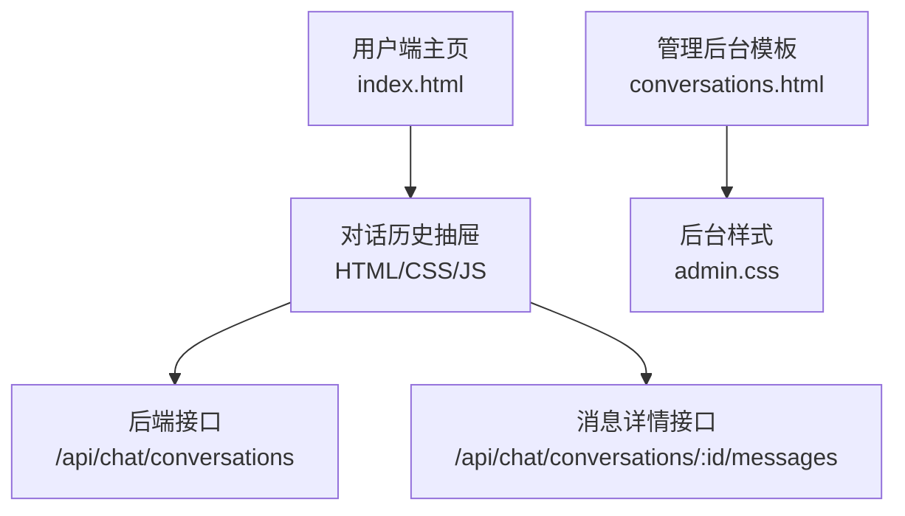
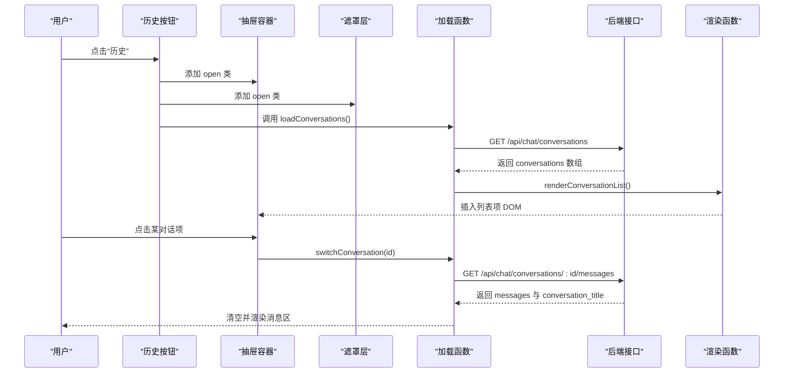
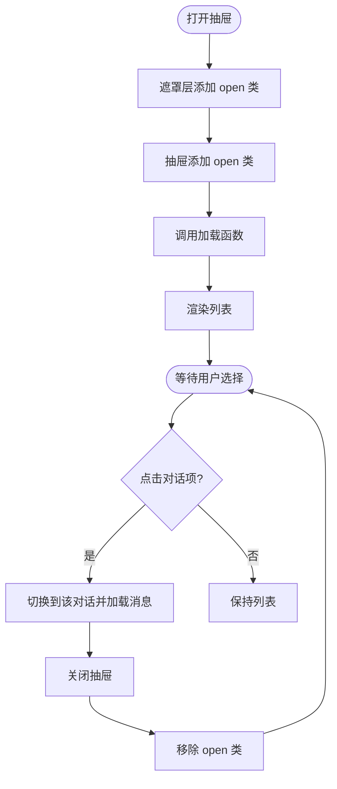
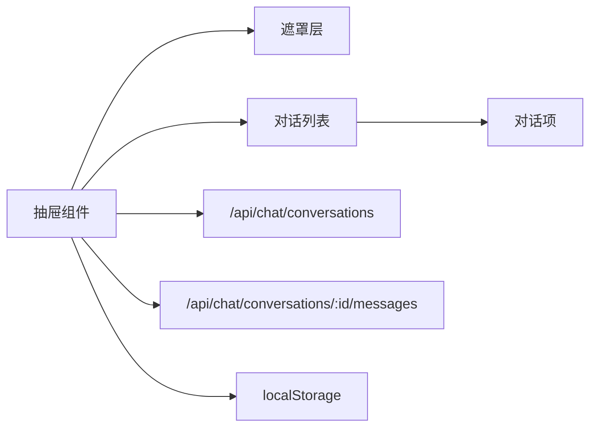

# 对话历史抽屉

<cite>
**本文引用的文件**   
- [index.html](file://hushai/meditation/static/index.html)
- [admin.css](file://hushai/meditation/admin/static/css/admin.css)
- [conversations.html](file://hushai/meditation/admin/templates/conversations.html)
- [conversation_detail.html](file://hushai/meditation/admin/templates/conversation_detail.html)
- [evaluation-report-frontend-backend.md](file://docs/evaluation-report-frontend-backend.md)
</cite>

## 目录
1. [简介](#简介)
2. [项目结构](#项目结构)
3. [核心组件](#核心组件)
4. [架构总览](#架构总览)
5. [详细组件分析](#详细组件分析)
6. [依赖关系分析](#依赖关系分析)
7. [性能考虑](#性能考虑)
8. [故障排查指南](#故障排查指南)
9. [结论](#结论)
10. [附录](#附录)

## 简介
本设计文档聚焦于 hush.ai 前端“对话历史抽屉”的 UI 设计与交互规范，覆盖以下要点：
- 抽屉面板的侧边滑入动画与遮罩层交互
- 对话列表展示格式（标题截断、时间戳显示、活跃状态标识）
- 对话项目的点击交互（选中状态切换、历史记录加载）
- 搜索与过滤功能的设计建议
- 空状态与加载状态的界面反馈
- 分页加载与性能优化策略

该组件位于用户端主页面中，通过头部按钮触发，以左侧滑入方式呈现当前用户的对话历史列表，并支持点击切换至对应会话。

## 项目结构
- 用户端主页面包含抽屉的 HTML 结构与样式定义，以及打开/关闭、数据加载与渲染逻辑。
- 管理后台提供对话记录的分页、筛选与导出能力，可作为参考对比。

图表来源
- [index.html:1038-1048](file://hushai/meditation/static/index.html#L1038-L1048)
- [index.html:1191-1235](file://hushai/meditation/static/index.html#L1191-L1235)
- [conversations.html:104-138](file://hushai/meditation/admin/templates/conversations.html#L104-L138)
- [admin.css:802-868](file://hushai/meditation/admin/static/css/admin.css#L802-L868)

章节来源
- [index.html:1038-1048](file://hushai/meditation/static/index.html#L1038-L1048)
- [index.html:1191-1235](file://hushai/meditation/static/index.html#L1191-L1235)
- [conversations.html:104-138](file://hushai/meditation/admin/templates/conversations.html#L104-L138)
- [admin.css:802-868](file://hushai/meditation/admin/static/css/admin.css#L802-L868)

## 核心组件
- 抽屉容器与遮罩层：固定定位、z-index 层级控制、透明度过渡与 pointer-events 切换。
- 抽屉头部：标题与关闭按钮。
- 抽屉主体：滚动区域，承载对话列表项。
- 列表项：标题行（单行省略）、更新时间行（等宽字体）。
- 交互入口：头部“历史”按钮触发打开；遮罩或关闭按钮触发关闭。
- 数据流：打开时拉取对话列表，渲染后点击切换会话并加载消息。

章节来源
- [index.html:669-731](file://hushai/meditation/static/index.html#L669-L731)
- [index.html:1038-1048](file://hushai/meditation/static/index.html#L1038-L1048)
- [index.html:1191-1235](file://hushai/meditation/static/index.html#L1191-L1235)

## 架构总览
下图展示了从用户操作到数据加载与渲染的关键流程。

图表来源
- [index.html:1191-1235](file://hushai/meditation/static/index.html#L1191-L1235)
- [index.html:1237-1254](file://hushai/meditation/static/index.html#L1237-L1254)

## 详细组件分析

### 抽屉面板与遮罩层交互
- 遮罩层：
  - 固定覆盖全屏，默认透明且不可交互；打开时不透明并可接收点击事件。
  - 点击遮罩层可关闭抽屉。
- 抽屉面板：
  - 初始位置在屏幕左侧外（translateX(-100%)），打开时平滑滑入（transform: translateX(0)）。
  - 使用缓动曲线实现顺滑的进入/退出效果。
- 头部：
  - 标题“对话历史”，右侧关闭按钮。
- 主体：
  - 可滚动区域，承载列表内容。

图表来源
- [index.html:669-731](file://hushai/meditation/static/index.html#L669-L731)
- [index.html:1191-1200](file://hushai/meditation/static/index.html#L1191-L1200)
- [index.html:1237-1254](file://hushai/meditation/static/index.html#L1237-L1254)

章节来源
- [index.html:669-731](file://hushai/meditation/static/index.html#L669-L731)
- [index.html:1191-1200](file://hushai/meditation/static/index.html#L1191-L1200)

### 对话列表展示格式
- 标题行：
  - 单行显示，超长文本使用省略号截断，避免换行破坏布局。
- 时间戳行：
  - 使用等宽字体显示更新时间，便于对齐与阅读。
- 活跃状态标识：
  - 当前选中的对话项会应用 active 样式（边框与背景高亮），用于明确指示当前会话。
- 空状态与加载状态：
  - 未登录：显示“请先登录”。
  - 加载中：显示“加载中…”。
  - 无数据：显示“暂无对话记录”。
  - 加载失败：显示“加载失败”。

章节来源
- [index.html:713-731](file://hushai/meditation/static/index.html#L713-L731)
- [index.html:1202-1235](file://hushai/meditation/static/index.html#L1202-L1235)

### 对话项目点击交互
- 选中状态切换：
  - 点击列表项后，关闭抽屉，并立即加载该对话的消息。
  - 当前会话 ID 持久化到本地存储，以便刷新后恢复。
- 历史记录加载：
  - 根据所选对话 ID 请求消息列表接口，成功后清空消息区并渲染新会话内容。
  - 若鉴权失败，统一处理为提示并引导重新登录。

章节来源
- [index.html:1237-1254](file://hushai/meditation/static/index.html#L1237-L1254)

### 搜索与过滤功能设计
当前用户端抽屉未内置搜索与过滤控件。结合管理后台已有的搜索与筛选模式，建议如下：
- 搜索框：
  - 输入关键词后实时过滤本地缓存的对话列表（基于标题匹配）。
  - 防抖处理，避免频繁重绘。
- 筛选器：
  - 按时间范围（最近一天/一周/一月）或状态（进行中/已结束）进行过滤。
  - 筛选条件变更时即时更新列表。
- 交互细节：
  - 提供“清除筛选”快捷按钮。
  - 当结果为空时，显示友好的空状态文案。

章节来源
- [admin.css:802-868](file://hushai/meditation/admin/static/css/admin.css#L802-L868)
- [conversations.html:14-43](file://hushai/meditation/admin/templates/conversations.html#L14-L43)

### 空状态与加载状态
- 未登录：
  - 直接显示“请先登录”，阻止网络请求。
- 加载中：
  - 在列表区域显示“加载中…”，提升感知速度。
- 无数据：
  - 显示“暂无对话记录”，并提供新建对话的入口提示。
- 错误：
  - 显示“加载失败”，允许重试。

章节来源
- [index.html:1202-1216](file://hushai/meditation/static/index.html#L1202-L1216)
- [index.html:1218-1235](file://hushai/meditation/static/index.html#L1218-L1235)

### 分页加载与性能优化策略
当前实现一次性拉取全部对话列表，适合中小规模数据。当数据量增长时，建议引入分页与增量渲染：
- 分页方案：
  - 后端接口支持 page/size 参数，返回 items 与 total。
  - 前端维护分页状态，首次加载第一页，滚动到底部时追加下一页。
- 虚拟列表：
  - 对长列表采用虚拟滚动，仅渲染可视区域内的条目，降低 DOM 压力。
- 缓存与去重：
  - 将已加载的对话项缓存到内存或 IndexedDB，避免重复请求。
  - 合并新旧数据时做去重处理。
- 懒加载与占位：
  - 首屏只渲染前 N 条，其余显示骨架屏或占位符。
- 节流与防抖：
  - 滚动加载使用节流，搜索输入使用防抖。
- 资源优化：
  - 图片与图标使用 SVG 内联或雪碧图。
  - 减少重排重绘，批量更新 DOM。

章节来源
- [conversations.html:104-138](file://hushai/meditation/admin/templates/conversations.html#L104-L138)
- [evaluation-report-frontend-backend.md:71-100](file://docs/evaluation-report-frontend-backend.md#L71-L100)

## 依赖关系分析
- 组件内部依赖：
  - 抽屉与遮罩通过 class 名控制显隐与动画。
  - 列表渲染依赖后端返回的 conversations 数据结构。
- 外部依赖：
  - 网络请求依赖浏览器 fetch API。
  - 本地持久化依赖 localStorage 保存会话 ID 与认证信息。

图表来源
- [index.html:1038-1048](file://hushai/meditation/static/index.html#L1038-L1048)
- [index.html:1191-1235](file://hushai/meditation/static/index.html#L1191-L1235)
- [index.html:1237-1254](file://hushai/meditation/static/index.html#L1237-L1254)

章节来源
- [index.html:1038-1048](file://hushai/meditation/static/index.html#L1038-L1048)
- [index.html:1191-1235](file://hushai/meditation/static/index.html#L1191-L1235)
- [index.html:1237-1254](file://hushai/meditation/static/index.html#L1237-L1254)

## 性能考虑
- 动画性能：
  - 使用 transform 与 opacity 驱动动画，避免触发布局重排。
  - 合理设置 transition 时长与缓动曲线，确保流畅体验。
- 渲染性能：
  - 列表项按需渲染，避免一次性创建大量 DOM。
  - 长列表采用虚拟滚动或分页加载。
- 网络性能：
  - 请求头携带认证令牌，避免重复登录。
  - 错误重试与超时处理，提升鲁棒性。
- 内存占用：
  - 及时释放不再使用的 DOM 引用与定时器。
  - 大对象缓存需设置过期策略。

[本节为通用指导，无需具体文件引用]

## 故障排查指南
- 无法打开抽屉：
  - 检查历史按钮的事件绑定是否生效。
  - 确认遮罩与抽屉的 open 类是否正确添加与移除。
- 列表为空或报错：
  - 检查是否已登录（token 是否存在）。
  - 查看网络请求是否成功，响应体是否符合预期。
- 切换对话无变化：
  - 确认所选对话 ID 是否正确传递。
  - 检查消息接口返回的数据结构与渲染逻辑。
- 样式异常：
  - 核对 CSS 类名是否与 JS 操作一致。
  - 检查媒体查询与无障碍相关样式是否被覆盖。

章节来源
- [index.html:1191-1235](file://hushai/meditation/static/index.html#L1191-L1235)
- [index.html:1237-1254](file://hushai/meditation/static/index.html#L1237-L1254)

## 结论
对话历史抽屉通过简洁的侧边滑入与遮罩交互，提供了清晰的会话导航体验。列表展示遵循一致的视觉规范，具备完善的空态与加载反馈。建议在数据规模增长时引入分页与虚拟滚动，以提升性能与可扩展性。同时，补充搜索与过滤能力，将进一步提升用户在历史会话中的检索效率。

[本节为总结性内容，无需具体文件引用]

## 附录
- 相关管理后台能力参考：
  - 搜索表单与筛选表单样式与结构。
  - 分页组件的实现与交互。

章节来源
- [admin.css:802-868](file://hushai/meditation/admin/static/css/admin.css#L802-L868)
- [conversations.html:104-138](file://hushai/meditation/admin/templates/conversations.html#L104-L138)
- [conversation_detail.html:1-39](file://hushai/meditation/admin/templates/conversation_detail.html#L1-L39)