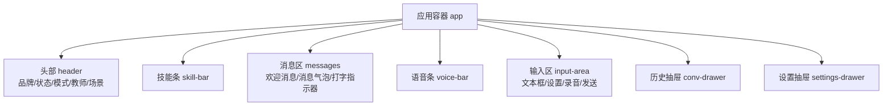
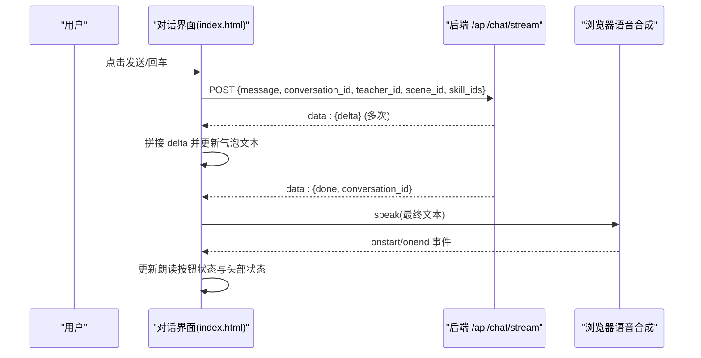
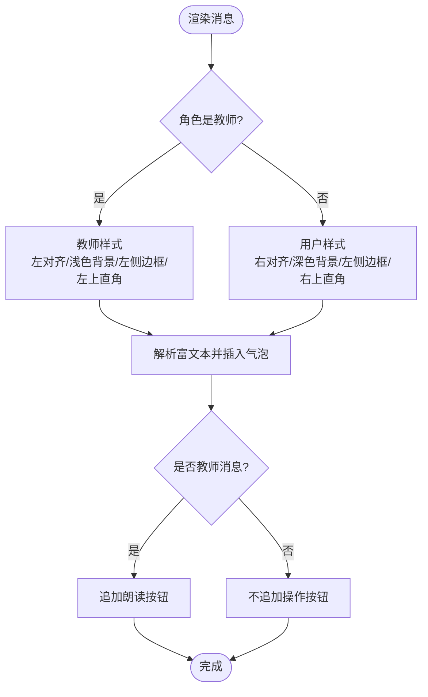
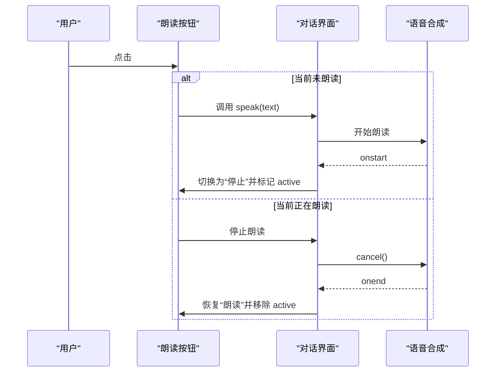
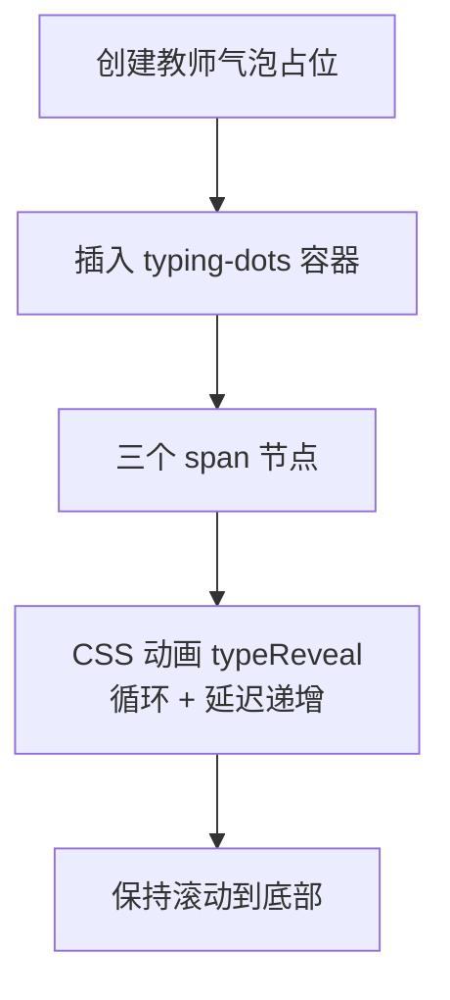
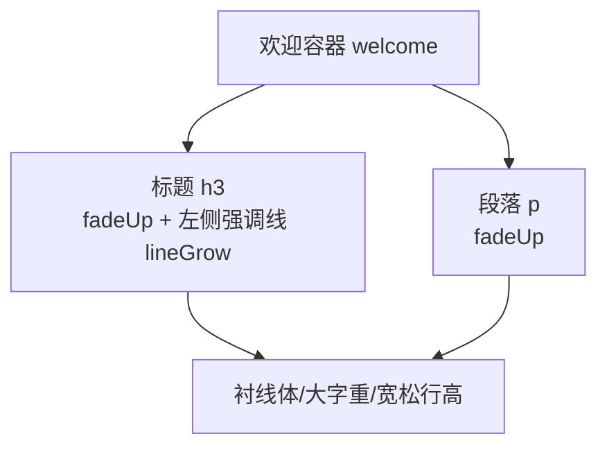
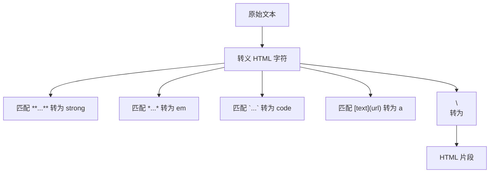
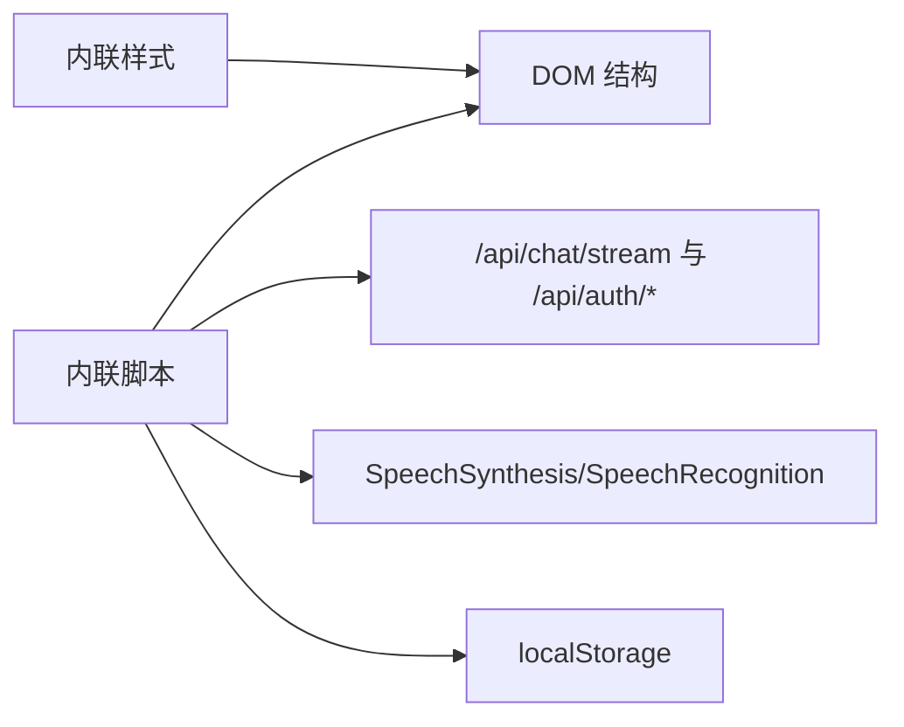

# 对话界面设计

<cite>
**本文引用的文件**   
- [hushai/meditation/static/index.html](file://hushai/meditation/static/index.html)
</cite>

## 目录
1. [简介](#简介)
2. [项目结构](#项目结构)
3. [核心组件](#核心组件)
4. [架构总览](#架构总览)
5. [详细组件分析](#详细组件分析)
6. [依赖关系分析](#依赖关系分析)
7. [性能与滚动优化](#性能与滚动优化)
8. [故障排查指南](#故障排查指南)
9. [结论](#结论)

## 简介
本设计文档聚焦 hush.ai 的对话界面，围绕消息气泡的设计系统、操作按钮交互、打字指示器动画、欢迎消息结构与富文本渲染能力展开。目标是帮助设计师与前端工程师在统一的设计语言下实现一致、可维护且高性能的对话体验。

## 项目结构
对话界面由单页 HTML 承载，包含内联样式与脚本，负责：
- 登录遮罩与品牌展示
- 顶部状态栏与模式切换（冥想陪伴/知识库问答）
- 教师选择与场景选择
- 技能加持条
- 消息列表区域
- 语音输入/输出控制
- 设置抽屉（音色、语速、音调）
- 进度与呼吸练习等辅助功能

图示来源
- [hushai/meditation/static/index.html:944-1036](file://hushai/meditation/static/index.html#L944-L1036)

章节来源
- [hushai/meditation/static/index.html:944-1036](file://hushai/meditation/static/index.html#L944-L1036)

## 核心组件
- 消息气泡系统：教师消息与用户消息通过头像、气泡背景、边框与圆角进行视觉区分；内容排版遵循统一的行高、字号与间距规范。
- 消息操作按钮：朗读按钮具备“播放/停止”状态切换与视觉反馈；当前未实现复制按钮，但已预留操作区布局。
- 打字指示器：三点跳动动画，节奏稳定，提供明确的“正在生成”引导。
- 欢迎消息：标题+副文案的结构化呈现，带有入场动画与左侧强调线。
- 富文本渲染：支持加粗、斜体、行内代码、链接与换行；代码块暂不支持语法高亮与多行块级渲染。

章节来源
- [hushai/meditation/static/index.html:393-453](file://hushai/meditation/static/index.html#L393-L453)
- [hushai/meditation/static/index.html:455-461](file://hushai/meditation/static/index.html#L455-L461)
- [hushai/meditation/static/index.html:466-487](file://hushai/meditation/static/index.html#L466-L487)
- [hushai/meditation/static/index.html:1694-1703](file://hushai/meditation/static/index.html#L1694-L1703)
- [hushai/meditation/static/index.html:1732-1745](file://hushai/meditation/static/index.html#L1732-L1745)

## 架构总览
从 UI 到后端的数据流如下：
- 用户输入后，前端构造请求并调用流式接口，逐段拼接文本显示为“流式气泡”。
- 完成后追加朗读按钮并自动朗读。
- 教师/场景/技能等上下文参数随请求一并发送。

图示来源
- [hushai/meditation/static/index.html:1799-1891](file://hushai/meditation/static/index.html#L1799-L1891)
- [hushai/meditation/static/index.html:1662-1692](file://hushai/meditation/static/index.html#L1662-L1692)

## 详细组件分析

### 消息气泡设计系统
- 角色区分
  - 教师消息：左对齐，浅色纸色背景，左侧细边框，圆角仅左上为直角以贴合对话流向；头像深色圆形，首字居中。
  - 用户消息：右对齐，反色（深色背景、浅色文字），右侧圆角为直角；头像浅色背景、描边。
- 内容与排版
  - 字体：正文使用衬线体，行高宽松，字号适中，确保阅读舒适。
  - 强调：加粗、斜体、行内代码、链接均有明确样式；链接悬停加深颜色。
  - 名称标签：小字号、大写、低对比度，标注说话者。
- 边框与圆角
  - 教师气泡：左侧 2px 强调边框，左上直角。
  - 用户气泡：左侧 2px 强调边框（与整体暗色协调），右上直角。
- 操作区
  - 位于气泡下方，采用等宽小字按钮，默认浅灰，悬停变深；当前实现“朗读”，未实现“复制”。

图示来源
- [hushai/meditation/static/index.html:401-443](file://hushai/meditation/static/index.html#L401-L443)
- [hushai/meditation/static/index.html:445-453](file://hushai/meditation/static/index.html#L445-L453)
- [hushai/meditation/static/index.html:1717-1745](file://hushai/meditation/static/index.html#L1717-L1745)

章节来源
- [hushai/meditation/static/index.html:401-443](file://hushai/meditation/static/index.html#L401-L443)
- [hushai/meditation/static/index.html:445-453](file://hushai/meditation/static/index.html#L445-L453)
- [hushai/meditation/static/index.html:1717-1745](file://hushai/meditation/static/index.html#L1717-L1745)

### 消息操作按钮（朗读/复制）
- 朗读
  - 状态：默认显示“▶ 朗读”，点击后变为“■ 停止”，并在朗读结束后恢复。
  - 视觉反馈：active 状态下颜色加深；头部状态点同步呼吸动画提示正在朗读。
  - 行为：调用浏览器语音合成，按设置中的音色、语速、音调朗读。
- 复制
  - 现状：未实现复制按钮。
  - 建议：在操作区新增“复制”按钮，点击后将气泡文本写入剪贴板，并提供短暂成功反馈（如图标切换或提示）。

图示来源
- [hushai/meditation/static/index.html:1732-1745](file://hushai/meditation/static/index.html#L1732-L1745)
- [hushai/meditation/static/index.html:1662-1692](file://hushai/meditation/static/index.html#L1662-L1692)

章节来源
- [hushai/meditation/static/index.html:1732-1745](file://hushai/meditation/static/index.html#L1732-L1745)
- [hushai/meditation/static/index.html:1662-1692](file://hushai/meditation/static/index.html#L1662-L1692)

### 打字指示器动画
- 结构：三个小圆点，依次错开延迟，形成波浪式跳动。
- 节奏：周期约 1.2s，缓动函数平滑，避免突兀闪烁。
- 视觉引导：出现在教师侧气泡位置，表示“正在生成”，提升等待感知。

图示来源
- [hushai/meditation/static/index.html:455-461](file://hushai/meditation/static/index.html#L455-L461)
- [hushai/meditation/static/index.html:1748-1760](file://hushai/meditation/static/index.html#L1748-L1760)

章节来源
- [hushai/meditation/static/index.html:455-461](file://hushai/meditation/static/index.html#L455-L461)
- [hushai/meditation/static/index.html:1748-1760](file://hushai/meditation/static/index.html#L1748-L1760)

### 欢迎消息的视觉设计与内容结构
- 结构：标题（带左侧强调竖线）+ 副文案段落。
- 视觉：大字号标题、宽松行高、淡入上移动画；左侧强调线渐显，营造“书写感”。
- 用途：首次进入时作为引导，随后被第一条消息替换。

图示来源
- [hushai/meditation/static/index.html:466-487](file://hushai/meditation/static/index.html#L466-L487)
- [hushai/meditation/static/index.html:1011-1016](file://hushai/meditation/static/index.html#L1011-L1016)

章节来源
- [hushai/meditation/static/index.html:466-487](file://hushai/meditation/static/index.html#L466-L487)
- [hushai/meditation/static/index.html:1011-1016](file://hushai/meditation/static/index.html#L1011-L1016)

### 富文本渲染支持
- 支持项
  - 加粗：**文本** → strong
  - 斜体：*文本* → em
  - 行内代码：`代码` → code（等宽字体、浅色背景）
  - 链接：[文本](URL) → a（新窗口打开，noopener）
  - 换行：\n →  
- 不支持项
  - 代码块（fenced code block）：无语法高亮与多行块级样式
  - 列表、引用、表格等 Markdown 元素：未处理
- 建议
  - 引入轻量 Markdown 解析库，或扩展正则以支持代码块、列表、引用等。
  - 对链接增加安全属性与目标策略，必要时做白名单校验。

图示来源
- [hushai/meditation/static/index.html:1694-1703](file://hushai/meditation/static/index.html#L1694-L1703)

章节来源
- [hushai/meditation/static/index.html:1694-1703](file://hushai/meditation/static/index.html#L1694-L1703)

## 依赖关系分析
- 外部依赖
  - 字体：Google Fonts（Cormorant Garamond、Noto Serif SC、JetBrains Mono）
  - 图标：内联 SVG（无需额外资源）
- 运行时依赖
  - Web Speech API（语音合成/识别）
  - Fetch + ReadableStream（服务端流式响应）
  - localStorage（会话、偏好）
- 内部耦合
  - 样式与脚本同文件，便于快速迭代，但需注意职责分离与维护成本。

图示来源
- [hushai/meditation/static/index.html:1161-1165](file://hushai/meditation/static/index.html#L1161-L1165)
- [hushai/meditation/static/index.html:1640-1659](file://hushai/meditation/static/index.html#L1640-L1659)
- [hushai/meditation/static/index.html:1662-1692](file://hushai/meditation/static/index.html#L1662-L1692)
- [hushai/meditation/static/index.html:1799-1891](file://hushai/meditation/static/index.html#L1799-L1891)

章节来源
- [hushai/meditation/static/index.html:1161-1165](file://hushai/meditation/static/index.html#L1161-L1165)
- [hushai/meditation/static/index.html:1640-1659](file://hushai/meditation/static/index.html#L1640-L1659)
- [hushai/meditation/static/index.html:1662-1692](file://hushai/meditation/static/index.html#L1662-L1692)
- [hushai/meditation/static/index.html:1799-1891](file://hushai/meditation/static/index.html#L1799-L1891)

## 性能与滚动优化
- 滚动行为
  - 消息区使用 overflow-y:auto，自定义细滚动条，保持界面克制。
  - 每次追加消息后滚动到底部，保证最新内容可见。
- 渲染优化建议
  - 流式更新阶段仅更新文本节点，避免频繁 innerHTML 导致重排。
  - 长对话场景建议使用虚拟列表或分页加载，减少 DOM 节点数量。
  - 将动画与过渡限制在 transform/opacity，降低重绘开销。
- 无障碍与动效
  - 尊重 prefers-reduced-motion，禁用不必要的动画。
  - 关键交互提供 focus-visible 轮廓，提升键盘可达性。

章节来源
- [hushai/meditation/static/index.html:393-399](file://hushai/meditation/static/index.html#L393-L399)
- [hushai/meditation/static/index.html:741-746](file://hushai/meditation/static/index.html#L741-L746)
- [hushai/meditation/static/index.html:1745-1746](file://hushai/meditation/static/index.html#L1745-L1746)
- [hushai/meditation/static/index.html:1865-1867](file://hushai/meditation/static/index.html#L1865-L1867)

## 故障排查指南
- 无法连接服务
  - 现象：登录失败或消息发送报错。
  - 排查：检查网络与后端地址；确认 token 刷新逻辑是否触发。
- 语音不可用
  - 现象：朗读/录音无效。
  - 排查：浏览器是否支持 SpeechSynthesis/SpeechRecognition；是否在 HTTPS 环境；是否授予麦克风权限。
- 流式输出异常
  - 现象：文本不更新或中途中断。
  - 排查：检查后端 SSE/ReadableStream 格式；确认 data: 前缀与 JSON 字段 delta/done 是否正确。
- 富文本显示异常
  - 现象：链接不安全或样式错乱。
  - 排查：确认转义顺序与正则覆盖范围；必要时引入受控的 Markdown 解析器。

章节来源
- [hushai/meditation/static/index.html:1590-1609](file://hushai/meditation/static/index.html#L1590-L1609)
- [hushai/meditation/static/index.html:1611-1637](file://hushai/meditation/static/index.html#L1611-L1637)
- [hushai/meditation/static/index.html:1640-1659](file://hushai/meditation/static/index.html#L1640-L1659)
- [hushai/meditation/static/index.html:1799-1891](file://hushai/meditation/static/index.html#L1799-L1891)
- [hushai/meditation/static/index.html:1694-1703](file://hushai/meditation/static/index.html#L1694-L1703)

## 结论
该对话界面以极简、克制的视觉语言构建，消息气泡通过角色化的色彩与边框清晰区分，打字指示器提供稳定的等待反馈，欢迎消息营造沉浸氛围。富文本渲染满足基础需求，后续可扩展代码块、列表等高级元素。建议在保持现有风格的前提下，完善复制等操作、增强长列表性能与安全性，进一步提升可用性与可访问性。