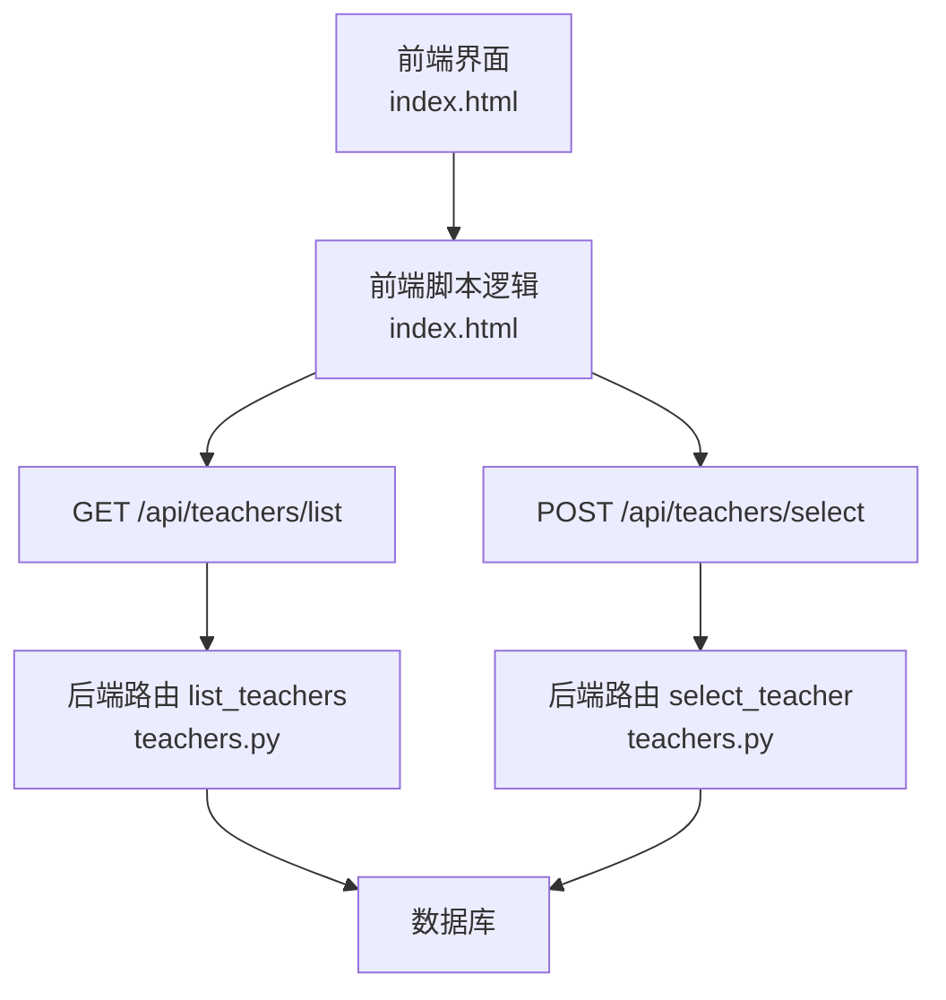
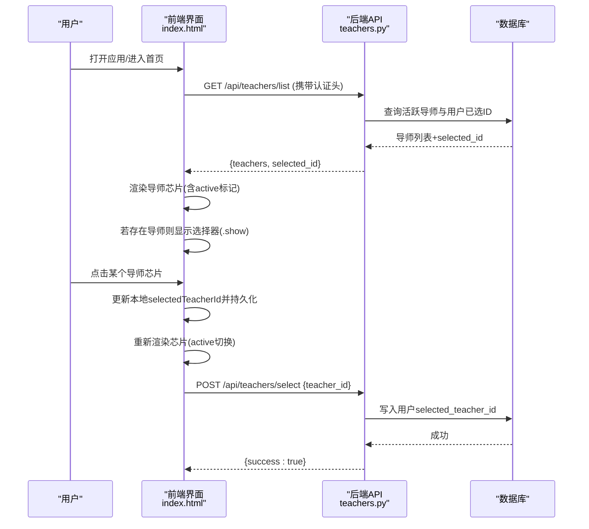
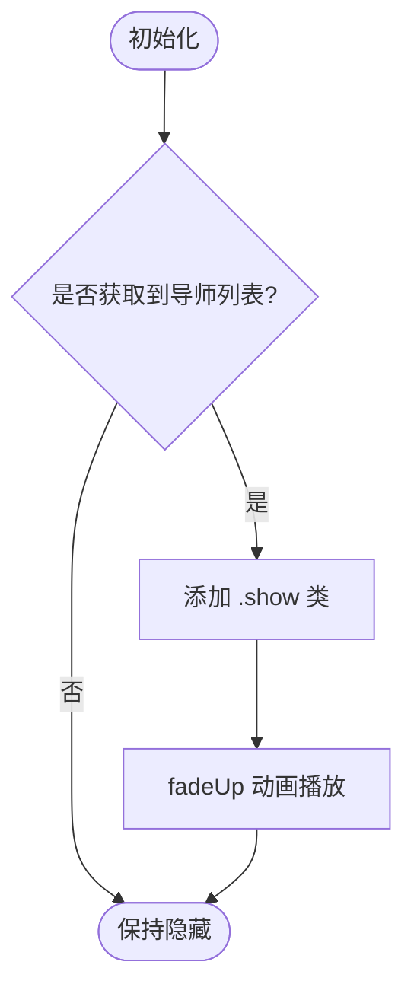
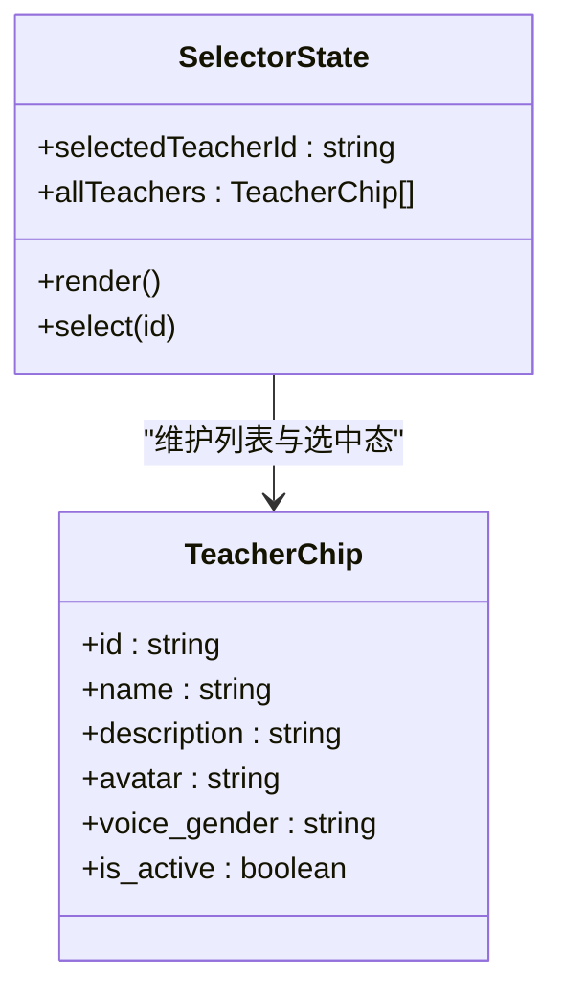
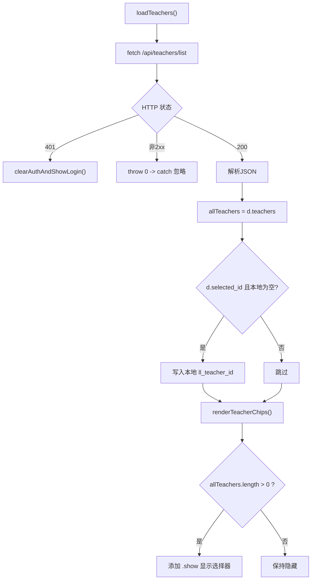
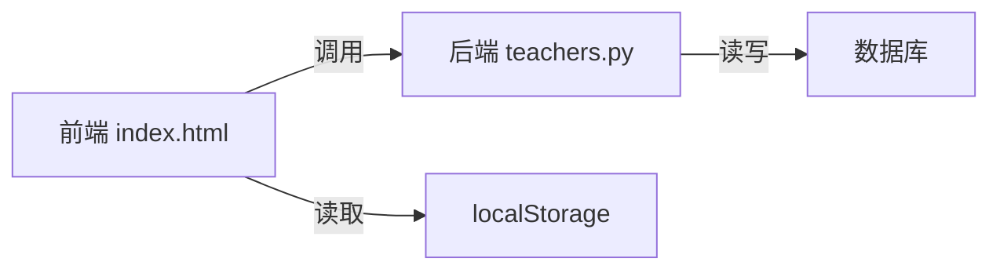

# 导师选择器

<cite>
**本文引用的文件**   
- [index.html](file://hushai/meditation/static/index.html)
- [teachers.py](file://hushai/meditation/api/teachers.py)
</cite>

## 目录
1. [简介](#简介)
2. [项目结构](#项目结构)
3. [核心组件](#核心组件)
4. [架构总览](#架构总览)
5. [详细组件分析](#详细组件分析)
6. [依赖关系分析](#依赖关系分析)
7. [性能与体验优化](#性能与体验优化)
8. [故障排查指南](#故障排查指南)
9. [结论](#结论)

## 简介
本设计文档面向 hush.ai 的“导师选择器”前端组件，聚焦以下目标：
- 导师芯片（Avatar + 名称标签 + 描述）的视觉规范与交互状态
- 展开/收起动画与可见性控制
- 选中状态的视觉反馈（边框高亮、背景色变化、图标状态）
- 导师分类与筛选能力的设计建议
- 移动端响应式布局与触摸交互优化
- 动态加载流程与错误处理机制

该组件位于冥想对话界面的头部区域，用于在用户会话中切换“冥想搭子”（导师），并联动语音音色偏好。

## 项目结构
导师选择器由前端页面与后端 API 两部分组成：
- 前端：单页 HTML 内嵌样式与脚本，负责渲染导师芯片、管理选中态、发起网络请求
- 后端：FastAPI 路由提供导师列表、详情与选择接口，返回结构化数据供前端渲染

图表来源
- [index.html:990-1000](file://hushai/meditation/static/index.html#L990-L1000)
- [index.html:1368-1438](file://hushai/meditation/static/index.html#L1368-L1438)
- [teachers.py:58-86](file://hushai/meditation/api/teachers.py#L58-L86)
- [teachers.py:121-138](file://hushai/meditation/api/teachers.py#L121-L138)

章节来源
- [index.html:990-1000](file://hushai/meditation/static/index.html#L990-L1000)
- [index.html:1368-1438](file://hushai/meditation/static/index.html#L1368-L1438)
- [teachers.py:58-86](file://hushai/meditation/api/teachers.py#L58-L86)
- [teachers.py:121-138](file://hushai/meditation/api/teachers.py#L121-L138)

## 核心组件
- 容器与标签
  - 容器：teacher-selector（默认隐藏，通过 .show 显示）
  - 标题标签：teacher-label（小字号大写提示）
- 芯片列表
  - 容器：teacher-chips（flex 换行排列）
  - 单个芯片：teacher-chip（包含头像、信息区）
  - 头像：teacher-chip-ava（圆形占位，支持文本或图片）
  - 信息区：teacher-chip-info（纵向堆叠）
    - 名称：teacher-chip-name
    - 描述：teacher-chip-desc（超长省略）
- 选中态
  - 类名 active 控制边框、背景与头像底色差异

章节来源
- [index.html:301-329](file://hushai/meditation/static/index.html#L301-L329)
- [index.html:990-994](file://hushai/meditation/static/index.html#L990-L994)
- [index.html:1391-1408](file://hushai/meditation/static/index.html#L1391-L1408)

## 架构总览
导师选择器的关键交互流程如下：

图表来源
- [index.html:1372-1438](file://hushai/meditation/static/index.html#L1372-L1438)
- [teachers.py:58-86](file://hushai/meditation/api/teachers.py#L58-L86)
- [teachers.py:121-138](file://hushai/meditation/api/teachers.py#L121-L138)

## 详细组件分析

### 导师芯片设计规范
- 尺寸与排版
  - 头像：圆形，固定宽高，居中显示首字或图片
  - 名称：中等字号，加粗强调
  - 描述：较小字号，灰色调，单行溢出省略
- 颜色与材质
  - 未选中：浅灰边框、浅色背景、头像为中性色
  - 悬停：边框加深、文字变深
  - 选中：深色边框、暖色背景、头像使用主色
- 可访问性
  - 按钮语义、焦点可见、键盘可操作
  - 描述过长时保留可读性（省略）

章节来源
- [index.html:310-329](file://hushai/meditation/static/index.html#L310-L329)
- [index.html:1391-1408](file://hushai/meditation/static/index.html#L1391-L1408)

### 展开/收起动画与可见性
- 默认隐藏：teacher-selector 无 .show 时 display:none
- 展开显示：当后端返回导师列表非空时，添加 .show 类触发淡入上移动画
- 动画参数：使用统一的 ease-out-expo 缓动，时长约 0.4s

图表来源
- [index.html:301-305](file://hushai/meditation/static/index.html#L301-L305)
- [index.html:1386-1388](file://hushai/meditation/static/index.html#L1386-L1388)

章节来源
- [index.html:301-305](file://hushai/meditation/static/index.html#L301-L305)
- [index.html:1386-1388](file://hushai/meditation/static/index.html#L1386-L1388)

### 选中态视觉反馈
- 边框高亮：active 下边框变为深色
- 背景色变化：active 下背景采用暖纸色
- 头像状态：active 下头像使用主色，未选中使用中性色
- 同步消息区头像：选择后更新消息气泡旁的导师头像

图表来源
- [index.html:1368-1438](file://hushai/meditation/static/index.html#L1368-L1438)
- [index.html:310-329](file://hushai/meditation/static/index.html#L310-L329)

章节来源
- [index.html:1391-1438](file://hushai/meditation/static/index.html#L1391-L1438)
- [index.html:310-329](file://hushai/meditation/static/index.html#L310-L329)

### 分类与筛选功能设计
当前实现未内置“导师分类/筛选”控件，但后端返回字段包含风格标签与性别等元信息，可用于扩展：
- 建议维度
  - 风格标签：基于 style_tags 生成标签云或横向滚动筛选条
  - 性别/语言：结合 voice_gender 与系统音色进行联动过滤
- 交互建议
  - 顶部标签栏，点击切换 active 状态
  - 实时过滤 chips 列表，保持选中态一致
  - 无结果时展示友好提示

章节来源
- [teachers.py:72-86](file://hushai/meditation/api/teachers.py#L72-L86)
- [index.html:1391-1408](file://hushai/meditation/static/index.html#L1391-L1408)

### 移动端响应式与触摸交互
- 布局适配
  - 整体应用最大宽度限制，窄屏自动去左右边框
  - 芯片 flex-wrap 换行，保证多列自适应
- 触控优化
  - 按钮最小点击面积充足，间距合理
  - 避免误触：hover 效果在触屏设备退化为点击反馈
- 字体与对比度
  - 名称与描述字号层级清晰，满足可读性要求

章节来源
- [index.html:72-78](file://hushai/meditation/static/index.html#L72-L78)
- [index.html:310-329](file://hushai/meditation/static/index.html#L310-L329)

### 动态加载与错误处理
- 加载流程
  - 带 Bearer Token 请求列表接口
  - 解析 teachers 与 selected_id，优先恢复上次选择
  - 渲染 chips 并在有数据时显示选择器
- 错误处理
  - 401 未授权：清除认证并跳转登录
  - 网络异常：静默失败，不阻断主流程
  - 空列表：不显示选择器
- 选择提交
  - 点击后先更新本地状态与 UI，再异步提交选择
  - 提交失败不影响本地选择体验

图表来源
- [index.html:1372-1389](file://hushai/meditation/static/index.html#L1372-L1389)

章节来源
- [index.html:1372-1438](file://hushai/meditation/static/index.html#L1372-L1438)

## 依赖关系分析
- 前端依赖
  - DOM 元素：teacherSelector、teacherChips
  - 本地存储：ll_teacher_id、ll_gender 等
  - 浏览器 API：fetch、localStorage
- 后端依赖
  - FastAPI 路由：list、get、select
  - 数据库模型：Teacher、User
  - 认证中间件：_require_user

图表来源
- [index.html:1372-1438](file://hushai/meditation/static/index.html#L1372-L1438)
- [teachers.py:58-86](file://hushai/meditation/api/teachers.py#L58-L86)
- [teachers.py:121-138](file://hushai/meditation/api/teachers.py#L121-L138)

章节来源
- [index.html:1372-1438](file://hushai/meditation/static/index.html#L1372-L1438)
- [teachers.py:58-86](file://hushai/meditation/api/teachers.py#L58-L86)
- [teachers.py:121-138](file://hushai/meditation/api/teachers.py#L121-L138)

## 性能与体验优化
- 渲染优化
  - 批量创建节点并一次性插入，减少重排
  - 仅在有数据时显示选择器，避免无效布局计算
- 交互优化
  - 选择后立即更新 UI，再异步提交，提升感知速度
  - 使用 CSS transition 与 keyframes 实现轻量动画
- 可访问性
  - 焦点可见、键盘导航、语义化按钮
  - 尊重 prefers-reduced-motion 媒体查询

[本节为通用指导，无需特定文件引用]

## 故障排查指南
- 无法显示导师列表
  - 检查认证头是否正确传递
  - 确认后端返回 teachers 数组是否为空
- 选择后未生效
  - 检查本地 ll_teacher_id 是否被覆盖
  - 查看 select 接口是否返回 success
- 401 未授权
  - 触发登录流程，刷新 token 后重试
- 空列表场景
  - 选择器保持隐藏，引导用户继续对话

章节来源
- [index.html:1372-1389](file://hushai/meditation/static/index.html#L1372-L1389)
- [index.html:1429-1434](file://hushai/meditation/static/index.html#L1429-L1434)
- [teachers.py:58-86](file://hushai/meditation/api/teachers.py#L58-L86)
- [teachers.py:121-138](file://hushai/meditation/api/teachers.py#L121-L138)

## 结论
导师选择器以简洁的芯片形态呈现导师信息，配合清晰的选中态与轻量的展开动画，提供了直观的选择体验。当前实现已完成基础的数据加载、选择与持久化；后续可在风格标签与性别/语言维度上扩展筛选能力，进一步提升匹配效率与个性化体验。同时，建议在错误路径增加更明确的提示与重试机制，以提升可用性。