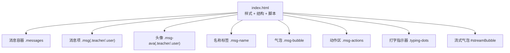
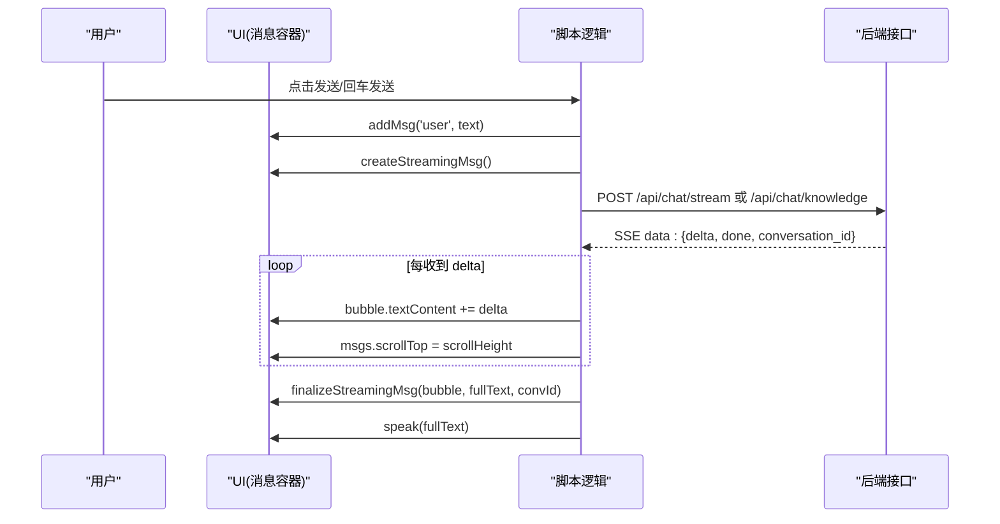
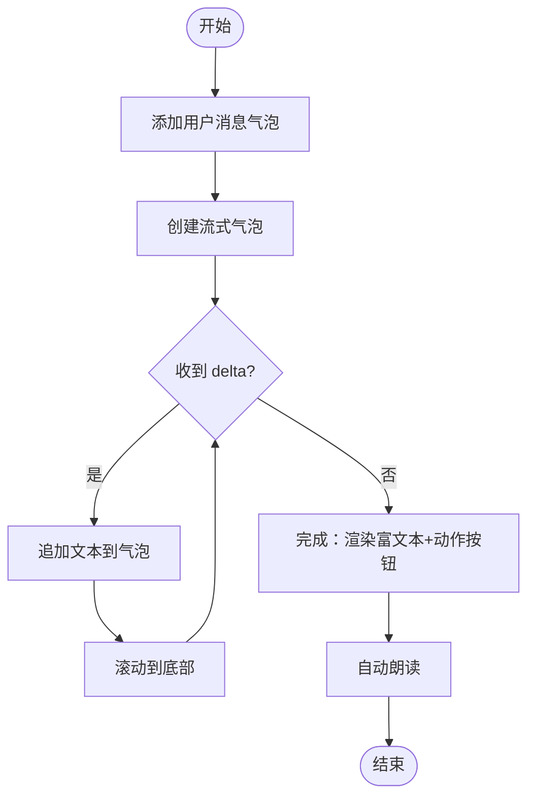
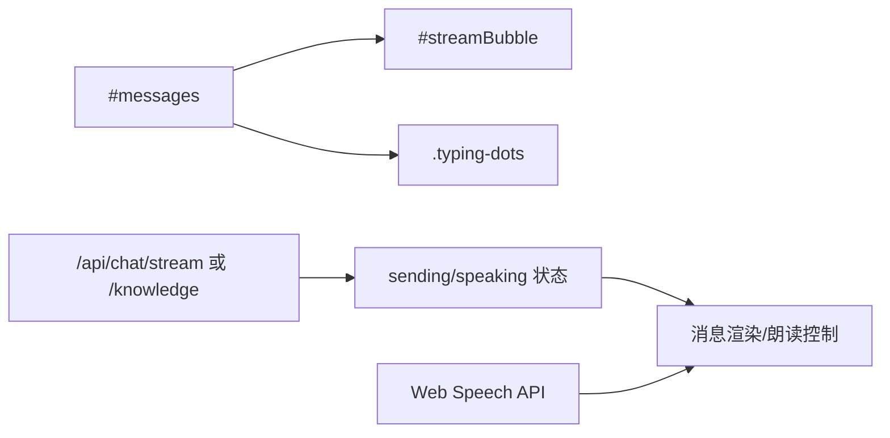

# 消息系统

<cite>
**本文引用的文件**   
- [hushai/meditation/static/index.html](file://hushai/meditation/static/index.html)
</cite>

## 目录
1. [简介](#简介)
2. [项目结构](#项目结构)
3. [核心组件](#核心组件)
4. [架构总览](#架构总览)
5. [详细组件分析](#详细组件分析)
6. [依赖关系分析](#依赖关系分析)
7. [性能与滚动优化](#性能与滚动优化)
8. [故障排查指南](#故障排查指南)
9. [结论](#结论)

## 简介
本文件为 hush.ai 前端“消息系统”的 UI 组件文档，聚焦于消息气泡、消息容器布局、动画效果（出现动画、打字指示器、流式文本渲染）、富文本渲染支持（代码块、链接、强调文本）、操作按钮（朗读等）以及消息列表的滚动行为与性能优化策略。所有说明均基于仓库中的前端实现进行梳理与归纳，便于设计与开发团队统一规范与落地。

## 项目结构
消息系统的 UI 与交互逻辑集中在单页入口文件中，包含样式、HTML 结构与脚本逻辑：
- 样式定义：消息气泡、头像、名称标签、动作按钮、打字指示器等
- HTML 结构：消息容器、欢迎区、输入区、设置抽屉、历史抽屉等
- 脚本逻辑：消息创建、Markdown 解析、流式接收、朗读控制、滚动定位等

图表来源
- [hushai/meditation/static/index.html:393-462](file://hushai/meditation/static/index.html#L393-L462)
- [hushai/meditation/static/index.html:1010-1016](file://hushai/meditation/static/index.html#L1010-L1016)
- [hushai/meditation/static/index.html:1694-1774](file://hushai/meditation/static/index.html#L1694-L1774)

章节来源
- [hushai/meditation/static/index.html:393-462](file://hushai/meditation/static/index.html#L393-L462)
- [hushai/meditation/static/index.html:1010-1016](file://hushai/meditation/static/index.html#L1010-L1016)

## 核心组件
- 消息容器 .messages：垂直排列的消息列表，负责滚动与间距
- 消息项 .msg：区分教师消息与用户消息，通过 class teacher/user 控制对齐与方向
- 头像 .msg-ava：圆形头像，教师侧深色背景浅色文字，用户侧浅色背景深色边框
- 名称标签 .msg-name：小字号大写英文字体风格，显示“小观/你”等
- 气泡 .msg-bubble：承载富文本内容，教师侧浅底深边线，用户侧深色底浅色字
- 动作区 .msg-actions：放置朗读等操作按钮
- 打字指示器 .typing-dots：三个圆点依次呼吸动画
- 流式气泡 #streamBubble：用于实时追加文本

章节来源
- [hushai/meditation/static/index.html:393-462](file://hushai/meditation/static/index.html#L393-L462)
- [hushai/meditation/static/index.html:1694-1774](file://hushai/meditation/static/index.html#L1694-L1774)

## 架构总览
消息系统的前端流程包括：发送消息、创建流式气泡、接收服务端流式片段、逐段更新文本、最终完成并附加动作按钮、自动朗读。

图表来源
- [hushai/meditation/static/index.html:1795-1891](file://hushai/meditation/static/index.html#L1795-L1891)
- [hushai/meditation/static/index.html:1762-1793](file://hushai/meditation/static/index.html#L1762-L1793)
- [hushai/meditation/static/index.html:1662-1692](file://hushai/meditation/static/index.html#L1662-L1692)

## 详细组件分析

### 消息气泡设计规范
- 视觉区分
  - 教师消息：左对齐，浅底色，左侧有较粗的装饰边线；气泡左上角直角，其余圆角
  - 用户消息：右对齐，反色（深色底浅色字），右侧圆角处理，左侧装饰边线颜色更深
- 边框与排版
  - 教师侧气泡使用浅色背景与较深的左侧边线，形成“引用条”感
  - 用户侧气泡使用深色背景与浅色文字，增强对比度
  - 行高与字号在气泡内统一，确保可读性
- 富文本样式
  - 加粗、斜体、行内代码、链接均有明确样式
  - 当前实现未提供多行代码块语法高亮，仅支持行内代码

章节来源
- [hushai/meditation/static/index.html:421-443](file://hushai/meditation/static/index.html#L421-L443)
- [hushai/meditation/static/index.html:427-434](file://hushai/meditation/static/index.html#L427-L434)

### 消息容器布局结构
- 容器 .messages：flex 纵向布局，gap 控制消息间距，启用自定义细滚动条
- 消息项 .msg：
  - 教师消息：align-self:flex-start，最大宽度约 88%
  - 用户消息：align-self:flex-end，最大宽度约 82%，且使用 row-reverse 使头像在右侧
- 头像 .msg-ava：固定宽高圆形，教师侧深色背景浅色字，用户侧浅色背景深色边框
- 名称标签 .msg-name：位于气泡上方，小字号、大写风格、低对比度
- 气泡 .msg-bubble：内部 padding 适中，行高舒适，支持富文本元素

章节来源
- [hushai/meditation/static/index.html:393-443](file://hushai/meditation/static/index.html#L393-L443)
- [hushai/meditation/static/index.html:1717-1731](file://hushai/meditation/static/index.html#L1717-L1731)

### 消息动画效果
- 出现动画：每条消息以轻微上移+淡入的方式入场
- 打字指示器：三个圆点依次呼吸动画，表示正在生成
- 流式文本渲染：按数据流增量拼接文本，保持滚动到底部
- 无障碍：尊重 prefers-reduced-motion，减少动效

图表来源
- [hushai/meditation/static/index.html:102-105](file://hushai/meditation/static/index.html#L102-L105)
- [hushai/meditation/static/index.html:454-461](file://hushai/meditation/static/index.html#L454-L461)
- [hushai/meditation/static/index.html:1762-1793](file://hushai/meditation/static/index.html#L1762-L1793)
- [hushai/meditation/static/index.html:1843-1883](file://hushai/meditation/static/index.html#L1843-L1883)

章节来源
- [hushai/meditation/static/index.html:102-105](file://hushai/meditation/static/index.html#L102-L105)
- [hushai/meditation/static/index.html:454-461](file://hushai/meditation/static/index.html#L454-L461)
- [hushai/meditation/static/index.html:1762-1793](file://hushai/meditation/static/index.html#L1762-L1793)
- [hushai/meditation/static/index.html:1843-1883](file://hushai/meditation/static/index.html#L1843-L1883)

### 富文本渲染支持
- 支持的标记
  - 加粗：**text**
  - 斜体：*text*
  - 行内代码：`code`
  - 链接：[label](url)
  - 换行：\n 转换为  
- 不支持
  - 多行代码块语法高亮
  - 列表、表格、图片等
- 安全处理
  - 对特殊字符进行转义，避免 XSS
  - 链接使用 target="_blank" 与 rel="noopener"

章节来源
- [hushai/meditation/static/index.html:1694-1703](file://hushai/meditation/static/index.html#L1694-L1703)
- [hushai/meditation/static/index.html:1728-1730](file://hushai/meditation/static/index.html#L1728-L1730)

### 消息操作按钮设计
- 朗读按钮
  - 状态切换：播放时显示“停止”，停止后恢复“朗读”
  - 自动朗读：消息完成后自动调用语音合成
  - 状态同步：根据浏览器语音状态定时刷新按钮文案
- 复制按钮
  - 当前实现未提供复制功能，可在动作区扩展
- 交互反馈
  - 按钮 hover 高亮，active 态加深
  - 朗读中头部状态点呼吸动画提示

章节来源
- [hushai/meditation/static/index.html:1732-1746](file://hushai/meditation/static/index.html#L1732-L1746)
- [hushai/meditation/static/index.html:1776-1793](file://hushai/meditation/static/index.html#L1776-L1793)
- [hushai/meditation/static/index.html:1662-1692](file://hushai/meditation/static/index.html#L1662-L1692)
- [hushai/meditation/static/index.html:277-287](file://hushai/meditation/static/index.html#L277-L287)

### 消息列表滚动行为
- 新消息插入后立即滚动到底部
- 流式文本追加过程中持续滚动，保证可见最新内容
- 历史记录加载后一次性渲染并滚动到底部

章节来源
- [hushai/meditation/static/index.html:1745-1746](file://hushai/meditation/static/index.html#L1745-L1746)
- [hushai/meditation/static/index.html:1866-1867](file://hushai/meditation/static/index.html#L1866-L1867)
- [hushai/meditation/static/index.html:1266-1267](file://hushai/meditation/static/index.html#L1266-L1267)

## 依赖关系分析
- DOM 节点依赖
  - 消息容器 #messages
  - 流式气泡 #streamBubble
  - 打字指示器 .typing-dots
- 事件与状态
  - 发送状态 sending、朗读状态 speaking
  - 会话 ID 持久化（ll_conv/ll_kb_conv）
- 外部能力
  - Web Speech API（语音合成与识别）
  - Fetch + ReadableStream（SSE 流式读取）

图表来源
- [hushai/meditation/static/index.html:1010-1016](file://hushai/meditation/static/index.html#L1010-L1016)
- [hushai/meditation/static/index.html:1762-1774](file://hushai/meditation/static/index.html#L1762-L1774)
- [hushai/meditation/static/index.html:1662-1692](file://hushai/meditation/static/index.html#L1662-L1692)
- [hushai/meditation/static/index.html:1843-1883](file://hushai/meditation/static/index.html#L1843-L1883)

章节来源
- [hushai/meditation/static/index.html:1010-1016](file://hushai/meditation/static/index.html#L1010-L1016)
- [hushai/meditation/static/index.html:1762-1774](file://hushai/meditation/static/index.html#L1762-L1774)
- [hushai/meditation/static/index.html:1662-1692](file://hushai/meditation/static/index.html#L1662-L1692)
- [hushai/meditation/static/index.html:1843-1883](file://hushai/meditation/static/index.html#L1843-L1883)

## 性能与滚动优化
- 现有优化
  - 流式文本直接追加到文本节点，避免频繁重排
  - 每次追加后滚动到底部，保证可见性
  - 自定义滚动条样式，降低视觉干扰
- 可改进建议
  - 虚拟列表：当消息数量较大时，采用虚拟滚动减少 DOM 节点数量
  - 增量渲染：将长文本分片渲染，结合 requestAnimationFrame 控制帧率
  - 防抖滚动：高频追加时合并滚动位置计算
  - 图片与复杂富文本懒加载：按需渲染，减少首屏压力
  - 语音合成节流：避免重复触发导致卡顿

章节来源
- [hushai/meditation/static/index.html:1866-1867](file://hushai/meditation/static/index.html#L1866-L1867)
- [hushai/meditation/static/index.html:393-399](file://hushai/meditation/static/index.html#L393-L399)

## 故障排查指南
- 登录过期
  - 现象：请求返回 401，界面提示重新登录
  - 处理：尝试刷新 token，失败则清空本地认证并回到登录页
- 网络错误
  - 现象：无法连接服务或接口不可用
  - 处理：气泡显示错误提示，允许重试
- 语音合成不可用
  - 现象：无声音或朗读按钮无效
  - 处理：检测浏览器是否支持 SpeechSynthesis，必要时降级提示
- 流式中断
  - 现象：中途断开或异常
  - 处理：捕获异常并在气泡中显示友好提示，恢复发送状态

章节来源
- [hushai/meditation/static/index.html:1611-1637](file://hushai/meditation/static/index.html#L1611-L1637)
- [hushai/meditation/static/index.html:1838-1842](file://hushai/meditation/static/index.html#L1838-L1842)
- [hushai/meditation/static/index.html:1884-1891](file://hushai/meditation/static/index.html#L1884-L1891)

## 结论
该消息系统在前端实现了清晰的双角色视觉区分、简洁而优雅的富文本渲染、流畅的流式体验与基本的朗读能力。建议在后续迭代中引入虚拟列表与更完善的富文本支持，以提升长对话场景下的性能与表现力。同时，完善复制等常用操作按钮，提升用户体验一致性。