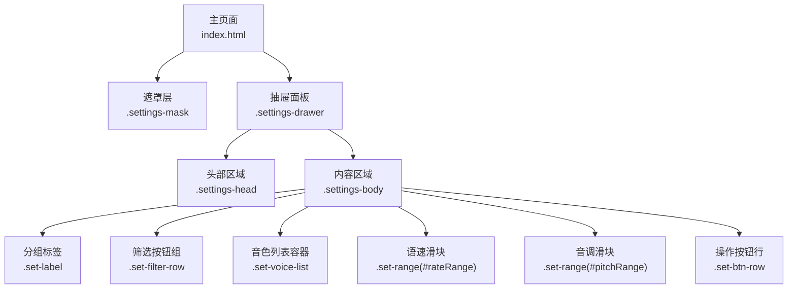
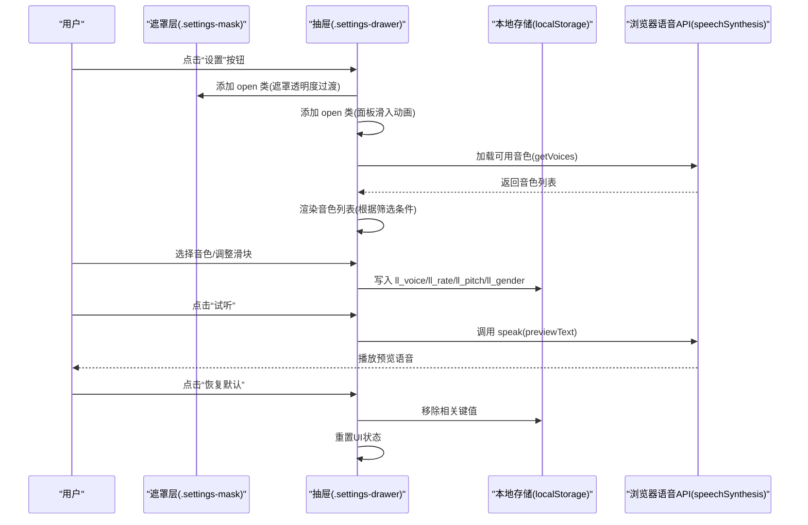
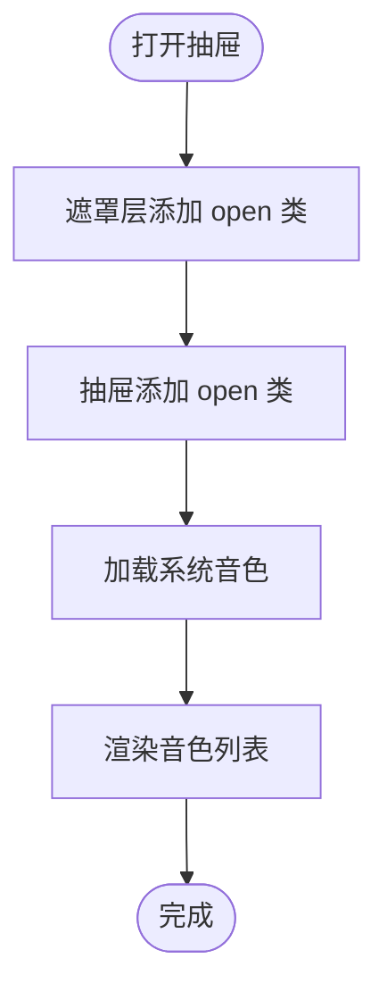
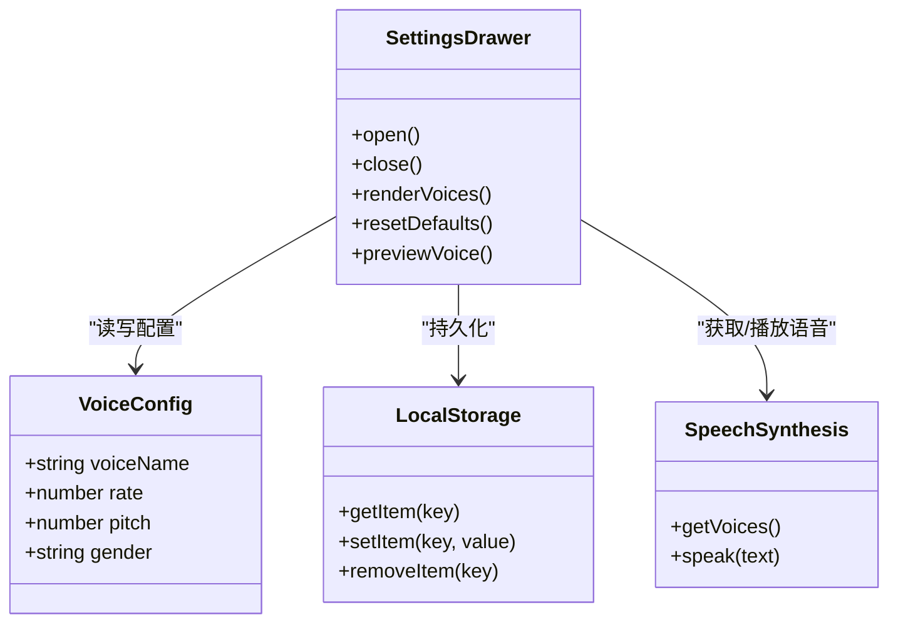
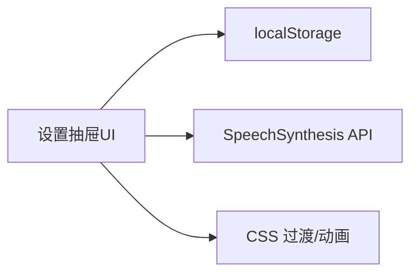

# 设置抽屉

<cite>
**本文引用的文件**   
- [index.html](file://hushai/meditation/static/index.html)
</cite>

## 目录
1. [简介](#简介)
2. [项目结构](#项目结构)
3. [核心组件](#核心组件)
4. [架构总览](#架构总览)
5. [详细组件分析](#详细组件分析)
6. [依赖关系分析](#依赖关系分析)
7. [性能考量](#性能考量)
8. [故障排查指南](#故障排查指南)
9. [结论](#结论)

## 简介
本设计文档聚焦于 hush.ai 前端“设置抽屉”（语音设置）的 UI 设计与交互实现，覆盖以下要点：
- 抽屉面板的展开与收起动画效果（遮罩层过渡、面板滑入）
- 设置项的组织结构（分组标签、筛选按钮、音色列表、滑块控件）
- 语音设置界面（音色预览、试听功能、参数调节）
- 数据绑定与实时预览机制
- 设置保存与恢复逻辑
- 设置项验证规则与错误提示

## 项目结构
该设置抽屉为单页应用的一部分，位于前端入口页面中，包含 HTML 结构、CSS 样式与内联脚本。关键位置如下：
- 抽屉容器与遮罩层：HTML 结构与类名定义
- 抽屉样式：CSS 变量、过渡与动画
- 交互逻辑：打开/关闭、渲染音色列表、监听滑块变化、试听与恢复默认

图表来源
- [index.html:1050-1089](file://hushai/meditation/static/index.html#L1050-L1089)
- [index.html:544-665](file://hushai/meditation/static/index.html#L544-L665)

章节来源
- [index.html:1050-1089](file://hushai/meditation/static/index.html#L1050-L1089)
- [index.html:544-665](file://hushai/meditation/static/index.html#L544-L665)

## 核心组件
- 遮罩层（Mask）：固定定位覆盖全屏，控制透明度与点击事件以关闭抽屉
- 抽屉面板（Drawer）：底部弹出式面板，使用 transform 进行滑入/滑出动画
- 头部区域（Head）：标题与关闭按钮
- 内容区域（Body）：按模块分组的设置项
  - 音色筛选：一组切换按钮，用于过滤中文女声/男声/英文等
  - 音色列表：动态渲染可用音色，支持选中高亮
  - 语速/音调滑块：范围输入控件，实时显示当前值并持久化
  - 操作按钮：恢复默认、试听

章节来源
- [index.html:1050-1089](file://hushai/meditation/static/index.html#L1050-L1089)
- [index.html:544-665](file://hushai/meditation/static/index.html#L544-L665)

## 架构总览
从用户交互到数据持久化的整体流程如下：

图表来源
- [index.html:1557-1563](file://hushai/meditation/static/index.html#L1557-L1563)
- [index.html:1451-1459](file://hushai/meditation/static/index.html#L1451-L1459)
- [index.html:1471-1503](file://hushai/meditation/static/index.html#L1471-L1503)
- [index.html:1528-1537](file://hushai/meditation/static/index.html#L1528-L1537)
- [index.html:1540-1543](file://hushai/meditation/static/index.html#L1540-L1543)
- [index.html:1546-1555](file://hushai/meditation/static/index.html#L1546-L1555)

## 详细组件分析

### 抽屉动画与遮罩层过渡
- 遮罩层通过 CSS 的 opacity 与 transition 实现淡入淡出；点击遮罩触发关闭
- 抽屉面板通过 transform: translate(-50%, 100%) 初始隐藏，open 状态下变为 translate(-50%, 0)，配合 ease-out-expo 曲线实现顺滑滑入
- 响应式与无障碍：在 prefers-reduced-motion 下禁用动画，确保可访问性

图表来源
- [index.html:544-559](file://hushai/meditation/static/index.html#L544-L559)
- [index.html:1557-1563](file://hushai/meditation/static/index.html#L1557-L1563)
- [index.html:1451-1459](file://hushai/meditation/static/index.html#L1451-L1459)

章节来源
- [index.html:544-559](file://hushai/meditation/static/index.html#L544-L559)
- [index.html:1557-1563](file://hushai/meditation/static/index.html#L1557-L1563)

### 设置项组织结构
- 分组标签：统一使用 .set-label 作为小标题，提升信息层级
- 筛选按钮组：.set-filter-row 内的按钮切换 active 状态，更新 voiceCfg.gender 并重新渲染列表
- 音色列表：.set-voice-list 动态生成 .set-voice-item，选中项增加 active 类
- 滑块控件：.set-range 对应 rate/pitch，input 事件实时更新数值显示与本地存储
- 操作按钮：.set-btn-row 中的“恢复默认”和“试听”

图表来源
- [index.html:1440-1449](file://hushai/meditation/static/index.html#L1440-L1449)
- [index.html:1471-1503](file://hushai/meditation/static/index.html#L1471-L1503)
- [index.html:1528-1537](file://hushai/meditation/static/index.html#L1528-L1537)
- [index.html:1540-1543](file://hushai/meditation/static/index.html#L1540-L1543)
- [index.html:1546-1555](file://hushai/meditation/static/index.html#L1546-L1555)

章节来源
- [index.html:1050-1089](file://hushai/meditation/static/index.html#L1050-L1089)
- [index.html:1440-1449](file://hushai/meditation/static/index.html#L1440-L1449)
- [index.html:1471-1503](file://hushai/meditation/static/index.html#L1471-L1503)
- [index.html:1528-1537](file://hushai/meditation/static/index.html#L1528-L1537)
- [index.html:1540-1543](file://hushai/meditation/static/index.html#L1540-L1543)
- [index.html:1546-1555](file://hushai/meditation/static/index.html#L1546-L1555)

### 语音设置界面设计
- 音色筛选：全部/女声/男声/English 四类，点击后更新筛选条件并刷新列表
- 音色列表：每项显示名称与性别/语言标签，选中态高亮
- 语速/音调：滑块范围 0.5~2，步长 0.1，右侧实时显示数值
- 试听：点击“试听”立即播放预设文本，避免与其他语音冲突
- 恢复默认：清空已选音色与个性化参数，回到默认值

章节来源
- [index.html:1050-1089](file://hushai/meditation/static/index.html#L1050-L1089)
- [index.html:1471-1503](file://hushai/meditation/static/index.html#L1471-L1503)
- [index.html:1528-1537](file://hushai/meditation/static/index.html#L1528-L1537)
- [index.html:1540-1543](file://hushai/meditation/static/index.html#L1540-L1543)
- [index.html:1546-1555](file://hushai/meditation/static/index.html#L1546-L1555)

### 数据绑定与实时预览机制
- 初始化：从 localStorage 读取 ll_voice、ll_rate、ll_pitch、ll_gender，填充到内存对象 voiceCfg
- 渲染：根据 voiceCfg.gender 过滤系统音色，渲染列表并标记选中项
- 实时绑定：
  - 滑块 input 事件：同步更新 voiceCfg 与对应 DOM 数值显示，并写入 localStorage
  - 筛选按钮 click 事件：更新 voiceCfg.gender 并重新渲染列表
- 预览：点击“试听”调用 speechSynthesis.speak 播放预设文本

章节来源
- [index.html:1440-1449](file://hushai/meditation/static/index.html#L1440-L1449)
- [index.html:1471-1503](file://hushai/meditation/static/index.html#L1471-L1503)
- [index.html:1528-1537](file://hushai/meditation/static/index.html#L1528-L1537)
- [index.html:1540-1543](file://hushai/meditation/static/index.html#L1540-L1543)

### 设置保存与恢复逻辑
- 保存策略：所有用户偏好均保存在 localStorage，键名包括 ll_voice、ll_rate、ll_pitch、ll_gender
- 恢复策略：页面初始化时读取上述键值，若缺失则回退到默认值
- 恢复默认：点击“恢复默认”会移除 ll_voice、ll_rate、ll_pitch、ll_gender，并将 UI 重置为默认状态

章节来源
- [index.html:1440-1449](file://hushai/meditation/static/index.html#L1440-L1449)
- [index.html:1546-1555](file://hushai/meditation/static/index.html#L1546-L1555)

### 设置项验证规则与错误提示
- 滑块范围校验：min=0.5、max=2、step=0.1，由原生 input[type=range] 保证取值合法
- 无显式表单提交：无需服务端校验，错误提示主要通过 UI 反馈（如“当前设备无中文音色，已显示全部音色”）
- 可用性提示：当筛选结果为空时，降级显示全部音色并给出友好提示

章节来源
- [index.html:1073-1083](file://hushai/meditation/static/index.html#L1073-L1083)
- [index.html:1471-1503](file://hushai/meditation/static/index.html#L1471-L1503)

## 依赖关系分析
- 浏览器 API 依赖：speechSynthesis（获取与播放语音）
- 本地存储依赖：localStorage（持久化用户偏好）
- DOM 操作：通过 ID 选择器与类名切换驱动 UI 状态
- 样式依赖：CSS 变量与过渡属性控制动画体验

图表来源
- [index.html:1451-1459](file://hushai/meditation/static/index.html#L1451-L1459)
- [index.html:544-559](file://hushai/meditation/static/index.html#L544-L559)

章节来源
- [index.html:1451-1459](file://hushai/meditation/static/index.html#L1451-L1459)
- [index.html:544-559](file://hushai/meditation/static/index.html#L544-L559)

## 性能考量
- 动画性能：使用 transform 与 opacity 进行 GPU 加速，减少重排重绘
- 列表渲染：仅对可见列表进行 DOM 操作，避免不必要的重绘
- 事件节流：滑块 input 事件直接更新本地存储，未引入额外计算，保持流畅
- 可访问性：尊重 prefers-reduced-motion，降低动画复杂度

[本节为通用指导，不直接分析具体文件]

## 故障排查指南
- 无法加载音色：检查浏览器是否支持 speechSynthesis，确认 onvoiceschanged 回调是否触发
- 试听无声：确认 stopSpeaking 已停止之前的播放，且 previewText 非空
- 筛选无结果：当目标语言或性别不可用时，界面会降级显示全部音色并给出提示
- 设置未生效：检查 localStorage 键名是否正确，确认页面初始化时已读取相应键值

章节来源
- [index.html:1451-1459](file://hushai/meditation/static/index.html#L1451-L1459)
- [index.html:1540-1543](file://hushai/meditation/static/index.html#L1540-L1543)
- [index.html:1471-1503](file://hushai/meditation/static/index.html#L1471-L1503)
- [index.html:1440-1449](file://hushai/meditation/static/index.html#L1440-L1449)

## 结论
设置抽屉采用简洁清晰的分组布局与直观的交互方式，结合 CSS 过渡与浏览器原生能力，实现了流畅的展开/收起动画与即时的语音预览。数据通过 localStorage 持久化，提供可靠的保存与恢复机制。对于边界情况（如无可用音色），界面提供了友好的降级提示。整体实现兼顾了用户体验与可维护性。