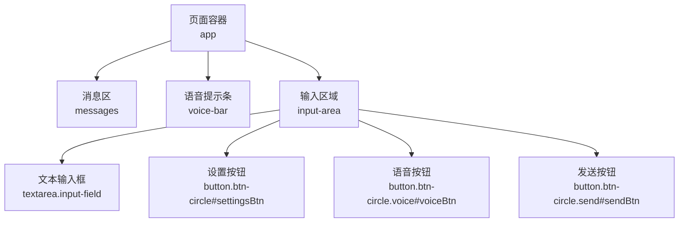
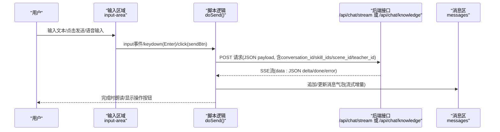
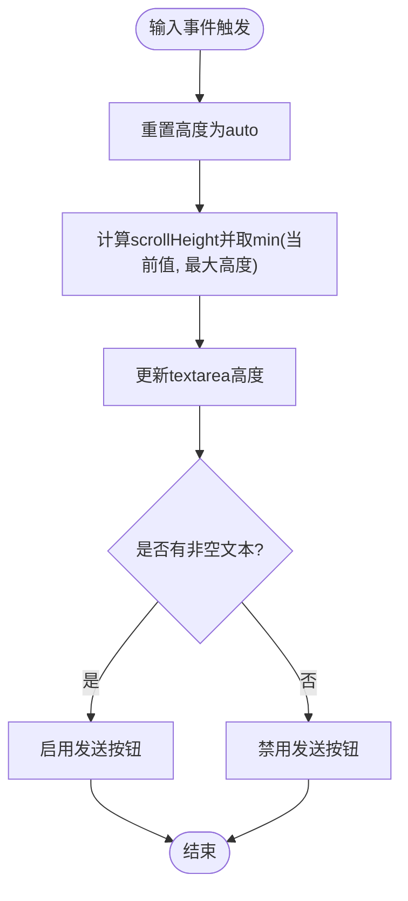
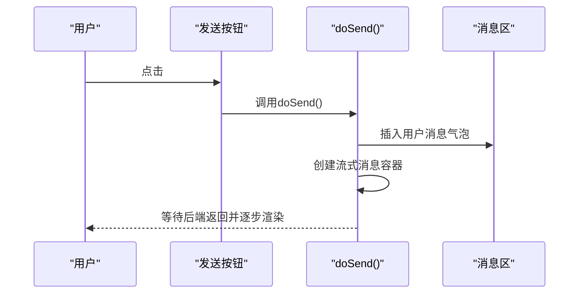
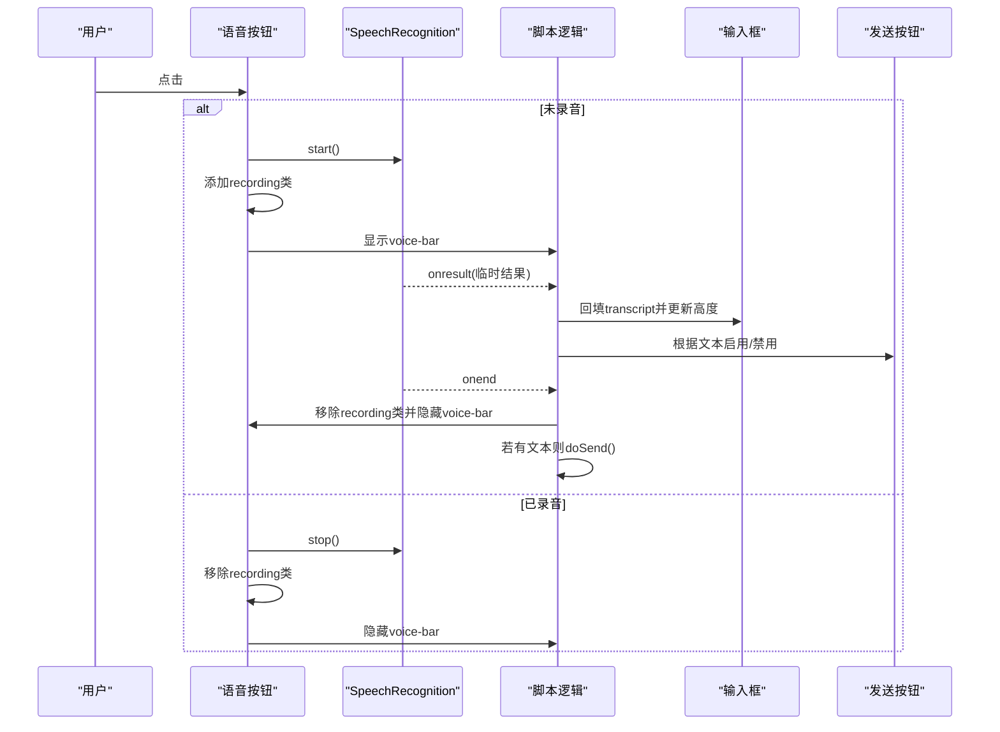
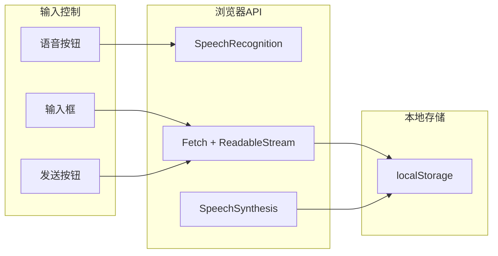

# 输入控制

<cite>
**本文引用的文件**   
- [index.html](file://hushai/meditation/static/index.html)
</cite>

## 目录
1. [简介](#简介)
2. [项目结构](#项目结构)
3. [核心组件](#核心组件)
4. [架构总览](#架构总览)
5. [详细组件分析](#详细组件分析)
6. [依赖分析](#依赖分析)
7. [性能考量](#性能考量)
8. [故障排查指南](#故障排查指南)
9. [结论](#结论)
10. [附录](#附录)

## 简介
本设计文档聚焦 hush.ai 的“输入控制”组件，覆盖文本输入区域、发送按钮、语音输入、自适应高度、快捷键与无障碍访问、移动端适配与触摸交互等关键方面。该组件位于前端单页应用的主界面中，通过内联样式与脚本实现，提供冥想陪伴对话场景下的文字与语音双通道输入体验。

## 项目结构
输入控制相关代码集中在主页面文件中，包含：
- HTML 结构与语义化属性（占位符、aria-label、title）
- CSS 样式（输入框、圆形按钮、焦点态、禁用态、录音动画）
- JavaScript 逻辑（自动高度、键盘事件、语音识别、流式响应渲染）

图示来源
- [index.html:1021-1035](file://hushai/meditation/static/index.html#L1021-L1035)

章节来源
- [index.html:1021-1035](file://hushai/meditation/static/index.html#L1021-L1035)

## 核心组件
- 文本输入区域
  - 元素：textarea.input-field
  - 行为：自动高度调整、占位符提示、焦点高亮、最大高度限制
- 发送按钮
  - 元素：button.btn-circle.send#sendBtn
  - 行为：禁用态、悬停效果、点击触发发送流程
- 语音输入按钮
  - 元素：button.btn-circle.voice#voiceBtn
  - 行为：录音状态切换、录音动画、语音转文字回填、结束自动发送
- 语音设置按钮
  - 元素：button.btn-circle#settingsBtn
  - 行为：打开语音设置抽屉（音色、语速、音调）

章节来源
- [index.html:504-540](file://hushai/meditation/static/index.html#L504-L540)
- [index.html:1021-1035](file://hushai/meditation/static/index.html#L1021-L1035)
- [index.html:1565-1570](file://hushai/meditation/static/index.html#L1565-L1570)
- [index.html:1639-1659](file://hushai/meditation/static/index.html#L1639-L1659)
- [index.html:1795-1797](file://hushai/meditation/static/index.html#L1795-L1797)

## 架构总览
输入控制由“用户交互 → 前端状态更新 → 后端流式响应 → 消息渲染”构成闭环。

图示来源
- [index.html:1795-1891](file://hushai/meditation/static/index.html#L1795-L1891)

章节来源
- [index.html:1795-1891](file://hushai/meditation/static/index.html#L1795-L1891)

## 详细组件分析

### 文本输入区域（textarea.input-field）
- 视觉样式
  - 背景色、边框、圆角、行高、字体家族与字号均通过 CSS 变量统一控制，确保整体风格一致。
  - 焦点态：边框颜色加深、背景变浅，提升可感知性。
- 占位符提示
  - 默认占位符为“说点什么…”，在知识库问答模式下会切换为“向知识库提问…”。
- 自适应高度
  - 监听 input 事件，动态计算 scrollHeight，最小重置为 auto，最大高度限制为固定像素值，避免过高遮挡内容。
- 可用性
  - 具备 aria-label 描述；支持 Enter 提交（Shift+Enter 换行）。

图示来源
- [index.html:1565-1570](file://hushai/meditation/static/index.html#L1565-L1570)

章节来源
- [index.html:514-523](file://hushai/meditation/static/index.html#L514-L523)
- [index.html:1269-1278](file://hushai/meditation/static/index.html#L1269-L1278)
- [index.html:1565-1570](file://hushai/meditation/static/index.html#L1565-L1570)

### 发送按钮（button.btn-circle.send#sendBtn）
- 视觉样式
  - 圆形按钮，默认深色填充与浅色图标，悬停时变为较浅的深色，保持克制的高级感。
- 禁用状态
  - 当无文本或正在发送时禁用，防止重复提交。
- 交互反馈
  - 点击后进入发送流程，清空输入框并恢复初始高度。

图示来源
- [index.html:1795-1805](file://hushai/meditation/static/index.html#L1795-L1805)

章节来源
- [index.html:538-539](file://hushai/meditation/static/index.html#L538-L539)
- [index.html:1795-1805](file://hushai/meditation/static/index.html#L1795-L1805)

### 语音输入（button.btn-circle.voice#voiceBtn）
- 状态切换
  - 未录音：普通圆形麦克风图标。
  - 录音中：添加 recording 类，呈现强调色边框与背景，并带有呼吸动画。
- 录音动画与反馈
  - 顶部 voice-bar 在录音时显示“正在聆听…”提示，配合呼吸动画增强感知。
- 语音转文字
  - 使用浏览器 SpeechRecognition API，开启临时结果以实时回填到输入框，并同步更新发送按钮可用性与输入框高度。
- 自动发送
  - 录音结束时若存在有效文本，自动触发发送流程。

图示来源
- [index.html:1639-1659](file://hushai/meditation/static/index.html#L1639-L1659)
- [index.html:492-499](file://hushai/meditation/static/index.html#L492-L499)

章节来源
- [index.html:534-537](file://hushai/meditation/static/index.html#L534-L537)
- [index.html:492-499](file://hushai/meditation/static/index.html#L492-L499)
- [index.html:1639-1659](file://hushai/meditation/static/index.html#L1639-L1659)

### 语音设置（button.btn-circle#settingsBtn）
- 功能概述
  - 打开底部抽屉，展示音色筛选（全部/女声/男声/English）、音色列表、语速与音调滑块、试听与恢复默认。
- 持久化
  - 选择音色、语速、音调与性别过滤条件均写入 localStorage，下次打开自动恢复。

章节来源
- [index.html:1557-1563](file://hushai/meditation/static/index.html#L1557-L1563)
- [index.html:1540-1555](file://hushai/meditation/static/index.html#L1540-L1555)

### 快捷键与无障碍访问
- 快捷键
  - Enter 提交消息，Shift+Enter 换行（原生 textarea 行为），符合常见输入习惯。
- 无障碍
  - 输入框与按钮均提供 aria-label 与 title，便于屏幕阅读器理解。
  - 全局 :focus-visible 样式强化可见焦点环，提升键盘导航体验。
  - 消息区使用 aria-live="polite" 与 aria-relevant="additions"，辅助技术可播报新增消息。

章节来源
- [index.html:1024-1033](file://hushai/meditation/static/index.html#L1024-L1033)
- [index.html:736-739](file://hushai/meditation/static/index.html#L736-L739)
- [index.html:1011](file://hushai/meditation/static/index.html#L1011)

### 移动端适配与触摸交互优化
- 安全区域
  - 输入区域底部 padding 使用 env(safe-area-inset-bottom, 0px)，适配刘海屏与底部横条设备。
- 触控友好
  - 圆形按钮尺寸 44x44，满足手指触控目标大小建议。
  - 输入框最小高度 46px，便于触屏输入。
- 视口与缩放
  - viewport 禁止用户缩放，保证布局稳定。

章节来源
- [index.html:504-508](file://hushai/meditation/static/index.html#L504-L508)
- [index.html:525-533](file://hushai/meditation/static/index.html#L525-L533)
- [index.html:514-521](file://hushai/meditation/static/index.html#L514-L521)
- [index.html:5](file://hushai/meditation/static/index.html#L5)

## 依赖分析
- 外部依赖
  - Web Speech API（SpeechRecognition/SpeechSynthesis）用于语音输入与输出。
  - Fetch API 与 ReadableStream 用于 SSE 流式响应处理。
- 内部依赖
  - 登录态与刷新令牌（localStorage）影响发送流程与鉴权重试。
  - 会话 ID、技能与场景选择作为 payload 的一部分参与请求。

图示来源
- [index.html:1639-1659](file://hushai/meditation/static/index.html#L1639-L1659)
- [index.html:1661-1692](file://hushai/meditation/static/index.html#L1661-L1692)
- [index.html:1795-1891](file://hushai/meditation/static/index.html#L1795-L1891)

章节来源
- [index.html:1639-1659](file://hushai/meditation/static/index.html#L1639-L1659)
- [index.html:1661-1692](file://hushai/meditation/static/index.html#L1661-L1692)
- [index.html:1795-1891](file://hushai/meditation/static/index.html#L1795-L1891)

## 性能考量
- 流式渲染
  - 采用分块解码与逐行解析，减少首字延迟，提升即时反馈。
- DOM 操作
  - 仅追加/更新必要节点，避免整段重绘；滚动位置按需维护。
- 动画与过渡
  - 使用 CSS 变量与缓动函数，降低重排开销；对低性能设备可通过 prefers-reduced-motion 关闭动画。

章节来源
- [index.html:1843-1883](file://hushai/meditation/static/index.html#L1843-L1883)
- [index.html:741-746](file://hushai/meditation/static/index.html#L741-L746)

## 故障排查指南
- 无法连接服务
  - 现象：登录失败或发送失败提示网络错误。
  - 排查：检查网络连通性与后端服务状态。
- 登录过期
  - 现象：收到 401 后尝试刷新令牌，失败则回到登录页。
  - 排查：确认 refresh_token 是否有效，必要时重新登录。
- 语音不可用
  - 现象：语音按钮无效或无录音反馈。
  - 排查：确认浏览器是否支持 SpeechRecognition，授予麦克风权限。
- 流式响应异常
  - 现象：消息未更新或出现乱码。
  - 排查：检查后端 SSE 格式是否为 data: JSON 行，确认 TextDecoder 与分块解析逻辑。

章节来源
- [index.html:1605-1609](file://hushai/meditation/static/index.html#L1605-L1609)
- [index.html:1611-1637](file://hushai/meditation/static/index.html#L1611-L1637)
- [index.html:1639-1659](file://hushai/meditation/static/index.html#L1639-L1659)
- [index.html:1843-1883](file://hushai/meditation/static/index.html#L1843-L1883)

## 结论
输入控制组件通过简洁克制的视觉语言与稳健的前端逻辑，实现了文字与语音双通道的流畅输入体验。自适应高度、快捷键与无障碍特性提升了易用性，移动端适配与触摸优化确保了跨设备一致性。流式响应与本地缓存策略兼顾了性能与用户体验。

## 附录
- 设计规范要点
  - 色彩与字体：使用 CSS 变量统一管理，确保主题一致性。
  - 间距与尺寸：按钮与输入框遵循触控友好尺寸，留白克制而清晰。
  - 动效与反馈：呼吸动画与渐显过渡传达状态变化，不喧宾夺主。
- 最佳实践
  - 始终提供明确的占位符与标题/标签，增强可理解性。
  - 对异步操作提供清晰的加载与错误提示，避免用户困惑。
  - 在移动端优先保障触控目标大小与安全区域适配。