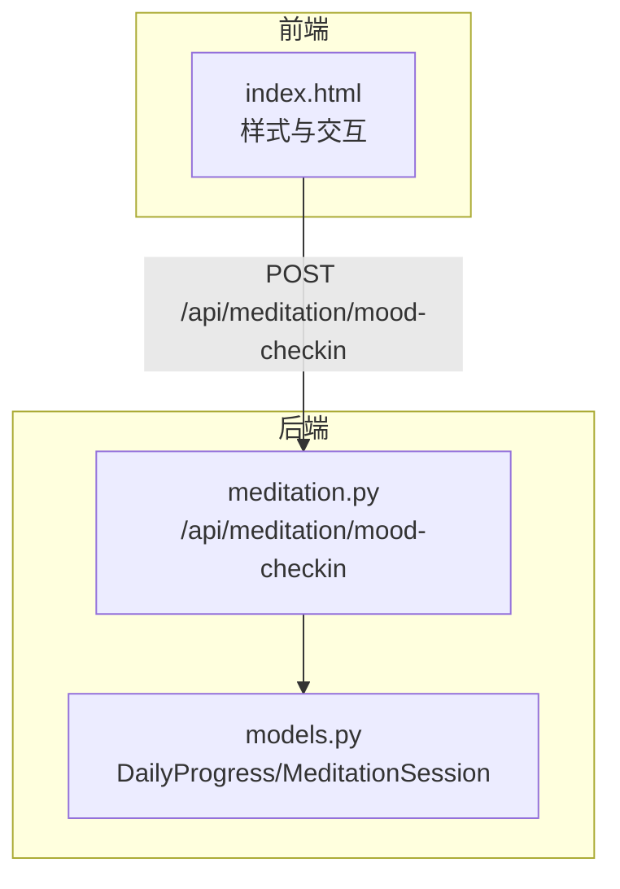
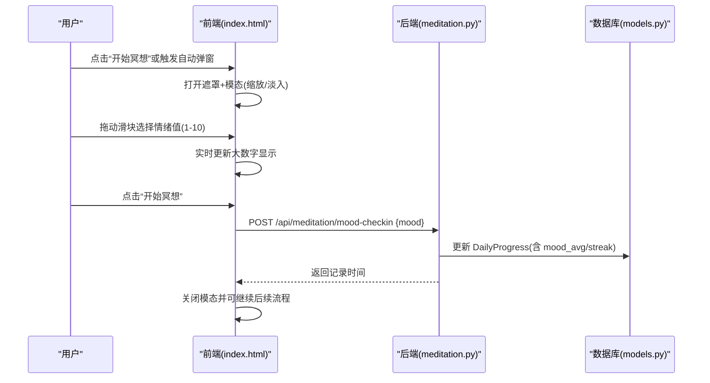
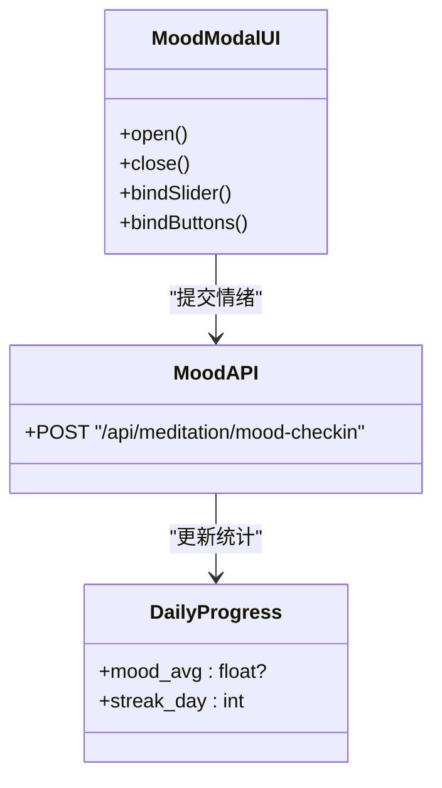

# 情绪记录模态框

<cite>
**本文引用的文件**   
- [hushai/meditation/static/index.html](file://hushai/meditation/static/index.html)
- [hushai/meditation/api/meditation.py](file://hushai/meditation/api/meditation.py)
- [hushai/meditation/db/models.py](file://hushai/meditation/db/models.py)
</cite>

## 目录
1. [引言](#引言)
2. [项目结构](#项目结构)
3. [核心组件](#核心组件)
4. [架构总览](#架构总览)
5. [详细组件分析](#详细组件分析)
6. [依赖关系分析](#依赖关系分析)
7. [性能与可访问性考量](#性能与可访问性考量)
8. [故障排查指南](#故障排查指南)
9. [结论](#结论)

## 引言
本设计文档聚焦于 hush.ai 的情绪记录模态框，目标是提供一份面向 UI/UX 的完整规范与实现说明。内容覆盖：
- 弹出动画效果（缩放过渡、遮罩层淡入淡出）
- 情绪滑块设计（轨道样式、拖拽手柄大小与位置反馈）
- 情绪数值可视化（大字体数字显示、颜色渐变方案建议）
- 情绪标签规范（两端文案与中间刻度标记）
- 确认/取消按钮交互（主按钮强调、次按钮弱化）
- 数据提交流程（加载状态与成功反馈机制）

## 项目结构
情绪记录模态框位于前端单页应用内，相关样式与交互逻辑集中在同一 HTML 文件中；后端通过 FastAPI 暴露情绪打卡接口，并更新每日进度统计。

图表来源
- [hushai/meditation/static/index.html:761-800](file://hushai/meditation/static/index.html#L761-L800)
- [hushai/meditation/api/meditation.py:177-186](file://hushai/meditation/api/meditation.py#L177-L186)
- [hushai/meditation/db/models.py:224-244](file://hushai/meditation/db/models.py#L224-L244)

章节来源
- [hushai/meditation/static/index.html:761-800](file://hushai/meditation/static/index.html#L761-L800)
- [hushai/meditation/api/meditation.py:177-186](file://hushai/meditation/api/meditation.py#L177-L186)
- [hushai/meditation/db/models.py:224-244](file://hushai/meditation/db/models.py#L224-L244)

## 核心组件
- 模态容器与遮罩层
  - 遮罩层：固定定位全屏，默认透明不可点击，打开时淡入并允许点击关闭。
  - 模态主体：居中定位，初始 scale(.95)，打开时平滑过渡到 scale(1)。
- 情绪滑块
  - 范围 1-10，轨道高度 4px，圆角 2px，背景为中性石色。
  - 拖拽手柄 28x28 圆形，带外边框与阴影，提升触控面积与视觉层次。
- 数值展示
  - 大字号等宽数字，随滑块 input 事件即时更新。
- 标签系统
  - 三处文本标签：左“低落”、中“平静”、右“愉悦”，用于语义引导。
- 操作按钮
  - 主按钮“开始冥想”：深色填充，强调确认动作。
  - 次按钮“跳过”：描边样式，弱化退出路径。
- 交互与数据流
  - 打开/关闭由类名控制；滑块 input 实时同步数值；确认按钮触发 API 提交；支持点击遮罩关闭。

章节来源
- [hushai/meditation/static/index.html:761-800](file://hushai/meditation/static/index.html#L761-L800)
- [hushai/meditation/static/index.html:1091-1108](file://hushai/meditation/static/index.html#L1091-L1108)
- [hushai/meditation/static/index.html:1893-1926](file://hushai/meditation/static/index.html#L1893-L1926)

## 架构总览
情绪记录模态框的前端与后端交互如下：

图表来源
- [hushai/meditation/static/index.html:1893-1926](file://hushai/meditation/static/index.html#L1893-L1926)
- [hushai/meditation/api/meditation.py:177-186](file://hushai/meditation/api/meditation.py#L177-L186)
- [hushai/meditation/db/models.py:224-244](file://hushai/meditation/db/models.py#L224-L244)

## 详细组件分析

### 弹出动画与遮罩层
- 遮罩层
  - 使用 fixed 定位覆盖全屏，z-index 高于页面内容。
  - 默认 opacity: 0 且 pointer-events: none；添加 open 类后 opacity: 1 并启用点击。
- 模态主体
  - 使用 transform: translate(-50%,-50%) scale(.95) 居中小尺寸；open 状态下 scale(1)。
  - 过渡曲线采用 ease-out-expo，营造“轻快收尾”的呼吸感。
- 关闭方式
  - 点击遮罩层空白区域关闭；也可通过“跳过”按钮关闭。

章节来源
- [hushai/meditation/static/index.html:761-775](file://hushai/meditation/static/index.html#L761-L775)
- [hushai/meditation/static/index.html:1898-1906](file://hushai/meditation/static/index.html#L1898-L1906)
- [hushai/meditation/static/index.html:1924-1926](file://hushai/meditation/static/index.html#L1924-L1926)

### 情绪滑块设计规范
- 轨道
  - 宽度占容器 80%，高度 4px，圆角 2px，背景为浅灰石色，确保低对比度不抢焦点。
- 拖拽手柄
  - 28x28 圆形，深色填充，白色描边，带轻微阴影，触控友好。
- 位置反馈
  - 使用原生 range 控件的 input 事件，实时将当前值写入大数字区域，形成即时反馈。
- 无障碍
  - 原生 range 具备键盘可达性与屏幕阅读器支持；如需增强，可增加 aria-valuenow 与 aria-label。

章节来源
- [hushai/meditation/static/index.html:781-791](file://hushai/meditation/static/index.html#L781-L791)
- [hushai/meditation/static/index.html:1907-1912](file://hushai/meditation/static/index.html#L1907-L1912)

### 情绪数值可视化与颜色渐变建议
- 现状
  - 使用等宽大字号数字显示当前值，颜色为墨色，清晰易读。
- 建议的颜色渐变映射（1-10）
  - 1-3：偏冷/低饱和（如蓝灰），表达“低落”
  - 4-6：中性/温和（如暖灰/米色），表达“平静”
  - 7-10：偏暖/高饱和（如琥珀/橙红），表达“愉悦”
- 实现思路
  - 在 input 事件中根据 currentMood 计算插值颜色，动态设置 .mood-value 的 color。
  - 保持足够对比度，避免影响可读性。

[本节为概念性建议，无需代码来源]

### 情绪标签规范
- 两端与中间文案
  - 左：“低落”
  - 中：“平静”
  - 右：“愉悦”
- 排版
  - 与滑块同宽（80%），两端对齐，字号较小，颜色较浅，不干扰主操作。
- 扩展建议
  - 可在移动端增加更多刻度提示（如 1/3/5/7/10），但需保证简洁。

章节来源
- [hushai/meditation/static/index.html:791-791](file://hushai/meditation/static/index.html#L791-L791)
- [hushai/meditation/static/index.html:1099-1101](file://hushai/meditation/static/index.html#L1099-L1101)

### 确认/取消按钮交互
- 主按钮“开始冥想”
  - 深色填充、白字，hover 加深背景，强调确认行为。
- 次按钮“跳过”
  - 描边样式、浅色文字，hover 加深边框，弱化退出路径。
- 交互细节
  - 点击“开始冥想”：关闭模态并调用 doMoodCheckin(currentMood)。
  - 点击“跳过”：仅关闭模态，不提交数据。
  - 点击遮罩空白区域：关闭模态。

章节来源
- [hushai/meditation/static/index.html:796-800](file://hushai/meditation/static/index.html#L796-L800)
- [hushai/meditation/static/index.html:1913-1926](file://hushai/meditation/static/index.html#L1913-L1926)

### 数据提交、加载状态与成功反馈
- 提交流程
  - 前端构造 JSON {mood}，携带 Authorization: Bearer token，POST 至 /api/meditation/mood-checkin。
  - 后端校验并更新 DailyProgress（包含 mood_avg 与 streak_day）。
- 加载状态
  - 建议在确认按钮上增加 loading 态（禁用按钮、显示 spinner），防止重复提交。
- 成功反馈
  - 成功后可短暂显示“已记录”微提示（toast），随后关闭模态。
- 错误处理
  - 若 401，应清理认证信息并跳转登录；网络异常给出友好提示。

章节来源
- [hushai/meditation/static/index.html:1928-1935](file://hushai/meditation/static/index.html#L1928-L1935)
- [hushai/meditation/api/meditation.py:177-186](file://hushai/meditation/api/meditation.py#L177-L186)
- [hushai/meditation/db/models.py:224-244](file://hushai/meditation/db/models.py#L224-L244)

### 自动弹出时机
- 首次登录后当天未记录情绪时，延迟约 3 秒自动弹出，减少打断感。
- 通过 localStorage 键记录当日是否已弹出，避免重复打扰。

章节来源
- [hushai/meditation/static/index.html:2096-2107](file://hushai/meditation/static/index.html#L2096-L2107)

## 依赖关系分析
- 前端依赖
  - DOM 元素：遮罩、模态、滑块、数值、按钮等。
  - 事件：input、click、DOMContentLoaded（初始化）。
- 后端依赖
  - FastAPI 路由与 Pydantic 模型校验。
  - 数据库会话与 ORM 模型（DailyProgress、MeditationSession）。
- 耦合点
  - 字段约束：mood 取值 1-10，前后端一致。
  - 认证：Authorization 头传递 token，后端校验失败返回 401。

图表来源
- [hushai/meditation/static/index.html:1893-1926](file://hushai/meditation/static/index.html#L1893-L1926)
- [hushai/meditation/api/meditation.py:177-186](file://hushai/meditation/api/meditation.py#L177-L186)
- [hushai/meditation/db/models.py:224-244](file://hushai/meditation/db/models.py#L224-L244)

章节来源
- [hushai/meditation/static/index.html:1893-1926](file://hushai/meditation/static/index.html#L1893-L1926)
- [hushai/meditation/api/meditation.py:177-186](file://hushai/meditation/api/meditation.py#L177-L186)
- [hushai/meditation/db/models.py:224-244](file://hushai/meditation/db/models.py#L224-L244)

## 性能与可访问性考量
- 性能
  - 动画使用 CSS transform/opacity，GPU 加速，避免重排。
  - 滑块 input 事件仅更新文本节点，开销极低。
- 可访问性
  - 原生 range 具备键盘导航与屏幕阅读器支持。
  - 建议补充 aria-label 与 aria-valuenow，提高辅助技术体验。
- 动效偏好
  - 遵循 prefers-reduced-motion，对不支持或偏好减少动效的用户降级为无动画。

章节来源
- [hushai/meditation/static/index.html:741-746](file://hushai/meditation/static/index.html#L741-L746)

## 故障排查指南
- 无法弹出
  - 检查遮罩与模态的 open 类是否正确切换。
  - 确认首次登录后的延时逻辑与 localStorage 键是否生效。
- 滑块无响应
  - 确认 input 事件绑定是否执行，currentMood 是否更新。
- 提交失败
  - 检查 Authorization 头是否携带有效 token。
  - 后端 401 时应清理本地认证并重定向登录。
- 数值不同步
  - 确认滑块 value 与文本显示是否在同一事件循环内更新。

章节来源
- [hushai/meditation/static/index.html:1893-1926](file://hushai/meditation/static/index.html#L1893-L1926)
- [hushai/meditation/static/index.html:2096-2107](file://hushai/meditation/static/index.html#L2096-L2107)
- [hushai/meditation/api/meditation.py:177-186](file://hushai/meditation/api/meditation.py#L177-L186)

## 结论
情绪记录模态框以极简、克制的视觉语言承载关键交互：遮罩淡入与缩放过渡带来柔和的进入体验；滑块与数值联动提供即时反馈；主次按钮明确区分确认与退出路径；后端接口与每日统计紧密衔接，保障数据的连续性与可用性。建议在现有基础上补充加载态与成功反馈，以及颜色渐变的数值可视化，进一步提升情感化与可感知性。