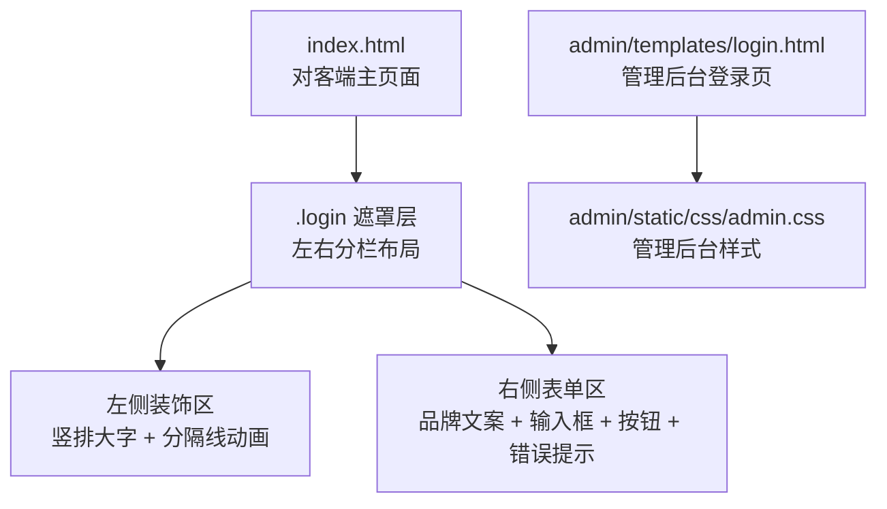
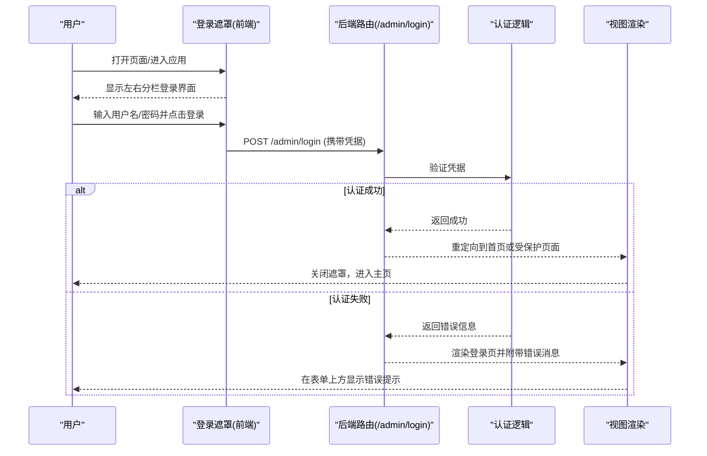
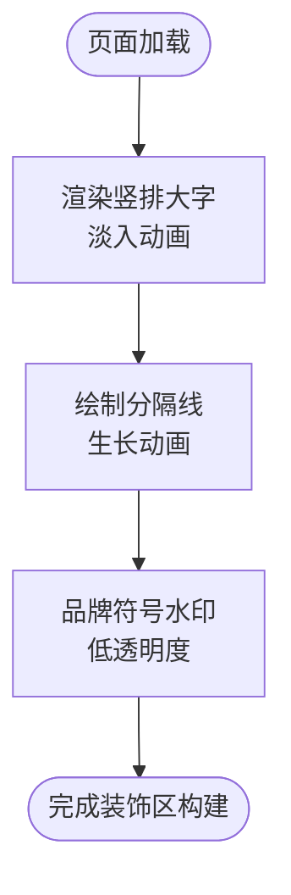
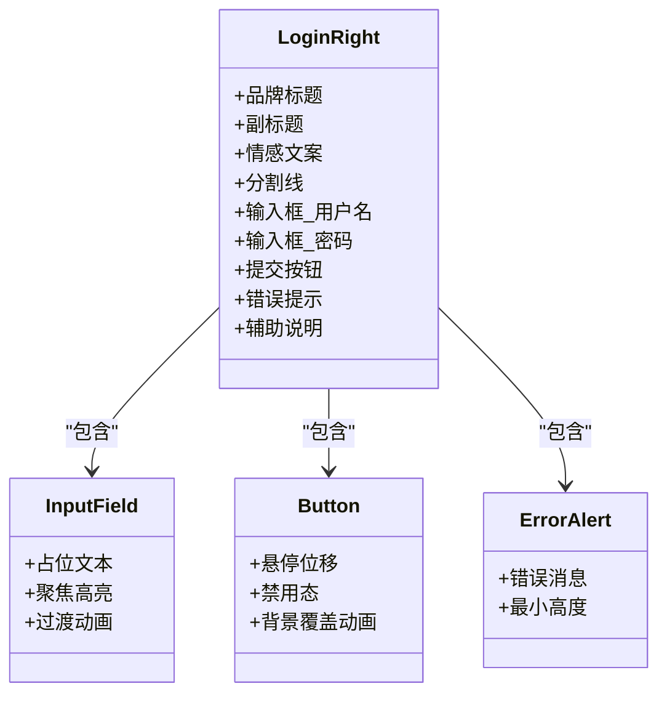
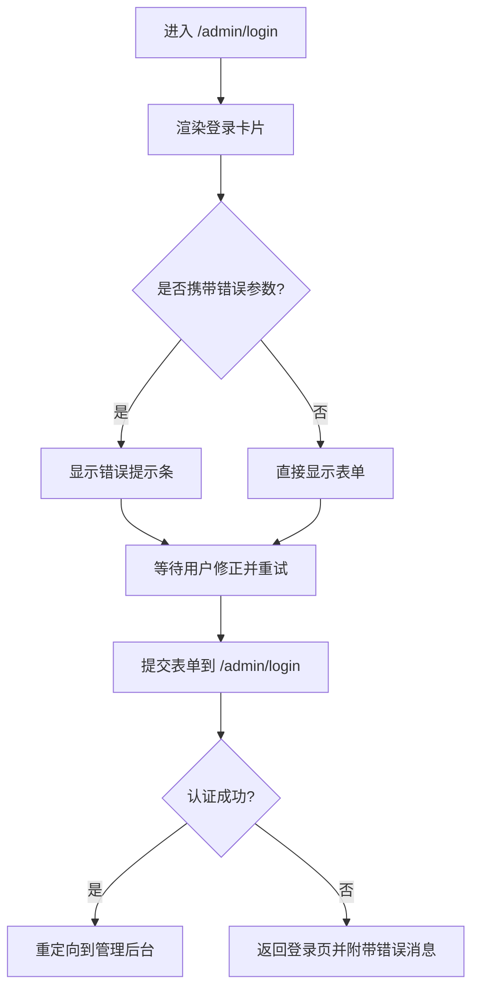
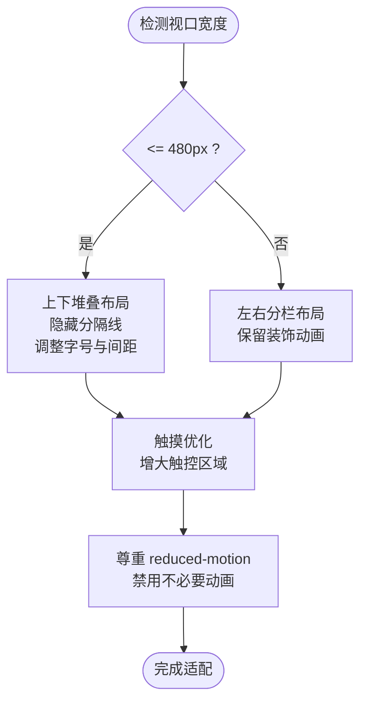
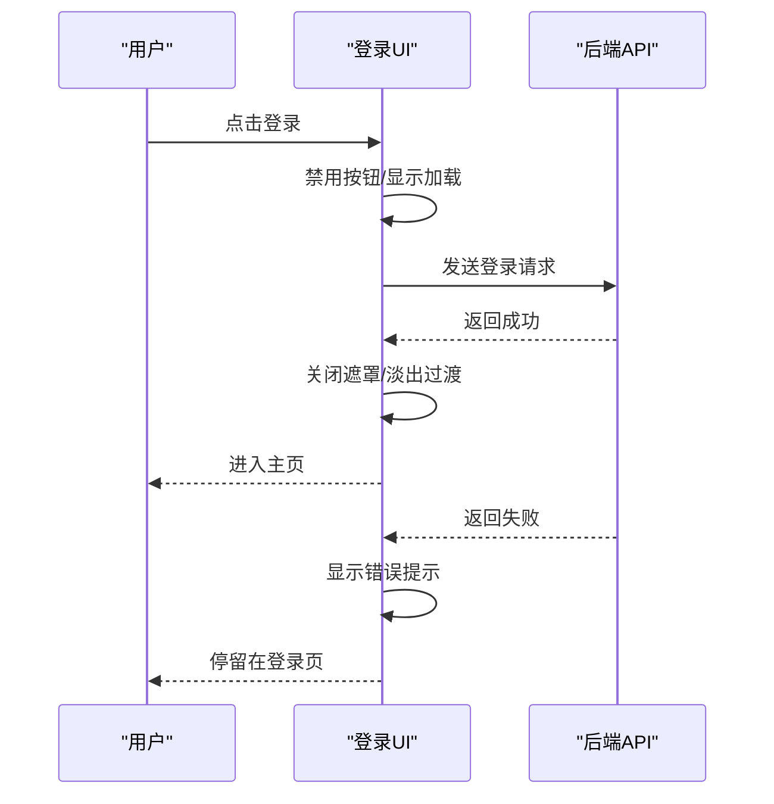
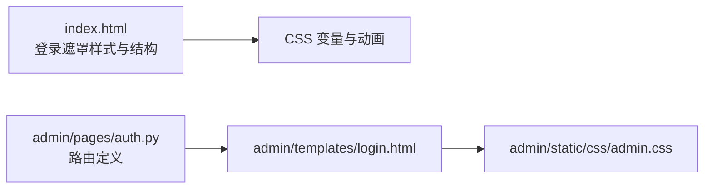

# 登录界面设计

<cite>
**本文引用的文件**   
- [hushai/meditation/static/index.html](file://hushai/meditation/static/index.html)
- [hushai/meditation/admin/templates/login.html](file://hushai/meditation/admin/templates/login.html)
- [hushai/meditation/admin/static/css/admin.css](file://hushai/meditation/admin/static/css/admin.css)
- [hushai/meditation/admin/pages/auth.py](file://hushai/meditation/admin/pages/auth.py)
</cite>

## 目录
1. [引言](#引言)
2. [项目结构](#项目结构)
3. [核心组件](#核心组件)
4. [架构总览](#架构总览)
5. [详细组件分析](#详细组件分析)
6. [依赖关系分析](#依赖关系分析)
7. [性能与可访问性](#性能与可访问性)
8. [故障排查指南](#故障排查指南)
9. [结论](#结论)
10. [附录：设计规范清单](#附录设计规范清单)

## 引言
本设计文档围绕 hush.ai 的登录界面，系统阐述“禅意美学”的设计理念与落地实现。重点覆盖：
- 左右分栏布局与品牌展示区的情感化文案
- 渐进式加载动画（淡入、上移、线条生长）
- 左侧装饰区域的视觉元素（竖排书法字体、分隔线条动画、品牌符号）
- 右侧登录表单的设计规范（输入框样式、按钮交互、错误提示）
- 响应式设计与移动端适配（含触摸优化）
- 登录流程的用户体验（加载状态反馈、成功跳转动画）

## 项目结构
登录界面由两部分组成：
- 对客端主入口页面中的登录遮罩层（禅意风格），位于前端静态资源中
- 管理后台登录页（功能型登录），位于后端模板与样式中

图示来源
- [hushai/meditation/static/index.html:108-231](file://hushai/meditation/static/index.html#L108-L231)
- [hushai/meditation/admin/templates/login.html:1-65](file://hushai/meditation/admin/templates/login.html#L1-L65)
- [hushai/meditation/admin/static/css/admin.css:232-365](file://hushai/meditation/admin/static/css/admin.css#L232-L365)

章节来源
- [hushai/meditation/static/index.html:108-231](file://hushai/meditation/static/index.html#L108-L231)
- [hushai/meditation/admin/templates/login.html:1-65](file://hushai/meditation/admin/templates/login.html#L1-L65)
- [hushai/meditation/admin/static/css/admin.css:232-365](file://hushai/meditation/admin/static/css/admin.css#L232-L365)

## 核心组件
- 登录遮罩容器：全屏定位、居中内容、背景色采用暖纸色调
- 左侧装饰区域：竖排书法字、细线分隔、低透明度品牌符号
- 右侧表单区域：品牌标题、副标题、情感化文案、分割线、输入框、提交按钮、错误提示、辅助说明
- 动画系统：fadeUp、fadeIn、lineGrow 等关键帧，配合缓动曲线营造“呼吸感”
- 响应式断点：小屏切换为上下堆叠布局，隐藏部分装饰元素以聚焦表单

章节来源
- [hushai/meditation/static/index.html:108-231](file://hushai/meditation/static/index.html#L108-L231)

## 架构总览
从用户视角看，登录流程包含以下阶段：
- 进入应用 → 显示登录遮罩
- 填写用户名/密码 → 点击登录
- 前端校验与禁用态 → 发起请求
- 服务端鉴权 → 返回结果
- 成功：关闭遮罩并进入主页；失败：显示错误提示

图示来源
- [hushai/meditation/admin/pages/auth.py:19-20](file://hushai/meditation/admin/pages/auth.py#L19-L20)
- [hushai/meditation/admin/templates/login.html:21-56](file://hushai/meditation/admin/templates/login.html#L21-L56)

## 详细组件分析

### 左侧装饰区域（禅意美学）
- 竖排书法字体：使用 display 字体族与大字号，writing-mode 设置为竖排，低透明度营造“留白”意境
- 分隔线条动画：一条垂直细线，通过 scale 变换实现从上至下的生长效果，增强节奏感
- 品牌符号：大字号字符作为背景水印，降低干扰，提升品牌识别度

图示来源
- [hushai/meditation/static/index.html:118-141](file://hushai/meditation/static/index.html#L118-L141)

章节来源
- [hushai/meditation/static/index.html:118-141](file://hushai/meditation/static/index.html#L118-L141)

### 右侧登录表单（设计规范）
- 品牌文案：主标题使用 display 字体，副标题与说明使用等宽字体，层次清晰
- 情感化文案：诗句式短句，行距宽松，颜色偏灰，营造安静氛围
- 输入框：仅底部边框，聚焦时加深边框色，占位符浅灰，字号适中
- 按钮：全宽、深色背景、悬停位移与阴影过渡，禁用态降低透明度
- 错误提示：独立区块，红色系文字，最小高度保证可读性
- 辅助说明：等宽小字，提供首次登录指引与回退链接

图示来源
- [hushai/meditation/static/index.html:143-223](file://hushai/meditation/static/index.html#L143-L223)

章节来源
- [hushai/meditation/static/index.html:143-223](file://hushai/meditation/static/index.html#L143-L223)

### 管理后台登录页（功能型）
- 布局：居中卡片式登录框，背景采用深色渐变与光晕
- 头部：图标、平台名称、副标题
- 表单：带图标的标签、圆角输入框、焦点高亮
- 按钮：渐变色背景、阴影、悬停亮度变化
- 错误提示：顶部警告条，红底白字
- 底部：首次登录提示与回退链接

图示来源
- [hushai/meditation/admin/templates/login.html:1-65](file://hushai/meditation/admin/templates/login.html#L1-L65)
- [hushai/meditation/admin/static/css/admin.css:232-365](file://hushai/meditation/admin/static/css/admin.css#L232-L365)
- [hushai/meditation/admin/pages/auth.py:19-20](file://hushai/meditation/admin/pages/auth.py#L19-L20)

章节来源
- [hushai/meditation/admin/templates/login.html:1-65](file://hushai/meditation/admin/templates/login.html#L1-L65)
- [hushai/meditation/admin/static/css/admin.css:232-365](file://hushai/meditation/admin/static/css/admin.css#L232-L365)
- [hushai/meditation/admin/pages/auth.py:19-20](file://hushai/meditation/admin/pages/auth.py#L19-L20)

### 响应式设计与移动端适配
- 断点策略：在小屏下将左右分栏改为上下堆叠，左侧高度固定比例，隐藏分隔线
- 字体与间距：使用 clamp 函数自适应字号与内边距，确保可读性与触控友好
- 触摸优化：增大点击区域、避免复杂 hover 效果，优先使用 active 与 focus-visible
- 无障碍：减少动画偏好设置下禁用非必要动画，保证可访问性

图示来源
- [hushai/meditation/static/index.html:225-231](file://hushai/meditation/static/index.html#L225-L231)
- [hushai/meditation/static/index.html:143-223](file://hushai/meditation/static/index.html#L143-L223)

章节来源
- [hushai/meditation/static/index.html:225-231](file://hushai/meditation/static/index.html#L225-L231)
- [hushai/meditation/static/index.html:143-223](file://hushai/meditation/static/index.html#L143-L223)

### 登录流程用户体验（加载与跳转）
- 加载状态：提交后按钮禁用态，防止重复提交；如需异步，可增加全局 loading 遮罩
- 成功跳转：成功后关闭遮罩并进入主页，建议添加淡出过渡以提升连贯性
- 失败反馈：错误消息置顶显示，保持上下文不丢失，便于快速修正

图示来源
- [hushai/meditation/static/index.html:197-214](file://hushai/meditation/static/index.html#L197-L214)
- [hushai/meditation/admin/templates/login.html:14-19](file://hushai/meditation/admin/templates/login.html#L14-L19)

## 依赖关系分析
- 前端样式与结构：index.html 定义登录遮罩结构与样式，控制动画与响应式
- 后端模板与样式：admin 登录页由模板与 CSS 共同构成，负责功能型登录
- 路由与鉴权：后端路由处理登录请求，未登录场景统一重定向

图示来源
- [hushai/meditation/static/index.html:108-231](file://hushai/meditation/static/index.html#L108-L231)
- [hushai/meditation/admin/templates/login.html:1-65](file://hushai/meditation/admin/templates/login.html#L1-L65)
- [hushai/meditation/admin/static/css/admin.css:232-365](file://hushai/meditation/admin/static/css/admin.css#L232-L365)
- [hushai/meditation/admin/pages/auth.py:19-20](file://hushai/meditation/admin/pages/auth.py#L19-L20)

章节来源
- [hushai/meditation/static/index.html:108-231](file://hushai/meditation/static/index.html#L108-L231)
- [hushai/meditation/admin/templates/login.html:1-65](file://hushai/meditation/admin/templates/login.html#L1-L65)
- [hushai/meditation/admin/static/css/admin.css:232-365](file://hushai/meditation/admin/static/css/admin.css#L232-L365)
- [hushai/meditation/admin/pages/auth.py:19-20](file://hushai/meditation/admin/pages/auth.py#L19-L20)

## 性能与可访问性
- 动画性能：使用 transform 与 opacity 驱动动画，避免重排；合理设置延迟与时长，避免首屏阻塞
- 字体加载：预连接 Google Fonts，减少 FOIT/FOUT 风险
- 可访问性：focus-visible 可见轮廓，prefers-reduced-motion 下禁用动画，语义化标签与占位符清晰
- 触控体验：增大按钮与输入区域，避免复杂 hover 交互，优先使用 active 与键盘可达

章节来源
- [hushai/meditation/static/index.html:10-12](file://hushai/meditation/static/index.html#L10-L12)
- [hushai/meditation/static/index.html:225-231](file://hushai/meditation/static/index.html#L225-L231)

## 故障排查指南
- 错误提示未显示：检查模板中错误条件渲染与后端返回的错误字段是否一致
- 按钮无响应：确认提交事件绑定与禁用态逻辑，避免重复提交
- 样式错乱：核对 CSS 类名与选择器优先级，检查媒体查询断点
- 动画异常：在支持 reduced-motion 的设备上验证动画是否被正确禁用

章节来源
- [hushai/meditation/admin/templates/login.html:14-19](file://hushai/meditation/admin/templates/login.html#L14-L19)
- [hushai/meditation/static/index.html:197-214](file://hushai/meditation/static/index.html#L197-L214)

## 结论
本登录界面以“禅意美学”为核心，通过左右分栏、竖排书法、低饱和色彩与细腻动画，营造出安静、专注的登录体验。右侧表单遵循简洁、清晰、可访问的原则，确保功能可用性与情绪一致性。响应式策略保障多端体验，错误与加载反馈完善，整体达到“形神合一”的产品气质。

## 附录：设计规范清单
- 色彩体系：墨色、暖纸色、石色系，强调对比与层次
- 字体层级：display 用于标题，body 用于正文，mono 用于标注与元信息
- 字号与行距：标题大号、正文适中、注释小号；行距宽松，提升阅读舒适度
- 间距系统：基于 8px 网格，模块间留白充足
- 动画规范：淡入、上移、线条生长；缓动曲线柔和，时长 0.6–1.8s
- 交互规范：hover 位移与阴影，active 缩放，focus 高亮，disabled 降透明
- 错误提示：置顶显示，红色系，最小高度保证可读性
- 响应式：≤480px 切换堆叠布局，隐藏装饰线，增大触控区域
- 无障碍：focus-visible 可见，尊重 reduced-motion，语义化标签