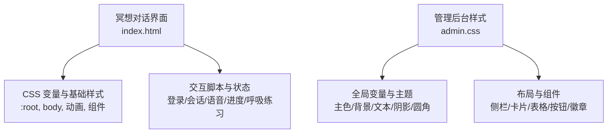
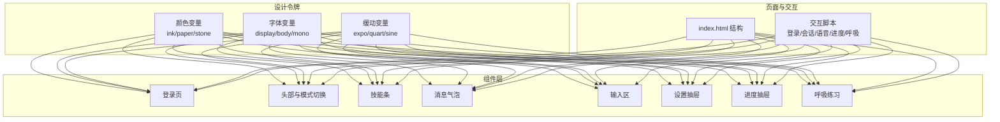
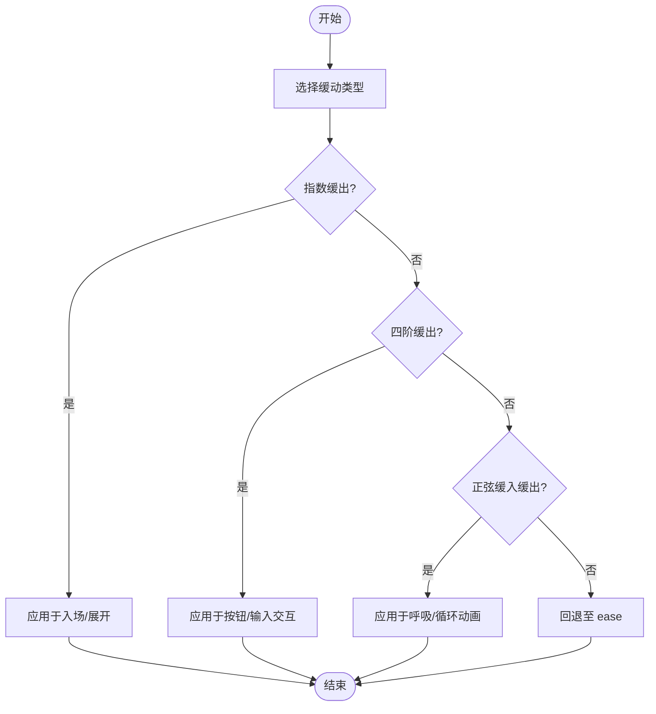
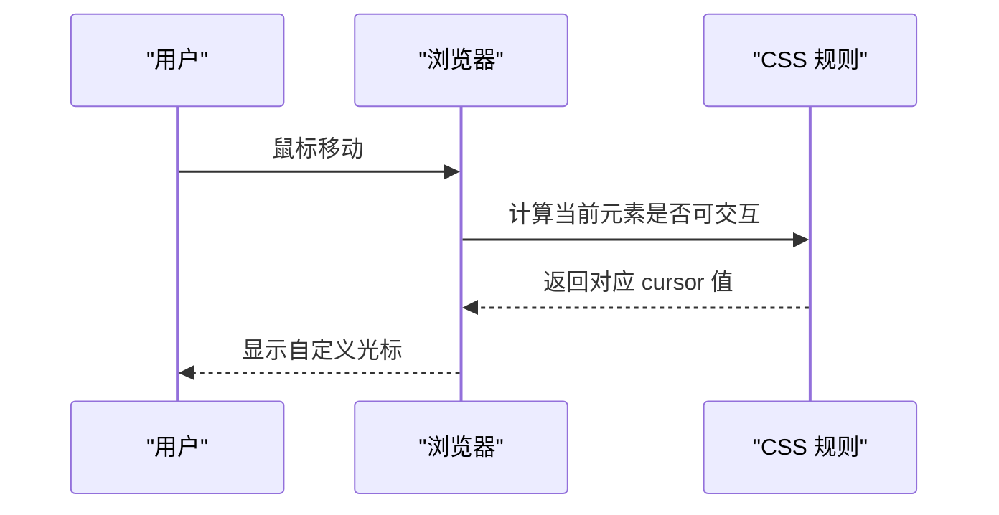
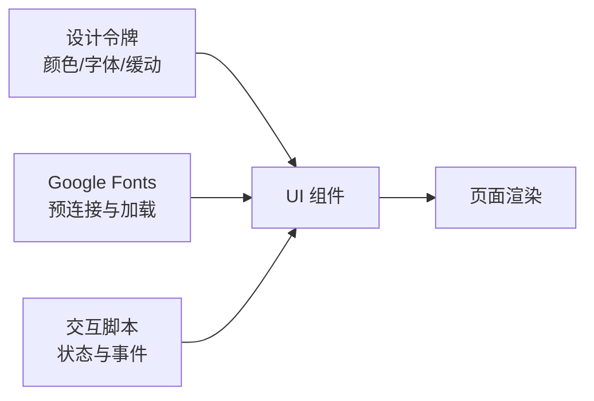

# 视觉设计系统

<cite>
**本文引用的文件**   
- [hushai/meditation/static/index.html](file://hushai/meditation/static/index.html)
- [hushai/meditation/admin/static/css/admin.css](file://hushai/meditation/admin/static/css/admin.css)
</cite>

## 目录
1. [引言](#引言)
2. [项目结构](#项目结构)
3. [核心组件](#核心组件)
4. [架构总览](#架构总览)
5. [详细组件分析](#详细组件分析)
6. [依赖关系分析](#依赖关系分析)
7. [性能考量](#性能考量)
8. [故障排查指南](#故障排查指南)
9. [结论](#结论)
10. [附录](#附录)

## 引言
本文件为 hush.ai 的视觉设计系统文档，聚焦于以下方面：
- 色彩系统：墨色（ink）与纸张（paper）主色调、石色系辅助色、语义色使用规范
- 字体排版的层级结构：展示字体 Cormorant Garamond、正文字体 Noto Serif SC、等宽字体 JetBrains Mono 的使用场景
- 间距系统与网格布局：内边距、外边距与组件间距的统一标准
- 动画与过渡：指数缓出、四阶缓出、正弦缓入缓出的定义与应用
- 自定义光标：设计理念与实现方式
- 纹理背景：实现技术与视觉效果优化

## 项目结构
本项目包含两套前端样式体系：
- 冥想对话界面（面向用户）：以“纸本档案”风格为主，强调极简、留白与优雅排版
- 管理后台界面（面向运营）：以“纸本档案 Studio archive”风格为主，强调信息密度与操作效率

图表来源
- [hushai/meditation/static/index.html:22-63](file://hushai/meditation/static/index.html#L22-L63)
- [hushai/meditation/admin/static/css/admin.css:1-51](file://hushai/meditation/admin/static/css/admin.css#L1-L51)

章节来源
- [hushai/meditation/static/index.html:22-63](file://hushai/meditation/static/index.html#L22-L63)
- [hushai/meditation/admin/static/css/admin.css:1-51](file://hushai/meditation/admin/static/css/admin.css#L1-L51)

## 核心组件
本节从设计系统的角度梳理关键要素：色彩、字体、间距、动画、光标与纹理。

### 色彩系统
- 墨色（ink）与纸张（paper）主体系
  - 墨色用于正文、标题与强调元素，提供高对比度与沉稳气质
  - 纸张色作为页面底色，营造温暖、可阅读的纸质质感
- 石色系（stone）辅助色
  - 提供从浅到深的中性层次，用于边框、分割线、次要信息与禁用态
- 语义色（管理后台）
  - 成功、警告、危险、信息等语义色用于状态反馈与业务提示

参考路径
- [hushai/meditation/static/index.html:24-45](file://hushai/meditation/static/index.html#L24-L45)
- [hushai/meditation/admin/static/css/admin.css:2-35](file://hushai/meditation/admin/static/css/admin.css#L2-L35)

### 字体排版层级
- 展示字体：Cormorant Garamond（英文/数字/装饰性标题）
- 正文字体：Noto Serif SC（中文正文与长文阅读）
- 等宽字体：JetBrains Mono（标签、元数据、代码片段、状态指示）

参考路径
- [hushai/meditation/static/index.html:38-40](file://hushai/meditation/static/index.html#L38-L40)

### 间距系统与网格布局
- 基础行高与字号：正文默认字号与宽松行高，提升可读性
- 组件内边距与外边距：统一采用小步阶梯式间距，保持克制与秩序
- 网格布局：对话区、设置抽屉、进度面板等采用弹性与栅格组合，适配移动端安全区域

参考路径
- [hushai/meditation/static/index.html:47-59](file://hushai/meditation/static/index.html#L47-L59)
- [hushai/meditation/static/index.html:504-539](file://hushai/meditation/static/index.html#L504-L539)
- [hushai/meditation/static/index.html:848-939](file://hushai/meditation/static/index.html#L848-L939)

### 动画与过渡
- 缓动函数
  - 指数缓出：用于入场与展开，带来“先快后慢”的自然感
  - 四阶缓出：用于按钮与输入框交互，强调稳定与克制
  - 正弦缓入缓出：用于呼吸引导与状态点闪烁，柔和且循环友好
- 关键动画
  - 淡入上移、打字机揭示、呼吸圈缩放、消息出现等

参考路径
- [hushai/meditation/static/index.html:41-45](file://hushai/meditation/static/index.html#L41-L45)
- [hushai/meditation/static/index.html:83-105](file://hushai/meditation/static/index.html#L83-L105)
- [hushai/meditation/static/index.html:810-839](file://hushai/meditation/static/index.html#L810-L839)

### 自定义光标
- 默认悬停光标：实心小圆点，降低存在感
- 可交互元素光标：空心圆环，明确可点击区域
- 通过内联 SVG data URI 实现，避免额外资源请求

参考路径
- [hushai/meditation/static/index.html:61-63](file://hushai/meditation/static/index.html#L61-L63)

### 纹理背景
- 纸张纹理：使用 SVG feTurbulence 生成噪点纹理，叠加极低透明度，营造纸质触感
- 渐变光晕：在页面角落添加径向渐变，增加空间深度而不干扰内容

参考路径
- [hushai/meditation/static/index.html:66-69](file://hushai/meditation/static/index.html#L66-L69)

## 架构总览
从视觉系统视角，将设计令牌（颜色、字体、缓动）注入到组件层，再由页面结构与交互脚本驱动呈现。

图表来源
- [hushai/meditation/static/index.html:22-63](file://hushai/meditation/static/index.html#L22-L63)
- [hushai/meditation/static/index.html:83-105](file://hushai/meditation/static/index.html#L83-L105)
- [hushai/meditation/static/index.html:810-839](file://hushai/meditation/static/index.html#L810-L839)

## 详细组件分析

### 色彩系统规范
- 墨色（ink）
  - 用途：正文、标题、强强调、深色气泡
  - 建议：避免大面积纯色块，配合纸张色形成对比
- 纸张（paper）
  - 用途：页面底色、卡片底色、浅色气泡
  - 建议：结合石色系构建层次，避免纯白带来的刺眼
- 石色系（stone）
  - 用途：边框、分割线、次要文本、禁用态
  - 建议：按 50/100/200/300/400/500/600 梯度选择，保持中性一致
- 语义色（管理后台）
  - 成功/警告/危险/信息：用于状态、告警、错误提示
  - 建议：与背景保持足够对比度，必要时叠加图标或描边增强识别

参考路径
- [hushai/meditation/static/index.html:24-45](file://hushai/meditation/static/index.html#L24-L45)
- [hushai/meditation/admin/static/css/admin.css:2-35](file://hushai/meditation/admin/static/css/admin.css#L2-L35)

### 字体排版层级
- 展示字体 Cormorant Garamond
  - 适用：品牌名、大标题、装饰性文案
  - 注意：控制字重与大小，避免过多斜体影响可读性
- 正文字体 Noto Serif SC
  - 适用：正文、说明、长段落
  - 注意：行高与字距微调，确保中文阅读舒适
- 等宽字体 JetBrains Mono
  - 适用：标签、时间戳、状态码、短元数据
  - 注意：与衬线体混排时，控制字号与行高差异

参考路径
- [hushai/meditation/static/index.html:38-40](file://hushai/meditation/static/index.html#L38-L40)

### 间距系统与网格布局
- 内边距
  - 输入区、消息气泡、抽屉面板等采用统一内边距，保证呼吸感
- 外边距
  - 模块之间使用固定间距，避免随意堆叠
- 组件间距
  - 按钮、标签、芯片等采用紧凑但清晰的间距，便于扫描
- 网格布局
  - 响应式容器限制最大宽度，移动端去除多余边框
  - 底部输入区考虑安全区域，适配刘海屏

参考路径
- [hushai/meditation/static/index.html:47-59](file://hushai/meditation/static/index.html#L47-L59)
- [hushai/meditation/static/index.html:504-539](file://hushai/meditation/static/index.html#L504-L539)
- [hushai/meditation/static/index.html:848-939](file://hushai/meditation/static/index.html#L848-L939)

### 动画与过渡效果
- 指数缓出（ease-out-expo）
  - 适用：登录页元素入场、抽屉滑入、重要动作反馈
- 四阶缓出（ease-out-quart）
  - 适用：按钮悬停、输入框焦点、一般交互反馈
- 正弦缓入缓出（ease-in-out-sine）
  - 适用：呼吸圈缩放、状态点闪烁、循环动画

图表来源
- [hushai/meditation/static/index.html:41-45](file://hushai/meditation/static/index.html#L41-L45)
- [hushai/meditation/static/index.html:83-105](file://hushai/meditation/static/index.html#L83-L105)
- [hushai/meditation/static/index.html:810-839](file://hushai/meditation/static/index.html#L810-L839)

### 自定义光标
- 默认悬停：实心小圆点，降低视觉干扰
- 可交互元素：空心圆环，明确可点击区域
- 实现方式：内联 SVG data URI，避免额外网络请求

图表来源
- [hushai/meditation/static/index.html:61-63](file://hushai/meditation/static/index.html#L61-L63)

### 纹理背景
- 技术要点
  - 使用 SVG feTurbulence 生成噪声纹理
  - 通过伪元素叠加，设置极低透明度，避免影响内容可读性
- 视觉效果优化
  - 与纸张色搭配，营造温润纸质质感
  - 与径向渐变光晕结合，增加空间层次

参考路径
- [hushai/meditation/static/index.html:66-69](file://hushai/meditation/static/index.html#L66-L69)

## 依赖关系分析
- 设计令牌到组件的映射
  - 颜色变量被登录页、头部、消息气泡、输入区、抽屉广泛引用
  - 字体变量贯穿标题、正文与元数据
  - 缓动变量驱动各类动画与过渡
- 外部资源
  - Google Fonts 预连接与加载 Cormorant Garamond、Noto Serif SC、JetBrains Mono
- 内部脚本
  - 交互脚本负责登录、会话、语音、进度、呼吸练习等状态管理

图表来源
- [hushai/meditation/static/index.html:10-12](file://hushai/meditation/static/index.html#L10-L12)
- [hushai/meditation/static/index.html:22-63](file://hushai/meditation/static/index.html#L22-L63)

章节来源
- [hushai/meditation/static/index.html:10-12](file://hushai/meditation/static/index.html#L10-L12)
- [hushai/meditation/static/index.html:22-63](file://hushai/meditation/static/index.html#L22-L63)

## 性能考量
- 字体加载
  - 使用 preconnect 与子集化字体，减少首屏阻塞
- 动画性能
  - 优先使用 transform 与 opacity，避免触发重排
  - 对 prefers-reduced-motion 用户提供降级方案
- 纹理与渐变
  - 低透明度叠加与轻量 SVG 滤镜，避免过度绘制
- 交互反馈
  - 按钮与输入框过渡时长适中，避免过长导致迟滞感

[本节为通用指导，不直接分析具体文件]

## 故障排查指南
- 字体未正确加载
  - 检查 Google Fonts 链接与跨域策略
  - 确认浏览器缓存与网络连通性
- 动画异常或卡顿
  - 检查是否触发了不必要的重排
  - 验证 prefers-reduced-motion 降级逻辑
- 自定义光标不生效
  - 确认目标元素是否为可交互元素
  - 检查 data URI 是否正确编码
- 纹理背景过暗或过亮
  - 调整伪元素透明度与滤镜参数
  - 在不同设备上校验对比度

[本节为通用指导，不直接分析具体文件]

## 结论
本视觉设计系统以“墨色与纸张”为核心，辅以石色系与语义色，构建了清晰、克制且富有质感的界面语言。通过统一的字体层级、间距规范与缓动函数，确保了跨组件的一致性体验。自定义光标与纹理背景增强了细节品质，使整体风格既现代又具人文温度。

[本节为总结性内容，不直接分析具体文件]

## 附录
- 术语表
  - 墨色（ink）：深色系主色，用于强调与正文
  - 纸张（paper）：浅色底色，营造纸质阅读体验
  - 石色系（stone）：中性灰阶，用于边框与次要信息
  - 语义色：表达状态的专用颜色集合
- 参考路径汇总
  - 颜色与字体变量：[hushai/meditation/static/index.html:24-45](file://hushai/meditation/static/index.html#L24-L45)
  - 动画与缓动：[hushai/meditation/static/index.html:41-45](file://hushai/meditation/static/index.html#L41-L45)
  - 自定义光标：[hushai/meditation/static/index.html:61-63](file://hushai/meditation/static/index.html#L61-L63)
  - 纹理背景：[hushai/meditation/static/index.html:66-69](file://hushai/meditation/static/index.html#L66-L69)
  - 管理后台语义色：[hushai/meditation/admin/static/css/admin.css:2-35](file://hushai/meditation/admin/static/css/admin.css#L2-L35)