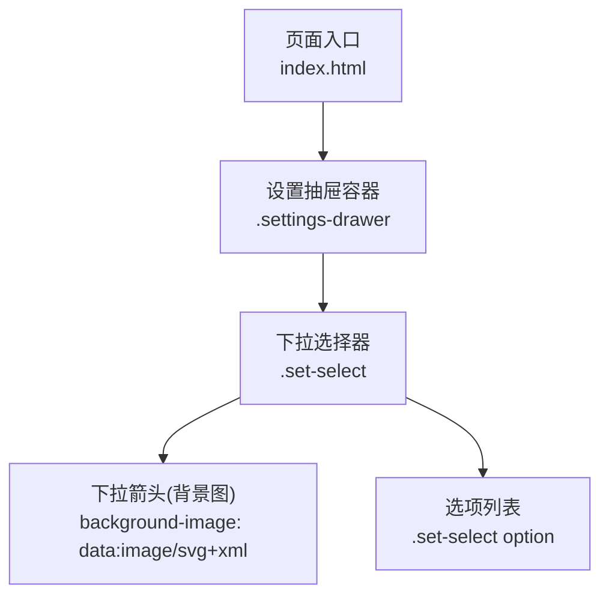
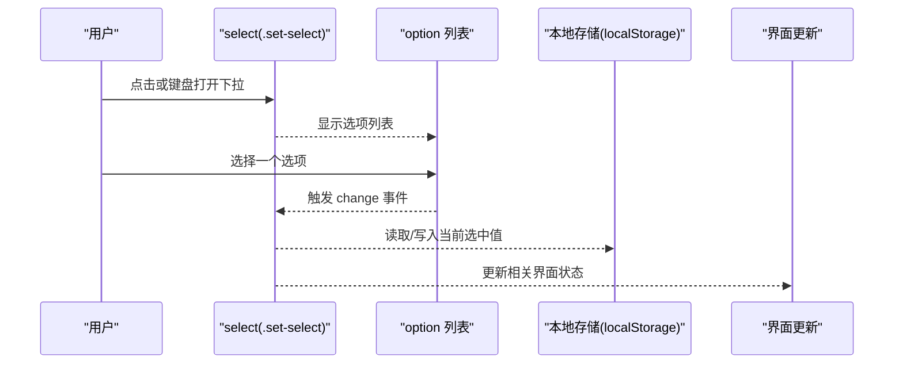
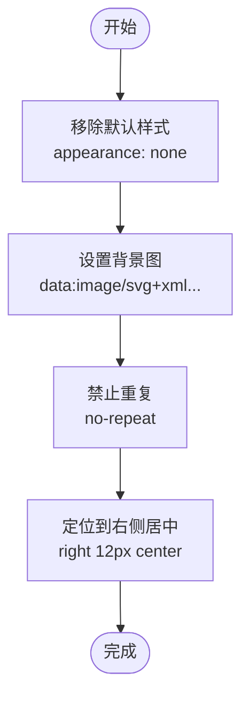
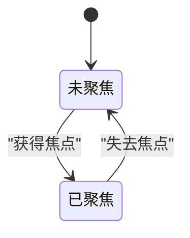
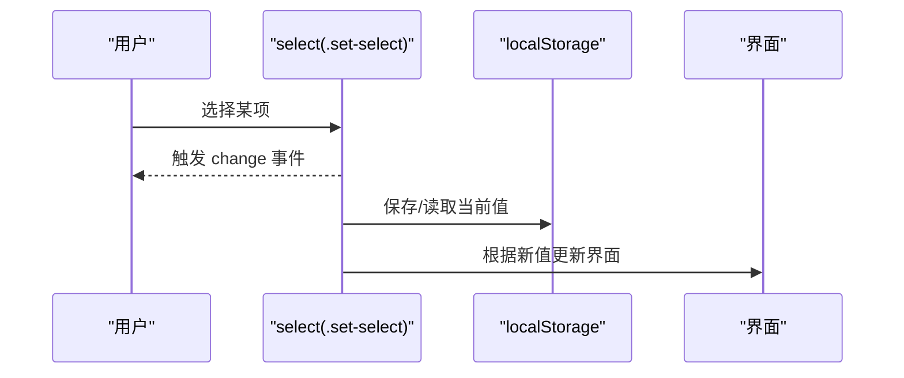
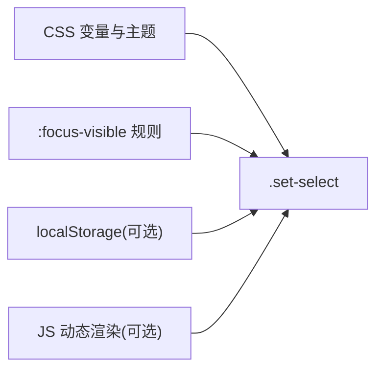

# 下拉选择器

<cite>
**本文引用的文件**   
- [index.html](file://hushai/meditation/static/index.html)
</cite>

## 目录
1. [简介](#简介)
2. [项目结构](#项目结构)
3. [核心组件](#核心组件)
4. [架构总览](#架构总览)
5. [详细组件分析](#详细组件分析)
6. [依赖分析](#依赖分析)
7. [性能考虑](#性能考虑)
8. [故障排查指南](#故障排查指南)
9. [结论](#结论)
10. [附录](#附录)

## 简介
本文件为“设置抽屉”中的下拉选择器（select）提供完整组件文档，覆盖以下方面：
- 自定义下拉箭头的 SVG 实现与背景图片定位方式
- 下拉选项的样式定制（option 的背景与文字颜色）
- 焦点状态管理（border-color 变化与 outline 样式）
- 尺寸规范与间距设置
- 值获取与事件处理机制
- 响应式适配与移动端优化方案

该组件位于冥想应用的前端页面中，采用原生 select 元素并通过 CSS 进行深度定制，确保在设置抽屉内具有一致的视觉风格与交互体验。

## 项目结构
- 前端入口与样式、脚本集中在单页 HTML 文件中，包含设置抽屉及其内部控件的样式与行为。
- 下拉选择器样式定义与使用均在该文件中完成，便于统一维护与主题化。

图表来源
- [index.html:550-577](file://hushai/meditation/static/index.html#L550-L577)
- [index.html:584-595](file://hushai/meditation/static/index.html#L584-L595)

章节来源
- [index.html:550-577](file://hushai/meditation/static/index.html#L550-L577)
- [index.html:584-595](file://hushai/meditation/static/index.html#L584-L595)

## 核心组件
- 组件名称：设置抽屉下拉选择器（.set-select）
- 语义标签：select
- 主要职责：在设置抽屉中提供可选择的下拉列表，支持键盘与屏幕阅读器访问。

关键特性
- 自定义下拉箭头：通过 background-image 注入内联 SVG，并控制位置与重复策略。
- 选项样式：对 option 的背景与文字颜色进行定制，保证可读性与一致性。
- 焦点状态：聚焦时边框颜色变化，配合全局 :focus-visible 提升可访问性。
- 尺寸与间距：统一的 padding、字体大小与行高，适配抽屉布局。

章节来源
- [index.html:584-595](file://hushai/meditation/static/index.html#L584-L595)
- [index.html:736-739](file://hushai/meditation/static/index.html#L736-L739)

## 架构总览
下拉选择器在设置抽屉内的层级关系如下：
- 设置抽屉作为固定定位的底部面板，承载所有设置项。
- 下拉选择器作为表单控件之一，与其他控件（如滑块、按钮）并列展示。
- 下拉箭头由 CSS background-image 渲染，不依赖外部资源。
- 选项列表由浏览器原生渲染，但可通过 CSS 调整背景与文字颜色。

图表来源
- [index.html:584-595](file://hushai/meditation/static/index.html#L584-L595)
- [index.html:1557-1563](file://hushai/meditation/static/index.html#L1557-L1563)

## 详细组件分析

### 自定义下拉箭头的 SVG 实现与背景定位
- 实现方式：使用 CSS 的 background-image 属性嵌入一个内联 SVG 数据 URI，绘制一个向下的小三角箭头。
- 定位策略：
  - background-repeat: no-repeat 防止重复渲染。
  - background-position: right 12px center 将箭头置于右侧垂直居中，距离右内边距 12px。
- 外观控制：
  - appearance: none 移除默认系统样式，使箭头完全由自定义背景图控制。
  - 箭头颜色通过 SVG 的 fill 属性指定，与整体灰度主题保持一致。

图表来源
- [index.html:584-595](file://hushai/meditation/static/index.html#L584-L595)

章节来源
- [index.html:584-595](file://hushai/meditation/static/index.html#L584-L595)

### 下拉选项的样式定制（option 背景与文字颜色）
- 目标：确保选项列表在不同平台上的背景与文字颜色符合主题。
- 实现要点：
  - 为 .set-select option 设置背景色与文字色，使其与页面主色调一致。
  - 注意：部分浏览器对 option 的样式支持有限，必要时需结合 JS 动态渲染自定义下拉菜单以达成一致的跨平台效果。

章节来源
- [index.html:594-595](file://hushai/meditation/static/index.html#L594-L595)

### 焦点状态管理（border-color 与 outline）
- 边框颜色变化：
  - 当 select 获得焦点时，边框颜色切换为主题强调色，提升可见性。
- 轮廓样式：
  - 全局 :focus-visible 规则为可聚焦元素添加 outline，确保键盘导航时的清晰指示。
  - 针对特定按钮与控件也定义了 outline-offset，避免与边框重叠。

图表来源
- [index.html:593-595](file://hushai/meditation/static/index.html#L593-L595)
- [index.html:736-739](file://hushai/meditation/static/index.html#L736-L739)

章节来源
- [index.html:593-595](file://hushai/meditation/static/index.html#L593-L595)
- [index.html:736-739](file://hushai/meditation/static/index.html#L736-L739)

### 尺寸规范与间距设置
- 宽度：width: 100% 占满父容器，适应抽屉内容区。
- 内边距：padding: 12px 14px，提供舒适的点击区域与文本留白。
- 字体与行高：font-size: 13px，字体族与正文一致，确保阅读一致性。
- 过渡动画：transition: border-color .3s，聚焦时边框颜色平滑变化。

章节来源
- [index.html:584-595](file://hushai/meditation/static/index.html#L584-L595)

### 值获取与事件处理机制
- 值获取：
  - 通过 select.value 直接获取当前选中项的值。
  - 若需要持久化，可将值写入 localStorage 并在下次加载时恢复。
- 事件监听：
  - 监听 change 事件以捕获用户选择变更。
  - 在设置抽屉中，其他控件（如滑块、按钮）的事件模式可作为参考，用于同步更新界面与存储。

图表来源
- [index.html:584-595](file://hushai/meditation/static/index.html#L584-L595)
- [index.html:1557-1563](file://hushai/meditation/static/index.html#L1557-L1563)

章节来源
- [index.html:584-595](file://hushai/meditation/static/index.html#L584-L595)
- [index.html:1557-1563](file://hushai/meditation/static/index.html#L1557-L1563)

### 响应式适配与移动端优化
- 容器适配：
  - 设置抽屉最大宽度限制与居中定位，在小屏设备上自动收缩。
- 触摸友好：
  - 较大的点击区域与合适的行高，提升移动端操作体验。
- 滚动与遮罩：
  - 抽屉顶部遮罩与滚动条隐藏，避免误触与视觉干扰。
- 动效降级：
  - 对于 prefers-reduced-motion 的用户，减少不必要的动画。

章节来源
- [index.html:550-577](file://hushai/meditation/static/index.html#L550-L577)
- [index.html:741-746](file://hushai/meditation/static/index.html#L741-L746)

## 依赖分析
- 样式依赖：
  - 使用 CSS 变量（如 --ink、--paper-warm、--stone-200）统一主题。
  - 依赖全局 :focus-visible 规则提升可访问性。
- 运行时依赖：
  - 可选地依赖 localStorage 进行值持久化。
  - 如需跨平台一致的 option 样式，可引入 JS 动态渲染自定义下拉菜单。

图表来源
- [index.html:24-45](file://hushai/meditation/static/index.html#L24-L45)
- [index.html:736-739](file://hushai/meditation/static/index.html#L736-L739)
- [index.html:584-595](file://hushai/meditation/static/index.html#L584-L595)

章节来源
- [index.html:24-45](file://hushai/meditation/static/index.html#L24-L45)
- [index.html:736-739](file://hushai/meditation/static/index.html#L736-L739)
- [index.html:584-595](file://hushai/meditation/static/index.html#L584-L595)

## 性能考虑
- 避免重绘与回流：
  - 仅对必要属性（如 border-color）做过渡动画，减少频繁重排。
- 减少 DOM 操作：
  - 如需自定义下拉菜单，批量构建节点后再插入 DOM，降低重绘次数。
- 资源优化：
  - 使用内联 SVG 数据 URI，避免额外网络请求。

## 故障排查指南
- 问题：下拉箭头未显示或错位
  - 检查 appearance: none 是否生效，确认 background-position 与 padding-right 是否冲突。
- 问题：选项背景/颜色不一致
  - 确认 .set-select option 的样式是否被浏览器默认样式覆盖；必要时使用 JS 自定义渲染。
- 问题：焦点不可见
  - 检查 :focus-visible 规则是否被覆盖，确保 outline 与 outline-offset 正确设置。
- 问题：移动端点击区域过小
  - 增大 padding 与 font-size，确保触控友好。

章节来源
- [index.html:584-595](file://hushai/meditation/static/index.html#L584-L595)
- [index.html:736-739](file://hushai/meditation/static/index.html#L736-L739)

## 结论
设置抽屉中的下拉选择器通过原生 select 与精细的 CSS 定制，实现了统一的视觉风格与良好的交互体验。自定义 SVG 箭头、选项样式、焦点状态与尺寸规范共同确保了组件的可访问性与一致性。在移动端与小屏设备上，通过合理的布局与动效降级进一步优化了用户体验。若需更严格的跨平台一致性，可结合 JS 动态渲染自定义下拉菜单。

## 附录
- 相关样式片段路径：
  - 下拉选择器样式：[index.html:584-595](file://hushai/meditation/static/index.html#L584-L595)
  - 焦点可见性规则：[index.html:736-739](file://hushai/meditation/static/index.html#L736-L739)
  - 设置抽屉容器样式：[index.html:550-577](file://hushai/meditation/static/index.html#L550-L577)
  - 动效降级规则：[index.html:741-746](file://hushai/meditation/static/index.html#L741-L746)