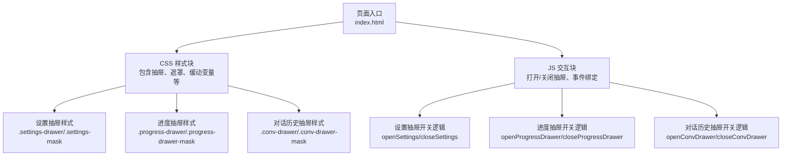
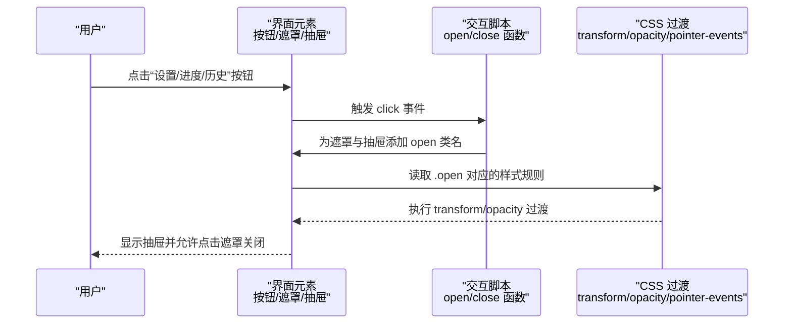
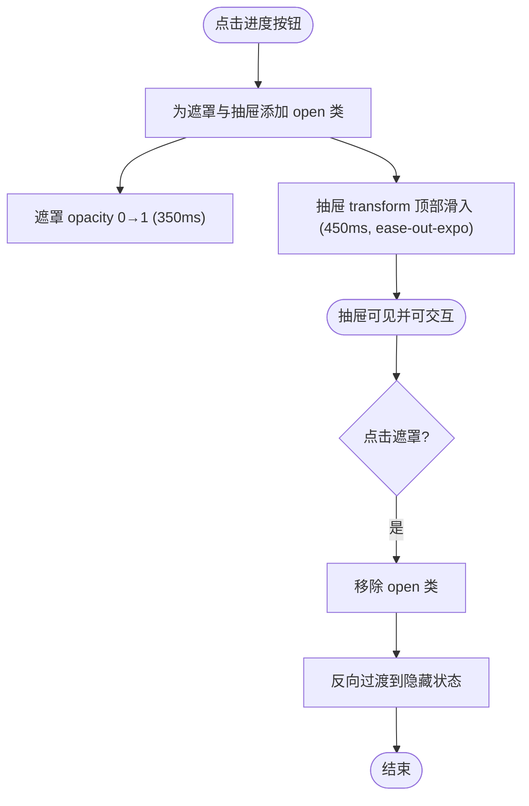
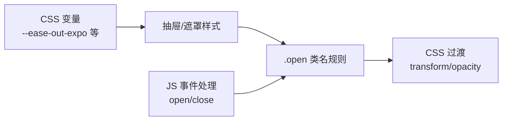

# 抽屉动画效果

<cite>
**本文引用的文件**   
- [index.html](file://hushai/meditation/static/index.html)
</cite>

## 目录
1. [简介](#简介)
2. [项目结构](#项目结构)
3. [核心组件](#核心组件)
4. [架构总览](#架构总览)
5. [详细组件分析](#详细组件分析)
6. [依赖关系分析](#依赖关系分析)
7. [性能考量](#性能考量)
8. [故障排查指南](#故障排查指南)
9. [结论](#结论)

## 简介
本技术文档聚焦于“设置抽屉”的动画实现，围绕以下关键点展开：
- 从底部滑入/滑出的 CSS 过渡动画，使用 transform 的 translateY 变换与 ease-out-expo 缓动函数。
- 遮罩层的透明度渐变（opacity）与 pointer-events 状态切换。
- 动画时间控制：抽屉主体过渡时长 450ms，遮罩层过渡时长 350ms。
- 移动端适配：safe-area-inset 处理与触摸手势支持。
- 动画性能优化建议：GPU 加速与硬件渲染策略。

## 项目结构
本项目为单页应用，所有样式与脚本内联在单个 HTML 文件中。抽屉相关样式与交互逻辑均位于该文件的 <style> 与 <script> 区块中。

图表来源
- [index.html:544-560](file://hushai/meditation/static/index.html#L544-L560)
- [index.html:848-861](file://hushai/meditation/static/index.html#L848-L861)
- [index.html:668-682](file://hushai/meditation/static/index.html#L668-L682)
- [index.html:1557-1563](file://hushai/meditation/static/index.html#L1557-L1563)
- [index.html:2014-2023](file://hushai/meditation/static/index.html#L2014-L2023)
- [index.html:1186-1200](file://hushai/meditation/static/index.html#L1186-L1200)

章节来源
- [index.html:544-560](file://hushai/meditation/static/index.html#L544-L560)
- [index.html:848-861](file://hushai/meditation/static/index.html#L848-L861)
- [index.html:668-682](file://hushai/meditation/static/index.html#L668-L682)
- [index.html:1557-1563](file://hushai/meditation/static/index.html#L1557-L1563)
- [index.html:2014-2023](file://hushai/meditation/static/index.html#L2014-L2023)
- [index.html:1186-1200](file://hushai/meditation/static/index.html#L1186-L1200)

## 核心组件
- 设置抽屉（底部滑出）
  - 遮罩层：.settings-mask
  - 抽屉面板：.settings-drawer
  - 关键属性：transform: translate(-50%, 100%) → translate(-50%, 0)，transition: transform .45s var(--ease-out-expo)；遮罩 transition: opacity .35s，pointer-events 由 none 切换为 auto。
- 进度抽屉（顶部滑入）
  - 遮罩层：.progress-drawer-mask
  - 抽屉面板：.progress-drawer
  - 关键属性：transform: translate(-50%, -100%) → translate(-50%, 0)，transition: transform .45s var(--ease-out-expo)；遮罩 transition: opacity .35s，pointer-events 由 none 切换为 auto。
- 对话历史抽屉（侧边滑入）
  - 遮罩层：.conv-drawer-mask
  - 抽屉面板：.conv-drawer
  - 关键属性：transform: translateX(-100%) → translateX(0)，transition: transform .4s var(--ease-out-expo)；遮罩 transition: opacity .35s，pointer-events 由 none 切换为 auto。

章节来源
- [index.html:544-560](file://hushai/meditation/static/index.html#L544-L560)
- [index.html:848-861](file://hushai/meditation/static/index.html#L848-L861)
- [index.html:668-682](file://hushai/meditation/static/index.html#L668-L682)

## 架构总览
下图展示了三种抽屉的层级关系与交互流程：用户点击触发按钮后，JS 为遮罩与抽屉添加 open 类名，CSS 根据类名执行过渡动画。

图表来源
- [index.html:1557-1563](file://hushai/meditation/static/index.html#L1557-L1563)
- [index.html:2014-2023](file://hushai/meditation/static/index.html#L2014-L2023)
- [index.html:1186-1200](file://hushai/meditation/static/index.html#L1186-L1200)
- [index.html:544-560](file://hushai/meditation/static/index.html#L544-L560)
- [index.html:848-861](file://hushai/meditation/static/index.html#L848-L861)
- [index.html:668-682](file://hushai/meditation/static/index.html#L668-L682)

## 详细组件分析

### 设置抽屉（底部滑入/滑出）
- 初始状态
  - 遮罩：opacity: 0，pointer-events: none
  - 抽屉：transform: translate(-50%, 100%)，即完全移出视口底部
- 激活状态（.open）
  - 遮罩：opacity: 1，pointer-events: auto
  - 抽屉：transform: translate(-50%, 0)，回到可视区域
- 过渡参数
  - 抽屉 transform 过渡时长：450ms，缓动：var(--ease-out-expo)
  - 遮罩 opacity 过渡时长：350ms，默认线性（未指定缓动）
- 交互逻辑
  - 打开：openSettings() 为 settingsMask 与 settingsDrawer 添加 open
  - 关闭：closeSettings() 移除 open；同时监听遮罩点击关闭

图表来源
- [index.html:544-560](file://hushai/meditation/static/index.html#L544-L560)
- [index.html:1557-1563](file://hushai/meditation/static/index.html#L1557-L1563)

章节来源
- [index.html:544-560](file://hushai/meditation/static/index.html#L544-L560)
- [index.html:1557-1563](file://hushai/meditation/static/index.html#L1557-L1563)

### 进度抽屉（顶部滑入/滑出）
- 初始状态
  - 遮罩：opacity: 0，pointer-events: none
  - 抽屉：transform: translate(-50%, -100%)，即完全移出视口顶部
- 激活状态（.open）
  - 遮罩：opacity: 1，pointer-events: auto
  - 抽屉：transform: translate(-50%, 0)
- 过渡参数
  - 抽屉 transform 过渡时长：450ms，缓动：var(--ease-out-expo)
  - 遮罩 opacity 过渡时长：350ms
- 交互逻辑
  - 打开：openProgressDrawer() 为 progressDrawerMask 与 progressDrawer 添加 open
  - 关闭：closeProgressDrawer() 移除 open；同时监听遮罩点击关闭

图表来源
- [index.html:848-861](file://hushai/meditation/static/index.html#L848-L861)
- [index.html:2014-2023](file://hushai/meditation/static/index.html#L2014-L2023)

章节来源
- [index.html:848-861](file://hushai/meditation/static/index.html#L848-L861)
- [index.html:2014-2023](file://hushai/meditation/static/index.html#L2014-L2023)

### 对话历史抽屉（侧边滑入/滑出）
- 初始状态
  - 遮罩：opacity: 0，pointer-events: none
  - 抽屉：transform: translateX(-100%)，即完全移出视口左侧
- 激活状态（.open）
  - 遮罩：opacity: 1，pointer-events: auto
  - 抽屉：transform: translateX(0)
- 过渡参数
  - 抽屉 transform 过渡时长：400ms，缓动：var(--ease-out-expo)
  - 遮罩 opacity 过渡时长：350ms
- 交互逻辑
  - 打开：openConvDrawer() 为 convDrawerMask 与 convDrawer 添加 open
  - 关闭：closeConvDrawer() 移除 open；同时监听遮罩点击关闭

图表来源
- [index.html:668-682](file://hushai/meditation/static/index.html#L668-L682)
- [index.html:1186-1200](file://hushai/meditation/static/index.html#L1186-L1200)

章节来源
- [index.html:668-682](file://hushai/meditation/static/index.html#L668-L682)
- [index.html:1186-1200](file://hushai/meditation/static/index.html#L1186-L1200)

### 缓动函数与时间控制
- 缓动函数
  - --ease-out-expo 定义为 cubic-bezier(0.16,1,0.3,1)，用于抽屉 transform 过渡，提供“快速启动、柔和收尾”的视觉感受。
- 时间控制
  - 设置抽屉与进度抽屉：transform 过渡 450ms，遮罩 opacity 过渡 350ms。
  - 对话历史抽屉：transform 过渡 400ms，遮罩 opacity 过渡 350ms。

章节来源
- [index.html:42-45](file://hushai/meditation/static/index.html#L42-L45)
- [index.html:544-560](file://hushai/meditation/static/index.html#L544-L560)
- [index.html:848-861](file://hushai/meditation/static/index.html#L848-L861)
- [index.html:668-682](file://hushai/meditation/static/index.html#L668-L682)

### 遮罩层与 pointer-events 状态切换
- 遮罩层默认 opacity: 0，pointer-events: none，确保不拦截底层交互。
- 当添加 .open 时，opacity: 1，pointer-events: auto，使遮罩可接收点击事件以关闭抽屉。
- 此模式在设置抽屉、进度抽屉、对话历史抽屉中一致使用。

章节来源
- [index.html:544-548](file://hushai/meditation/static/index.html#L544-L548)
- [index.html:668-673](file://hushai/meditation/static/index.html#L668-L673)
- [index.html:848-853](file://hushai/meditation/static/index.html#L848-L853)

### 移动端适配与安全区域
- safe-area-inset
  - 输入区域使用 env(safe-area-inset-bottom, 0px) 避免被刘海或底部横条遮挡。
- 触摸手势支持
  - 当前代码通过点击遮罩关闭抽屉，未实现拖拽手势。可在 JS 中增加 touchstart/touchmove/touchend 监听，计算滑动距离阈值，动态更新 transform 值并在释放时决定开/关状态。

章节来源
- [index.html:504-508](file://hushai/meditation/static/index.html#L504-L508)

## 依赖关系分析
- 样式依赖
  - 全局 CSS 变量定义缓动函数与颜色体系，抽屉样式引用这些变量。
- 交互依赖
  - JS 通过 DOM API 操作 classList 切换 open 状态，驱动 CSS 过渡。
- 层级关系
  - 遮罩 z-index 低于抽屉，保证抽屉内容在最上层。

图表来源
- [index.html:42-45](file://hushai/meditation/static/index.html#L42-L45)
- [index.html:544-560](file://hushai/meditation/static/index.html#L544-L560)
- [index.html:848-861](file://hushai/meditation/static/index.html#L848-L861)
- [index.html:668-682](file://hushai/meditation/static/index.html#L668-L682)
- [index.html:1557-1563](file://hushai/meditation/static/index.html#L1557-L1563)
- [index.html:2014-2023](file://hushai/meditation/static/index.html#L2014-L2023)
- [index.html:1186-1200](file://hushai/meditation/static/index.html#L1186-L1200)

章节来源
- [index.html:42-45](file://hushai/meditation/static/index.html#L42-L45)
- [index.html:544-560](file://hushai/meditation/static/index.html#L544-L560)
- [index.html:848-861](file://hushai/meditation/static/index.html#L848-L861)
- [index.html:668-682](file://hushai/meditation/static/index.html#L668-L682)
- [index.html:1557-1563](file://hushai/meditation/static/index.html#L1557-L1563)
- [index.html:2014-2023](file://hushai/meditation/static/index.html#L2014-L2023)
- [index.html:1186-1200](file://hushai/meditation/static/index.html#L1186-L1200)

## 性能考量
- GPU 加速与硬件渲染
  - 优先对 transform 与 opacity 进行过渡，这两类属性可由合成器线程处理，减少布局与绘制开销。
  - 避免在动画过程中改变会触发重排的属性（如 width、height、top/left），保持仅 transform 与 opacity 变化。
- 过渡时长与缓动
  - 450ms 与 400ms 的 transform 过渡配合 ease-out-expo，既流畅又不过长，适合移动端。
  - 遮罩 350ms 的 opacity 过渡略短于抽屉，形成层次感。
- 减少重绘
  - 使用 will-change 或 transform: translateZ(0) 可提示浏览器提升图层，但需谨慎使用以避免内存占用过高。
- 无障碍与低动效偏好
  - 项目中已对 prefers-reduced-motion 做了兼容，建议在抽屉动画中也遵循该媒体查询，禁用或简化动画以提升可访问性。

[本节为通用性能指导，无需具体文件引用]

## 故障排查指南
- 抽屉无法打开
  - 检查 JS 是否正确为遮罩与抽屉添加 open 类名。
  - 确认 CSS 中 .open 对应的 transform/opacity 规则是否存在且未被覆盖。
- 遮罩不可点击
  - 确认遮罩的 pointer-events 是否为 auto，以及 z-index 是否高于主内容。
- 动画卡顿
  - 检查是否在动画期间修改了布局属性；尽量只变更 transform 与 opacity。
  - 评估页面是否有大量复杂滤镜或阴影，必要时简化。
- 移动端安全区问题
  - 确认输入区域与底部控件使用了 env(safe-area-inset-bottom, 0px)。
- 手势支持缺失
  - 如需拖拽关闭，需新增 touchstart/touchmove/touchend 监听，计算滑动距离并实时更新 transform，在释放时判断开/关。

章节来源
- [index.html:544-560](file://hushai/meditation/static/index.html#L544-L560)
- [index.html:848-861](file://hushai/meditation/static/index.html#L848-L861)
- [index.html:668-682](file://hushai/meditation/static/index.html#L668-L682)
- [index.html:504-508](file://hushai/meditation/static/index.html#L504-L508)

## 结论
本项目中的抽屉动画采用简洁而高效的 CSS 过渡方案：通过 transform 的 translateY/translateX 与 opacity 的变化，结合 ease-out-expo 缓动函数，实现了顺滑的滑入/滑出体验。遮罩层通过 pointer-events 的状态切换，确保了良好的交互隔离与关闭行为。时间控制上，抽屉主体 450ms/400ms 与遮罩 350ms 的组合兼顾了响应性与层次感。移动端方面，safe-area-inset 的使用提升了适配质量；若需进一步提升体验，可补充触摸手势支持。整体而言，该实现符合现代前端最佳实践，具备良好的性能与可维护性。