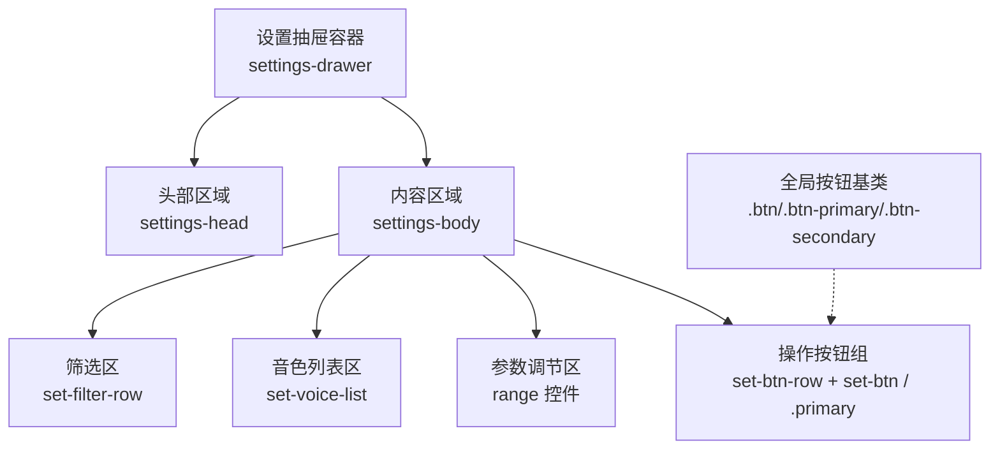
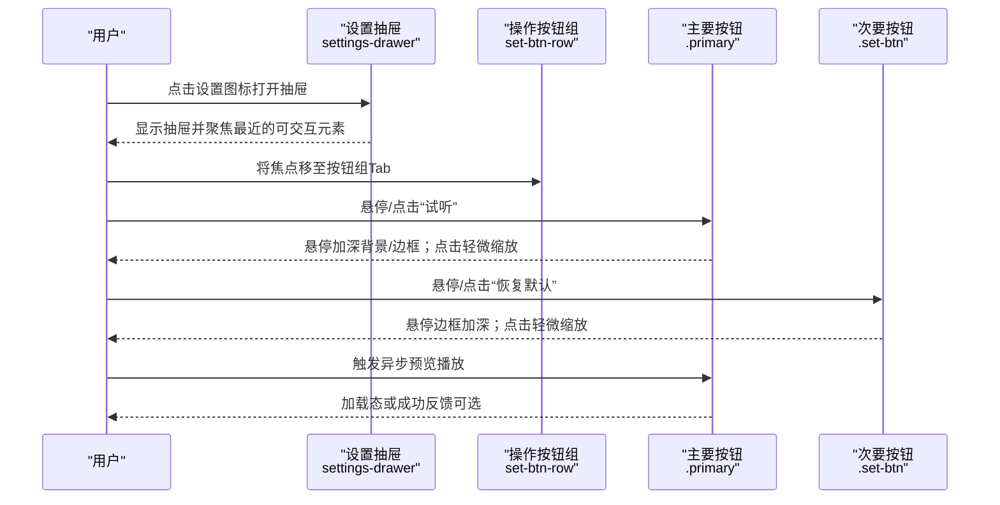
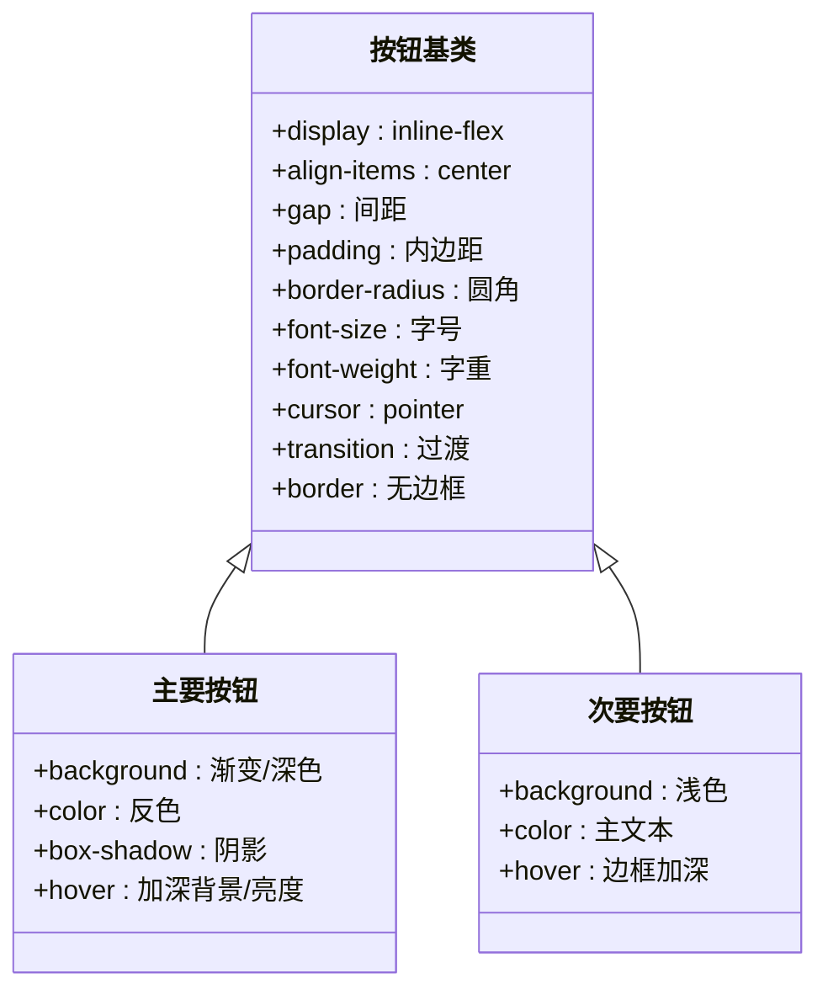
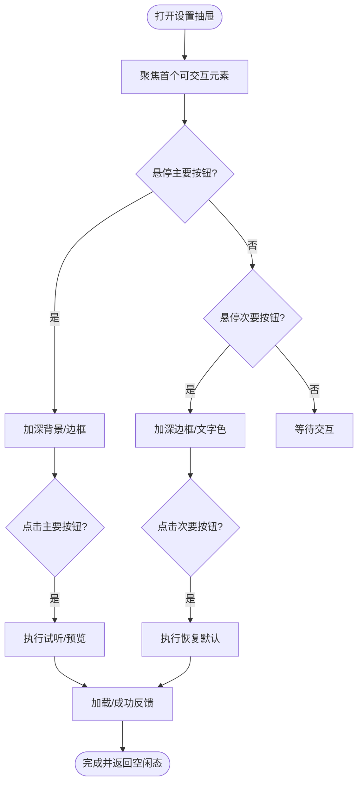
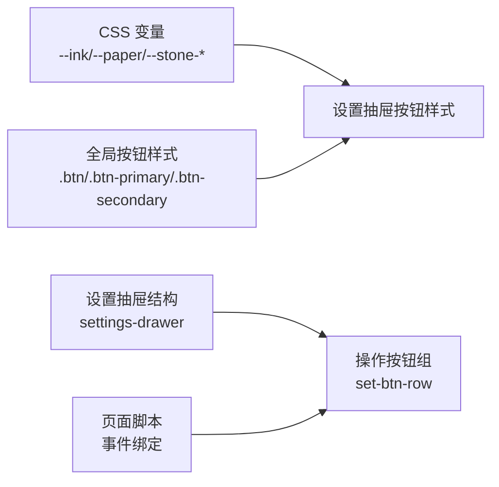

# 操作按钮组

<cite>
**本文引用的文件**   
- [index.html](file://hushai/meditation/static/index.html)
- [admin.css](file://hushai/meditation/admin/static/css/admin.css)
</cite>

## 目录
1. [简介](#简介)
2. [项目结构](#项目结构)
3. [核心组件](#核心组件)
4. [架构总览](#架构总览)
5. [详细组件分析](#详细组件分析)
6. [依赖关系分析](#依赖关系分析)
7. [性能与可访问性考量](#性能与可访问性考量)
8. [故障排查指南](#故障排查指南)
9. [结论](#结论)

## 简介
本文件为“设置抽屉中的操作按钮组”的交互设计文档，聚焦于以下目标：
- 按钮基础样式：边框、背景色、字体与字号
- 主要按钮与次要按钮的视觉层次差异（primary 类）
- 悬停与点击效果：颜色变化与 transform 变换
- 禁用状态处理：透明度降低与光标样式
- 布局对齐与间距控制
- 键盘可访问性与焦点管理

## 项目结构
与“设置抽屉中的操作按钮组”直接相关的实现位于前端页面与样式文件中：
- 设置抽屉结构与按钮组 HTML 定义在 index.html 中
- 按钮通用样式与变体样式在 admin.css 中
- 设置抽屉内按钮组的专用样式也在 index.html 的 <style> 块中

图表来源
- [index.html:540-639](file://hushai/meditation/static/index.html#L540-L639)
- [admin.css:699-778](file://hushai/meditation/admin/static/css/admin.css#L699-L778)

章节来源
- [index.html:540-639](file://hushai/meditation/static/index.html#L540-L639)
- [admin.css:699-778](file://hushai/meditation/admin/static/css/admin.css#L699-L778)

## 核心组件
- 设置抽屉容器：负责抽屉的打开/关闭动画与滚动区域
- 操作按钮组：位于设置抽屉底部，包含“恢复默认”和“试听”两个按钮，其中“试听”为主要按钮（primary）
- 全局按钮系统：提供通用按钮样式与变体（如 primary、secondary），用于统一视觉语言

关键要点
- 按钮组使用 Flex 布局，通过 gap 控制间距，确保左右对齐一致
- 主要按钮通过 .primary 类强化视觉层级，次要按钮保持中性外观
- 悬停态通过颜色与边框变化反馈；点击态可通过 transform 缩放增强触感
- 禁用态通过 opacity 降低与 cursor: not-allowed 明确不可用状态
- 键盘可访问性通过 :focus-visible 高亮轮廓，保证 Tab 导航可见性

章节来源
- [index.html:1050-1089](file://hushai/meditation/static/index.html#L1050-L1089)
- [index.html:617-627](file://hushai/meditation/static/index.html#L617-L627)
- [admin.css:699-778](file://hushai/meditation/admin/static/css/admin.css#L699-L778)

## 架构总览
从用户交互到界面反馈的流程如下：

图表来源
- [index.html:1050-1089](file://hushai/meditation/static/index.html#L1050-L1089)
- [index.html:617-627](file://hushai/meditation/static/index.html#L617-L627)

## 详细组件分析

### 按钮基础样式
- 边框：默认使用细边框，悬停时边框颜色加深，形成清晰边界
- 背景色：次要按钮使用浅色背景；主要按钮使用深色填充以突出
- 文字与字体：使用等宽风格小字，字母间距略增，提升可读性与克制感
- 尺寸与圆角：按钮高度适中，圆角柔和，适配移动端触控

参考路径
- [index.html:617-627](file://hushai/meditation/static/index.html#L617-L627)

章节来源
- [index.html:617-627](file://hushai/meditation/static/index.html#L617-L627)

### 主要按钮与次要按钮的视觉层次
- 主要按钮（.primary）：深色背景、反色文字，强调主操作
- 次要按钮（.set-btn）：浅色背景、中性文字，弱化但可操作
- 悬停差异：主要按钮悬停加深背景；次要按钮悬停加深边框与文字色

参考路径
- [index.html:617-627](file://hushai/meditation/static/index.html#L617-L627)

章节来源
- [index.html:617-627](file://hushai/meditation/static/index.html#L617-L627)

### 悬停与点击效果
- 悬停：颜色变化（背景或边框）、必要时亮度微调
- 点击：transform: scale(0.95~0.98) 产生轻微缩放，增强按压感
- 过渡：使用 ease-out 曲线，避免突兀变化

参考路径
- [index.html:617-627](file://hushai/meditation/static/index.html#L617-L627)

章节来源
- [index.html:617-627](file://hushai/meditation/static/index.html#L617-L627)

### 禁用状态处理
- 透明度：opacity 降低至约 0.3~0.5，表示不可用
- 光标：cursor: not-allowed，明确禁止交互
- 指针事件：pointer-events: none，防止误触

参考路径
- [admin.css:1751-1782](file://hushai/meditation/admin/static/css/admin.css#L1751-L1782)

章节来源
- [admin.css:1751-1782](file://hushai/meditation/admin/static/css/admin.css#L1751-L1782)

### 布局对齐与间距控制
- 按钮组容器使用 Flex 布局，justify-content 与 align-items 保证垂直居中
- 使用 gap 控制按钮间距，避免 margin 带来的计算复杂度
- 整体宽度自适应，最大宽度受抽屉限制，确保在小屏设备上仍可用

参考路径
- [index.html:617-627](file://hushai/meditation/static/index.html#L617-L627)

章节来源
- [index.html:617-627](file://hushai/meditation/static/index.html#L617-L627)

### 键盘可访问性与焦点管理
- 焦点可见性：使用 :focus-visible 为所有可交互按钮添加明显轮廓
- 焦点顺序：Tab 进入抽屉后，焦点应依次落在筛选按钮、音色项、滑块、操作按钮
- 回车确认：对主要按钮支持 Enter 键触发，提升键盘效率
- 关闭抽屉：Esc 键关闭抽屉并将焦点返回触发元素

参考路径
- [index.html:735-739](file://hushai/meditation/static/index.html#L735-L739)

章节来源
- [index.html:735-739](file://hushai/meditation/static/index.html#L735-L739)

### 代码级图示：按钮样式关系

图表来源
- [admin.css:699-778](file://hushai/meditation/admin/static/css/admin.css#L699-L778)

章节来源
- [admin.css:699-778](file://hushai/meditation/admin/static/css/admin.css#L699-L778)

### 代码级图示：设置抽屉按钮组流程

图表来源
- [index.html:1050-1089](file://hushai/meditation/static/index.html#L1050-L1089)
- [index.html:617-627](file://hushai/meditation/static/index.html#L617-L627)

## 依赖关系分析
- 样式依赖：
  - 设置抽屉按钮组样式依赖于 CSS 变量（如 --ink、--paper、--stone-*）
  - 全局按钮基类与变体样式由 admin.css 提供，设置抽屉内按钮复用该体系
- 结构依赖：
  - 按钮组位于设置抽屉的内容区域，遵循抽屉的布局约束
  - 焦点管理与键盘事件由页面脚本驱动，需与 DOM 节点 ID 对应

图表来源
- [index.html:540-639](file://hushai/meditation/static/index.html#L540-L639)
- [admin.css:699-778](file://hushai/meditation/admin/static/css/admin.css#L699-L778)

章节来源
- [index.html:540-639](file://hushai/meditation/static/index.html#L540-L639)
- [admin.css:699-778](file://hushai/meditation/admin/static/css/admin.css#L699-L778)

## 性能与可访问性考量
- 性能
  - 使用 CSS transition 与 transform 实现轻量动画，避免重排重绘
  - 减少复杂滤镜与阴影，优先使用颜色与边框变化
- 可访问性
  - 确保 :focus-visible 在所有按钮上生效，轮廓对比度足够
  - 为重要按钮提供 aria-label 与 title，辅助屏幕阅读器
  - 键盘操作支持 Enter 触发主要按钮，Esc 关闭抽屉并归还焦点

章节来源
- [index.html:735-739](file://hushai/meditation/static/index.html#L735-L739)

## 故障排查指南
- 问题：按钮悬停无变化
  - 检查是否被其他样式覆盖，确认 hover 选择器优先级
  - 验证 CSS 变量是否正确注入
- 问题：点击无响应
  - 检查 JavaScript 事件绑定是否成功，DOM 节点 ID 是否存在
  - 确认 pointer-events 未被设置为 none
- 问题：键盘无法聚焦
  - 检查 :focus-visible 规则是否生效，浏览器兼容性
  - 确认 tabindex 未错误设置为负值导致跳过

章节来源
- [admin.css:1751-1782](file://hushai/meditation/admin/static/css/admin.css#L1751-L1782)
- [index.html:735-739](file://hushai/meditation/static/index.html#L735-L739)

## 结论
设置抽屉中的操作按钮组通过清晰的视觉层次与一致的交互反馈，提供了良好的用户体验。主要按钮与次要按钮的差异显著，悬停与点击效果自然流畅，禁用状态明确传达不可用信息。布局采用 Flex 与 gap 控制，简洁且易维护。键盘可访问性通过 :focus-visible 与合理的焦点顺序得到保障。建议在实际使用中继续完善加载态与成功反馈，以提升操作的确定性。