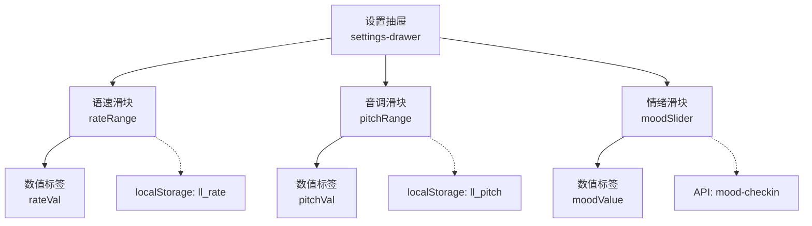
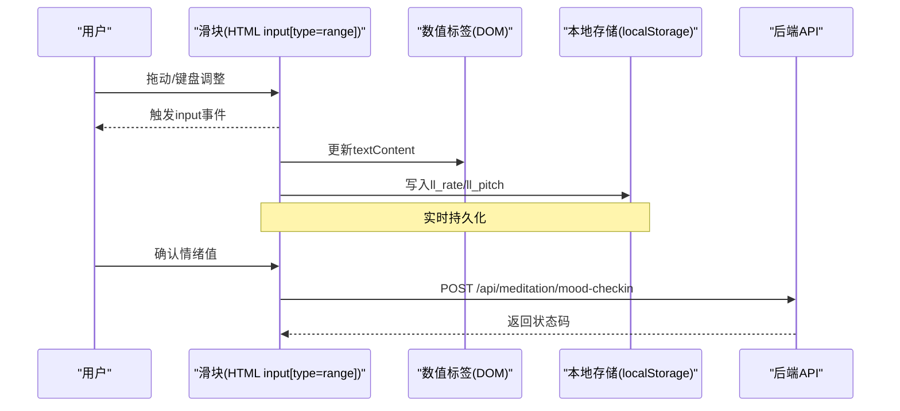
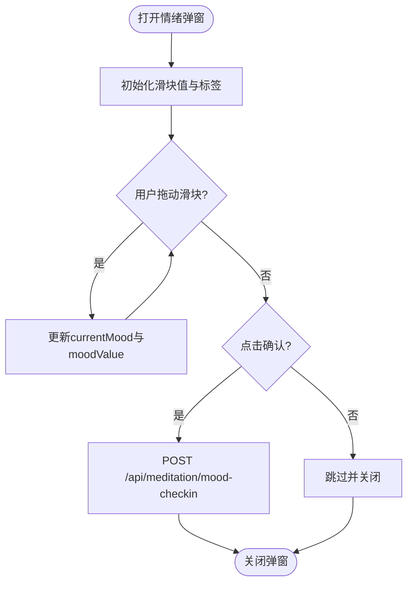
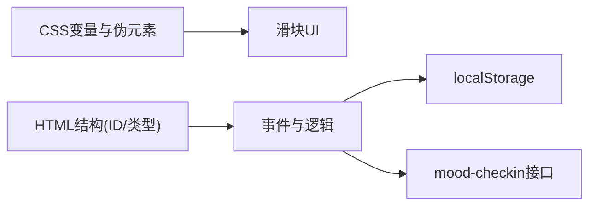

# 滑块控件

<cite>
**本文引用的文件**   
- [index.html](file://hushai/meditation/static/index.html)
</cite>

## 目录
1. [简介](#简介)
2. [项目结构](#项目结构)
3. [核心组件](#核心组件)
4. [架构总览](#架构总览)
5. [详细组件分析](#详细组件分析)
6. [依赖关系分析](#依赖关系分析)
7. [性能考量](#性能考量)
8. [故障排查指南](#故障排查指南)
9. [结论](#结论)
10. [附录](#附录)

## 简介
本文件为“设置抽屉”中的滑块控件提供完整的UI组件文档，覆盖轨道样式、手柄交互、实时值显示、跨浏览器兼容、无障碍访问以及最小/最大与步进配置。该滑块用于调节语音语速、音调以及情绪评分等场景，采用原生HTML range输入并配合CSS伪元素进行深度定制。

## 项目结构
滑块相关实现集中在单页应用的主页面中，包含：
- CSS样式定义（轨道、手柄、数值标签）
- HTML结构（range输入与数值展示区域）
- JavaScript逻辑（事件监听、值更新、本地存储持久化）

图表来源
- [index.html:550-616](file://hushai/meditation/static/index.html#L550-L616)
- [index.html:1072-1088](file://hushai/meditation/static/index.html#L1072-L1088)
- [index.html:1095-1108](file://hushai/meditation/static/index.html#L1095-L1108)
- [index.html:1523-1555](file://hushai/meditation/static/index.html#L1523-L1555)
- [index.html:1907-1936](file://hushai/meditation/static/index.html#L1907-L1936)

章节来源
- [index.html:550-616](file://hushai/meditation/static/index.html#L550-L616)
- [index.html:1072-1088](file://hushai/meditation/static/index.html#L1072-L1088)
- [index.html:1095-1108](file://hushai/meditation/static/index.html#L1095-L1108)
- [index.html:1523-1555](file://hushai/meditation/static/index.html#L1523-L1555)
- [index.html:1907-1936](file://hushai/meditation/static/index.html#L1907-L1936)

## 核心组件
- 轨道样式
  - 高度：通过height定义，确保视觉清晰且易于触控
  - 圆角：使用border-radius使两端圆润
  - 背景色：使用语义化变量控制，保证主题一致性
- 手柄样式与交互
  - 尺寸：圆形手柄，具备足够点击面积
  - Hover缩放：对webkit内核提供transform: scale动画反馈
  - 点击反馈：默认cursor:pointer，部分浏览器可叠加active态增强
- 实时值显示
  - 在input的input事件中同步更新DOM文本节点
  - 格式化：按step精度直接显示，必要时可补充toFixed
- 跨浏览器兼容
  - 同时处理::-webkit-slider-thumb与::-moz-range-thumb
  - 统一appearance:none以消除默认样式差异
- 无障碍访问
  - 使用原生range，自带键盘导航与ARIA语义
  - 建议补充aria-label或aria-labelledby提升可读性
- 范围与步进
  - min/max/step在HTML中声明，限制取值域与步长

章节来源
- [index.html:597-616](file://hushai/meditation/static/index.html#L597-L616)
- [index.html:1072-1088](file://hushai/meditation/static/index.html#L1072-L1088)
- [index.html:1095-1108](file://hushai/meditation/static/index.html#L1095-L1108)
- [index.html:1523-1555](file://hushai/meditation/static/index.html#L1523-L1555)
- [index.html:1907-1936](file://hushai/meditation/static/index.html#L1907-L1936)

## 架构总览
滑块由三层构成：视图层（CSS）、结构层（HTML）、行为层（JS）。三者通过类名与ID关联，形成稳定的数据流与渲染路径。

图表来源
- [index.html:1523-1555](file://hushai/meditation/static/index.html#L1523-L1555)
- [index.html:1907-1936](file://hushai/meditation/static/index.html#L1907-L1936)

## 详细组件分析

### 轨道样式设计
- 高度与圆角
  - 轨道高度较小，便于精细调节；两端圆角柔和，符合整体编辑风格
- 背景色与主题变量
  - 使用统一的灰阶变量作为轨道底色，保持界面层次清晰
- 焦点与轮廓
  - 移除默认outline，避免干扰视觉；可通过:focus-visible自定义焦点环

章节来源
- [index.html:597-616](file://hushai/meditation/static/index.html#L597-L616)

### 手柄交互效果
- 尺寸与形状
  - 圆形手柄，具备明显对比度，易于定位与拖拽
- Hover缩放动画
  - 针对webkit内核提供scale变换，带来轻量级动效反馈
- 点击反馈
  - 通过cursor与阴影增强可点击感；可在需要时增加active态加深反馈

章节来源
- [index.html:602-612](file://hushai/meditation/static/index.html#L602-L612)

### 实时值显示机制
- 更新频率
  - 基于input事件，随拖动连续触发，达到“所见即所得”的即时反馈
- 格式化处理
  - 直接读取value并写入文本节点；如需固定小数位，可使用toFixed(n)
- 持久化
  - 将最新值写入localStorage，刷新后恢复上次设置

章节来源
- [index.html:1523-1555](file://hushai/meditation/static/index.html#L1523-L1555)

### 跨浏览器兼容性方案
- 前缀处理
  - 同时覆盖::-webkit-slider-thumb与::-moz-range-thumb，确保Chrome/Firefox一致体验
- 外观重置
  - 使用appearance:none去除系统默认样式，统一在不同平台的表现
- 焦点与可访问性
  - 原生range自带键盘支持；如需自定义焦点样式，建议使用:focus-visible

章节来源
- [index.html:597-616](file://hushai/meditation/static/index.html#L597-L616)

### 无障碍访问支持
- 键盘导航
  - 原生range支持方向键微调、PageUp/PageDown大步调整、Home/End跳至边界
- ARIA属性
  - 建议为每个滑块添加aria-label或aria-labelledby，明确其用途
  - 若需屏幕阅读器播报当前值，可将数值标签设为aria-live区域或使用aria-valuetext

章节来源
- [index.html:1072-1088](file://hushai/meditation/static/index.html#L1072-L1088)
- [index.html:1095-1108](file://hushai/meditation/static/index.html#L1095-L1108)

### 最小最大值限制与步进值配置
- 范围与步长
  - 在HTML中通过min、max、step声明，限制取值域与增量
- 业务校验
  - 前端可直接信任浏览器约束；如需额外校验，可在提交前再次检查

章节来源
- [index.html:1072-1088](file://hushai/meditation/static/index.html#L1072-L1088)
- [index.html:1095-1108](file://hushai/meditation/static/index.html#L1095-L1108)

### 情绪滑块流程（含网络请求）

图表来源
- [index.html:1907-1936](file://hushai/meditation/static/index.html#L1907-L1936)

## 依赖关系分析
- 样式依赖
  - 使用CSS变量控制颜色与字体，确保全局主题一致
- DOM依赖
  - 通过ID绑定滑块与数值标签，事件处理器直接操作对应节点
- 存储依赖
  - 使用localStorage保存语速与音调，保障会话间一致性
- 网络依赖
  - 情绪滑块确认后调用后端接口记录情绪

图表来源
- [index.html:24-45](file://hushai/meditation/static/index.html#L24-L45)
- [index.html:1523-1555](file://hushai/meditation/static/index.html#L1523-L1555)
- [index.html:1907-1936](file://hushai/meditation/static/index.html#L1907-L1936)

章节来源
- [index.html:24-45](file://hushai/meditation/static/index.html#L24-L45)
- [index.html:1523-1555](file://hushai/meditation/static/index.html#L1523-L1555)
- [index.html:1907-1936](file://hushai/meditation/static/index.html#L1907-L1936)

## 性能考量
- 事件选择
  - 使用input而非change，以获得更流畅的实时反馈
- 渲染优化
  - 仅更新textContent，避免重排重绘开销
- 存储策略
  - 每次input都写localStorage可能频繁，可考虑节流或仅在失焦/结束时写入
- 动画性能
  - hover缩放使用transform，GPU加速友好，避免影响主线程

[本节为通用指导，不直接分析具体文件]

## 故障排查指南
- 滑块不可见或样式异常
  - 检查是否遗漏appearance:none与前缀伪元素选择器
- 值未实时更新
  - 确认绑定的input事件是否存在，目标ID是否正确
- 移动端触摸不灵敏
  - 增大手柄尺寸与轨道高度，确保触控热区充足
- 键盘无法操作
  - 确认元素可聚焦（原生range默认可聚焦），未被tabindex="-1"禁用
- 数值格式不符合预期
  - 根据step决定显示精度，必要时使用toFixed(n)格式化

章节来源
- [index.html:597-616](file://hushai/meditation/static/index.html#L597-L616)
- [index.html:1523-1555](file://hushai/meditation/static/index.html#L1523-L1555)

## 结论
该滑块控件以原生range为基础，结合CSS伪元素与少量JavaScript实现了高可用、易维护的交互体验。通过合理的轨道与手柄样式、实时的值显示、完善的跨浏览器兼容和无障碍支持，能够满足设置抽屉内的多种调节需求。建议在后续迭代中引入节流与更丰富的ARIA描述，进一步提升性能与可访问性。

[本节为总结性内容，不直接分析具体文件]

## 附录
- 关键实现位置参考
  - 轨道与手柄样式：[index.html:597-616](file://hushai/meditation/static/index.html#L597-L616)
  - 语速/音调滑块结构与数值标签：[index.html:1072-1088](file://hushai/meditation/static/index.html#L1072-L1088)
  - 情绪滑块结构与数值标签：[index.html:1095-1108](file://hushai/meditation/static/index.html#L1095-L1108)
  - 语速/音调滑块事件与持久化：[index.html:1523-1555](file://hushai/meditation/static/index.html#L1523-L1555)
  - 情绪滑块事件与网络请求：[index.html:1907-1936](file://hushai/meditation/static/index.html#L1907-L1936)