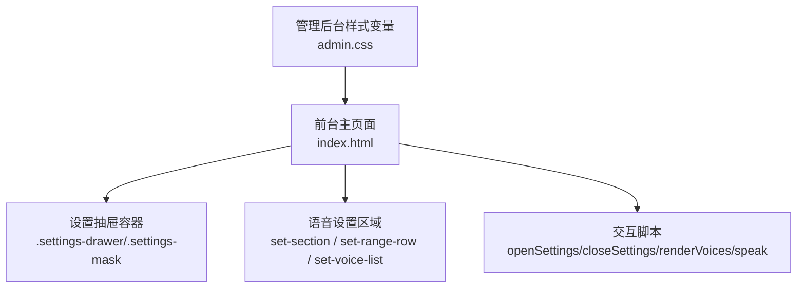
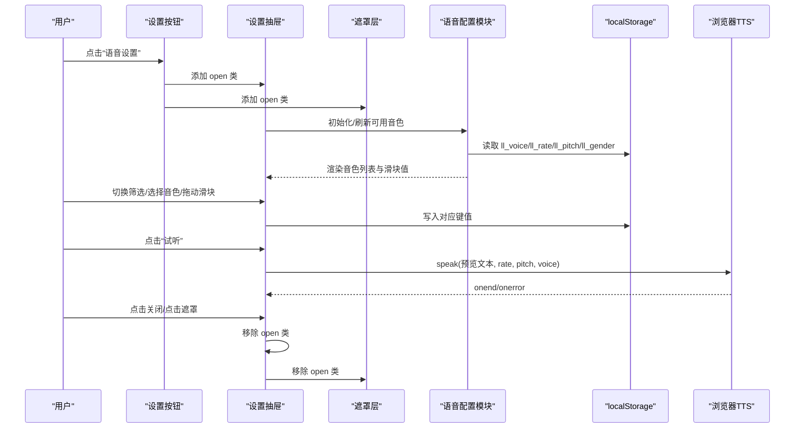
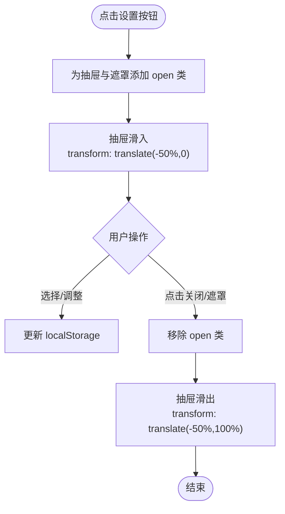
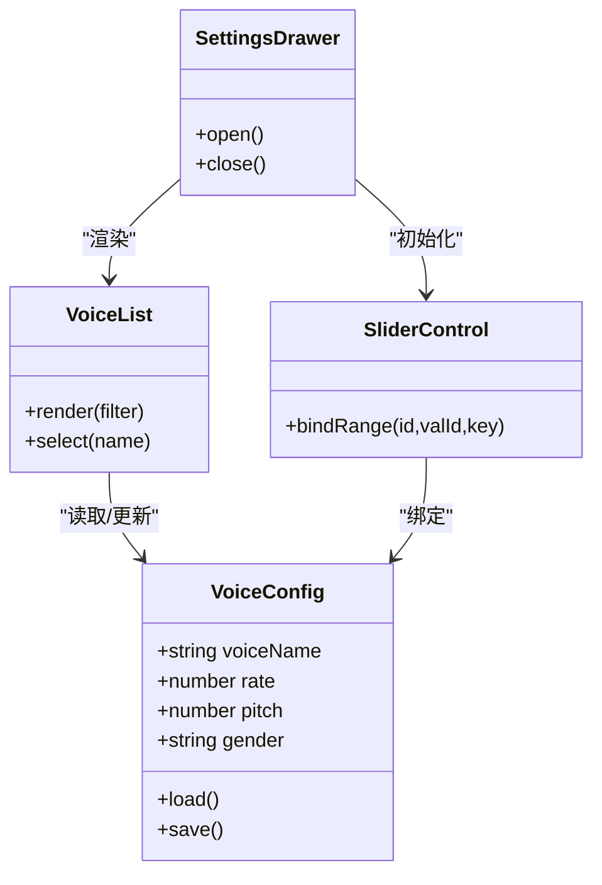
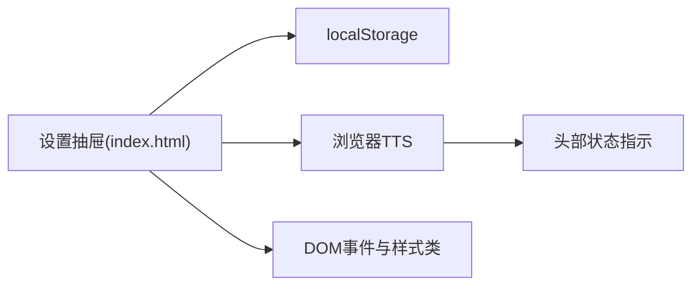

# 设置抽屉设计

<cite>
**本文引用的文件**   
- [index.html](file://hushai/meditation/static/index.html)
- [admin.css](file://hushai/meditation/admin/static/css/admin.css)
- [settings.html](file://hushai/meditation/admin/templates/settings.html)
</cite>

## 目录
1. [引言](#引言)
2. [项目结构](#项目结构)
3. [核心组件](#核心组件)
4. [架构总览](#架构总览)
5. [详细组件分析](#详细组件分析)
6. [依赖关系分析](#依赖关系分析)
7. [性能与可访问性](#性能与可访问性)
8. [故障排查指南](#故障排查指南)
9. [结论](#结论)
10. [附录：交互规范与样式约定](#附录：交互规范与样式约定)

## 引言
本设计文档聚焦于 hush.ai 前台“设置抽屉”的 UI/UX 实现，覆盖以下关键方面：
- 打开/关闭动画：滑入滑出过渡、遮罩层透明度变化
- 设置项组织结构：分组标题、选项标签与值显示的布局规范
- 滑块控件：范围调节、数值显示、拖拽交互
- 下拉选择器：自定义箭头图标、选项高亮效果
- 语音设置界面：音色列表展示、试听功能、选择状态管理
- 保存交互反馈与数据持久化机制（前端本地存储）

该文档面向产品、设计与前端工程师，既提供高层概览，也给出代码级映射与可视化图示。

## 项目结构
设置抽屉位于前台单页应用的主模板中，包含 HTML 结构、CSS 样式与内联脚本逻辑；同时参考管理后台的通用样式变量与组件风格，确保整体视觉一致性。

图表来源
- [index.html:544-665](file://hushai/meditation/static/index.html#L544-L665)
- [index.html:1050-1089](file://hushai/meditation/static/index.html#L1050-L1089)
- [admin.css:1-35](file://hushai/meditation/admin/static/css/admin.css#L1-L35)

章节来源
- [index.html:544-665](file://hushai/meditation/static/index.html#L544-L665)
- [index.html:1050-1089](file://hushai/meditation/static/index.html#L1050-L1089)
- [admin.css:1-35](file://hushai/meditation/admin/static/css/admin.css#L1-L35)

## 核心组件
- 遮罩层与抽屉容器
  - 遮罩层：固定定位全屏，控制 opacity 与 pointer-events 以启用/禁用背景交互
  - 抽屉容器：底部滑入，使用 transform 从底部上移，配合缓动曲线实现顺滑过渡
- 设置分组与标题
  - 使用统一的分组标签样式，小字号、大写、字母间距，形成清晰的层级
- 滑块控件
  - 原生 range 输入，统一轨道与拇指样式，右侧实时数值显示
- 下拉选择器
  - 自定义 SVG 箭头，去除默认外观，保持与主题一致的边框与焦点态
- 语音设置区
  - 性别/语言筛选按钮组
  - 音色列表项（名称 + 标签），点击选中并高亮
  - 试听按钮触发浏览器 TTS 朗读预览文本
- 数据持久化
  - 所有用户偏好通过 localStorage 读写，包括音色、语速、音调、性别筛选等

章节来源
- [index.html:544-665](file://hushai/meditation/static/index.html#L544-L665)
- [index.html:1050-1089](file://hushai/meditation/static/index.html#L1050-L1089)
- [index.html:1440-1555](file://hushai/meditation/static/index.html#L1440-L1555)

## 架构总览
设置抽屉的前端流程由事件驱动，主要涉及 DOM 操作、Web Speech API 调用与本地存储读写。

图表来源
- [index.html:1557-1563](file://hushai/meditation/static/index.html#L1557-L1563)
- [index.html:1440-1555](file://hushai/meditation/static/index.html#L1440-L1555)
- [index.html:1662-1692](file://hushai/meditation/static/index.html#L1662-L1692)

## 详细组件分析

### 抽屉打开/关闭动画
- 遮罩层
  - 使用 fixed 定位覆盖全屏，opacity 在 0 与可见之间过渡，pointer-events 控制是否拦截点击
- 抽屉容器
  - 初始 transform 为 translate(-50%, 100%)，即隐藏于视口底部
  - 打开时添加 open 类，transform 变为 translate(-50%, 0)，配合 ease-out-expo 曲线
- 关闭行为
  - 点击关闭按钮或遮罩层时移除 open 类，恢复隐藏状态

图表来源
- [index.html:544-559](file://hushai/meditation/static/index.html#L544-L559)
- [index.html:1557-1563](file://hushai/meditation/static/index.html#L1557-L1563)

章节来源
- [index.html:544-559](file://hushai/meditation/static/index.html#L544-L559)
- [index.html:1557-1563](file://hushai/meditation/static/index.html#L1557-L1563)

### 设置项组织结构
- 分组标题
  - 使用小字号、大写字母、宽字距的标签样式，明确分区
- 选项行
  - 每行包含标签与控件（下拉、滑块、单选列表等）
- 值显示
  - 滑块右侧实时数值显示，字体采用等宽体，便于对齐与阅读
- 按钮行
  - “恢复默认”和“试听”并列，主次按钮通过颜色区分

章节来源
- [index.html:579-632](file://hushai/meditation/static/index.html#L579-L632)
- [index.html:1058-1088](file://hushai/meditation/static/index.html#L1058-L1088)

### 滑块控件设计
- 范围调节
  - 语速与音调均使用 range 输入，步长 0.1，范围 0.5~2
- 数值显示
  - 每个滑块旁有等宽数字显示当前值，随 input 事件实时更新
- 拖拽交互
  - 自定义拇指样式，悬停放大，提升触控友好度
- 持久化
  - 每次 input 事件将新值写入 localStorage，保证刷新后仍生效

章节来源
- [index.html:597-616](file://hushai/meditation/static/index.html#L597-L616)
- [index.html:1523-1537](file://hushai/meditation/static/index.html#L1523-L1537)

### 下拉选择器样式定制
- 自定义箭头
  - 使用内嵌 SVG 作为背景箭头，替换浏览器默认外观
- 选项高亮
  - 通过 CSS 对 option 的背景与文字进行主题适配
- 焦点态
  - 聚焦时边框加深，符合无障碍要求

章节来源
- [index.html:585-595](file://hushai/meditation/static/index.html#L585-L595)

### 语音设置界面
- 音色列表展示
  - 根据性别/语言筛选动态过滤，无中文音色时提示并回退到全部
  - 每项显示名称与标签（女/男/EN/中），选中项高亮
- 试听功能
  - 点击“试听”调用浏览器 TTS，按当前 rate/pitch/voice 朗读预览文本
- 选择状态管理
  - 选中音色名写入 localStorage，下次打开自动恢复
  - 性别筛选与默认值同样持久化

图表来源
- [index.html:1440-1555](file://hushai/meditation/static/index.html#L1440-L1555)
- [index.html:1557-1563](file://hushai/meditation/static/index.html#L1557-L1563)

章节来源
- [index.html:1440-1555](file://hushai/meditation/static/index.html#L1440-L1555)
- [index.html:1557-1563](file://hushai/meditation/static/index.html#L1557-L1563)

### 保存交互反馈与数据持久化
- 即时反馈
  - 滑块拖动时立即更新数值显示与本地存储
  - 选择音色后立即高亮并持久化
- 持久化机制
  - 使用 localStorage 键 ll_voice、ll_rate、ll_pitch、ll_gender 保存用户偏好
  - 打开抽屉时优先从本地读取，再渲染界面
- 恢复默认
  - 点击“恢复默认”清空相关键并重置 UI 至默认值

章节来源
- [index.html:1523-1555](file://hushai/meditation/static/index.html#L1523-L1555)

## 依赖关系分析
- 外部依赖
  - Web Speech API（SpeechSynthesis/SpeechRecognition）用于语音输出与可选的语音输入
  - localStorage 用于本地持久化
- 内部依赖
  - 设置抽屉依赖全局 DOM 引用与事件绑定
  - 语音模块与消息区域的朗读状态联动（如头部状态指示）

图表来源
- [index.html:1662-1692](file://hushai/meditation/static/index.html#L1662-L1692)
- [index.html:1557-1563](file://hushai/meditation/static/index.html#L1557-L1563)

章节来源
- [index.html:1662-1692](file://hushai/meditation/static/index.html#L1662-L1692)
- [index.html:1557-1563](file://hushai/meditation/static/index.html#L1557-L1563)

## 性能与可访问性
- 性能
  - 使用 CSS transform 与 opacity 实现动画，避免重排重绘
  - 仅当抽屉打开时加载/刷新音色列表，减少不必要开销
- 可访问性
  - 提供 focus-visible 轮廓，确保键盘可达
  - 按钮与输入具备语义化属性与 aria-label
  - 尊重 prefers-reduced-motion，降低动画强度

章节来源
- [index.html:736-746](file://hushai/meditation/static/index.html#L736-L746)

## 故障排查指南
- 无法加载音色
  - 检查浏览器是否支持 SpeechSynthesis，确认设备已安装中文语音包
  - 若返回空列表，界面会提示并回退到全部音色
- 试听无声
  - 确认未处于静音模式，且未与其他音频冲突
  - 检查是否有其他正在播放的 TTS 任务导致中断
- 设置未保存
  - 确认浏览器允许 localStorage，且未开启隐私模式限制
  - 检查控制台是否存在跨域或安全策略报错

章节来源
- [index.html:1451-1503](file://hushai/meditation/static/index.html#L1451-L1503)
- [index.html:1662-1692](file://hushai/meditation/static/index.html#L1662-L1692)

## 结论
设置抽屉通过简洁的滑入动画与明确的分组布局，提供了直观的语音偏好配置体验。借助 Web Speech API 与 localStorage，实现了即时的试听反馈与可靠的本地持久化。整体实现遵循一致的设计系统，兼顾性能与可访问性，适合在移动端与桌面端良好运行。

## 附录：交互规范与样式约定
- 动画参数
  - 遮罩层过渡时长约 0.35s，抽屉过渡时长约 0.45s，使用 ease-out-expo 曲线
- 色彩与字体
  - 使用项目定义的主题色与衬线/等宽字体组合，保持沉稳、易读的冥想氛围
- 组件复用
  - 抽屉、遮罩、按钮、滑块等样式与管理后台保持一致，便于后续扩展与维护

章节来源
- [index.html:544-665](file://hushai/meditation/static/index.html#L544-L665)
- [admin.css:1-35](file://hushai/meditation/admin/static/css/admin.css#L1-L35)