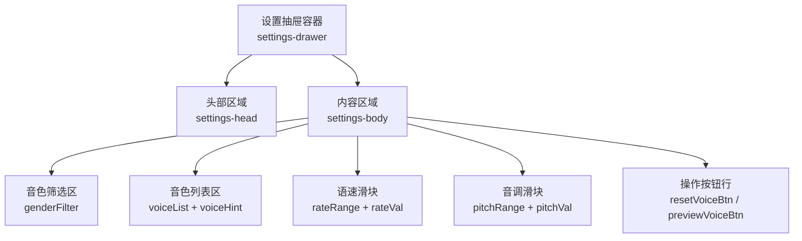
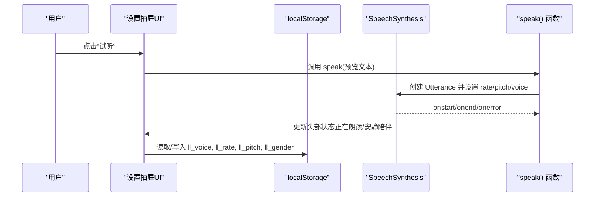
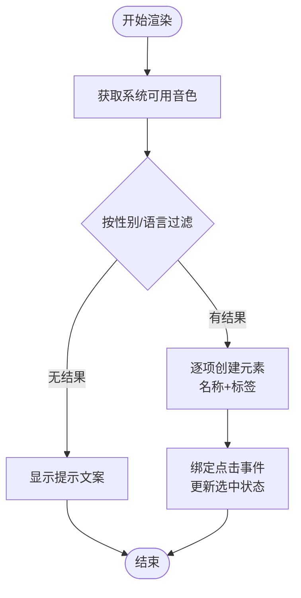
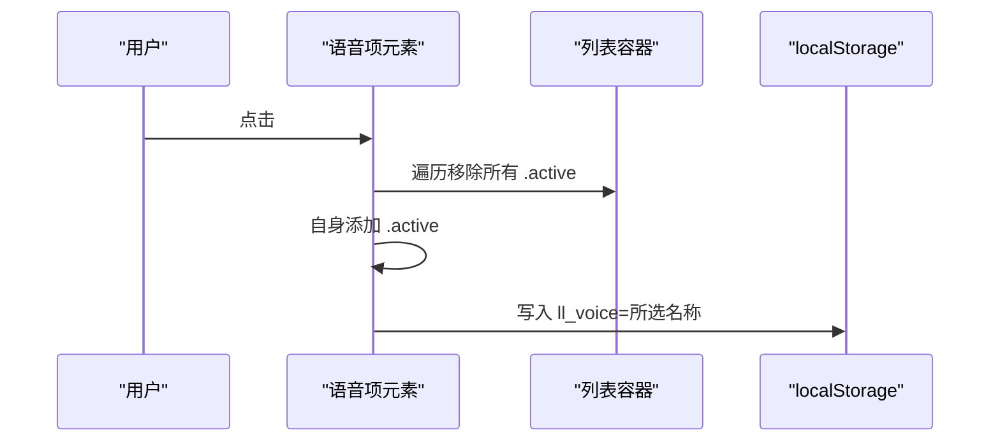
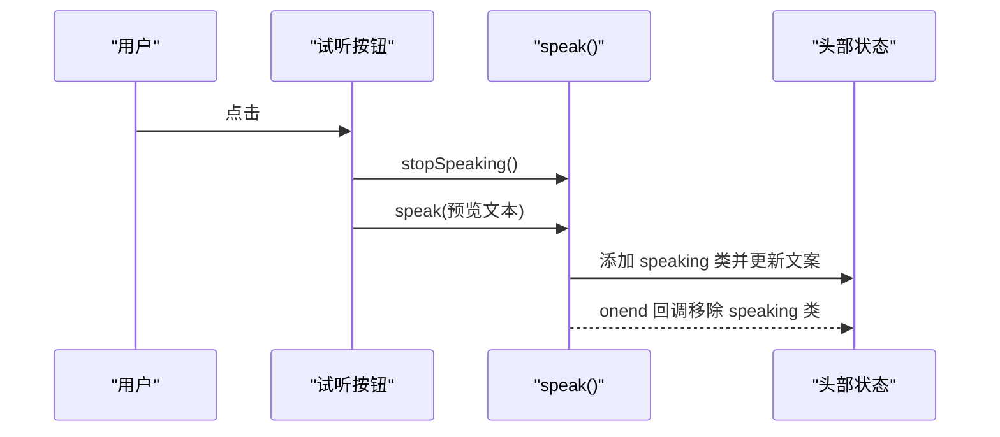
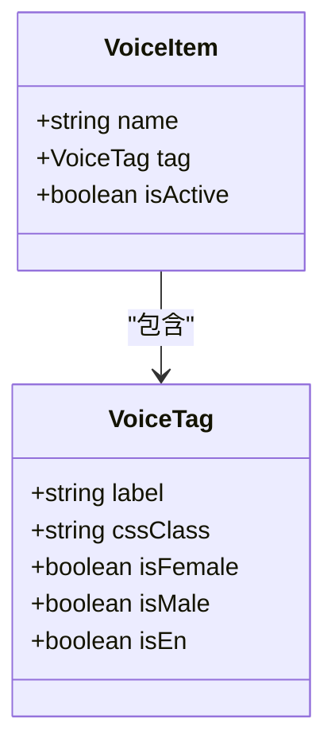
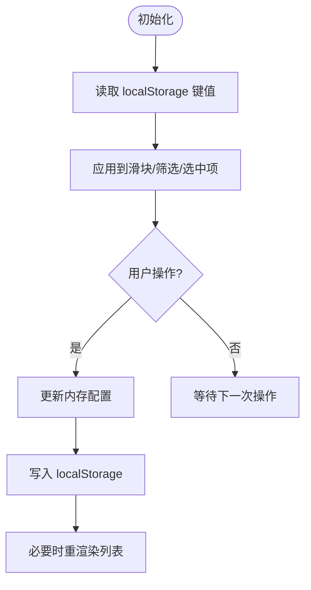
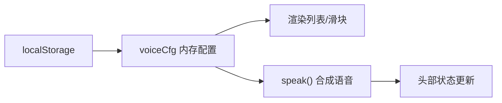

# 语音设置模块

<cite>
**本文引用的文件**
- [index.html](file://hushai/meditation/static/index.html)
- [models.py](file://hushai/meditation/db/models.py)
</cite>

## 目录
1. [简介](#简介)
2. [项目结构](#项目结构)
3. [核心组件](#核心组件)
4. [架构总览](#架构总览)
5. [详细组件分析](#详细组件分析)
6. [依赖关系分析](#依赖关系分析)
7. [性能与体验优化建议](#性能与体验优化建议)
8. [故障排查指南](#故障排查指南)
9. [结论](#结论)

## 简介
本文件为“设置抽屉中的语音配置”功能的UI组件文档，聚焦以下目标：
- 语音列表的展示结构（项布局、名称显示、标签样式）
- 语音选择交互（点击选中状态管理、active类应用）
- 试听功能（预览按钮、播放状态反馈）
- 分类标签设计规范（不同标签颜色方案与样式定制）
- 保存机制与数据持久化逻辑（localStorage键值约定）
- 验证规则与错误处理策略（边界情况与降级策略）

该功能基于浏览器原生 Web Speech API（SpeechSynthesis），通过前端本地存储实现用户偏好持久化，无需后端参与。

## 项目结构
语音设置相关代码集中在单页应用的静态页面中，包含HTML结构、CSS样式与JavaScript交互逻辑。关键位置如下：
- 设置抽屉容器与标题、关闭按钮
- 音色筛选区（全部/女声/男声/English）
- 音色列表渲染区域与提示文案
- 语速与音调滑块及实时数值显示
- 恢复默认与试听按钮
- 语音合成调用与状态更新

图表来源
- [index.html:1050-1089](file://hushai/meditation/static/index.html#L1050-L1089)

章节来源
- [index.html:1050-1089](file://hushai/meditation/static/index.html#L1050-L1089)

## 核心组件
- 设置抽屉（Settings Drawer）
  - 打开/关闭由遮罩层与抽屉容器的open类控制
  - 打开时触发加载可用音色
- 音色筛选（Gender Filter）
  - 支持全部/女声/男声/English四类
  - 切换后更新当前性别过滤并重新渲染列表
- 音色列表（Voice List）
  - 动态生成每一项，包含名称与标签
  - 点击项更新选中状态并持久化
- 参数调节（Rate/Pitch）
  - 滑块范围0.5~2，步长0.1
  - 输入事件即时更新配置并持久化
- 试听与恢复默认
  - 试听：停止当前播放并朗读固定预览文本
  - 恢复默认：重置所有配置到默认值并刷新界面

章节来源
- [index.html:1440-1563](file://hushai/meditation/static/index.html#L1440-L1563)
- [index.html:1050-1089](file://hushai/meditation/static/index.html#L1050-L1089)

## 架构总览
语音设置模块采用纯前端实现，数据流围绕浏览器本地存储与Web Speech API展开。

图表来源
- [index.html:1539-1555](file://hushai/meditation/static/index.html#L1539-L1555)
- [index.html:1661-1692](file://hushai/meditation/static/index.html#L1661-L1692)

## 详细组件分析

### 1) 语音列表展示结构
- 列表容器
  - 最大高度限制与滚动条隐藏，保证在抽屉内紧凑展示
- 列表项
  - 布局：左侧为名称，右侧为标签；整体可点击
  - 名称：使用正文字体，字号适中，颜色为深色
  - 标签：小字号、大写风格、带背景色；根据性别或语言显示“女/男/EN/中”
- 空态与提示
  - 当无中文音色时，回退显示全部音色并给出提示文案

图表来源
- [index.html:1471-1503](file://hushai/meditation/static/index.html#L1471-L1503)

章节来源
- [index.html:634-664](file://hushai/meditation/static/index.html#L634-L664)
- [index.html:1471-1503](file://hushai/meditation/static/index.html#L1471-L1503)

### 2) 语音选择交互与选中状态
- 选中状态管理
  - 点击某一项时，移除其他项的active类，给当前项添加active类
  - 同步更新内存配置对象并写入localStorage
- active类样式
  - 边框加深、背景微暖色调；标签反色显示以突出选中

图表来源
- [index.html:1495-1502](file://hushai/meditation/static/index.html#L1495-L1502)

章节来源
- [index.html:1495-1502](file://hushai/meditation/static/index.html#L1495-L1502)

### 3) 试听功能与播放状态反馈
- 预览按钮
  - 点击后先停止当前播放，再朗读固定预览文本
- 播放状态反馈
  - 头部状态点与文字变化：正在朗读/安静陪伴
  - 消息气泡内的朗读按钮也会联动状态（同页面其他区域）

图表来源
- [index.html:1539-1543](file://hushai/meditation/static/index.html#L1539-L1543)
- [index.html:1678-1692](file://hushai/meditation/static/index.html#L1678-L1692)

章节来源
- [index.html:1539-1543](file://hushai/meditation/static/index.html#L1539-L1543)
- [index.html:1661-1692](file://hushai/meditation/static/index.html#L1661-L1692)

### 4) 语音分类标签设计规范
- 标签类型与含义
  - 女：女性中文音色
  - 男：男性中文音色
  - EN：非中文（英文等）音色
  - 中：中文但无法识别性别的音色
- 颜色方案与样式
  - 未选中：浅灰背景、深灰文字
  - 选中项：标签反色（深色背景、浅色文字）
  - 特殊标签：女/男/EN分别对应不同语义，便于快速识别
- 扩展建议
  - 如需新增语言或音色类别，可在渲染逻辑中增加判断分支与对应样式类

图表来源
- [index.html:1491-1494](file://hushai/meditation/static/index.html#L1491-L1494)
- [index.html:642-646](file://hushai/meditation/static/index.html#L642-L646)

章节来源
- [index.html:1491-1494](file://hushai/meditation/static/index.html#L1491-L1494)
- [index.html:642-646](file://hushai/meditation/static/index.html#L642-L646)

### 5) 保存机制与数据持久化逻辑
- 持久化键名约定
  - ll_voice：选中的语音名称
  - ll_rate：语速（浮点数）
  - ll_pitch：音调（浮点数）
  - ll_gender：性别/语言筛选（all/female/male/en）
- 写入时机
  - 选择语音项、调整滑块、切换筛选、恢复默认时写入
- 读取时机
  - 初始化时从localStorage读取并填充UI控件

图表来源
- [index.html:1442-1449](file://hushai/meditation/static/index.html#L1442-L1449)
- [index.html:1505-1537](file://hushai/meditation/static/index.html#L1505-L1537)
- [index.html:1546-1555](file://hushai/meditation/static/index.html#L1546-L1555)

章节来源
- [index.html:1442-1449](file://hushai/meditation/static/index.html#L1442-L1449)
- [index.html:1505-1537](file://hushai/meditation/static/index.html#L1505-L1537)
- [index.html:1546-1555](file://hushai/meditation/static/index.html#L1546-L1555)

### 6) 验证规则与错误处理策略
- 输入范围校验
  - 语速与音调滑块最小值0.5、最大值2、步长0.1，由input属性约束
- 设备能力检测
  - 若不支持SpeechSynthesis，则不加载语音列表与试听功能
- 无中文音色降级
  - 当筛选结果为空时，回退显示全部音色并提示
- 播放异常处理
  - onerror回调统一走停止流程，避免状态不一致
- 恢复默认
  - 清空相关localStorage键，重置UI至默认值

章节来源
- [index.html:1451-1459](file://hushai/meditation/static/index.html#L1451-L1459)
- [index.html:1481-1487](file://hushai/meditation/static/index.html#L1481-L1487)
- [index.html:1687-1692](file://hushai/meditation/static/index.html#L1687-L1692)
- [index.html:1546-1555](file://hushai/meditation/static/index.html#L1546-L1555)

## 依赖关系分析
- 外部API
  - Web Speech API：SpeechSynthesis（获取音色、合成语音）
- 本地存储
  - localStorage：持久化用户偏好
- 内部耦合
  - 设置抽屉与音色列表、滑块、按钮之间的DOM操作与事件绑定
  - 全局speak()/stopSpeaking()与头部状态联动

图表来源
- [index.html:1440-1449](file://hushai/meditation/static/index.html#L1440-L1449)
- [index.html:1661-1692](file://hushai/meditation/static/index.html#L1661-L1692)

章节来源
- [index.html:1440-1449](file://hushai/meditation/static/index.html#L1440-L1449)
- [index.html:1661-1692](file://hushai/meditation/static/index.html#L1661-L1692)

## 性能与体验优化建议
- 列表渲染优化
  - 对大量音色场景可采用虚拟滚动或分页加载，减少DOM节点数量
- 事件节流
  - 滑块input事件可考虑节流，降低频繁写入localStorage的频率
- 资源加载
  - 仅在打开设置抽屉时加载音色列表，避免首屏阻塞
- 无障碍与动效
  - 尊重prefers-reduced-motion，提供键盘可达性与焦点可见性

[本节为通用建议，不涉及具体文件分析]

## 故障排查指南
- 无法加载音色
  - 检查浏览器是否支持SpeechSynthesis；确认onvoiceschanged回调是否触发
- 试听无声
  - 确认已选择有效voiceName；检查是否有其他音频占用导致中断
- 配置未生效
  - 核对localStorage键名是否正确；清除缓存后重试
- 筛选无结果
  - 设备可能缺少中文音色，查看提示文案并回退显示全部

章节来源
- [index.html:1451-1459](file://hushai/meditation/static/index.html#L1451-L1459)
- [index.html:1481-1487](file://hushai/meditation/static/index.html#L1481-L1487)
- [index.html:1687-1692](file://hushai/meditation/static/index.html#L1687-L1692)

## 结论
语音设置模块以简洁的前端实现提供了完整的音色选择、参数调节与试听体验。通过localStorage实现用户偏好持久化，结合Web Speech API完成语音合成。模块具备良好的可扩展性与降级策略，适合在冥想陪伴场景中提供个性化语音体验。