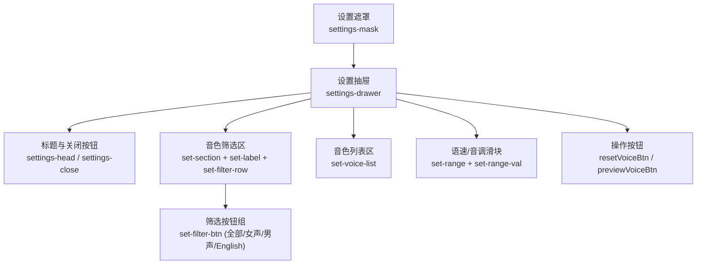
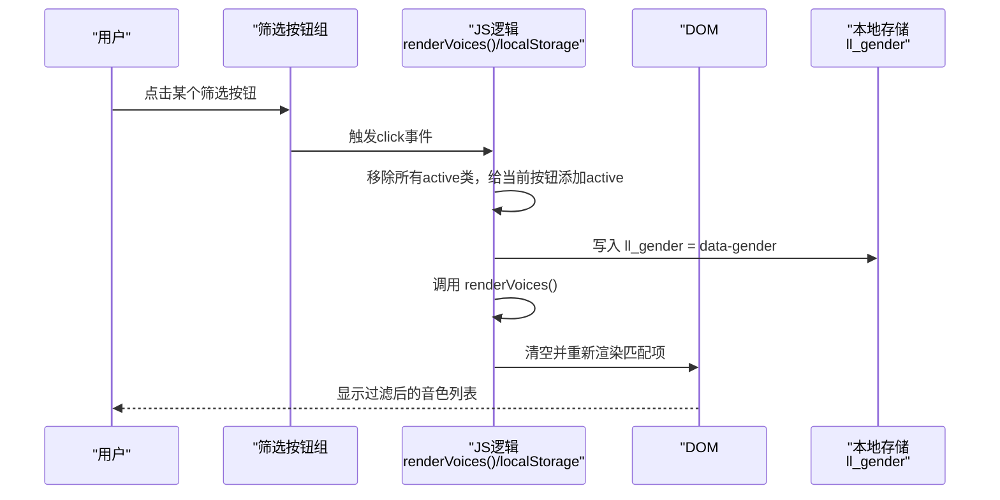
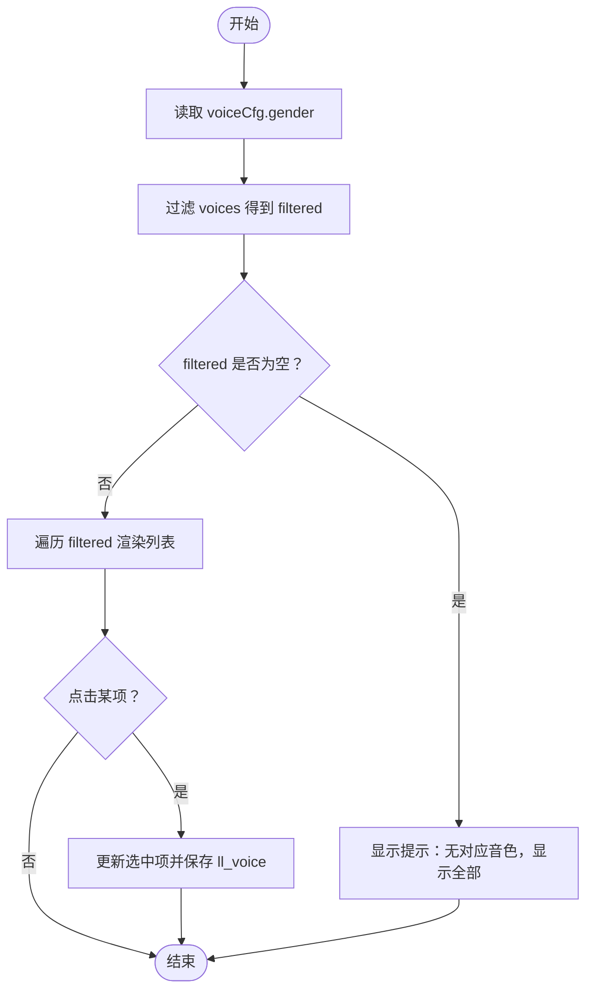
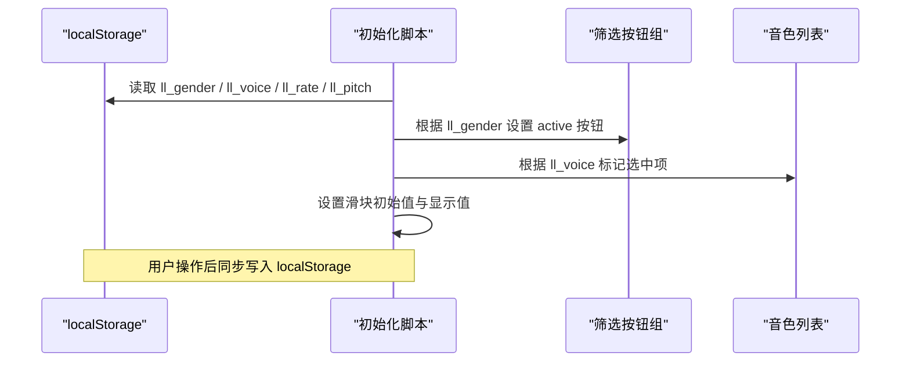
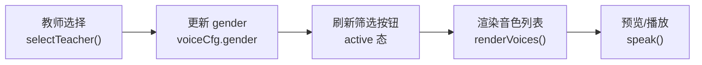
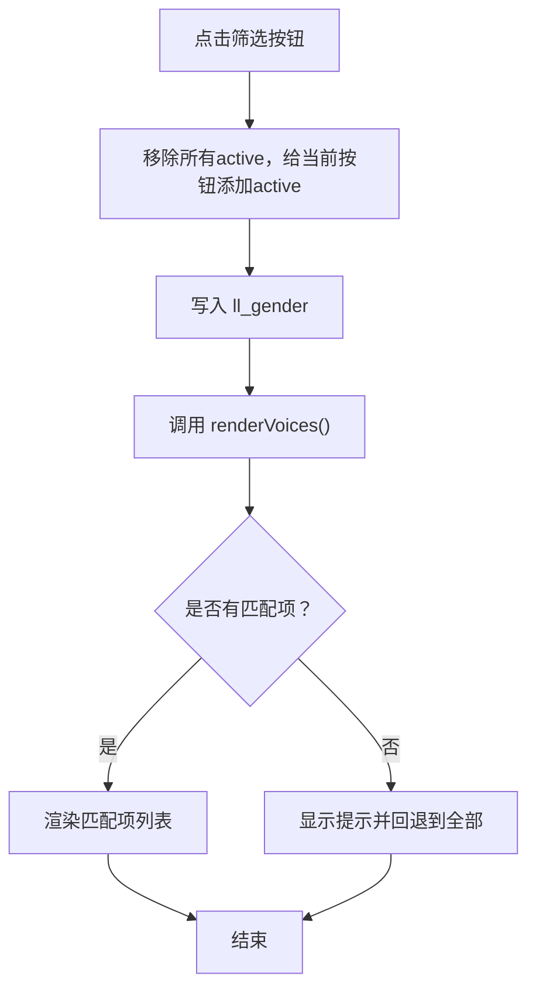

# 过滤器控件

<cite>
**本文引用的文件**   
- [index.html](file://hushai/meditation/static/index.html)
</cite>

## 目录
1. [简介](#简介)
2. [项目结构](#项目结构)
3. [核心组件](#核心组件)
4. [架构总览](#架构总览)
5. [详细组件分析](#详细组件分析)
6. [依赖关系分析](#依赖关系分析)
7. [性能考量](#性能考量)
8. [故障排查指南](#故障排查指南)
9. [结论](#结论)
10. [附录](#附录)

## 简介
本文件围绕“设置抽屉中的过滤器控件”进行交互设计说明，聚焦以下目标：
- 按钮组布局与换行（flex + flex-wrap）
- 激活状态管理（active类切换、视觉反馈）
- 选项动态更新（数据绑定与DOM操作）
- 样式定制方案（边框、背景、文字颜色）
- 响应式设计与触摸友好尺寸
- 本地存储与状态恢复

## 项目结构
该功能位于前端单页应用的主界面文件中，包含HTML结构、CSS样式与JavaScript逻辑。关键位置如下：
- 设置抽屉容器与头部、关闭按钮
- 音色筛选按钮组（性别/语言过滤）
- 音色列表渲染区域
- 语速/音调滑块与预览/重置按钮
- 打开/关闭抽屉的遮罩与事件绑定

图表来源
- [index.html:1050-1089](file://hushai/meditation/static/index.html#L1050-L1089)
- [index.html:654-661](file://hushai/meditation/static/index.html#L654-L661)

章节来源
- [index.html:1050-1089](file://hushai/meditation/static/index.html#L1050-L1089)
- [index.html:654-661](file://hushai/meditation/static/index.html#L654-L661)

## 核心组件
- 筛选按钮组：用于按性别或语言过滤可用音色
- 音色列表：根据当前筛选条件动态渲染
- 语音参数控制：语速、音调滑块，实时持久化
- 预览与重置：试听当前配置；一键恢复默认值
- 抽屉开关：遮罩+抽屉滑入/滑出动画

章节来源
- [index.html:1050-1089](file://hushai/meditation/static/index.html#L1050-L1089)
- [index.html:1505-1521](file://hushai/meditation/static/index.html#L1505-L1521)
- [index.html:1523-1555](file://hushai/meditation/static/index.html#L1523-L1555)

## 架构总览
下图展示从用户点击到视图更新的完整流程，包括状态变更、本地存储与DOM重绘。

图表来源
- [index.html:1505-1521](file://hushai/meditation/static/index.html#L1505-L1521)
- [index.html:1471-1503](file://hushai/meditation/static/index.html#L1471-L1503)

## 详细组件分析

### 1. 布局结构与换行处理
- 容器使用flex布局，gap控制间距，flex-wrap实现自动换行，确保在小屏设备下多按钮可自然折行。
- 按钮采用等宽内边距与紧凑字号，保证信息密度与可读性平衡。

相关样式要点
- 容器：display:flex; gap:6px; margin-bottom:12px; flex-wrap:wrap
- 按钮：padding:5px 12px; font-size:10px; transition:all .25s var(--ease-out-quart)

章节来源
- [index.html:654-661](file://hushai/meditation/static/index.html#L654-L661)

### 2. 激活状态管理与视觉反馈
- 点击时先清除所有按钮的active类，再为当前按钮添加active类，形成单选效果。
- active状态下背景变为深色、文字变亮，提供清晰对比与即时反馈。
- 支持键盘焦点可见性（focus-visible），提升无障碍体验。

交互细节
- 切换逻辑：遍历所有按钮移除active，再为被点击按钮添加active
- 视觉变化：hover时边框加深；active时反色填充
- 焦点样式：统一的outline提示

章节来源
- [index.html:1505-1521](file://hushai/meditation/static/index.html#L1505-L1521)
- [index.html:654-661](file://hushai/meditation/static/index.html#L654-L661)
- [index.html:736-739](file://hushai/meditation/static/index.html#L736-L739)

### 3. 选项的动态更新机制（数据绑定与DOM操作）
- 数据源：浏览器内置语音合成API提供的voices列表
- 过滤规则：
  - “全部”：仅中文语音
  - “女声/男声”：中文且性别匹配
  - “English”：非中文语音
- 渲染流程：
  - 读取当前gender
  - 过滤voices得到filtered集合
  - 若为空则回退到全部并给出提示
  - 逐项创建节点，附加选中态与标签（女/男/EN/中）
  - 点击某一项时更新选中项并持久化voiceName

图表来源
- [index.html:1471-1503](file://hushai/meditation/static/index.html#L1471-L1503)
- [index.html:1495-1500](file://hushai/meditation/static/index.html#L1495-L1500)

章节来源
- [index.html:1471-1503](file://hushai/meditation/static/index.html#L1471-L1503)
- [index.html:1495-1500](file://hushai/meditation/static/index.html#L1495-L1500)

### 4. 样式定制方案（边框、背景、文字颜色）
- 默认态：浅灰边框、浅色文字
- Hover态：边框加深、文字略深
- Active态：反色填充（深色背景、浅色文字）
- 可通过CSS变量统一调整主题色，便于品牌化定制

建议定制点
- 修改 --ink 与 --paper 以整体改变主色与背景
- 调整 --stone-200/--stone-400 控制边框与次要文本色阶
- 在 .set-filter-btn.active 中替换背景与前景色以实现自定义高亮

章节来源
- [index.html:654-661](file://hushai/meditation/static/index.html#L654-L661)
- [index.html:24-45](file://hushai/meditation/static/index.html#L24-L45)

### 5. 响应式设计与触摸友好
- 容器使用flex-wrap，小屏自动换行，避免溢出
- 按钮尺寸适中，适合手指点击；配合transition提供平滑反馈
- 全局meta viewport限制缩放，保障移动端一致性
- 减少动效偏好：prefers-reduced-motion 禁用不必要动画

适配策略
- 小屏优先：通过flex-wrap与合理gap保持触控热区
- 字体与间距：在小屏上保持可读性与易触达性
- 动效降级：尊重系统级减少动效设置

章节来源
- [index.html:4-5](file://hushai/meditation/static/index.html#L4-L5)
- [index.html:654-661](file://hushai/meditation/static/index.html#L654-L661)
- [index.html:741-746](file://hushai/meditation/static/index.html#L741-L746)

### 6. 本地存储与状态恢复
- 持久化键：
  - ll_gender：当前筛选条件
  - ll_voice：选中的音色名称
  - ll_rate：语速
  - ll_pitch：音调
- 初始化逻辑：
  - 页面加载时从localStorage读取配置
  - 若存在非默认gender，则同步更新按钮active态
  - 滑块初始值与显示值与持久化值一致
- 重置逻辑：
  - 清空相关键，恢复默认值，并刷新视图

图表来源
- [index.html:1442-1447](file://hushai/meditation/static/index.html#L1442-L1447)
- [index.html:1516-1521](file://hushai/meditation/static/index.html#L1516-L1521)
- [index.html:1523-1537](file://hushai/meditation/static/index.html#L1523-L1537)
- [index.html:1546-1555](file://hushai/meditation/static/index.html#L1546-L1555)

章节来源
- [index.html:1442-1447](file://hushai/meditation/static/index.html#L1442-L1447)
- [index.html:1516-1521](file://hushai/meditation/static/index.html#L1516-L1521)
- [index.html:1523-1537](file://hushai/meditation/static/index.html#L1523-L1537)
- [index.html:1546-1555](file://hushai/meditation/static/index.html#L1546-L1555)

## 依赖关系分析
- 外部依赖：Web Speech API（speechSynthesis.getVoices/onvoiceschanged）
- 内部依赖：
  - 教师选择联动：当选择教师时，可能同步更新 gender 并刷新筛选与列表
  - 预览与播放：基于已选voiceName与rate/pitch生成语音
- 状态耦合：
  - gender 影响渲染结果
  - voiceName/rate/pitch 影响实际播放效果

图表来源
- [index.html:1410-1434](file://hushai/meditation/static/index.html#L1410-L1434)
- [index.html:1505-1521](file://hushai/meditation/static/index.html#L1505-L1521)
- [index.html:1471-1503](file://hushai/meditation/static/index.html#L1471-L1503)

章节来源
- [index.html:1410-1434](file://hushai/meditation/static/index.html#L1410-L1434)
- [index.html:1505-1521](file://hushai/meditation/static/index.html#L1505-L1521)
- [index.html:1471-1503](file://hushai/meditation/static/index.html#L1471-L1503)

## 性能考量
- 渲染优化：仅在必要时清空并重建列表，避免频繁全量重排
- 事件委托：当前为逐个监听，若未来扩展更多筛选维度，可考虑事件委托降低内存占用
- 动画与过渡：使用CSS transition，GPU加速属性（transform/opacity）为主，减少重排
- 本地存储：读写频率低，对性能影响可忽略

[本节为通用指导，不直接分析具体文件]

## 故障排查指南
- 无中文音色提示：当设备不支持中文语音时，会回退显示全部并提示。检查浏览器是否支持SpeechSynthesis及voices数量。
- 筛选无效：确认ll_gender是否正确写入；检查filter逻辑分支是否与data-gender一致。
- 选中态不同步：初始化阶段需根据ll_gender设置active；教师选择联动时需同步更新按钮与列表。
- 预览无声：确认已选择voiceName或回退到首个中文语音；检查rate/pitch是否在有效范围。

章节来源
- [index.html:1471-1503](file://hushai/meditation/static/index.html#L1471-L1503)
- [index.html:1516-1521](file://hushai/meditation/static/index.html#L1516-L1521)
- [index.html:1540-1543](file://hushai/meditation/static/index.html#L1540-L1543)

## 结论
该过滤器控件以简洁的flex布局与active类驱动的状态管理为核心，结合本地存储实现了良好的用户体验与可恢复性。通过清晰的视觉反馈与响应式适配，能够在多设备上稳定工作。后续可扩展更多筛选维度（如语种、情感风格等），并保持现有数据流与样式体系的一致性。

[本节为总结，不直接分析具体文件]

## 附录

### 关键交互流程图（代码映射）

图表来源
- [index.html:1505-1521](file://hushai/meditation/static/index.html#L1505-L1521)
- [index.html:1471-1503](file://hushai/meditation/static/index.html#L1471-L1503)