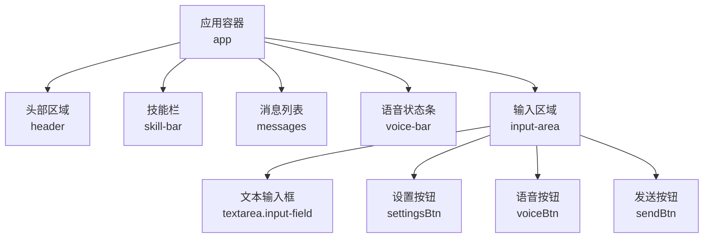
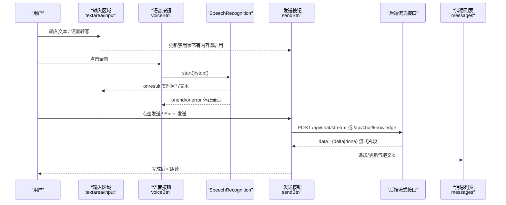
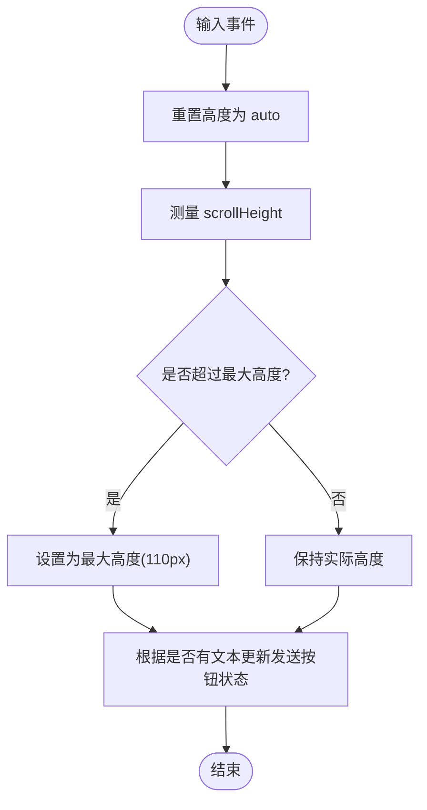
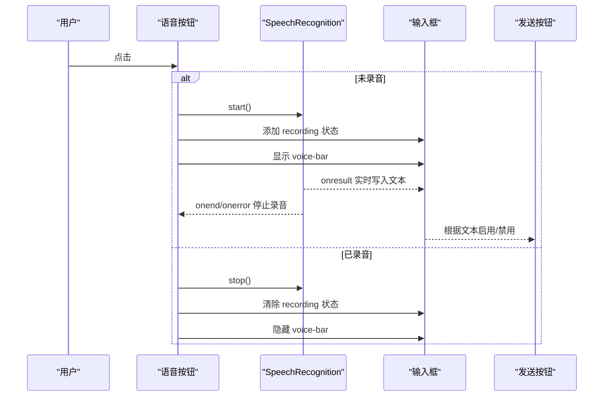
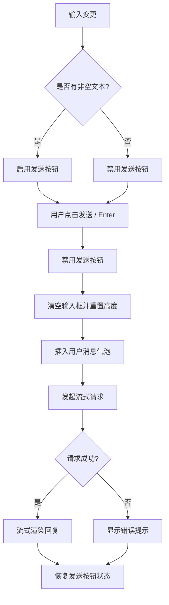
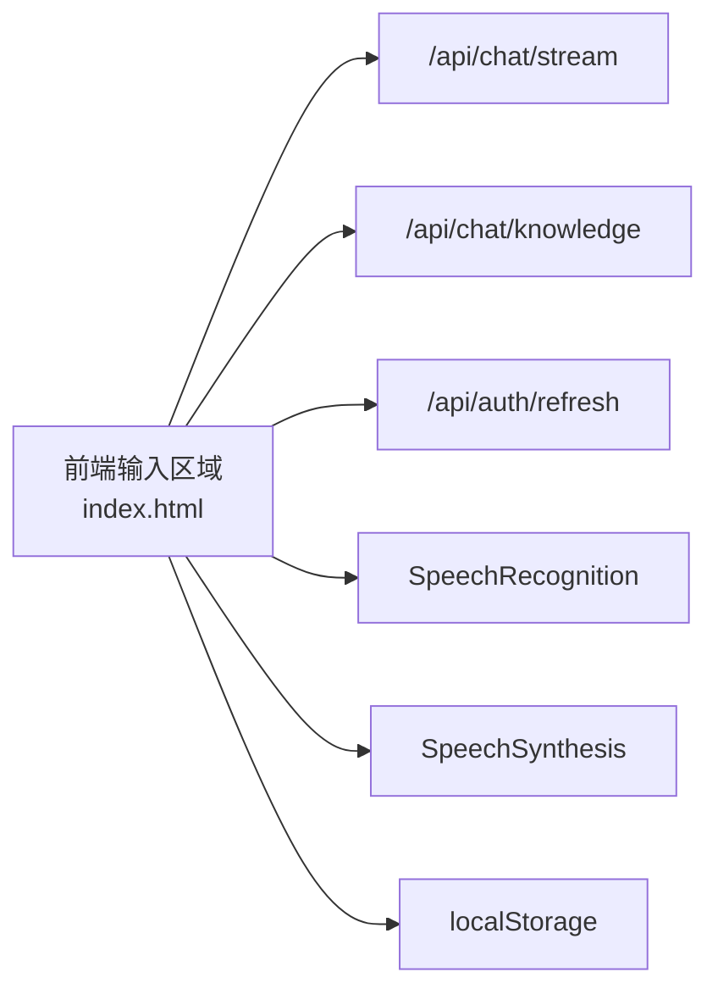

# 输入区域设计

<cite>
**本文引用的文件**   
- [index.html](file://hushai/meditation/static/index.html)
</cite>

## 目录
1. [引言](#引言)
2. [项目结构](#项目结构)
3. [核心组件](#核心组件)
4. [架构总览](#架构总览)
5. [详细组件分析](#详细组件分析)
6. [依赖分析](#依赖分析)
7. [性能考量](#性能考量)
8. [故障排查指南](#故障排查指南)
9. [结论](#结论)
10. [附录](#附录)

## 引言
本设计文档聚焦 hush.ai 的输入区域，围绕文本输入框、语音输入、发送按钮、多行文本体验、响应式与移动端适配、焦点管理与无障碍访问等维度，提供可落地的 UI/UX 规范与交互说明。内容基于仓库中的前端实现进行梳理与提炼，确保与设计现状一致并可指导后续优化。

## 项目结构
输入区域位于主页面 index.html 中，包含以下关键元素：
- 消息列表容器（用于承载对话气泡）
- 语音状态提示条（录音时显示“正在聆听…”）
- 输入区（textarea + 设置按钮 + 语音按钮 + 发送按钮）
- 相关样式与脚本逻辑均内联在 index.html 中

图表来源
- [index.html:1021-1035](file://hushai/meditation/static/index.html#L1021-L1035)
- [index.html:1018-1020](file://hushai/meditation/static/index.html#L1018-L1020)
- [index.html:1010-1016](file://hushai/meditation/static/index.html#L1010-L1016)

章节来源
- [index.html:1010-1035](file://hushai/meditation/static/index.html#L1010-L1035)

## 核心组件
- 文本输入框 textarea
  - 自适应高度：通过监听 input 事件动态计算 scrollHeight，限制最大高度为 110px，最小高度由 CSS 控制
  - 字符限制：当前未在前端对聊天输入做显式 maxlength 限制
  - 输入验证：仅做空白校验；发送前 trim() 判断是否为空
- 语音输入按钮
  - 使用浏览器 SpeechRecognition API（如可用），支持中文识别与中间结果回写
  - 点击切换录音状态，顶部 voice-bar 显示“正在聆听…”
  - 录音结束或错误时停止并清理状态；若已有文本则自动触发发送
- 发送按钮
  - 初始禁用，当输入框存在非空文本时启用
  - 发送过程中禁用，防止重复提交
  - 支持 Enter 键发送（Shift+Enter 换行）
- 多行文本体验
  - 自动换行：textarea 默认行为
  - 光标定位：语音识别回填后保持自然光标位置；发送后清空并重置高度
  - 键盘导航：Enter 发送，Shift+Enter 换行
- 响应式与移动端适配
  - 使用 env(safe-area-inset-bottom,0px) 适配刘海屏底部安全区
  - 输入区 padding 随安全区调整，避免被系统键盘遮挡
- 焦点管理与无障碍
  - 输入框具备 aria-label
  - 全局 :focus-visible 高亮，提升键盘可达性
  - 语音状态条与消息区域使用 aria-live 提示变化

章节来源
- [index.html:513-523](file://hushai/meditation/static/index.html#L513-L523)
- [index.html:525-539](file://hushai/meditation/static/index.html#L525-L539)
- [index.html:1021-1035](file://hushai/meditation/static/index.html#L1021-L1035)
- [index.html:1639-1659](file://hushai/meditation/static/index.html#L1639-L1659)
- [index.html:1795-1803](file://hushai/meditation/static/index.html#L1795-L1803)
- [index.html:1796-1797](file://hushai/meditation/static/index.html#L1796-L1797)
- [index.html:1018-1020](file://hushai/meditation/static/index.html#L1018-L1020)
- [index.html:1011](file://hushai/meditation/static/index.html#L1011)
- [index.html:736-739](file://hushai/meditation/static/index.html#L736-L739)

## 架构总览
输入区域与后端流式接口协作，形成“输入—发送—流式渲染—朗读”的闭环。

图表来源
- [index.html:1639-1659](file://hushai/meditation/static/index.html#L1639-L1659)
- [index.html:1795-1803](file://hushai/meditation/static/index.html#L1795-L1803)
- [index.html:1796-1797](file://hushai/meditation/static/index.html#L1796-L1797)
- [index.html:1799-1891](file://hushai/meditation/static/index.html#L1799-L1891)

## 详细组件分析

### 文本输入框（textarea）
- 自适应高度
  - 监听 input 事件，将 height 设为 auto 后再设置为 Math.min(scrollHeight, 110)，保证不超过最大高度
  - 最小高度由 CSS min-height 控制，视觉稳定
- 字符限制
  - 当前未设置 maxlength，建议根据业务需求增加上限并在输入时给出计数反馈
- 输入验证
  - 发送前执行 trim() 判空；为空时发送按钮禁用
- 多行文本体验
  - 自动换行由原生 textarea 提供
  - 光标定位：语音识别回填后不强制移动光标，保持编辑连续性
  - 键盘导航：Enter 发送，Shift+Enter 换行
- 焦点管理
  - 输入框具备 aria-label，便于读屏器识别
  - 发送完成后不清除焦点，保持连续输入体验

图表来源
- [index.html:1565-1570](file://hushai/meditation/static/index.html#L1565-L1570)
- [index.html:513-523](file://hushai/meditation/static/index.html#L513-L523)
- [index.html:1795-1803](file://hushai/meditation/static/index.html#L1795-L1803)

章节来源
- [index.html:513-523](file://hushai/meditation/static/index.html#L513-L523)
- [index.html:1565-1570](file://hushai/meditation/static/index.html#L1565-L1570)
- [index.html:1795-1803](file://hushai/meditation/static/index.html#L1795-L1803)

### 语音输入功能
- 界面与状态
  - 语音按钮点击切换录音状态，添加 recording 类以改变边框与背景色
  - 顶部 voice-bar 显示“正在聆听…”，录音结束时移除
- 录音时长显示
  - 当前未实现计时显示，建议在 voice-bar 中展示 mm:ss 格式
- 取消录音操作
  - 再次点击语音按钮调用 stop() 停止录音，并清理状态
- 识别结果处理
  - 使用 interimResults=true 实时回写文本到输入框，并同步更新发送按钮状态
  - onend 时若存在文本则自动发送

图表来源
- [index.html:1639-1659](file://hushai/meditation/static/index.html#L1639-L1659)
- [index.html:1018-1020](file://hushai/meditation/static/index.html#L1018-L1020)
- [index.html:525-539](file://hushai/meditation/static/index.html#L525-L539)

章节来源
- [index.html:1639-1659](file://hushai/meditation/static/index.html#L1639-L1659)
- [index.html:1018-1020](file://hushai/meditation/static/index.html#L1018-L1020)
- [index.html:525-539](file://hushai/meditation/static/index.html#L525-L539)

### 发送按钮交互逻辑
- 禁用状态
  - 初始 disabled；当输入框存在非空文本时启用
  - 发送进行中 disabled，结束后恢复
- 悬停效果
  - 普通态 hover 加深边框与颜色
  - 发送态 hover 加深背景
- 点击反馈
  - 立即禁用，清空输入框并重置高度，插入用户消息气泡，发起流式请求
- 键盘支持
  - Enter 发送，Shift+Enter 换行

图表来源
- [index.html:1795-1803](file://hushai/meditation/static/index.html#L1795-L1803)
- [index.html:1796-1797](file://hushai/meditation/static/index.html#L1796-L1797)
- [index.html:1799-1891](file://hushai/meditation/static/index.html#L1799-L1891)
- [index.html:525-539](file://hushai/meditation/static/index.html#L525-L539)

章节来源
- [index.html:1795-1803](file://hushai/meditation/static/index.html#L1795-L1803)
- [index.html:1796-1797](file://hushai/meditation/static/index.html#L1796-L1797)
- [index.html:1799-1891](file://hushai/meditation/static/index.html#L1799-L1891)
- [index.html:525-539](file://hushai/meditation/static/index.html#L525-L539)

### 多行文本输入的优化体验
- 自动换行：textarea 原生支持
- 光标定位：语音识别回填后不强制移动光标，保持编辑连续性
- 键盘导航：Enter 发送，Shift+Enter 换行
- 滚动与可视性：发送后清空并重置高度，保持输入区可见

章节来源
- [index.html:1795-1803](file://hushai/meditation/static/index.html#L1795-L1803)
- [index.html:1796-1797](file://hushai/meditation/static/index.html#L1796-L1797)
- [index.html:1639-1659](file://hushai/meditation/static/index.html#L1639-L1659)

### 响应式设计与移动端适配
- 安全区适配：使用 env(safe-area-inset-bottom,0px) 作为底部内边距，避免被系统键盘或手势条遮挡
- 布局约束：输入区宽度与容器一致，在小屏下无侧边距
- 字体与触控：按钮尺寸满足手指触控目标大小

章节来源
- [index.html:504-508](file://hushai/meditation/static/index.html#L504-L508)
- [index.html:525-539](file://hushai/meditation/static/index.html#L525-L539)

### 焦点管理与无障碍访问支持
- 语义化标签：输入框具备 aria-label
- 焦点可见性：全局 :focus-visible 定义，键盘导航清晰
- 动态内容提示：消息区域使用 aria-live 提示新增内容
- 动画降级：prefers-reduced-motion 下关闭不必要动画

章节来源
- [index.html:1024](file://hushai/meditation/static/index.html#L1024)
- [index.html:736-739](file://hushai/meditation/static/index.html#L736-L739)
- [index.html:1011](file://hushai/meditation/static/index.html#L1011)
- [index.html:741-746](file://hushai/meditation/static/index.html#L741-L746)

## 依赖分析
- 外部 API
  - 流式接口：/api/chat/stream 或 /api/chat/knowledge
  - 认证刷新：/api/auth/refresh
- 浏览器能力
  - SpeechRecognition（可选）：用于语音转文字
  - SpeechSynthesis：用于朗读回复
- 本地存储
  - token、conversation_id、昵称等持久化

图表来源
- [index.html:1799-1891](file://hushai/meditation/static/index.html#L1799-L1891)
- [index.html:1611-1630](file://hushai/meditation/static/index.html#L1611-L1630)
- [index.html:1639-1659](file://hushai/meditation/static/index.html#L1639-L1659)
- [index.html:1662-1692](file://hushai/meditation/static/index.html#L1662-L1692)

章节来源
- [index.html:1799-1891](file://hushai/meditation/static/index.html#L1799-L1891)
- [index.html:1611-1630](file://hushai/meditation/static/index.html#L1611-L1630)
- [index.html:1639-1659](file://hushai/meditation/static/index.html#L1639-L1659)
- [index.html:1662-1692](file://hushai/meditation/static/index.html#L1662-L1692)

## 性能考量
- 流式渲染：按数据块增量更新 DOM，减少重排开销
- 高度计算：仅在 input 事件中计算 scrollHeight，避免频繁测量
- 动画与过渡：使用 CSS transition，降低 JS 动画成本
- 网络重试：遇到 401 自动刷新 token 并重试一次，提升稳定性

[本节为通用性能建议，无需源码引用]

## 故障排查指南
- 语音不可用
  - 检查浏览器是否支持 SpeechRecognition
  - 确认麦克风权限已授权
  - 观察 voice-bar 是否显示“正在聆听…”
- 无法发送
  - 确认输入框非空且发送按钮未被禁用
  - 检查网络连接与后端服务可用性
  - 查看控制台是否有 401 及 token 刷新失败日志
- 输入框异常
  - 检查是否超出最大高度导致滚动异常
  - 确认 Enter/Shift+Enter 行为是否符合预期

章节来源
- [index.html:1639-1659](file://hushai/meditation/static/index.html#L1639-L1659)
- [index.html:1795-1803](file://hushai/meditation/static/index.html#L1795-L1803)
- [index.html:1799-1891](file://hushai/meditation/static/index.html#L1799-L1891)

## 结论
输入区域在当前实现中提供了稳定的文本与语音输入体验，具备基础的自适应高度、键盘支持与无障碍特性。建议后续补充字符限制与计数反馈、录音时长显示、更丰富的错误提示与加载状态，以及更完善的移动端键盘遮挡处理，以提升整体可用性与一致性。

[本节为总结性内容，无需源码引用]

## 附录
- 术语
  - 流式接口：服务端逐步返回数据的接口模式
  - 中间结果：语音识别过程中的临时文本
- 参考路径
  - 输入区 HTML 结构：[index.html:1021-1035](file://hushai/meditation/static/index.html#L1021-L1035)
  - 输入区样式：[index.html:504-539](file://hushai/meditation/static/index.html#L504-L539)
  - 语音识别逻辑：[index.html:1639-1659](file://hushai/meditation/static/index.html#L1639-L1659)
  - 发送与流式渲染：[index.html:1795-1891](file://hushai/meditation/static/index.html#L1795-L1891)