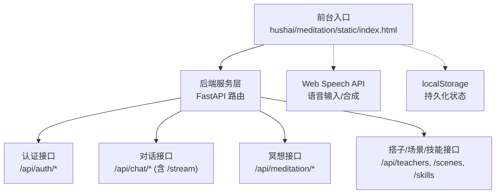
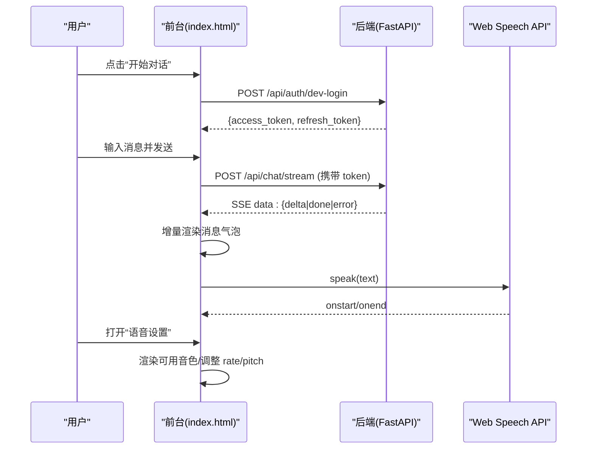
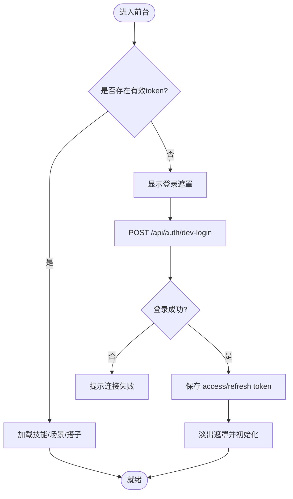
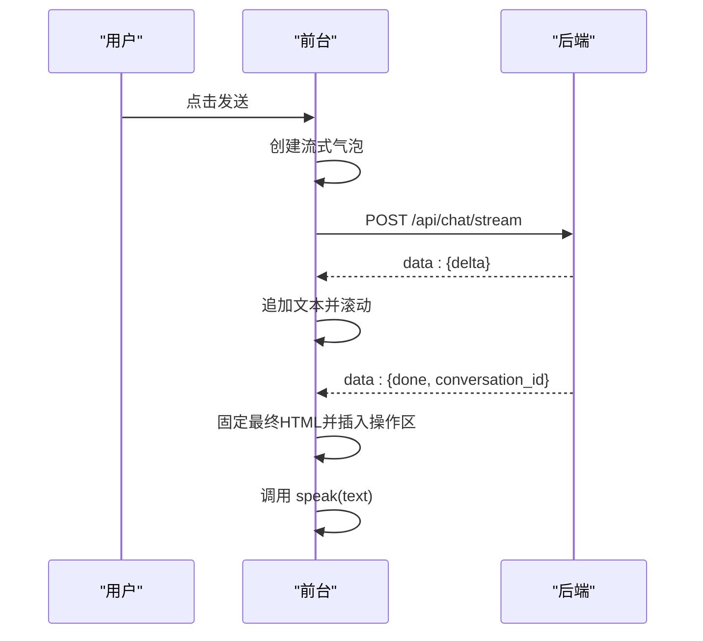
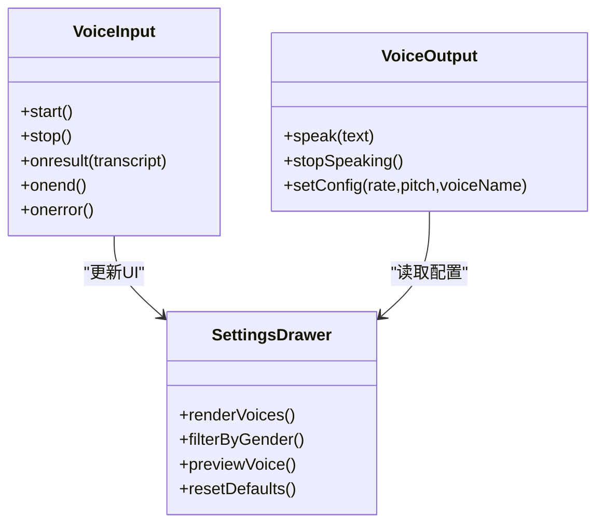
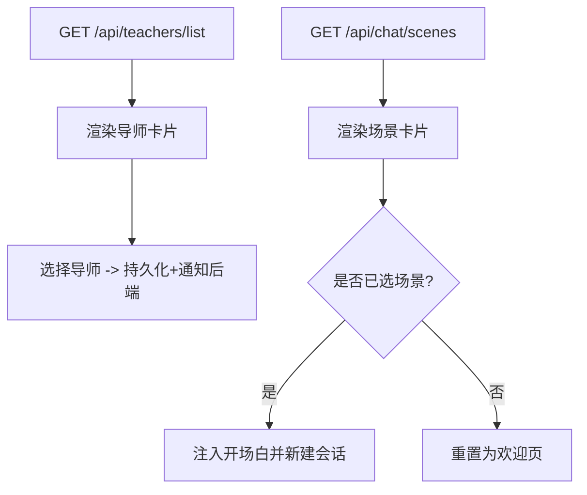
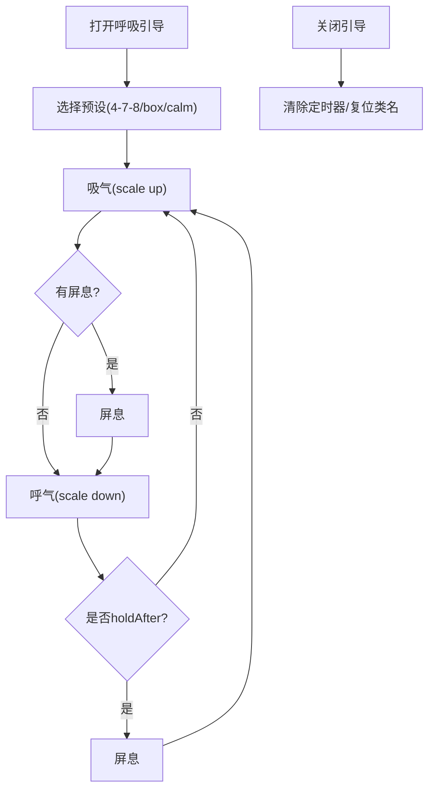
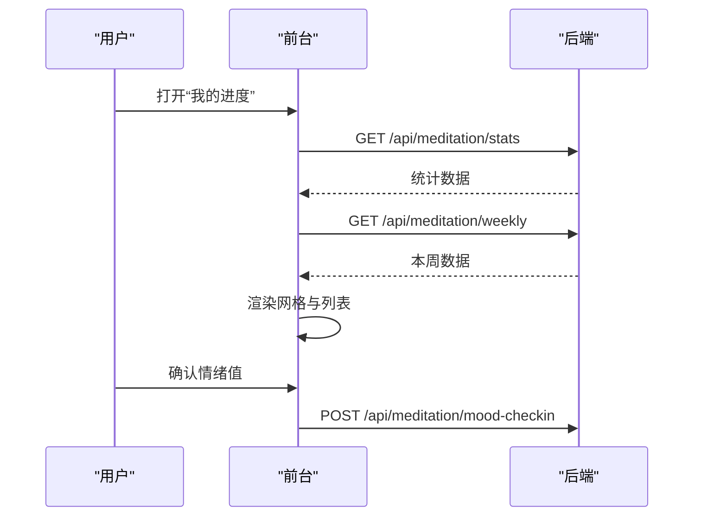
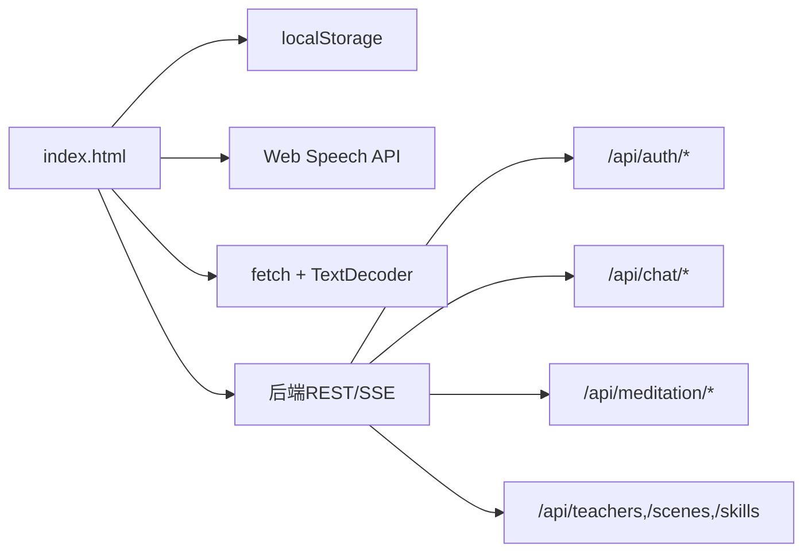

# 前端架构设计

<cite>
**本文引用的文件**   
- [README.md](file://README.md)
- [index.html](file://hushai/meditation/static/index.html)
- [frontend_qa.py](file://scripts/frontend_qa.py)
- [base.html](file://hushai/meditation/admin/templates/base.html)
</cite>

## 目录
1. [引言](#引言)
2. [项目结构](#项目结构)
3. [核心组件](#核心组件)
4. [架构总览](#架构总览)
5. [详细组件分析](#详细组件分析)
6. [依赖关系分析](#依赖关系分析)
7. [性能考量](#性能考量)
8. [故障排查指南](#故障排查指南)
9. [结论](#结论)
10. [附录](#附录)

## 引言
本设计文档面向 hush.ai 的前端，聚焦单页应用（SPA）的整体架构模式与实现细节。内容涵盖 HTML 结构组织、CSS 样式系统设计、JavaScript 交互逻辑架构；阐述模块化设计原则（组件划分、状态管理、事件处理机制）；说明响应式设计与移动端适配方案；提供跨浏览器兼容性策略与性能优化建议；并给出可访问性（a11y）改进建议与用户体验优化实践。

## 项目结构
当前前端以“单文件 SPA”形态存在：一个内联 CSS + 内联 JS 的 index.html 作为前台入口，配合后端 FastAPI 提供的 REST/SSE API 完成认证、对话、冥想追踪、语音输入输出等功能。管理后台采用 Jinja2 模板与内联脚本，提供通用 UI 能力（如 Toast、异步请求封装）。

图表来源
- [index.html:1161-1600](file://hushai/meditation/static/index.html#L1161-L1600)
- [index.html:1601-2112](file://hushai/meditation/static/index.html#L1601-L2112)
- [README.md:100-178](file://README.md#L100-L178)

章节来源
- [README.md:136-178](file://README.md#L136-L178)

## 核心组件
- 登录与鉴权
  - 开发模式登录、JWT Access Token 与 Refresh Token 管理、自动刷新与过期回退登录。
- 会话与消息
  - 普通对话与知识库问答双模式；SSE 流式渲染；Markdown 解析；朗读控制。
- 冥想搭子与场景
  - 导师列表与选择、场景切换与开场白注入。
- 技能加持
  - 动态加载技能清单，用户勾选后随消息发送。
- 语音系统
  - Web Speech API 语音识别与合成；音色筛选、语速/音调调节；预览与恢复默认。
- 呼吸练习
  - 全屏引导界面，支持 4-7-8、方形、平静三种节奏。
- 进度与情绪
  - 情绪签到弹窗；统计面板与本周进度展示。
- 历史与设置抽屉
  - 对话历史侧栏；语音设置底部抽屉；统一遮罩与关闭行为。

章节来源
- [index.html:942-1160](file://hushai/meditation/static/index.html#L942-L1160)
- [index.html:1161-1600](file://hushai/meditation/static/index.html#L1161-L1600)
- [index.html:1601-2112](file://hushai/meditation/static/index.html#L1601-L2112)

## 架构总览
前台 SPA 通过 fetch 调用后端 REST 接口；对话使用 SSE 流式传输，前端逐条解析 data: JSON 片段并增量渲染。状态主要保存在内存变量与 localStorage 中，结合 classList 驱动 UI 显隐与激活态。

图表来源
- [index.html:1584-1609](file://hushai/meditation/static/index.html#L1584-L1609)
- [index.html:1795-1891](file://hushai/meditation/static/index.html#L1795-L1891)
- [index.html:1661-1692](file://hushai/meditation/static/index.html#L1661-L1692)

## 详细组件分析

### 组件A：登录与鉴权模块
- 职责
  - 收集昵称，发起开发模式登录；保存 access_token 与 refresh_token；处理 401 自动刷新或回退登录。
- 关键流程
  - 登录成功后淡出遮罩，初始化技能、场景、搭子数据。
  - 每次请求失败且 401 时尝试刷新；若刷新失败则清空本地凭证并显示登录遮罩。
- 错误处理
  - 网络异常提示重试；401 分支清晰；刷新期间防重入。

图表来源
- [index.html:1584-1609](file://hushai/meditation/static/index.html#L1584-L1609)
- [index.html:1611-1637](file://hushai/meditation/static/index.html#L1611-L1637)

章节来源
- [index.html:1584-1637](file://hushai/meditation/static/index.html#L1584-L1637)

### 组件B：对话与流式渲染模块
- 职责
  - 构建请求体（消息、会话ID、技能、场景、搭子），选择普通/知识库端点；SSE 读取并增量渲染；完成后持久化会话ID并触发朗读。
- 关键点
  - 文本解码器分块拼接；按行解析 data: JSON；处理 delta/done/error；滚动跟随。
  - 401 自动刷新一次并重试；非 2xx 友好提示。
- 渲染
  - Markdown 简易解析（加粗、斜体、代码、链接、换行）；打字指示器；朗读按钮。

图表来源
- [index.html:1795-1891](file://hushai/meditation/static/index.html#L1795-L1891)
- [index.html:1695-1703](file://hushai/meditation/static/index.html#L1695-L1703)
- [index.html:1762-1793](file://hushai/meditation/static/index.html#L1762-L1793)

章节来源
- [index.html:1795-1891](file://hushai/meditation/static/index.html#L1795-L1891)

### 组件C：语音输入/输出模块
- 职责
  - 语音识别：实时转写至输入框；结束自动发送。
  - 语音合成：按配置选择音色、语速、音调；播放状态反馈。
- 交互
  - 麦克风按钮状态切换；顶部状态点动画；停止朗读重置状态。
- 兼容
  - 检测 SpeechRecognition 与 speechSynthesis 可用性；无中文音色时降级提示。

图表来源
- [index.html:1639-1659](file://hushai/meditation/static/index.html#L1639-L1659)
- [index.html:1661-1692](file://hushai/meditation/static/index.html#L1661-L1692)
- [index.html:1440-1555](file://hushai/meditation/static/index.html#L1440-L1555)

章节来源
- [index.html:1639-1692](file://hushai/meditation/static/index.html#L1639-L1692)
- [index.html:1440-1555](file://hushai/meditation/static/index.html#L1440-L1555)

### 组件D：冥想搭子与场景模块
- 职责
  - 拉取导师列表与选中项；渲染头像与描述；选择后同步到服务端并联动语音性别过滤。
  - 拉取场景列表；切换场景时注入开场白或重置对话。
- 状态
  - selectedTeacherId、selectedSceneId 持久化到 localStorage。

图表来源
- [index.html:1368-1438](file://hushai/meditation/static/index.html#L1368-L1438)
- [index.html:1280-1315](file://hushai/meditation/static/index.html#L1280-L1315)

章节来源
- [index.html:1368-1438](file://hushai/meditation/static/index.html#L1368-L1438)
- [index.html:1280-1315](file://hushai/meditation/static/index.html#L1280-L1315)

### 组件E：呼吸练习模块
- 职责
  - 全屏遮罩引导；圆形缩放动画；三种预设节奏循环；关闭时清理定时器。
- 交互
  - 按钮切换开合；预设切换即时生效；减少动画偏好时禁用过渡。

图表来源
- [index.html:1938-2008](file://hushai/meditation/static/index.html#L1938-L2008)

章节来源
- [index.html:1938-2008](file://hushai/meditation/static/index.html#L1938-L2008)

### 组件F：进度与情绪模块
- 职责
  - 首次登录后弹出情绪滑块；提交后端记录；打开进度抽屉拉取统计与周视图。
- 展示
  - 总次数、总时长、连续天数、平均情绪；本周每日会话数；最近练习条目。

图表来源
- [index.html:2010-2083](file://hushai/meditation/static/index.html#L2010-L2083)
- [index.html:1893-1936](file://hushai/meditation/static/index.html#L1893-L1936)

章节来源
- [index.html:2010-2083](file://hushai/meditation/static/index.html#L2010-L2083)
- [index.html:1893-1936](file://hushai/meditation/static/index.html#L1893-L1936)

### 组件G：设置抽屉与全局交互
- 职责
  - 语音设置：音色筛选、试听、恢复默认；抽屉开关与遮罩点击关闭。
  - 历史抽屉：加载会话列表、切换会话、渲染消息。
- 交互
  - 统一的 open/close 模式；ESC 键关闭（管理后台模板提供通用方法）。

章节来源
- [index.html:1557-1563](file://hushai/meditation/static/index.html#L1557-L1563)
- [index.html:1186-1254](file://hushai/meditation/static/index.html#L1186-L1254)
- [base.html:388-418](file://hushai/meditation/admin/templates/base.html#L388-L418)

## 依赖关系分析
- 外部依赖
  - Google Fonts 字体预连接；无其他外部资源引用（安全）。
- 浏览器 API
  - Web Speech API（SpeechRecognition/speechSynthesis）、fetch、TextDecoder、matchMedia。
- 本地存储
  - localStorage 用于 token、会话ID、昵称、技能/场景/搭子/语音配置等。
- 后端接口
  - 认证、对话（含流式）、冥想、搭子/场景/技能等 REST 端点。

图表来源
- [index.html:1161-1600](file://hushai/meditation/static/index.html#L1161-L1600)
- [index.html:1601-2112](file://hushai/meditation/static/index.html#L1601-L2112)
- [README.md:182-227](file://README.md#L182-L227)

章节来源
- [README.md:182-227](file://README.md#L182-L227)

## 性能考量
- 首屏与体积
  - 内联 CSS/JS 便于单文件部署；QA 脚本会统计大小，建议后续拆分与按需加载以提升缓存命中率。
- 字体与资源
  - 使用 preconnect 预连接字体 CDN；无其他外部依赖，降低阻塞风险。
- 渲染与滚动
  - 流式增量渲染避免整段重排；消息容器仅追加节点，必要时限制历史长度。
- 动画与可访问性
  - 尊重 prefers-reduced-motion；减少不必要的布局抖动。
- 网络与重试
  - 401 自动刷新一次并重试；SSE 错误分支快速降级。

章节来源
- [frontend_qa.py:196-234](file://scripts/frontend_qa.py#L196-L234)
- [index.html:14-12](file://hushai/meditation/static/index.html#L14-L12)

## 故障排查指南
- 无法连接服务
  - 现象：登录提示“无法连接服务”。检查后端是否启动、端口与 CORS 配置。
- 401 未授权
  - 现象：对话失败或跳转登录。确认 token 是否过期；检查 tryRefreshToken 是否被触发。
- 语音不可用
  - 现象：麦克风或朗读无效。检查浏览器是否支持 Speech API；在设置中查看是否有中文音色。
- 流式不渲染
  - 现象：SSE 返回但无增量文本。检查 data: 行解析与 JSON 字段（delta/done/error）。
- 历史为空
  - 现象：历史抽屉显示“暂无对话记录”。确认当前会话 ID 是否正确持久化。

章节来源
- [index.html:1605-1608](file://hushai/meditation/static/index.html#L1605-L1608)
- [index.html:1611-1637](file://hushai/meditation/static/index.html#L1611-L1637)
- [index.html:1639-1659](file://hushai/meditation/static/index.html#L1639-L1659)
- [index.html:1843-1891](file://hushai/meditation/static/index.html#L1843-L1891)
- [index.html:1218-1254](file://hushai/meditation/static/index.html#L1218-L1254)

## 结论
该 SPA 采用“单文件 + 内联资源”的轻量架构，围绕认证、对话流、语音、冥想功能进行模块化组织。通过 classList 驱动 UI、localStorage 持久化状态、SSE 实现低延迟体验，整体结构清晰、扩展性强。后续可在保持现有风格的前提下，逐步将 CSS/JS 拆分为独立模块，引入更完善的错误边界与监控，进一步提升可维护性与性能。

## 附录

### 响应式与无障碍现状
- 媒体查询
  - 包含移动端与平板断点；支持 iPhone 安全区域。
- 无障碍
  - 使用 aria-label、role、aria-live、aria-pressed、aria-relevant；focus-visible 提升键盘导航；prefers-reduced-motion 尊重用户偏好。
- 质量检查
  - QA 脚本覆盖 CSS 变量、媒体查询、动画、选择器复杂度、a11y 属性、外部资源与体积统计。

章节来源
- [frontend_qa.py:148-193](file://scripts/frontend_qa.py#L148-L193)
- [frontend_qa.py:69-101](file://scripts/frontend_qa.py#L69-L101)
- [index.html:734-746](file://hushai/meditation/static/index.html#L734-L746)

### 可访问性与用户体验改进建议
- 语义化与焦点管理
  - 为抽屉/模态增加 focus trap；关闭时焦点回归触发元素。
- 屏幕阅读器增强
  - 对动态更新的区域使用 aria-live="polite" 并限定 region；为长消息提供“展开/收起”与跳过朗读选项。
- 触控与手势
  - 为抽屉/遮罩添加滑动关闭；增大触摸目标尺寸；避免误触。
- 主题与对比度
  - 确保文字与背景对比度达标；提供高对比度模式开关。
- 国际化与文案
  - 错误信息本地化；为图标按钮补充 title/aria-label。

[本节为概念性建议，不直接分析具体文件]