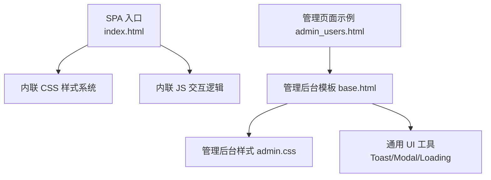
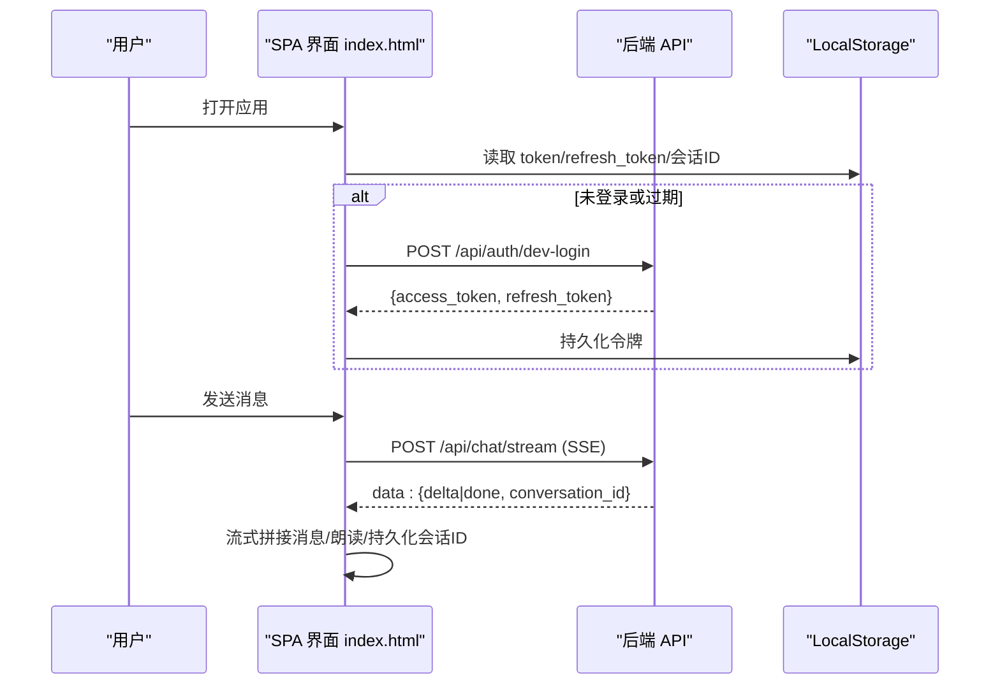
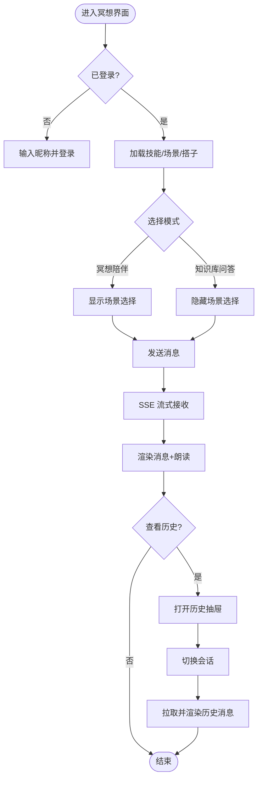
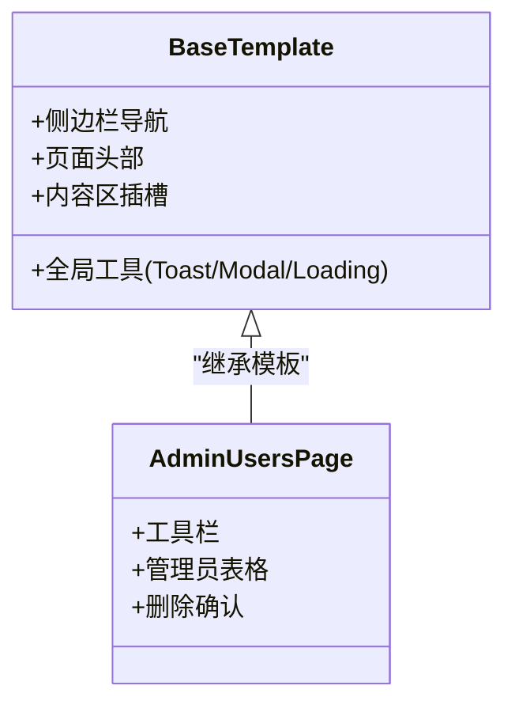
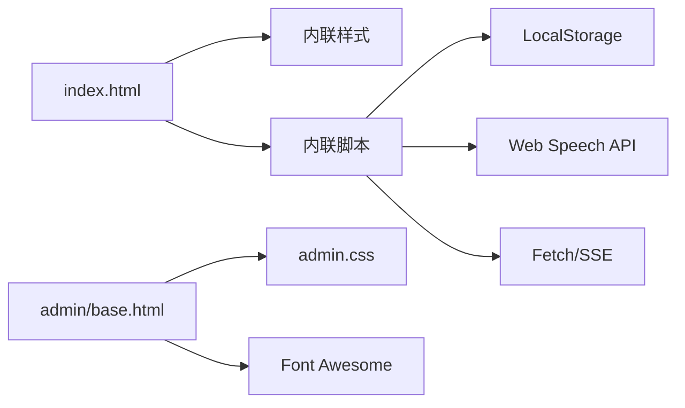

# 前端界面

<cite>
**本文引用的文件列表**
- [hushai/meditation/static/index.html](file://hushai/meditation/static/index.html)
- [hushai/meditation/admin/templates/base.html](file://hushai/meditation/admin/templates/base.html)
- [hushai/meditation/admin/static/css/admin.css](file://hushai/meditation/admin/static/css/admin.css)
- [hushai/meditation/admin/templates/admin_users.html](file://hushai/meditation/admin/templates/admin_users.html)
- [scripts/frontend_qa.py](file://scripts/frontend_qa.py)
- [docs/evaluation-report-frontend-backend.md](file://docs/evaluation-report-frontend-backend.md)
</cite>

## 目录
1. [简介](#简介)
2. [项目结构](#项目结构)
3. [核心组件](#核心组件)
4. [架构总览](#架构总览)
5. [详细组件分析](#详细组件分析)
6. [依赖关系分析](#依赖关系分析)
7. [性能与可访问性](#性能与可访问性)
8. [故障排查指南](#故障排查指南)
9. [结论](#结论)

## 简介
本设计文档聚焦 hush.ai 的前端界面，覆盖单页应用（SPA）的架构设计与组件组织方式，包括 HTML 结构、CSS 样式系统与 JavaScript 交互逻辑。重点阐述冥想界面的用户体验设计：对话界面、呼吸练习引导、进度可视化等核心功能的交互流程；并说明管理后台的界面设计与操作逻辑，涵盖用户管理、内容运营、数据分析等功能模块。同时提供响应式设计与跨浏览器兼容方案，以及前端性能优化策略与可访问性改进建议。

## 项目结构
前端资源主要分布在以下位置：
- 冥想 SPA 入口与主界面：hushai/meditation/static/index.html
- 管理后台基础模板与样式：hushai/meditation/admin/templates/base.html、hushai/meditation/admin/static/css/admin.css
- 管理后台页面示例：hushai/meditation/admin/templates/admin_users.html
- 前端质量检查脚本：scripts/frontend_qa.py
- 评估报告参考：docs/evaluation-report-frontend-backend.md

图表来源
- [hushai/meditation/static/index.html:1-100](file://hushai/meditation/static/index.html#L1-L100)
- [hushai/meditation/admin/templates/base.html:1-50](file://hushai/meditation/admin/templates/base.html#L1-L50)
- [hushai/meditation/admin/static/css/admin.css:1-50](file://hushai/meditation/admin/static/css/admin.css#L1-L50)

章节来源
- [hushai/meditation/static/index.html:1-120](file://hushai/meditation/static/index.html#L1-L120)
- [hushai/meditation/admin/templates/base.html:1-50](file://hushai/meditation/admin/templates/base.html#L1-L50)
- [hushai/meditation/admin/static/css/admin.css:1-50](file://hushai/meditation/admin/static/css/admin.css#L1-L50)

## 核心组件
- 登录与认证
  - 登录遮罩、昵称输入、错误提示、自动隐藏与淡出过渡
  - Token 持久化与刷新机制（access_token/refresh_token），401 时自动刷新或回退登录
- 对话界面
  - 消息气泡、头像、名称、Markdown 渲染、朗读控制按钮
  - 流式输出（SSE）实时拼接文本，完成后追加朗读与对话 ID 持久化
  - 历史抽屉：加载会话列表、切换会话、渲染历史消息
- 技能加持
  - 动态加载技能列表，本地选择与上限限制，持久化到 localStorage
- 场景与搭子
  - 场景选择器：选择后注入开场白或重置对话
  - 搭子（教师）选择：更新音色性别偏好与头像显示，后端同步当前搭子
- 语音设置
  - 音色筛选（女声/男声/English）、语速/音调滑块、试听与恢复默认
- 情绪签到
  - 首次登录后弹窗滑动条选择心情值，提交至后端
- 呼吸练习引导
  - 全屏遮罩、圆形动画、多模式预设（4-7-8/方形/平静）
- 进度面板
  - 统计卡片（次数/分钟/连续天数/平均情绪）、本周日历、最近练习记录

章节来源
- [hushai/meditation/static/index.html:940-1160](file://hushai/meditation/static/index.html#L940-L1160)
- [hushai/meditation/static/index.html:1161-1600](file://hushai/meditation/static/index.html#L1161-L1600)
- [hushai/meditation/static/index.html:1601-2112](file://hushai/meditation/static/index.html#L1601-L2112)

## 架构总览
SPA 采用“单文件 + 内联样式/脚本”的轻量架构，通过 DOM 操作与 fetch API 完成数据交互。管理后台基于服务端模板渲染，提供统一的侧边栏导航、全局工具（Toast/Modal/Loading）与页面布局。

图表来源
- [hushai/meditation/static/index.html:1584-1637](file://hushai/meditation/static/index.html#L1584-L1637)
- [hushai/meditation/static/index.html:1795-1891](file://hushai/meditation/static/index.html#L1795-L1891)

## 详细组件分析

### 冥想界面（SPA）
- 结构与样式
  - 使用 CSS 变量定义主题色板、字体族、缓动曲线与阴影半径，形成统一视觉语言
  - 自定义光标、纸张纹理叠加、细线分隔与渐变装饰，营造编辑风质感
  - 响应式断点：移动端 480px、平板 560px，适配 safe-area-inset
- 交互逻辑
  - 登录流程：昵称输入 → dev-login → 存储令牌 → 加载技能/场景/搭子
  - 对话发送：校验输入 → 插入用户消息 → 创建流式占位 → SSE 逐段拼接 → 完成朗读与持久化
  - 历史抽屉：拉取会话列表 → 点击切换 → 拉取消息并渲染
  - 语音设置：按性别过滤中文/英文音色 → 选择并预览 → 保存配置
  - 情绪签到：首次登录弹出 → 滑动条取值 → 提交 mood-checkin
  - 呼吸练习：选择预设 → 状态机驱动动画（吸气/屏息/呼气）→ 关闭停止计时器
  - 进度面板：拉取 stats/weekly → 渲染统计卡片、周视图与最近记录

图表来源
- [hushai/meditation/static/index.html:1161-1600](file://hushai/meditation/static/index.html#L1161-L1600)
- [hushai/meditation/static/index.html:1601-2112](file://hushai/meditation/static/index.html#L1601-L2112)

章节来源
- [hushai/meditation/static/index.html:1-120](file://hushai/meditation/static/index.html#L1-L120)
- [hushai/meditation/static/index.html:940-1160](file://hushai/meditation/static/index.html#L940-L1160)
- [hushai/meditation/static/index.html:1161-1600](file://hushai/meditation/static/index.html#L1161-L1600)
- [hushai/meditation/static/index.html:1601-2112](file://hushai/meditation/static/index.html#L1601-L2112)

### 管理后台（模板与样式）
- 布局与导航
  - 左侧固定侧边栏，支持折叠与分组展开，高亮当前路由
  - 顶部面包屑与页面标题，主体区域承载各功能页面
- 通用工具
  - Toast 通知（成功/错误/警告/信息）
  - Loading 遮罩（带文案与副文案）
  - Modal 对话框（支持大尺寸、图标、回调与 ESC 关闭）
  - 异步请求封装（自动携带 CSRF Token、统一错误处理）
- 页面示例（管理员管理）
  - 工具栏（计数与新建按钮）
  - 表格展示（用户名、角色、状态、操作）
  - 删除确认（调用 confirmAction 与 asyncRequest）

图表来源
- [hushai/meditation/admin/templates/base.html:1-190](file://hushai/meditation/admin/templates/base.html#L1-L190)
- [hushai/meditation/admin/templates/admin_users.html:1-114](file://hushai/meditation/admin/templates/admin_users.html#L1-L114)

章节来源
- [hushai/meditation/admin/templates/base.html:1-190](file://hushai/meditation/admin/templates/base.html#L1-L190)
- [hushai/meditation/admin/static/css/admin.css:1-200](file://hushai/meditation/admin/static/css/admin.css#L1-L200)
- [hushai/meditation/admin/templates/admin_users.html:1-114](file://hushai/meditation/admin/templates/admin_users.html#L1-L114)

## 依赖关系分析
- 外部资源
  - Google Fonts 预连接与字体加载
  - Font Awesome 图标库（管理后台）
- 本地存储
  - LocalStorage 用于令牌、会话 ID、技能选择、语音配置、情绪签到标记
- 浏览器 API
  - Web Speech API（识别/合成）
  - Fetch API（含 SSE 流式读取）
  - matchMedia（减少动画偏好检测）

图表来源
- [hushai/meditation/static/index.html:1-120](file://hushai/meditation/static/index.html#L1-L120)
- [hushai/meditation/admin/templates/base.html:1-50](file://hushai/meditation/admin/templates/base.html#L1-L50)
- [hushai/meditation/admin/static/css/admin.css:1-50](file://hushai/meditation/admin/static/css/admin.css#L1-L50)

章节来源
- [hushai/meditation/static/index.html:1-120](file://hushai/meditation/static/index.html#L1-L120)
- [hushai/meditation/admin/templates/base.html:1-50](file://hushai/meditation/admin/templates/base.html#L1-L50)
- [hushai/meditation/admin/static/css/admin.css:1-50](file://hushai/meditation/admin/static/css/admin.css#L1-L50)

## 性能与可访问性
- 响应式设计
  - 媒体查询断点：480px（移动端）、560px（平板）
  - iPhone 安全区域适配：safe-area-inset
- 跨浏览器兼容
  - 使用标准 CSS 变量与 flex/grid 布局
  - 针对 Safari/Chrome/Firefox 的滚动条与滑块样式兼容
  - prefers-reduced-motion 禁用动画，提升可访问性与性能
- 可访问性
  - ARIA 标签与角色：aria-label、role、aria-live、aria-pressed、aria-relevant
  - 键盘焦点可见性：:focus-visible
  - 跳过链接（管理后台）与语义化结构
- 性能优化
  - 内联 CSS/JS 减少请求数，适合小型 SPA
  - 字体预连接与按需加载
  - 流式输出降低首屏等待时间
  - 图片懒加载（如有）与最小化外部依赖

章节来源
- [hushai/meditation/static/index.html:1-120](file://hushai/meditation/static/index.html#L1-L120)
- [hushai/meditation/static/index.html:734-746](file://hushai/meditation/static/index.html#L734-L746)
- [scripts/frontend_qa.py:148-238](file://scripts/frontend_qa.py#L148-L238)
- [docs/evaluation-report-frontend-backend.md:71-100](file://docs/evaluation-report-frontend-backend.md#L71-L100)

## 故障排查指南
- 登录失败或网络异常
  - 现象：无法连接服务或 401 未刷新
  - 排查：检查 dev-login 接口返回、localStorage 中令牌是否写入、tryRefreshToken 是否触发
- 流式输出中断或无响应
  - 现象：消息不更新或提示“暂时无法回应”
  - 排查：SSE 读取循环是否正常、data 行解析是否正确、finally 分支是否重置发送状态
- 语音设置无效
  - 现象：音色/语速/音调不生效
  - 排查：allVoices 是否加载、voiceCfg 是否持久化、SpeechSynthesisUtterance 参数是否正确
- 历史抽屉为空或加载失败
  - 现象：列表为空或提示“加载失败”
  - 排查：/api/chat/conversations 返回格式、Authorization 头是否携带、401 重定向登录
- 管理后台操作失败
  - 现象：删除管理员失败或无反馈
  - 排查：asyncRequest 封装是否携带 CSRF、confirmAction 回调是否执行、toast 提示是否出现

章节来源
- [hushai/meditation/static/index.html:1584-1637](file://hushai/meditation/static/index.html#L1584-L1637)
- [hushai/meditation/static/index.html:1795-1891](file://hushai/meditation/static/index.html#L1795-L1891)
- [hushai/meditation/static/index.html:1639-1692](file://hushai/meditation/static/index.html#L1639-L1692)
- [hushai/meditation/static/index.html:1186-1254](file://hushai/meditation/static/index.html#L1186-L1254)
- [hushai/meditation/admin/templates/base.html:393-436](file://hushai/meditation/admin/templates/base.html#L393-L436)
- [hushai/meditation/admin/templates/admin_users.html:100-114](file://hushai/meditation/admin/templates/admin_users.html#L100-L114)

## 结论
该前端实现以极简的单文件 SPA 为核心，结合内联样式与脚本，提供了完整的冥想体验：对话、语音、技能加持、场景与搭子、情绪签到、呼吸练习与进度可视化。管理后台则通过模板与样式体系，构建了统一的操作界面与通用工具，满足用户管理、内容运营与系统运维需求。整体在响应式、可访问性与性能方面具备良好实践，后续可在模块化拆分、构建优化与更丰富的可视化方面持续演进。