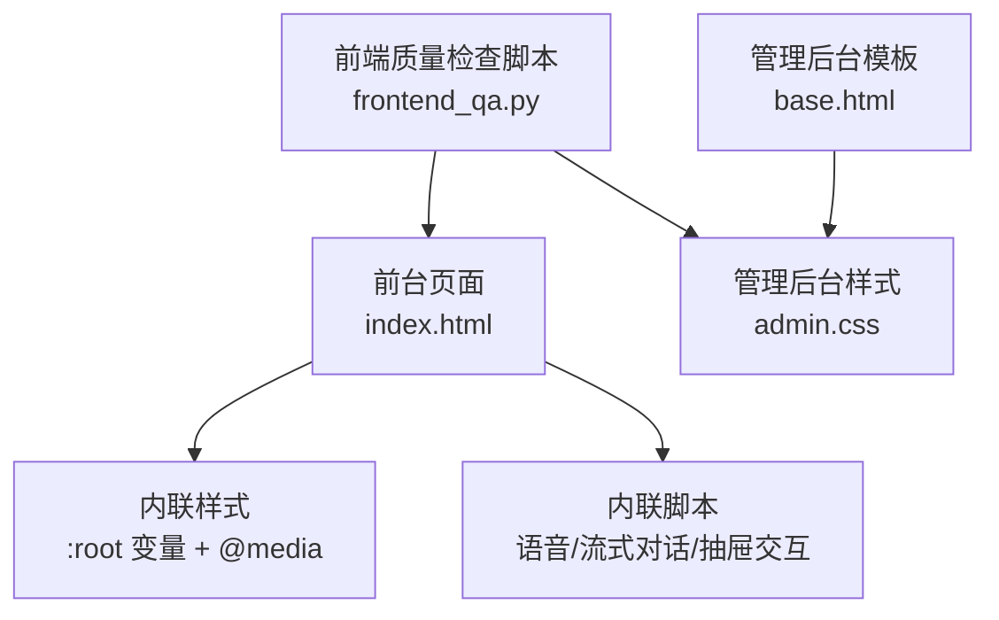
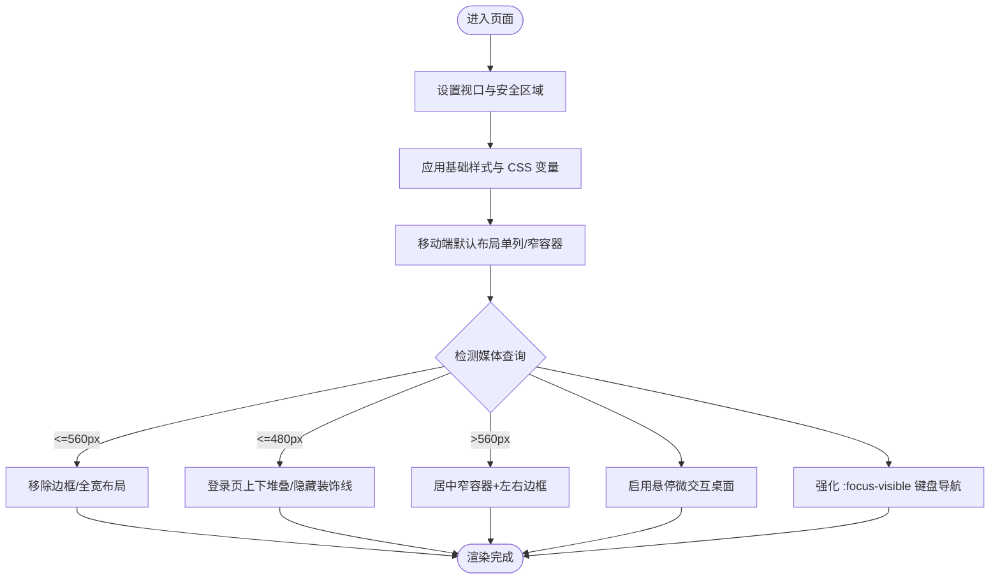
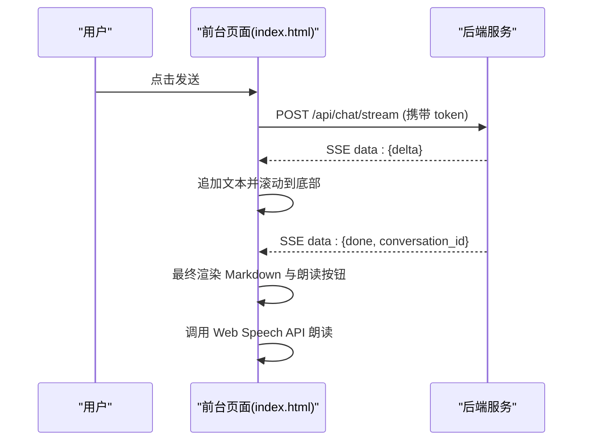
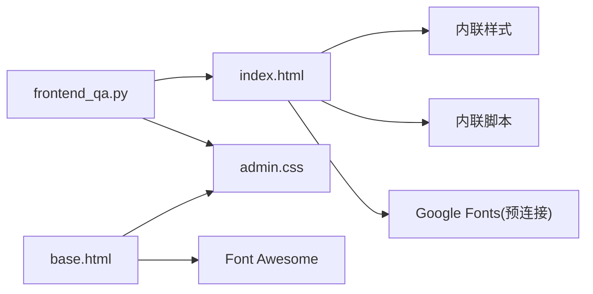

# 响应式设计实现

<cite>
**本文引用的文件列表**
- [hushai/meditation/static/index.html](file://hushai/meditation/static/index.html)
- [hushai/meditation/admin/templates/base.html](file://hushai/meditation/admin/templates/base.html)
- [hushai/meditation/admin/static/css/admin.css](file://hushai/meditation/admin/static/css/admin.css)
- [scripts/frontend_qa.py](file://scripts/frontend_qa.py)
</cite>

## 目录
1. [简介](#简介)
2. [项目结构](#项目结构)
3. [核心组件](#核心组件)
4. [架构总览](#架构总览)
5. [详细组件分析](#详细组件分析)
6. [依赖关系分析](#依赖关系分析)
7. [性能考虑](#性能考虑)
8. [故障排查指南](#故障排查指南)
9. [结论](#结论)
10. [附录](#附录)

## 简介
本文件聚焦 hush.ai 的响应式设计与移动端优先实现，覆盖以下方面：
- 视口配置与移动端交互优化（触摸手势、安全区域）
- 断点系统与弹性布局/网格系统
- 媒体查询规范（CSS 变量响应式更新、图片自适应、字体缩放）
- 平板与桌面端适配（多列布局、悬停效果、键盘导航）
- 性能优化（资源懒加载、图片压缩、缓存策略）

## 项目结构
前端响应式相关代码主要分布在两个位置：
- 前台 SPA：单页应用入口与内联样式/脚本
- 管理后台：模板基座与独立 CSS

图表来源
- [hushai/meditation/static/index.html](file://hushai/meditation/static/index.html)
- [hushai/meditation/admin/templates/base.html](file://hushai/meditation/admin/templates/base.html)
- [hushai/meditation/admin/static/css/admin.css](file://hushai/meditation/admin/static/css/admin.css)
- [scripts/frontend_qa.py](file://scripts/frontend_qa.py)

章节来源
- [hushai/meditation/static/index.html](file://hushai/meditation/static/index.html)
- [hushai/meditation/admin/templates/base.html](file://hushai/meditation/admin/templates/base.html)
- [hushai/meditation/admin/static/css/admin.css](file://hushai/meditation/admin/static/css/admin.css)
- [scripts/frontend_qa.py](file://scripts/frontend_qa.py)

## 核心组件
- 前台页面（SPA）
  - 视口与主题色、字体预连接、内联样式与脚本一体化
  - 使用 CSS 变量构建统一主题与可访问性支持
  - 内置移动端优先的布局与动画，包含抽屉、模态、呼吸练习等
- 管理后台
  - 基于模板 base.html 注入全局 UI 能力（Toast、Modal、Loading、侧边栏折叠）
  - admin.css 提供设计令牌、卡片、表格、按钮等基础组件

章节来源
- [hushai/meditation/static/index.html](file://hushai/meditation/static/index.html)
- [hushai/meditation/admin/templates/base.html](file://hushai/meditation/admin/templates/base.html)
- [hushai/meditation/admin/static/css/admin.css](file://hushai/meditation/admin/static/css/admin.css)

## 架构总览
从“移动端优先”到“平板/桌面增强”的演进路径如下：

图表来源
- [hushai/meditation/static/index.html](file://hushai/meditation/static/index.html)

## 详细组件分析

### 1) 视口配置与移动端优先
- 视口与缩放控制
  - 通过 meta viewport 限制最大缩放并锁定宽度，确保移动端输入体验稳定
  - 参考路径：[视口与描述元信息:1-13](file://hushai/meditation/static/index.html#L1-L13)
- 安全区域适配
  - 在输入区底部使用 env(safe-area-inset-bottom, 0px)，兼容刘海屏/动态岛设备
  - 参考路径：[输入区安全区域:504-512](file://hushai/meditation/static/index.html#L504-L512)
- 移动端默认行为
  - 应用容器在小屏下去除左右边框，最大化可用空间
  - 参考路径：[容器边框与窄屏处理:72-78](file://hushai/meditation/static/index.html#L72-L78)

章节来源
- [hushai/meditation/static/index.html](file://hushai/meditation/static/index.html)

### 2) 触摸手势与移动端交互优化
- 大点击目标与按压反馈
  - 圆形按钮尺寸与 active 缩放，提升触控命中率与反馈感
  - 参考路径：[发送/语音按钮样式:525-539](file://hushai/meditation/static/index.html#L525-L539)
- 抽屉与遮罩
  - 设置/历史/进度等面板采用固定定位与 transform 滑入，避免滚动穿透
  - 参考路径：[设置抽屉:544-576](file://hushai/meditation/static/index.html#L544-L576)、[对话历史抽屉:669-706](file://hushai/meditation/static/index.html#L669-L706)、[进度抽屉:849-878](file://hushai/meditation/static/index.html#L849-L878)
- 呼吸练习全屏引导
  - 全屏遮罩与中心圆环动画，适合移动端沉浸体验
  - 参考路径：[呼吸引导:802-847](file://hushai/meditation/static/index.html#L802-L847)

章节来源
- [hushai/meditation/static/index.html](file://hushai/meditation/static/index.html)

### 3) 断点系统与弹性布局/网格
- 断点定义与用途
  - 560px：用于应用容器边框与整体宽度切换
  - 480px：用于登录页双栏变单栏、装饰元素隐藏
  - 参考路径：[560px 断点:72-78](file://hushai/meditation/static/index.html#L72-L78)、[480px 断点:225-231](file://hushai/meditation/static/index.html#L225-L231)
- 弹性布局
  - 头部、消息气泡、技能条、模式选择等广泛使用 flex 进行对齐与换行
  - 参考路径：[头部布局:236-299](file://hushai/meditation/static/index.html#L236-L299)、[消息气泡:393-462](file://hushai/meditation/static/index.html#L393-L462)、[技能条:366-389](file://hushai/meditation/static/index.html#L366-L389)
- 网格系统
  - 进度统计卡片使用两列网格；管理后台使用 auto-fit/minmax 自适应网格
  - 参考路径：[进度网格:879-905](file://hushai/meditation/static/index.html#L879-L905)、[管理后台网格:367-439](file://hushai/meditation/admin/static/css/admin.css#L367-L439)

章节来源
- [hushai/meditation/static/index.html](file://hushai/meditation/static/index.html)
- [hushai/meditation/admin/static/css/admin.css](file://hushai/meditation/admin/static/css/admin.css)

### 4) 媒体查询与 CSS 变量响应式更新
- 媒体查询使用规范
  - 以最小化原则编写，仅覆盖必要差异；优先使用 clamp() 与 CSS 变量减少重复
  - 参考路径：[减少动画偏好:741-746](file://hushai/meditation/static/index.html#L741-L746)、[呼吸引导减少动画:937-939](file://hushai/meditation/static/index.html#L937-L939)
- CSS 变量体系
  - 通过 :root 集中定义颜色、字体、缓动曲线，便于主题与响应式扩展
  - 参考路径：[CSS 变量定义:24-45](file://hushai/meditation/static/index.html#L24-L45)
- 字体与字号缩放
  - 标题与品牌文字使用 clamp() 随视口缩放，兼顾可读性与留白
  - 参考路径：[品牌字号:155-163](file://hushai/meditation/static/index.html#L155-L163)、[登录大字:124-135](file://hushai/meditation/static/index.html#L124-L135)
- 图片自适应
  - 头像与图标采用 SVG 或背景图，结合 object-fit 与百分比尺寸保证清晰与自适应
  - 参考路径：[用户头像样式:600-648](file://hushai/meditation/admin/static/css/admin.css#L600-L648)

章节来源
- [hushai/meditation/static/index.html](file://hushai/meditation/static/index.html)
- [hushai/meditation/admin/static/css/admin.css](file://hushai/meditation/admin/static/css/admin.css)

### 5) 平板与桌面端特殊适配
- 多列布局
  - 管理后台仪表盘与统计卡片使用 auto-fit 网格，自动根据宽度生成多列
  - 参考路径：[快速操作网格:367-372](file://hushai/meditation/admin/static/css/admin.css#L367-L372)、[统计卡片网格:434-439](file://hushai/meditation/admin/static/css/admin.css#L434-L439)
- 悬停效果
  - 按钮、卡片、链接在桌面端提供 hover 状态，增强视觉反馈
  - 参考路径：[按钮悬停:700-778](file://hushai/meditation/admin/static/css/admin.css#L700-L778)、[卡片悬停:496-522](file://hushai/meditation/admin/static/css/admin.css#L496-L522)
- 键盘导航与无障碍
  - 使用 :focus-visible 替代 focus，确保键盘焦点可见且不影响鼠标点击
  - 参考路径：[焦点可见样式:736-739](file://hushai/meditation/static/index.html#L736-L739)
- 侧边栏与主内容联动（管理后台）
  - 侧边栏可折叠，主内容随之展开，提升大屏利用率
  - 参考路径：[侧边栏折叠逻辑:438-496](file://hushai/meditation/admin/templates/base.html#L438-L496)

章节来源
- [hushai/meditation/admin/static/css/admin.css](file://hushai/meditation/admin/static/css/admin.css)
- [hushai/meditation/admin/templates/base.html](file://hushai/meditation/admin/templates/base.html)
- [hushai/meditation/static/index.html](file://hushai/meditation/static/index.html)

### 6) 关键流程时序（示例：流式对话）

图表来源
- [hushai/meditation/static/index.html](file://hushai/meditation/static/index.html)

章节来源
- [hushai/meditation/static/index.html](file://hushai/meditation/static/index.html)

## 依赖关系分析
- 前台页面
  - 依赖浏览器原生能力：Web Speech API（语音识别/合成）、Fetch/SSE（流式数据）
  - 依赖 Google Fonts 预连接以提升首屏字体加载速度
- 管理后台
  - 依赖 Font Awesome 图标库与内联 JS 提供的通用 UI 能力（Toast/Modal/Loading）
- 质量检查脚本
  - 解析 HTML 中的 <style> 与 <script>，校验媒体查询、CSS 变量、无障碍属性与减少动画偏好

图表来源
- [hushai/meditation/static/index.html](file://hushai/meditation/static/index.html)
- [hushai/meditation/admin/templates/base.html](file://hushai/meditation/admin/templates/base.html)
- [hushai/meditation/admin/static/css/admin.css](file://hushai/meditation/admin/static/css/admin.css)
- [scripts/frontend_qa.py](file://scripts/frontend_qa.py)

章节来源
- [hushai/meditation/static/index.html](file://hushai/meditation/static/index.html)
- [hushai/meditation/admin/templates/base.html](file://hushai/meditation/admin/templates/base.html)
- [hushai/meditation/admin/static/css/admin.css](file://hushai/meditation/admin/static/css/admin.css)
- [scripts/frontend_qa.py](file://scripts/frontend_qa.py)

## 性能考虑
- 资源预连接与字体优化
  - 对 Google Fonts 域名执行 preconnect，降低 DNS/TLS 握手开销
  - 参考路径：[字体预连接:10-12](file://hushai/meditation/static/index.html#L10-L12)
- 图片与图标
  - 使用 SVG 与内联数据 URI 减少请求数；头像使用 object-fit 保持比例与清晰度
  - 参考路径：[SVG 光标与纹理:62-69](file://hushai/meditation/static/index.html#L62-L69)、[头像样式:600-648](file://hushai/meditation/admin/static/css/admin.css#L600-L648)
- 动画与可访问性
  - 尊重 prefers-reduced-motion，禁用不必要的动画，降低低端设备负担
  - 参考路径：[减少动画偏好:741-746](file://hushai/meditation/static/index.html#L741-L746)
- 本地存储与缓存
  - 使用 localStorage 持久化会话、音色与设置，减少重复请求与初始化成本
  - 参考路径：[Token/会话持久化:1164-1170](file://hushai/meditation/static/index.html#L1164-L1170)、[语音设置持久化:1441-1447](file://hushai/meditation/static/index.html#L1441-L1447)
- 懒加载建议（当前未显式实现）
  - 长列表/图片可使用 loading="lazy" 与 IntersectionObserver 按需加载
  - 建议将非首屏资源延迟加载，降低首屏体积与渲染时间

章节来源
- [hushai/meditation/static/index.html](file://hushai/meditation/static/index.html)
- [hushai/meditation/admin/static/css/admin.css](file://hushai/meditation/admin/static/css/admin.css)

## 故障排查指南
- 媒体查询缺失或不生效
  - 使用前端质量检查脚本验证是否包含移动端与平板端断点
  - 参考路径：[媒体查询检查:148-166](file://scripts/frontend_qa.py#L148-L166)
- 安全区域未适配
  - 检查是否使用 env(safe-area-inset-bottom) 并在输入区生效
  - 参考路径：[安全区域检查:163-166](file://scripts/frontend_qa.py#L163-L166)
- 无障碍问题
  - 确认 aria-* 属性与 :focus-visible 的使用情况
  - 参考路径：[无障碍检查:168-193](file://scripts/frontend_qa.py#L168-L193)
- 动画过多导致卡顿
  - 检查 prefers-reduced-motion 分支是否正确关闭动画
  - 参考路径：[减少动画偏好:741-746](file://hushai/meditation/static/index.html#L741-L746)

章节来源
- [scripts/frontend_qa.py](file://scripts/frontend_qa.py)
- [hushai/meditation/static/index.html](file://hushai/meditation/static/index.html)

## 结论
本项目在前台与管理后台均遵循移动端优先策略：通过严格的视口与安全区域配置、合理的断点划分、弹性布局与网格系统、以及完善的媒体查询与 CSS 变量体系，实现了跨设备的稳定体验。同时，借助减少动画偏好、预连接与本地存储等手段，提升了性能与可用性。后续可在图片懒加载与更细粒度的资源分割上继续优化。

## 附录
- 常用断点建议（基于现有实现）
  - <=480px：超小屏（手机竖屏）
  - <=560px：小屏（手机横屏/小平板）
  - >560px：平板/桌面（逐步增加列数与间距）
- 关键样式与脚本路径索引
  - 视口与主题变量：[index.html:1-45](file://hushai/meditation/static/index.html#L1-L45)
  - 安全区域与输入区：[index.html:504-512](file://hushai/meditation/static/index.html#L504-L512)
  - 断点与布局：[index.html:72-78](file://hushai/meditation/static/index.html#L72-L78), [index.html:225-231](file://hushai/meditation/static/index.html#L225-L231)
  - 管理后台网格与悬停：[admin.css:367-439](file://hushai/meditation/admin/static/css/admin.css#L367-L439), [admin.css:496-522](file://hushai/meditation/admin/static/css/admin.css#L496-L522)
  - 侧边栏折叠逻辑：[base.html:438-496](file://hushai/meditation/admin/templates/base.html#L438-L496)
  - 质量检查脚本：[frontend_qa.py:148-193](file://scripts/frontend_qa.py#L148-L193)