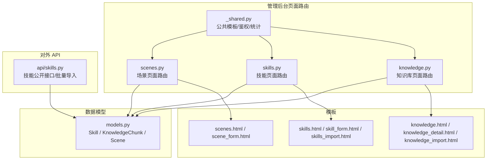
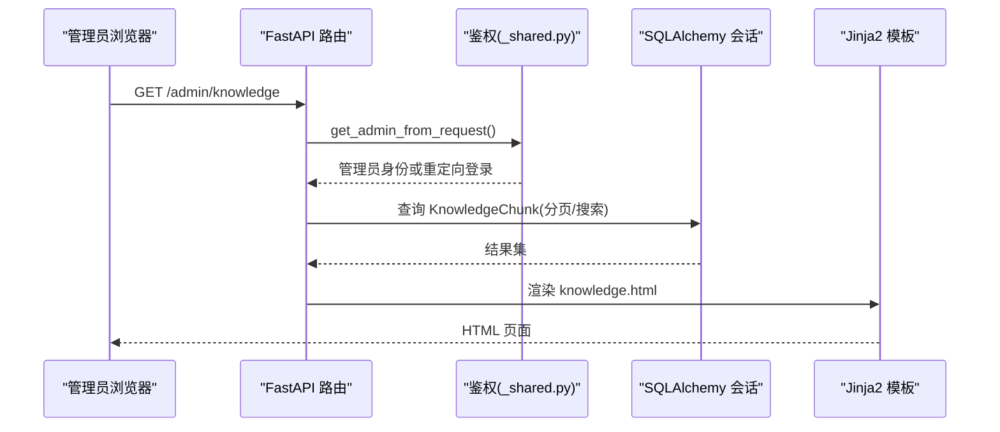
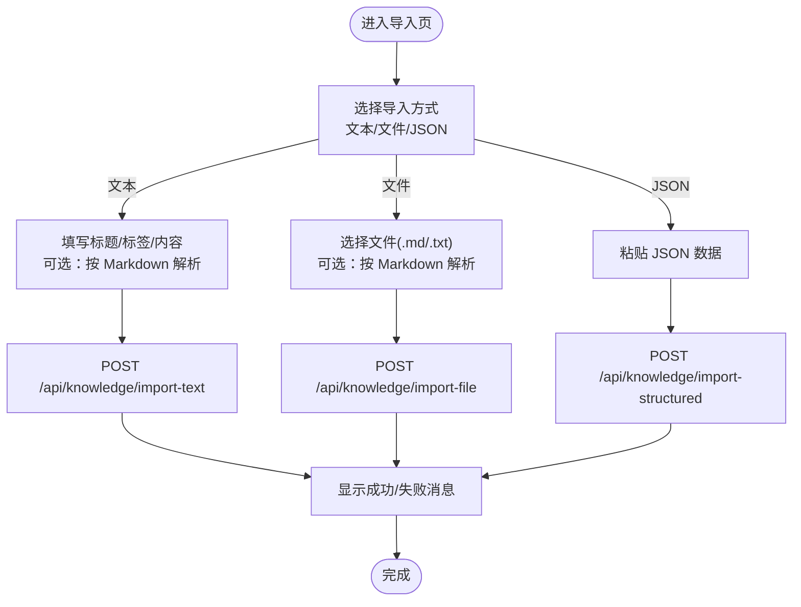
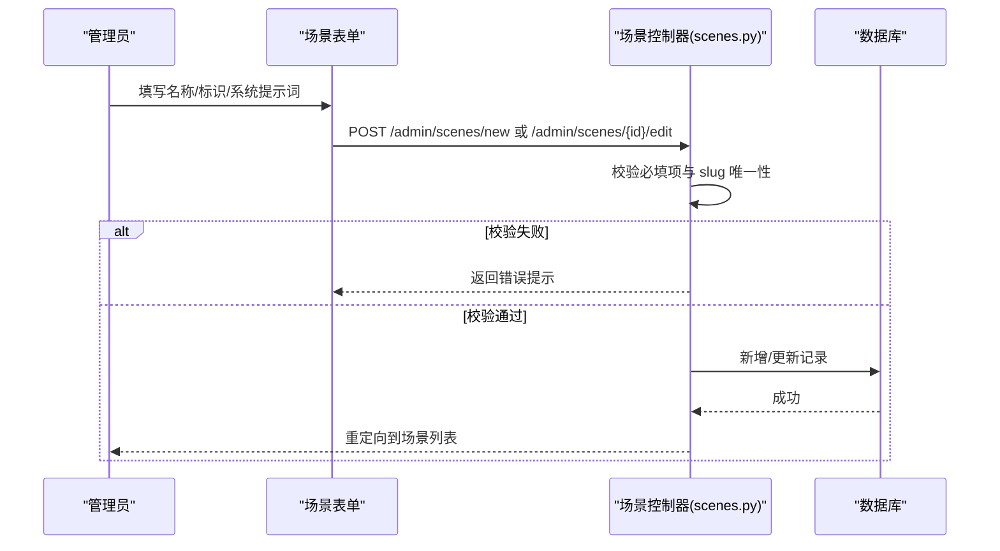
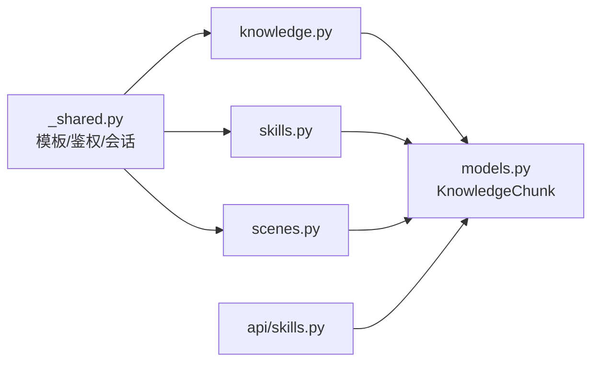

# 内容管理界面

<cite>
**本文引用的文件**   
- [hushai/meditation/admin/pages/knowledge.py](file://hushai/meditation/admin/pages/knowledge.py)
- [hushai/meditation/admin/pages/skills.py](file://hushai/meditation/admin/pages/skills.py)
- [hushai/meditation/admin/pages/scenes.py](file://hushai/meditation/admin/pages/scenes.py)
- [hushai/meditation/admin/pages/_shared.py](file://hushai/meditation/admin/pages/_shared.py)
- [hushai/meditation/db/models.py](file://hushai/meditation/db/models.py)
- [hushai/meditation/admin/templates/knowledge.html](file://hushai/meditation/admin/templates/knowledge.html)
- [hushai/meditation/admin/templates/knowledge_detail.html](file://hushai/meditation/admin/templates/knowledge_detail.html)
- [hushai/meditation/admin/templates/knowledge_import.html](file://hushai/meditation/admin/templates/knowledge_import.html)
- [hushai/meditation/admin/templates/skills.html](file://hushai/meditation/admin/templates/skills.html)
- [hushai/meditation/admin/templates/skill_form.html](file://hushai/meditation/admin/templates/skill_form.html)
- [hushai/meditation/admin/templates/skills_import.html](file://hushai/meditation/admin/templates/skills_import.html)
- [hushai/meditation/admin/templates/scenes.html](file://hushai/meditation/admin/templates/scenes.html)
- [hushai/meditation/admin/templates/scene_form.html](file://hushai/meditation/admin/templates/scene_form.html)
- [hushai/meditation/api/skills.py](file://hushai/meditation/api/skills.py)
</cite>

## 目录
1. [引言](#引言)
2. [项目结构](#项目结构)
3. [核心组件](#核心组件)
4. [架构总览](#架构总览)
5. [详细组件分析](#详细组件分析)
6. [依赖关系分析](#依赖关系分析)
7. [性能与可用性考虑](#性能与可用性考虑)
8. [故障排查指南](#故障排查指南)
9. [结论](#结论)
10. [附录：富文本编辑器集成方案](#附录：富文本编辑器集成方案)

## 引言
本设计文档面向 hush.ai 管理后台的内容管理功能，聚焦以下三大模块的界面设计与交互流程：
- 知识库管理：知识条目列表、详情查看、导入导出能力。
- 技能插件管理：技能列表展示、配置表单（新建/编辑）、批量导入。
- 场景管理：场景列表、场景配置（系统提示词、开场白等）与基础预览入口。

同时提供富文本编辑器集成建议（Markdown 支持、代码高亮、实时预览），并给出内容版本控制、审核与发布管理的扩展设计方案。

## 项目结构
管理后台采用 FastAPI + Jinja2 模板渲染的页面路由模式，各资源模块以“页面路由 + 模板”的方式组织，数据模型统一在 ORM 层定义。



图表来源
- [hushai/meditation/admin/pages/knowledge.py:1-163](file://hushai/meditation/admin/pages/knowledge.py#L1-L163)
- [hushai/meditation/admin/pages/skills.py:1-218](file://hushai/meditation/admin/pages/skills.py#L1-L218)
- [hushai/meditation/admin/pages/scenes.py:1-240](file://hushai/meditation/admin/pages/scenes.py#L1-L240)
- [hushai/meditation/admin/pages/_shared.py:1-110](file://hushai/meditation/admin/pages/_shared.py#L1-L110)
- [hushai/meditation/db/models.py:120-170](file://hushai/meditation/db/models.py#L120-L170)
- [hushai/meditation/api/skills.py:47-90](file://hushai/meditation/api/skills.py#L47-L90)

章节来源
- [hushai/meditation/admin/pages/knowledge.py:1-163](file://hushai/meditation/admin/pages/knowledge.py#L1-L163)
- [hushai/meditation/admin/pages/skills.py:1-218](file://hushai/meditation/admin/pages/skills.py#L1-L218)
- [hushai/meditation/admin/pages/scenes.py:1-240](file://hushai/meditation/admin/pages/scenes.py#L1-L240)
- [hushai/meditation/admin/pages/_shared.py:1-110](file://hushai/meditation/admin/pages/_shared.py#L1-L110)
- [hushai/meditation/db/models.py:120-170](file://hushai/meditation/db/models.py#L120-L170)
- [hushai/meditation/api/skills.py:47-90](file://hushai/meditation/api/skills.py#L47-L90)

## 核心组件
- 知识库管理
  - 列表页：搜索、分页、导出 CSV/Excel、导入入口、单条删除。
  - 详情页：标题、标签、元数据、父级关联、创建时间、分段索引等。
  - 导入页：文本导入（支持 Markdown 解析）、文件导入（.md/.txt）、结构化 JSON 导入。
- 技能插件管理
  - 列表页：搜索、分页、启用状态、排序权重、删除。
  - 表单页：新建/编辑（名称、摘要、正文、排序、启用）。
  - 批量导入：JSON 格式一次导入多条技能。
- 场景管理
  - 列表页：搜索、分页、唯一标识 slug、排序、启用状态、删除。
  - 表单页：新建/编辑（名称、slug、描述、系统提示词、开场白、排序、启用）。

章节来源
- [hushai/meditation/admin/templates/knowledge.html:1-142](file://hushai/meditation/admin/templates/knowledge.html#L1-L142)
- [hushai/meditation/admin/templates/knowledge_detail.html:1-157](file://hushai/meditation/admin/templates/knowledge_detail.html#L1-L157)
- [hushai/meditation/admin/templates/knowledge_import.html:1-493](file://hushai/meditation/admin/templates/knowledge_import.html#L1-L493)
- [hushai/meditation/admin/templates/skills.html:1-136](file://hushai/meditation/admin/templates/skills.html#L1-L136)
- [hushai/meditation/admin/templates/skill_form.html:1-82](file://hushai/meditation/admin/templates/skill_form.html#L1-L82)
- [hushai/meditation/admin/templates/skills_import.html:1-27](file://hushai/meditation/admin/templates/skills_import.html#L1-L27)
- [hushai/meditation/admin/templates/scenes.html:1-134](file://hushai/meditation/admin/templates/scenes.html#L1-L134)
- [hushai/meditation/admin/templates/scene_form.html:1-85](file://hushai/meditation/admin/templates/scene_form.html#L1-L85)

## 架构总览
管理后台采用“页面路由 + 模板渲染 + 异步数据库会话”的模式，所有页面均通过统一的鉴权中间件检查管理员登录态；数据访问基于 SQLAlchemy 异步会话。



图表来源
- [hushai/meditation/admin/pages/knowledge.py:22-71](file://hushai/meditation/admin/pages/knowledge.py#L22-L71)
- [hushai/meditation/admin/pages/_shared.py:73-96](file://hushai/meditation/admin/pages/_shared.py#L73-L96)
- [hushai/meditation/admin/templates/knowledge.html:1-45](file://hushai/meditation/admin/templates/knowledge.html#L1-L45)

## 详细组件分析

### 知识库管理界面
- 列表页
  - 顶部工具栏：搜索框（按标题/内容模糊匹配）、导出按钮（CSV/Excel）、导入入口。
  - 卡片网格：显示标题、内容片段、标签、创建时间与来源。
  - 分页：保留搜索参数，支持前后翻页与省略号折叠。
  - 删除：前端调用 DELETE /admin/api/knowledge/{id}，成功后移除卡片或刷新。
- 详情页
  - 面包屑导航、操作区（返回、编辑、删除）。
  - 展示标题、时间戳、分段索引、标签、元数据 JSON、父级条目链接。
- 导入页
  - 说明卡片：Markdown/RAG 背景说明。
  - 文本导入：支持粘贴 Markdown，勾选“按 Markdown 解析”。
  - 文件导入：支持 .md/.markdown/.txt，可标记为 Markdown。
  - 结构化导入：JSON 根节点支持 nodes/relationships 等结构。
  - 前端交互：使用 FormData 与 fetch 提交，错误信息回显。



图表来源
- [hushai/meditation/admin/templates/knowledge_import.html:30-123](file://hushai/meditation/admin/templates/knowledge_import.html#L30-L123)
- [hushai/meditation/admin/templates/knowledge_import.html:416-493](file://hushai/meditation/admin/templates/knowledge_import.html#L416-L493)

章节来源
- [hushai/meditation/admin/pages/knowledge.py:22-116](file://hushai/meditation/admin/pages/knowledge.py#L22-L116)
- [hushai/meditation/admin/pages/knowledge.py:119-163](file://hushai/meditation/admin/pages/knowledge.py#L119-L163)
- [hushai/meditation/admin/templates/knowledge.html:1-142](file://hushai/meditation/admin/templates/knowledge.html#L1-L142)
- [hushai/meditation/admin/templates/knowledge_detail.html:1-157](file://hushai/meditation/admin/templates/knowledge_detail.html#L1-L157)
- [hushai/meditation/admin/templates/knowledge_import.html:1-493](file://hushai/meditation/admin/templates/knowledge_import.html#L1-L493)

### 技能插件管理界面
- 列表页
  - 搜索：按名称/摘要模糊匹配。
  - 卡片：显示名称、摘要、正文片段、排序权重、启用状态、创建时间。
  - 操作：删除（确认对话框后调用 DELETE /admin/api/skills/{id}）。
- 表单页（新建/编辑）
  - 字段：名称（必填）、短摘要（前台展示）、技能正文（注入模型，必填）、排序、启用开关。
  - 校验：后端对空值进行校验，返回错误提示。
- 批量导入
  - 说明：JSON 根结构支持 {"skills": [...]} 或顶层数组 [...]，单次最多 100 条。
  - 字段：name、content（必填），description、sort_order、is_active（可选）。

```mermaid
classDiagram
class Skill {
+string id
+string name
+string description
+string content
+bool is_active
+int sort_order
+datetime created_at
+datetime updated_at
}
class SkillsController {
+GET "/admin/skills"
+GET "/admin/skills/new"
+POST "/admin/skills/new"
+GET "/admin/skills/{id}/edit"
+POST "/admin/skills/{id}/edit"
+DELETE "/admin/api/skills/{id}"
}
class SkillsImportAPI {
+GET "/admin/skills-import"
+POST "/api/skills/import"
}
SkillsController --> Skill : "CRUD"
SkillsImportAPI --> Skill : "批量创建"
```

图表来源
- [hushai/meditation/db/models.py:120-135](file://hushai/meditation/db/models.py#L120-L135)
- [hushai/meditation/admin/pages/skills.py:33-218](file://hushai/meditation/admin/pages/skills.py#L33-L218)
- [hushai/meditation/api/skills.py:47-90](file://hushai/meditation/api/skills.py#L47-L90)

章节来源
- [hushai/meditation/admin/pages/skills.py:33-218](file://hushai/meditation/admin/pages/skills.py#L33-L218)
- [hushai/meditation/admin/templates/skills.html:1-136](file://hushai/meditation/admin/templates/skills.html#L1-L136)
- [hushai/meditation/admin/templates/skill_form.html:1-82](file://hushai/meditation/admin/templates/skill_form.html#L1-L82)
- [hushai/meditation/admin/templates/skills_import.html:1-27](file://hushai/meditation/admin/templates/skills_import.html#L1-L27)
- [hushai/meditation/api/skills.py:47-90](file://hushai/meditation/api/skills.py#L47-L90)

### 场景管理界面
- 列表页
  - 搜索：按名称/描述模糊匹配。
  - 卡片：显示名称、描述、唯一标识 slug、排序权重、启用状态、创建时间。
  - 操作：删除（确认后调用 DELETE /admin/api/scenes/{id}）。
- 表单页（新建/编辑）
  - 字段：名称（必填）、唯一标识 slug（必填，小写字母/数字/下划线/横线，唯一性校验）、描述、系统提示词（必填）、开场白、排序权重、启用开关。
  - 校验：后端对必填项与 slug 唯一性进行校验，返回错误提示。



图表来源
- [hushai/meditation/admin/pages/scenes.py:76-132](file://hushai/meditation/admin/pages/scenes.py#L76-L132)
- [hushai/meditation/admin/pages/scenes.py:158-217](file://hushai/meditation/admin/pages/scenes.py#L158-L217)
- [hushai/meditation/admin/templates/scene_form.html:21-84](file://hushai/meditation/admin/templates/scene_form.html#L21-L84)

章节来源
- [hushai/meditation/admin/pages/scenes.py:17-240](file://hushai/meditation/admin/pages/scenes.py#L17-L240)
- [hushai/meditation/admin/templates/scenes.html:1-134](file://hushai/meditation/admin/templates/scenes.html#L1-L134)
- [hushai/meditation/admin/templates/scene_form.html:1-85](file://hushai/meditation/admin/templates/scene_form.html#L1-L85)

## 依赖关系分析
- 页面路由依赖
  - 统一模板引擎：Jinja2Templates 实例由 _shared.py 初始化，供各页面渲染。
  - 鉴权依赖：get_admin_from_request 用于判断管理员登录态，未登录则重定向至登录页。
  - 数据库会话：get_session 提供异步会话，用于查询与写入。
- 数据模型依赖
  - Skill、KnowledgeChunk、Scene 三个实体分别对应技能、知识片段、场景配置。
- 外部 API 依赖
  - 技能公开接口与批量导入接口位于 api/skills.py，供前台或其他服务调用。



图表来源
- [hushai/meditation/admin/pages/_shared.py:23-32](file://hushai/meditation/admin/pages/_shared.py#L23-L32)
- [hushai/meditation/admin/pages/knowledge.py:10-18](file://hushai/meditation/admin/pages/knowledge.py#L10-L18)
- [hushai/meditation/admin/pages/skills.py:10-13](file://hushai/meditation/admin/pages/skills.py#L10-L13)
- [hushai/meditation/admin/pages/scenes.py:10-13](file://hushai/meditation/admin/pages/scenes.py#L10-L13)
- [hushai/meditation/db/models.py:120-170](file://hushai/meditation/db/models.py#L120-L170)
- [hushai/meditation/api/skills.py:47-90](file://hushai/meditation/api/skills.py#L47-L90)

章节来源
- [hushai/meditation/admin/pages/_shared.py:1-110](file://hushai/meditation/admin/pages/_shared.py#L1-L110)
- [hushai/meditation/db/models.py:120-170](file://hushai/meditation/db/models.py#L120-L170)
- [hushai/meditation/api/skills.py:47-90](file://hushai/meditation/api/skills.py#L47-L90)

## 性能与可用性考虑
- 列表查询优化
  - 使用 count 子查询与 offset/limit 实现分页，避免全表扫描。
  - 搜索条件使用 ilike 模糊匹配，建议在 title/description/content 上建立索引以提升检索性能。
- 表单校验与长度限制
  - 后端对 name、slug、description 等进行长度截断与必填校验，减少无效数据入库。
- 前端交互体验
  - 删除前二次确认，避免误删。
  - 导入页提供清晰的成功/失败反馈，便于快速定位问题。
- 可扩展性
  - 模板与路由解耦，便于后续引入富文本编辑器与更多导入格式。

[本节为通用指导，不直接分析具体文件]

## 故障排查指南
- 未登录访问
  - 现象：跳转到登录页或返回 401。
  - 原因：get_admin_from_request 未识别管理员会话。
  - 处理：确认已正确登录且会话有效。
- 数据不存在
  - 现象：详情页或编辑页返回 404。
  - 原因：ID 不存在或已被删除。
  - 处理：核对 URL 中的 ID 是否正确。
- 表单校验失败
  - 现象：返回 400 并显示错误提示。
  - 原因：必填字段为空或 slug 重复。
  - 处理：根据提示修正输入。
- 导入失败
  - 现象：导入页显示错误消息。
  - 原因：文件格式不正确、JSON 语法错误或网络异常。
  - 处理：检查文件格式与 JSON 结构，重试或修正数据。

章节来源
- [hushai/meditation/admin/pages/_shared.py:73-96](file://hushai/meditation/admin/pages/_shared.py#L73-L96)
- [hushai/meditation/admin/pages/knowledge.py:86-98](file://hushai/meditation/admin/pages/knowledge.py#L86-L98)
- [hushai/meditation/admin/pages/skills.py:108-118](file://hushai/meditation/admin/pages/skills.py#L108-L118)
- [hushai/meditation/admin/pages/scenes.py:95-119](file://hushai/meditation/admin/pages/scenes.py#L95-L119)
- [hushai/meditation/admin/templates/knowledge_import.html:416-493](file://hushai/meditation/admin/templates/knowledge_import.html#L416-L493)

## 结论
当前管理后台已具备知识库、技能与场景三大内容管理能力的基础界面与后端支撑，覆盖列表、详情、导入导出、批量导入与基本校验。后续可在现有基础上增强富文本编辑、版本控制、审核与发布流程，进一步提升内容生产与治理效率。

[本节为总结性内容，不直接分析具体文件]

## 附录：富文本编辑器集成方案
目标
- 在技能正文与场景系统提示词等长文本区域集成富文本编辑器。
- 支持 Markdown 语法、代码高亮与实时预览。
- 保持与现有表单字段兼容，确保后端接收内容与长度限制不变。

推荐方案
- 编辑器选型
  - TinyMCE：内置 Markdown 插件、代码高亮（CodeMirror 插件）、实时预览（Preview 插件），易于嵌入。
  - 替代方案：Quill（需额外插件）、Editor.md（原生 Markdown 支持）。
- 集成步骤
  - 在表单页引入编辑器 JS/CSS。
  - 将 textarea 替换为编辑器容器，绑定 data 属性映射到原表单字段。
  - 提交时从编辑器获取 Markdown 源文本，保持后端字段名不变。
- 预览与高亮
  - 启用 Preview 插件实现实时预览。
  - 启用 CodeMirror 插件实现代码块高亮。
- 安全与校验
  - 后端继续执行长度与必填校验。
  - 如需允许 HTML，应增加白名单过滤；若仅 Markdown，保持纯文本存储。
- 用户体验
  - 提供“切换视图”按钮（编辑/预览）。
  - 保存草稿与自动保存（可选）。

[本节为概念性方案，不直接分析具体文件]