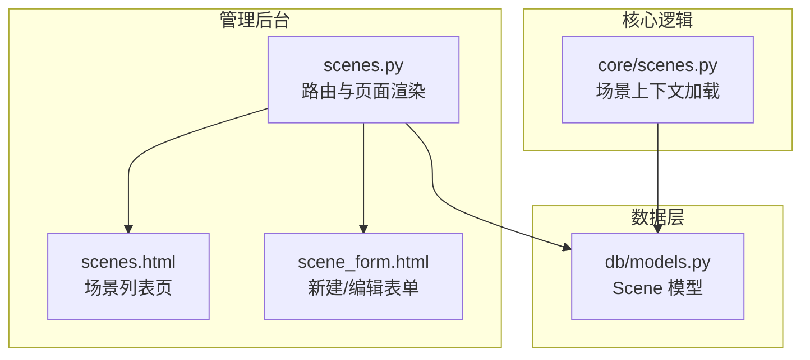
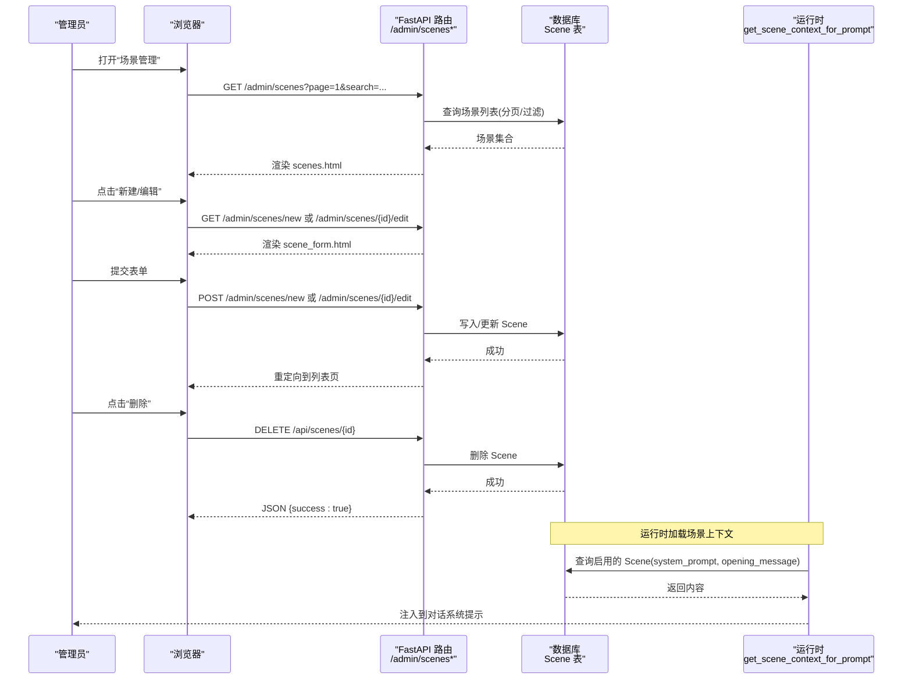
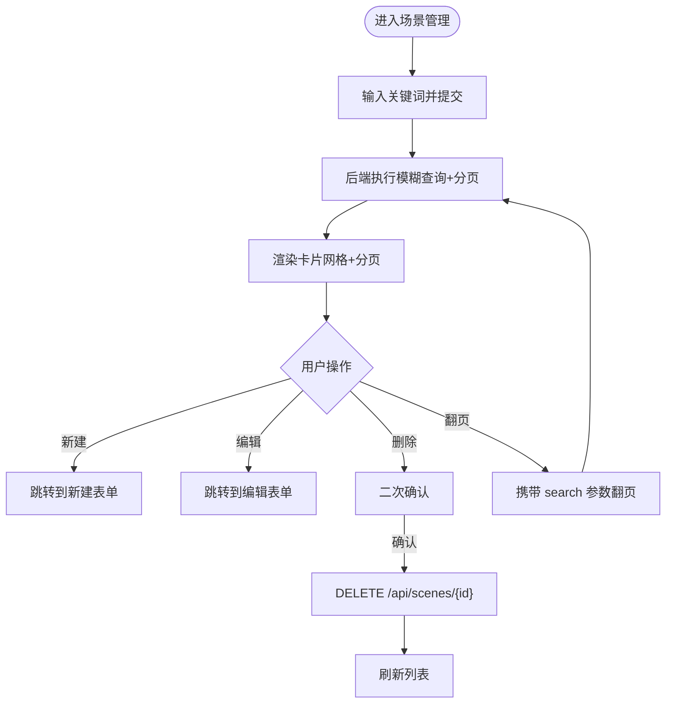
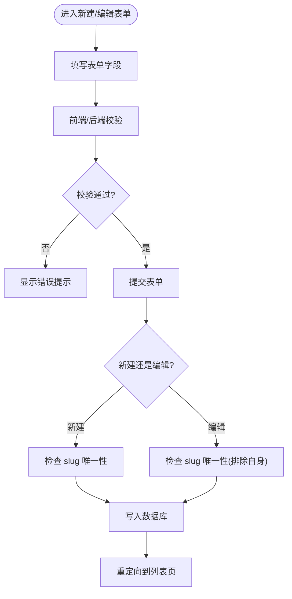
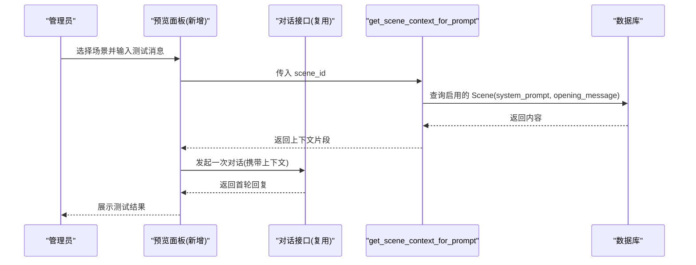
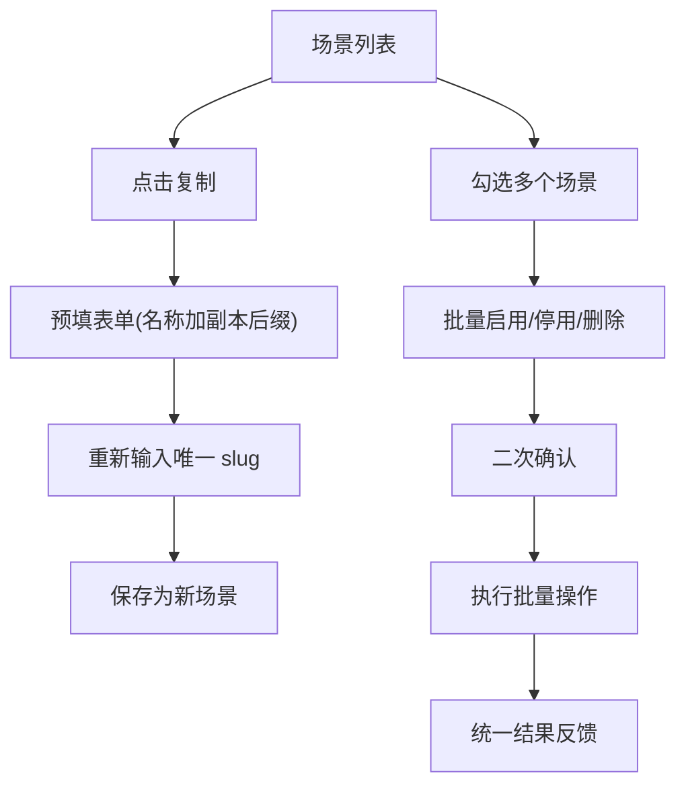
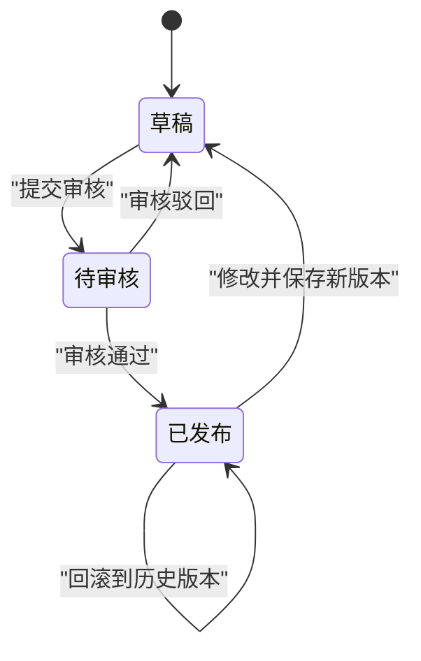
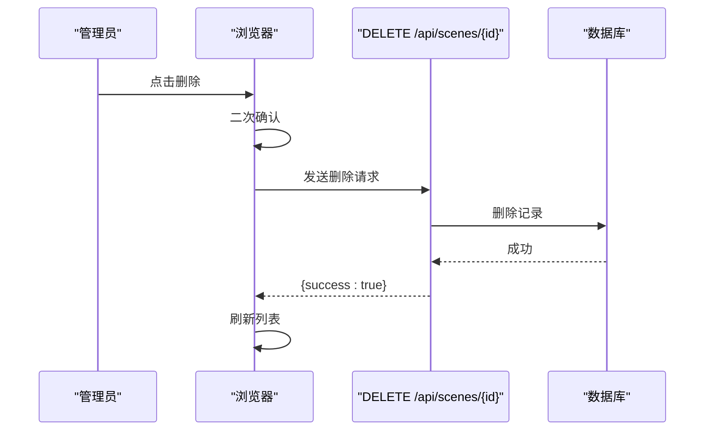
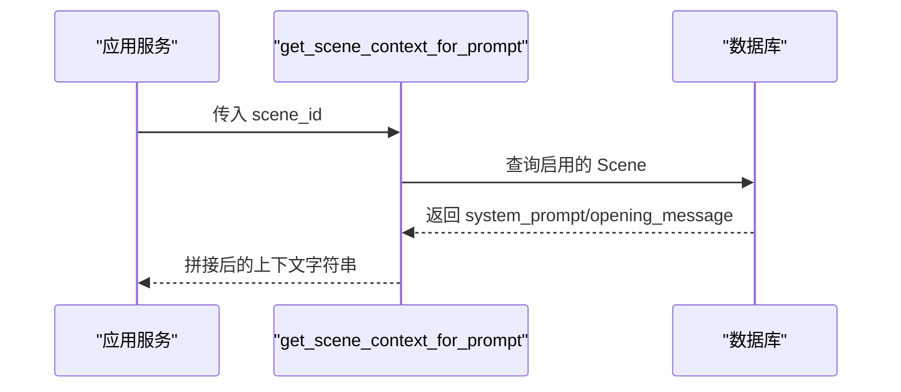

# 场景管理界面

<cite>
**本文引用的文件**   
- [hushai/meditation/admin/pages/scenes.py](file://hushai/meditation/admin/pages/scenes.py)
- [hushai/meditation/admin/templates/scenes.html](file://hushai/meditation/admin/templates/scenes.html)
- [hushai/meditation/admin/templates/scene_form.html](file://hushai/meditation/admin/templates/scene_form.html)
- [hushai/core/scenes.py](file://hushai/core/scenes.py)
- [hushai/meditation/db/models.py](file://hushai/meditation/db/models.py)
</cite>

## 目录
1. [简介](#简介)
2. [项目结构](#项目结构)
3. [核心组件](#核心组件)
4. [架构总览](#架构总览)
5. [详细组件分析](#详细组件分析)
6. [依赖关系分析](#依赖关系分析)
7. [性能与可用性建议](#性能与可用性建议)
8. [故障排查指南](#故障排查指南)
9. [结论](#结论)
10. [附录：交互流程与时序图](#附录交互流程与时序图)

## 简介
本文件为 hush.ai 管理后台“场景管理”功能的界面设计文档，覆盖以下范围：
- 场景列表页布局：卡片展示、搜索筛选、分页、状态标识
- 场景配置表单：名称、唯一标识、描述、系统提示词、开场白、排序权重、启用开关
- 场景预览与测试：基于现有能力的实时对话模拟与效果验证方案
- 复制、模板管理与批量操作：在现有能力基础上的扩展设计与交互建议
- 发布流程、版本控制与回滚：面向生产安全的版本化与回滚机制的界面交互建议

说明：本文严格依据仓库中已实现的页面与后端接口进行梳理，并对尚未实现但需求明确的功能给出可落地的界面设计方案。

## 项目结构
与场景管理相关的代码主要分布在以下位置：
- 管理后台路由与页面渲染：admin/pages/scenes.py
- 管理后台模板：admin/templates/scenes.html、admin/templates/scene_form.html
- 运行时场景上下文加载：core/scenes.py
- 数据模型定义：meditation/db/models.py



图表来源
- [hushai/meditation/admin/pages/scenes.py:17-60](file://hushai/meditation/admin/pages/scenes.py#L17-L60)
- [hushai/meditation/admin/templates/scenes.html:1-134](file://hushai/meditation/admin/templates/scenes.html#L1-L134)
- [hushai/meditation/admin/templates/scene_form.html:1-85](file://hushai/meditation/admin/templates/scene_form.html#L1-L85)
- [hushai/core/scenes.py:11-30](file://hushai/core/scenes.py#L11-L30)
- [hushai/meditation/db/models.py:153-170](file://hushai/meditation/db/models.py#L153-L170)

章节来源
- [hushai/meditation/admin/pages/scenes.py:17-60](file://hushai/meditation/admin/pages/scenes.py#L17-L60)
- [hushai/meditation/admin/templates/scenes.html:1-134](file://hushai/meditation/admin/templates/scenes.html#L1-L134)
- [hushai/meditation/admin/templates/scene_form.html:1-85](file://hushai/meditation/admin/templates/scene_form.html#L1-L85)
- [hushai/core/scenes.py:11-30](file://hushai/core/scenes.py#L11-L30)
- [hushai/meditation/db/models.py:153-170](file://hushai/meditation/db/models.py#L153-L170)

## 核心组件
- 场景列表页（GET /admin/scenes）
  - 支持按名称或描述模糊搜索
  - 按 sort_order 升序、created_at 降序排列
  - 分页显示，默认每页 20 条
  - 卡片展示：名称、描述、slug、排序、启用状态、创建日期
  - 提供删除按钮（DELETE /api/scenes/{id}）
- 场景新建/编辑表单（GET /admin/scenes/new、POST /admin/scenes/new；GET /admin/scenes/{id}/edit、POST /admin/scenes/{id}/edit）
  - 字段：名称、唯一标识 slug、描述、系统提示词、开场白、排序权重、是否启用
  - 校验：必填项、slug 唯一性、长度限制
- 场景上下文加载（运行时注入系统提示）
  - 根据 scene_id 查询启用的场景，拼接 system_prompt 与 opening_message 作为上下文注入

章节来源
- [hushai/meditation/admin/pages/scenes.py:17-60](file://hushai/meditation/admin/pages/scenes.py#L17-L60)
- [hushai/meditation/admin/pages/scenes.py:76-132](file://hushai/meditation/admin/pages/scenes.py#L76-L132)
- [hushai/meditation/admin/pages/scenes.py:135-217](file://hushai/meditation/admin/pages/scenes.py#L135-L217)
- [hushai/meditation/admin/pages/scenes.py:220-240](file://hushai/meditation/admin/pages/scenes.py#L220-L240)
- [hushai/core/scenes.py:11-30](file://hushai/core/scenes.py#L11-L30)
- [hushai/meditation/db/models.py:153-170](file://hushai/meditation/db/models.py#L153-L170)

## 架构总览
场景管理的前端页面由 FastAPI 路由渲染 Jinja2 模板，用户通过浏览器发起请求，后端从数据库读取 Scene 记录并返回 HTML。运行时，系统根据所选场景 ID 动态加载启用的场景提示词，用于对话生成。



图表来源
- [hushai/meditation/admin/pages/scenes.py:17-60](file://hushai/meditation/admin/pages/scenes.py#L17-L60)
- [hushai/meditation/admin/pages/scenes.py:76-132](file://hushai/meditation/admin/pages/scenes.py#L76-L132)
- [hushai/meditation/admin/pages/scenes.py:135-217](file://hushai/meditation/admin/pages/scenes.py#L135-L217)
- [hushai/meditation/admin/pages/scenes.py:220-240](file://hushai/meditation/admin/pages/scenes.py#L220-L240)
- [hushai/core/scenes.py:11-30](file://hushai/core/scenes.py#L11-L30)
- [hushai/meditation/db/models.py:153-170](file://hushai/meditation/db/models.py#L153-L170)

## 详细组件分析

### 场景列表页（布局与交互）
- 顶部工具栏
  - 搜索框：支持按名称或描述模糊匹配，提交后刷新列表
  - 统计信息：显示总数
  - 新建按钮：跳转至新建表单
- 卡片网格
  - 每张卡片包含：标题（可点击进入编辑）、描述、slug、排序权重、启用/停用标签、创建日期
  - 删除按钮：触发二次确认，调用删除接口
- 分页控件
  - 支持前后翻页与页码跳转，保留搜索参数
- 空状态
  - 无数据时展示引导文案与“新建场景”入口



图表来源
- [hushai/meditation/admin/templates/scenes.html:14-98](file://hushai/meditation/admin/templates/scenes.html#L14-L98)
- [hushai/meditation/admin/templates/scenes.html:112-133](file://hushai/meditation/admin/templates/scenes.html#L112-L133)
- [hushai/meditation/admin/pages/scenes.py:17-60](file://hushai/meditation/admin/pages/scenes.py#L17-L60)
- [hushai/meditation/admin/pages/scenes.py:220-240](file://hushai/meditation/admin/pages/scenes.py#L220-L240)

章节来源
- [hushai/meditation/admin/templates/scenes.html:14-98](file://hushai/meditation/admin/templates/scenes.html#L14-L98)
- [hushai/meditation/admin/templates/scenes.html:112-133](file://hushai/meditation/admin/templates/scenes.html#L112-L133)
- [hushai/meditation/admin/pages/scenes.py:17-60](file://hushai/meditation/admin/pages/scenes.py#L17-L60)
- [hushai/meditation/admin/pages/scenes.py:220-240](file://hushai/meditation/admin/pages/scenes.py#L220-L240)

### 场景配置表单（新建/编辑）
- 字段说明
  - 场景名称：必填，最大长度 128
  - 唯一标识 slug：必填，仅允许小写字母、数字、下划线和横线，不可重复
  - 场景描述：可选，最大长度 512
  - 系统提示词：必填，多行文本，将直接注入 AI 的系统提示
  - 开场白：可选，多行文本，作为对话初始问候参考
  - 排序权重：整数，影响列表排序
  - 启用开关：布尔值，控制是否参与运行时上下文加载
- 校验与错误提示
  - 必填项为空时返回错误提示
  - slug 重复时返回冲突提示
  - 编辑时排除自身进行唯一性校验
- 保存行为
  - 新建成功后重定向到列表页
  - 编辑成功后重定向到列表页



图表来源
- [hushai/meditation/admin/templates/scene_form.html:23-81](file://hushai/meditation/admin/templates/scene_form.html#L23-L81)
- [hushai/meditation/admin/pages/scenes.py:76-132](file://hushai/meditation/admin/pages/scenes.py#L76-L132)
- [hushai/meditation/admin/pages/scenes.py:158-217](file://hushai/meditation/admin/pages/scenes.py#L158-L217)

章节来源
- [hushai/meditation/admin/templates/scene_form.html:23-81](file://hushai/meditation/admin/templates/scene_form.html#L23-L81)
- [hushai/meditation/admin/pages/scenes.py:76-132](file://hushai/meditation/admin/pages/scenes.py#L76-L132)
- [hushai/meditation/admin/pages/scenes.py:158-217](file://hushai/meditation/admin/pages/scenes.py#L158-L217)

### 场景预览与测试（实时对话模拟与效果验证）
当前仓库未提供专门的“场景预览”页面，但可通过以下方式实现：
- 基于现有运行时的上下文加载能力，构造一次对话请求，使用目标场景的 system_prompt 与 opening_message 注入系统提示，观察首轮输出是否符合预期
- 在管理后台新增“预览/测试”入口，选择场景后以固定问题或用户输入发起一次对话，展示结果，便于快速验证提示词质量



图表来源
- [hushai/core/scenes.py:11-30](file://hushai/core/scenes.py#L11-L30)
- [hushai/meditation/db/models.py:153-170](file://hushai/meditation/db/models.py#L153-L170)

章节来源
- [hushai/core/scenes.py:11-30](file://hushai/core/scenes.py#L11-L30)
- [hushai/meditation/db/models.py:153-170](file://hushai/meditation/db/models.py#L153-L170)

### 场景复制、模板管理与批量操作（扩展设计）
当前仓库未提供这些功能，以下为界面与交互建议：
- 场景复制
  - 在列表卡片增加“复制”按钮，点击后自动填充表单（名称追加副本标记），slug 需重新输入
- 模板管理
  - 新增“模板库”页面，维护常用 system_prompt 与 opening_message 组合
  - 在场景表单内提供“从模板导入”下拉选择，一键填充
- 批量操作
  - 列表增加复选框，支持批量启用/停用、批量删除
  - 批量操作前弹出确认对话框，完成后统一反馈结果



[此图为概念设计，不映射具体源码，故无图表来源]

### 发布流程、版本控制与回滚机制（扩展设计）
当前仓库未提供版本化与回滚能力，以下为界面与交互建议：
- 版本化
  - 每次保存场景时生成版本号（如 v1、v2），并在场景详情中展示历史版本列表
  - 支持“设为活跃版本”，运行时仅加载活跃版本的 system_prompt 与 opening_message
- 发布流程
  - 新增“草稿/待审/已发布”状态流转，配合审批流（可选）
  - 发布前提供“差异对比”视图，高亮变更字段
- 回滚机制
  - 在版本列表中提供“回滚到此版本”按钮，确认后替换当前活跃版本
  - 所有发布与回滚操作记录审计日志



[此图为概念设计，不映射具体源码，故无图表来源]

## 依赖关系分析
- 页面与路由
  - scenes.html 由 /admin/scenes 路由渲染
  - scene_form.html 由 /admin/scenes/new 与 /admin/scenes/{id}/edit 路由渲染
- 数据模型
  - Scene 模型定义了场景的核心字段与索引
- 运行时加载
  - get_scene_context_for_prompt 负责在运行时加载启用的场景上下文

```mermaid
classDiagram
class Scene {
+string id
+string name
+string slug
+string description
+string system_prompt
+string opening_message
+bool is_active
+int sort_order
+datetime created_at
+datetime updated_at
}
class ScenesRouter {
+GET "/admin/scenes"
+GET "/admin/scenes/new"
+POST "/admin/scenes/new"
+GET "/admin/scenes/{id}/edit"
+POST "/admin/scenes/{id}/edit"
+DELETE "/api/scenes/{id}"
}
class ContextLoader {
+get_scene_context_for_prompt(session, scene_id) string
}
ScenesRouter --> Scene : "读写"
ContextLoader --> Scene : "读取(仅启用)"
```

图表来源
- [hushai/meditation/db/models.py:153-170](file://hushai/meditation/db/models.py#L153-L170)
- [hushai/meditation/admin/pages/scenes.py:17-60](file://hushai/meditation/admin/pages/scenes.py#L17-L60)
- [hushai/meditation/admin/pages/scenes.py:76-132](file://hushai/meditation/admin/pages/scenes.py#L76-L132)
- [hushai/meditation/admin/pages/scenes.py:135-217](file://hushai/meditation/admin/pages/scenes.py#L135-L217)
- [hushai/meditation/admin/pages/scenes.py:220-240](file://hushai/meditation/admin/pages/scenes.py#L220-L240)
- [hushai/core/scenes.py:11-30](file://hushai/core/scenes.py#L11-L30)

章节来源
- [hushai/meditation/db/models.py:153-170](file://hushai/meditation/db/models.py#L153-L170)
- [hushai/meditation/admin/pages/scenes.py:17-60](file://hushai/meditation/admin/pages/scenes.py#L17-L60)
- [hushai/meditation/admin/pages/scenes.py:76-132](file://hushai/meditation/admin/pages/scenes.py#L76-L132)
- [hushai/meditation/admin/pages/scenes.py:135-217](file://hushai/meditation/admin/pages/scenes.py#L135-L217)
- [hushai/meditation/admin/pages/scenes.py:220-240](file://hushai/meditation/admin/pages/scenes.py#L220-L240)
- [hushai/core/scenes.py:11-30](file://hushai/core/scenes.py#L11-L30)

## 性能与可用性建议
- 列表查询优化
  - 当前使用 ilike 模糊匹配，建议在 name 与 description 上建立合适的索引以提升检索性能
  - 分页 limit 默认 20，可根据业务量调整
- 表单校验
  - 前端增加即时校验与占位提示，减少无效提交
  - slug 唯一性校验在后端完成，前端可异步检测占用情况
- 删除安全
  - 删除前二次确认已在列表页实现，建议增加软删除或归档策略，避免误删导致的数据丢失
- 预览体验
  - 预览面板应缓存最近使用的测试用例，提升反复调试效率
  - 对长提示词提供折叠/展开与语法高亮（可选）

[本节为通用建议，不直接分析具体文件，故无章节来源]

## 故障排查指南
- 无法访问场景管理页面
  - 检查管理员登录态是否正确
  - 确认路由注册与权限校验逻辑
- 场景保存失败
  - 检查必填字段是否为空
  - 检查 slug 是否重复
  - 查看后端返回的错误提示
- 删除失败
  - 检查网络请求是否成功
  - 查看后端返回的 detail 信息
- 运行时未生效
  - 确认场景 is_active 为真
  - 确认运行时传入的 scene_id 正确

章节来源
- [hushai/meditation/admin/pages/scenes.py:76-132](file://hushai/meditation/admin/pages/scenes.py#L76-L132)
- [hushai/meditation/admin/pages/scenes.py:158-217](file://hushai/meditation/admin/pages/scenes.py#L158-L217)
- [hushai/meditation/admin/pages/scenes.py:220-240](file://hushai/meditation/admin/pages/scenes.py#L220-L240)
- [hushai/core/scenes.py:11-30](file://hushai/core/scenes.py#L11-L30)

## 结论
当前仓库已实现场景管理的核心能力：列表展示、搜索分页、新建/编辑与删除，以及运行时场景上下文的加载。为满足更完善的运营与协作需求，建议逐步引入预览测试、模板管理、批量操作与版本控制等能力，并通过清晰的界面交互与严格的校验保障数据安全与用户体验。

[本节为总结性内容，不直接分析具体文件，故无章节来源]

## 附录：交互流程与时序图

### 场景列表删除流程


图表来源
- [hushai/meditation/admin/templates/scenes.html:112-133](file://hushai/meditation/admin/templates/scenes.html#L112-L133)
- [hushai/meditation/admin/pages/scenes.py:220-240](file://hushai/meditation/admin/pages/scenes.py#L220-L240)

### 场景上下文加载流程


图表来源
- [hushai/core/scenes.py:11-30](file://hushai/core/scenes.py#L11-L30)
- [hushai/meditation/db/models.py:153-170](file://hushai/meditation/db/models.py#L153-L170)