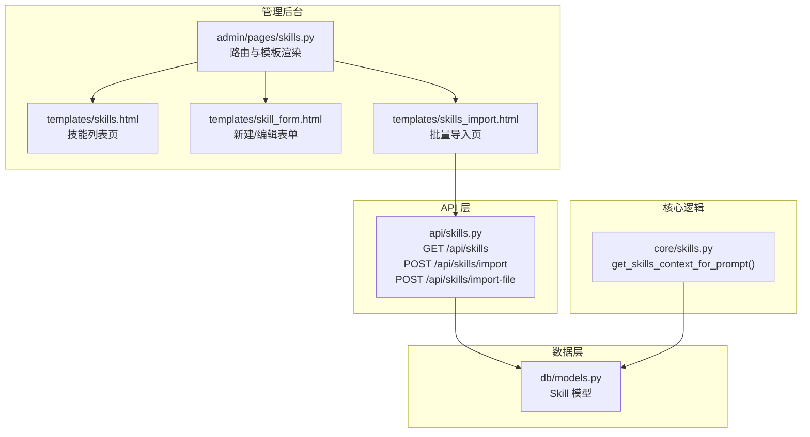
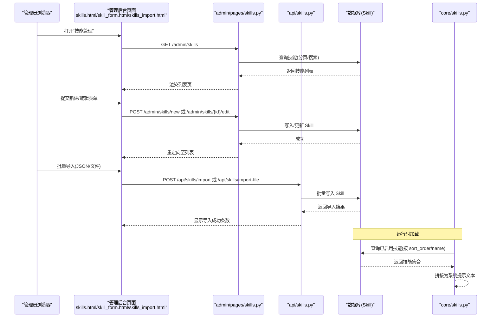
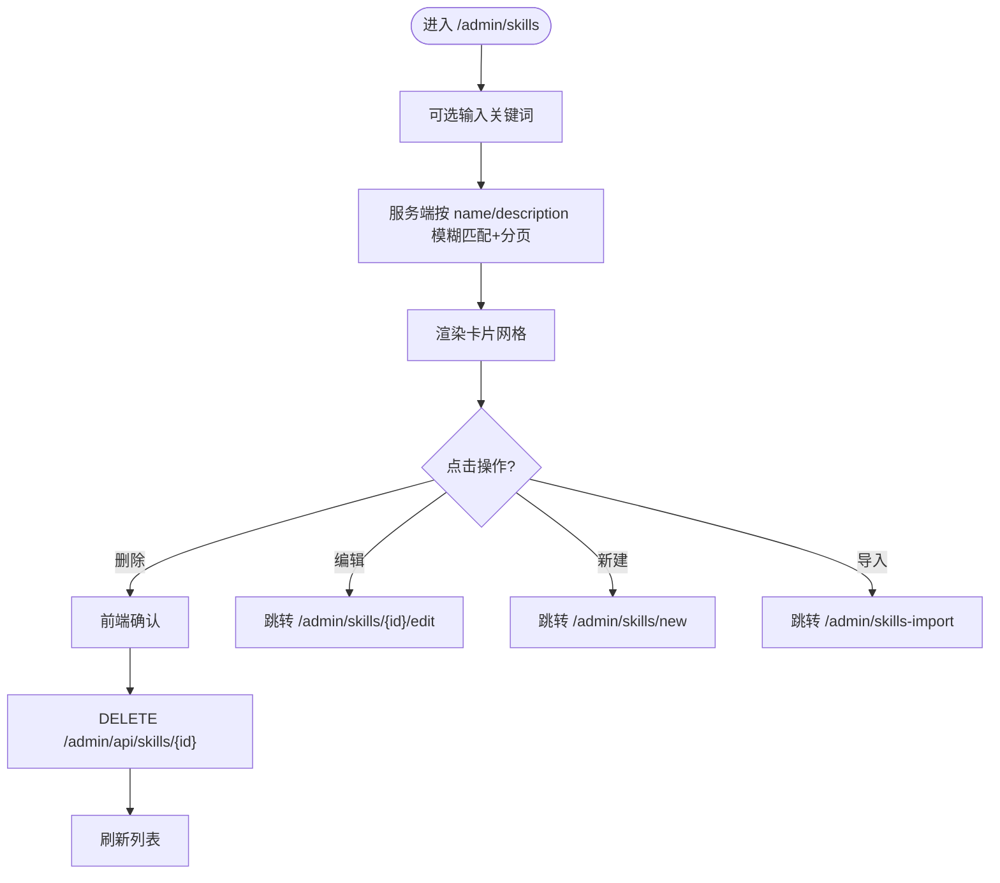
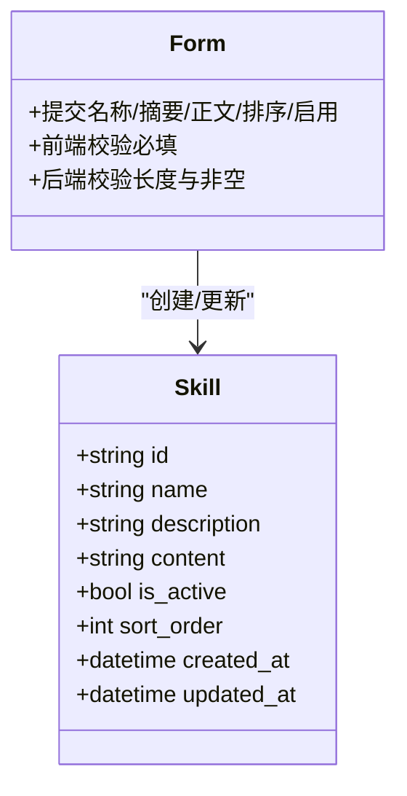
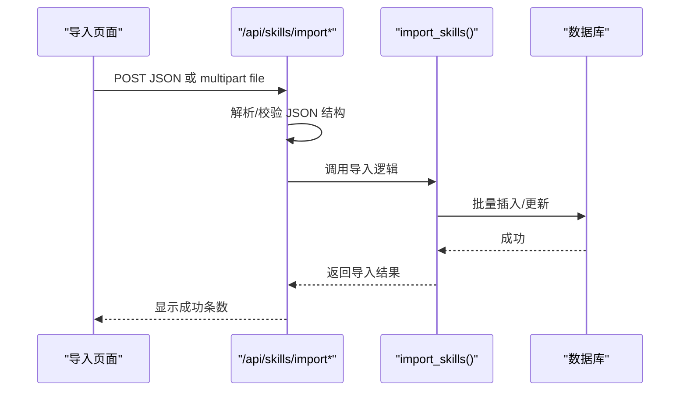
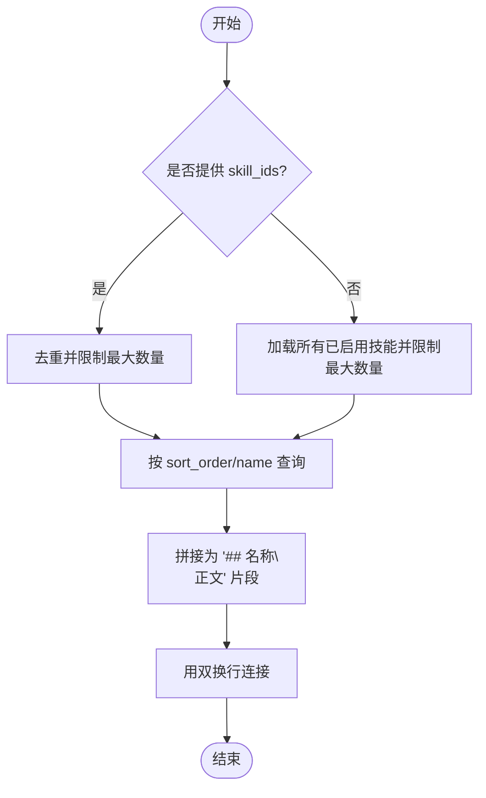
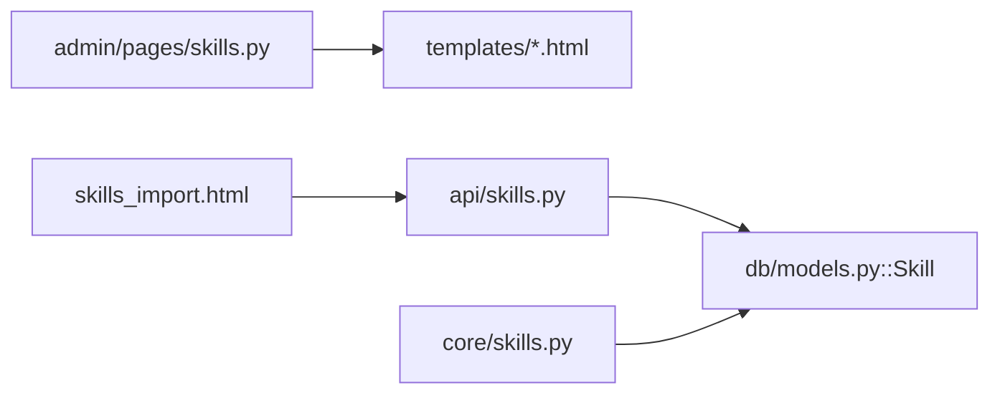

# 技能插件管理界面

<cite>
**本文引用的文件**   
- [hushai/meditation/admin/pages/skills.py](file://hushai/meditation/admin/pages/skills.py)
- [hushai/meditation/admin/templates/skills.html](file://hushai/meditation/admin/templates/skills.html)
- [hushai/meditation/admin/templates/skill_form.html](file://hushai/meditation/admin/templates/skill_form.html)
- [hushai/meditation/admin/templates/skills_import.html](file://hushai/meditation/admin/templates/skills_import.html)
- [hushai/meditation/api/skills.py](file://hushai/meditation/api/skills.py)
- [hushai/meditation/core/skills.py](file://hushai/meditation/core/skills.py)
- [hushai/meditation/db/models.py](file://hushai/meditation/db/models.py)
</cite>

## 目录
1. [简介](#简介)
2. [项目结构](#项目结构)
3. [核心组件](#核心组件)
4. [架构总览](#架构总览)
5. [详细组件分析](#详细组件分析)
6. [依赖关系分析](#依赖关系分析)
7. [性能与可用性考虑](#性能与可用性考虑)
8. [故障排查指南](#故障排查指南)
9. [结论](#结论)
10. [附录：字段与交互规范](#附录字段与交互规范)

## 简介
本设计文档面向 hush.ai 管理后台的“技能插件管理”功能，覆盖以下关键界面与流程：
- 技能列表页：卡片式展示、状态标识、分页与搜索、删除操作。
- 技能配置表单：新建/编辑、启用/禁用、排序、内容注入说明。
- 批量导入：JSON 粘贴与文件上传、格式校验、批量处理反馈。
- 运行时集成：前台按 ID 选择已启用的技能，动态拼入系统提示。
- 扩展建议：版本管理、依赖检查、效果评估与使用统计、性能监控（以概念性方案呈现）。

## 项目结构
围绕“技能插件管理”的前后端相关文件如下：
- 管理页面路由与模板：admin/pages/skills.py、templates/skills.html、skill_form.html、skills_import.html
- 公开 API 与鉴权：api/skills.py
- 运行时技能加载逻辑：core/skills.py
- 数据模型：db/models.py

图表来源
- [hushai/meditation/admin/pages/skills.py:1-218](file://hushai/meditation/admin/pages/skills.py#L1-L218)
- [hushai/meditation/admin/templates/skills.html:1-136](file://hushai/meditation/admin/templates/skills.html#L1-L136)
- [hushai/meditation/admin/templates/skill_form.html:1-82](file://hushai/meditation/admin/templates/skill_form.html#L1-L82)
- [hushai/meditation/admin/templates/skills_import.html:1-227](file://hushai/meditation/admin/templates/skills_import.html#L1-L227)
- [hushai/meditation/api/skills.py:1-113](file://hushai/meditation/api/skills.py#L1-L113)
- [hushai/meditation/core/skills.py:1-59](file://hushai/meditation/core/skills.py#L1-L59)
- [hushai/meditation/db/models.py:120-135](file://hushai/meditation/db/models.py#L120-L135)

章节来源
- [hushai/meditation/admin/pages/skills.py:1-218](file://hushai/meditation/admin/pages/skills.py#L1-L218)
- [hushai/meditation/admin/templates/skills.html:1-136](file://hushai/meditation/admin/templates/skills.html#L1-L136)
- [hushai/meditation/admin/templates/skill_form.html:1-82](file://hushai/meditation/admin/templates/skill_form.html#L1-L82)
- [hushai/meditation/admin/templates/skills_import.html:1-227](file://hushai/meditation/admin/templates/skills_import.html#L1-L227)
- [hushai/meditation/api/skills.py:1-113](file://hushai/meditation/api/skills.py#L1-L113)
- [hushai/meditation/core/skills.py:1-59](file://hushai/meditation/core/skills.py#L1-L59)
- [hushai/meditation/db/models.py:120-135](file://hushai/meditation/db/models.py#L120-L135)

## 核心组件
- 技能数据模型 Skill：包含 id、name、description、content、is_active、sort_order、created_at、updated_at。用于持久化技能元信息与正文。
- 管理后台路由：提供列表、新建、编辑、删除等页面与接口；支持搜索与分页。
- 批量导入 API：支持 JSON Body 与 multipart 文件上传两种形式，统一走同一入库逻辑。
- 运行时加载器：根据用户选择的 skill_ids 或默认全部已启用技能，拼接为系统提示文本，限制单次最大数量。

章节来源
- [hushai/meditation/db/models.py:120-135](file://hushai/meditation/db/models.py#L120-L135)
- [hushai/meditation/admin/pages/skills.py:33-76](file://hushai/meditation/admin/pages/skills.py#L33-L76)
- [hushai/meditation/api/skills.py:47-90](file://hushai/meditation/api/skills.py#L47-L90)
- [hushai/meditation/core/skills.py:14-59](file://hushai/meditation/core/skills.py#L14-L59)

## 架构总览
从管理员操作到运行时生效的整体链路如下：

图表来源
- [hushai/meditation/admin/pages/skills.py:33-76](file://hushai/meditation/admin/pages/skills.py#L33-L76)
- [hushai/meditation/admin/pages/skills.py:92-129](file://hushai/meditation/admin/pages/skills.py#L92-L129)
- [hushai/meditation/admin/pages/skills.py:155-195](file://hushai/meditation/admin/pages/skills.py#L155-L195)
- [hushai/meditation/api/skills.py:61-113](file://hushai/meditation/api/skills.py#L61-L113)
- [hushai/meditation/core/skills.py:14-59](file://hushai/meditation/core/skills.py#L14-L59)
- [hushai/meditation/db/models.py:120-135](file://hushai/meditation/db/models.py#L120-L135)

## 详细组件分析

### 技能列表页（卡片、状态、操作）
- 展示方式
  - 网格卡片：每条技能显示名称、摘要、正文前若干字符、排序值、启用状态标签、创建日期。
  - 状态标识：启用/停用以不同样式标签区分。
  - 操作按钮：删除按钮触发前端确认并调用删除接口。
- 搜索与分页
  - 支持按名称或摘要模糊搜索，服务端分页返回。
- 空状态引导
  - 无数据时提供“批量导入”和“新建技能”入口。

图表来源
- [hushai/meditation/admin/templates/skills.html:14-110](file://hushai/meditation/admin/templates/skills.html#L14-L110)
- [hushai/meditation/admin/pages/skills.py:33-76](file://hushai/meditation/admin/pages/skills.py#L33-L76)
- [hushai/meditation/admin/pages/skills.py:198-218](file://hushai/meditation/admin/pages/skills.py#L198-L218)

章节来源
- [hushai/meditation/admin/templates/skills.html:14-110](file://hushai/meditation/admin/templates/skills.html#L14-L110)
- [hushai/meditation/admin/pages/skills.py:33-76](file://hushai/meditation/admin/pages/skills.py#L33-L76)
- [hushai/meditation/admin/pages/skills.py:198-218](file://hushai/meditation/admin/pages/skills.py#L198-L218)

### 技能配置表单（新建/编辑、启用/禁用、排序）
- 字段说明
  - 名称：必填，长度上限由后端约束。
  - 短摘要：选填，用于前台展示。
  - 技能正文：必填，作为注入模型的指引内容，支持多段 Markdown。
  - 排序：数字越小越靠前。
  - 启用：勾选后前台可见并可被选择。
- 交互要点
  - 新建与编辑共用同一模板，通过是否传入 skill 对象区分。
  - 保存成功后返回列表页。
  - 错误信息在表单上方提示。

图表来源
- [hushai/meditation/db/models.py:120-135](file://hushai/meditation/db/models.py#L120-L135)
- [hushai/meditation/admin/templates/skill_form.html:27-59](file://hushai/meditation/admin/templates/skill_form.html#L27-L59)
- [hushai/meditation/admin/pages/skills.py:92-129](file://hushai/meditation/admin/pages/skills.py#L92-L129)
- [hushai/meditation/admin/pages/skills.py:155-195](file://hushai/meditation/admin/pages/skills.py#L155-L195)

章节来源
- [hushai/meditation/admin/templates/skill_form.html:27-59](file://hushai/meditation/admin/templates/skill_form.html#L27-L59)
- [hushai/meditation/admin/pages/skills.py:92-129](file://hushai/meditation/admin/pages/skills.py#L92-L129)
- [hushai/meditation/admin/pages/skills.py:155-195](file://hushai/meditation/admin/pages/skills.py#L155-L195)
- [hushai/meditation/db/models.py:120-135](file://hushai/meditation/db/models.py#L120-L135)

### 批量导入界面（JSON 粘贴与文件上传）
- 支持两种导入方式
  - JSON 粘贴：直接粘贴数组或 {"skills": [...]} 结构。
  - 文件上传：选择 .json 文件，拖拽或点击选择。
- 格式校验
  - 前端进行 JSON 解析校验。
  - 后端进行结构化校验与长度截断。
- 批量处理
  - 统一走 import_skills 逻辑，返回成功导入条数与明细。
- 权限控制
  - 需要管理员或用户 JWT（后台页面使用管理员 Cookie）。

图表来源
- [hushai/meditation/admin/templates/skills_import.html:168-224](file://hushai/meditation/admin/templates/skills_import.html#L168-L224)
- [hushai/meditation/api/skills.py:61-113](file://hushai/meditation/api/skills.py#L61-L113)

章节来源
- [hushai/meditation/admin/templates/skills_import.html:168-224](file://hushai/meditation/admin/templates/skills_import.html#L168-L224)
- [hushai/meditation/api/skills.py:61-113](file://hushai/meditation/api/skills.py#L61-L113)

### 运行时技能加载（前台选择与系统提示注入）
- 行为说明
  - 若用户提供 skill_ids，则按去重顺序加载对应已启用技能，最多固定数量。
  - 否则加载所有已启用技能，同样受最大数量限制。
  - 最终将每个技能的标题与正文拼接为系统提示的一部分。
- 复杂度
  - 查询按 sort_order 与 name 排序，时间复杂度主要取决于命中记录数。
  - 拼接字符串线性于选中技能数量。

图表来源
- [hushai/meditation/core/skills.py:14-59](file://hushai/meditation/core/skills.py#L14-L59)

章节来源
- [hushai/meditation/core/skills.py:14-59](file://hushai/meditation/core/skills.py#L14-L59)

### 版本管理与依赖检查（概念性方案）
当前代码未实现版本与依赖管理，以下为可落地的界面与交互建议：
- 版本管理
  - 在 Skill 模型中增加 version 字段（如语义化版本），并在导入与编辑时强制递增。
  - 列表页展示版本号与变更日志链接；支持回滚到上一版本（软删除当前版本并恢复旧版）。
- 依赖检查
  - 在 SKILL.md 或 JSON 元数据中声明依赖的其他技能 ID。
  - 导入/启用时校验依赖是否存在且处于启用状态，不满足则阻止启用并提示。
- 界面交互
  - 新增“版本历史”面板，列出各版本的差异摘要与创建时间。
  - 依赖冲突以红色警告条展示，并提供一键修复建议（自动启用依赖或跳过）。

[本节为概念性设计，不直接分析具体源码文件]

### 效果评估、使用统计与性能监控（概念性方案）
当前代码未内置统计与监控，建议如下：
- 效果评估
  - 收集用户对技能的选择率、对话满意度评分、任务完成率等指标。
  - 对每个技能计算“采用率”、“平均会话时长影响”、“负面反馈占比”。
- 使用统计
  - 统计每日/每周启用某技能的用户数、会话数、消息量。
  - 导出报表供运营分析。
- 性能监控
  - 监控技能加载耗时、拼接后的提示长度分布、LLM 响应延迟。
  - 设置告警阈值，当单条技能过长或总体提示过大时提醒优化。

[本节为概念性设计，不直接分析具体源码文件]

## 依赖关系分析
- 模块耦合
  - 管理后台页面依赖 admin/pages/skills.py 路由与 templates 模板。
  - 批量导入页面依赖 api/skills.py 的导入接口。
  - 运行时加载依赖 core/skills.py 与 db/models.py 的 Skill 模型。
- 外部依赖
  - FastAPI 路由与请求处理。
  - SQLAlchemy 异步会话与 ORM。
  - Pydantic 模型校验（导入请求/响应）。

图表来源
- [hushai/meditation/admin/pages/skills.py:1-218](file://hushai/meditation/admin/pages/skills.py#L1-L218)
- [hushai/meditation/admin/templates/skills_import.html:168-224](file://hushai/meditation/admin/templates/skills_import.html#L168-L224)
- [hushai/meditation/api/skills.py:1-113](file://hushai/meditation/api/skills.py#L1-L113)
- [hushai/meditation/core/skills.py:1-59](file://hushai/meditation/core/skills.py#L1-L59)
- [hushai/meditation/db/models.py:120-135](file://hushai/meditation/db/models.py#L120-L135)

章节来源
- [hushai/meditation/admin/pages/skills.py:1-218](file://hushai/meditation/admin/pages/skills.py#L1-L218)
- [hushai/meditation/api/skills.py:1-113](file://hushai/meditation/api/skills.py#L1-L113)
- [hushai/meditation/core/skills.py:1-59](file://hushai/meditation/core/skills.py#L1-L59)
- [hushai/meditation/db/models.py:120-135](file://hushai/meditation/db/models.py#L120-L135)

## 性能与可用性考虑
- 列表查询
  - 使用分页与索引字段（如 created_at、sort_order）提升检索效率。
- 导入批量
  - 单次导入上限已在常量中定义，避免一次性写入过多导致事务过大。
- 运行时加载
  - 限制每次注入的最大技能数量，防止提示过长影响 LLM 性能。
- 前端体验
  - 导入结果即时反馈，错误信息清晰可读。
  - 列表页支持快速搜索与清除，减少无效翻页。

[本节为通用指导，不直接分析具体源码文件]

## 故障排查指南
- 无法登录管理后台
  - 检查管理员认证中间件与 Cookie/Token 是否正确传递。
- 导入失败
  - 检查 JSON 语法与字段是否符合要求；查看后端返回的错误详情。
- 技能未在前台出现
  - 确认 is_active 是否为真；检查 sort_order 与 name 排序是否符合预期。
- 删除失败
  - 检查网络请求与方法是否正确；确认目标技能存在。

章节来源
- [hushai/meditation/admin/pages/skills.py:198-218](file://hushai/meditation/admin/pages/skills.py#L198-L218)
- [hushai/meditation/api/skills.py:61-113](file://hushai/meditation/api/skills.py#L61-L113)

## 结论
本设计文档梳理了 hush.ai 管理后台“技能插件管理”的核心界面与后端流程，明确了列表展示、表单配置、批量导入与运行时注入的实现要点。针对版本管理、依赖检查、效果评估与性能监控提出了可扩展的概念性方案，便于后续迭代完善。

## 附录：字段与交互规范
- 字段规范
  - 名称：必填，长度上限由后端约束。
  - 摘要：选填，用于前台展示。
  - 正文：必填，作为注入内容，支持 Markdown。
  - 排序：整数，越小越靠前。
  - 启用：布尔开关，控制前台可见性。
- 导入规范
  - 支持根为数组或 {"skills": [...]}。
  - 必填字段：name、content；可选：description、sort_order、is_active。
  - 单次导入上限见常量定义。
- 运行时规范
  - 最大注入技能数量与导入批次上限见常量定义。
  - 按 sort_order 与 name 排序保证稳定输出顺序。

章节来源
- [hushai/meditation/api/skills.py:61-113](file://hushai/meditation/api/skills.py#L61-L113)
- [hushai/meditation/core/skills.py:10-11](file://hushai/meditation/core/skills.py#L10-L11)
- [hushai/meditation/db/models.py:120-135](file://hushai/meditation/db/models.py#L120-L135)