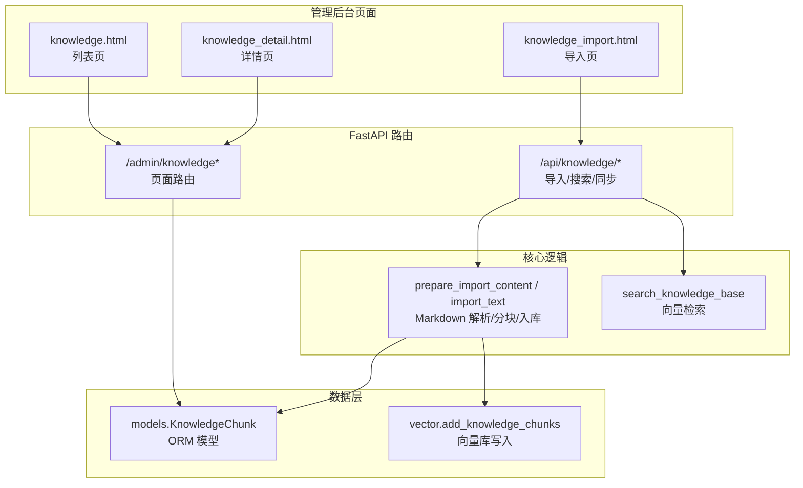
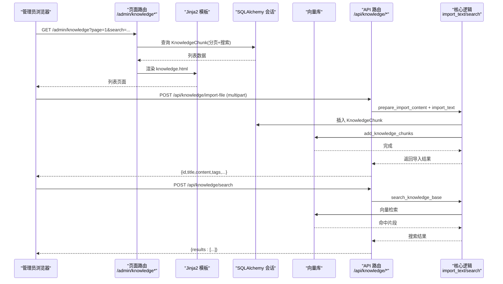
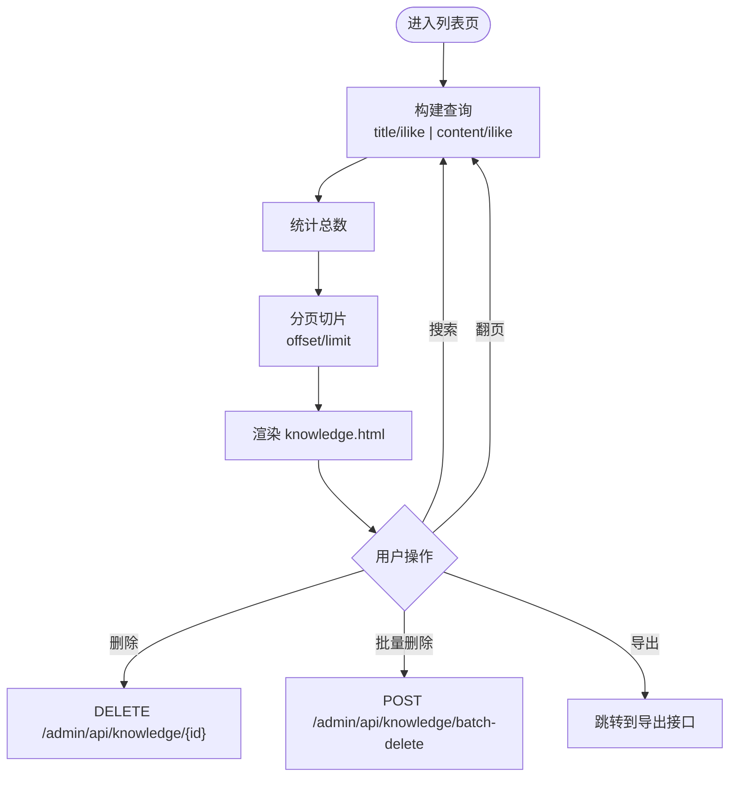
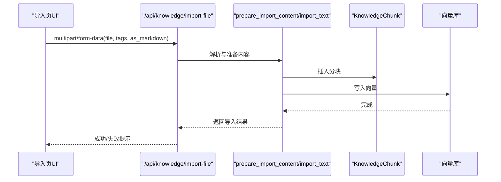
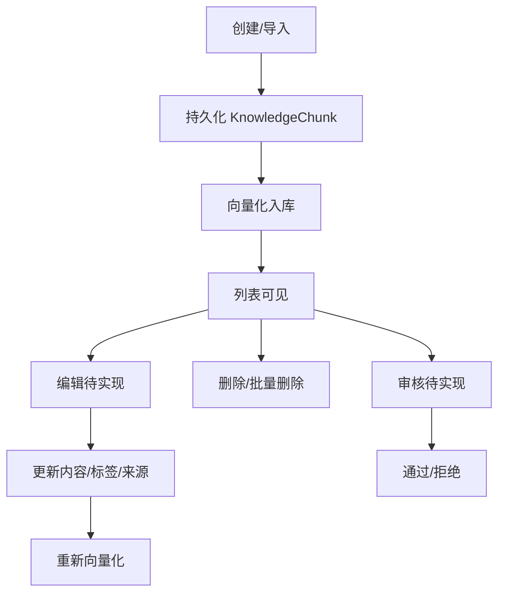
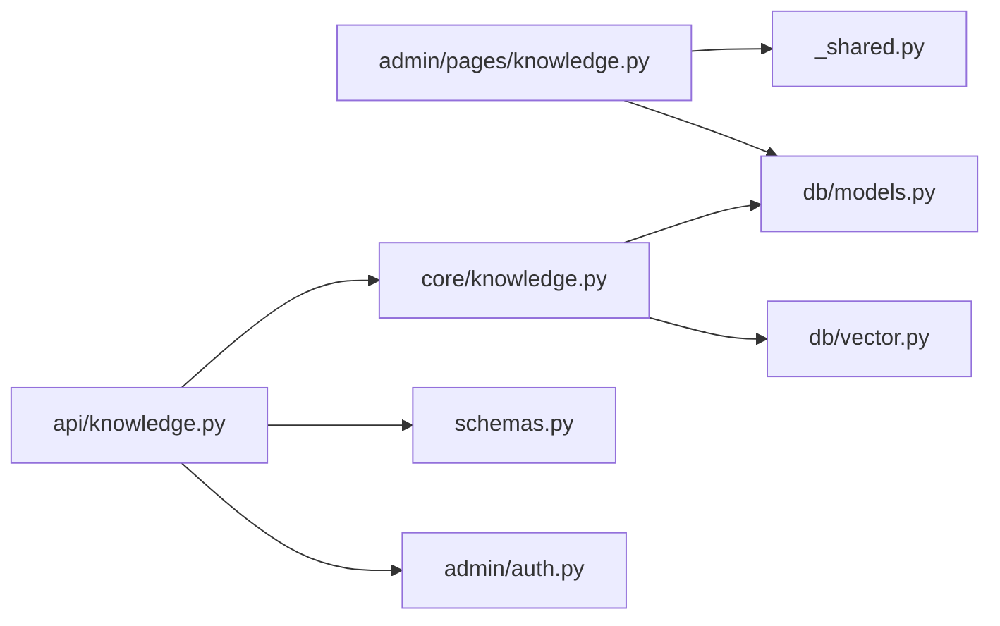

# 知识库管理界面

<cite>
**本文引用的文件**   
- [hushai/meditation/admin/pages/knowledge.py](file://hushai/meditation/admin/pages/knowledge.py)
- [hushai/meditation/admin/templates/knowledge.html](file://hushai/meditation/admin/templates/knowledge.html)
- [hushai/meditation/admin/templates/knowledge_detail.html](file://hushai/meditation/admin/templates/knowledge_detail.html)
- [hushai/meditation/admin/templates/knowledge_import.html](file://hushai/meditation/admin/templates/knowledge_import.html)
- [hushai/meditation/api/knowledge.py](file://hushai/meditation/api/knowledge.py)
- [hushai/meditation/core/knowledge.py](file://hushai/meditation/core/knowledge.py)
- [hushai/meditation/db/models.py](file://hushai/meditation/db/models.py)
- [hushai/meditation/schemas.py](file://hushai/meditation/schemas.py)
- [hushai/meditation/admin/pages/_shared.py](file://hushai/meditation/admin/pages/_shared.py)
</cite>

## 目录
1. [简介](#简介)
2. [项目结构](#项目结构)
3. [核心组件](#核心组件)
4. [架构总览](#架构总览)
5. [详细组件分析](#详细组件分析)
6. [依赖关系分析](#依赖关系分析)
7. [性能与可用性建议](#性能与可用性建议)
8. [故障排查指南](#故障排查指南)
9. [结论](#结论)

## 简介
本设计文档面向 hush.ai 管理后台的知识库管理功能，聚焦以下界面与流程：
- 知识条目列表页：搜索、分页、批量操作与导出
- 知识详情页：内容展示与编辑入口（当前为只读详情）
- 知识导入页：文本、文件、结构化数据导入；Markdown 解析与 RAG 向量化入库
- CRUD 能力现状与扩展点：删除、批量删除已实现；创建/编辑/状态管理需补充
- 标签系统、来源标注与内容审核的界面设计与落地方案

## 项目结构
知识库管理相关的前端模板与后端路由分布如下：
- 页面路由与模板：admin/pages/knowledge.py 与 templates/knowledge*.html
- API 路由：api/knowledge.py（导入、搜索、远程同步等）
- 核心处理逻辑：core/knowledge.py（Markdown 解析、分块、向量入库、检索）
- 数据模型：db/models.py（KnowledgeChunk 表结构）
- 请求/响应模式：schemas.py（Pydantic 模型）
- 共享基础设施：admin/pages/_shared.py（模板引擎、鉴权辅助、批量删除请求模型）



图表来源
- [hushai/meditation/admin/pages/knowledge.py:22-116](file://hushai/meditation/admin/pages/knowledge.py#L22-L116)
- [hushai/meditation/api/knowledge.py:57-234](file://hushai/meditation/api/knowledge.py#L57-L234)
- [hushai/meditation/core/knowledge.py:76-171](file://hushai/meditation/core/knowledge.py#L76-L171)
- [hushai/meditation/db/models.py:137-151](file://hushai/meditation/db/models.py#L137-L151)

章节来源
- [hushai/meditation/admin/pages/knowledge.py:22-116](file://hushai/meditation/admin/pages/knowledge.py#L22-L116)
- [hushai/meditation/admin/templates/knowledge.html:1-142](file://hushai/meditation/admin/templates/knowledge.html#L1-L142)
- [hushai/meditation/admin/templates/knowledge_detail.html:1-157](file://hushai/meditation/admin/templates/knowledge_detail.html#L1-L157)
- [hushai/meditation/admin/templates/knowledge_import.html:1-507](file://hushai/meditation/admin/templates/knowledge_import.html#L1-L507)
- [hushai/meditation/api/knowledge.py:57-234](file://hushai/meditation/api/knowledge.py#L57-L234)
- [hushai/meditation/core/knowledge.py:76-171](file://hushai/meditation/core/knowledge.py#L76-L171)
- [hushai/meditation/db/models.py:137-151](file://hushai/meditation/db/models.py#L137-L151)
- [hushai/meditation/schemas.py:110-150](file://hushai/meditation/schemas.py#L110-L150)
- [hushai/meditation/admin/pages/_shared.py:40-42](file://hushai/meditation/admin/pages/_shared.py#L40-L42)

## 核心组件
- 列表页路由与模板
  - 列表查询支持按标题或内容模糊搜索，分页返回，并渲染卡片式网格布局
  - 提供 CSV/Excel 导出按钮（由导出模块处理），以及“导入知识”跳转
  - 单条删除通过前端异步调用后端 DELETE 接口
- 详情页路由与模板
  - 展示标题、时间、分段序号、标签、来源、父级链接、元数据 JSON
  - 提供“编辑”和“删除”入口（编辑路由尚未在页面路由中注册）
- 导入页模板与交互
  - 文本导入：支持 plain/markdown 两种格式，自动提取 frontmatter 标题与标签
  - 文件导入：支持 .md/.markdown/.txt，可强制按 Markdown 解析
  - 结构化导入：JSON 对象，支持 children 层级
  - 结果反馈：成功/错误提示，自动隐藏
- API 路由
  - 导入文本、导入文件、导入结构化、批量导入、搜索、远程导入/同步
  - 统一鉴权：支持管理员 JWT 或普通用户 JWT
- 核心处理
  - prepare_import_content：解析 YAML frontmatter、Markdown 转纯文本、推导标题与额外标签
  - import_text：段落切分、持久化 KnowledgeChunk、写入向量库
  - search_knowledge_base：基于配置的 top_k 进行向量检索

章节来源
- [hushai/meditation/admin/pages/knowledge.py:22-116](file://hushai/meditation/admin/pages/knowledge.py#L22-L116)
- [hushai/meditation/admin/templates/knowledge.html:14-119](file://hushai/meditation/admin/templates/knowledge.html#L14-L119)
- [hushai/meditation/admin/templates/knowledge_detail.html:13-67](file://hushai/meditation/admin/templates/knowledge_detail.html#L13-L67)
- [hushai/meditation/admin/templates/knowledge_import.html:30-124](file://hushai/meditation/admin/templates/knowledge_import.html#L30-L124)
- [hushai/meditation/api/knowledge.py:57-234](file://hushai/meditation/api/knowledge.py#L57-L234)
- [hushai/meditation/core/knowledge.py:76-171](file://hushai/meditation/core/knowledge.py#L76-L171)

## 架构总览
下图展示了从浏览器到数据库与向量库的关键调用链。



图表来源
- [hushai/meditation/admin/pages/knowledge.py:22-71](file://hushai/meditation/admin/pages/knowledge.py#L22-L71)
- [hushai/meditation/api/knowledge.py:96-137](file://hushai/meditation/api/knowledge.py#L96-L137)
- [hushai/meditation/core/knowledge.py:137-171](file://hushai/meditation/core/knowledge.py#L137-L171)
- [hushai/meditation/core/knowledge.py:207-214](file://hushai/meditation/core/knowledge.py#L207-L214)

## 详细组件分析

### 知识条目列表页
- 布局与交互
  - 顶部工具栏：搜索表单（GET）、导出按钮（CSV/Excel）、导入跳转
  - 主体区域：卡片网格，显示标题、摘要、标签、创建日期、来源
  - 分页控件：上一页/下一页、页码省略号、当前页信息
  - 单条删除：点击卡片右上角删除图标，二次确认后异步删除
- 后端支持
  - GET /admin/knowledge：支持 page、limit、search 参数，按 created_at 倒序
  - DELETE /admin/api/knowledge/{item_id}：删除单条
  - POST /admin/api/knowledge/batch-delete：批量删除（使用 BatchDeleteRequest）
- 导出能力
  - 列表页提供导出链接，实际导出逻辑由导出模块处理（不在本文件内）



图表来源
- [hushai/meditation/admin/pages/knowledge.py:22-71](file://hushai/meditation/admin/pages/knowledge.py#L22-L71)
- [hushai/meditation/admin/pages/knowledge.py:119-162](file://hushai/meditation/admin/pages/knowledge.py#L119-L162)
- [hushai/meditation/admin/templates/knowledge.html:14-119](file://hushai/meditation/admin/templates/knowledge.html#L14-L119)
- [hushai/meditation/admin/pages/_shared.py:40-42](file://hushai/meditation/admin/pages/_shared.py#L40-L42)

章节来源
- [hushai/meditation/admin/pages/knowledge.py:22-71](file://hushai/meditation/admin/pages/knowledge.py#L22-L71)
- [hushai/meditation/admin/pages/knowledge.py:119-162](file://hushai/meditation/admin/pages/knowledge.py#L119-L162)
- [hushai/meditation/admin/templates/knowledge.html:14-119](file://hushai/meditation/admin/templates/knowledge.html#L14-L119)
- [hushai/meditation/admin/pages/_shared.py:40-42](file://hushai/meditation/admin/pages/_shared.py#L40-L42)

### 知识详情页面
- 展示字段
  - 标题、创建时间、分段序号、标签、来源、父级条目链接、元数据 JSON
- 操作入口
  - “编辑”按钮指向 /admin/knowledge/{id}/edit（页面路由未在当前文件中注册）
  - “删除”按钮调用 DELETE 接口
- 富文本编辑器与版本历史
  - 当前详情页仅以预格式化文本展示，未集成富文本编辑器与版本历史
  - 建议后续引入 Markdown 编辑器（支持代码高亮、实时预览），并在后端增加版本记录表与对比视图

```mermaid
classDiagram
class KnowledgeDetailPage {
+展示标题/时间/分段/标签/来源
+显示元数据JSON
+导航至编辑页
+触发删除
}
class DeleteAPI {
+DELETE /admin/api/knowledge/{id}
+校验管理员
+删除并提交事务
}
KnowledgeDetailPage --> DeleteAPI : "调用"
```

图表来源
- [hushai/meditation/admin/templates/knowledge_detail.html:13-67](file://hushai/meditation/admin/templates/knowledge_detail.html#L13-L67)
- [hushai/meditation/admin/pages/knowledge.py:119-138](file://hushai/meditation/admin/pages/knowledge.py#L119-L138)

章节来源
- [hushai/meditation/admin/templates/knowledge_detail.html:13-67](file://hushai/meditation/admin/templates/knowledge_detail.html#L13-L67)
- [hushai/meditation/admin/pages/knowledge.py:119-138](file://hushai/meditation/admin/pages/knowledge.py#L119-L138)

### 知识导入界面
- 文本导入
  - 支持 plain/markdown 两种格式；选择 markdown 时自动解析 frontmatter 标题与标签，正文转为纯文本后入库
- 文件导入
  - 支持 .md/.markdown/.txt；非 md 扩展名时可勾选“仍按 Markdown 解析”
  - 支持拖拽上传与文件名回显
- 结构化导入
  - 接受 JSON 对象，包含 title/content/tags/source/children 等字段
- 结果反馈
  - 成功/错误消息区，5 秒后自动隐藏
- 认证方式
  - 通过 Authorization: Bearer <token> 传递令牌（从 cookie 读取 admin_token）



图表来源
- [hushai/meditation/admin/templates/knowledge_import.html:30-124](file://hushai/meditation/admin/templates/knowledge_import.html#L30-L124)
- [hushai/meditation/api/knowledge.py:96-137](file://hushai/meditation/api/knowledge.py#L96-L137)
- [hushai/meditation/core/knowledge.py:76-171](file://hushai/meditation/core/knowledge.py#L76-L171)

章节来源
- [hushai/meditation/admin/templates/knowledge_import.html:30-124](file://hushai/meditation/admin/templates/knowledge_import.html#L30-L124)
- [hushai/meditation/api/knowledge.py:96-137](file://hushai/meditation/api/knowledge.py#L96-L137)
- [hushai/meditation/core/knowledge.py:76-171](file://hushai/meditation/core/knowledge.py#L76-L171)

### 知识条目 CRUD 操作与状态管理
- 已实现
  - 删除：单条与批量删除
  - 导入：文本/文件/结构化/批量/远程
- 待实现
  - 创建：可通过导入页或新增“新建知识”表单
  - 编辑：详情页已有“编辑”入口，但页面路由未注册；需新增编辑页面与 PUT/PATCH 接口
  - 状态管理：当前模型无 status 字段；如需审核流，可在 KnowledgeChunk 增加 is_active/status 字段，并提供状态切换接口与列表筛选



章节来源
- [hushai/meditation/admin/pages/knowledge.py:119-162](file://hushai/meditation/admin/pages/knowledge.py#L119-L162)
- [hushai/meditation/db/models.py:137-151](file://hushai/meditation/db/models.py#L137-L151)

### 标签系统与来源标注
- 标签
  - 导入时支持传入 tags；Markdown frontmatter 中的 tags 会被合并入最终标签列表
  - 列表与详情页均展示标签
- 来源标注
  - 文件导入时 source 默认取文件名；也可在结构化导入中指定 source
  - 列表与详情页均展示来源

章节来源
- [hushai/meditation/core/knowledge.py:76-103](file://hushai/meditation/core/knowledge.py#L76-L103)
- [hushai/meditation/api/knowledge.py:118-126](file://hushai/meditation/api/knowledge.py#L118-L126)
- [hushai/meditation/admin/templates/knowledge.html:66-78](file://hushai/meditation/admin/templates/knowledge.html#L66-L78)
- [hushai/meditation/admin/templates/knowledge_detail.html:30-36](file://hushai/meditation/admin/templates/knowledge_detail.html#L30-L36)

### 内容审核界面（建议方案）
- 数据层
  - 在 KnowledgeChunk 增加 status 字段（如 pending/approved/rejected）与 is_active 布尔位
- 界面层
  - 列表页增加“审核状态”列与筛选器（全部/待审/已通过/已拒绝）
  - 详情页增加“审核操作”面板：通过/拒绝，并填写备注
- 业务层
  - 新增 PATCH /admin/api/knowledge/{id}/audit 接口，校验管理员权限，更新状态与备注
  - 前台检索可根据 is_active 过滤

[本节为概念性设计，不直接分析具体文件]

## 依赖关系分析
- 页面路由依赖
  - 模板渲染：Jinja2Templates（_shared.py）
  - 数据库会话：get_session（_shared.py）
  - 鉴权：get_admin_from_request（auth）
- API 路由依赖
  - 鉴权：extract_bearer_token + verify_admin_token/get_current_user_id
  - 核心逻辑：import_text、prepare_import_content、search_knowledge_base
  - 数据模型：KnowledgeChunk
  - 请求/响应：Pydantic 模型（schemas.py）



图表来源
- [hushai/meditation/admin/pages/knowledge.py:1-18](file://hushai/meditation/admin/pages/knowledge.py#L1-L18)
- [hushai/meditation/admin/pages/_shared.py:19-32](file://hushai/meditation/admin/pages/_shared.py#L19-L32)
- [hushai/meditation/api/knowledge.py:1-35](file://hushai/meditation/api/knowledge.py#L1-L35)
- [hushai/meditation/core/knowledge.py:1-13](file://hushai/meditation/core/knowledge.py#L1-L13)
- [hushai/meditation/db/models.py:137-151](file://hushai/meditation/db/models.py#L137-L151)
- [hushai/meditation/schemas.py:110-150](file://hushai/meditation/schemas.py#L110-L150)

章节来源
- [hushai/meditation/admin/pages/knowledge.py:1-18](file://hushai/meditation/admin/pages/knowledge.py#L1-L18)
- [hushai/meditation/admin/pages/_shared.py:19-32](file://hushai/meditation/admin/pages/_shared.py#L19-L32)
- [hushai/meditation/api/knowledge.py:1-35](file://hushai/meditation/api/knowledge.py#L1-L35)
- [hushai/meditation/core/knowledge.py:1-13](file://hushai/meditation/core/knowledge.py#L1-L13)
- [hushai/meditation/db/models.py:137-151](file://hushai/meditation/db/models.py#L137-L151)
- [hushai/meditation/schemas.py:110-150](file://hushai/meditation/schemas.py#L110-L150)

## 性能与可用性建议
- 列表页
  - 搜索条件使用 ilike 模糊匹配，建议在 title 与 content 上建立索引以提升性能
  - 分页 limit 默认 20，可按场景调整
- 导入流程
  - 大文件导入建议使用批量导入接口，减少网络往返
  - Markdown 转纯文本与分块逻辑已在核心层实现，避免重复计算
- 向量检索
  - 搜索接口支持 top_k 控制返回数量，结合配置项控制召回规模
- 用户体验
  - 导入结果反馈采用短时提示，建议对错误信息进行更明确的定位（如行号/字段）

[本节为通用建议，不直接分析具体文件]

## 故障排查指南
- 导入失败
  - 检查文件格式与编码（UTF-8 优先，批量导入会尝试 GBK 容错）
  - 确认 Markdown 解析开关与扩展名是否一致
  - 查看返回的错误 detail，常见为空内容或 JSON 语法错误
- 鉴权问题
  - 确保携带 Authorization: Bearer <token>，且 token 有效
  - 页面路由未登录将重定向到登录页
- 删除失败
  - 确认管理员身份与条目存在性
- 搜索无结果
  - 确认向量库已写入对应片段，且查询词与内容匹配

章节来源
- [hushai/meditation/api/knowledge.py:170-210](file://hushai/meditation/api/knowledge.py#L170-L210)
- [hushai/meditation/admin/pages/knowledge.py:31-33](file://hushai/meditation/admin/pages/knowledge.py#L31-L33)
- [hushai/meditation/admin/pages/knowledge.py:126-138](file://hushai/meditation/admin/pages/knowledge.py#L126-L138)

## 结论
当前知识库管理后台已具备完整的导入、检索与基础管理能力：
- 列表页支持搜索、分页、导出与单条删除
- 详情页用于查看与导航至编辑（编辑路由待实现）
- 导入页支持多格式与结构化数据，自动解析 Markdown 并写入向量库
- 标签与来源标注贯穿导入与展示链路
- 建议下一步完善编辑、版本历史与审核流程，提升内容治理与协作效率