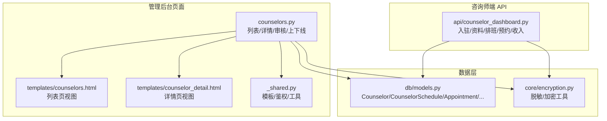
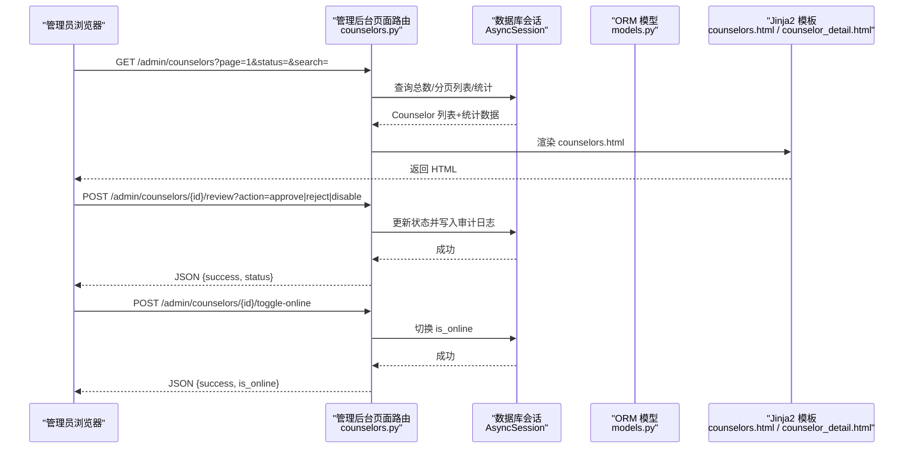
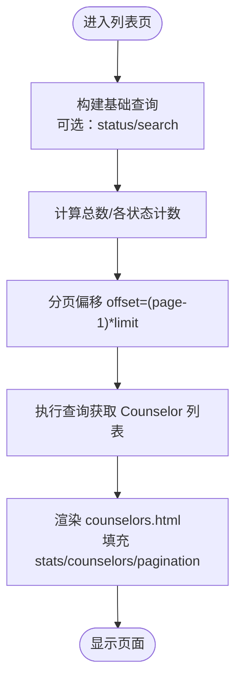
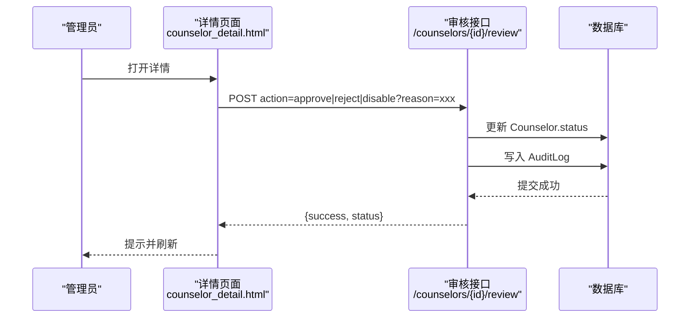
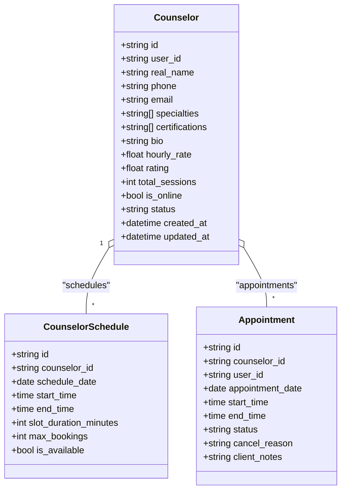
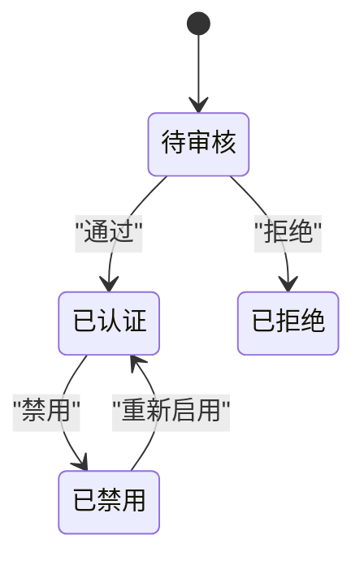
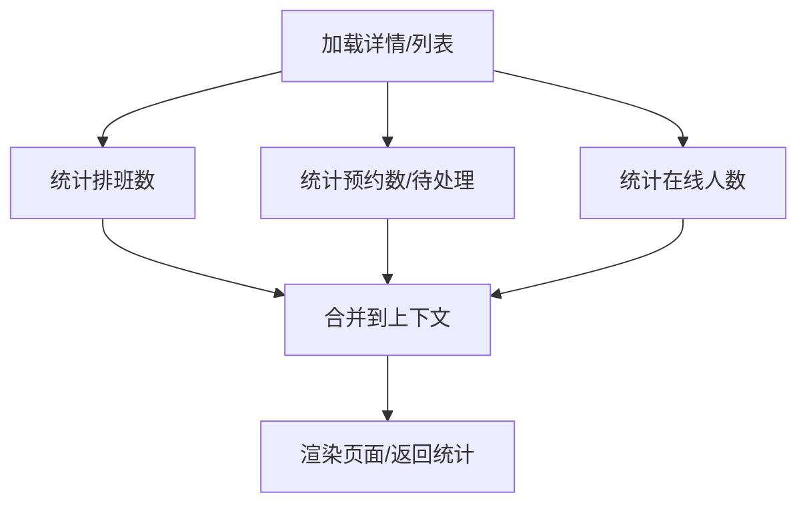
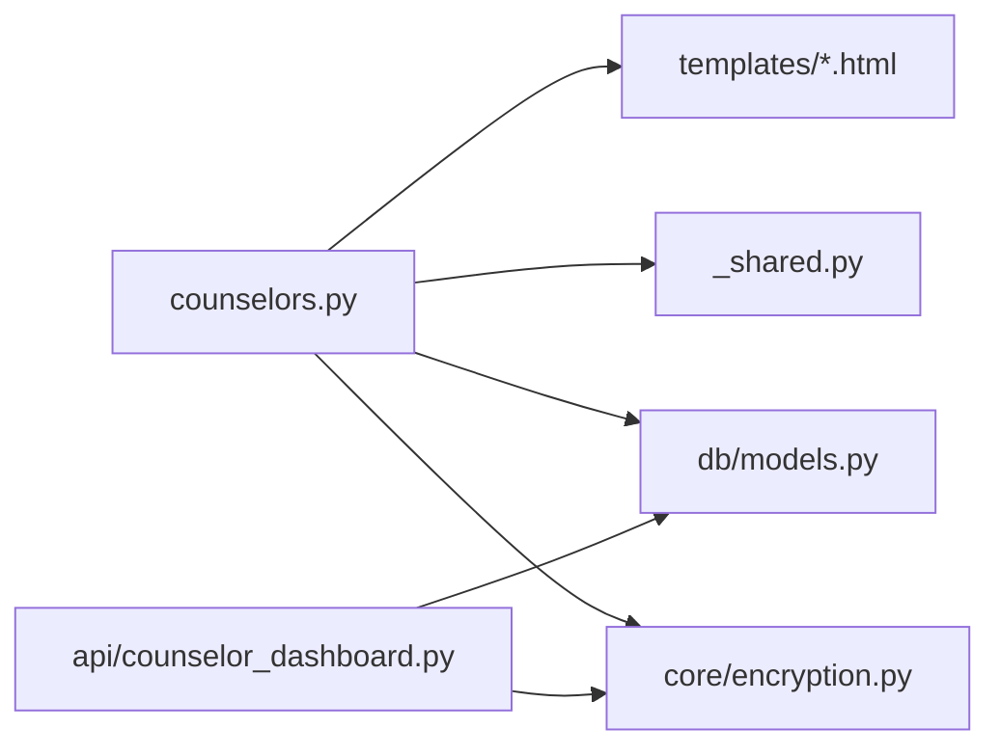

# 咨询师管理

<cite>
**本文引用的文件**   
- [hushai/meditation/admin/pages/counselors.py](file://hushai/meditation/admin/pages/counselors.py)
- [hushai/meditation/admin/templates/counselors.html](file://hushai/meditation/admin/templates/counselors.html)
- [hushai/meditation/admin/templates/counselor_detail.html](file://hushai/meditation/admin/templates/counselor_detail.html)
- [hushai/meditation/api/counselor_dashboard.py](file://hushai/meditation/api/counselor_dashboard.py)
- [hushai/meditation/db/models.py](file://hushai/meditation/db/models.py)
- [hushai/meditation/core/encryption.py](file://hushai/meditation/core/encryption.py)
- [hushai/meditation/admin/pages/_shared.py](file://hushai/meditation/admin/pages/_shared.py)
</cite>

## 目录
1. [引言](#引言)
2. [项目结构](#项目结构)
3. [核心组件](#核心组件)
4. [架构总览](#架构总览)
5. [详细组件分析](#详细组件分析)
6. [依赖关系分析](#依赖关系分析)
7. [性能与可扩展性](#性能与可扩展性)
8. [故障排查指南](#故障排查指南)
9. [结论](#结论)
10. [附录](#附录)

## 引言
本设计文档面向 hush.ai 管理后台的“咨询师管理”功能，聚焦以下目标：
- 咨询师列表页：统计卡片、搜索筛选、分页展示
- 咨询师信息维护：基本信息编辑、资质认证上传、专业领域配置、时薪设置
- 状态管理与权限：审核流程、上线下线控制、管理员鉴权
- 工作负载监控与数据统计：排班、预约、收入概览
- 评分系统与反馈管理：评分字段、排序与展示、反馈入口（建议方案）

## 项目结构
围绕咨询师管理的代码主要分布在管理后台页面路由、模板、API 以及数据模型中。下图给出与咨询师管理相关的模块组织与交互关系。

图表来源
- [hushai/meditation/admin/pages/counselors.py:1-202](file://hushai/meditation/admin/pages/counselors.py#L1-L202)
- [hushai/meditation/admin/templates/counselors.html:1-116](file://hushai/meditation/admin/templates/counselors.html#L1-L116)
- [hushai/meditation/admin/templates/counselor_detail.html:1-95](file://hushai/meditation/admin/templates/counselor_detail.html#L1-L95)
- [hushai/meditation/api/counselor_dashboard.py:1-542](file://hushai/meditation/api/counselor_dashboard.py#L1-L542)
- [hushai/meditation/db/models.py:273-434](file://hushai/meditation/db/models.py#L273-L434)
- [hushai/meditation/core/encryption.py:1-79](file://hushai/meditation/core/encryption.py#L1-L79)
- [hushai/meditation/admin/pages/_shared.py:1-110](file://hushai/meditation/admin/pages/_shared.py#L1-L110)

章节来源
- [hushai/meditation/admin/pages/counselors.py:1-202](file://hushai/meditation/admin/pages/counselors.py#L1-L202)
- [hushai/meditation/admin/templates/counselors.html:1-116](file://hushai/meditation/admin/templates/counselors.html#L1-L116)
- [hushai/meditation/admin/templates/counselor_detail.html:1-95](file://hushai/meditation/admin/templates/counselor_detail.html#L1-L95)
- [hushai/meditation/api/counselor_dashboard.py:1-542](file://hushai/meditation/api/counselor_dashboard.py#L1-L542)
- [hushai/meditation/db/models.py:273-434](file://hushai/meditation/db/models.py#L273-L434)
- [hushai/meditation/core/encryption.py:1-79](file://hushai/meditation/core/encryption.py#L1-L79)
- [hushai/meditation/admin/pages/_shared.py:1-110](file://hushai/meditation/admin/pages/_shared.py#L1-L110)

## 核心组件
- 管理后台咨询师列表页
  - 统计卡片：总咨询师、待审核、已认证、在线
  - 搜索筛选：按姓名或手机号模糊匹配；按状态过滤
  - 分页：支持 page/limit 参数
  - 操作：一键切换上线/下线；跳转详情
- 咨询师详情与审核
  - 展示基本信息、擅长领域、个人简介、时薪、评分、总咨询数、状态、上线状态
  - 审核操作：通过/拒绝/禁用，并记录审计日志
  - 排班与预约统计：排班数、总预约、待处理
- 咨询师端资料与运营
  - 入驻申请、个人资料编辑（含资质、专业领域、时薪）
  - 排班管理、预约确认/拒绝、服务记录更新
  - 收入与统计概览

章节来源
- [hushai/meditation/admin/pages/counselors.py:23-92](file://hushai/meditation/admin/pages/counselors.py#L23-L92)
- [hushai/meditation/admin/templates/counselors.html:10-101](file://hushai/meditation/admin/templates/counselors.html#L10-L101)
- [hushai/meditation/admin/templates/counselor_detail.html:10-75](file://hushai/meditation/admin/templates/counselor_detail.html#L10-L75)
- [hushai/meditation/api/counselor_dashboard.py:77-162](file://hushai/meditation/api/counselor_dashboard.py#L77-L162)

## 架构总览
管理后台对咨询师的管理采用“页面路由 + 模板渲染 + 异步数据库访问”的模式；咨询师端通过 RESTful API 完成资料维护、排班与预约等运营动作。

图表来源
- [hushai/meditation/admin/pages/counselors.py:23-202](file://hushai/meditation/admin/pages/counselors.py#L23-L202)
- [hushai/meditation/admin/templates/counselors.html:103-114](file://hushai/meditation/admin/templates/counselors.html#L103-L114)
- [hushai/meditation/admin/templates/counselor_detail.html:77-93](file://hushai/meditation/admin/templates/counselor_detail.html#L77-L93)
- [hushai/meditation/db/models.py:273-434](file://hushai/meditation/db/models.py#L273-L434)

## 详细组件分析

### 咨询师列表页（布局与交互）
- 统计卡片区域
  - 指标：总咨询师、待审核、已认证、在线
  - 数据来源：后端在列表接口中聚合 count 查询结果
- 搜索与筛选栏
  - 搜索：real_name 或 phone 模糊匹配
  - 状态筛选：pending/approved/rejected/disabled
- 列表表格
  - 列：姓名、手机号（脱敏）、状态、时薪、评分、总咨询数、上线开关、操作
  - 上线开关：前端调用 toggle-online 接口即时切换
- 分页控件
  - 参数：page、limit、status、search
  - 链接携带当前筛选条件

图表来源
- [hushai/meditation/admin/pages/counselors.py:23-92](file://hushai/meditation/admin/pages/counselors.py#L23-L92)
- [hushai/meditation/admin/templates/counselors.html:10-101](file://hushai/meditation/admin/templates/counselors.html#L10-L101)

章节来源
- [hushai/meditation/admin/pages/counselors.py:23-92](file://hushai/meditation/admin/pages/counselors.py#L23-L92)
- [hushai/meditation/admin/templates/counselors.html:10-101](file://hushai/meditation/admin/templates/counselors.html#L10-L101)

### 咨询师详情与审核流程
- 详情展示
  - 基本信息：姓名、手机号（脱敏）、邮箱、时薪、评分、总咨询数、状态、是否在线、注册时间
  - 擅长领域与个人简介
  - 统计：排班数、总预约、待处理预约
- 审核操作
  - 通过/拒绝/禁用：根据当前状态动态显示可用按钮
  - 审计日志：记录管理员用户名、操作类型、资源 ID、原因
- 上线/下线
  - 列表页直接切换；详情页也可通过后续扩展实现

图表来源
- [hushai/meditation/admin/templates/counselor_detail.html:50-75](file://hushai/meditation/admin/templates/counselor_detail.html#L50-L75)
- [hushai/meditation/admin/pages/counselors.py:145-181](file://hushai/meditation/admin/pages/counselors.py#L145-L181)

章节来源
- [hushai/meditation/admin/templates/counselor_detail.html:10-75](file://hushai/meditation/admin/templates/counselor_detail.html#L10-L75)
- [hushai/meditation/admin/pages/counselors.py:95-181](file://hushai/meditation/admin/pages/counselors.py#L95-L181)

### 咨询师信息维护（入驻与资料编辑）
- 入驻申请
  - 提交 real_name、phone、email、specialties、certifications、bio、hourly_rate
  - 初始状态为 pending，并写入审计日志
- 个人资料编辑
  - 支持更新 specialties、certifications、bio、hourly_rate 等字段
  - 返回完整资料响应，包含 rating、total_sessions、is_online、status
- 敏感信息保护
  - 服务记录中的摘要与备注使用对称加密存储
  - 前台展示手机号等 PII 进行脱敏

图表来源
- [hushai/meditation/db/models.py:273-353](file://hushai/meditation/db/models.py#L273-L353)

章节来源
- [hushai/meditation/api/counselor_dashboard.py:77-162](file://hushai/meditation/api/counselor_dashboard.py#L77-L162)
- [hushai/meditation/db/models.py:273-353](file://hushai/meditation/db/models.py#L273-L353)
- [hushai/meditation/core/encryption.py:31-48](file://hushai/meditation/core/encryption.py#L31-L48)
- [hushai/meditation/core/encryption.py:50-55](file://hushai/meditation/core/encryption.py#L50-L55)

### 状态管理机制（审核、上线下线、权限）
- 状态机
  - pending → approved（通过）
  - pending → rejected（拒绝）
  - approved ↔ disabled（禁用/重新启用）
- 上线/下线
  - 仅影响 is_online 标志，不影响认证状态
- 权限控制
  - 管理后台页面统一校验管理员登录态，未登录重定向至登录页
  - 审核与上下线接口均要求管理员身份

图表来源
- [hushai/meditation/admin/pages/counselors.py:145-181](file://hushai/meditation/admin/pages/counselors.py#L145-L181)
- [hushai/meditation/admin/pages/_shared.py:73-96](file://hushai/meditation/admin/pages/_shared.py#L73-L96)

章节来源
- [hushai/meditation/admin/pages/counselors.py:145-202](file://hushai/meditation/admin/pages/counselors.py#L145-L202)
- [hushai/meditation/admin/pages/_shared.py:73-96](file://hushai/meditation/admin/pages/_shared.py#L73-L96)

### 工作负载监控与数据统计
- 排班统计
  - 列表页详情展示排班数量
- 预约统计
  - 总预约数、待处理预约数
- 收入与订单统计（咨询师端）
  - 总预约、待处理、已完成
  - 订单总数、已支付金额合计
- 在线人数
  - 列表页统计卡片显示在线咨询师数

图表来源
- [hushai/meditation/admin/pages/counselors.py:111-142](file://hushai/meditation/admin/pages/counselors.py#L111-L142)
- [hushai/meditation/api/counselor_dashboard.py:498-542](file://hushai/meditation/api/counselor_dashboard.py#L498-L542)

章节来源
- [hushai/meditation/admin/pages/counselors.py:111-142](file://hushai/meditation/admin/pages/counselors.py#L111-L142)
- [hushai/meditation/api/counselor_dashboard.py:498-542](file://hushai/meditation/api/counselor_dashboard.py#L498-L542)

### 评分系统与反馈管理（现状与建议）
- 现状
  - Counselor 模型包含 rating 字段，默认 5.0
  - 列表与详情均展示评分；咨询师列表对外排序时可按 rating 降序
- 建议方案（界面与流程）
  - 客户侧：每次咨询完成后弹出评分表单（1-5 星），可附加文字反馈
  - 管理后台：新增“评分与反馈”子页，按咨询师维度汇总平均评分、评分分布、最近反馈列表
  - 数据落库：新增 feedback 表（user_id、counselor_id、score、comment、created_at），并在 Counselor.rating 上维护滚动平均值
  - 防刷策略：同一用户针对同一咨询师限频评分；异常评分触发人工复核

[本节为概念性设计与建议，不直接分析具体源码文件]

## 依赖关系分析
- 页面路由依赖
  - 模板渲染：Jinja2Templates
  - 鉴权：get_admin_from_request、login_redirect
  - 数据库：AsyncSession、SQLAlchemy select/func
- 数据模型依赖
  - Counselor 关联 CounselorSchedule、Appointment
  - ServiceRecord 与 ConsultationOrder 关联，敏感字段加密
- 工具依赖
  - 脱敏：mask_phone/mask_name/mask_id_number
  - 加密：encrypt_field/decrypt_field

图表来源
- [hushai/meditation/admin/pages/counselors.py:1-202](file://hushai/meditation/admin/pages/counselors.py#L1-L202)
- [hushai/meditation/admin/pages/_shared.py:1-110](file://hushai/meditation/admin/pages/_shared.py#L1-L110)
- [hushai/meditation/api/counselor_dashboard.py:1-542](file://hushai/meditation/api/counselor_dashboard.py#L1-L542)
- [hushai/meditation/db/models.py:273-434](file://hushai/meditation/db/models.py#L273-L434)
- [hushai/meditation/core/encryption.py:1-79](file://hushai/meditation/core/encryption.py#L1-L79)

章节来源
- [hushai/meditation/admin/pages/counselors.py:1-202](file://hushai/meditation/admin/pages/counselors.py#L1-L202)
- [hushai/meditation/admin/pages/_shared.py:1-110](file://hushai/meditation/admin/pages/_shared.py#L1-L110)
- [hushai/meditation/api/counselor_dashboard.py:1-542](file://hushai/meditation/api/counselor_dashboard.py#L1-L542)
- [hushai/meditation/db/models.py:273-434](file://hushai/meditation/db/models.py#L273-L434)
- [hushai/meditation/core/encryption.py:1-79](file://hushai/meditation/core/encryption.py#L1-L79)

## 性能与可扩展性
- 查询优化
  - 列表页使用 count 与分页 limit/offset，避免全量加载
  - 常用字段建立索引（如 Counselor.status、Counselor.created_at、CounselorSchedule.schedule_date 等）
- 并发与异步
  - 使用 AsyncSession 提升 I/O 吞吐
- 可扩展点
  - 增加更多筛选维度（地区、等级、标签）
  - 导出功能（CSV/Excel）
  - 评分与反馈模块的数据聚合与缓存

[本节提供通用指导，不直接分析具体源码文件]

## 故障排查指南
- 未登录访问
  - 现象：跳转到登录页或返回 401
  - 定位：检查 get_admin_from_request 与 login_redirect 逻辑
- 审核失败
  - 现象：返回无效操作或 404
  - 定位：核对 action 参数与 Counselor 是否存在
- 上线/下线无变化
  - 现象：前端提示成功但状态未变
  - 定位：检查事务提交与 is_online 字段更新
- 隐私泄露风险
  - 现象：手机号明文展示
  - 定位：确保使用 mask_phone 函数进行脱敏

章节来源
- [hushai/meditation/admin/pages/_shared.py:73-96](file://hushai/meditation/admin/pages/_shared.py#L73-L96)
- [hushai/meditation/admin/pages/counselors.py:145-202](file://hushai/meditation/admin/pages/counselors.py#L145-L202)
- [hushai/meditation/core/encryption.py:50-55](file://hushai/meditation/core/encryption.py#L50-L55)

## 结论
咨询师管理模块以清晰的页面路由与模板渲染为核心，结合异步数据库访问与严格的权限控制，实现了从入驻申请、资料维护、审核管控到上线下线与工作负载统计的闭环。建议在现有基础上完善评分与反馈系统，增强数据可视化与运营分析能力，进一步提升平台的服务质量与管理效率。

## 附录
- 关键路径参考
  - 列表页：GET /admin/counselors
  - 详情页：GET /admin/counselors/{id}
  - 审核：POST /admin/counselors/{id}/review
  - 上线/下线：POST /admin/counselors/{id}/toggle-online
  - 咨询师端资料：GET/PUT /api/counselor/profile
  - 咨询师端排班：GET/POST/DELETE /api/counselor/schedule/manage
  - 咨询师端预约：GET/POST /api/counselor/appointments/*
  - 咨询师端收入统计：GET /api/counselor/earnings/summary

章节来源
- [hushai/meditation/admin/pages/counselors.py:23-202](file://hushai/meditation/admin/pages/counselors.py#L23-L202)
- [hushai/meditation/api/counselor_dashboard.py:77-542](file://hushai/meditation/api/counselor_dashboard.py#L77-L542)