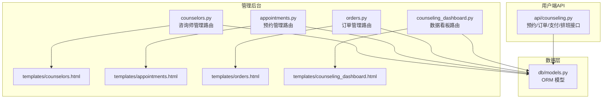
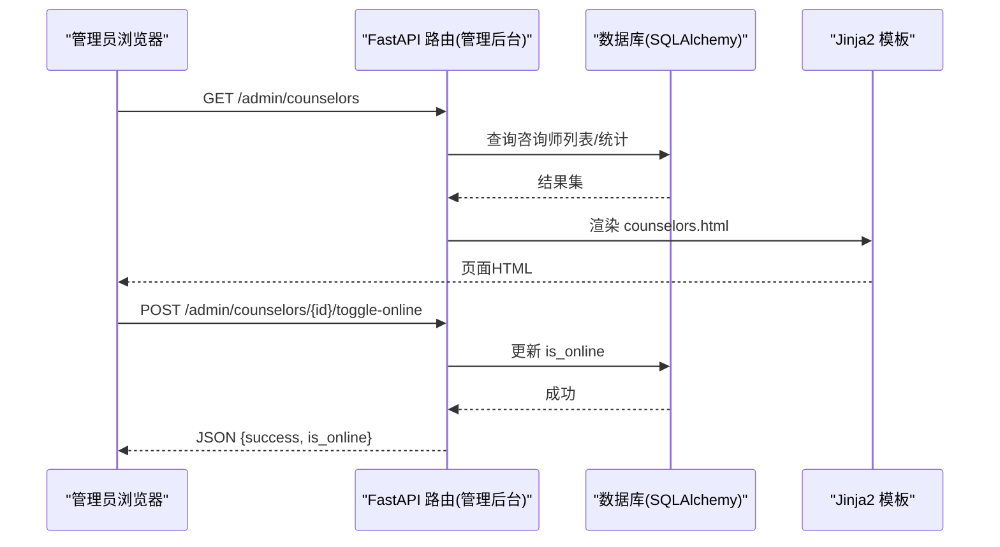
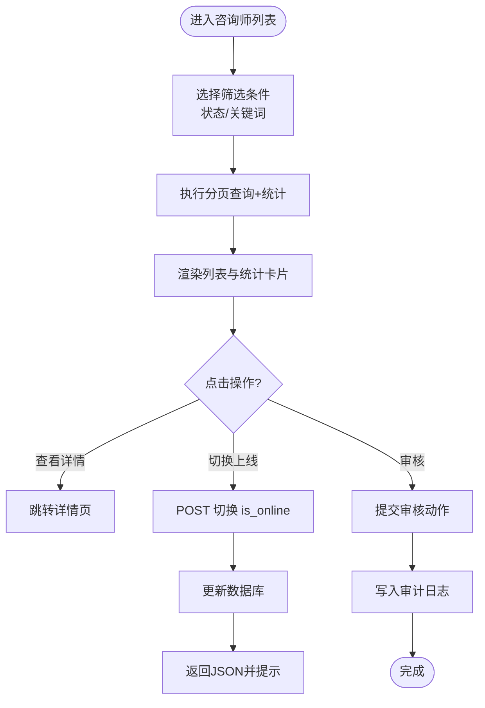
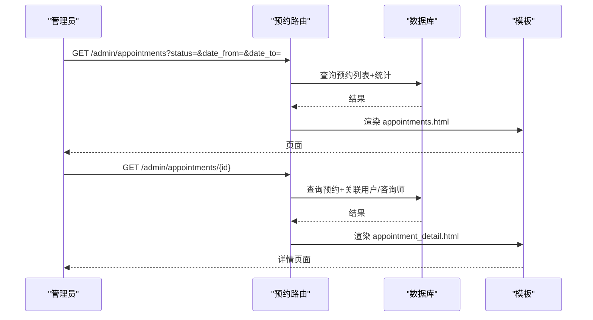
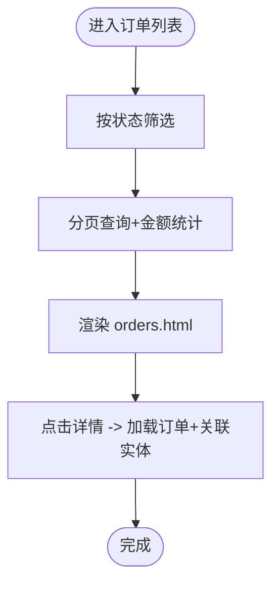
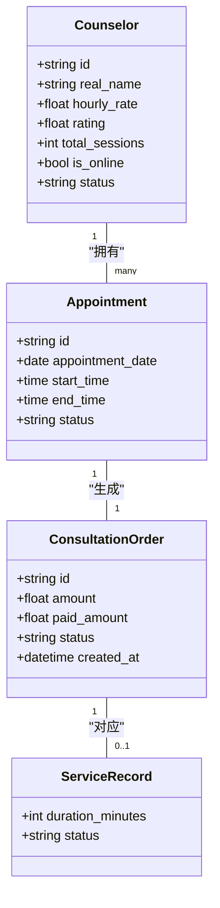
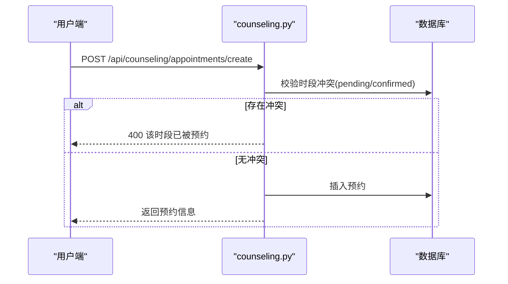
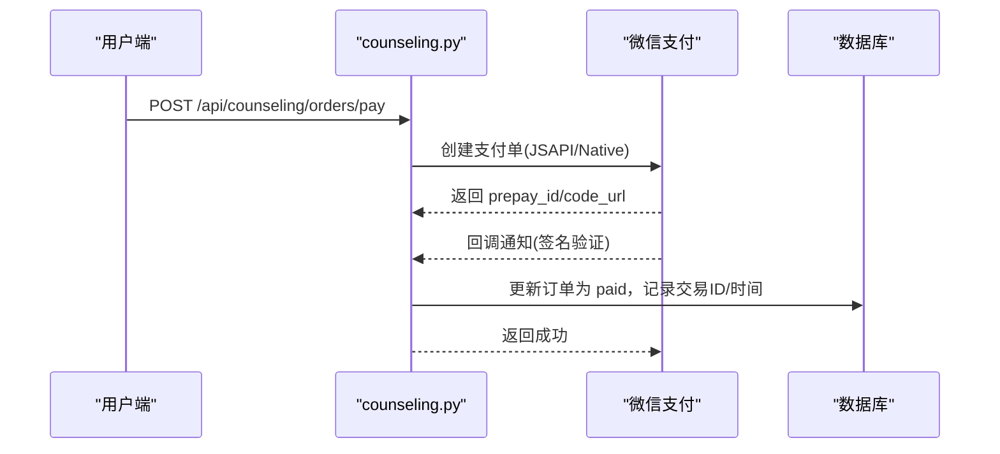
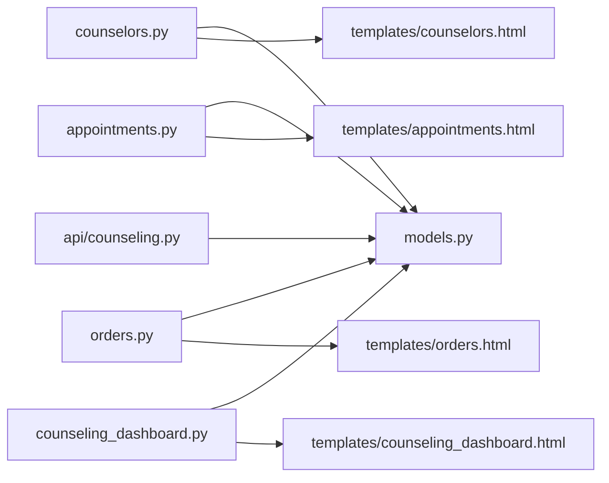

# 咨询管理界面

<cite>
**本文引用的文件**   
- [hushai/meditation/admin/pages/counselors.py](file://hushai/meditation/admin/pages/counselors.py)
- [hushai/meditation/admin/pages/appointments.py](file://hushai/meditation/admin/pages/appointments.py)
- [hushai/meditation/admin/pages/orders.py](file://hushai/meditation/admin/pages/orders.py)
- [hushai/meditation/admin/pages/counseling_dashboard.py](file://hushai/meditation/admin/pages/counseling_dashboard.py)
- [hushai/meditation/admin/templates/counselors.html](file://hushai/meditation/admin/templates/counselors.html)
- [hushai/meditation/admin/templates/appointments.html](file://hushai/meditation/admin/templates/appointments.html)
- [hushai/meditation/admin/templates/orders.html](file://hushai/meditation/admin/templates/orders.html)
- [hushai/meditation/admin/templates/counseling_dashboard.html](file://hushai/meditation/admin/templates/counseling_dashboard.html)
- [hushai/meditation/db/models.py](file://hushai/meditation/db/models.py)
- [hushai/meditation/api/counseling.py](file://hushai/meditation/api/counseling.py)
</cite>

## 目录
1. [简介](#简介)
2. [项目结构](#项目结构)
3. [核心组件](#核心组件)
4. [架构总览](#架构总览)
5. [详细组件分析](#详细组件分析)
6. [依赖关系分析](#依赖关系分析)
7. [性能与可用性考虑](#性能与可用性考虑)
8. [故障排查指南](#故障排查指南)
9. [结论](#结论)
10. [附录：数据模型与字段说明](#附录数据模型与字段说明)

## 简介
本设计文档面向 hush.ai 管理后台的“心理咨询管理”功能，覆盖以下关键界面与能力：
- 咨询师管理：信息维护、资质认证、专业领域配置、在线状态切换。
- 预约管理：列表展示、时间冲突检测、状态跟踪、通知发送（基于回调与审计）。
- 订单管理：支付记录、退款处理、财务报表（收入统计、订单量等）。
- 工作负载分析：可视化看板（预约统计、服务时长、累计收入等）。
- 定价策略与套餐管理：通过订单类型与套餐名称字段支撑多价格策略与套餐售卖。

## 项目结构
管理后台采用 FastAPI + Jinja2 模板渲染模式，页面路由集中在 admin/pages 下，模板位于 admin/templates，数据模型在 db/models.py，用户端 API 在 api/counseling.py。

图表来源
- [hushai/meditation/admin/pages/counselors.py:1-202](file://hushai/meditation/admin/pages/counselors.py#L1-L202)
- [hushai/meditation/admin/pages/appointments.py:1-126](file://hushai/meditation/admin/pages/appointments.py#L1-L126)
- [hushai/meditation/admin/pages/orders.py:1-125](file://hushai/meditation/admin/pages/orders.py#L1-L125)
- [hushai/meditation/admin/pages/counseling_dashboard.py:1-127](file://hushai/meditation/admin/pages/counseling_dashboard.py#L1-L127)
- [hushai/meditation/db/models.py:273-434](file://hushai/meditation/db/models.py#L273-L434)
- [hushai/meditation/api/counseling.py:1-561](file://hushai/meditation/api/counseling.py#L1-L561)

章节来源
- [hushai/meditation/admin/pages/counselors.py:1-202](file://hushai/meditation/admin/pages/counselors.py#L1-L202)
- [hushai/meditation/admin/pages/appointments.py:1-126](file://hushai/meditation/admin/pages/appointments.py#L1-L126)
- [hushai/meditation/admin/pages/orders.py:1-125](file://hushai/meditation/admin/pages/orders.py#L1-L125)
- [hushai/meditation/admin/pages/counseling_dashboard.py:1-127](file://hushai/meditation/admin/pages/counseling_dashboard.py#L1-L127)
- [hushai/meditation/db/models.py:273-434](file://hushai/meditation/db/models.py#L273-L434)
- [hushai/meditation/api/counseling.py:1-561](file://hushai/meditation/api/counseling.py#L1-L561)

## 核心组件
- 咨询师管理
  - 列表页：支持分页、按姓名/手机号搜索、按状态筛选；展示时薪、评分、咨询数、上线开关。
  - 详情页：展示基础信息、排班数量、预约数量与待处理预约数。
  - 审核操作：批准/拒绝/禁用，并写入审计日志。
  - 在线状态：一键切换上线/下线。
- 预约管理
  - 列表页：支持按状态、日期范围筛选；展示日期、时间段、状态、创建时间。
  - 详情页：关联咨询师与用户信息。
- 订单管理
  - 列表页：支持按状态筛选；展示订单号、类型、金额、实付、状态、创建时间。
  - 详情页：关联咨询师与用户信息。
  - 财务统计：累计收入、各状态订单计数、总金额汇总。
- 数据看板
  - 关键指标：认证咨询师数、在线数、总预约数、待处理/已确认、累计收入、今日新增订单、累计服务时长与服务记录数。
  - 快捷入口：待审核入驻列表、今日预约清单。

章节来源
- [hushai/meditation/admin/pages/counselors.py:23-92](file://hushai/meditation/admin/pages/counselors.py#L23-L92)
- [hushai/meditation/admin/pages/counselors.py:95-142](file://hushai/meditation/admin/pages/counselors.py#L95-L142)
- [hushai/meditation/admin/pages/counselors.py:145-180](file://hushai/meditation/admin/pages/counselors.py#L145-L180)
- [hushai/meditation/admin/pages/counselors.py:183-202](file://hushai/meditation/admin/pages/counselors.py#L183-L202)
- [hushai/meditation/admin/pages/appointments.py:19-91](file://hushai/meditation/admin/pages/appointments.py#L19-L91)
- [hushai/meditation/admin/pages/appointments.py:94-126](file://hushai/meditation/admin/pages/appointments.py#L94-L126)
- [hushai/meditation/admin/pages/orders.py:17-89](file://hushai/meditation/admin/pages/orders.py#L17-L89)
- [hushai/meditation/admin/pages/orders.py:92-125](file://hushai/meditation/admin/pages/orders.py#L92-L125)
- [hushai/meditation/admin/pages/counseling_dashboard.py:24-127](file://hushai/meditation/admin/pages/counseling_dashboard.py#L24-L127)

## 架构总览
管理后台页面由 FastAPI 路由返回 HTML 模板，模板中嵌入少量前端交互（如切换上线状态），后端通过 SQLAlchemy 异步会话访问数据库。用户端预约、订单、支付等流程由 api/counseling.py 提供 REST 接口，管理后台侧重“查看与运营”。

图表来源
- [hushai/meditation/admin/pages/counselors.py:23-92](file://hushai/meditation/admin/pages/counselors.py#L23-L92)
- [hushai/meditation/admin/pages/counselors.py:183-202](file://hushai/meditation/admin/pages/counselors.py#L183-L202)
- [hushai/meditation/admin/templates/counselors.html:103-114](file://hushai/meditation/admin/templates/counselors.html#L103-L114)

## 详细组件分析

### 咨询师管理界面
- 列表页
  - 顶部统计卡片：总数、待审核、已认证、在线。
  - 工具栏：搜索框（姓名/手机号）、状态下拉筛选、搜索/清除按钮。
  - 表格列：姓名、手机号（脱敏）、状态标签、时薪、评分、咨询数、上线开关、详情链接。
  - 分页：保留筛选条件。
- 详情页
  - 展示咨询师基本信息、排班数量、预约数量、待处理预约数量。
- 审核与状态
  - 审核动作：批准/拒绝/禁用，写入审计日志。
  - 上线开关：AJAX 切换 is_online，即时反馈。

图表来源
- [hushai/meditation/admin/pages/counselors.py:23-92](file://hushai/meditation/admin/pages/counselors.py#L23-L92)
- [hushai/meditation/admin/pages/counselors.py:95-142](file://hushai/meditation/admin/pages/counselors.py#L95-L142)
- [hushai/meditation/admin/pages/counselors.py:145-180](file://hushai/meditation/admin/pages/counselors.py#L145-L180)
- [hushai/meditation/admin/pages/counselors.py:183-202](file://hushai/meditation/admin/pages/counselors.py#L183-L202)
- [hushai/meditation/admin/templates/counselors.html:10-116](file://hushai/meditation/admin/templates/counselors.html#L10-L116)

章节来源
- [hushai/meditation/admin/pages/counselors.py:23-92](file://hushai/meditation/admin/pages/counselors.py#L23-L92)
- [hushai/meditation/admin/pages/counselors.py:95-142](file://hushai/meditation/admin/pages/counselors.py#L95-L142)
- [hushai/meditation/admin/pages/counselors.py:145-180](file://hushai/meditation/admin/pages/counselors.py#L145-L180)
- [hushai/meditation/admin/pages/counselors.py:183-202](file://hushai/meditation/admin/pages/counselors.py#L183-L202)
- [hushai/meditation/admin/templates/counselors.html:10-116](file://hushai/meditation/admin/templates/counselors.html#L10-L116)

### 预约管理界面
- 列表页
  - 统计卡片：总预约、待确认、已确认、已完成。
  - 筛选：状态、开始/结束日期。
  - 表格列：预约日期、时间段、状态、创建时间、详情。
- 详情页
  - 展示预约信息与关联的用户、咨询师。

图表来源
- [hushai/meditation/admin/pages/appointments.py:19-91](file://hushai/meditation/admin/pages/appointments.py#L19-L91)
- [hushai/meditation/admin/pages/appointments.py:94-126](file://hushai/meditation/admin/pages/appointments.py#L94-L126)
- [hushai/meditation/admin/templates/appointments.html:10-74](file://hushai/meditation/admin/templates/appointments.html#L10-L74)

章节来源
- [hushai/meditation/admin/pages/appointments.py:19-91](file://hushai/meditation/admin/pages/appointments.py#L19-L91)
- [hushai/meditation/admin/pages/appointments.py:94-126](file://hushai/meditation/admin/pages/appointments.py#L94-L126)
- [hushai/meditation/admin/templates/appointments.html:10-74](file://hushai/meditation/admin/templates/appointments.html#L10-L74)

### 订单管理界面
- 列表页
  - 统计卡片：总订单、待付款、累计收入、已退款。
  - 筛选：状态。
  - 表格列：订单号、类型、金额、实付、状态、创建时间、详情。
- 详情页
  - 展示订单与关联用户、咨询师信息。
- 财务报表
  - 累计收入：仅统计 paid 状态的 paid_amount 总和。
  - 总金额：所有订单 amount 总和。

图表来源
- [hushai/meditation/admin/pages/orders.py:17-89](file://hushai/meditation/admin/pages/orders.py#L17-L89)
- [hushai/meditation/admin/pages/orders.py:92-125](file://hushai/meditation/admin/pages/orders.py#L92-L125)
- [hushai/meditation/admin/templates/orders.html:10-72](file://hushai/meditation/admin/templates/orders.html#L10-L72)

章节来源
- [hushai/meditation/admin/pages/orders.py:17-89](file://hushai/meditation/admin/pages/orders.py#L17-L89)
- [hushai/meditation/admin/pages/orders.py:92-125](file://hushai/meditation/admin/pages/orders.py#L92-L125)
- [hushai/meditation/admin/templates/orders.html:10-72](file://hushai/meditation/admin/templates/orders.html#L10-L72)

### 数据看板与工作负载分析
- 关键指标
  - 咨询师：总数、已认证、待审核、在线。
  - 预约：总数、待处理、已确认、已完成。
  - 订单：总数、累计收入、今日新增订单。
  - 服务记录：总记录数、累计服务时长（分钟转小时）。
- 快捷面板
  - 待审核入驻：最近5条 pending 咨询师。
  - 今日预约：当日预约按开始时间排序前10条。

图表来源
- [hushai/meditation/db/models.py:273-434](file://hushai/meditation/db/models.py#L273-L434)
- [hushai/meditation/admin/pages/counseling_dashboard.py:24-127](file://hushai/meditation/admin/pages/counseling_dashboard.py#L24-L127)
- [hushai/meditation/admin/templates/counseling_dashboard.html:12-113](file://hushai/meditation/admin/templates/counseling_dashboard.html#L12-L113)

章节来源
- [hushai/meditation/admin/pages/counseling_dashboard.py:24-127](file://hushai/meditation/admin/pages/counseling_dashboard.py#L24-L127)
- [hushai/meditation/admin/templates/counseling_dashboard.html:12-113](file://hushai/meditation/admin/templates/counseling_dashboard.html#L12-L113)

### 预约时间冲突检测与状态跟踪
- 冲突检测
  - 用户端创建预约时，校验同一咨询师在同一日期的同一开始时间是否存在 pending/confirmed 的预约，若存在则拒绝创建。
- 状态跟踪
  - 管理后台列表按状态筛选，详情页可追踪预约生命周期。
- 通知发送
  - 当前实现未包含直接的通知发送逻辑；可通过审计日志与后续扩展消息队列或短信/邮件服务实现。

图表来源
- [hushai/meditation/api/counseling.py:180-246](file://hushai/meditation/api/counseling.py#L180-L246)

章节来源
- [hushai/meditation/api/counseling.py:180-246](file://hushai/meditation/api/counseling.py#L180-L246)

### 支付记录、退款处理与财务报表
- 支付记录
  - 用户端发起支付后，微信支付回调将订单状态更新为 paid，并记录交易ID与支付时间。
- 退款处理
  - 订单状态含 refunded；管理后台可按状态筛选查看已退款订单。
- 财务报表
  - 累计收入：paid 状态的 paid_amount 合计。
  - 总金额：所有订单 amount 合计。
  - 订单量：按 unpaid/paid/refunded 分类统计。

图表来源
- [hushai/meditation/api/counseling.py:437-519](file://hushai/meditation/api/counseling.py#L437-L519)
- [hushai/meditation/admin/pages/orders.py:45-74](file://hushai/meditation/admin/pages/orders.py#L45-L74)

章节来源
- [hushai/meditation/api/counseling.py:437-519](file://hushai/meditation/api/counseling.py#L437-L519)
- [hushai/meditation/admin/pages/orders.py:45-74](file://hushai/meditation/admin/pages/orders.py#L45-L74)

### 定价策略与套餐管理界面设计
- 定价策略
  - 咨询师维度：hourly_rate 作为基础时薪。
  - 订单维度：amount 为订单金额，order_type 区分单次/套餐，package_name 用于标注套餐名称。
- 界面建议
  - 订单列表增加“套餐名称”列，便于快速识别套餐售卖情况。
  - 订单详情展示套餐名称与单价对比，辅助财务核对。
  - 看板增加“套餐订单占比”与“套餐收入贡献”指标（可在现有统计基础上扩展）。

章节来源
- [hushai/meditation/db/models.py:355-384](file://hushai/meditation/db/models.py#L355-L384)
- [hushai/meditation/admin/pages/orders.py:17-89](file://hushai/meditation/admin/pages/orders.py#L17-L89)
- [hushai/meditation/admin/templates/orders.html:35-72](file://hushai/meditation/admin/templates/orders.html#L35-L72)

## 依赖关系分析
- 模块耦合
  - 管理后台路由强依赖模板与 ORM 模型；用户端 API 独立于管理后台，但共享同一数据模型。
- 外部依赖
  - 微信支付：通过 core.wechat_pay 封装 JSAPI/Native 下单与回调验签。
- 潜在循环依赖
  - 当前未见循环导入；路由与模板、模型之间单向依赖清晰。

图表来源
- [hushai/meditation/admin/pages/counselors.py:1-202](file://hushai/meditation/admin/pages/counselors.py#L1-L202)
- [hushai/meditation/admin/pages/appointments.py:1-126](file://hushai/meditation/admin/pages/appointments.py#L1-L126)
- [hushai/meditation/admin/pages/orders.py:1-125](file://hushai/meditation/admin/pages/orders.py#L1-L125)
- [hushai/meditation/admin/pages/counseling_dashboard.py:1-127](file://hushai/meditation/admin/pages/counseling_dashboard.py#L1-L127)
- [hushai/meditation/db/models.py:273-434](file://hushai/meditation/db/models.py#L273-L434)
- [hushai/meditation/api/counseling.py:1-561](file://hushai/meditation/api/counseling.py#L1-L561)

章节来源
- [hushai/meditation/admin/pages/counselors.py:1-202](file://hushai/meditation/admin/pages/counselors.py#L1-L202)
- [hushai/meditation/admin/pages/appointments.py:1-126](file://hushai/meditation/admin/pages/appointments.py#L1-L126)
- [hushai/meditation/admin/pages/orders.py:1-125](file://hushai/meditation/admin/pages/orders.py#L1-L125)
- [hushai/meditation/admin/pages/counseling_dashboard.py:1-127](file://hushai/meditation/admin/pages/counseling_dashboard.py#L1-L127)
- [hushai/meditation/db/models.py:273-434](file://hushai/meditation/db/models.py#L273-L434)
- [hushai/meditation/api/counseling.py:1-561](file://hushai/meditation/api/counseling.py#L1-L561)

## 性能与可用性考虑
- 查询优化
  - 列表页使用 count 子查询与 offset/limit 分页，避免全表扫描。
  - 对常用筛选字段（状态、日期）建立索引以提升查询效率。
- 并发与一致性
  - 预约冲突检测在创建前进行，避免重复预约；必要时可增加唯一约束或事务锁。
- 用户体验
  - 列表页提供清晰的筛选与分页；重要操作（如切换上线）提供即时反馈。
  - 敏感信息（手机号）在前端脱敏显示。

[本节为通用指导，不直接分析具体文件]

## 故障排查指南
- 登录与权限
  - 管理后台路由均检查管理员登录，未登录将重定向至登录页。
- 常见错误
  - 404：资源不存在（咨询师/预约/订单）。
  - 400：无效操作或参数错误（如重复预约、关闭预约等）。
  - 401：需要管理员登录。
- 审计与追溯
  - 审核操作会写入审计日志，便于回溯管理员行为。

章节来源
- [hushai/meditation/admin/pages/counselors.py:145-180](file://hushai/meditation/admin/pages/counselors.py#L145-L180)
- [hushai/meditation/admin/pages/appointments.py:94-126](file://hushai/meditation/admin/pages/appointments.py#L94-L126)
- [hushai/meditation/admin/pages/orders.py:92-125](file://hushai/meditation/admin/pages/orders.py#L92-L125)

## 结论
本设计文档围绕管理后台的心理咨询管理功能，梳理了咨询师管理、预约管理、订单管理与数据看板的界面布局与交互流程，并结合数据模型与用户端 API 说明了时间冲突检测、支付回调与财务统计的实现要点。建议在后续迭代中补充通知发送、套餐销售分析与更丰富的可视化图表，以进一步提升运营效率与决策支持能力。

[本节为总结性内容，不直接分析具体文件]

## 附录：数据模型与字段说明
- 咨询师（Counselor）
  - 关键字段：real_name、phone、email、specialties、certifications、bio、status、hourly_rate、rating、total_sessions、is_online。
- 排班（CounselorSchedule）
  - 关键字段：schedule_date、start_time、end_time、slot_duration_minutes、max_bookings、is_available。
- 预约（Appointment）
  - 关键字段：appointment_date、start_time、end_time、status、cancel_reason、client_notes。
- 订单（ConsultationOrder）
  - 关键字段：order_type、package_name、amount、paid_amount、status、wx_transaction_id、paid_at、refunded_at。
- 服务记录（ServiceRecord）
  - 关键字段：service_type、duration_minutes、summary_encrypted、counselor_notes_encrypted、status、started_at、ended_at。
- 预约设置（AppointmentSettings）
  - 关键字段：max_booking_count、min_advance_hours、slot_duration_minutes、reminder_before_minutes、info_collection_enabled、is_open。

章节来源
- [hushai/meditation/db/models.py:273-434](file://hushai/meditation/db/models.py#L273-L434)