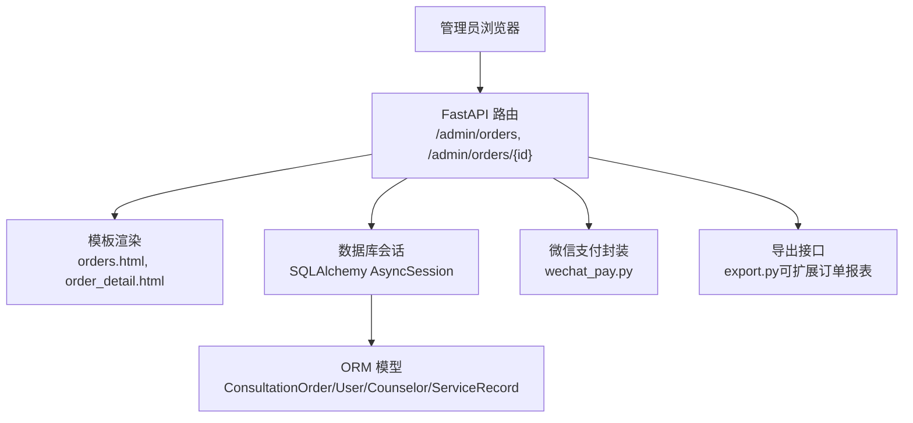
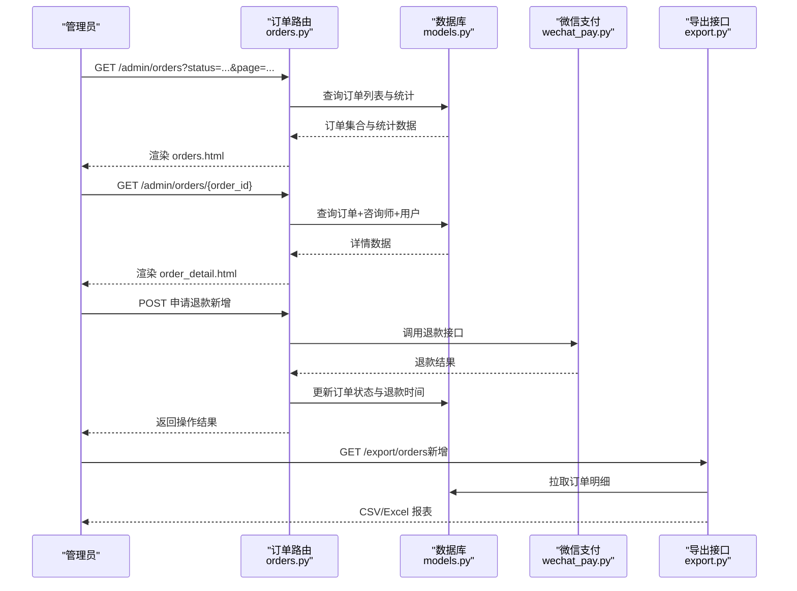
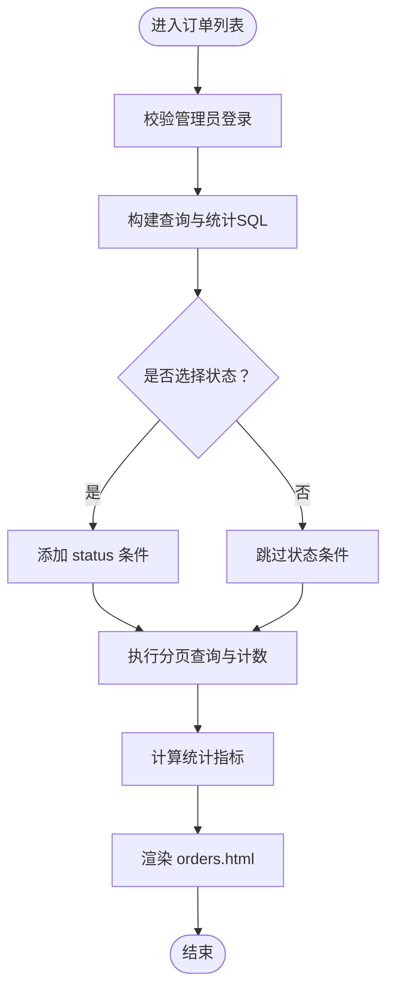
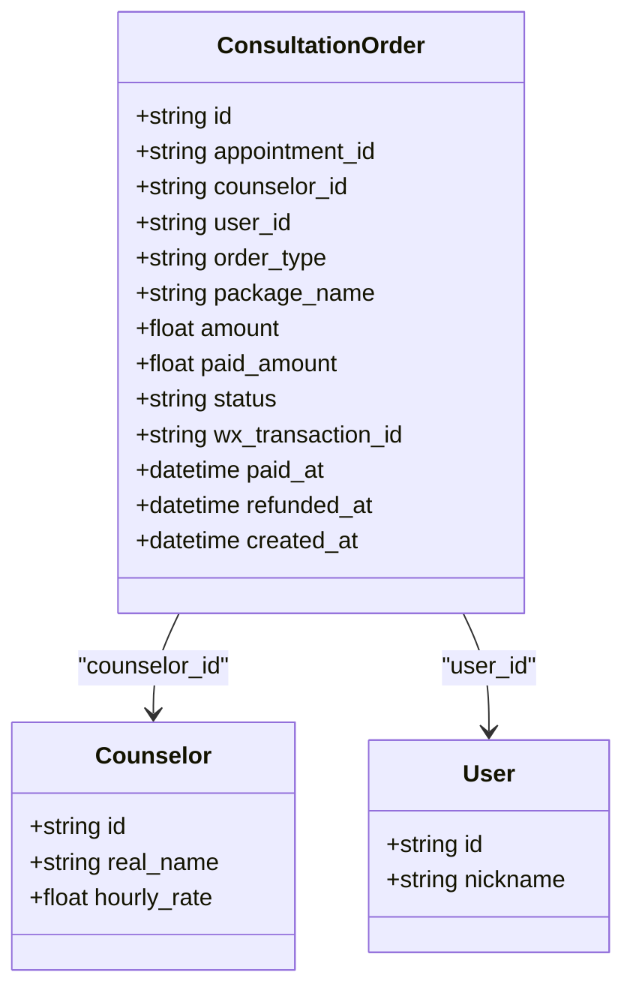
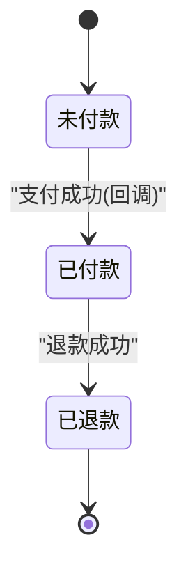
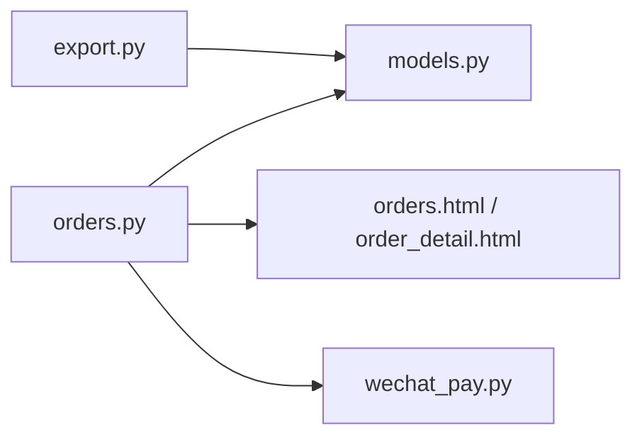

# 订单管理

<cite>
**本文引用的文件**   
- [hushai/meditation/admin/pages/orders.py](file://hushai/meditation/admin/pages/orders.py)
- [hushai/meditation/admin/templates/orders.html](file://hushai/meditation/admin/templates/orders.html)
- [hushai/meditation/admin/templates/order_detail.html](file://hushai/meditation/admin/templates/order_detail.html)
- [hushai/meditation/db/models.py](file://hushai/meditation/db/models.py)
- [hushai/meditation/core/wechat_pay.py](file://hushai/meditation/core/wechat_pay.py)
- [hushai/meditation/admin/pages/export.py](file://hushai/meditation/admin/pages/export.py)
</cite>

## 目录
1. [引言](#引言)
2. [项目结构](#项目结构)
3. [核心组件](#核心组件)
4. [架构总览](#架构总览)
5. [详细组件分析](#详细组件分析)
6. [依赖分析](#依赖分析)
7. [性能考虑](#性能考虑)
8. [故障排查指南](#故障排查指南)
9. [结论](#结论)
10. [附录](#附录)

## 引言
本设计文档面向 hush.ai 管理后台的“订单管理”功能，覆盖以下目标：
- 订单列表页面布局与筛选能力（支付状态、金额范围、日期范围）
- 订单详情查看界面（用户信息、服务详情、支付记录、发票信息）
- 订单状态流转机制（支付成功、退款处理、服务完成）
- 财务报表生成与数据分析方案
- 订单异常处理与客服工单系统的界面设计建议

说明：
- 当前代码已实现订单列表与订单详情页面的基础能力，包含按支付状态筛选、分页、统计卡片等。
- 微信支付下单、查询、退款与回调验签封装在统一模块中，可作为支付流程与状态变更的基础。
- 导出能力已在通用导出模块中提供，可复用为报表导出扩展点。

## 项目结构
围绕订单管理的后端路由、模板与数据模型分布如下：
- 路由与页面逻辑：admin/pages/orders.py
- 页面模板：admin/templates/orders.html、order_detail.html
- 数据模型：db/models.py（ConsultationOrder、User、Counselor、ServiceRecord 等）
- 支付集成：core/wechat_pay.py
- 导出能力：admin/pages/export.py（可复用为报表导出入口）

图表来源
- [hushai/meditation/admin/pages/orders.py:17-89](file://hushai/meditation/admin/pages/orders.py#L17-L89)
- [hushai/meditation/admin/pages/orders.py:92-125](file://hushai/meditation/admin/pages/orders.py#L92-L125)
- [hushai/meditation/db/models.py:355-383](file://hushai/meditation/db/models.py#L355-L383)
- [hushai/meditation/core/wechat_pay.py:59-154](file://hushai/meditation/core/wechat_pay.py#L59-L154)
- [hushai/meditation/admin/pages/export.py:17-51](file://hushai/meditation/admin/pages/export.py#L17-L51)

章节来源
- [hushai/meditation/admin/pages/orders.py:17-89](file://hushai/meditation/admin/pages/orders.py#L17-L89)
- [hushai/meditation/admin/pages/orders.py:92-125](file://hushai/meditation/admin/pages/orders.py#L92-L125)
- [hushai/meditation/db/models.py:355-383](file://hushai/meditation/db/models.py#L355-L383)
- [hushai/meditation/core/wechat_pay.py:59-154](file://hushai/meditation/core/wechat_pay.py#L59-L154)
- [hushai/meditation/admin/pages/export.py:17-51](file://hushai/meditation/admin/pages/export.py#L17-L51)

## 核心组件
- 订单列表页
  - 支持按支付状态筛选（未付款/已付款/已退款）、分页、统计卡片（总订单、待付款、累计收入、已退款）。
  - 数据来源：ConsultationOrder 表；统计通过聚合函数计算。
- 订单详情页
  - 展示订单基本信息、支付时间、退款时间、关联咨询师与用户信息。
- 支付与退款
  - 微信支付 v3 封装：下单、查询、退款、回调签名验证与结果解析。
- 导出与报表
  - 通用导出接口可用于订单报表扩展（CSV/Excel）。

章节来源
- [hushai/meditation/admin/pages/orders.py:17-89](file://hushai/meditation/admin/pages/orders.py#L17-L89)
- [hushai/meditation/admin/pages/orders.py:92-125](file://hushai/meditation/admin/pages/orders.py#L92-L125)
- [hushai/meditation/core/wechat_pay.py:59-154](file://hushai/meditation/core/wechat_pay.py#L59-L154)
- [hushai/meditation/admin/pages/export.py:17-51](file://hushai/meditation/admin/pages/export.py#L17-L51)

## 架构总览
订单管理前后端交互与数据流如下：

图表来源
- [hushai/meditation/admin/pages/orders.py:17-89](file://hushai/meditation/admin/pages/orders.py#L17-L89)
- [hushai/meditation/admin/pages/orders.py:92-125](file://hushai/meditation/admin/pages/orders.py#L92-L125)
- [hushai/meditation/core/wechat_pay.py:126-154](file://hushai/meditation/core/wechat_pay.py#L126-L154)
- [hushai/meditation/admin/pages/export.py:17-51](file://hushai/meditation/admin/pages/export.py#L17-L51)

## 详细组件分析

### 订单列表页面
- 布局与筛选
  - 顶部统计卡片：总订单、待付款、累计收入、已退款。
  - 筛选栏：支付状态下拉（全部/未付款/已付款/已退款），支持查询与清除。
  - 列表表格：订单号、类型、金额、实付、状态、创建时间、操作（详情）。
  - 分页：保留 status_filter 参数进行跨页筛选。
- 数据与统计
  - 列表查询：按 created_at 倒序分页，支持 status 过滤。
  - 统计：total_orders、unpaid/paid/refunded 计数；total_revenue 仅统计 paid 状态的 paid_amount 总和；total_amount 统计所有 amount 总和。
- 前端模板
  - orders.html 使用模板变量渲染统计、筛选表单、表格与分页。

图表来源
- [hushai/meditation/admin/pages/orders.py:17-89](file://hushai/meditation/admin/pages/orders.py#L17-L89)
- [hushai/meditation/admin/templates/orders.html:1-72](file://hushai/meditation/admin/templates/orders.html#L1-L72)

章节来源
- [hushai/meditation/admin/pages/orders.py:17-89](file://hushai/meditation/admin/pages/orders.py#L17-L89)
- [hushai/meditation/admin/templates/orders.html:1-72](file://hushai/meditation/admin/templates/orders.html#L1-L72)

### 订单详情页面
- 展示内容
  - 订单信息：订单号、类型、金额、实付、状态、微信支付单号、创建/支付/退款时间。
  - 咨询师信息：姓名、时薪。
  - 用户信息：用户ID、昵称。
- 数据获取
  - 根据 order_id 查询 ConsultationOrder，并关联 Counselor 与 User。
- 模板渲染
  - order_detail.html 以卡片网格形式展示详细信息。

图表来源
- [hushai/meditation/db/models.py:355-383](file://hushai/meditation/db/models.py#L355-L383)
- [hushai/meditation/db/models.py:273-302](file://hushai/meditation/db/models.py#L273-L302)
- [hushai/meditation/db/models.py:37-66](file://hushai/meditation/db/models.py#L37-L66)
- [hushai/meditation/admin/pages/orders.py:92-125](file://hushai/meditation/admin/pages/orders.py#L92-L125)
- [hushai/meditation/admin/templates/order_detail.html:1-64](file://hushai/meditation/admin/templates/order_detail.html#L1-L64)

章节来源
- [hushai/meditation/admin/pages/orders.py:92-125](file://hushai/meditation/admin/pages/orders.py#L92-L125)
- [hushai/meditation/admin/templates/order_detail.html:1-64](file://hushai/meditation/admin/templates/order_detail.html#L1-L64)
- [hushai/meditation/db/models.py:355-383](file://hushai/meditation/db/models.py#L355-L383)

### 订单状态流转机制
- 状态定义
  - unpaid（未付款）、paid（已付款）、refunded（已退款）。
- 关键时间点
  - created_at：订单创建时间
  - paid_at：支付成功时间
  - refunded_at：退款完成时间
- 支付成功流程
  - 前端发起下单（Native/JSAPI）→ 微信返回 code_url/prepay_id → 用户完成支付 → 微信回调通知 → 服务端验签并更新订单状态为 paid，写入 paid_at 与交易号。
- 退款处理流程
  - 管理员或系统触发退款 → 调用退款接口 → 微信返回结果 → 更新订单状态为 refunded，写入 refunded_at。
- 服务完成
  - 与服务记录 ServiceRecord 关联，当服务完成后，可在订单详情或服务记录中体现完成状态。

图表来源
- [hushai/meditation/db/models.py:355-383](file://hushai/meditation/db/models.py#L355-L383)
- [hushai/meditation/core/wechat_pay.py:126-154](file://hushai/meditation/core/wechat_pay.py#L126-L154)
- [hushai/meditation/core/wechat_pay.py:157-193](file://hushai/meditation/core/wechat_pay.py#L157-L193)

章节来源
- [hushai/meditation/db/models.py:355-383](file://hushai/meditation/db/models.py#L355-L383)
- [hushai/meditation/core/wechat_pay.py:126-154](file://hushai/meditation/core/wechat_pay.py#L126-L154)
- [hushai/meditation/core/wechat_pay.py:157-193](file://hushai/meditation/core/wechat_pay.py#L157-L193)

### 财务报表生成与数据分析方案
- 现有导出能力
  - export.py 提供对话、审计日志、用户、记忆、知识库的导出接口，采用统一的 get_export_response 返回 CSV/Excel。
- 订单报表扩展建议
  - 新增 /export/orders 接口，基于 ConsultationOrder 与关联表（User、Counselor、ServiceRecord）导出数据字段：
    - 订单号、类型、套餐名、金额、实付、状态、支付时间、退款时间、创建时间
    - 用户ID、昵称
    - 咨询师姓名、时薪
    - 服务记录摘要（加密字段需解密后导出，注意合规）
  - 增加筛选参数：status、date_from、date_to、amount_min、amount_max。
  - 输出格式：CSV/Excel，支持分页大文件分片导出。
- 数据分析维度
  - 收入趋势（按日/周/月）
  - 订单量与转化率（未付款→已付款）
  - 退款率与退款原因分布
  - 咨询师收入贡献（按小时费率×服务时长）
  - 用户复购与留存（同一用户多次订单）

章节来源
- [hushai/meditation/admin/pages/export.py:17-51](file://hushai/meditation/admin/pages/export.py#L17-L51)
- [hushai/meditation/db/models.py:355-383](file://hushai/meditation/db/models.py#L355-L383)

### 订单异常处理与客服工单系统界面设计
- 异常场景
  - 支付超时或未到账：需对账与人工干预
  - 退款失败或部分退款：需重试与记录
  - 订单不存在或权限不足：404/401 错误
- 异常处理策略
  - 幂等性：退款与状态更新需保证幂等，避免重复处理
  - 补偿任务：定时任务扫描未同步订单，调用查询接口补全状态
  - 审计日志：记录所有异常与处理过程
- 客服工单界面建议
  - 工单列表：订单号、问题类型（支付异常/退款异常/服务争议）、状态（新建/处理中/已解决）、优先级、创建时间、处理人
  - 工单详情：订单详情快照、聊天记录、处理步骤、附件（截图/凭证）
  - 操作按钮：转交、升级、关闭、备注
  - 与订单联动：从订单详情直接创建工单，自动带入上下文

[本节为概念性设计，不直接分析具体文件，故无章节来源]

## 依赖分析
- 模块耦合
  - orders.py 依赖 models.py 的 ORM 模型与 SQLAlchemy 查询
  - orders.py 渲染模板 orders.html 与 order_detail.html
  - wechat_pay.py 提供支付相关 API 封装，供后续订单状态变更使用
  - export.py 提供通用导出能力，可复用为订单报表
- 外部依赖
  - 微信支付 v3 API（HTTP 客户端 httpx）
  - 数据库会话（AsyncSession）

图表来源
- [hushai/meditation/admin/pages/orders.py:17-89](file://hushai/meditation/admin/pages/orders.py#L17-L89)
- [hushai/meditation/admin/pages/orders.py:92-125](file://hushai/meditation/admin/pages/orders.py#L92-L125)
- [hushai/meditation/db/models.py:355-383](file://hushai/meditation/db/models.py#L355-L383)
- [hushai/meditation/core/wechat_pay.py:59-154](file://hushai/meditation/core/wechat_pay.py#L59-L154)
- [hushai/meditation/admin/pages/export.py:17-51](file://hushai/meditation/admin/pages/export.py#L17-L51)

章节来源
- [hushai/meditation/admin/pages/orders.py:17-89](file://hushai/meditation/admin/pages/orders.py#L17-L89)
- [hushai/meditation/admin/pages/orders.py:92-125](file://hushai/meditation/admin/pages/orders.py#L92-L125)
- [hushai/meditation/db/models.py:355-383](file://hushai/meditation/db/models.py#L355-L383)
- [hushai/meditation/core/wechat_pay.py:59-154](file://hushai/meditation/core/wechat_pay.py#L59-L154)
- [hushai/meditation/admin/pages/export.py:17-51](file://hushai/meditation/admin/pages/export.py#L17-L51)

## 性能考虑
- 查询优化
  - 列表页已使用分页与排序，建议在常用筛选字段上建立索引（如 status、created_at）
  - 统计查询使用聚合函数，避免全表扫描；必要时引入物化视图或汇总表
- 导出性能
  - 大数据量导出采用流式响应与分片下载，避免内存溢出
- 支付回调
  - 验签与状态更新需幂等，避免重复处理导致性能抖动

[本节提供一般性指导，不直接分析具体文件，故无章节来源]

## 故障排查指南
- 常见问题
  - 订单不存在：详情页返回 404，检查 order_id 是否正确
  - 管理员未登录：列表与详情均会重定向到登录页
  - 微信支付失败：下单/查询/退款接口返回错误码，检查配置与网络
- 定位方法
  - 查看路由返回的 HTTP 状态码与错误消息
  - 检查数据库记录是否存在且状态一致
  - 核对微信支付回调签名与解密逻辑

章节来源
- [hushai/meditation/admin/pages/orders.py:92-125](file://hushai/meditation/admin/pages/orders.py#L92-L125)
- [hushai/meditation/core/wechat_pay.py:59-154](file://hushai/meditation/core/wechat_pay.py#L59-L154)

## 结论
- 订单列表与详情页面已具备基础能力，满足日常管理与查看需求。
- 支付与退款流程由微信支付封装模块支撑，便于扩展与维护。
- 导出能力可快速扩展为订单报表，结合筛选与聚合实现多维度数据分析。
- 建议补充金额范围与日期筛选、退款操作入口、异常处理与客服工单界面，以提升运营效率与用户体验。

[本节为总结性内容，不直接分析具体文件，故无章节来源]

## 附录
- 字段与状态参考
  - 订单状态：unpaid、paid、refunded
  - 关键字段：amount、paid_amount、wx_transaction_id、paid_at、refunded_at
- 模板路径
  - 订单列表：orders.html
  - 订单详情：order_detail.html

[本节为参考信息，不直接分析具体文件，故无章节来源]