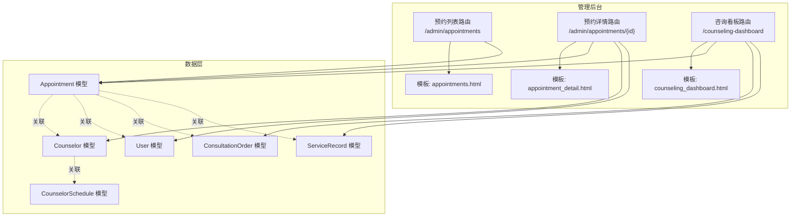
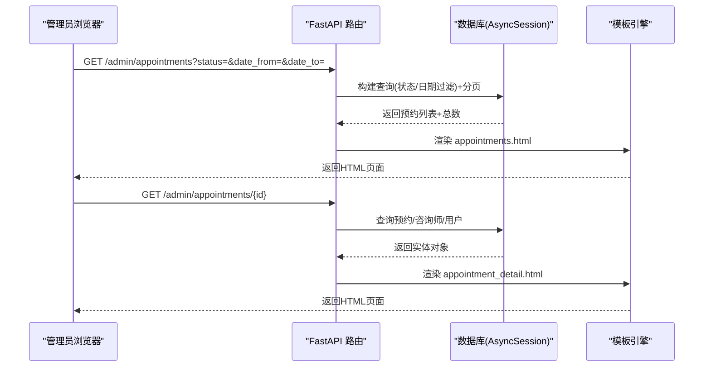
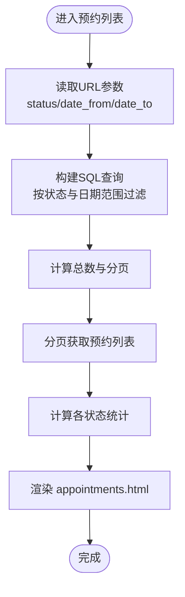
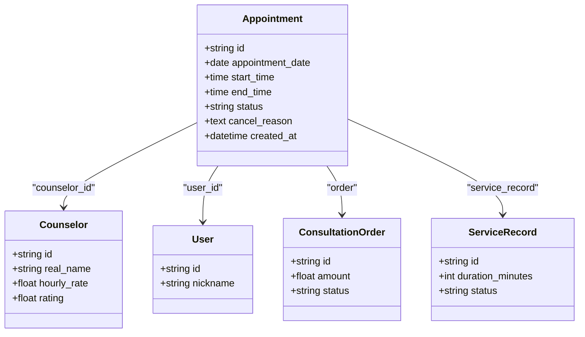
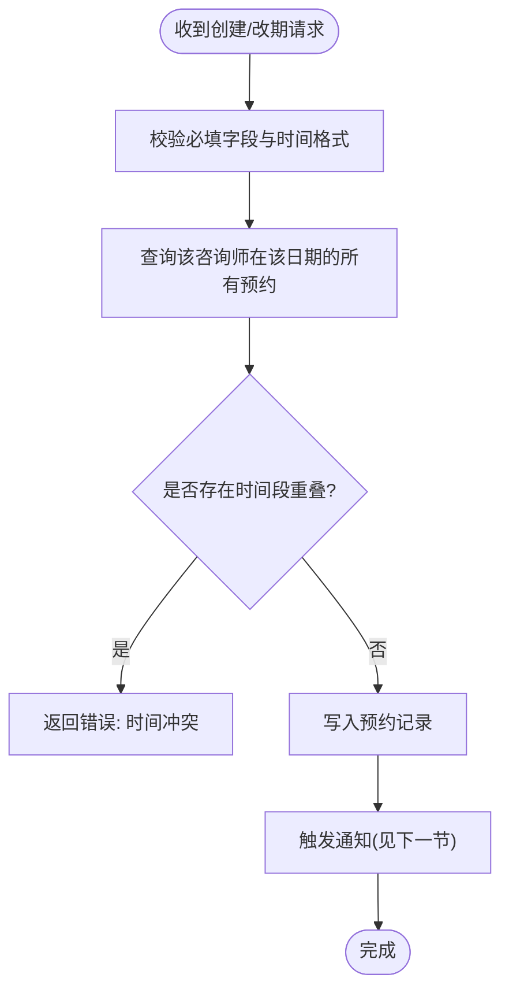
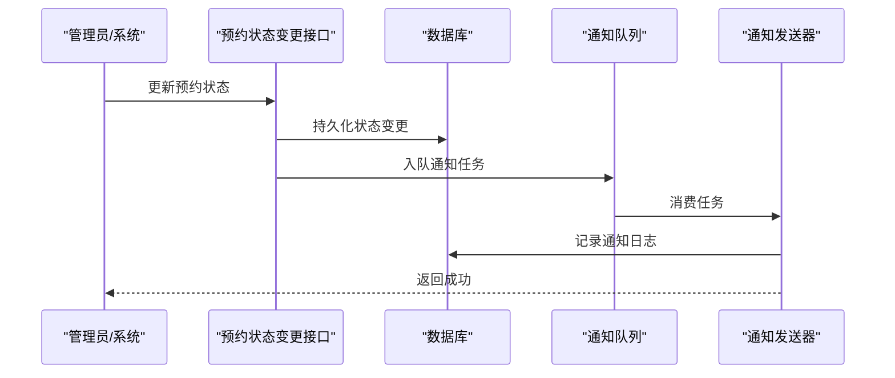
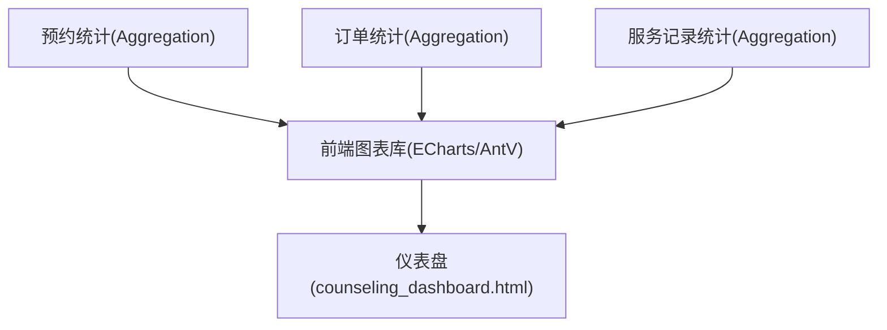
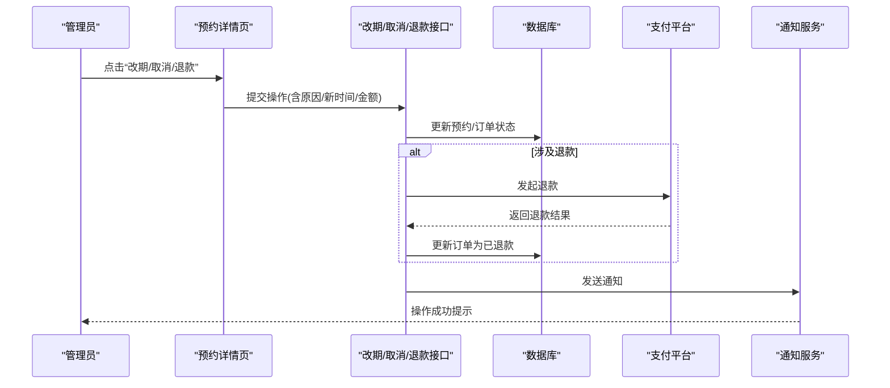

# 预约管理

<cite>
**本文引用的文件**   
- [hushai/meditation/admin/pages/appointments.py](file://hushai/meditation/admin/pages/appointments.py)
- [hushai/meditation/admin/templates/appointments.html](file://hushai/meditation/admin/templates/appointments.html)
- [hushai/meditation/admin/templates/appointment_detail.html](file://hushai/meditation/admin/templates/appointment_detail.html)
- [hushai/meditation/db/models.py](file://hushai/meditation/db/models.py)
- [hushai/meditation/admin/pages/counseling_dashboard.py](file://hushai/meditation/admin/pages/counseling_dashboard.py)
</cite>

## 目录
1. [简介](#简介)
2. [项目结构](#项目结构)
3. [核心组件](#核心组件)
4. [架构总览](#架构总览)
5. [详细组件分析](#详细组件分析)
6. [依赖关系分析](#依赖关系分析)
7. [性能考虑](#性能考虑)
8. [故障排查指南](#故障排查指南)
9. [结论](#结论)
10. [附录](#附录)

## 简介
本设计文档面向 hush.ai 管理后台的“预约管理”功能，覆盖以下目标：
- 预约列表页面：状态筛选（待确认、进行中、已完成、已取消）、时间范围查询与咨询师筛选。
- 预约详情查看：用户信息、咨询主题、预约时间与历史记录。
- 冲突检测机制与自动通知发送方案。
- 预约统计报表与可视化图表实现方案。
- 改期、取消处理与退款流程的界面设计。

说明：
- 当前代码已提供预约列表与详情页的基础能力；部分高级能力（如冲突检测、自动通知、完整退款流程）为扩展设计方案，将在文档中给出可落地的实现建议与数据模型补充点。

## 项目结构
围绕“预约管理”的关键文件与职责如下：
- 路由与页面逻辑：
  - 预约列表与详情页面路由：[hushai/meditation/admin/pages/appointments.py](file://hushai/meditation/admin/pages/appointments.py)
  - 咨询看板（含预约统计）：[hushai/meditation/admin/pages/counseling_dashboard.py](file://hushai/meditation/admin/pages/counseling_dashboard.py)
- 模板视图：
  - 预约列表页模板：[hushai/meditation/admin/templates/appointments.html](file://hushai/meditation/admin/templates/appointments.html)
  - 预约详情页模板：[hushai/meditation/admin/templates/appointment_detail.html](file://hushai/meditation/admin/templates/appointment_detail.html)
- 数据模型：
  - 预约、咨询师、排班、订单与服务记录等 ORM 模型：[hushai/meditation/db/models.py](file://hushai/meditation/db/models.py)

图示来源
- [hushai/meditation/admin/pages/appointments.py:19-91](file://hushai/meditation/admin/pages/appointments.py#L19-L91)
- [hushai/meditation/admin/pages/appointments.py:94-126](file://hushai/meditation/admin/pages/appointments.py#L94-L126)
- [hushai/meditation/admin/pages/counseling_dashboard.py:24-127](file://hushai/meditation/admin/pages/counseling_dashboard.py#L24-L127)
- [hushai/meditation/db/models.py:327-434](file://hushai/meditation/db/models.py#L327-L434)

章节来源
- [hushai/meditation/admin/pages/appointments.py:19-126](file://hushai/meditation/admin/pages/appointments.py#L19-L126)
- [hushai/meditation/admin/templates/appointments.html:1-74](file://hushai/meditation/admin/templates/appointments.html#L1-L74)
- [hushai/meditation/admin/templates/appointment_detail.html:1-57](file://hushai/meditation/admin/templates/appointment_detail.html#L1-L57)
- [hushai/meditation/db/models.py:273-434](file://hushai/meditation/db/models.py#L273-L434)
- [hushai/meditation/admin/pages/counseling_dashboard.py:24-127](file://hushai/meditation/admin/pages/counseling_dashboard.py#L24-L127)

## 核心组件
- 预约列表页面
  - 支持按状态筛选（待确认、已确认、已完成、已取消、已拒绝）。
  - 支持按日期范围筛选（开始日期、结束日期）。
  - 展示分页与基础统计卡片（总数、各状态数量）。
- 预约详情页面
  - 展示预约基本信息（日期、时间段、状态、创建时间、取消原因）。
  - 展示咨询师与来访者信息（姓名、时薪、评分、昵称等）。
- 咨询看板
  - 汇总预约、订单与服务记录的统计数据，便于运营监控。

章节来源
- [hushai/meditation/admin/pages/appointments.py:19-91](file://hushai/meditation/admin/pages/appointments.py#L19-L91)
- [hushai/meditation/admin/templates/appointments.html:19-74](file://hushai/meditation/admin/templates/appointments.html#L19-L74)
- [hushai/meditation/admin/pages/appointments.py:94-126](file://hushai/meditation/admin/pages/appointments.py#L94-L126)
- [hushai/meditation/admin/templates/appointment_detail.html:10-57](file://hushai/meditation/admin/templates/appointment_detail.html#L10-L57)
- [hushai/meditation/admin/pages/counseling_dashboard.py:24-127](file://hushai/meditation/admin/pages/counseling_dashboard.py#L24-L127)

## 架构总览
从请求到渲染的数据流如下：
- 管理员访问预约列表或详情页面，后端校验登录态并执行数据库查询。
- 列表页根据状态与日期范围过滤，返回分页结果与统计指标。
- 详情页加载预约、咨询师与用户信息，渲染至模板。
- 看板页聚合多表统计，用于报表与可视化。

图示来源
- [hushai/meditation/admin/pages/appointments.py:19-91](file://hushai/meditation/admin/pages/appointments.py#L19-L91)
- [hushai/meditation/admin/pages/appointments.py:94-126](file://hushai/meditation/admin/pages/appointments.py#L94-L126)

## 详细组件分析

### 预约列表页面设计
- 筛选条件
  - 状态筛选：下拉选择包含“全部状态、待确认、已确认、已完成、已取消、已拒绝”。
  - 时间范围：开始日期与结束日期输入框，提交后以区间过滤。
  - 咨询师筛选：当前模板未内置，可在表单增加下拉选择咨询师字段，并在后端追加 counselor_id 过滤条件。
- 列表展示
  - 表格列：预约日期、时间段、状态、创建时间、操作（跳转详情）。
  - 分页：支持上一页/下一页与页码跳转，保留筛选参数。
- 统计卡片
  - 显示总预约数与各状态数量，便于快速掌握业务概况。

图示来源
- [hushai/meditation/admin/pages/appointments.py:19-91](file://hushai/meditation/admin/pages/appointments.py#L19-L91)
- [hushai/meditation/admin/templates/appointments.html:19-74](file://hushai/meditation/admin/templates/appointments.html#L19-L74)

章节来源
- [hushai/meditation/admin/pages/appointments.py:19-91](file://hushai/meditation/admin/pages/appointments.py#L19-L91)
- [hushai/meditation/admin/templates/appointments.html:19-74](file://hushai/meditation/admin/templates/appointments.html#L19-L74)

### 预约详情查看界面设计
- 基本信息
  - 预约日期、时间段、状态、创建时间、取消原因（如有）。
- 相关主体
  - 咨询师：姓名、时薪、评分。
  - 来访者：用户ID（脱敏）、昵称。
- 历史记录
  - 当前模板未展示历史；建议在详情页增加“服务记录”与“订单”区块，通过外键关联 ServiceRecord 与 ConsultationOrder 进行展示。

图示来源
- [hushai/meditation/db/models.py:327-434](file://hushai/meditation/db/models.py#L327-L434)

章节来源
- [hushai/meditation/admin/pages/appointments.py:94-126](file://hushai/meditation/admin/pages/appointments.py#L94-L126)
- [hushai/meditation/admin/templates/appointment_detail.html:10-57](file://hushai/meditation/admin/templates/appointment_detail.html#L10-L57)
- [hushai/meditation/db/models.py:327-434](file://hushai/meditation/db/models.py#L327-L434)

### 预约冲突检测机制（扩展方案）
目标：在创建或改期预约时，确保同一咨询师在同一时间段内不重复占用。

- 数据依据
  - 使用 CounselorSchedule 定义可用时段，Appointment 记录实际预约。
  - 冲突判定：同一 counselor_id、appointment_date 下，新预约的时间段与已有预约时间段存在重叠。
- 算法要点
  - 重叠判断：new_start < existing_end AND new_end > existing_start。
  - 若存在重叠则拒绝创建/改期，并提示用户调整时间。
- 实现位置建议
  - 在创建/改期接口中加入冲突检查逻辑，基于 CounselorSchedule 与 Appointment 进行查询与比对。
  - 若需要更细粒度控制，可结合 AppointmentSettings 中的 slot_duration_minutes 与 min_advance_hours 等规则。

图示来源
- [hushai/meditation/db/models.py:305-353](file://hushai/meditation/db/models.py#L305-L353)

章节来源
- [hushai/meditation/db/models.py:305-353](file://hushai/meditation/db/models.py#L305-L353)

### 自动通知发送功能（扩展方案）
目标：在预约关键节点向用户与咨询师发送通知（如待确认、已确认、已开始、已完成、已取消）。

- 触发时机
  - 预约状态变更：pending → confirmed/completed/cancelled/rejected。
  - 提醒：基于 AppointmentSettings.reminder_before_minutes 提前提醒。
- 通知渠道
  - 站内消息、短信、邮件或微信模板消息（可按配置选择）。
- 实现建议
  - 新增通知记录表（如 NotificationLog），记录发送对象、类型、内容、状态与重试策略。
  - 在状态变更事务完成后异步发送通知，避免阻塞主流程。
  - 支持失败重试与幂等（基于唯一消息ID）。

图示来源
- [hushai/meditation/db/models.py:327-434](file://hushai/meditation/db/models.py#L327-L434)

章节来源
- [hushai/meditation/db/models.py:327-434](file://hushai/meditation/db/models.py#L327-L434)

### 预约统计报表与可视化图表（扩展方案）
- 数据来源
  - 预约：Appointment（状态、日期、时间段）。
  - 订单：ConsultationOrder（金额、支付状态、创建时间）。
  - 服务记录：ServiceRecord（时长、状态）。
- 看板指标
  - 咨询师总量、认证通过量、在线量。
  - 预约总量、待确认、已确认、已完成。
  - 订单总量、总收入、今日订单数。
  - 服务记录总量、累计服务时长。
- 可视化建议
  - 折线图：近7天/30天预约趋势。
  - 柱状图：各状态预约占比。
  - 饼图：收入构成（单次/套餐）。
  - 排行榜：咨询师接单量与满意度。

图示来源
- [hushai/meditation/admin/pages/counseling_dashboard.py:24-127](file://hushai/meditation/admin/pages/counseling_dashboard.py#L24-L127)
- [hushai/meditation/db/models.py:355-434](file://hushai/meditation/db/models.py#L355-L434)

章节来源
- [hushai/meditation/admin/pages/counseling_dashboard.py:24-127](file://hushai/meditation/admin/pages/counseling_dashboard.py#L24-L127)
- [hushai/meditation/db/models.py:355-434](file://hushai/meditation/db/models.py#L355-L434)

### 预约改期、取消处理与退款流程（界面设计）
- 改期
  - 入口：预约详情页“改期”按钮。
  - 交互：弹出时间选择器，选择新的日期与时间段；后端执行冲突检测；通过后更新预约时间并记录审计日志。
  - 反馈：成功提示并刷新详情；失败提示冲突原因。
- 取消
  - 入口：预约详情页“取消”按钮。
  - 交互：填写取消原因；确认后更新状态为“已取消”，并触发通知。
  - 退款联动：若订单已支付且符合退款条件，进入退款流程。
- 退款
  - 入口：预约详情页“申请退款”按钮（仅当订单满足条件时可见）。
  - 交互：选择退款原因与金额（全额或部分）；提交后调用支付平台退款接口；成功后更新订单状态为“已退款”并记录审计日志。
  - 通知：向用户与咨询师发送退款结果通知。

图示来源
- [hushai/meditation/db/models.py:327-434](file://hushai/meditation/db/models.py#L327-L434)

章节来源
- [hushai/meditation/db/models.py:327-434](file://hushai/meditation/db/models.py#L327-L434)

## 依赖关系分析
- 模块耦合
  - 预约列表与详情路由强依赖 Appointment、Counselor、User 模型。
  - 看板路由聚合 Appointment、ConsultationOrder、ServiceRecord 统计。
- 外部依赖
  - FastAPI 路由与模板渲染。
  - SQLAlchemy AsyncSession 异步数据库访问。
- 潜在风险
  - 复杂筛选与统计可能带来较多 SQL 查询，需关注索引与分页优化。
  - 冲突检测与退款流程涉及跨表一致性，建议使用事务与幂等设计。

```mermaid
graph LR
AppointmentsPy["appointments.py"] --> Models["models.py(Appointment/Counselor/User)"]
DashboardPy["counseling_dashboard.py"] --> Models
Templates["appointments.html / appointment_detail.html"] --> AppointmentsPy
```

图示来源
- [hushai/meditation/admin/pages/appointments.py:19-126](file://hushai/meditation/admin/pages/appointments.py#L19-L126)
- [hushai/meditation/admin/pages/counseling_dashboard.py:24-127](file://hushai/meditation/admin/pages/counseling_dashboard.py#L24-L127)
- [hushai/meditation/db/models.py:327-434](file://hushai/meditation/db/models.py#L327-L434)

章节来源
- [hushai/meditation/admin/pages/appointments.py:19-126](file://hushai/meditation/admin/pages/appointments.py#L19-L126)
- [hushai/meditation/admin/pages/counseling_dashboard.py:24-127](file://hushai/meditation/admin/pages/counseling_dashboard.py#L24-L127)
- [hushai/meditation/db/models.py:327-434](file://hushai/meditation/db/models.py#L327-L434)

## 性能考虑
- 查询优化
  - 对常用筛选字段建立索引（如 Appointment.status、Appointment.appointment_date、Counselor.status）。
  - 使用 count 子查询与分页 offset/limit 减少数据传输。
- 统计聚合
  - 看板统计尽量使用 SQL 聚合函数（COUNT/SUM/COALESCE）减少应用层计算。
- 并发与事务
  - 冲突检测与状态变更应置于事务中，保证一致性与原子性。
- 缓存
  - 对热点统计（如当日预约数）可引入短期缓存以降低数据库压力。

## 故障排查指南
- 常见问题
  - 登录态失效：路由会重定向至登录页，检查会话与会话存储。
  - 404 预约不存在：确认 ID 有效与权限。
  - 筛选无结果：检查日期格式与状态值是否匹配。
- 定位步骤
  - 查看后端日志与数据库慢查询。
  - 核对模板变量是否正确传入（如 stats、appointments）。
  - 验证外键关联是否完整（咨询师/用户信息缺失）。

章节来源
- [hushai/meditation/admin/pages/appointments.py:19-126](file://hushai/meditation/admin/pages/appointments.py#L19-L126)

## 结论
当前代码已提供预约列表与详情的基础能力，并具备完善的统计看板框架。为实现完整的预约管理体验，建议优先落地冲突检测、自动通知与退款流程，同时完善预约改期与取消的交互与审计记录。通过合理的索引与聚合优化，可保障系统在规模增长下的稳定性与响应速度。

## 附录
- 术语
  - 待确认：pending
  - 已确认：confirmed
  - 已完成：completed
  - 已取消：cancelled
  - 已拒绝：rejected
- 参考路径
  - 列表路由与模板：[hushai/meditation/admin/pages/appointments.py](file://hushai/meditation/admin/pages/appointments.py)、[hushai/meditation/admin/templates/appointments.html](file://hushai/meditation/admin/templates/appointments.html)
  - 详情路由与模板：[hushai/meditation/admin/pages/appointments.py](file://hushai/meditation/admin/pages/appointments.py)、[hushai/meditation/admin/templates/appointment_detail.html](file://hushai/meditation/admin/templates/appointment_detail.html)
  - 数据模型：[hushai/meditation/db/models.py](file://hushai/meditation/db/models.py)
  - 看板统计：[hushai/meditation/admin/pages/counseling_dashboard.py](file://hushai/meditation/admin/pages/counseling_dashboard.py)