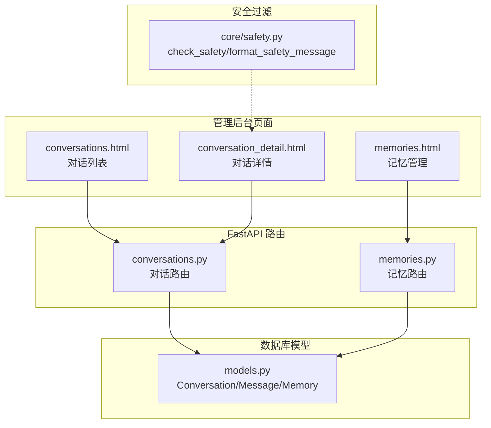
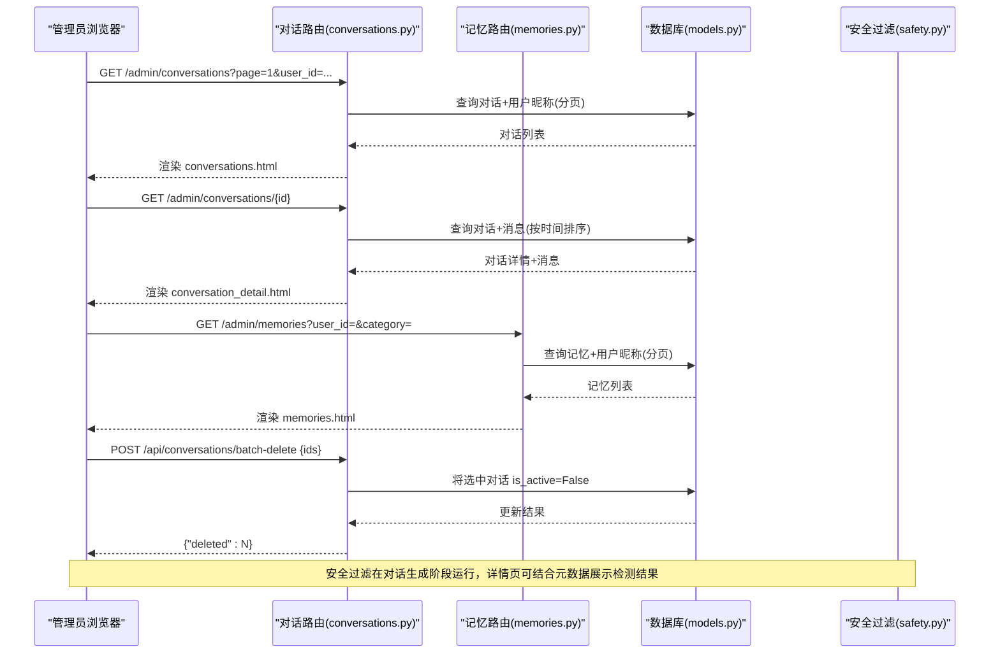
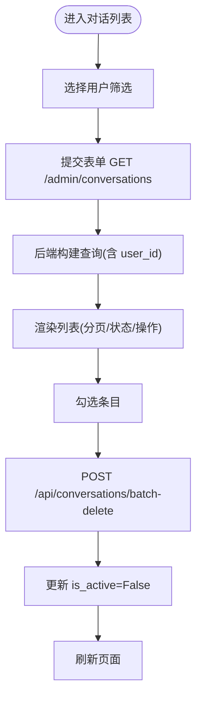
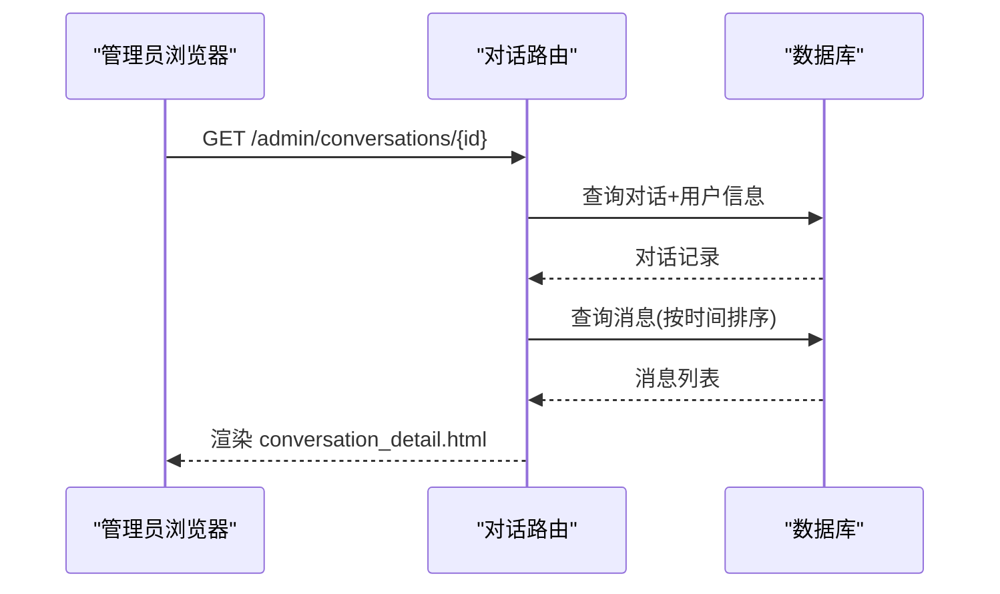
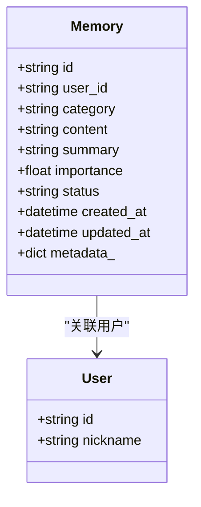
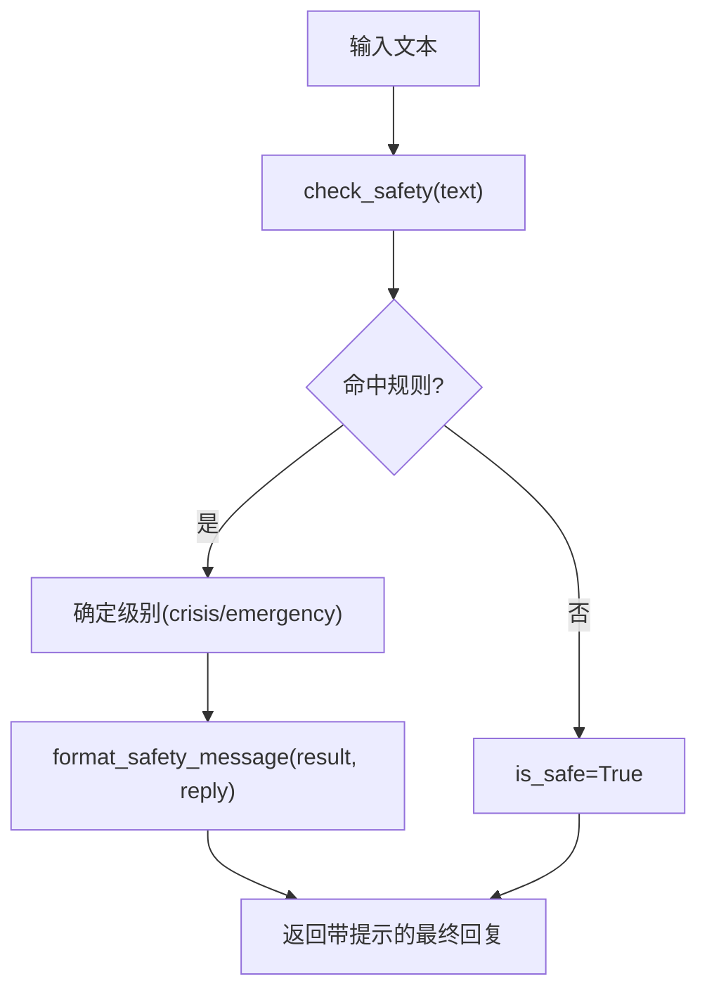
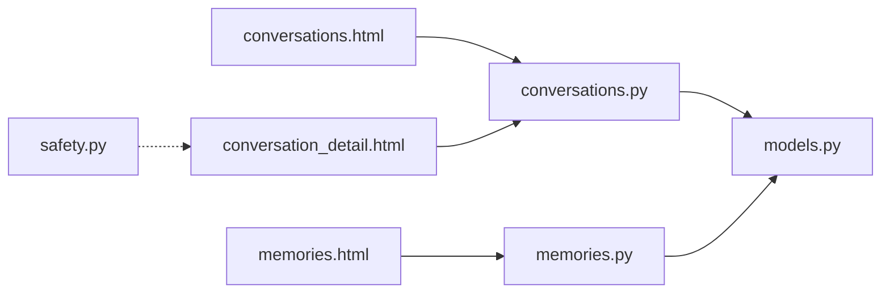

# 对话监控界面

<cite>
**本文引用的文件列表**
- [hushai/meditation/admin/pages/conversations.py](file://hushai/meditation/admin/pages/conversations.py)
- [hushai/meditation/admin/templates/conversations.html](file://hushai/meditation/admin/templates/conversations.html)
- [hushai/meditation/admin/templates/conversation_detail.html](file://hushai/meditation/admin/templates/conversation_detail.html)
- [hushai/meditation/admin/pages/memories.py](file://hushai/meditation/admin/pages/memories.py)
- [hushai/meditation/admin/templates/memories.html](file://hushai/meditation/admin/templates/memories.html)
- [hushai/meditation/db/models.py](file://hushai/meditation/db/models.py)
- [hushai/meditation/core/safety.py](file://hushai/meditation/core/safety.py)
- [tests/meditation/test_safety.py](file://tests/meditation/test_safety.py)
</cite>

## 目录
1. [引言](#引言)
2. [项目结构](#项目结构)
3. [核心组件](#核心组件)
4. [架构总览](#架构总览)
5. [详细组件分析](#详细组件分析)
6. [依赖关系分析](#依赖关系分析)
7. [性能与可用性考量](#性能与可用性考量)
8. [故障排查指南](#故障排查指南)
9. [结论](#结论)
10. [附录：扩展设计建议](#附录扩展设计建议)

## 引言
本文件为 hush.ai 管理后台的“对话监控”功能提供详细的界面设计文档。内容覆盖以下关键能力：
- 对话列表页：用户筛选、分页、状态标记、批量处理（软删除）与导出入口
- 对话详情页：消息时间线、上下文信息展示、元数据折叠查看
- 长期记忆管理：按用户与分类筛选、卡片化展示、单条删除与批量删除
- 对话质量评估可视化：满意度评分、关键词提取、情绪分析的界面规划与数据接入点
- 敏感内容检测与违规对话处理：基于安全过滤模块的前端呈现与处置流程

## 项目结构
围绕“对话监控”相关的前后端实现，主要涉及如下文件：
- 页面路由与模板：对话列表与详情、记忆管理
- 数据模型：对话、消息、记忆等实体定义
- 安全过滤：危机信号检测与提示文案生成

图表来源
- [hushai/meditation/admin/templates/conversations.html](file://hushai/meditation/admin/templates/conversations.html)
- [hushai/meditation/admin/templates/conversation_detail.html](file://hushai/meditation/admin/templates/conversation_detail.html)
- [hushai/meditation/admin/templates/memories.html](file://hushai/meditation/admin/templates/memories.html)
- [hushai/meditation/admin/pages/conversations.py](file://hushai/meditation/admin/pages/conversations.py)
- [hushai/meditation/admin/pages/memories.py](file://hushai/meditation/admin/pages/memories.py)
- [hushai/meditation/db/models.py](file://hushai/meditation/db/models.py)
- [hushai/meditation/core/safety.py](file://hushai/meditation/core/safety.py)

章节来源
- [hushai/meditation/admin/pages/conversations.py:22-139](file://hushai/meditation/admin/pages/conversations.py#L22-L139)
- [hushai/meditation/admin/pages/memories.py:22-130](file://hushai/meditation/admin/pages/memories.py#L22-L130)
- [hushai/meditation/db/models.py:69-118](file://hushai/meditation/db/models.py#L69-L118)

## 核心组件
- 对话列表页
  - 支持按用户筛选、分页浏览、状态标记（进行中/已结束）、批量软删除、CSV/Excel 导出入口
  - 前端通过复选框维护选中集合，调用批量删除接口后刷新页面
- 对话详情页
  - 顶部显示对话标题、用户昵称、创建时间与状态；消息以时间线形式展示，区分用户与AI角色，附带时间戳
  - 可选展开查看消息元数据（JSON），便于调试与分析
- 长期记忆管理页
  - 支持按用户与分类筛选、分页浏览；记忆以卡片形式展示内容、摘要、重要度与日期
  - 支持单条删除与批量删除，删除后即时移除卡片或刷新列表
- 安全过滤与安全提示
  - 基于关键词正则的安全检查，返回不同级别（crisis/emergency）并生成面向用户的温馨提示与建议
  - 测试用例覆盖命中规则、优先级与格式化输出

章节来源
- [hushai/meditation/admin/templates/conversations.html:14-208](file://hushai/meditation/admin/templates/conversations.html#L14-L208)
- [hushai/meditation/admin/templates/conversation_detail.html:14-202](file://hushai/meditation/admin/templates/conversation_detail.html#L14-L202)
- [hushai/meditation/admin/templates/memories.html:14-153](file://hushai/meditation/admin/templates/memories.html#L14-L153)
- [hushai/meditation/core/safety.py:83-111](file://hushai/meditation/core/safety.py#L83-L111)
- [tests/meditation/test_safety.py:20-139](file://tests/meditation/test_safety.py#L20-L139)

## 架构总览
对话监控界面的前后端交互与数据流如下：

图表来源
- [hushai/meditation/admin/pages/conversations.py:22-139](file://hushai/meditation/admin/pages/conversations.py#L22-L139)
- [hushai/meditation/admin/pages/memories.py:22-130](file://hushai/meditation/admin/pages/memories.py#L22-L130)
- [hushai/meditation/db/models.py:69-118](file://hushai/meditation/db/models.py#L69-L118)
- [hushai/meditation/core/safety.py:83-111](file://hushai/meditation/core/safety.py#L83-L111)

## 详细组件分析

### 对话列表页（conversations.html + conversations.py）
- 筛选与分页
  - 用户筛选下拉框，提交表单到 /admin/conversations，携带 user_id 参数
  - 后端根据 user_id 构建条件查询，计算总数与总页数，返回分页数据
- 状态标记
  - 使用 is_active 字段表示“进行中/已结束”，前端以徽章样式展示
- 批量处理
  - 全选/单选复选框维护 selectedIds，点击“批量删除”按钮触发 POST /api/conversations/batch-delete
  - 后端对每个对话设置 is_active=False（软删除），返回删除数量
- 导出
  - 提供 CSV/Excel 导出链接，保留当前筛选条件

图表来源
- [hushai/meditation/admin/templates/conversations.html:14-208](file://hushai/meditation/admin/templates/conversations.html#L14-L208)
- [hushai/meditation/admin/pages/conversations.py:22-70](file://hushai/meditation/admin/pages/conversations.py#L22-L70)
- [hushai/meditation/admin/pages/conversations.py:117-139](file://hushai/meditation/admin/pages/conversations.py#L117-L139)

章节来源
- [hushai/meditation/admin/templates/conversations.html:14-208](file://hushai/meditation/admin/templates/conversations.html#L14-L208)
- [hushai/meditation/admin/pages/conversations.py:22-70](file://hushai/meditation/admin/pages/conversations.py#L22-L70)
- [hushai/meditation/admin/pages/conversations.py:117-139](file://hushai/meditation/admin/pages/conversations.py#L117-L139)

### 对话详情页（conversation_detail.html + conversations.py）
- 头部信息
  - 显示对话标题、用户昵称、创建时间、状态徽章，并提供“查看用户”跳转
- 消息时间线
  - 按 created_at 升序排列，区分 role=user/assistant，右侧为用户气泡，左侧为AI气泡
  - 每条消息显示时间戳，正文换行保留格式
- 元数据查看
  - 若存在 metadata_，可折叠展开查看 JSON 元数据，便于定位分析（如安全检测结果、评分、关键词等）

图表来源
- [hushai/meditation/admin/pages/conversations.py:73-114](file://hushai/meditation/admin/pages/conversations.py#L73-L114)
- [hushai/meditation/admin/templates/conversation_detail.html:14-202](file://hushai/meditation/admin/templates/conversation_detail.html#L14-L202)

章节来源
- [hushai/meditation/admin/pages/conversations.py:73-114](file://hushai/meditation/admin/pages/conversations.py#L73-L114)
- [hushai/meditation/admin/templates/conversation_detail.html:14-202](file://hushai/meditation/admin/templates/conversation_detail.html#L14-L202)

### 长期记忆管理（memories.html + memories.py）
- 筛选与分页
  - 支持按用户与分类筛选，提交表单到 /admin/memories，后端动态拼接条件查询
- 卡片式展示
  - 每条记忆显示分类标签、内容、摘要、重要度与日期，用户头像与昵称可跳转至用户详情
- 删除操作
  - 单条删除：DELETE /admin/api/memories/{memory_id}
  - 批量删除：POST /api/memories/batch-delete {ids}
  - 删除成功后前端即时移除卡片或刷新列表

图表来源
- [hushai/meditation/db/models.py:98-118](file://hushai/meditation/db/models.py#L98-L118)
- [hushai/meditation/admin/pages/memories.py:22-83](file://hushai/meditation/admin/pages/memories.py#L22-L83)
- [hushai/meditation/admin/templates/memories.html:59-130](file://hushai/meditation/admin/templates/memories.html#L59-L130)

章节来源
- [hushai/meditation/admin/pages/memories.py:22-130](file://hushai/meditation/admin/pages/memories.py#L22-L130)
- [hushai/meditation/admin/templates/memories.html:14-153](file://hushai/meditation/admin/templates/memories.html#L14-L153)
- [hushai/meditation/db/models.py:98-118](file://hushai/meditation/db/models.py#L98-L118)

### 安全过滤与违规对话处理（safety.py + 详情页元数据）
- 安全检测
  - 基于预编译的正则规则匹配，分为 crisis 与 emergency 两个级别
  - 命中后返回结构化结果，包含是否安全、级别、提示信息与建议
- 提示文案
  - format_safety_message 将原始回复与安全提示合并，或在无回复时仅返回提示
- 界面呈现
  - 详情页的消息元数据区域可展示安全检测结果（例如在 metadata_ 中记录 level/message/suggestion）
  - 管理员可在详情页快速识别高风险对话并进行后续处置（如标记、转人工、归档等）

图表来源
- [hushai/meditation/core/safety.py:83-111](file://hushai/meditation/core/safety.py#L83-L111)
- [tests/meditation/test_safety.py:20-139](file://tests/meditation/test_safety.py#L20-L139)

章节来源
- [hushai/meditation/core/safety.py:1-111](file://hushai/meditation/core/safety.py#L1-L111)
- [tests/meditation/test_safety.py:20-139](file://tests/meditation/test_safety.py#L20-L139)
- [hushai/meditation/admin/templates/conversation_detail.html:63-70](file://hushai/meditation/admin/templates/conversation_detail.html#L63-L70)

## 依赖关系分析
- 页面与路由
  - conversations.html 依赖 FastAPI 路由 /admin/conversations 与 /api/conversations/batch-delete
  - conversation_detail.html 依赖 /admin/conversations/{id}
  - memories.html 依赖 /admin/memories 与 /admin/api/memories/{id}、/api/memories/batch-delete
- 数据模型
  - Conversation、Message、Memory 与 User 的关系由 models.py 定义，路由层通过 SQLAlchemy 查询组装视图数据
- 安全过滤
  - safety.py 作为独立模块，供对话生成链路调用；详情页通过元数据展示检测结果

图表来源
- [hushai/meditation/admin/templates/conversations.html](file://hushai/meditation/admin/templates/conversations.html)
- [hushai/meditation/admin/templates/conversation_detail.html](file://hushai/meditation/admin/templates/conversation_detail.html)
- [hushai/meditation/admin/templates/memories.html](file://hushai/meditation/admin/templates/memories.html)
- [hushai/meditation/admin/pages/conversations.py](file://hushai/meditation/admin/pages/conversations.py)
- [hushai/meditation/admin/pages/memories.py](file://hushai/meditation/admin/pages/memories.py)
- [hushai/meditation/db/models.py](file://hushai/meditation/db/models.py)
- [hushai/meditation/core/safety.py](file://hushai/meditation/core/safety.py)

章节来源
- [hushai/meditation/admin/pages/conversations.py:22-139](file://hushai/meditation/admin/pages/conversations.py#L22-L139)
- [hushai/meditation/admin/pages/memories.py:22-130](file://hushai/meditation/admin/pages/memories.py#L22-L130)
- [hushai/meditation/db/models.py:69-118](file://hushai/meditation/db/models.py#L69-L118)

## 性能与可用性考量
- 分页与索引
  - 列表页采用 offset/limit 分页，建议在 user_id、created_at、category 等常用筛选字段建立索引以提升查询性能
- 批量操作
  - 批量删除采用事务提交，避免部分成功导致的数据不一致；前端需做好加载态与错误提示
- 元数据体积
  - 详情页可能展示大量 JSON 元数据，建议按需加载或限制最大长度，避免首屏渲染过慢
- 安全检测开销
  - 安全过滤基于正则匹配，开销较低；但需注意规则迭代与误报率控制

[本节为通用指导，不直接分析具体文件]

## 故障排查指南
- 未登录访问
  - 页面路由会重定向到登录页；API 路由返回 401 错误
- 404 资源不存在
  - 对话详情或记忆删除时，若 ID 不存在将返回 404
- 批量删除无效
  - 确认 selectedIds 非空且请求体格式正确；检查后端事务提交是否成功
- 安全提示未显示
  - 检查消息元数据是否包含安全检测结果；确认 format_safety_message 的输出是否正确拼接

章节来源
- [hushai/meditation/admin/pages/conversations.py:73-93](file://hushai/meditation/admin/pages/conversations.py#L73-L93)
- [hushai/meditation/admin/pages/memories.py:86-105](file://hushai/meditation/admin/pages/memories.py#L86-L105)
- [hushai/meditation/core/safety.py:105-111](file://hushai/meditation/core/safety.py#L105-L111)

## 结论
当前对话监控界面已具备基础的对话浏览、筛选、批量处理与记忆管理能力，并通过安全过滤模块提供风险识别与提示。为满足更全面的监控需求，建议在详情页引入质量评估可视化（满意度、关键词、情绪分析）与违规处置工作流，并在后端增加相应 API 与数据模型字段。

[本节为总结性内容，不直接分析具体文件]

## 附录：扩展设计建议

### 对话质量评估可视化
- 指标项
  - 满意度评分：1-5 星或百分比，支持历史趋势图
  - 关键词提取：Top-N 关键词云或列表，支持点击筛选
  - 情绪分析：正面/中性/负面比例饼图或柱状图
- 数据来源
  - 建议在 Message.metadata_ 中新增 quality_score、keywords、sentiment 等字段
  - 新增后端 API 聚合统计（按对话/用户/时间段）
- 前端呈现
  - 在 conversation_detail.html 增加“质量评估”面板，嵌入图表容器
  - 提供导出报告功能（PDF/CSV）

[本节为概念性扩展建议，不直接分析具体文件]

### 敏感内容检测与违规对话处理
- 检测增强
  - 在现有安全过滤基础上，增加 LLM 二次分类或外部服务集成，提升召回与准确率
- 处置流程
  - 在详情页增加“标记违规/转人工/归档”等操作按钮
  - 记录审计日志（操作人、时间、动作、资源ID），便于追溯
- 界面设计
  - 在消息元数据区高亮显示安全级别与提示
  - 提供“一键屏蔽/限流”开关，影响后续对话策略

[本节为概念性扩展建议，不直接分析具体文件]