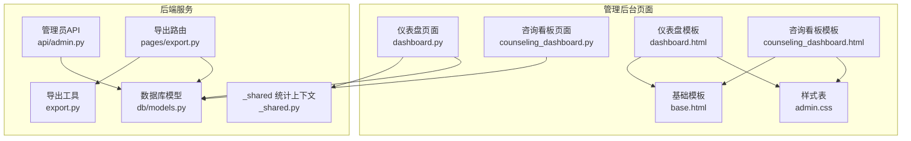
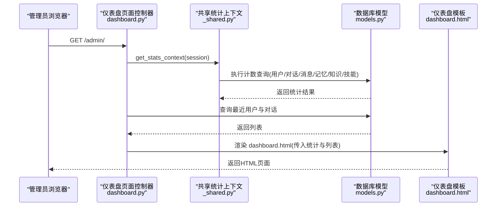
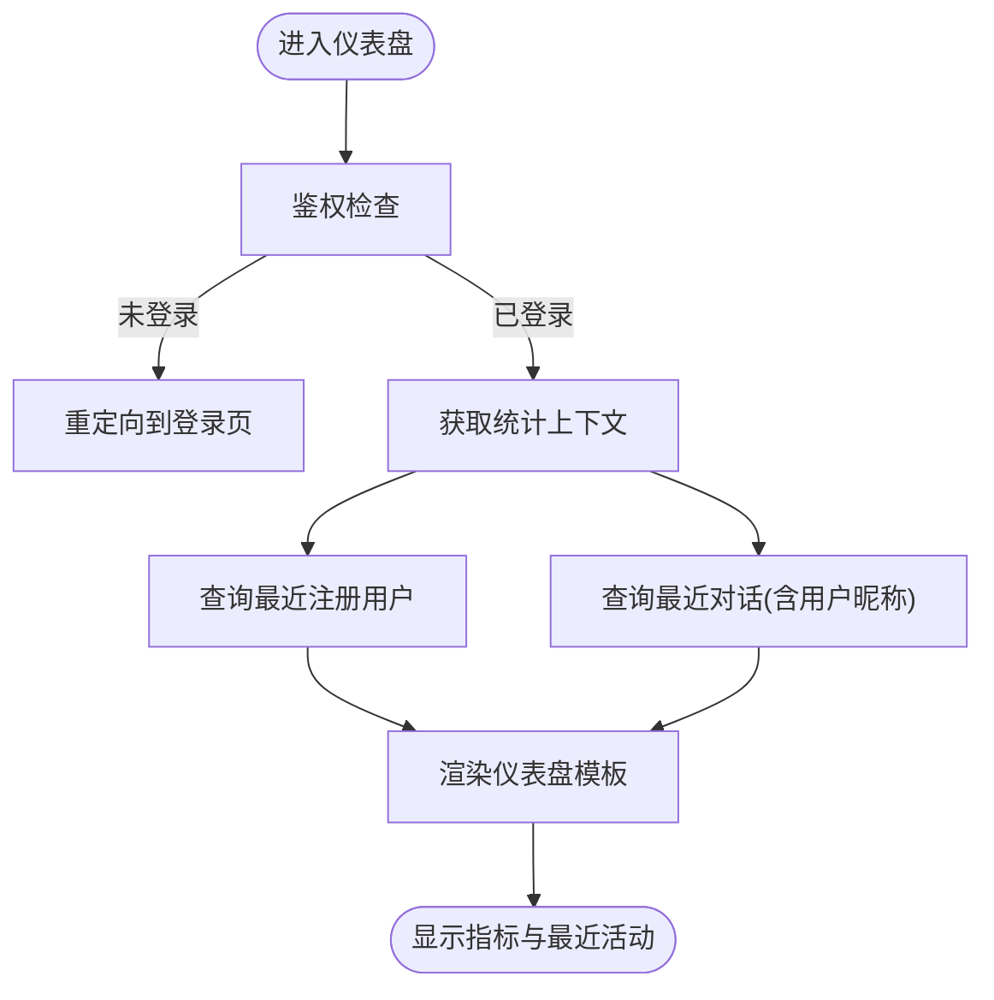
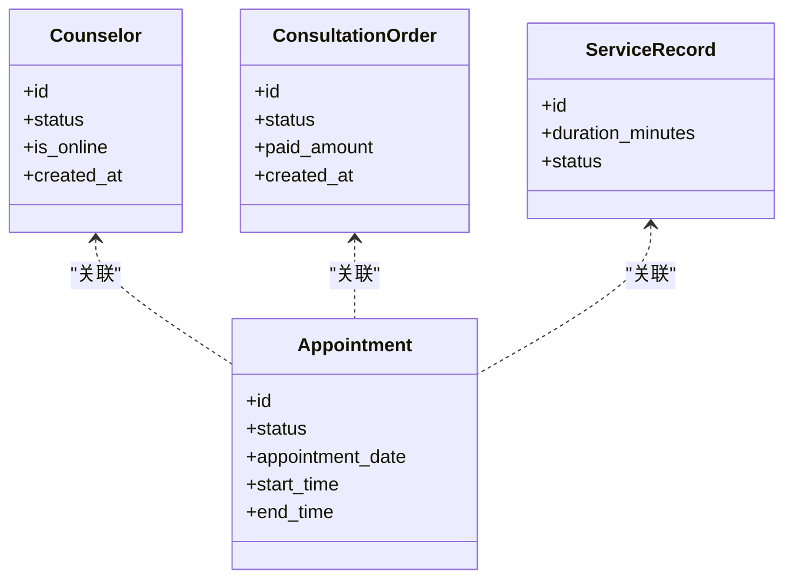
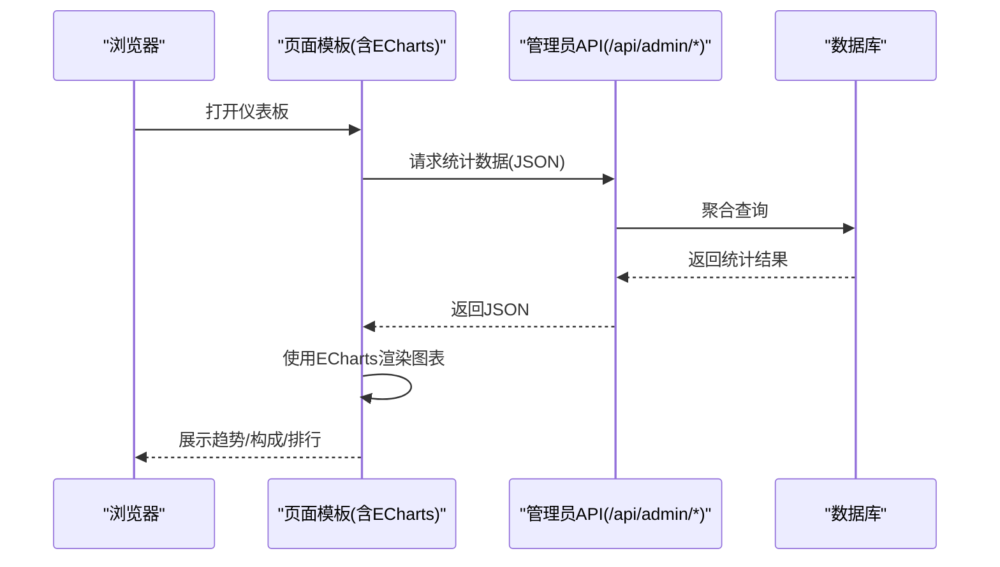
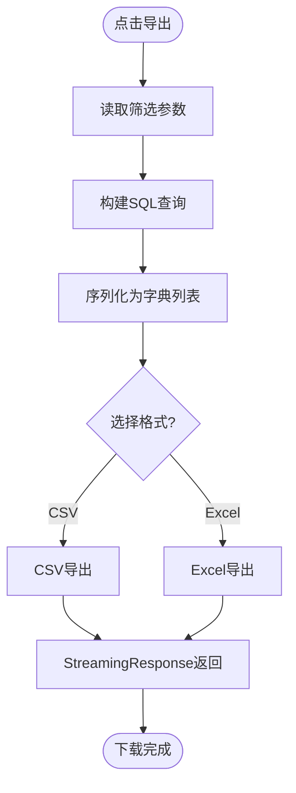
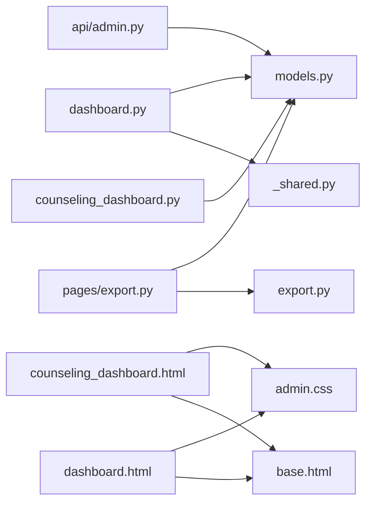

# 数据分析仪表板

<cite>
**本文引用的文件**   
- [hushai/meditation/admin/pages/dashboard.py](file://hushai/meditation/admin/pages/dashboard.py)
- [hushai/meditation/admin/pages/counseling_dashboard.py](file://hushai/meditation/admin/pages/counseling_dashboard.py)
- [hushai/meditation/admin/templates/dashboard.html](file://hushai/meditation/admin/templates/dashboard.html)
- [hushai/meditation/admin/templates/counseling_dashboard.html](file://hushai/meditation/admin/templates/counseling_dashboard.html)
- [hushai/meditation/admin/templates/base.html](file://hushai/meditation/admin/templates/base.html)
- [hushai/meditation/admin/static/css/admin.css](file://hushai/meditation/admin/static/css/admin.css)
- [hushai/meditation/admin/pages/_shared.py](file://hushai/meditation/admin/pages/_shared.py)
- [hushai/meditation/api/admin.py](file://hushai/meditation/api/admin.py)
- [hushai/meditation/db/models.py](file://hushai/meditation/db/models.py)
- [hushai/meditation/admin/export.py](file://hushai/meditation/admin/export.py)
- [hushai/meditation/admin/pages/export.py](file://hushai/meditation/admin/pages/export.py)
</cite>

## 目录
1. [引言](#引言)
2. [项目结构](#项目结构)
3. [核心组件](#核心组件)
4. [架构总览](#架构总览)
5. [详细组件分析](#详细组件分析)
6. [依赖关系分析](#依赖关系分析)
7. [性能与可扩展性](#性能与可扩展性)
8. [故障排查指南](#故障排查指南)
9. [结论](#结论)
10. [附录：可视化与报表实现方案](#附录可视化与报表实现方案)

## 引言
本设计文档面向 hush.ai 管理后台的数据分析功能，聚焦以下目标：
- 主仪表板：关键指标、趋势图表与实时数据展示的设计与落地路径
- 心理咨询专用仪表板：咨询师绩效、用户活跃度与服务质量的布局与分析维度
- 数据可视化实现：ECharts 集成策略、图表类型选择与交互能力
- 自定义报表生成：筛选条件、导出格式与时间范围选择的界面与流程
- 数据钻取、对比分析与预测模型的可视化呈现方式

## 项目结构
管理后台采用 FastAPI + Jinja2 模板渲染的页面型架构，统计数据通过 SQLAlchemy 查询聚合后注入模板；同时提供 REST API 供前端或未来 ECharts 动态加载。

**图示来源**
- [hushai/meditation/admin/pages/dashboard.py:1-52](file://hushai/meditation/admin/pages/dashboard.py#L1-L52)
- [hushai/meditation/admin/pages/counseling_dashboard.py:1-127](file://hushai/meditation/admin/pages/counseling_dashboard.py#L1-L127)
- [hushai/meditation/admin/templates/dashboard.html:1-210](file://hushai/meditation/admin/templates/dashboard.html#L1-L210)
- [hushai/meditation/admin/templates/counseling_dashboard.html:1-113](file://hushai/meditation/admin/templates/counseling_dashboard.html#L1-L113)
- [hushai/meditation/admin/templates/base.html:1-502](file://hushai/meditation/admin/templates/base.html#L1-L502)
- [hushai/meditation/admin/static/css/admin.css:495-1246](file://hushai/meditation/admin/static/css/admin.css#L495-L1246)
- [hushai/meditation/admin/pages/_shared.py:1-110](file://hushai/meditation/admin/pages/_shared.py#L1-L110)
- [hushai/meditation/api/admin.py:1-268](file://hushai/meditation/api/admin.py#L1-L268)
- [hushai/meditation/db/models.py:1-434](file://hushai/meditation/db/models.py#L1-L434)
- [hushai/meditation/admin/export.py:1-106](file://hushai/meditation/admin/export.py#L1-L106)
- [hushai/meditation/admin/pages/export.py:1-207](file://hushai/meditation/admin/pages/export.py#L1-L207)

**章节来源**
- [hushai/meditation/admin/pages/dashboard.py:1-52](file://hushai/meditation/admin/pages/dashboard.py#L1-L52)
- [hushai/meditation/admin/pages/counseling_dashboard.py:1-127](file://hushai/meditation/admin/pages/counseling_dashboard.py#L1-L127)
- [hushai/meditation/admin/templates/dashboard.html:1-210](file://hushai/meditation/admin/templates/dashboard.html#L1-L210)
- [hushai/meditation/admin/templates/counseling_dashboard.html:1-113](file://hushai/meditation/admin/templates/counseling_dashboard.html#L1-L113)
- [hushai/meditation/admin/templates/base.html:1-502](file://hushai/meditation/admin/templates/base.html#L1-L502)
- [hushai/meditation/admin/static/css/admin.css:495-1246](file://hushai/meditation/admin/static/css/admin.css#L495-L1246)
- [hushai/meditation/admin/pages/_shared.py:1-110](file://hushai/meditation/admin/pages/_shared.py#L1-L110)
- [hushai/meditation/api/admin.py:1-268](file://hushai/meditation/api/admin.py#L1-L268)
- [hushai/meditation/db/models.py:1-434](file://hushai/meditation/db/models.py#L1-L434)
- [hushai/meditation/admin/export.py:1-106](file://hushai/meditation/admin/export.py#L1-L106)
- [hushai/meditation/admin/pages/export.py:1-207](file://hushai/meditation/admin/pages/export.py#L1-L207)

## 核心组件
- 仪表盘页面控制器：负责鉴权、聚合统计、最近用户与对话列表，并渲染 dashboard.html
- 咨询看板页面控制器：聚合咨询师、预约、订单与服务记录等指标，渲染 counseling_dashboard.html
- 共享统计上下文：集中计算各资源总数（用户、对话、消息、记忆、知识、技能）
- 模板与样式：Jinja2 模板与统一样式，提供卡片、表格、栅格与响应式布局
- 管理员 API：提供咨询业务全局统计、咨询师列表、订单列表等 JSON 接口
- 数据导出：CSV/Excel 导出工具与导出路由，支持多资源导出

**章节来源**
- [hushai/meditation/admin/pages/dashboard.py:1-52](file://hushai/meditation/admin/pages/dashboard.py#L1-L52)
- [hushai/meditation/admin/pages/counseling_dashboard.py:1-127](file://hushai/meditation/admin/pages/counseling_dashboard.py#L1-L127)
- [hushai/meditation/admin/pages/_shared.py:1-110](file://hushai/meditation/admin/pages/_shared.py#L1-L110)
- [hushai/meditation/admin/templates/dashboard.html:1-210](file://hushai/meditation/admin/templates/dashboard.html#L1-L210)
- [hushai/meditation/admin/templates/counseling_dashboard.html:1-113](file://hushai/meditation/admin/templates/counseling_dashboard.html#L1-L113)
- [hushai/meditation/admin/static/css/admin.css:495-1246](file://hushai/meditation/admin/static/css/admin.css#L495-L1246)
- [hushai/meditation/api/admin.py:1-268](file://hushai/meditation/api/admin.py#L1-L268)
- [hushai/meditation/admin/export.py:1-106](file://hushai/meditation/admin/export.py#L1-L106)
- [hushai/meditation/admin/pages/export.py:1-207](file://hushai/meditation/admin/pages/export.py#L1-L207)

## 架构总览
管理后台采用“页面控制器 + 模板渲染”为主、“REST API + 异步请求”为辅的双通道模式。当前仪表板以服务端渲染为主，后续可平滑过渡到 ECharts 动态加载。

**图示来源**
- [hushai/meditation/admin/pages/dashboard.py:1-52](file://hushai/meditation/admin/pages/dashboard.py#L1-L52)
- [hushai/meditation/admin/pages/_shared.py:1-110](file://hushai/meditation/admin/pages/_shared.py#L1-L110)
- [hushai/meditation/db/models.py:1-434](file://hushai/meditation/db/models.py#L1-L434)
- [hushai/meditation/admin/templates/dashboard.html:1-210](file://hushai/meditation/admin/templates/dashboard.html#L1-L210)

## 详细组件分析

### 主仪表板（Dashboard）
- 关键指标展示
  - 总用户数、活跃用户数、总对话数、总消息数、记忆条目、知识条目、对话技能数量
  - 数据来源：共享统计上下文对 User、Conversation、Message、Memory、KnowledgeChunk、Skill 进行 count 聚合
- 最近活动
  - 最近注册用户（按创建时间倒序，限前5条）
  - 最近对话（含用户昵称，按更新时间倒序，限前5条）
- 交互与导航
  - 快捷操作卡片跳转至用户、对话、记忆、知识库、技能、场景管理等模块
  - 表格内“查看全部”链接进入对应管理页

**图示来源**
- [hushai/meditation/admin/pages/dashboard.py:1-52](file://hushai/meditation/admin/pages/dashboard.py#L1-L52)
- [hushai/meditation/admin/pages/_shared.py:1-110](file://hushai/meditation/admin/pages/_shared.py#L1-L110)
- [hushai/meditation/admin/templates/dashboard.html:1-210](file://hushai/meditation/admin/templates/dashboard.html#L1-L210)

**章节来源**
- [hushai/meditation/admin/pages/dashboard.py:1-52](file://hushai/meditation/admin/pages/dashboard.py#L1-L52)
- [hushai/meditation/admin/pages/_shared.py:1-110](file://hushai/meditation/admin/pages/_shared.py#L1-L110)
- [hushai/meditation/admin/templates/dashboard.html:1-210](file://hushai/meditation/admin/templates/dashboard.html#L1-L210)

### 心理咨询专用仪表板（Counseling Dashboard）
- 指标维度
  - 咨询师：认证数、待审核数、在线数
  - 预约：总数、待处理、已确认、已完成
  - 订单：总数、累计收入、今日新增单量
  - 服务记录：总记录数、累计服务时长（分钟转小时）
- 运营视图
  - 待审核入驻列表（最近5条）
  - 今日预约清单（按开始时间排序，最多10条）
- 数据来源
  - Counselor、Appointment、ConsultationOrder、ServiceRecord 的聚合与过滤

**图示来源**
- [hushai/meditation/db/models.py:273-434](file://hushai/meditation/db/models.py#L273-L434)
- [hushai/meditation/admin/pages/counseling_dashboard.py:1-127](file://hushai/meditation/admin/pages/counseling_dashboard.py#L1-L127)
- [hushai/meditation/admin/templates/counseling_dashboard.html:1-113](file://hushai/meditation/admin/templates/counseling_dashboard.html#L1-L113)

**章节来源**
- [hushai/meditation/admin/pages/counseling_dashboard.py:1-127](file://hushai/meditation/admin/pages/counseling_dashboard.py#L1-L127)
- [hushai/meditation/admin/templates/counseling_dashboard.html:1-113](file://hushai/meditation/admin/templates/counseling_dashboard.html#L1-L113)
- [hushai/meditation/db/models.py:273-434](file://hushai/meditation/db/models.py#L273-L434)

### 数据可视化实现方案（ECharts 集成）
- 集成位置
  - 在 base.html 中引入外部脚本库（如 ECharts），并在具体页面模板中以 script 块初始化图表实例
- 数据源
  - 优先复用现有 REST API（如 /api/admin/counseling/stats）获取结构化 JSON
  - 若需更多维度，可在 api/admin.py 扩展新接口
- 图表类型建议
  - 趋势图：折线图/面积图（日/周/月维度）
  - 构成图：饼图/环形图（预约状态分布、收入构成）
  - 排行图：柱状图（咨询师绩效、热门主题）
  - 实时数据：WebSocket 或轮询刷新（结合 asyncRequest 封装）
- 交互能力
  - 时间范围选择器（近7天/近30天/自定义区间）
  - 联动下钻（点击城市/渠道/咨询师进入明细）
  - 对比分析（双轴或多系列对比）
  - 导出为图片/PDF（ECharts 内置 export）

[此图为概念流程，不直接映射具体源码，故无图示来源]

### 自定义报表生成功能
- 筛选条件
  - 用户ID、分类、关键词搜索、状态、时间范围等
- 导出格式
  - CSV 与 Excel（openpyxl），文件名带时间戳
- 时间范围
  - 基于 created_at/appointment_date 等字段进行日期过滤
- 界面入口
  - 各列表页顶部工具栏提供“导出 CSV/Excel”按钮
  - 导出路由根据参数组装数据并流式返回

**图示来源**
- [hushai/meditation/admin/export.py:1-106](file://hushai/meditation/admin/export.py#L1-L106)
- [hushai/meditation/admin/pages/export.py:1-207](file://hushai/meditation/admin/pages/export.py#L1-L207)

**章节来源**
- [hushai/meditation/admin/export.py:1-106](file://hushai/meditation/admin/export.py#L1-L106)
- [hushai/meditation/admin/pages/export.py:1-207](file://hushai/meditation/admin/pages/export.py#L1-L207)

### 数据钻取、对比分析与预测模型可视化
- 数据钻取
  - 从汇总指标（如总收入）点击下钻至订单明细，再进一步查看预约与服务记录
- 对比分析
  - 多系列折线对比（本周 vs 上周）、分组柱状对比（不同咨询师收入）
- 预测模型
  - 将预测结果作为额外系列叠加于趋势图上，标注置信区间与误差带
- 实现要点
  - 在 api/admin.py 新增预测接口，返回时间序列与预测值
  - 前端 ECharts 使用 series 数组渲染实际与预测两条线

[本节为概念说明，不直接分析具体文件，故无章节来源]

## 依赖关系分析
- 页面控制器依赖
  - dashboard.py 依赖 _shared.get_stats_context 与 models.User/Conversation
  - counseling_dashboard.py 依赖 models.Counselor/Appointment/ConsultationOrder/ServiceRecord
- 模板依赖
  - dashboard.html 与 counseling_dashboard.html 均继承 base.html，并使用 admin.css 样式
- API 依赖
  - api/admin.py 提供 /api/admin/counseling/stats 等接口，供未来 ECharts 动态加载
- 导出依赖
  - pages/export.py 调用 export.py 的通用导出函数，返回 StreamingResponse

**图示来源**
- [hushai/meditation/admin/pages/dashboard.py:1-52](file://hushai/meditation/admin/pages/dashboard.py#L1-L52)
- [hushai/meditation/admin/pages/counseling_dashboard.py:1-127](file://hushai/meditation/admin/pages/counseling_dashboard.py#L1-L127)
- [hushai/meditation/admin/pages/_shared.py:1-110](file://hushai/meditation/admin/pages/_shared.py#L1-L110)
- [hushai/meditation/db/models.py:1-434](file://hushai/meditation/db/models.py#L1-L434)
- [hushai/meditation/admin/templates/dashboard.html:1-210](file://hushai/meditation/admin/templates/dashboard.html#L1-L210)
- [hushai/meditation/admin/templates/counseling_dashboard.html:1-113](file://hushai/meditation/admin/templates/counseling_dashboard.html#L1-L113)
- [hushai/meditation/admin/templates/base.html:1-502](file://hushai/meditation/admin/templates/base.html#L1-L502)
- [hushai/meditation/admin/static/css/admin.css:495-1246](file://hushai/meditation/admin/static/css/admin.css#L495-L1246)
- [hushai/meditation/api/admin.py:1-268](file://hushai/meditation/api/admin.py#L1-L268)
- [hushai/meditation/admin/export.py:1-106](file://hushai/meditation/admin/export.py#L1-L106)
- [hushai/meditation/admin/pages/export.py:1-207](file://hushai/meditation/admin/pages/export.py#L1-L207)

**章节来源**
- [hushai/meditation/admin/pages/dashboard.py:1-52](file://hushai/meditation/admin/pages/dashboard.py#L1-L52)
- [hushai/meditation/admin/pages/counseling_dashboard.py:1-127](file://hushai/meditation/admin/pages/counseling_dashboard.py#L1-L127)
- [hushai/meditation/admin/pages/_shared.py:1-110](file://hushai/meditation/admin/pages/_shared.py#L1-L110)
- [hushai/meditation/db/models.py:1-434](file://hushai/meditation/db/models.py#L1-L434)
- [hushai/meditation/admin/templates/dashboard.html:1-210](file://hushai/meditation/admin/templates/dashboard.html#L1-L210)
- [hushai/meditation/admin/templates/counseling_dashboard.html:1-113](file://hushai/meditation/admin/templates/counseling_dashboard.html#L1-L113)
- [hushai/meditation/admin/templates/base.html:1-502](file://hushai/meditation/admin/templates/base.html#L1-L502)
- [hushai/meditation/admin/static/css/admin.css:495-1246](file://hushai/meditation/admin/static/css/admin.css#L495-L1246)
- [hushai/meditation/api/admin.py:1-268](file://hushai/meditation/api/admin.py#L1-L268)
- [hushai/meditation/admin/export.py:1-106](file://hushai/meditation/admin/export.py#L1-L106)
- [hushai/meditation/admin/pages/export.py:1-207](file://hushai/meditation/admin/pages/export.py#L1-L207)

## 性能与可扩展性
- 查询优化
  - 使用 func.count/sum 在数据库层聚合，减少数据传输
  - 合理索引：models.py 中对常用字段建立索引（如 users.id、conversations.user_id、memories.user_category、appointments.status 等）
- 分页与限制
  - 列表与导出默认限制条数，避免一次性拉取过多数据
- 缓存策略
  - 对热点统计（如总用户数、总收入）可引入 Redis 缓存，设置短 TTL
- 异步与并发
  - 使用 AsyncSession 提升并发处理能力
- 可扩展点
  - 在 api/admin.py 新增统计接口，前端 ECharts 按需拉取
  - 导出模块可按资源类型扩展新的导出路由

[本节为通用指导，不直接分析具体文件，故无章节来源]

## 故障排查指南
- 未登录访问
  - 页面路由会重定向到登录页；API 路由返回 401
- 模板渲染错误
  - 检查模板变量是否完整注入（如 user_count、conv_count 等）
- 导出失败
  - 确认 openpyxl 依赖可用；检查字段序列化逻辑
- 样式异常
  - 确认 admin.css 正确加载；检查响应式断点

**章节来源**
- [hushai/meditation/admin/pages/_shared.py:73-96](file://hushai/meditation/admin/pages/_shared.py#L73-L96)
- [hushai/meditation/admin/export.py:1-106](file://hushai/meditation/admin/export.py#L1-L106)
- [hushai/meditation/admin/static/css/admin.css:1205-1241](file://hushai/meditation/admin/static/css/admin.css#L1205-L1241)

## 结论
当前管理后台的数据分析功能以服务端渲染为主，具备清晰的指标聚合与模板展示能力。通过引入 ECharts 与 REST API，可实现更丰富的趋势图、构成图与交互式下钻。导出模块已支持 CSV/Excel，便于离线分析与审计。建议在后续迭代中完善时间范围筛选、实时刷新与预测模型可视化，以提升决策效率与用户体验。

[本节为总结性内容，不直接分析具体文件，故无章节来源]

## 附录：可视化与报表实现方案

### 主仪表板界面设计
- 指标区
  - 六宫格卡片：用户、对话、消息、记忆、知识、技能
  - 每个卡片包含图标、数值、标签与可选子信息（如活跃用户数）
- 活动区
  - 最近注册用户与最近对话两个表格区块，支持“查看全部”跳转
- 交互
  - 卡片点击跳转至对应管理页
  - 表格行点击查看详情

**章节来源**
- [hushai/meditation/admin/templates/dashboard.html:60-122](file://hushai/meditation/admin/templates/dashboard.html#L60-L122)
- [hushai/meditation/admin/templates/dashboard.html:124-208](file://hushai/meditation/admin/templates/dashboard.html#L124-L208)

### 心理咨询仪表板界面设计
- 指标区
  - 四宫格卡片：认证咨询师、总预约数、累计收入、累计服务时长
  - 子信息包括待审核/在线、待处理/已确认、今日新增单、记录数
- 运营区
  - 待审核入驻列表与今日预约清单
- 交互
  - 列表项点击跳转至详情或操作页

**章节来源**
- [hushai/meditation/admin/templates/counseling_dashboard.html:13-47](file://hushai/meditation/admin/templates/counseling_dashboard.html#L13-L47)
- [hushai/meditation/admin/templates/counseling_dashboard.html:49-111](file://hushai/meditation/admin/templates/counseling_dashboard.html#L49-L111)

### 数据可视化与交互
- 图表类型
  - 趋势：折线/面积
  - 构成：饼/环
  - 排行：柱状
- 交互
  - 时间范围选择、联动下钻、对比分析、导出图片
- 数据源
  - 复用 /api/admin/counseling/stats 或新增接口

[本节为概念说明，不直接分析具体文件，故无章节来源]

### 自定义报表界面设计
- 筛选区
  - 下拉框（用户/分类）、文本框（关键词）、日期范围控件
- 导出区
  - 按钮组：CSV、Excel
- 反馈
  - 加载遮罩与成功/失败提示（基于 base.html 的 asyncRequest 与 toast）

**章节来源**
- [hushai/meditation/admin/templates/conversations.html:14-43](file://hushai/meditation/admin/templates/conversations.html#L14-L43)
- [hushai/meditation/admin/templates/audit_logs.html:14-31](file://hushai/meditation/admin/templates/audit_logs.html#L14-L31)
- [hushai/meditation/admin/templates/base.html:393-436](file://hushai/meditation/admin/templates/base.html#L393-L436)