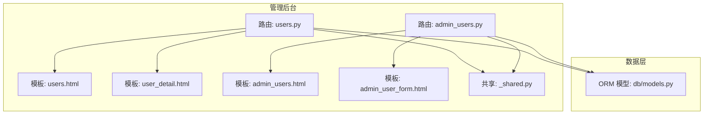
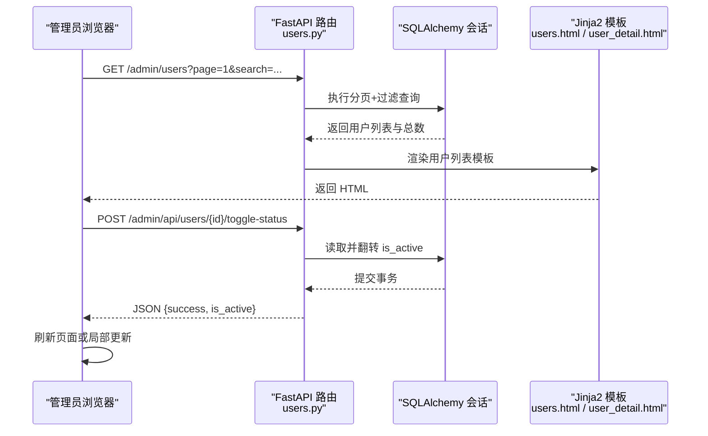
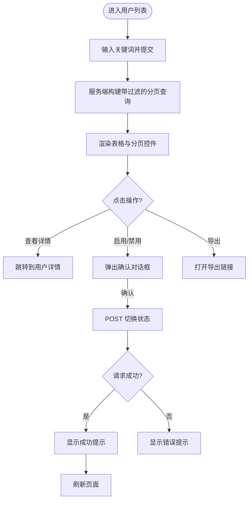
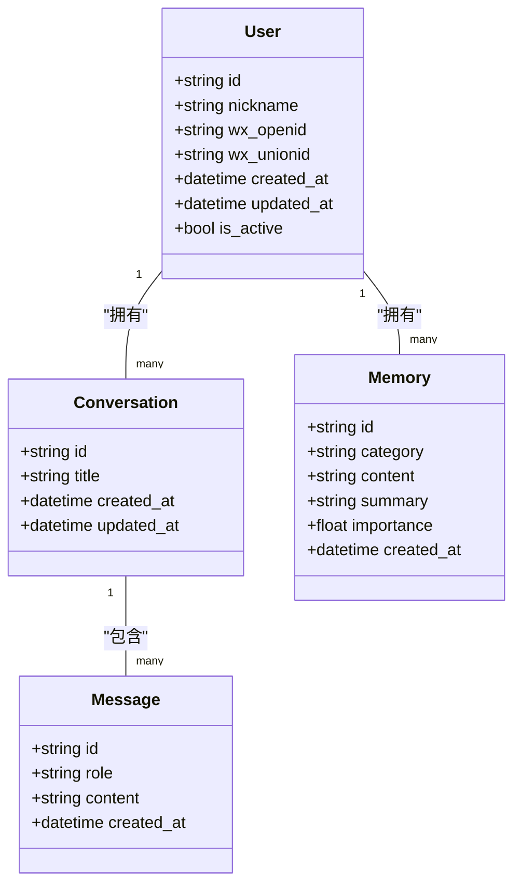
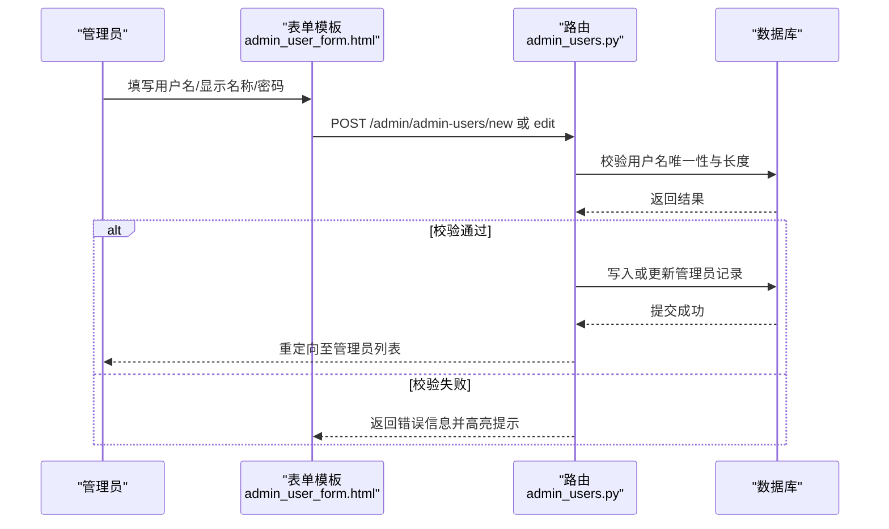
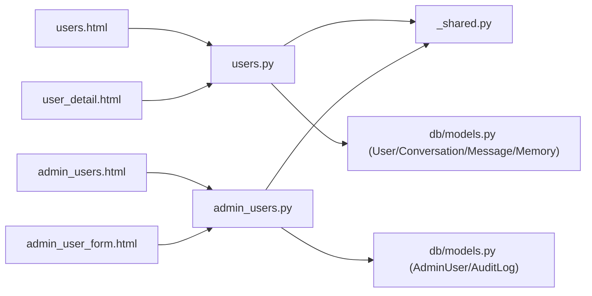

# 用户管理界面

<cite>
**本文引用的文件**   
- [hushai/meditation/admin/pages/users.py](file://hushai/meditation/admin/pages/users.py)
- [hushai/meditation/admin/pages/admin_users.py](file://hushai/meditation/admin/pages/admin_users.py)
- [hushai/meditation/admin/templates/users.html](file://hushai/meditation/admin/templates/users.html)
- [hushai/meditation/admin/templates/user_detail.html](file://hushai/meditation/admin/templates/user_detail.html)
- [hushai/meditation/admin/templates/admin_users.html](file://hushai/meditation/admin/templates/admin_users.html)
- [hushai/meditation/admin/templates/admin_user_form.html](file://hushai/meditation/admin/templates/admin_user_form.html)
- [hushai/meditation/db/models.py](file://hushai/meditation/db/models.py)
- [hushai/meditation/admin/pages/_shared.py](file://hushai/meditation/admin/pages/_shared.py)
</cite>

## 目录
1. [简介](#简介)
2. [项目结构](#项目结构)
3. [核心组件](#核心组件)
4. [架构总览](#架构总览)
5. [详细组件分析](#详细组件分析)
6. [依赖关系分析](#依赖关系分析)
7. [性能与体验优化建议](#性能与体验优化建议)
8. [故障排查指南](#故障排查指南)
9. [结论](#结论)

## 简介
本设计文档面向 hush.ai 管理后台的用户管理功能，聚焦以下目标：
- 用户列表页：信息展示、搜索筛选、分页加载、批量操作（预留接口）
- 用户详情页：基本信息、统计概览、会话历史、记忆内容等模块组织
- 管理员用户管理：角色分配、权限控制、审计日志查看（基于现有模型与页面能力）
- 表单交互规范：数据验证、错误提示、用户体验优化
- 状态管理与操作反馈：启用/禁用切换、删除确认、成功/失败提示

## 项目结构
用户管理相关的前端模板与后端路由位于 admin 子模块中，采用“页面路由 + 模板渲染”的轻量实现方式。关键路径如下：
- 页面路由：users.py、admin_users.py
- 模板：users.html、user_detail.html、admin_users.html、admin_user_form.html
- 数据模型：db/models.py（User、Conversation、Message、Memory、AdminUser、AuditLog 等）
- 共享基础设施：_shared.py（模板引擎、鉴权辅助、统一重定向）

图表来源
- [hushai/meditation/admin/pages/users.py:18-123](file://hushai/meditation/admin/pages/users.py#L18-L123)
- [hushai/meditation/admin/pages/admin_users.py:18-208](file://hushai/meditation/admin/pages/admin_users.py#L18-L208)
- [hushai/meditation/admin/templates/users.html:1-158](file://hushai/meditation/admin/templates/users.html#L1-L158)
- [hushai/meditation/admin/templates/user_detail.html:1-207](file://hushai/meditation/admin/templates/user_detail.html#L1-L207)
- [hushai/meditation/admin/templates/admin_users.html:1-115](file://hushai/meditation/admin/templates/admin_users.html#L1-L115)
- [hushai/meditation/admin/templates/admin_user_form.html:1-121](file://hushai/meditation/admin/templates/admin_user_form.html#L1-L121)
- [hushai/meditation/db/models.py:37-202](file://hushai/meditation/db/models.py#L37-L202)
- [hushai/meditation/admin/pages/_shared.py:23-32](file://hushai/meditation/admin/pages/_shared.py#L23-L32)

章节来源
- [hushai/meditation/admin/pages/users.py:18-123](file://hushai/meditation/admin/pages/users.py#L18-L123)
- [hushai/meditation/admin/pages/admin_users.py:18-208](file://hushai/meditation/admin/pages/admin_users.py#L18-L208)
- [hushai/meditation/admin/templates/users.html:1-158](file://hushai/meditation/admin/templates/users.html#L1-L158)
- [hushai/meditation/admin/templates/user_detail.html:1-207](file://hushai/meditation/admin/templates/user_detail.html#L1-L207)
- [hushai/meditation/admin/templates/admin_users.html:1-115](file://hushai/meditation/admin/templates/admin_users.html#L1-L115)
- [hushai/meditation/admin/templates/admin_user_form.html:1-121](file://hushai/meditation/admin/templates/admin_user_form.html#L1-L121)
- [hushai/meditation/db/models.py:37-202](file://hushai/meditation/db/models.py#L37-L202)
- [hushai/meditation/admin/pages/_shared.py:23-32](file://hushai/meditation/admin/pages/_shared.py#L23-L32)

## 核心组件
- 用户列表页（/admin/users）
  - 支持按昵称或 OpenID 模糊搜索
  - 分页加载（page、limit），默认每页 20 条
  - 单行操作：查看详情、启用/禁用切换
  - 导出入口：CSV/Excel（通过导出路由，当前模板提供链接）
- 用户详情页（/admin/users/{user_id}）
  - 基本信息卡片：头像、昵称、OpenID、UnionID、时间戳、状态
  - 统计信息：对话数、消息数、记忆条目数
  - 最近记忆：最多展示 10 条摘要
  - 最近对话：最多展示 10 条，可跳转详情
  - 快捷操作：启用/禁用、查看对话、查看记忆
- 管理员用户管理（/admin/admin-users）
  - 管理员列表：用户名、显示名称、状态、创建时间
  - 新建/编辑：用户名、显示名称、密码（可选）、是否启用
  - 删除：异步删除，禁止删除当前登录的管理员
- 共享基础设施
  - 模板引擎初始化、统一登录重定向、鉴权辅助函数

章节来源
- [hushai/meditation/admin/pages/users.py:18-123](file://hushai/meditation/admin/pages/users.py#L18-L123)
- [hushai/meditation/admin/templates/users.html:14-138](file://hushai/meditation/admin/templates/users.html#L14-L138)
- [hushai/meditation/admin/templates/user_detail.html:20-187](file://hushai/meditation/admin/templates/user_detail.html#L20-L187)
- [hushai/meditation/admin/pages/admin_users.py:18-208](file://hushai/meditation/admin/pages/admin_users.py#L18-L208)
- [hushai/meditation/admin/templates/admin_users.html:14-114](file://hushai/meditation/admin/templates/admin_users.html#L14-L114)
- [hushai/meditation/admin/templates/admin_user_form.html:15-119](file://hushai/meditation/admin/templates/admin_user_form.html#L15-L119)
- [hushai/meditation/admin/pages/_shared.py:23-32](file://hushai/meditation/admin/pages/_shared.py#L23-L32)

## 架构总览
下图展示了从浏览器到模板渲染与数据库查询的关键调用链，以及用户状态切换的异步流程。

图表来源
- [hushai/meditation/admin/pages/users.py:18-65](file://hushai/meditation/admin/pages/users.py#L18-L65)
- [hushai/meditation/admin/pages/users.py:126-146](file://hushai/meditation/admin/pages/users.py#L126-L146)
- [hushai/meditation/admin/templates/users.html:141-157](file://hushai/meditation/admin/templates/users.html#L141-L157)
- [hushai/meditation/admin/pages/_shared.py:23-32](file://hushai/meditation/admin/pages/_shared.py#L23-L32)

## 详细组件分析

### 用户列表页设计
- 布局与信息展示
  - 工具栏：搜索框（支持昵称/OpenID 模糊匹配）、清除按钮、导出按钮（CSV/Excel）、总数提示
  - 表格列：用户（头像+昵称+短 ID）、OpenID（截断显示）、注册时间、状态（正常/已禁用）、操作（查看详情、启用/禁用）
  - 空状态：无数据时展示友好提示
- 搜索与筛选
  - 服务端模糊匹配，避免前端全量数据
  - 搜索词保留在输入框，便于二次调整
- 分页加载
  - 参数 page、limit；计算 total_pages；导航包含前后翻页与省略号
  - 保持搜索条件跨页传递
- 批量操作
  - 当前未实现全选与批量启用/禁用；可在表头增加复选框，结合后端批量 API 扩展
- 交互与反馈
  - 启用/禁用使用 confirmAction 二次确认，asyncRequest 发起请求，成功后 toastSuccess 提示并自动刷新

图表来源
- [hushai/meditation/admin/pages/users.py:18-65](file://hushai/meditation/admin/pages/users.py#L18-L65)
- [hushai/meditation/admin/templates/users.html:14-138](file://hushai/meditation/admin/templates/users.html#L14-L138)
- [hushai/meditation/admin/templates/users.html:141-157](file://hushai/meditation/admin/templates/users.html#L141-L157)

章节来源
- [hushai/meditation/admin/pages/users.py:18-65](file://hushai/meditation/admin/pages/users.py#L18-L65)
- [hushai/meditation/admin/templates/users.html:14-138](file://hushai/meditation/admin/templates/users.html#L14-L138)
- [hushai/meditation/admin/templates/users.html:141-157](file://hushai/meditation/admin/templates/users.html#L141-L157)

### 用户详情页设计
- 基本信息模块
  - 头像、昵称、状态徽章、用户 ID、OpenID、UnionID、创建/更新时间
- 统计信息模块
  - 对话数、消息数、记忆条目数（由后端聚合统计）
- 记忆内容模块
  - 最近 10 条记忆，展示分类标签、日期、内容摘要与可选总结
- 会话历史模块
  - 最近 10 条对话，展示标题、创建/更新时间，支持跳转详情
- 快捷操作
  - 启用/禁用用户、查看对话、查看记忆

图表来源
- [hushai/meditation/db/models.py:37-118](file://hushai/meditation/db/models.py#L37-L118)
- [hushai/meditation/admin/pages/users.py:68-123](file://hushai/meditation/admin/pages/users.py#L68-L123)
- [hushai/meditation/admin/templates/user_detail.html:20-187](file://hushai/meditation/admin/templates/user_detail.html#L20-L187)

章节来源
- [hushai/meditation/admin/pages/users.py:68-123](file://hushai/meditation/admin/pages/users.py#L68-L123)
- [hushai/meditation/admin/templates/user_detail.html:20-187](file://hushai/meditation/admin/templates/user_detail.html#L20-L187)
- [hushai/meditation/db/models.py:37-118](file://hushai/meditation/db/models.py#L37-L118)

### 管理员用户管理设计
- 管理员列表
  - 字段：用户名、显示名称、状态、创建时间
  - 操作：编辑、删除（异步，不可删除当前登录管理员）
- 新建/编辑表单
  - 字段：用户名（必填，至少 2 字符）、显示名称（可选）、密码（新建必填，编辑可选）、账户启用（编辑时可见）
  - 校验：长度、唯一性、最小密码长度
  - 错误提示：服务端返回 error 并在模板顶部以警告样式展示
- 权限控制与角色
  - 当前模型 AdminUser 仅包含基础字段，未实现细粒度角色与权限；可通过扩展 AdminUser 字段并结合中间件进行访问控制
- 审计日志查看
  - 模型 AuditLog 已定义，可用于记录管理员操作；可在管理后台新增审计日志页面，按 admin_username、action、resource_type 等维度筛选

图表来源
- [hushai/meditation/admin/pages/admin_users.py:54-102](file://hushai/meditation/admin/pages/admin_users.py#L54-L102)
- [hushai/meditation/admin/pages/admin_users.py:127-183](file://hushai/meditation/admin/pages/admin_users.py#L127-L183)
- [hushai/meditation/admin/templates/admin_user_form.html:31-119](file://hushai/meditation/admin/templates/admin_user_form.html#L31-L119)

章节来源
- [hushai/meditation/admin/pages/admin_users.py:18-208](file://hushai/meditation/admin/pages/admin_users.py#L18-L208)
- [hushai/meditation/admin/templates/admin_users.html:14-114](file://hushai/meditation/admin/templates/admin_users.html#L14-L114)
- [hushai/meditation/admin/templates/admin_user_form.html:15-119](file://hushai/meditation/admin/templates/admin_user_form.html#L15-L119)
- [hushai/meditation/db/models.py:172-202](file://hushai/meditation/db/models.py#L172-L202)

### 表单交互规范与用户体验优化
- 数据验证
  - 前端：HTML 属性 minlength、required 提供基础校验
  - 后端：长度、唯一性、最小密码长度校验，错误以 alert-error 样式呈现
- 错误提示
  - 表单顶部集中显示错误信息，字段下方提供简短说明文本
- 用户体验优化
  - 编辑模式下密码留空表示不修改，降低误改风险
  - 启用/禁用开关明确提示影响范围（无法登录管理后台）
  - 删除操作二次确认，防止误删

章节来源
- [hushai/meditation/admin/templates/admin_user_form.html:24-119](file://hushai/meditation/admin/templates/admin_user_form.html#L24-L119)
- [hushai/meditation/admin/pages/admin_users.py:70-102](file://hushai/meditation/admin/pages/admin_users.py#L70-L102)
- [hushai/meditation/admin/pages/admin_users.py:149-183](file://hushai/meditation/admin/pages/admin_users.py#L149-L183)

### 用户状态管理与操作反馈
- 状态切换
  - 列表与详情页均提供启用/禁用按钮，点击后二次确认，异步调用后端接口，成功后 toast 提示并刷新页面
- 删除确认
  - 管理员删除前弹出确认框，异步删除成功后提示并刷新
- 反馈机制
  - 使用统一的 asyncRequest、confirmAction、toastSuccess 等前端工具函数，保证一致的用户体验

章节来源
- [hushai/meditation/admin/templates/users.html:141-157](file://hushai/meditation/admin/templates/users.html#L141-L157)
- [hushai/meditation/admin/templates/user_detail.html:190-206](file://hushai/meditation/admin/templates/user_detail.html#L190-L206)
- [hushai/meditation/admin/templates/admin_users.html:100-114](file://hushai/meditation/admin/templates/admin_users.html#L100-L114)

## 依赖关系分析
- 页面路由依赖
  - users.py 依赖 _shared.py 的模板引擎与鉴权辅助，依赖 db/models.py 的 User、Conversation、Message、Memory
  - admin_users.py 依赖 _shared.py 与 db/models.py 的 AdminUser
- 模板依赖
  - 所有模板继承 base.html，使用统一样式与交互工具函数
- 数据模型关系
  - User 与 Conversation、Message、Memory 存在一对多关系
  - AdminUser 独立于普通用户，用于管理后台登录
  - AuditLog 可用于记录管理员操作，为审计日志功能提供数据支撑

图表来源
- [hushai/meditation/admin/pages/users.py:18-123](file://hushai/meditation/admin/pages/users.py#L18-L123)
- [hushai/meditation/admin/pages/admin_users.py:18-208](file://hushai/meditation/admin/pages/admin_users.py#L18-L208)
- [hushai/meditation/db/models.py:37-202](file://hushai/meditation/db/models.py#L37-L202)
- [hushai/meditation/admin/pages/_shared.py:23-32](file://hushai/meditation/admin/pages/_shared.py#L23-L32)

章节来源
- [hushai/meditation/admin/pages/users.py:18-123](file://hushai/meditation/admin/pages/users.py#L18-L123)
- [hushai/meditation/admin/pages/admin_users.py:18-208](file://hushai/meditation/admin/pages/admin_users.py#L18-L208)
- [hushai/meditation/db/models.py:37-202](file://hushai/meditation/db/models.py#L37-L202)
- [hushai/meditation/admin/pages/_shared.py:23-32](file://hushai/meditation/admin/pages/_shared.py#L23-L32)

## 性能与体验优化建议
- 列表页
  - 对搜索字段建立索引（如 nickname、wx_openid）以提升模糊查询性能
  - 分页 limit 可根据业务需求调整，避免过大导致响应缓慢
- 详情页
  - 记忆与对话列表限制数量（当前为 10 条），如需更多可采用懒加载或分页
  - 统计计数使用 count 查询，避免拉取大量数据
- 表单
  - 前端增加实时校验与防抖，减少无效提交
  - 敏感字段（如密码）在后端加密存储（当前已使用哈希）

[本节为通用建议，无需特定文件引用]

## 故障排查指南
- 未登录访问
  - 页面路由会重定向到登录页；API 路由返回 401
- 用户不存在
  - 详情页与状态切换接口在找不到用户时返回 404
- 管理员删除冲突
  - 删除当前登录管理员将返回 400 错误
- 表单校验失败
  - 返回 400 并携带错误信息，模板顶部以警告样式展示

章节来源
- [hushai/meditation/admin/pages/users.py:75-83](file://hushai/meditation/admin/pages/users.py#L75-L83)
- [hushai/meditation/admin/pages/users.py:133-141](file://hushai/meditation/admin/pages/users.py#L133-L141)
- [hushai/meditation/admin/pages/admin_users.py:192-207](file://hushai/meditation/admin/pages/admin_users.py#L192-L207)
- [hushai/meditation/admin/pages/admin_users.py:70-93](file://hushai/meditation/admin/pages/admin_users.py#L70-L93)

## 结论
本设计文档梳理了 hush.ai 管理后台用户管理的界面与交互方案，覆盖用户列表、用户详情、管理员用户管理等核心场景。现有实现提供了基础的搜索、分页、状态切换与表单校验能力，并通过模型与模板实现了清晰的数据展示与操作流程。后续可扩展批量操作、细粒度角色权限与审计日志页面，进一步提升管理效率与合规性。