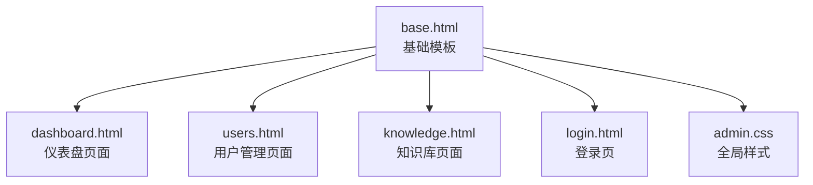
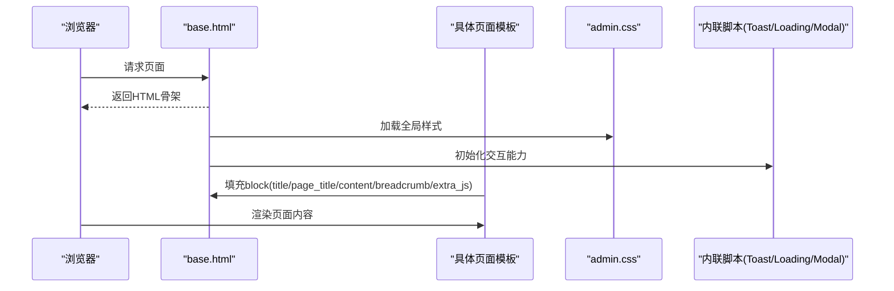
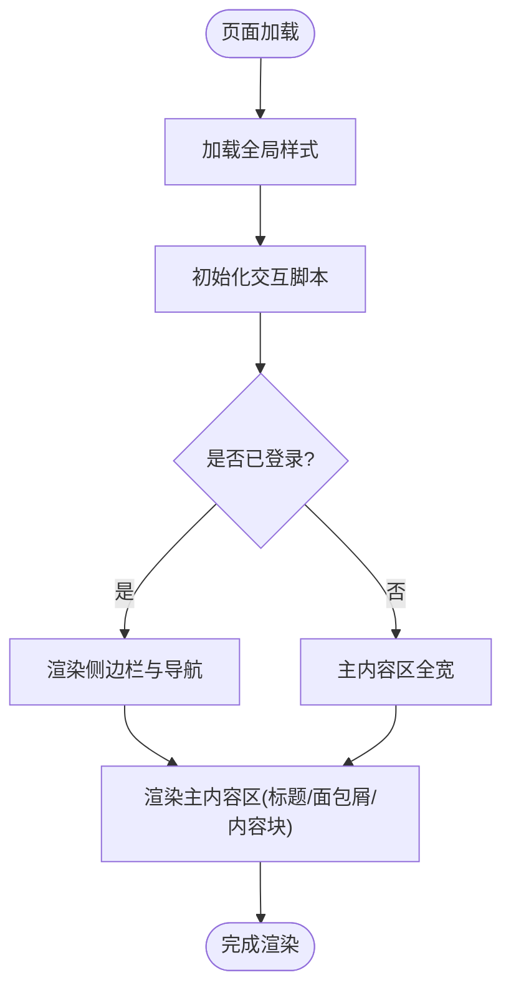
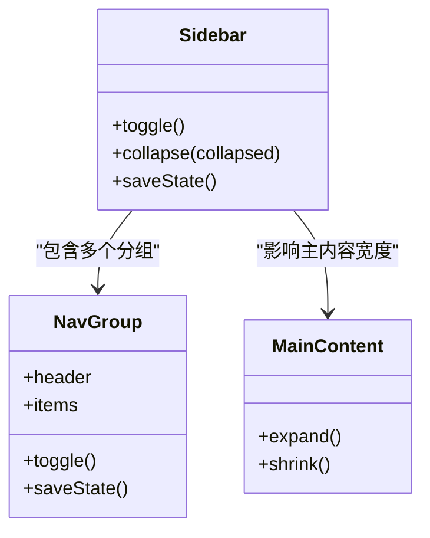
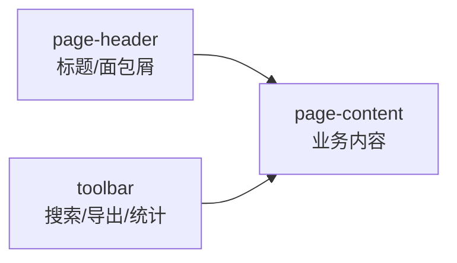
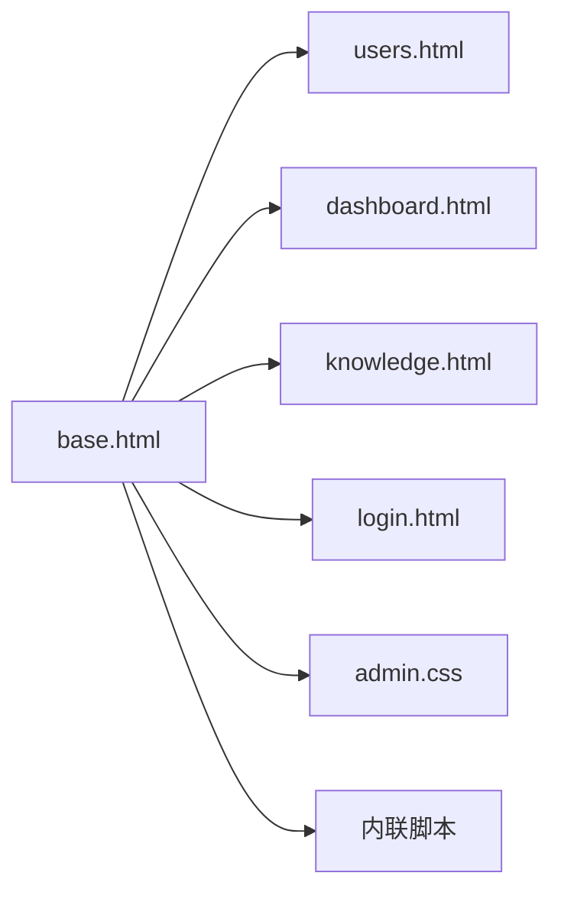

# 界面布局设计

<cite>
**本文引用的文件**   
- [hushai/meditation/admin/templates/base.html](file://hushai/meditation/admin/templates/base.html)
- [hushai/meditation/admin/static/css/admin.css](file://hushai/meditation/admin/static/css/admin.css)
- [hushai/meditation/admin/templates/dashboard.html](file://hushai/meditation/admin/templates/dashboard.html)
- [hushai/meditation/admin/templates/users.html](file://hushai/meditation/admin/templates/users.html)
- [hushai/meditation/admin/templates/knowledge.html](file://hushai/meditation/admin/templates/knowledge.html)
- [hushai/meditation/admin/templates/login.html](file://hushai/meditation/admin/templates/login.html)
</cite>

## 目录
1. [引言](#引言)
2. [项目结构](#项目结构)
3. [核心组件](#核心组件)
4. [架构总览](#架构总览)
5. [详细组件分析](#详细组件分析)
6. [依赖关系分析](#依赖关系分析)
7. [性能与可访问性](#性能与可访问性)
8. [故障排查指南](#故障排查指南)
9. [结论](#结论)
10. [附录：主题与样式扩展指南](#附录主题与样式扩展指南)

## 引言
本设计文档聚焦 hush.ai 管理后台的界面布局，围绕 base.html 模板的整体结构与 CSS 样式系统展开。内容涵盖侧边栏导航、主内容区域、顶部工具栏的组织方式；颜色主题、字体规范、响应式布局与组件样式的设计原则；栅格系统与间距规范；以及自定义主题与样式的扩展方法，帮助开发者在不同屏幕尺寸下获得一致且良好的显示效果。

## 项目结构
管理后台的前端资源位于 meditation/admin 目录下：
- 模板层：templates/*.html（基于 Jinja2 继承 base.html）
- 静态资源：static/css/admin.css（全局样式）
- 交互逻辑：base.html 内嵌 JavaScript（Toast、Loading、Modal、异步请求封装、侧边栏折叠等）

图表来源
- [hushai/meditation/admin/templates/base.html:1-502](file://hushai/meditation/admin/templates/base.html#L1-L502)
- [hushai/meditation/admin/static/css/admin.css:1-1797](file://hushai/meditation/admin/static/css/admin.css#L1-L1797)
- [hushai/meditation/admin/templates/dashboard.html:1-210](file://hushai/meditation/admin/templates/dashboard.html#L1-L210)
- [hushai/meditation/admin/templates/users.html:1-158](file://hushai/meditation/admin/templates/users.html#L1-L158)
- [hushai/meditation/admin/templates/knowledge.html:1-142](file://hushai/meditation/admin/templates/knowledge.html#L1-L142)
- [hushai/meditation/admin/templates/login.html:1-65](file://hushai/meditation/admin/templates/login.html#L1-L65)

章节来源
- [hushai/meditation/admin/templates/base.html:1-502](file://hushai/meditation/admin/templates/base.html#L1-L502)
- [hushai/meditation/admin/static/css/admin.css:1-1797](file://hushai/meditation/admin/static/css/admin.css#L1-L1797)

## 核心组件
- 基础模板 base.html
  - 提供全局 HTML 骨架、头部资源引入、侧边栏导航、主内容区、通用交互脚本（Toast/Loading/Modal/异步请求/侧边栏折叠）。
  - 通过 block 机制供子页面注入标题、面包屑、内容与额外 JS/CSS。
- 全局样式 admin.css
  - 使用 CSS 变量定义品牌色、背景、文本、边框、阴影、圆角、过渡与字体族。
  - 提供布局容器、侧边栏、主内容区、卡片、表格、按钮、表单、分页、空状态、响应式断点等组件样式。
- 页面模板
  - dashboard.html：快捷操作、统计卡片、最近活动列表。
  - users.html：搜索工具栏、数据表格、分页、批量导出。
  - knowledge.html：知识网格卡片、标签、元信息、删除交互。
  - login.html：全屏登录卡片、错误提示、表单。

章节来源
- [hushai/meditation/admin/templates/base.html:1-502](file://hushai/meditation/admin/templates/base.html#L1-L502)
- [hushai/meditation/admin/static/css/admin.css:1-1797](file://hushai/meditation/admin/static/css/admin.css#L1-L1797)
- [hushai/meditation/admin/templates/dashboard.html:1-210](file://hushai/meditation/admin/templates/dashboard.html#L1-L210)
- [hushai/meditation/admin/templates/users.html:1-158](file://hushai/meditation/admin/templates/users.html#L1-L158)
- [hushai/meditation/admin/templates/knowledge.html:1-142](file://hushai/meditation/admin/templates/knowledge.html#L1-L142)
- [hushai/meditation/admin/templates/login.html:1-65](file://hushai/meditation/admin/templates/login.html#L1-L65)

## 架构总览
管理后台采用“基础模板 + 页面模板”的继承模式，配合单一全局样式表与内联脚本，形成低耦合、易扩展的前端架构。

图表来源
- [hushai/meditation/admin/templates/base.html:1-502](file://hushai/meditation/admin/templates/base.html#L1-L502)
- [hushai/meditation/admin/static/css/admin.css:1-1797](file://hushai/meditation/admin/static/css/admin.css#L1-L1797)

## 详细组件分析

### 基础模板 base.html 整体结构
- 头部资源
  - 字符集、视口、描述、图标、标题块、Google Fonts 预连接与字体加载、全局样式与图标库引入、预留 extra_css 块。
- 全局 UI 容器
  - Toast 通知容器、Loading 遮罩、Modal 对话框容器。
- 主体布局
  - 管理员存在时渲染侧边栏（含 Logo、分组导航、折叠按钮、底部用户信息与退出），否则主内容区全宽。
  - 主内容区包含可选的页面标题与面包屑，以及 content 块承载页面内容。
- 内联脚本
  - Toast 系列函数（成功/错误/警告/信息）、Loading 遮罩、Modal 对话框（支持大尺寸、按钮回调、ESC/点击遮罩关闭）、异步请求封装（自动携带 CSRF Token、统一错误处理）、侧边栏折叠与分组菜单状态持久化。

图表来源
- [hushai/meditation/admin/templates/base.html:1-502](file://hushai/meditation/admin/templates/base.html#L1-L502)

章节来源
- [hushai/meditation/admin/templates/base.html:1-502](file://hushai/meditation/admin/templates/base.html#L1-L502)

### 侧边栏导航
- 结构
  - 折叠按钮、Logo 区、导航组（用户运营、内容运营、系统管理、心理咨询）、独立入口（设置、API 调试）、底部用户信息与退出。
- 交互
  - 点击分组头切换展开/收起，状态写入 localStorage；侧边栏可折叠至仅图标宽度，主内容区自适应扩展。
- 视觉
  - 深色背景、高对比度文字、激活项渐变高亮、悬停反馈。

图表来源
- [hushai/meditation/admin/templates/base.html:44-174](file://hushai/meditation/admin/templates/base.html#L44-L174)
- [hushai/meditation/admin/static/css/admin.css:88-174](file://hushai/meditation/admin/static/css/admin.css#L88-L174)
- [hushai/meditation/admin/static/css/admin.css:1309-1434](file://hushai/meditation/admin/static/css/admin.css#L1309-L1434)

章节来源
- [hushai/meditation/admin/templates/base.html:44-174](file://hushai/meditation/admin/templates/base.html#L44-L174)
- [hushai/meditation/admin/static/css/admin.css:88-174](file://hushai/meditation/admin/static/css/admin.css#L88-L174)
- [hushai/meditation/admin/static/css/admin.css:1309-1434](file://hushai/meditation/admin/static/css/admin.css#L1309-L1434)

### 主内容区域与顶部工具栏
- 主内容区
  - 默认带左边距以容纳侧边栏，未登录时移除左边距实现全宽。
  - 包含 page-header（标题与面包屑）与 page-content（业务内容）。
- 工具栏
  - 常见组合：搜索表单、统计信息、导出按钮、新增入口。
  - 在 users.html 与 knowledge.html 中体现一致的布局与交互模式。

图表来源
- [hushai/meditation/admin/templates/base.html:176-188](file://hushai/meditation/admin/templates/base.html#L176-L188)
- [hushai/meditation/admin/templates/users.html:14-42](file://hushai/meditation/admin/templates/users.html#L14-L42)
- [hushai/meditation/admin/templates/knowledge.html:14-45](file://hushai/meditation/admin/templates/knowledge.html#L14-L45)
- [hushai/meditation/admin/static/css/admin.css:192-231](file://hushai/meditation/admin/static/css/admin.css#L192-L231)
- [hushai/meditation/admin/static/css/admin.css:780-800](file://hushai/meditation/admin/static/css/admin.css#L780-L800)

章节来源
- [hushai/meditation/admin/templates/base.html:176-188](file://hushai/meditation/admin/templates/base.html#L176-L188)
- [hushai/meditation/admin/templates/users.html:14-42](file://hushai/meditation/admin/templates/users.html#L14-L42)
- [hushai/meditation/admin/templates/knowledge.html:14-45](file://hushai/meditation/admin/templates/knowledge.html#L14-L45)
- [hushai/meditation/admin/static/css/admin.css:192-231](file://hushai/meditation/admin/static/css/admin.css#L192-L231)
- [hushai/meditation/admin/static/css/admin.css:780-800](file://hushai/meditation/admin/static/css/admin.css#L780-L800)

### 栅格系统与间距规范
- 栅格
  - 使用 CSS Grid 构建自适应网格：
    - 快速操作卡片 grid-template-columns: repeat(auto-fit, minmax(280px, 1fr))
    - 统计卡片 grid-template-columns: repeat(auto-fit, minmax(200px, 1fr))
    - 仪表盘分区 grid-template-columns: repeat(auto-fit, minmax(400px, 1fr))
    - 详情网格 grid-template-columns: repeat(auto-fit, minmax(350px, 1fr))
    - 记忆/知识网格 grid-template-columns: repeat(auto-fill, minmax(350px, 1fr))
    - 表单网格 grid-template-columns: repeat(auto-fit, minmax(200px, 1fr))
- 间距
  - 统一的 padding/margin 使用 rem 单位，保持层级清晰与一致性。
  - 卡片、区块之间通过 margin-bottom 控制纵向节奏。

章节来源
- [hushai/meditation/admin/static/css/admin.css:367-439](file://hushai/meditation/admin/static/css/admin.css#L367-L439)
- [hushai/meditation/admin/static/css/admin.css:434-484](file://hushai/meditation/admin/static/css/admin.css#L434-L484)
- [hushai/meditation/admin/static/css/admin.css:524-555](file://hushai/meditation/admin/static/css/admin.css#L524-L555)
- [hushai/meditation/admin/static/css/admin.css:933-948](file://hushai/meditation/admin/static/css/admin.css#L933-L948)
- [hushai/meditation/admin/static/css/admin.css:1054-1058](file://hushai/meditation/admin/static/css/admin.css#L1054-L1058)
- [hushai/meditation/admin/static/css/admin.css:1123-1127](file://hushai/meditation/admin/static/css/admin.css#L1123-L1127)
- [hushai/meditation/admin/static/css/admin.css:1275-1279](file://hushai/meditation/admin/static/css/admin.css#L1275-L1279)

### 颜色主题与字体规范
- 颜色主题
  - 通过 CSS 变量集中管理主色、强调色、语义色（成功/警告/危险/信息）、背景色、文本色、边框与阴影。
  - 侧边栏使用深色背景，激活项使用渐变色突出。
- 字体规范
  - 展示字体 Fraunces（搭配 Noto Serif SC 回退），UI 字体 Plus Jakarta Sans（搭配 Noto Sans SC 回退）。
  - 标题使用展示字体，正文使用 UI 字体，字号与行高遵循统一比例。

章节来源
- [hushai/meditation/admin/static/css/admin.css:1-35](file://hushai/meditation/admin/static/css/admin.css#L1-L35)
- [hushai/meditation/admin/static/css/admin.css:44-51](file://hushai/meditation/admin/static/css/admin.css#L44-L51)
- [hushai/meditation/admin/static/css/admin.css:108-127](file://hushai/meditation/admin/static/css/admin.css#L108-L127)
- [hushai/meditation/admin/static/css/admin.css:151-159](file://hushai/meditation/admin/static/css/admin.css#L151-L159)

### 响应式布局
- 断点
  - 在 768px 以下进行适配：侧边栏恢复为相对定位并占满宽度，主内容区取消左边距，统计与分区网格改为单列，工具栏垂直堆叠，表格横向滚动。
- 行为
  - 移动端优先保证可读性与可用性，避免复杂的双栏布局。

章节来源
- [hushai/meditation/admin/static/css/admin.css:1204-1241](file://hushai/meditation/admin/static/css/admin.css#L1204-L1241)

### 组件样式体系
- 卡片与区块
  - 统一圆角、阴影、边框与内边距，hover 提升层级感。
- 表格
  - 表头大写小字、行悬停高亮、末列固定宽度。
- 按钮
  - 多语义变体（primary/secondary/success/danger/warning/info），尺寸与图标按钮。
- 表单
  - 输入框焦点态、错误态、网格布局。
- 分页与空状态
  - 居中分页、当前页高亮、空状态图标与提示。

章节来源
- [hushai/meditation/admin/static/css/admin.css:496-522](file://hushai/meditation/admin/static/css/admin.css#L496-L522)
- [hushai/meditation/admin/static/css/admin.css:563-591](file://hushai/meditation/admin/static/css/admin.css#L563-L591)
- [hushai/meditation/admin/static/css/admin.css:699-778](file://hushai/meditation/admin/static/css/admin.css#L699-L778)
- [hushai/meditation/admin/static/css/admin.css:1243-1301](file://hushai/meditation/admin/static/css/admin.css#L1243-L1301)
- [hushai/meditation/admin/static/css/admin.css:870-906](file://hushai/meditation/admin/static/css/admin.css#L870-L906)
- [hushai/meditation/admin/static/css/admin.css:908-924](file://hushai/meditation/admin/static/css/admin.css#L908-L924)

### 页面模板示例
- 仪表盘 dashboard.html
  - 快捷操作卡片、统计卡片、最近注册用户与对话列表。
- 用户管理 users.html
  - 搜索工具栏、用户表格、分页、启用/禁用操作。
- 知识库 knowledge.html
  - 知识网格卡片、标签、元信息、删除操作。
- 登录页 login.html
  - 全屏登录卡片、错误提示、表单。

章节来源
- [hushai/meditation/admin/templates/dashboard.html:1-210](file://hushai/meditation/admin/templates/dashboard.html#L1-L210)
- [hushai/meditation/admin/templates/users.html:1-158](file://hushai/meditation/admin/templates/users.html#L1-L158)
- [hushai/meditation/admin/templates/knowledge.html:1-142](file://hushai/meditation/admin/templates/knowledge.html#L1-L142)
- [hushai/meditation/admin/templates/login.html:1-65](file://hushai/meditation/admin/templates/login.html#L1-L65)

## 依赖关系分析
- 模板依赖
  - 所有页面模板均 extends base.html，复用布局与交互能力。
- 样式依赖
  - 所有页面共用 admin.css，通过类名驱动样式。
- 脚本依赖
  - base.html 内联脚本提供全局 API（toastSuccess/toastError/showLoading/asyncRequest/modal 等），页面模板按需调用。

图表来源
- [hushai/meditation/admin/templates/base.html:1-502](file://hushai/meditation/admin/templates/base.html#L1-L502)
- [hushai/meditation/admin/static/css/admin.css:1-1797](file://hushai/meditation/admin/static/css/admin.css#L1-L1797)

章节来源
- [hushai/meditation/admin/templates/base.html:1-502](file://hushai/meditation/admin/templates/base.html#L1-L502)
- [hushai/meditation/admin/static/css/admin.css:1-1797](file://hushai/meditation/admin/static/css/admin.css#L1-L1797)

## 性能与可访问性
- 性能
  - 使用 CSS 变量减少重复值计算；Grid 自适应布局降低媒体查询复杂度；内联脚本避免额外请求。
  - 图片与图标使用 Font Awesome 矢量图标，减少位图资源。
- 可访问性
  - 提供 skip-link 快速跳转到主内容；键盘 ESC 关闭 Modal；Toast 具备明确语义与关闭按钮。

章节来源
- [hushai/meditation/admin/static/css/admin.css:53-70](file://hushai/meditation/admin/static/css/admin.css#L53-L70)
- [hushai/meditation/admin/templates/base.html:18-21](file://hushai/meditation/admin/templates/base.html#L18-L21)
- [hushai/meditation/admin/templates/base.html:388-391](file://hushai/meditation/admin/templates/base.html#L388-L391)

## 故障排查指南
- Toast 不显示
  - 检查 toastContainer 是否存在；确认 showToast 相关函数未被覆盖。
- Loading 遮罩无法关闭
  - 检查 hideLoading 调用路径；确认无异常中断导致遮罩残留。
- Modal 无法打开或关闭
  - 检查 modalBackdrop 与 modalDialog 元素；确认 active 类切换逻辑。
- 侧边栏折叠无效
  - 检查 localStorage 键名与 collapsed 类切换；确认 toggleIcon 图标类名更新。
- 异步请求失败
  - 检查 CSRF Token 是否正确读取；确认后端返回 success/detail 字段格式。

章节来源
- [hushai/meditation/admin/templates/base.html:190-497](file://hushai/meditation/admin/templates/base.html#L190-L497)

## 结论
该管理后台采用简洁清晰的模板继承与单一全局样式策略，结合 CSS 变量与 Grid 布局，实现了可扩展、可维护且响应友好的界面体系。通过统一的组件样式与交互脚本，页面开发效率显著提升，同时保证了跨设备的一致体验。

## 附录：主题与样式扩展指南
- 修改品牌色彩
  - 在 admin.css 的 :root 中调整 --primary、--accent、--success、--warning、--danger、--info 等变量，即可全局生效。
- 调整布局结构
  - 侧边栏宽度与折叠态由 .sidebar 与 .sidebar.collapsed 控制；主内容区左边距由 .main-content 与 .main-content.expanded 控制。
- 添加新的视觉元素
  - 新建类名并在 admin.css 中定义样式；在模板中使用对应类名挂载到 DOM。
- 扩展栅格与间距
  - 复用 auto-fit/minmax 的 Grid 模式，根据内容密度调整最小宽度；统一使用 rem 控制间距。
- 自定义字体
  - 在 :root 中替换 --font-display 与 --font-ui 的字体栈，并在 head 中确保字体资源可用。
- 增加新页面
  - 创建新模板 extends base.html，填充 title/page_title/breadcrumb/content/extra_js 块，复用现有组件样式。

章节来源
- [hushai/meditation/admin/static/css/admin.css:1-35](file://hushai/meditation/admin/static/css/admin.css#L1-L35)
- [hushai/meditation/admin/static/css/admin.css:88-101](file://hushai/meditation/admin/static/css/admin.css#L88-L101)
- [hushai/meditation/admin/static/css/admin.css:1335-1377](file://hushai/meditation/admin/static/css/admin.css#L1335-L1377)
- [hushai/meditation/admin/static/css/admin.css:367-439](file://hushai/meditation/admin/static/css/admin.css#L367-L439)
- [hushai/meditation/admin/templates/base.html:1-16](file://hushai/meditation/admin/templates/base.html#L1-L16)