# 管理后台界面

<cite>
**本文引用的文件**   
- [hushai/meditation/admin/__init__.py](file://hushai/meditation/admin/__init__.py)
- [hushai/meditation/admin/pages/__init__.py](file://hushai/meditation/admin/pages/__init__.py)
- [hushai/meditation/admin/pages/_shared.py](file://hushai/meditation/admin/pages/_shared.py)
- [hushai/meditation/admin/auth.py](file://hushai/meditation/admin/auth.py)
- [hushai/meditation/db/models.py](file://hushai/meditation/db/models.py)
- [hushai/meditation/admin/templates/base.html](file://hushai/meditation/admin/templates/base.html)
- [hushai/meditation/admin/static/css/admin.css](file://hushai/meditation/admin/static/css/admin.css)
- [hushai/meditation/admin/pages/dashboard.py](file://hushai/meditation/admin/pages/dashboard.py)
- [hushai/meditation/admin/pages/users.py](file://hushai/meditation/admin/pages/users.py)
- [hushai/meditation/admin/pages/knowledge.py](file://hushai/meditation/admin/pages/knowledge.py)
- [hushai/meditation/admin/pages/skills.py](file://hushai/meditation/admin/pages/skills.py)
- [hushai/meditation/admin/pages/scenes.py](file://hushai/meditation/admin/pages/scenes.py)
- [hushai/meditation/admin/pages/settings.py](file://hushai/meditation/admin/pages/settings.py)
- [hushai/meditation/admin/pages/auth.py](file://hushai/meditation/admin/pages/auth.py)
- [hushai/meditation/admin/pages/export.py](file://hushai/meditation/admin/pages/export.py)
- [hushai/meditation/admin/pages/audit.py](file://hushai/meditation/admin/pages/audit.py)
- [hushai/meditation/admin/pages/conversations.py](file://hushai/meditation/admin/pages/conversations.py)
- [hushai/meditation/admin/pages/memories.py](file://hushai/meditation/admin/pages/memories.py)
- [hushai/meditation/admin/pages/admin_users.py](file://hushai/meditation/admin/pages/admin_users.py)
- [hushai/meditation/admin/templates/users.html](file://hushai/meditation/admin/templates/users.html)
- [hushai/meditation/admin/templates/knowledge.html](file://hushai/meditation/admin/templates/knowledge.html)
- [hushai/meditation/admin/templates/skills.html](file://hushai/meditation/admin/templates/skills.html)
- [hushai/meditation/admin/templates/scenes.html](file://hushai/meditation/admin/templates/scenes.html)
- [hushai/meditation/admin/templates/settings.html](file://hushai/meditation/admin/templates/settings.html)
</cite>

## 更新摘要
**变更内容**   
- 重构为模块化页面架构：从单文件 router.py 迁移到 pages 子包结构
- 新增路由聚合机制：通过 build_router() 函数统一聚合所有页面路由
- 扩展功能模块：新增对话管理、记忆管理、审计日志、数据导出、管理员用户管理等页面
- 优化鉴权与模板基础设施：将通用逻辑抽离到 _shared.py 供各页面复用

## 目录
1. [简介](#简介)
2. [项目结构](#项目结构)
3. [核心组件](#核心组件)
4. [架构总览](#架构总览)
5. [详细组件分析](#详细组件分析)
6. [依赖关系分析](#依赖关系分析)
7. [性能与可用性考虑](#性能与可用性考虑)
8. [故障排查指南](#故障排查指南)
9. [结论](#结论)
10. [附录：页面与路由清单](#附录页面与路由清单)

## 简介
本设计文档面向 hush.ai 的管理后台，聚焦于整体布局、用户管理、内容管理（知识库、技能、场景）、数据分析仪表板、系统设置、日志审计与导出等界面的设计规范与实现说明。文档以现有代码为依据，提供从模板到后端路由的端到端映射，帮助读者快速理解并扩展管理后台功能。

**更新** 管理后台已从单文件路由重构为模块化页面架构，每个资源独立成模块，通过统一的构建器聚合为 APIRouter，提升了代码可维护性和扩展性。

## 项目结构
管理后台采用 FastAPI + Jinja2 模板渲染方案，按资源拆分至 pages 子包，统一通过 build_router 聚合为 APIRouter，并由模块入口暴露 router 供主应用挂载。前端样式与交互由 base.html 与 admin.css 提供统一的侧边栏、顶部工具栏、弹窗、Toast、加载遮罩等基础能力。

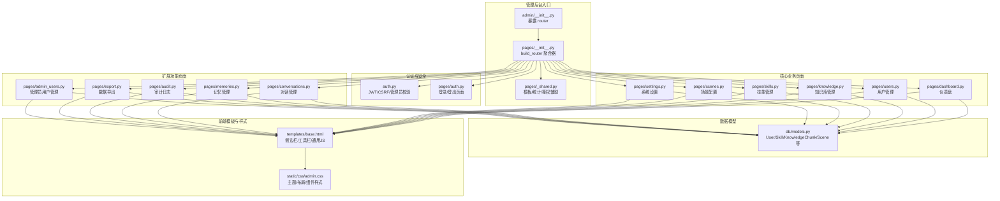

**图表来源**
- [hushai/meditation/admin/__init__.py:1-15](file://hushai/meditation/admin/__init__.py#L1-L15)
- [hushai/meditation/admin/pages/__init__.py:1-56](file://hushai/meditation/admin/pages/__init__.py#L1-L56)
- [hushai/meditation/admin/pages/_shared.py:1-110](file://hushai/meditation/admin/pages/_shared.py#L1-L110)
- [hushai/meditation/admin/auth.py:1-183](file://hushai/meditation/admin/auth.py#L1-L183)
- [hushai/meditation/admin/pages/auth.py:1-65](file://hushai/meditation/admin/pages/auth.py#L1-L65)
- [hushai/meditation/db/models.py:1-434](file://hushai/meditation/db/models.py#L1-L434)
- [hushai/meditation/admin/templates/base.html:1-502](file://hushai/meditation/admin/templates/base.html#L1-L502)
- [hushai/meditation/admin/static/css/admin.css:1-800](file://hushai/meditation/admin/static/css/admin.css#L1-L800)

**章节来源**
- [hushai/meditation/admin/__init__.py:1-15](file://hushai/meditation/admin/__init__.py#L1-L15)
- [hushai/meditation/admin/pages/__init__.py:1-56](file://hushai/meditation/admin/pages/__init__.py#L1-L56)
- [hushai/meditation/admin/pages/_shared.py:1-110](file://hushai/meditation/admin/pages/_shared.py#L1-L110)
- [hushai/meditation/admin/auth.py:1-183](file://hushai/meditation/admin/auth.py#L1-L183)
- [hushai/meditation/db/models.py:1-434](file://hushai/meditation/db/models.py#L1-L434)
- [hushai/meditation/admin/templates/base.html:1-502](file://hushai/meditation/admin/templates/base.html#L1-L502)
- [hushai/meditation/admin/static/css/admin.css:1-800](file://hushai/meditation/admin/static/css/admin.css#L1-L800)

## 核心组件
- **统一模板与基础设施**
  - 模板引擎与全局过滤器：Jinja2Templates 初始化、tojson 过滤器注册。
  - 统计上下文：get_stats_context 汇总用户、对话、消息、记忆、知识、技能数量。
  - 鉴权辅助：require_admin_page / require_admin_api 与 login_redirect 统一未登录处理。
- **认证与安全**
  - JWT 令牌签发与校验、Cookie/Authorization 双通道读取。
  - CSRF 令牌生成、写入 Cookie、请求头校验与装饰器。
- **数据模型**
  - User、Conversation、Message、Memory、Skill、KnowledgeChunk、Scene、AdminUser、AuditLog 等 ORM 定义。
- **前端基座**
  - base.html 提供侧边栏导航、分组折叠、状态保持、Toast、Modal、Loading、异步请求封装 asyncRequest 等。
  - admin.css 定义主题变量、布局、卡片、表格、按钮、徽章等 UI 规范。

**章节来源**
- [hushai/meditation/admin/pages/_shared.py:1-110](file://hushai/meditation/admin/pages/_shared.py#L1-L110)
- [hushai/meditation/admin/auth.py:1-183](file://hushai/meditation/admin/auth.py#L1-L183)
- [hushai/meditation/db/models.py:1-434](file://hushai/meditation/db/models.py#L1-L434)
- [hushai/meditation/admin/templates/base.html:1-502](file://hushai/meditation/admin/templates/base.html#L1-L502)
- [hushai/meditation/admin/static/css/admin.css:1-800](file://hushai/meditation/admin/static/css/admin.css#L1-L800)

## 架构总览
管理后台遵循"路由页 → 模板渲染"的服务器端渲染模式，配合少量异步 API 完成局部更新（如删除、批量操作）。所有页面均受管理员鉴权保护；表单提交携带 CSRF Token 进行防护。

**更新** 新的模块化架构通过 build_router() 函数统一管理所有页面路由，支持动态扩展新页面模块。

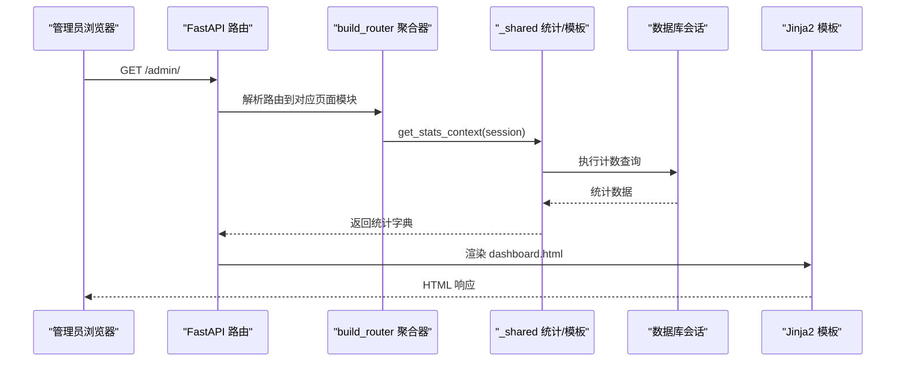

**图表来源**
- [hushai/meditation/admin/pages/__init__.py:30-52](file://hushai/meditation/admin/pages/__init__.py#L30-L52)
- [hushai/meditation/admin/pages/dashboard.py:18-52](file://hushai/meditation/admin/pages/dashboard.py#L18-L52)
- [hushai/meditation/admin/pages/_shared.py:44-70](file://hushai/meditation/admin/pages/_shared.py#L44-L70)

## 详细组件分析

### 整体布局与导航
- **侧边栏导航**
  - 分组结构：用户运营、内容运营、系统管理、心理咨询等，支持点击折叠与本地存储持久化。
  - 当前页高亮：根据 request.url.path 动态添加 active 类。
  - 底部信息：显示当前管理员用户名与退出登录链接。
- **顶部工具栏**
  - 各列表页在 toolbar 中提供搜索框、导出按钮、新增/导入按钮等常用操作。
- **通用交互**
  - Toast 通知：成功/错误/警告/信息四类提示。
  - Modal 对话框：确认删除、二次确认等。
  - Loading 遮罩：异步请求期间展示。
  - 异步请求封装：自动注入 CSRF Token，统一 success/error 回调。

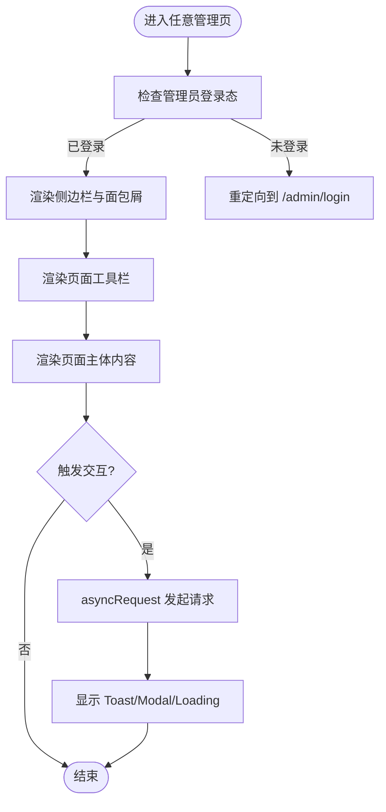

**图表来源**
- [hushai/meditation/admin/templates/base.html:44-173](file://hushai/meditation/admin/templates/base.html#L44-L173)
- [hushai/meditation/admin/templates/base.html:190-497](file://hushai/meditation/admin/templates/base.html#L190-L497)

**章节来源**
- [hushai/meditation/admin/templates/base.html:1-502](file://hushai/meditation/admin/templates/base.html#L1-L502)
- [hushai/meditation/admin/static/css/admin.css:1-800](file://hushai/meditation/admin/static/css/admin.css#L1-L800)

### 仪表盘（数据分析）
- **指标卡片**
  - 用户总数、活跃用户、对话数、消息数、记忆数、知识条目数、技能数。
- **最近活动**
  - 最近注册用户、最近对话（含昵称）。
- **数据来源**
  - 通过 get_stats_context 聚合多表计数；最近记录使用 SQLAlchemy 查询并按创建时间倒序取前 N 条。

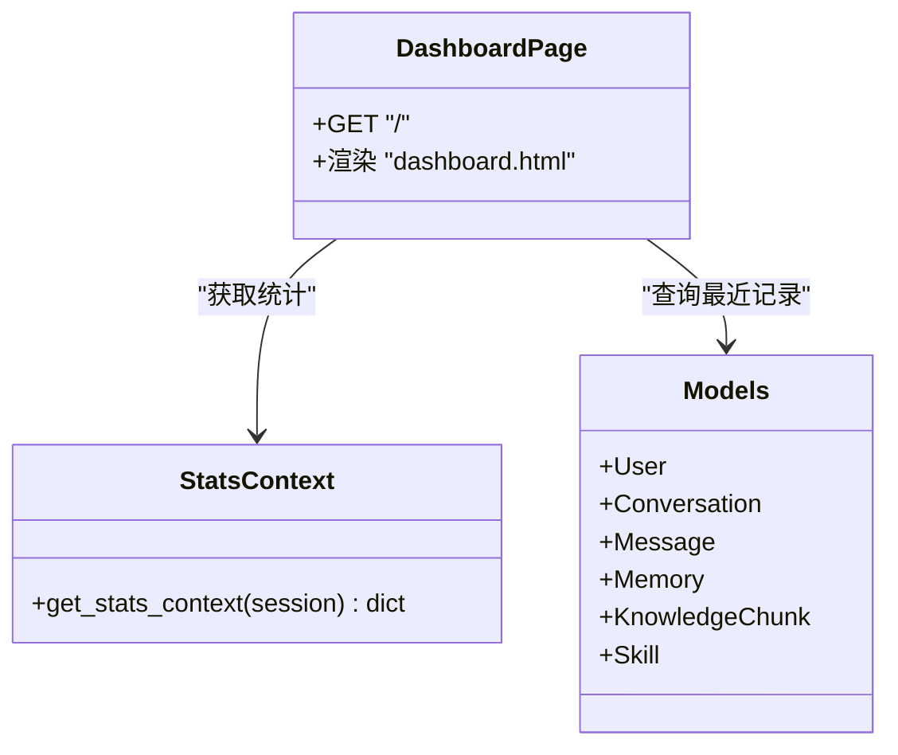

**图表来源**
- [hushai/meditation/admin/pages/dashboard.py:1-52](file://hushai/meditation/admin/pages/dashboard.py#L1-L52)
- [hushai/meditation/admin/pages/_shared.py:44-70](file://hushai/meditation/admin/pages/_shared.py#L44-L70)
- [hushai/meditation/db/models.py:37-170](file://hushai/meditation/db/models.py#L37-L170)

**章节来源**
- [hushai/meditation/admin/pages/dashboard.py:1-52](file://hushai/meditation/admin/pages/dashboard.py#L1-L52)
- [hushai/meditation/admin/pages/_shared.py:44-70](file://hushai/meditation/admin/pages/_shared.py#L44-L70)

### 用户管理
- **列表展示**
  - 字段：头像/昵称、OpenID、注册时间、状态（启用/禁用）、操作（详情、启用/禁用）。
  - 分页：支持 page/limit 参数与搜索条件拼接。
- **搜索筛选**
  - 支持按昵称或 OpenID 模糊匹配。
- **批量操作**
  - 当前页面提供单条启用/禁用；导出支持 CSV/Excel。
- **详情查看**
  - 用户详情包含对话数、消息数、记忆片段、对话列表。
- **关键接口**
  - GET /admin/users：列表
  - GET /admin/users/{user_id}：详情
  - POST /admin/api/users/{user_id}/toggle-status：切换状态

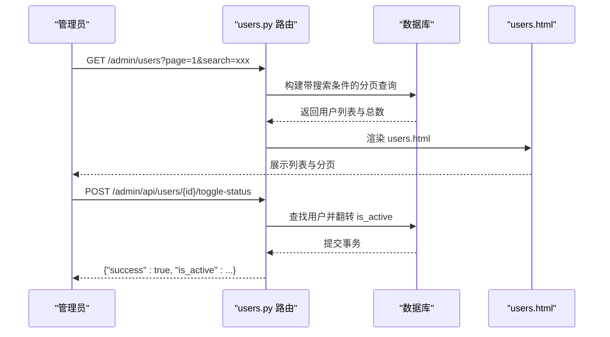

**图表来源**
- [hushai/meditation/admin/pages/users.py:18-65](file://hushai/meditation/admin/pages/users.py#L18-L65)
- [hushai/meditation/admin/pages/users.py:68-123](file://hushai/meditation/admin/pages/users.py#L68-L123)
- [hushai/meditation/admin/pages/users.py:126-146](file://hushai/meditation/admin/pages/users.py#L126-L146)
- [hushai/meditation/admin/templates/users.html:1-158](file://hushai/meditation/admin/templates/users.html#L1-L158)

**章节来源**
- [hushai/meditation/admin/pages/users.py:1-146](file://hushai/meditation/admin/pages/users.py#L1-L146)
- [hushai/meditation/admin/templates/users.html:1-158](file://hushai/meditation/admin/templates/users.html#L1-L158)

### 知识库管理
- **列表展示**
  - 网格卡片：标题、摘要、标签、创建时间、来源。
  - 支持搜索标题/内容、分页、导出。
- **导入**
  - 提供"导入知识"入口（页面存在），具体导入逻辑可结合远程知识源配置。
- **删除与批量删除**
  - 单条删除：DELETE /admin/api/knowledge/{item_id}
  - 批量删除：POST /admin/api/knowledge/batch-delete（Body 包含 ids 数组）

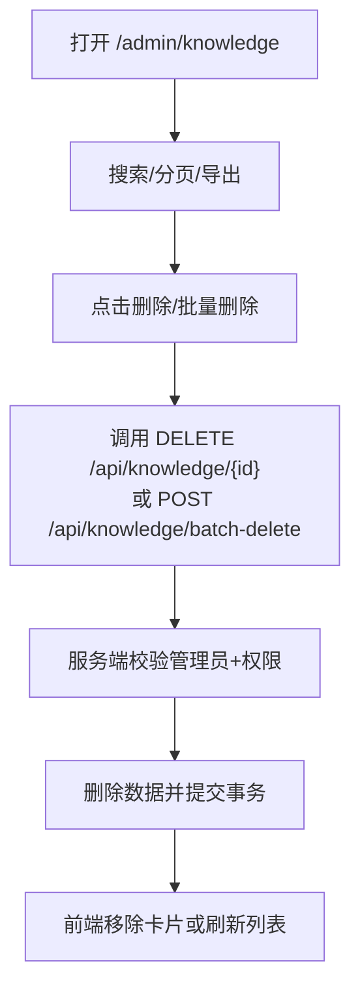

**图表来源**
- [hushai/meditation/admin/pages/knowledge.py:22-71](file://hushai/meditation/admin/pages/knowledge.py#L22-L71)
- [hushai/meditation/admin/pages/knowledge.py:119-163](file://hushai/meditation/admin/pages/knowledge.py#L119-L163)
- [hushai/meditation/admin/templates/knowledge.html:1-142](file://hushai/meditation/admin/templates/knowledge.html#L1-L142)

**章节来源**
- [hushai/meditation/admin/pages/knowledge.py:1-163](file://hushai/meditation/admin/pages/knowledge.py#L1-L163)
- [hushai/meditation/admin/templates/knowledge.html:1-142](file://hushai/meditation/admin/templates/knowledge.html#L1-L142)

### 技能插件管理
- **列表与编辑**
  - 列表：名称、描述、内容摘要、排序、启用状态、创建时间。
  - 新建/编辑：表单包含 name、description、content、sort_order、is_active。
- **批量导入**
  - 提供"批量导入"入口（页面存在）。
- **删除**
  - 单条删除：DELETE /admin/api/skills/{skill_id}

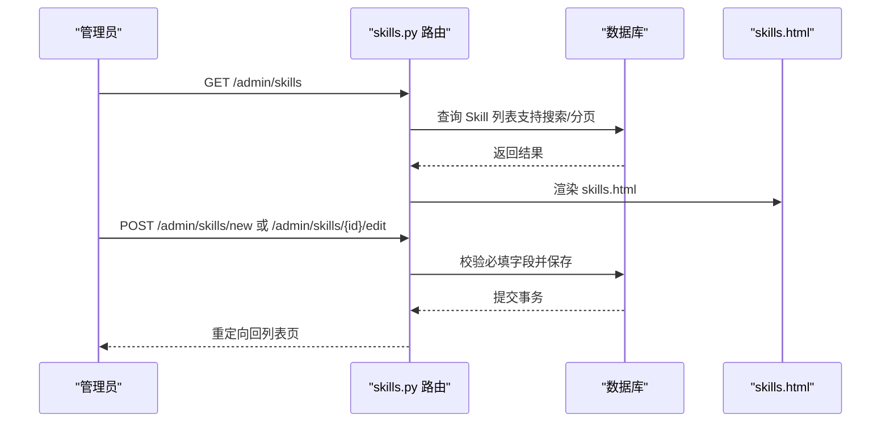

**图表来源**
- [hushai/meditation/admin/pages/skills.py:33-76](file://hushai/meditation/admin/pages/skills.py#L33-L76)
- [hushai/meditation/admin/pages/skills.py:92-129](file://hushai/meditation/admin/pages/skills.py#L92-L129)
- [hushai/meditation/admin/pages/skills.py:155-195](file://hushai/meditation/admin/pages/skills.py#L155-L195)
- [hushai/meditation/admin/pages/skills.py:198-218](file://hushai/meditation/admin/pages/skills.py#L198-L218)
- [hushai/meditation/admin/templates/skills.html:1-136](file://hushai/meditation/admin/templates/skills.html#L1-L136)

**章节来源**
- [hushai/meditation/admin/pages/skills.py:1-218](file://hushai/meditation/admin/pages/skills.py#L1-L218)
- [hushai/meditation/admin/templates/skills.html:1-136](file://hushai/meditation/admin/templates/skills.html#L1-L136)

### 场景配置
- **列表与编辑**
  - 列表：名称、描述、slug、排序、启用状态、创建时间。
  - 新建/编辑：表单包含 name、slug、description、system_prompt、opening_message、sort_order、is_active。
  - slug 唯一性校验（新增时全库检查，编辑时排除自身）。
- **删除**
  - 单条删除：DELETE /admin/api/scenes/{scene_id}

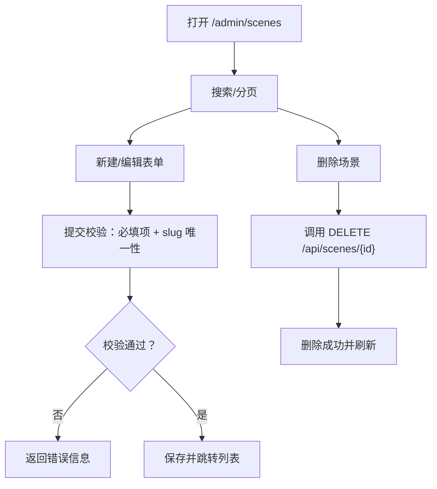

**图表来源**
- [hushai/meditation/admin/pages/scenes.py:17-60](file://hushai/meditation/admin/pages/scenes.py#L17-L60)
- [hushai/meditation/admin/pages/scenes.py:76-132](file://hushai/meditation/admin/pages/scenes.py#L76-L132)
- [hushai/meditation/admin/pages/scenes.py:158-217](file://hushai/meditation/admin/pages/scenes.py#L158-L217)
- [hushai/meditation/admin/pages/scenes.py:220-240](file://hushai/meditation/admin/pages/scenes.py#L220-L240)
- [hushai/meditation/admin/templates/scenes.html:1-134](file://hushai/meditation/admin/templates/scenes.html#L1-L134)

**章节来源**
- [hushai/meditation/admin/pages/scenes.py:1-240](file://hushai/meditation/admin/pages/scenes.py#L1-L240)
- [hushai/meditation/admin/templates/scenes.html:1-134](file://hushai/meditation/admin/templates/scenes.html#L1-L134)

### 系统设置
- **运行参数**
  - 默认 LLM 提供商与模型、记忆检索 Top-K、知识库检索 Top-K、最大对话轮数。
- **提供商密钥与地址**
  - OpenAI、DeepSeek、智谱 AI、Kimi 的 Key/Base URL/Model 配置。
- **远程知识源**
  - Coze 知识库（Token/dataset_id）、IMA 文档 URL、通用 URL 列表。
- **服务状态**
  - 服务地址、调试模式只读展示。
- **保存与生效**
  - 表单提交后替换配置对象并持久化，成功后重定向并显示成功提示。

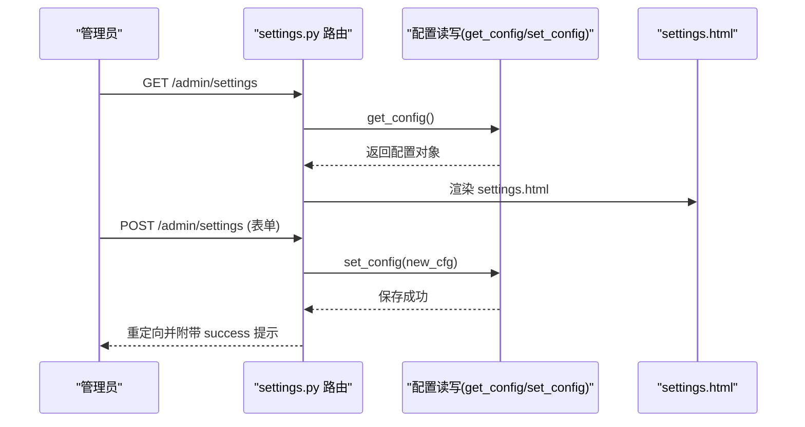

**图表来源**
- [hushai/meditation/admin/pages/settings.py:15-37](file://hushai/meditation/admin/pages/settings.py#L15-L37)
- [hushai/meditation/admin/pages/settings.py:40-123](file://hushai/meditation/admin/pages/settings.py#L40-L123)
- [hushai/meditation/admin/templates/settings.html:1-385](file://hushai/meditation/admin/templates/settings.html#L1-L385)

**章节来源**
- [hushai/meditation/admin/pages/settings.py:1-123](file://hushai/meditation/admin/pages/settings.py#L1-L123)
- [hushai/meditation/admin/templates/settings.html:1-385](file://hushai/meditation/admin/templates/settings.html#L1-L385)

### 对话管理
- **列表展示**
  - 字段：对话标题、用户昵称、创建时间、更新时间、状态。
  - 支持按用户筛选、分页浏览。
- **详情查看**
  - 对话详情包含完整消息历史、用户信息。
- **批量操作**
  - 支持批量软删除（标记 is_active=False）。

**章节来源**
- [hushai/meditation/admin/pages/conversations.py:1-139](file://hushai/meditation/admin/pages/conversations.py#L1-L139)

### 记忆管理
- **列表展示**
  - 字段：用户昵称、分类、内容摘要、重要度、状态、创建时间。
  - 支持按用户和分类筛选。
- **批量操作**
  - 支持批量删除记忆记录。

**章节来源**
- [hushai/meditation/admin/pages/memories.py:1-130](file://hushai/meditation/admin/pages/memories.py#L1-L130)

### 审计日志
- **日志查看**
  - 字段：时间、管理员、操作类型、资源类型、资源ID、详情、IP地址。
  - 支持按操作类型和管理员筛选。
- **数据导出**
  - 支持导出审计日志为 CSV/Excel 格式。

**章节来源**
- [hushai/meditation/admin/pages/audit.py:1-72](file://hushai/meditation/admin/pages/audit.py#L1-L72)

### 数据导出
- **导出功能**
  - 支持导出对话记录、用户列表、记忆数据、知识库内容、审计日志。
  - 支持 CSV 和 Excel 两种格式。
  - 支持按条件筛选后导出。

**章节来源**
- [hushai/meditation/admin/pages/export.py:1-207](file://hushai/meditation/admin/pages/export.py#L1-L207)

### 管理员用户管理
- **用户管理**
  - 管理员用户列表展示、新增、编辑、删除。
  - 密码强度验证、用户名唯一性检查。
  - 防止删除当前登录的管理员账户。

**章节来源**
- [hushai/meditation/admin/pages/admin_users.py:1-208](file://hushai/meditation/admin/pages/admin_users.py#L1-L208)

### 安全与鉴权
- **管理员登录态**
  - 优先从 Cookie 读取 admin_token，其次从 Authorization: Bearer 读取。
  - 未登录时页面路由重定向到登录页，API 路由返回 401。
- **CSRF 保护**
  - 登录流程设置 admin_csrf_token Cookie（httponly=False 以便 JS 读取）。
  - 前端在异步请求头中携带 X-CSRF-Token，服务端校验一致。
- **密码与令牌**
  - 管理员密码使用 bcrypt 哈希；JWT 令牌包含 is_admin 标志与过期时间。

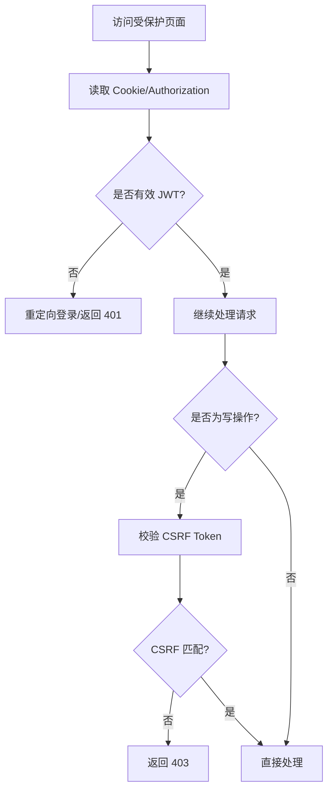

**图表来源**
- [hushai/meditation/admin/auth.py:87-102](file://hushai/meditation/admin/auth.py#L87-L102)
- [hushai/meditation/admin/auth.py:136-183](file://hushai/meditation/admin/auth.py#L136-L183)
- [hushai/meditation/admin/pages/_shared.py:73-96](file://hushai/meditation/admin/pages/_shared.py#L73-96)
- [hushai/meditation/admin/templates/base.html:394-436](file://hushai/meditation/admin/templates/base.html#L394-L436)

**章节来源**
- [hushai/meditation/admin/auth.py:1-183](file://hushai/meditation/admin/auth.py#L1-L183)
- [hushai/meditation/admin/pages/_shared.py:73-96](file://hushai/meditation/admin/pages/_shared.py#L73-96)
- [hushai/meditation/admin/templates/base.html:394-436](file://hushai/meditation/admin/templates/base.html#L394-L436)

## 依赖关系分析
- **页面路由依赖**
  - 所有页面路由依赖 _shared 提供的模板、统计、鉴权辅助与数据库会话。
  - 认证模块 auth 提供管理员身份解析与 CSRF 校验。
  - build_router 函数统一管理所有页面模块的导入和路由聚合。
- **数据模型依赖**
  - 用户、对话、消息、记忆、知识、技能、场景等模型被多个页面路由引用。
- **前端依赖**
  - base.html 提供通用交互能力，admin.css 提供视觉规范。

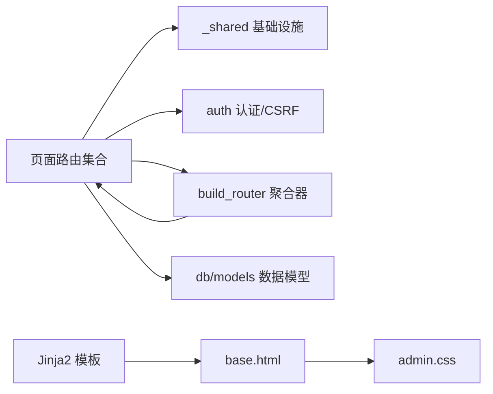

**图表来源**
- [hushai/meditation/admin/pages/__init__.py:30-52](file://hushai/meditation/admin/pages/__init__.py#L30-L52)
- [hushai/meditation/admin/pages/_shared.py:1-110](file://hushai/meditation/admin/pages/_shared.py#L1-L110)
- [hushai/meditation/admin/auth.py:1-183](file://hushai/meditation/admin/auth.py#L1-L183)
- [hushai/meditation/db/models.py:1-434](file://hushai/meditation/db/models.py#L1-L434)
- [hushai/meditation/admin/templates/base.html:1-502](file://hushai/meditation/admin/templates/base.html#L1-L502)
- [hushai/meditation/admin/static/css/admin.css:1-800](file://hushai/meditation/admin/static/css/admin.css#L1-L800)

**章节来源**
- [hushai/meditation/admin/pages/__init__.py:30-52](file://hushai/meditation/admin/pages/__init__.py#L30-L52)
- [hushai/meditation/admin/pages/_shared.py:1-110](file://hushai/meditation/admin/pages/_shared.py#L1-L110)
- [hushai/meditation/admin/auth.py:1-183](file://hushai/meditation/admin/auth.py#L1-L183)
- [hushai/meditation/db/models.py:1-434](file://hushai/meditation/db/models.py#L1-L434)
- [hushai/meditation/admin/templates/base.html:1-502](file://hushai/meditation/admin/templates/base.html#L1-L502)
- [hushai/meditation/admin/static/css/admin.css:1-800](file://hushai/meditation/admin/static/css/admin.css#L1-L800)

## 性能与可用性考虑
- **列表分页与索引**
  - 列表页普遍采用 page/limit 分页，建议对高频过滤字段建立索引（如 nickname、wx_openid、title、content 等）。
- **统计查询优化**
  - 仪表盘统计使用 count 聚合，避免拉取大量数据；必要时可对大表增加物化视图或缓存层。
- **前端交互体验**
  - 使用 asyncRequest 统一加载与错误处理，减少重复代码；合理设置超时与重试策略。
- **安全性**
  - 严格校验 CSRF Token；敏感配置（Key/Token）在前端仅做展示与输入，不输出到日志。
- **模块化架构优势**
  - 新页面模块开发更加便捷，只需在 pages 目录下创建新模块并在 build_router 中注册即可。

## 故障排查指南
- **未登录或登录态失效**
  - 现象：页面重定向到登录页或 API 返回 401。
  - 排查：检查 Cookie admin_token 是否存在且未过期；Authorization 头是否正确携带。
- **CSRF 验证失败**
  - 现象：POST/PUT/DELETE 返回 403。
  - 排查：确认 admin_csrf_token Cookie 存在且 X-CSRF-Token 请求头一致；注意跨域与 SameSite 策略。
- **表单校验失败**
  - 现象：新建/编辑返回 400 并显示错误信息。
  - 排查：检查必填字段（如名称、内容、slug）是否非空；slug 唯一性冲突。
- **数据不存在**
  - 现象：详情页返回 404。
  - 排查：确认 ID 正确且记录未被删除。
- **路由聚合问题**
  - 现象：新页面无法访问或路由冲突。
  - 排查：检查 pages/__init__.py 中的 build_router 函数是否正确导入新模块；确认路由路径无冲突。

**章节来源**
- [hushai/meditation/admin/auth.py:104-113](file://hushai/meditation/admin/auth.py#L104-L113)
- [hushai/meditation/admin/auth.py:164-183](file://hushai/meditation/admin/auth.py#L164-L183)
- [hushai/meditation/admin/pages/users.py:126-146](file://hushai/meditation/admin/pages/users.py#L126-L146)
- [hushai/meditation/admin/pages/knowledge.py:119-163](file://hushai/meditation/admin/pages/knowledge.py#L119-L163)
- [hushai/meditation/admin/pages/skills.py:198-218](file://hushai/meditation/admin/pages/skills.py#L198-L218)
- [hushai/meditation/admin/pages/scenes.py:220-240](file://hushai/meditation/admin/pages/scenes.py#L220-L240)
- [hushai/meditation/admin/pages/__init__.py:30-52](file://hushai/meditation/admin/pages/__init__.py#L30-L52)

## 结论
管理后台以清晰的模块化组织与统一的模板/样式体系为基础，提供了用户管理、内容管理、系统设置等核心能力。通过标准化的鉴权与 CSRF 保护、完善的分页与搜索、以及一致的交互反馈，保证了良好的可用性与可维护性。新的模块化架构使得功能扩展更加便捷，后续可在仪表盘中引入更多可视化图表与趋势分析，并在导出与审计方面进一步增强。

## 附录：页面与路由清单
- **仪表盘**
  - GET /admin/
- **认证相关**
  - GET /admin/login
  - POST /admin/login
  - GET /admin/logout
- **用户管理**
  - GET /admin/users
  - GET /admin/users/{user_id}
  - POST /admin/api/users/{user_id}/toggle-status
- **对话管理**
  - GET /admin/conversations
  - GET /admin/conversations/{conversation_id}
  - POST /admin/api/conversations/batch-delete
- **记忆管理**
  - GET /admin/memories
  - DELETE /admin/api/memories/{memory_id}
  - POST /admin/api/memories/batch-delete
- **知识库**
  - GET /admin/knowledge
  - GET /admin/knowledge/{item_id}
  - GET /admin/knowledge-import
  - DELETE /admin/api/knowledge/{item_id}
  - POST /admin/api/knowledge/batch-delete
- **技能管理**
  - GET /admin/skills
  - GET /admin/skills/new
  - POST /admin/skills/new
  - GET /admin/skills/{skill_id}/edit
  - POST /admin/skills/{skill_id}/edit
  - DELETE /admin/api/skills/{skill_id}
  - GET /admin/skills-import
- **场景管理**
  - GET /admin/scenes
  - GET /admin/scenes/new
  - POST /admin/scenes/new
  - GET /admin/scenes/{scene_id}/edit
  - POST /admin/scenes/{scene_id}/edit
  - DELETE /admin/api/scenes/{scene_id}
- **系统设置**
  - GET /admin/settings
  - POST /admin/settings
- **审计日志**
  - GET /admin/audit-logs
- **数据导出**
  - GET /admin/export/conversations
  - GET /admin/export/audit-logs
  - GET /admin/export/users
  - GET /admin/export/memories
  - GET /admin/export/knowledge
- **管理员用户管理**
  - GET /admin/admin-users
  - GET /admin/admin-users/new
  - POST /admin/admin-users/new
  - GET /admin/admin-users/{admin_id}/edit
  - POST /admin/admin-users/{admin_id}/edit
  - DELETE /admin/api/admin-users/{admin_id}

**章节来源**
- [hushai/meditation/admin/pages/dashboard.py:18-52](file://hushai/meditation/admin/pages/dashboard.py#L18-L52)
- [hushai/meditation/admin/pages/auth.py:20-65](file://hushai/meditation/admin/pages/auth.py#L20-65)
- [hushai/meditation/admin/pages/users.py:18-146](file://hushai/meditation/admin/pages/users.py#L18-L146)
- [hushai/meditation/admin/pages/conversations.py:22-139](file://hushai/meditation/admin/pages/conversations.py#L22-139)
- [hushai/meditation/admin/pages/memories.py:22-130](file://hushai/meditation/admin/pages/memories.py#L22-130)
- [hushai/meditation/admin/pages/knowledge.py:22-163](file://hushai/meditation/admin/pages/knowledge.py#L22-L163)
- [hushai/meditation/admin/pages/skills.py:17-218](file://hushai/meditation/admin/pages/skills.py#L17-L218)
- [hushai/meditation/admin/pages/scenes.py:17-240](file://hushai/meditation/admin/pages/scenes.py#L17-L240)
- [hushai/meditation/admin/pages/settings.py:15-123](file://hushai/meditation/admin/pages/settings.py#L15-L123)
- [hushai/meditation/admin/pages/audit.py:16-72](file://hushai/meditation/admin/pages/audit.py#L16-L72)
- [hushai/meditation/admin/pages/export.py:17-207](file://hushai/meditation/admin/pages/export.py#L17-L207)
- [hushai/meditation/admin/pages/admin_users.py:18-208](file://hushai/meditation/admin/pages/admin_users.py#L18-L208)