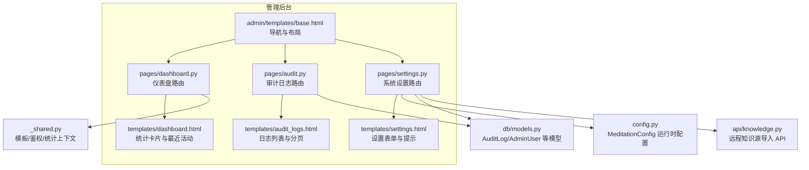
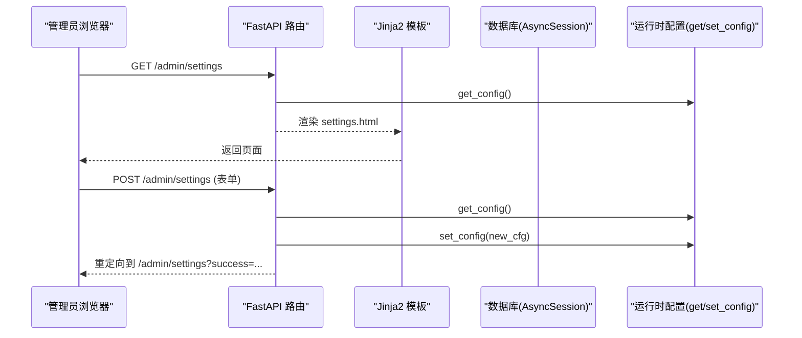
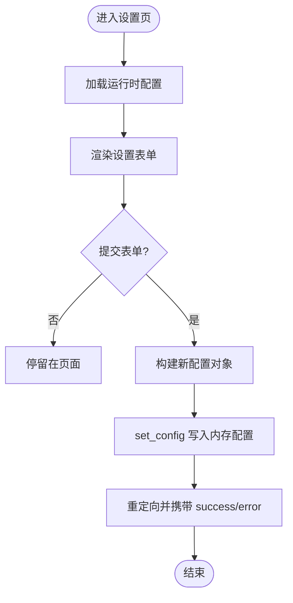
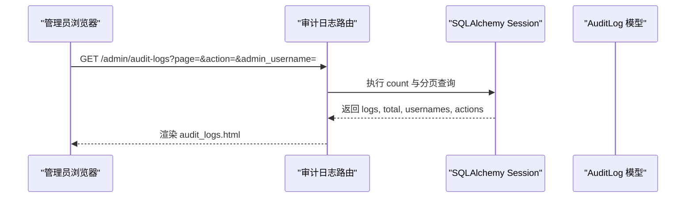
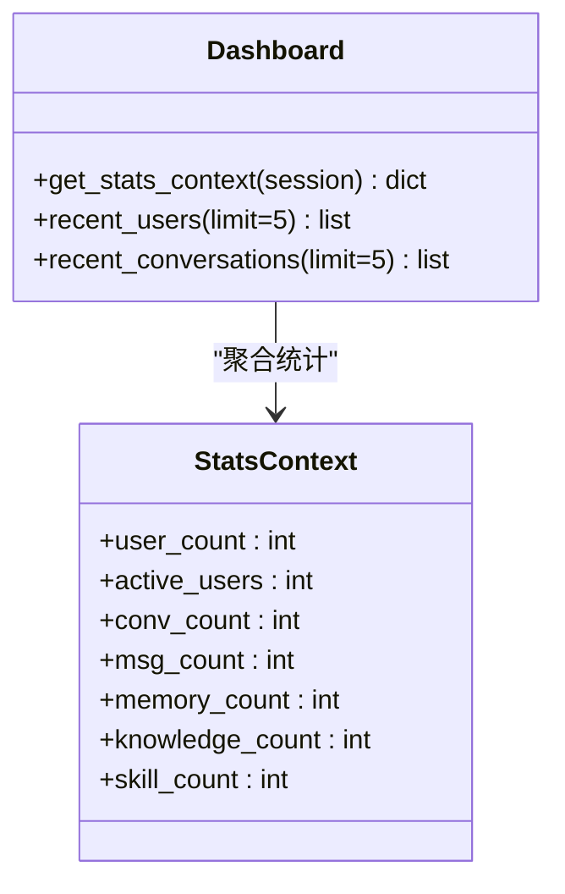
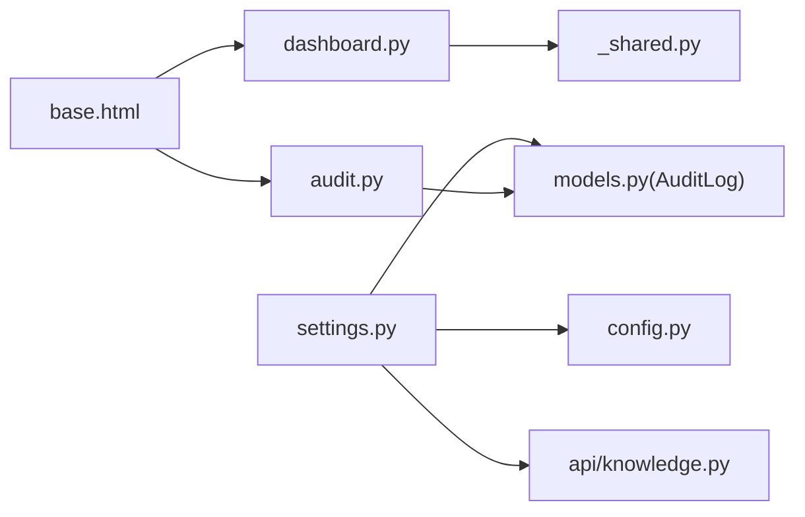

# 系统管理界面

<cite>
**本文引用的文件**   
- [hushai/meditation/admin/pages/settings.py](file://hushai/meditation/admin/pages/settings.py)
- [hushai/meditation/admin/templates/settings.html](file://hushai/meditation/admin/templates/settings.html)
- [hushai/meditation/config.py](file://hushai/meditation/config.py)
- [hushai/meditation/admin/pages/audit.py](file://hushai/meditation/admin/pages/audit.py)
- [hushai/meditation/admin/templates/audit_logs.html](file://hushai/meditation/admin/templates/audit_logs.html)
- [hushai/meditation/db/models.py](file://hushai/meditation/db/models.py)
- [hushai/meditation/admin/pages/_shared.py](file://hushai/meditation/admin/pages/_shared.py)
- [hushai/meditation/admin/pages/dashboard.py](file://hushai/meditation/admin/pages/dashboard.py)
- [hushai/meditation/admin/templates/dashboard.html](file://hushai/meditation/admin/templates/dashboard.html)
- [hushai/meditation/admin/templates/base.html](file://hushai/meditation/admin/templates/base.html)
- [hushai/meditation/api/knowledge.py](file://hushai/meditation/api/knowledge.py)
</cite>

## 目录
1. [引言](#引言)
2. [项目结构](#项目结构)
3. [核心组件](#核心组件)
4. [架构总览](#架构总览)
5. [详细组件分析](#详细组件分析)
6. [依赖关系分析](#依赖关系分析)
7. [性能与可用性考虑](#性能与可用性考虑)
8. [故障排查指南](#故障排查指南)
9. [结论](#结论)
10. [附录](#附录)

## 引言
本文件面向 hush.ai 管理后台的系统管理功能，聚焦以下界面的设计与实现说明：
- 系统设置界面：应用配置、数据库连接（展示）、第三方服务集成与安全策略（运行参数）等。
- 审计日志管理界面：操作记录查询、过滤、导出能力与合规支持。
- 系统监控面板布局：仪表盘的数据指标与最近活动展示。
- 备份恢复功能：当前仓库未提供独立 UI，给出概念性设计方案与落地建议。
- 系统更新、插件管理与故障诊断工具：结合现有“技能管理”“远程知识源”“健康检查链接”进行说明与扩展建议。

## 项目结构
管理后台采用 FastAPI + Jinja2 模板渲染的页面型路由组织方式，核心模块位于 meditation/admin 下，按页面功能拆分 pages 与 templates。

图示来源
- [hushai/meditation/admin/pages/settings.py:1-123](file://hushai/meditation/admin/pages/settings.py#L1-L123)
- [hushai/meditation/admin/templates/settings.html:1-385](file://hushai/meditation/admin/templates/settings.html#L1-L385)
- [hushai/meditation/admin/pages/audit.py:1-72](file://hushai/meditation/admin/pages/audit.py#L1-L72)
- [hushai/meditation/admin/templates/audit_logs.html:1-131](file://hushai/meditation/admin/templates/audit_logs.html#L1-L131)
- [hushai/meditation/admin/pages/dashboard.py:1-52](file://hushai/meditation/admin/pages/dashboard.py#L1-L52)
- [hushai/meditation/admin/templates/dashboard.html:1-210](file://hushai/meditation/admin/templates/dashboard.html#L1-L210)
- [hushai/meditation/admin/templates/base.html:99-127](file://hushai/meditation/admin/templates/base.html#L99-L127)
- [hushai/meditation/config.py:1-136](file://hushai/meditation/config.py#L1-L136)
- [hushai/meditation/db/models.py:172-202](file://hushai/meditation/db/models.py#L172-L202)
- [hushai/meditation/admin/pages/_shared.py:44-70](file://hushai/meditation/admin/pages/_shared.py#L44-L70)
- [hushai/meditation/api/knowledge.py:249-279](file://hushai/meditation/api/knowledge.py#L249-L279)

章节来源
- [hushai/meditation/admin/pages/settings.py:1-123](file://hushai/meditation/admin/pages/settings.py#L1-L123)
- [hushai/meditation/admin/templates/settings.html:1-385](file://hushai/meditation/admin/templates/settings.html#L1-L385)
- [hushai/meditation/admin/pages/audit.py:1-72](file://hushai/meditation/admin/pages/audit.py#L1-L72)
- [hushai/meditation/admin/templates/audit_logs.html:1-131](file://hushai/meditation/admin/templates/audit_logs.html#L1-L131)
- [hushai/meditation/admin/pages/dashboard.py:1-52](file://hushai/meditation/admin/pages/dashboard.py#L1-L52)
- [hushai/meditation/admin/templates/dashboard.html:1-210](file://hushai/meditation/admin/templates/dashboard.html#L1-L210)
- [hushai/meditation/admin/templates/base.html:99-127](file://hushai/meditation/admin/templates/base.html#L99-L127)
- [hushai/meditation/config.py:1-136](file://hushai/meditation/config.py#L1-L136)
- [hushai/meditation/db/models.py:172-202](file://hushai/meditation/db/models.py#L172-L202)
- [hushai/meditation/admin/pages/_shared.py:44-70](file://hushai/meditation/admin/pages/_shared.py#L44-L70)
- [hushai/meditation/api/knowledge.py:249-279](file://hushai/meditation/api/knowledge.py#L249-L279)

## 核心组件
- 系统设置
  - 路由与模板：GET/POST /admin/settings，渲染 settings.html，提交后调用 set_config 更新运行时配置。
  - 配置项：默认 LLM 提供商与模型、记忆/知识库检索 Top-K、对话最大轮数；OpenAI/DeepSeek/智谱/Kimi 的密钥与 Base URL；远程知识源（Coze/IMA/URL）。
  - 安全策略：以“运行参数动态调整”形式暴露可热更参数，敏感字段使用密码输入框展示。
- 审计日志
  - 路由与模板：GET /admin/audit-logs，支持 action 与 admin_username 过滤，分页展示，支持 CSV/Excel 导出。
  - 数据模型：基于 AuditLog 表，包含管理员用户名、动作、资源类型/ID、详情、IP、UA、时间戳。
- 仪表盘
  - 路由与模板：GET /admin/，聚合用户/对话/消息/记忆/知识/技能计数，并展示最近注册用户与最近对话。
  - 统计上下文：通过 get_stats_context 统一计算各实体总数。
- 导航与基础布局
  - base.html 提供“系统管理”分组入口（管理员、审计日志），便于快速跳转。

章节来源
- [hushai/meditation/admin/pages/settings.py:15-123](file://hushai/meditation/admin/pages/settings.py#L15-L123)
- [hushai/meditation/admin/templates/settings.html:1-385](file://hushai/meditation/admin/templates/settings.html#L1-L385)
- [hushai/meditation/config.py:18-136](file://hushai/meditation/config.py#L18-L136)
- [hushai/meditation/admin/pages/audit.py:16-72](file://hushai/meditation/admin/pages/audit.py#L16-L72)
- [hushai/meditation/admin/templates/audit_logs.html:1-131](file://hushai/meditation/admin/templates/audit_logs.html#L1-L131)
- [hushai/meditation/db/models.py:188-202](file://hushai/meditation/db/models.py#L188-L202)
- [hushai/meditation/admin/pages/dashboard.py:18-52](file://hushai/meditation/admin/pages/dashboard.py#L18-L52)
- [hushai/meditation/admin/templates/dashboard.html:60-122](file://hushai/meditation/admin/templates/dashboard.html#L60-L122)
- [hushai/meditation/admin/pages/_shared.py:44-70](file://hushai/meditation/admin/pages/_shared.py#L44-L70)
- [hushai/meditation/admin/templates/base.html:112-127](file://hushai/meditation/admin/templates/base.html#L112-L127)

## 架构总览
管理后台页面遵循“路由 -> 模板响应”的简单模式，配合共享的模板与统计上下文，形成清晰的前后端交互链路。

图示来源
- [hushai/meditation/admin/pages/settings.py:15-123](file://hushai/meditation/admin/pages/settings.py#L15-L123)
- [hushai/meditation/config.py:121-136](file://hushai/meditation/config.py#L121-L136)
- [hushai/meditation/admin/templates/settings.html:21-205](file://hushai/meditation/admin/templates/settings.html#L21-L205)

## 详细组件分析

### 系统设置界面
- 页面结构与字段
  - 服务状态：只读展示 host/port 与 debug 开关。
  - 运行参数动态调整：默认 LLM 提供商/模型、记忆/知识库检索 Top-K、对话最大轮数。
  - 提供商密钥与地址：OpenAI/DeepSeek/智谱/Kimi 的 API Key、Base URL、模型名。
  - 远程知识源：Coze（api_base/token/dataset_id）、IMA（多行 URL）、通用 URL（多行 URL）。
  - 保存行为：POST 后构建新配置对象并持久化到内存配置，返回成功或错误提示。
- 交互与体验
  - 顶部 success/error 提示条。
  - 表单变更检测与离开页面警告，避免误触丢失更改。
  - 快速链接：Swagger/ReDoc/健康检查直达入口。
- 数据流与校验
  - 读取 MeditationConfig 所有相关字段，合并 remote_knowledge_sources。
  - 异常捕获后重定向带 error 参数，前端显示错误信息。

图示来源
- [hushai/meditation/admin/pages/settings.py:40-123](file://hushai/meditation/admin/pages/settings.py#L40-L123)
- [hushai/meditation/admin/templates/settings.html:21-205](file://hushai/meditation/admin/templates/settings.html#L21-L205)
- [hushai/meditation/config.py:18-136](file://hushai/meditation/config.py#L18-L136)

章节来源
- [hushai/meditation/admin/pages/settings.py:15-123](file://hushai/meditation/admin/pages/settings.py#L15-L123)
- [hushai/meditation/admin/templates/settings.html:1-385](file://hushai/meditation/admin/templates/settings.html#L1-L385)
- [hushai/meditation/config.py:18-136](file://hushai/meditation/config.py#L18-L136)

### 审计日志管理界面
- 查询与过滤
  - 支持按 action 与 admin_username 筛选，自动去重生成下拉选项。
  - 分页：page/limit 控制，计算 total_pages。
- 展示与导出
  - 表格列：时间、管理员、操作、资源类型、资源ID、详情、IP。
  - 导出：CSV/Excel，保留当前过滤条件。
- 数据模型
  - AuditLog 包含管理员用户名、动作、资源类型/ID、详情、IP、UA、创建时间。

图示来源
- [hushai/meditation/admin/pages/audit.py:16-72](file://hushai/meditation/admin/pages/audit.py#L16-L72)
- [hushai/meditation/admin/templates/audit_logs.html:1-131](file://hushai/meditation/admin/templates/audit_logs.html#L1-L131)
- [hushai/meditation/db/models.py:188-202](file://hushai/meditation/db/models.py#L188-L202)

章节来源
- [hushai/meditation/admin/pages/audit.py:16-72](file://hushai/meditation/admin/pages/audit.py#L16-L72)
- [hushai/meditation/admin/templates/audit_logs.html:1-131](file://hushai/meditation/admin/templates/audit_logs.html#L1-L131)
- [hushai/meditation/db/models.py:188-202](file://hushai/meditation/db/models.py#L188-L202)

### 系统监控面板（仪表盘）
- 指标卡片
  - 总用户数/活跃用户、总对话数、总消息数、记忆条目、知识条目、对话技能数量。
- 最近活动
  - 最近注册用户列表（昵称、注册时间、状态）。
  - 最近对话列表（用户、标题、更新时间）。
- 数据来源
  - 通过 get_stats_context 汇总计数，dashboard 路由追加最近用户与对话。

图示来源
- [hushai/meditation/admin/pages/_shared.py:44-70](file://hushai/meditation/admin/pages/_shared.py#L44-L70)
- [hushai/meditation/admin/pages/dashboard.py:18-52](file://hushai/meditation/admin/pages/dashboard.py#L18-L52)
- [hushai/meditation/admin/templates/dashboard.html:60-122](file://hushai/meditation/admin/templates/dashboard.html#L60-L122)

章节来源
- [hushai/meditation/admin/pages/dashboard.py:18-52](file://hushai/meditation/admin/pages/dashboard.py#L18-L52)
- [hushai/meditation/admin/templates/dashboard.html:1-210](file://hushai/meditation/admin/templates/dashboard.html#L1-L210)
- [hushai/meditation/admin/pages/_shared.py:44-70](file://hushai/meditation/admin/pages/_shared.py#L44-L70)

### 备份恢复功能（概念设计）
当前仓库未提供独立的备份/恢复 UI。建议如下：
- 备份计划
  - 在“系统设置”中新增“备份策略”区块：选择目标存储（本地/对象存储）、周期（每日/每周）、保留份数、加密开关。
  - 触发方式：手动立即备份、定时任务（由外部调度器或内置 cron 驱动）。
- 恢复操作
  - “备份与恢复”页面列出历史备份清单（名称、时间、大小、完整性校验结果），支持一键恢复与预览。
- 完整性验证
  - 备份时生成校验和（如 SHA-256），恢复前校验一致性，失败则告警并回滚。
- 合规与审计
  - 所有备份/恢复操作写入审计日志，记录操作人、时间、目标、结果。

[本节为概念性设计，不直接分析具体代码文件]

### 系统更新、插件管理与故障诊断工具
- 系统更新
  - 当前无“版本升级”UI。可在“系统设置”增加“版本信息”只读区，并在部署层完成滚动升级。
- 插件管理
  - 现有“技能管理”可作为插件载体：启用/禁用、排序、内容编辑。
  - 建议在“系统设置”中增加“插件开关/优先级”集中管理入口。
- 故障诊断
  - 设置页已提供 Swagger/ReDoc/健康检查快捷链接，便于快速定位问题。
  - 建议增加“日志查看”“慢查询统计”“外部服务连通性测试”等诊断工具。

章节来源
- [hushai/meditation/admin/templates/settings.html:213-231](file://hushai/meditation/admin/templates/settings.html#L213-L231)
- [hushai/meditation/admin/templates/base.html:99-127](file://hushai/meditation/admin/templates/base.html#L99-L127)

## 依赖关系分析
- 页面与模板
  - settings.py 依赖 config.py 的 get/set_config；audit.py 依赖 models.AuditLog；dashboard.py 依赖 _shared.get_stats_context。
- 导航与入口
  - base.html 提供“系统管理”分组入口，指向管理员与审计日志页面。
- 远程知识源
  - settings.html 提供 Coze/IMA/URL 配置；api/knowledge.py 提供从远程源导入知识的 API。

图示来源
- [hushai/meditation/admin/pages/settings.py:1-123](file://hushai/meditation/admin/pages/settings.py#L1-L123)
- [hushai/meditation/config.py:1-136](file://hushai/meditation/config.py#L1-L136)
- [hushai/meditation/admin/pages/audit.py:1-72](file://hushai/meditation/admin/pages/audit.py#L1-L72)
- [hushai/meditation/db/models.py:188-202](file://hushai/meditation/db/models.py#L188-L202)
- [hushai/meditation/admin/pages/dashboard.py:1-52](file://hushai/meditation/admin/pages/dashboard.py#L1-L52)
- [hushai/meditation/admin/pages/_shared.py:44-70](file://hushai/meditation/admin/pages/_shared.py#L44-L70)
- [hushai/meditation/admin/templates/base.html:99-127](file://hushai/meditation/admin/templates/base.html#L99-L127)
- [hushai/meditation/api/knowledge.py:249-279](file://hushai/meditation/api/knowledge.py#L249-L279)

章节来源
- [hushai/meditation/admin/pages/settings.py:1-123](file://hushai/meditation/admin/pages/settings.py#L1-L123)
- [hushai/meditation/admin/pages/audit.py:1-72](file://hushai/meditation/admin/pages/audit.py#L1-L72)
- [hushai/meditation/admin/pages/dashboard.py:1-52](file://hushai/meditation/admin/pages/dashboard.py#L1-L52)
- [hushai/meditation/admin/pages/_shared.py:44-70](file://hushai/meditation/admin/pages/_shared.py#L44-L70)
- [hushai/meditation/admin/templates/base.html:99-127](file://hushai/meditation/admin/templates/base.html#L99-L127)
- [hushai/meditation/api/knowledge.py:249-279](file://hushai/meditation/api/knowledge.py#L249-L279)

## 性能与可用性考虑
- 审计日志分页与索引
  - 使用 page/limit 分页，并对 created_at 降序排序；建议在数据库对 admin_username、action、created_at 建立索引以提升查询性能。
- 配置更新
  - 设置更新为内存替换，注意并发场景下的原子性与回滚策略；建议引入配置快照与差异对比。
- 仪表盘统计
  - 统计计数使用 COUNT 聚合，数据量大时可考虑缓存热点指标或异步预计算。
- 表单体验
  - 设置页已实现变更检测与离开警告，建议增加必填校验与字段级错误提示。

[本节提供通用指导，不直接分析具体代码文件]

## 故障排查指南
- 设置更新失败
  - 现象：重定向携带 error 参数。
  - 排查：确认表单字段完整、类型正确；检查 set_config 是否抛出异常；核对远程知识源配置格式。
- 审计日志为空或过滤无效
  - 现象：列表为空或筛选不生效。
  - 排查：确认数据库中是否存在记录；检查 action/admin_username 参数传递是否正确；确认 SQL 条件拼接逻辑。
- 仪表盘指标不更新
  - 现象：统计卡片数值异常。
  - 排查：检查 get_stats_context 的 COUNT 查询；确认数据库连接与会话是否正常。

章节来源
- [hushai/meditation/admin/pages/settings.py:119-123](file://hushai/meditation/admin/pages/settings.py#L119-L123)
- [hushai/meditation/admin/pages/audit.py:36-54](file://hushai/meditation/admin/pages/audit.py#L36-L54)
- [hushai/meditation/admin/pages/_shared.py:44-70](file://hushai/meditation/admin/pages/_shared.py#L44-L70)

## 结论
- 系统设置界面已覆盖关键运行参数与第三方服务集成，具备热更新能力与良好用户体验。
- 审计日志界面提供灵活的过滤与导出能力，满足基本合规需求。
- 仪表盘提供了业务层面的概览视图，便于日常运维监控。
- 备份恢复、系统更新、插件管理与故障诊断等能力可通过现有模块扩展完善，建议优先补齐备份恢复与诊断工具。

[本节为总结性内容，不直接分析具体代码文件]

## 附录
- 相关页面路径
  - 系统设置：/admin/settings
  - 审计日志：/admin/audit-logs
  - 仪表盘：/admin/
  - 管理员管理：/admin/admin-users
- 快速链接
  - Swagger：/debug
  - ReDoc：/redoc
  - 健康检查：/health

章节来源
- [hushai/meditation/admin/templates/settings.html:213-231](file://hushai/meditation/admin/templates/settings.html#L213-L231)
- [hushai/meditation/admin/templates/base.html:112-127](file://hushai/meditation/admin/templates/base.html#L112-L127)