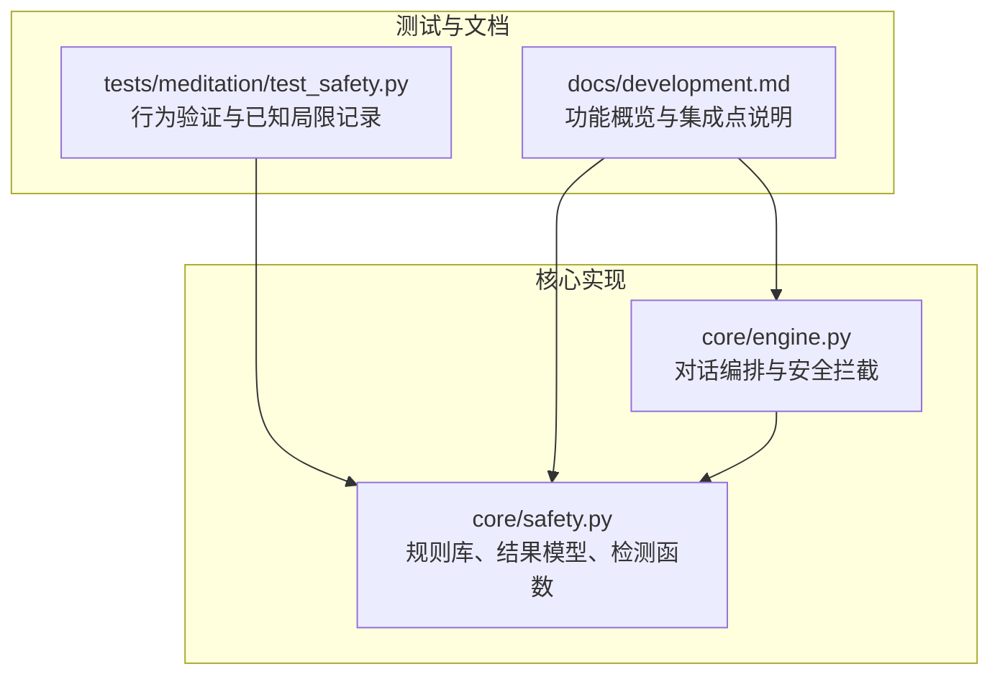
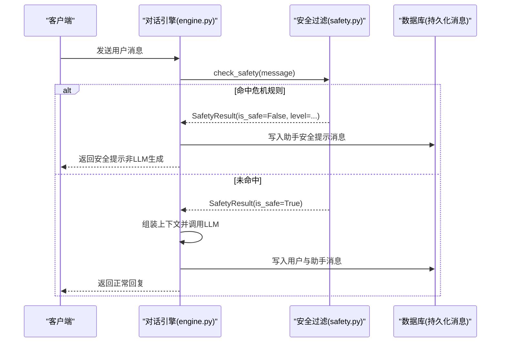
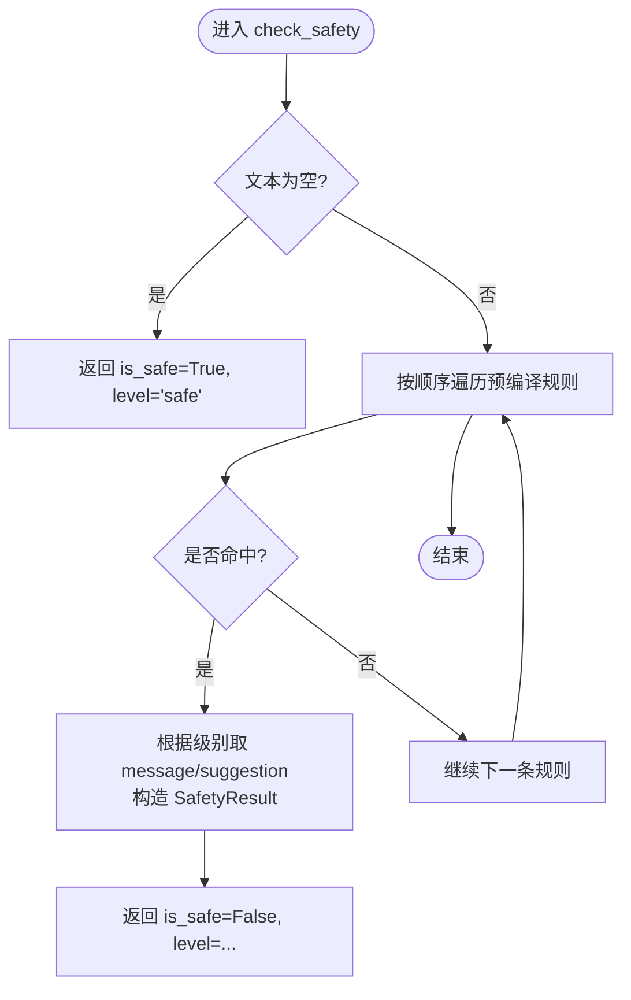
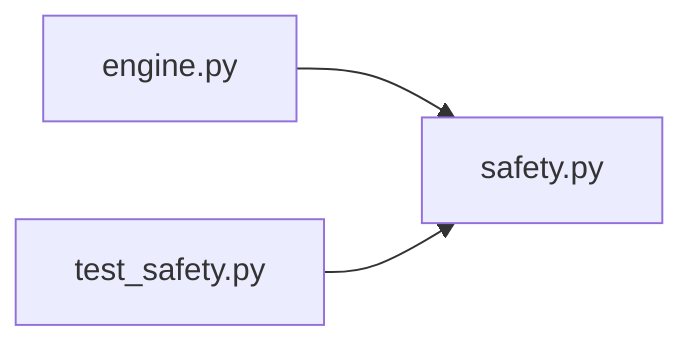

# 内容安全过滤

<cite>
**本文引用的文件**   
- [hushai/meditation/core/safety.py](file://hushai/meditation/core/safety.py)
- [hushai/meditation/core/engine.py](file://hushai/meditation/core/engine.py)
- [tests/meditation/test_safety.py](file://tests/meditation/test_safety.py)
- [docs/development.md](file://docs/development.md)
</cite>

## 目录
1. [简介](#简介)
2. [项目结构](#项目结构)
3. [核心组件](#核心组件)
4. [架构总览](#架构总览)
5. [详细组件分析](#详细组件分析)
6. [依赖关系分析](#依赖关系分析)
7. [性能考量](#性能考量)
8. [故障排查指南](#故障排查指南)
9. [结论](#结论)
10. [附录：使用示例与扩展指南](#附录使用示例与扩展指南)

## 简介
本文件面向 hush.ai 的内容安全过滤系统，聚焦危机信号检测机制的实现原理与工程实践。文档覆盖以下要点：
- 自伤自杀倾向识别、伤害他人意图检测等核心功能
- SafetyResult 数据模型字段语义与取值约定
- _CRISIS_RULES 正则规则库的构建策略（优先级、匹配逻辑、扩展方法）
- 不同危机级别（crisis、emergency）的处理流程与用户反馈机制
- 敏感词库维护指南与自定义规则添加方法
- 通过 check_safety() 进行内容安全检查的实际用法说明

## 项目结构
与安全过滤相关的代码主要位于 meditation 子模块的核心层，并在对话引擎中集成调用；测试用例位于 tests 目录；开发文档对“敏感内容过滤”能力有概览性说明。

图表来源
- [hushai/meditation/core/safety.py:1-111](file://hushai/meditation/core/safety.py#L1-L111)
- [hushai/meditation/core/engine.py:166-314](file://hushai/meditation/core/engine.py#L166-L314)
- [tests/meditation/test_safety.py:1-140](file://tests/meditation/test_safety.py#L1-L140)
- [docs/development.md:249-256](file://docs/development.md#L249-L256)

章节来源
- [hushai/meditation/core/safety.py:1-111](file://hushai/meditation/core/safety.py#L1-L111)
- [hushai/meditation/core/engine.py:166-314](file://hushai/meditation/core/engine.py#L166-L314)
- [tests/meditation/test_safety.py:1-140](file://tests/meditation/test_safety.py#L1-L140)
- [docs/development.md:249-256](file://docs/development.md#L249-L256)

## 核心组件
- 规则库与匹配器
  - 预编译的正则模式集合，每条规则绑定一个危机级别（crisis 或 emergency），按优先级排序，确保更严重的“伤害他人”优先命中。
- 结果模型
  - SafetyResult 统一封装检测结果，包含是否安全、级别、提示文案与建议信息。
- 检测函数
  - check_safety(text) 执行快速阻断式检测，命中即返回对应级别与消息；未命中视为安全。
- 消息格式化
  - format_safety_message(result, original_reply) 将安全提示以固定格式附加到原始回复或直接输出提示。

章节来源
- [hushai/meditation/core/safety.py:21-40](file://hushai/meditation/core/safety.py#L21-L40)
- [hushai/meditation/core/safety.py:42-48](file://hushai/meditation/core/safety.py#L42-L48)
- [hushai/meditation/core/safety.py:83-102](file://hushai/meditation/core/safety.py#L83-L102)
- [hushai/meditation/core/safety.py:105-111](file://hushai/meditation/core/safety.py#L105-L111)

## 架构总览
安全过滤在对话引擎中被前置调用，用于在 LLM 生成之前进行快速阻断。若检测到危机信号，直接返回预设的安全提示，避免将高风险内容送入外部模型。

图表来源
- [hushai/meditation/core/engine.py:166-236](file://hushai/meditation/core/engine.py#L166-L236)
- [hushai/meditation/core/engine.py:238-314](file://hushai/meditation/core/engine.py#L238-L314)
- [hushai/meditation/core/safety.py:83-102](file://hushai/meditation/core/safety.py#L83-L102)

## 详细组件分析

### 危机信号检测机制
- 规则分类与优先级
  - emergency：伤害他人/报复社会类关键词，优先级最高，确保在同时命中多条规则时优先返回该级别。
  - crisis：自伤/自杀倾向、轻生相关表达，次级严重。
- 匹配策略
  - 采用预编译的正则表达式，按顺序遍历，首次命中即返回对应级别与消息。
  - 空输入短路返回安全，避免误判。
- 用户反馈
  - 根据级别选择对应的提示与建议信息，并通过 format_safety_message 统一拼装。

图表来源
- [hushai/meditation/core/safety.py:83-102](file://hushai/meditation/core/safety.py#L83-L102)

章节来源
- [hushai/meditation/core/safety.py:21-40](file://hushai/meditation/core/safety.py#L21-L40)
- [hushai/meditation/core/safety.py:83-102](file://hushai/meditation/core/safety.py#L83-L102)
- [tests/meditation/test_safety.py:77-81](file://tests/meditation/test_safety.py#L77-L81)

### SafetyResult 数据模型设计
- 字段与作用
  - is_safe：布尔值，表示是否为安全内容。
  - level：字符串，取值 safe/crisis/emergency，指示风险等级。
  - message：可选字符串，面向用户的简短提示语。
  - suggestion：可选字符串，面向用户的建议信息（如热线、紧急联系方式）。
- 取值约定
  - 当 is_safe=True 时，level="safe"，message 与 suggestion 均为 None。
  - 当 is_safe=False 时，level 为 "crisis" 或 "emergency"，message 与 suggestion 由级别映射表提供。

章节来源
- [hushai/meditation/core/safety.py:42-48](file://hushai/meditation/core/safety.py#L42-L48)
- [hushai/meditation/core/safety.py:70-80](file://hushai/meditation/core/safety.py#L70-L80)
- [hushai/meditation/core/safety.py:83-102](file://hushai/meditation/core/safety.py#L83-L102)

### _CRISIS_RULES 规则库构建策略
- 构建原则
  - 每条规则为“预编译正则 + 级别”的元组，级别与模式在编译期绑定，避免运行时二次判断导致的不一致。
  - 优先级体现在列表顺序：更具体的“伤害他人”规则置于自伤规则之前，保证 emergency 优先于 crisis。
- 匹配逻辑
  - 顺序扫描，首次命中即返回；未命中则判定为安全。
- 扩展方法
  - 新增规则：在列表中添加新的 (re.compile(...), level) 元组，注意将更高优先级的规则放在前面。
  - 大小写不敏感：所有正则均启用忽略大小写标志，便于未来引入英文关键词。
  - 集中管理：级别对应的消息与建议集中在映射表中，新增级别需同步更新映射。

章节来源
- [hushai/meditation/core/safety.py:18-39](file://hushai/meditation/core/safety.py#L18-L39)
- [hushai/meditation/core/safety.py:70-80](file://hushai/meditation/core/safety.py#L70-L80)
- [tests/meditation/test_safety.py:84-101](file://tests/meditation/test_safety.py#L84-L101)

### 危机级别处理流程与用户反馈
- crisis 级别
  - 触发场景：自伤/自杀倾向、轻生相关表达。
  - 用户反馈：温和提示 + 心理援助热线等资源信息。
- emergency 级别
  - 触发场景：伤害他人/报复社会等高危表达。
  - 用户反馈：紧急求助信息（急救、报警、急诊等）。
- 流式与非流式差异
  - 非流式：直接返回完整安全提示。
  - 流式：逐字符推送安全提示，随后结束流。

章节来源
- [hushai/meditation/core/safety.py:50-67](file://hushai/meditation/core/safety.py#L50-L67)
- [hushai/meditation/core/safety.py:70-80](file://hushai/meditation/core/safety.py#L70-L80)
- [hushai/meditation/core/engine.py:182-196](file://hushai/meditation/core/engine.py#L182-L196)
- [hushai/meditation/core/engine.py:255-274](file://hushai/meditation/core/engine.py#L255-L274)

### 敏感词库维护指南与自定义规则添加
- 维护要点
  - 保持规则简洁明确，避免过度泛化导致误报。
  - 定期回顾测试用例中的“已知局限”，评估是否需要增强（例如对空格/拼音绕过的防护策略）。
  - 新增规则后补充单元测试，确保优先级与行为符合预期。
- 自定义规则步骤
  - 在规则列表中插入新的 (re.compile(...), level) 元组。
  - 如需新增级别，先在级别映射表中定义 message 与 suggestion，再在 check_safety 中引用。
  - 运行测试验证：包括空输入、同时命中多规则、大小写不敏感等边界情况。

章节来源
- [hushai/meditation/core/safety.py:21-39](file://hushai/meditation/core/safety.py#L21-L39)
- [hushai/meditation/core/safety.py:70-80](file://hushai/meditation/core/safety.py#L70-L80)
- [tests/meditation/test_safety.py:104-118](file://tests/meditation/test_safety.py#L104-L118)

## 依赖关系分析
- 模块内依赖
  - engine.py 依赖 safety.py 提供的 check_safety 与 format_safety_message。
  - safety.py 内部仅依赖标准库 re 与 dataclasses，无外部第三方依赖。
- 测试依赖
  - test_safety.py 直接导入 safety.py 的公共接口与常量，验证行为与已知局限。

图表来源
- [hushai/meditation/core/engine.py:166-314](file://hushai/meditation/core/engine.py#L166-L314)
- [hushai/meditation/core/safety.py:1-111](file://hushai/meditation/core/safety.py#L1-L111)
- [tests/meditation/test_safety.py:1-140](file://tests/meditation/test_safety.py#L1-L140)

章节来源
- [hushai/meditation/core/engine.py:166-314](file://hushai/meditation/core/engine.py#L166-L314)
- [hushai/meditation/core/safety.py:1-111](file://hushai/meditation/core/safety.py#L1-L111)
- [tests/meditation/test_safety.py:1-140](file://tests/meditation/test_safety.py#L1-L140)

## 性能考量
- 正则预编译
  - 规则在模块导入时一次性编译，避免每次调用重复解析，降低 CPU 开销。
- 短路返回
  - 空输入直接返回安全，减少不必要的匹配。
- 单次命中即返回
  - 命中第一条规则后立即返回，避免后续规则扫描带来的额外成本。

章节来源
- [hushai/meditation/core/safety.py:21-39](file://hushai/meditation/core/safety.py#L21-L39)
- [hushai/meditation/core/safety.py:83-102](file://hushai/meditation/core/safety.py#L83-L102)

## 故障排查指南
- 常见问题
  - 误判为安全：检查是否存在空格/拼音绕过；必要时考虑增加预处理或更鲁棒的规则。
  - 误报：审查规则是否过于宽泛，调整正则范围或提高特异性。
  - 级别冲突：确认规则顺序，确保 emergency 规则在 crisis 之前。
- 定位方法
  - 使用测试用例复现问题，关注 TestCheckSafety 与 TestRegexCompilation 的行为断言。
  - 查看 docs/development.md 中对“敏感内容过滤”的集成说明，确认调用位置与返回值处理是否正确。

章节来源
- [tests/meditation/test_safety.py:104-118](file://tests/meditation/test_safety.py#L104-L118)
- [docs/development.md:249-256](file://docs/development.md#L249-L256)

## 结论
当前安全过滤系统采用“关键词正则 + 预编译 + 优先级排序”的快速阻断方案，能够在 LLM 生成前有效识别自伤自杀与伤害他人的高危表达，并以分级方式向用户提供合适的提示与建议。尽管存在已知的绕过局限（空格/拼音），但作为第一道防线具备明确的工程价值。后续可在不改变现有接口的前提下，逐步增强规则质量与覆盖面，并结合更复杂的语义模型进行二次校验。

## 附录：使用示例与扩展指南

### 使用 check_safety() 进行内容安全检查
- 基本用法
  - 调用 check_safety(text)，获取 SafetyResult。
  - 若 is_safe=False，使用 format_safety_message(result, original_reply) 拼装最终回复。
- 典型流程
  - 在对话入口处先执行安全检查，若命中危机，直接返回安全提示，不调用 LLM。
  - 若未命中，继续正常的对话流程。

章节来源
- [hushai/meditation/core/safety.py:83-111](file://hushai/meditation/core/safety.py#L83-L111)
- [hushai/meditation/core/engine.py:182-196](file://hushai/meditation/core/engine.py#L182-L196)
- [hushai/meditation/core/engine.py:255-274](file://hushai/meditation/core/engine.py#L255-L274)

### 扩展规则与级别的步骤清单
- 新增规则
  - 在 _CRISIS_RULES 列表中添加新的 (re.compile(...), level) 元组，确保高优先级规则在前。
- 新增级别
  - 在 _LEVEL_MESSAGES 映射表中新增级别对应的 message 与 suggestion。
  - 在 check_safety 中确保新级别可被正确引用。
- 测试验证
  - 补充参数化测试，覆盖新规则的命中与优先级。
  - 验证空输入、大小写不敏感、同时命中多规则等边界条件。

章节来源
- [hushai/meditation/core/safety.py:21-39](file://hushai/meditation/core/safety.py#L21-L39)
- [hushai/meditation/core/safety.py:70-80](file://hushai/meditation/core/safety.py#L70-L80)
- [tests/meditation/test_safety.py:84-101](file://tests/meditation/test_safety.py#L84-L101)