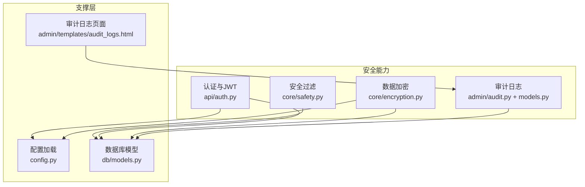
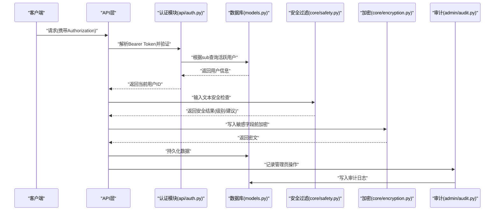
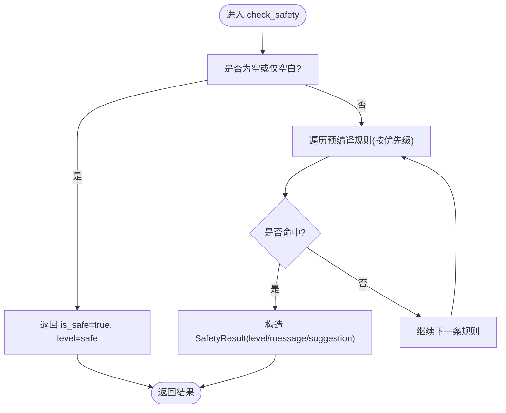
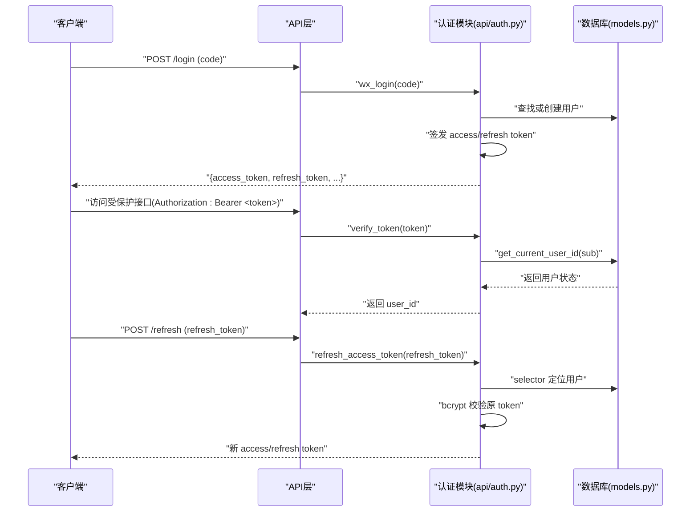
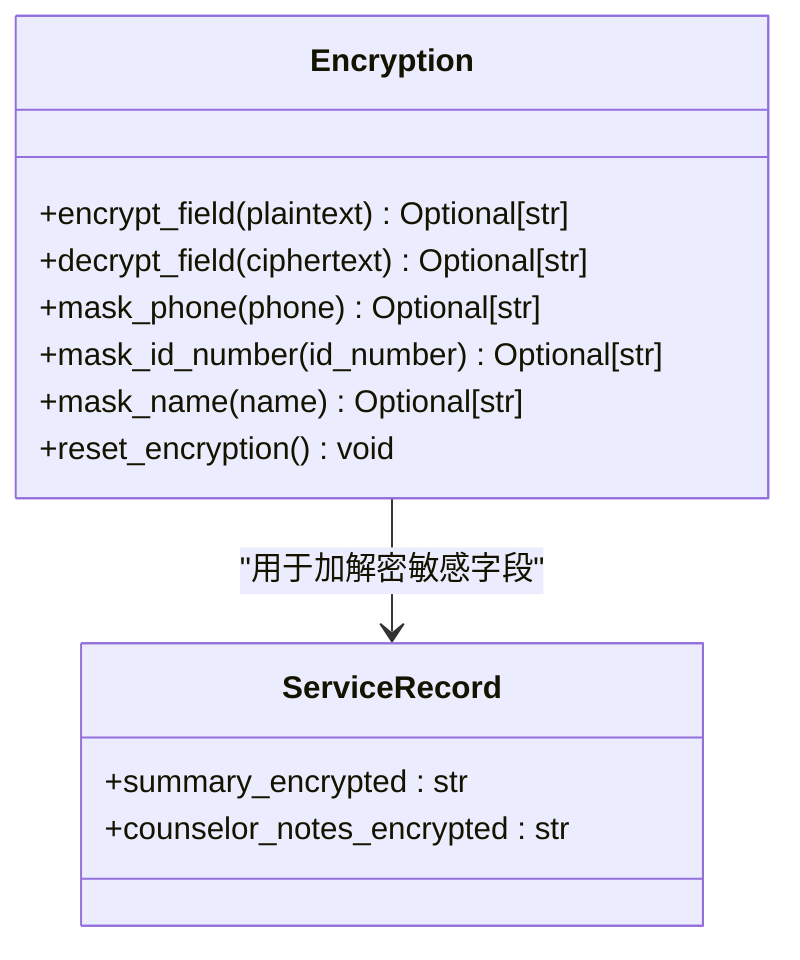
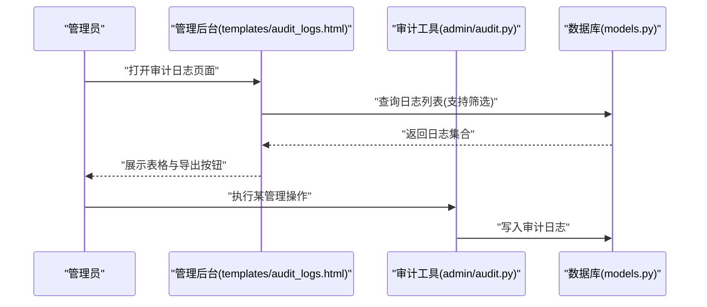
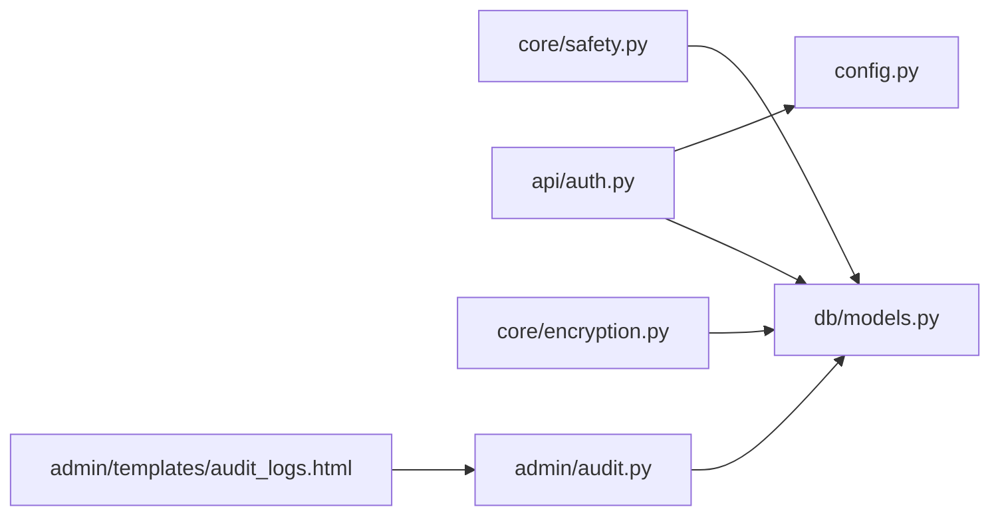

# 安全与防护

<cite>
**本文引用的文件**   
- [hushai/meditation/core/safety.py](file://hushai/meditation/core/safety.py)
- [tests/meditation/test_safety.py](file://tests/meditation/test_safety.py)
- [hushai/meditation/api/auth.py](file://hushai/meditation/api/auth.py)
- [tests/meditation/test_auth.py](file://tests/meditation/test_auth.py)
- [hushai/meditation/core/encryption.py](file://hushai/meditation/core/encryption.py)
- [hushai/meditation/db/models.py](file://hushai/meditation/db/models.py)
- [hushai/meditation/admin/audit.py](file://hushai/meditation/admin/audit.py)
- [hushai/meditation/admin/templates/audit_logs.html](file://hushai/meditation/admin/templates/audit_logs.html)
- [hushai/meditation/config.py](file://hushai/meditation/config.py)
- [docs/configuration.md](file://docs/configuration.md)
</cite>

## 目录
1. [简介](#简介)
2. [项目结构](#项目结构)
3. [核心组件](#核心组件)
4. [架构总览](#架构总览)
5. [详细组件分析](#详细组件分析)
6. [依赖关系分析](#依赖关系分析)
7. [性能与安全考量](#性能与安全考量)
8. [故障排查指南](#故障排查指南)
9. [结论](#结论)
10. [附录：配置与最佳实践](#附录配置与最佳实践)

## 简介
本文件面向 hush.ai 的安全与防护体系，聚焦以下能力：
- 安全过滤机制：敏感词检测、危机信号识别、不当内容拦截
- JWT 认证机制：Token 生成、验证、刷新与撤销策略
- 数据加密存储：用户隐私保护、敏感信息加密
- 审计日志系统：管理员操作记录、用户行为追踪、安全事件监控
- 安全配置最佳实践与漏洞防护措施

文档以代码级事实为依据，辅以可视化图示，帮助安全运维人员快速理解并落地。

## 项目结构
围绕安全相关的关键模块分布如下：
- 安全过滤：hushai/meditation/core/safety.py
- 认证与授权：hushai/meditation/api/auth.py
- 数据加密：hushai/meditation/core/encryption.py
- 数据库模型（含审计日志）：hushai/meditation/db/models.py
- 审计工具与后台页面：hushai/meditation/admin/audit.py、hushai/meditation/admin/templates/audit_logs.html
- 配置加载：hushai/meditation/config.py
- 测试用例：tests/meditation/test_safety.py、tests/meditation/test_auth.py
- 配置文档：docs/configuration.md

图表来源
- [hushai/meditation/core/safety.py:1-111](file://hushai/meditation/core/safety.py#L1-L111)
- [hushai/meditation/api/auth.py:1-171](file://hushai/meditation/api/auth.py#L1-L171)
- [hushai/meditation/core/encryption.py:1-79](file://hushai/meditation/core/encryption.py#L1-L79)
- [hushai/meditation/db/models.py:188-202](file://hushai/meditation/db/models.py#L188-L202)
- [hushai/meditation/admin/audit.py:1-32](file://hushai/meditation/admin/audit.py#L1-L32)
- [hushai/meditation/admin/templates/audit_logs.html:1-103](file://hushai/meditation/admin/templates/audit_logs.html#L1-L103)
- [hushai/meditation/config.py:1-136](file://hushai/meditation/config.py#L1-L136)

章节来源
- [hushai/meditation/core/safety.py:1-111](file://hushai/meditation/core/safety.py#L1-L111)
- [hushai/meditation/api/auth.py:1-171](file://hushai/meditation/api/auth.py#L1-L171)
- [hushai/meditation/core/encryption.py:1-79](file://hushai/meditation/core/encryption.py#L1-L79)
- [hushai/meditation/db/models.py:188-202](file://hushai/meditation/db/models.py#L188-L202)
- [hushai/meditation/admin/audit.py:1-32](file://hushai/meditation/admin/audit.py#L1-L32)
- [hushai/meditation/admin/templates/audit_logs.html:1-103](file://hushai/meditation/admin/templates/audit_logs.html#L1-L103)
- [hushai/meditation/config.py:1-136](file://hushai/meditation/config.py#L1-L136)

## 核心组件
- 安全过滤模块：基于预编译正则的关键词规则集，提供“crisis”和“emergency”两级判定，并在输出时附加温馨提示与建议。
- JWT 认证模块：微信 OAuth 登录流程签发 access token 与 refresh token；access token 强制 type=access 校验；refresh token 通过 selector 定位用户后 bcrypt 校验，避免全表扫描 DoS。
- 数据加密模块：使用 Fernet 对称加密对敏感字段进行加解密，并提供手机号、身份证号、姓名等脱敏函数。
- 审计日志模块：记录管理员操作（操作人、动作、资源类型、资源ID、详情、IP、UA），并提供后台查询与导出界面。

章节来源
- [hushai/meditation/core/safety.py:1-111](file://hushai/meditation/core/safety.py#L1-L111)
- [hushai/meditation/api/auth.py:1-171](file://hushai/meditation/api/auth.py#L1-L171)
- [hushai/meditation/core/encryption.py:1-79](file://hushai/meditation/core/encryption.py#L1-L79)
- [hushai/meditation/admin/audit.py:1-32](file://hushai/meditation/admin/audit.py#L1-L32)
- [hushai/meditation/db/models.py:188-202](file://hushai/meditation/db/models.py#L188-L202)

## 架构总览
下图展示了关键安全流程在系统中的交互关系：

图表来源
- [hushai/meditation/api/auth.py:109-131](file://hushai/meditation/api/auth.py#L109-L131)
- [hushai/meditation/core/safety.py:83-102](file://hushai/meditation/core/safety.py#L83-L102)
- [hushai/meditation/core/encryption.py:31-47](file://hushai/meditation/core/encryption.py#L31-L47)
- [hushai/meditation/admin/audit.py:10-31](file://hushai/meditation/admin/audit.py#L10-L31)
- [hushai/meditation/db/models.py:188-202](file://hushai/meditation/db/models.py#L188-L202)

## 详细组件分析

### 安全过滤机制（敏感词检测、危机信号识别、不当内容拦截）
- 规则设计
  - 将每条规则与级别绑定，按优先级排序，确保更严重的“伤害他人”优先于“自伤/自杀”。
  - 使用预编译的正则表达式提升匹配性能，并对英文关键词大小写不敏感。
- 处理流程
  - 空输入短路返回安全。
  - 命中任意规则即返回对应级别与提示文案。
  - 格式化输出时，若为不安全结果，则在原始回复后追加“温馨提示”与建议。
- 已知局限
  - 空格插入、拼音、同音字可绕过正则匹配；后续可引入 LLM 二次分类增强鲁棒性。

图表来源
- [hushai/meditation/core/safety.py:22-39](file://hushai/meditation/core/safety.py#L22-L39)
- [hushai/meditation/core/safety.py:83-102](file://hushai/meditation/core/safety.py#L83-L102)
- [hushai/meditation/core/safety.py:105-111](file://hushai/meditation/core/safety.py#L105-L111)

章节来源
- [hushai/meditation/core/safety.py:1-111](file://hushai/meditation/core/safety.py#L1-L111)
- [tests/meditation/test_safety.py:1-139](file://tests/meditation/test_safety.py#L1-L139)

### JWT 认证机制（Token 生成、验证、刷新与撤销）
- Token 生成
  - access token：包含 sub、exp、iat、type=access，使用配置的密钥与算法签名。
  - refresh token：随机字符串，服务端保存其哈希与选择器（SHA-256 hex）。
- Token 验证
  - verify_token 强制要求 type=access，防止类型混淆。
  - get_current_user_id 解码后根据 sub 查询活跃用户，确保用户未被禁用。
- Token 刷新
  - 通过 refresh_token_selector 做 O(1) 定位用户，再使用 bcrypt 校验原 token，避免全表扫描导致的 DoS。
  - 刷新成功后轮换新的 access/refresh token。
- 撤销策略
  - 未实现显式撤销接口；可通过禁用用户（is_active=false）使 access token 无法获取有效用户而失效。
  - refresh token 每次刷新均轮换，旧 token 自动失效。

图表来源
- [hushai/meditation/api/auth.py:45-61](file://hushai/meditation/api/auth.py#L45-L61)
- [hushai/meditation/api/auth.py:63-106](file://hushai/meditation/api/auth.py#L63-L106)
- [hushai/meditation/api/auth.py:109-131](file://hushai/meditation/api/auth.py#L109-L131)
- [hushai/meditation/api/auth.py:134-164](file://hushai/meditation/api/auth.py#L134-L164)
- [hushai/meditation/db/models.py:37-67](file://hushai/meditation/db/models.py#L37-L67)

章节来源
- [hushai/meditation/api/auth.py:1-171](file://hushai/meditation/api/auth.py#L1-L171)
- [tests/meditation/test_auth.py:1-141](file://tests/meditation/test_auth.py#L1-L141)
- [hushai/meditation/db/models.py:37-67](file://hushai/meditation/db/models.py#L37-L67)

### 数据加密存储方案（隐私保护、敏感信息加密）
- 加密算法
  - 使用 Fernet 对称加密，密钥从环境变量读取；未配置时在开发环境自动生成并注入到进程环境。
- 字段范围
  - 服务记录中的摘要与咨询师备注等敏感字段采用加密存储。
- 脱敏辅助
  - 提供手机号、身份证号、姓名的脱敏函数，便于展示与导出。
- 错误处理
  - 解密失败时返回原文，避免崩溃，但需关注数据一致性风险。

图表来源
- [hushai/meditation/core/encryption.py:18-47](file://hushai/meditation/core/encryption.py#L18-L47)
- [hushai/meditation/core/encryption.py:50-73](file://hushai/meditation/core/encryption.py#L50-L73)
- [hushai/meditation/db/models.py:386-411](file://hushai/meditation/db/models.py#L386-L411)

章节来源
- [hushai/meditation/core/encryption.py:1-79](file://hushai/meditation/core/encryption.py#L1-L79)
- [hushai/meditation/db/models.py:386-411](file://hushai/meditation/db/models.py#L386-L411)

### 审计日志系统（管理员操作记录、用户行为追踪、安全事件监控）
- 记录内容
  - 管理员用户名、操作类型、资源类型、资源ID、详情、IP地址、User-Agent、时间戳。
- 后台查看
  - 支持按操作类型与管理员筛选，支持 CSV/Excel 导出。
- 扩展建议
  - 可将安全事件（如危机信号命中、认证失败）纳入审计，形成统一安全事件视图。

图表来源
- [hushai/meditation/admin/audit.py:10-31](file://hushai/meditation/admin/audit.py#L10-L31)
- [hushai/meditation/db/models.py:188-202](file://hushai/meditation/db/models.py#L188-L202)
- [hushai/meditation/admin/templates/audit_logs.html:1-103](file://hushai/meditation/admin/templates/audit_logs.html#L1-L103)

章节来源
- [hushai/meditation/admin/audit.py:1-32](file://hushai/meditation/admin/audit.py#L1-L32)
- [hushai/meditation/db/models.py:188-202](file://hushai/meditation/db/models.py#L188-L202)
- [hushai/meditation/admin/templates/audit_logs.html:1-103](file://hushai/meditation/admin/templates/audit_logs.html#L1-L103)

## 依赖关系分析
- 安全过滤依赖数据库模型（用于关联会话/消息上下文），但不直接读写，主要作为前置检查。
- 认证模块依赖配置（jwt_secret、jwt_algorithm）、数据库（用户表）与外部微信服务。
- 加密模块依赖环境变量（MEDITATION_ENCRYPTION_KEY），并通过模型字段名约定完成加解密。
- 审计模块依赖数据库模型（AuditLog），由后台页面提供查询与导出。

图表来源
- [hushai/meditation/core/safety.py:1-111](file://hushai/meditation/core/safety.py#L1-L111)
- [hushai/meditation/api/auth.py:1-171](file://hushai/meditation/api/auth.py#L1-L171)
- [hushai/meditation/core/encryption.py:1-79](file://hushai/meditation/core/encryption.py#L1-L79)
- [hushai/meditation/admin/audit.py:1-32](file://hushai/meditation/admin/audit.py#L1-L32)
- [hushai/meditation/db/models.py:188-202](file://hushai/meditation/db/models.py#L188-L202)
- [hushai/meditation/admin/templates/audit_logs.html:1-103](file://hushai/meditation/admin/templates/audit_logs.html#L1-L103)
- [hushai/meditation/config.py:1-136](file://hushai/meditation/config.py#L1-L136)

章节来源
- [hushai/meditation/core/safety.py:1-111](file://hushai/meditation/core/safety.py#L1-L111)
- [hushai/meditation/api/auth.py:1-171](file://hushai/meditation/api/auth.py#L1-L171)
- [hushai/meditation/core/encryption.py:1-79](file://hushai/meditation/core/encryption.py#L1-L79)
- [hushai/meditation/admin/audit.py:1-32](file://hushai/meditation/admin/audit.py#L1-L32)
- [hushai/meditation/db/models.py:188-202](file://hushai/meditation/db/models.py#L188-L202)
- [hushai/meditation/admin/templates/audit_logs.html:1-103](file://hushai/meditation/admin/templates/audit_logs.html#L1-L103)
- [hushai/meditation/config.py:1-136](file://hushai/meditation/config.py#L1-L136)

## 性能与安全考量
- 安全过滤
  - 预编译正则减少运行时开销；规则顺序决定紧急程度优先级。
  - 已知正则绕过场景（空格、拼音）需在业务侧结合上下文与多轮对话策略缓解。
- 认证与授权
  - refresh token 刷新路径通过 selector 定位用户，避免全表 bcrypt 比对，降低 DoS 风险。
  - access token 强制 type=access 校验，防止未来引入 refresh JWT 时的类型混淆。
- 数据加密
  - Fernet 对称加密适合字段级敏感数据；生产环境必须显式配置密钥，避免进程内自动生成导致重启不可恢复。
- 审计日志
  - 建议在高频操作中异步落库，避免阻塞主流程；对 IP、UA 等元数据进行长度限制与清洗。

[本节为通用指导，无需特定文件引用]

## 故障排查指南
- 安全过滤误判/漏判
  - 检查规则列表与优先级；确认输入是否被预处理（去空白、归一化）。
  - 参考测试用例覆盖边界情况（空输入、同时命中多条规则）。
- JWT 验证失败
  - 确认 jwt_secret 与算法一致；检查 type 字段是否为 access。
  - 刷新失败时检查 selector 是否正确、bcrypt 校验是否通过。
- 加密解密异常
  - 确认 MEDITATION_ENCRYPTION_KEY 已正确配置；解密失败会返回原文，需核查数据迁移与版本升级后的兼容性。
- 审计日志缺失
  - 检查调用 log_admin_action 的位置；确认数据库连接与事务提交；后台页面筛选条件是否正确。

章节来源
- [tests/meditation/test_safety.py:1-139](file://tests/meditation/test_safety.py#L1-L139)
- [tests/meditation/test_auth.py:1-141](file://tests/meditation/test_auth.py#L1-L141)
- [hushai/meditation/core/encryption.py:39-47](file://hushai/meditation/core/encryption.py#L39-L47)
- [hushai/meditation/admin/audit.py:10-31](file://hushai/meditation/admin/audit.py#L10-L31)

## 结论
hush.ai 的安全与防护体系围绕“前置过滤、强认证、敏感数据加密、可审计”四大支柱构建。当前实现已在关键路径上落实了多项安全加固措施（预编译规则、类型强制校验、selector+bcrypt 防 DoS、字段级加密、审计记录与导出）。后续可在以下方面持续演进：
- 引入 LLM 二次分类与语义级风控，提升对变体与绕过的识别能力
- 完善 refresh token 撤销机制（黑名单/短生命周期）
- 将安全事件纳入审计中心，形成统一告警与处置闭环
- 强化密钥管理与轮换策略，满足合规与审计要求

[本节为总结性内容，无需特定文件引用]

## 附录：配置与最佳实践
- 密钥与敏感配置
  - 使用环境变量注入 jwt_secret、加密密钥等敏感项，勿提交至版本库。
  - 配置文件权限最小化（例如 Unix chmod 600），遵循最小暴露原则。
- 运行环境
  - 生产环境关闭 debug 模式；严格限定 CORS 源。
  - 合理设置 access token 过期时间与 refresh token 轮换策略。
- 数据与隐私
  - 对敏感字段实施加密存储；对外展示使用脱敏函数。
  - 审计日志中避免记录明文敏感信息，必要时二次脱敏。
- 监控与告警
  - 对认证失败、安全过滤命中、审计异常建立指标与告警。
  - 定期审查审计日志，发现异常行为及时处置。

章节来源
- [docs/configuration.md:104-114](file://docs/configuration.md#L104-L114)
- [hushai/meditation/config.py:18-62](file://hushai/meditation/config.py#L18-L62)
- [hushai/meditation/core/encryption.py:18-28](file://hushai/meditation/core/encryption.py#L18-L28)