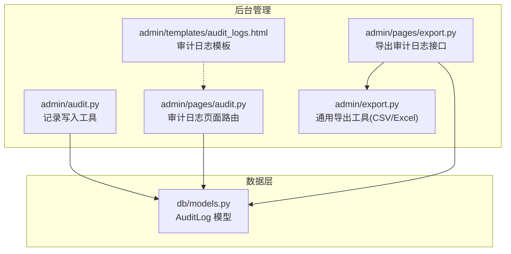
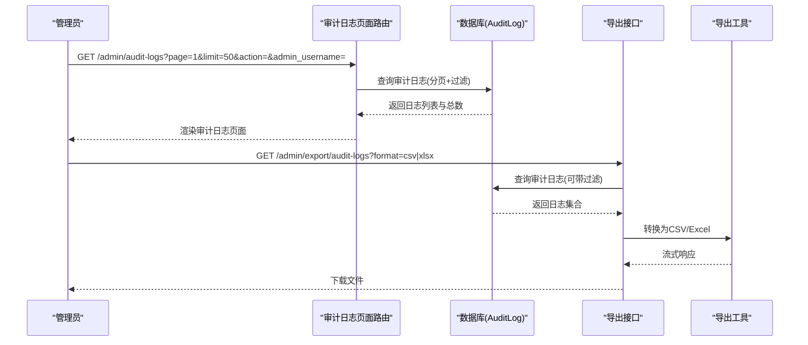
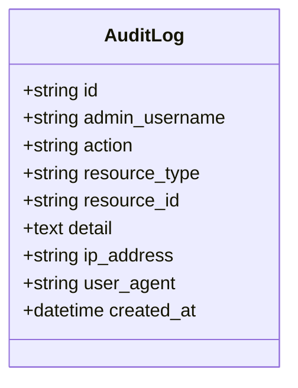
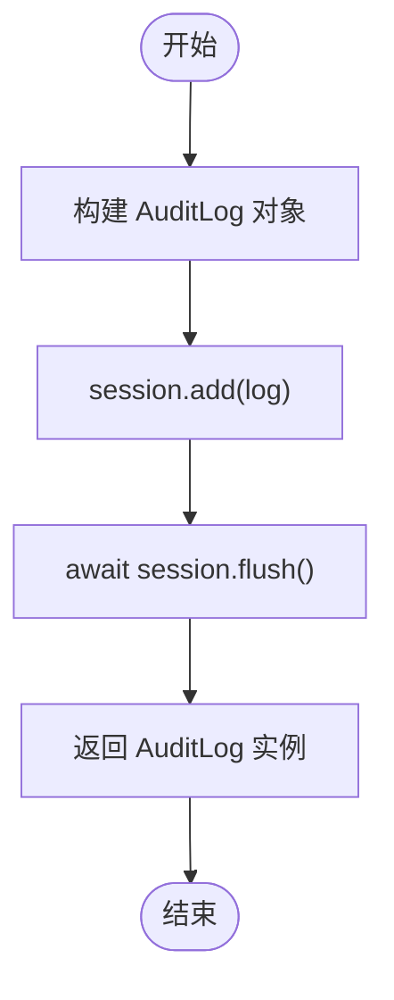
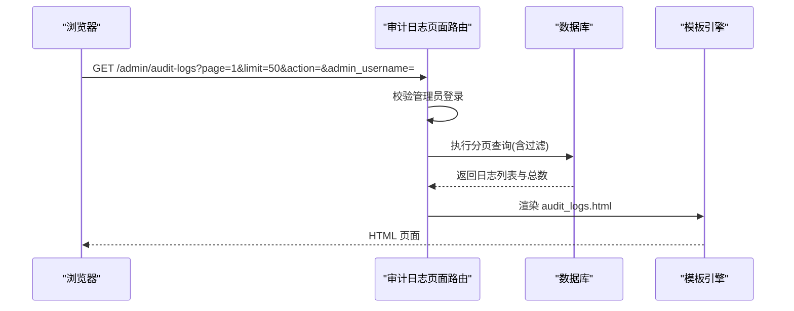
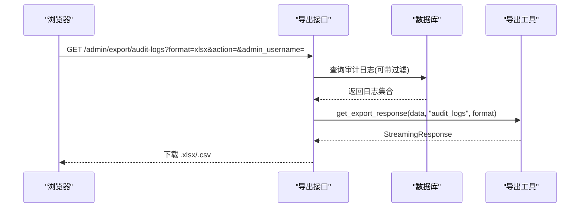
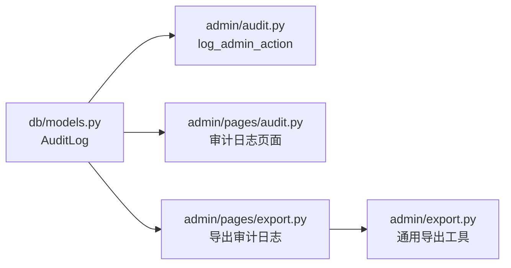

# 审计日志与监控

<cite>
**本文引用的文件**   
- [hushai/meditation/db/models.py](file://hushai/meditation/db/models.py)
- [hushai/meditation/admin/audit.py](file://hushai/meditation/admin/audit.py)
- [hushai/meditation/admin/pages/audit.py](file://hushai/meditation/admin/pages/audit.py)
- [hushai/meditation/admin/templates/audit_logs.html](file://hushai/meditation/admin/templates/audit_logs.html)
- [hushai/meditation/admin/pages/export.py](file://hushai/meditation/admin/pages/export.py)
- [hushai/meditation/admin/export.py](file://hushai/meditation/admin/export.py)
</cite>

## 目录
1. [简介](#简介)
2. [项目结构](#项目结构)
3. [核心组件](#核心组件)
4. [架构总览](#架构总览)
5. [详细组件分析](#详细组件分析)
6. [依赖关系分析](#依赖关系分析)
7. [性能考虑](#性能考虑)
8. [故障排查指南](#故障排查指南)
9. [结论](#结论)
10. [附录](#附录)

## 简介
本运维文档面向 hush.ai 的审计日志与监控系统，聚焦以下目标：
- 说明审计日志系统的设计与实现，包括记录写入、存储模型、检索接口与导出能力。
- 解释管理员操作记录的捕获机制，涵盖操作类型分类、用户行为追踪、时间戳记录等特性。
- 阐述安全事件监控的实现方案，包括异常访问检测、敏感操作告警、风险行为识别等能力（当前仓库已提供基础能力与扩展点）。
- 详细说明日志数据的生命周期管理，包括轮转、归档、清理策略建议与落地方式。
- 提供日志分析工具使用方法，包括查询语法、统计报表与可视化展示建议。
- 给出完整的审计配置示例与性能优化建议。

## 项目结构
审计日志相关代码主要位于 admin 模块与数据库模型中，包含数据模型、记录写入工具、Web 页面与导出功能。

图表来源
- [hushai/meditation/admin/audit.py:1-32](file://hushai/meditation/admin/audit.py#L1-L32)
- [hushai/meditation/admin/pages/audit.py:1-72](file://hushai/meditation/admin/pages/audit.py#L1-L72)
- [hushai/meditation/admin/templates/audit_logs.html:1-103](file://hushai/meditation/admin/templates/audit_logs.html#L1-L103)
- [hushai/meditation/admin/pages/export.py:1-207](file://hushai/meditation/admin/pages/export.py#L1-L207)
- [hushai/meditation/admin/export.py:1-106](file://hushai/meditation/admin/export.py#L1-L106)
- [hushai/meditation/db/models.py:188-202](file://hushai/meditation/db/models.py#L188-L202)

章节来源
- [hushai/meditation/db/models.py:188-202](file://hushai/meditation/db/models.py#L188-L202)
- [hushai/meditation/admin/audit.py:1-32](file://hushai/meditation/admin/audit.py#L1-L32)
- [hushai/meditation/admin/pages/audit.py:1-72](file://hushai/meditation/admin/pages/audit.py#L1-L72)
- [hushai/meditation/admin/templates/audit_logs.html:1-103](file://hushai/meditation/admin/templates/audit_logs.html#L1-L103)
- [hushai/meditation/admin/pages/export.py:1-207](file://hushai/meditation/admin/pages/export.py#L1-L207)
- [hushai/meditation/admin/export.py:1-106](file://hushai/meditation/admin/export.py#L1-L106)

## 核心组件
- 数据模型：AuditLog 用于持久化管理员操作审计记录，包含管理员用户名、操作类型、资源类型、资源ID、详情、IP地址、User-Agent 以及创建时间等字段，并对常用查询字段建立索引以提升检索性能。
- 记录写入工具：log_admin_action 异步函数，接收会话、管理员信息、操作元数据并写入数据库。
- 审计日志页面：/admin/audit-logs 支持分页、按操作类型与管理员筛选，返回模板渲染结果。
- 导出能力：/admin/export/audit-logs 支持 CSV/Excel 格式导出，复用通用导出工具。
- 模板界面：展示审计日志列表、筛选器与导出按钮。

章节来源
- [hushai/meditation/db/models.py:188-202](file://hushai/meditation/db/models.py#L188-L202)
- [hushai/meditation/admin/audit.py:10-31](file://hushai/meditation/admin/audit.py#L10-L31)
- [hushai/meditation/admin/pages/audit.py:16-71](file://hushai/meditation/admin/pages/audit.py#L16-L71)
- [hushai/meditation/admin/pages/export.py:54-92](file://hushai/meditation/admin/pages/export.py#L54-L92)
- [hushai/meditation/admin/export.py:92-106](file://hushai/meditation/admin/export.py#L92-L106)
- [hushai/meditation/admin/templates/audit_logs.html:13-103](file://hushai/meditation/admin/templates/audit_logs.html#L13-L103)

## 架构总览
审计日志系统采用“写入工具 + Web 查询 + 导出”的分层设计：
- 写入层：业务逻辑调用 log_admin_action 将审计记录写入数据库。
- 存储层：SQLAlchemy 模型映射到 audit_logs 表，使用 UTC 时间戳与索引优化查询。
- 展示层：FastAPI 路由提供审计日志页面，支持分页与筛选。
- 导出层：统一导出接口输出 CSV/Excel，便于离线分析与报表生成。

图表来源
- [hushai/meditation/admin/pages/audit.py:16-71](file://hushai/meditation/admin/pages/audit.py#L16-L71)
- [hushai/meditation/admin/pages/export.py:54-92](file://hushai/meditation/admin/pages/export.py#L54-L92)
- [hushai/meditation/admin/export.py:92-106](file://hushai/meditation/admin/export.py#L92-L106)
- [hushai/meditation/db/models.py:188-202](file://hushai/meditation/db/models.py#L188-L202)

## 详细组件分析

### 数据模型与索引
- AuditLog 表字段：id、admin_username、action、resource_type、resource_id、detail、ip_address、user_agent、created_at。
- 索引策略：对 admin_username 与 action 建立索引，提升按管理员与操作类型的筛选效率；created_at 用于排序与范围查询。
- 时间戳：UTC 时间，便于跨时区一致性与合规性要求。

图表来源
- [hushai/meditation/db/models.py:188-202](file://hushai/meditation/db/models.py#L188-L202)

章节来源
- [hushai/meditation/db/models.py:188-202](file://hushai/meditation/db/models.py#L188-L202)

### 记录写入工具
- 函数签名：log_admin_action(session, admin_username, action, resource_type, resource_id=None, detail=None, ip_address=None, user_agent=None) -> AuditLog
- 行为：构造 AuditLog 对象，加入会话并 flush，确保在事务内同步落库。
- 使用建议：在关键管理操作前后调用，记录操作类型与资源标识，便于溯源。

图表来源
- [hushai/meditation/admin/audit.py:10-31](file://hushai/meditation/admin/audit.py#L10-L31)

章节来源
- [hushai/meditation/admin/audit.py:10-31](file://hushai/meditation/admin/audit.py#L10-L31)

### 审计日志页面与筛选
- 路由：GET /admin/audit-logs
- 参数：page、limit、action、admin_username
- 功能：分页查询、按操作类型与管理员筛选、动态获取可选值（distinct），渲染模板。
- 权限：未登录管理员重定向至登录页。

图表来源
- [hushai/meditation/admin/pages/audit.py:16-71](file://hushai/meditation/admin/pages/audit.py#L16-L71)
- [hushai/meditation/admin/templates/audit_logs.html:13-103](file://hushai/meditation/admin/templates/audit_logs.html#L13-L103)

章节来源
- [hushai/meditation/admin/pages/audit.py:16-71](file://hushai/meditation/admin/pages/audit.py#L16-L71)
- [hushai/meditation/admin/templates/audit_logs.html:13-103](file://hushai/meditation/admin/templates/audit_logs.html#L13-L103)

### 导出审计日志
- 路由：GET /admin/export/audit-logs?format=csv|xlsx
- 参数：action、admin_username、format
- 流程：根据条件查询审计日志，组装字典列表，调用通用导出工具生成 CSV/Excel 并流式返回。
- 文件名：基于时间戳命名，避免覆盖。

图表来源
- [hushai/meditation/admin/pages/export.py:54-92](file://hushai/meditation/admin/pages/export.py#L54-L92)
- [hushai/meditation/admin/export.py:92-106](file://hushai/meditation/admin/export.py#L92-L106)

章节来源
- [hushai/meditation/admin/pages/export.py:54-92](file://hushai/meditation/admin/pages/export.py#L54-L92)
- [hushai/meditation/admin/export.py:92-106](file://hushai/meditation/admin/export.py#L92-L106)

### 模板与前端交互
- 显示字段：时间、管理员、操作、资源类型、资源ID、详情、IP地址。
- 筛选控件：操作类型与管理员下拉框，提交后刷新列表。
- 导出按钮：直接链接到导出接口，携带当前筛选条件。

章节来源
- [hushai/meditation/admin/templates/audit_logs.html:13-103](file://hushai/meditation/admin/templates/audit_logs.html#L13-L103)

## 依赖关系分析
- 模块耦合：
  - 记录写入工具仅依赖数据库模型与会话，低耦合、易测试。
  - 页面路由依赖认证、会话注入与模板引擎，负责查询与渲染。
  - 导出接口复用通用导出工具，保持导出逻辑集中。
- 外部依赖：
  - FastAPI 路由与请求处理。
  - SQLAlchemy 异步会话与查询构建。
  - openpyxl 用于 Excel 导出。

图表来源
- [hushai/meditation/db/models.py:188-202](file://hushai/meditation/db/models.py#L188-L202)
- [hushai/meditation/admin/audit.py:1-32](file://hushai/meditation/admin/audit.py#L1-L32)
- [hushai/meditation/admin/pages/audit.py:1-72](file://hushai/meditation/admin/pages/audit.py#L1-L72)
- [hushai/meditation/admin/pages/export.py:1-207](file://hushai/meditation/admin/pages/export.py#L1-L207)
- [hushai/meditation/admin/export.py:1-106](file://hushai/meditation/admin/export.py#L1-L106)

章节来源
- [hushai/meditation/db/models.py:188-202](file://hushai/meditation/db/models.py#L188-L202)
- [hushai/meditation/admin/audit.py:1-32](file://hushai/meditation/admin/audit.py#L1-L32)
- [hushai/meditation/admin/pages/audit.py:1-72](file://hushai/meditation/admin/pages/audit.py#L1-L72)
- [hushai/meditation/admin/pages/export.py:1-207](file://hushai/meditation/admin/pages/export.py#L1-L207)
- [hushai/meditation/admin/export.py:1-106](file://hushai/meditation/admin/export.py#L1-L106)

## 性能考虑
- 索引优化：
  - 对 admin_username 与 action 建立索引，提高筛选效率。
  - created_at 用于排序，建议在高频查询场景下考虑复合索引（如 (admin_username, created_at)）以加速分页。
- 分页与限制：
  - 默认 limit=50，避免一次性加载过多数据。
  - 导出接口建议增加最大条数限制与超时保护，防止大表导出导致内存压力。
- 异步会话：
  - 使用 AsyncSession 减少阻塞，提升并发处理能力。
- 导出优化：
  - 使用流式响应降低内存占用。
  - 对大数据集导出可增加后台任务与进度通知（可扩展方向）。

[本节为通用性能指导，不直接分析具体文件]

## 故障排查指南
- 无法查看审计日志：
  - 检查管理员是否已登录，未登录会重定向至登录页。
  - 确认路由注册与模板路径是否正确。
- 筛选无效或为空：
  - 检查传入参数 action 与 admin_username 是否与数据库中的值匹配。
  - 确认 distinct 查询能正确返回可用选项。
- 导出失败：
  - 检查 openpyxl 依赖是否安装。
  - 确认导出接口权限校验通过。
  - 若数据量较大，关注服务器内存与网络带宽。

章节来源
- [hushai/meditation/admin/pages/audit.py:25-28](file://hushai/meditation/admin/pages/audit.py#L25-L28)
- [hushai/meditation/admin/pages/export.py:62-65](file://hushai/meditation/admin/pages/export.py#L62-L65)

## 结论
当前审计日志系统提供了完整的数据模型、写入工具、Web 查询与导出能力，满足管理员操作追溯与基础审计需求。为进一步增强安全与可观测性，建议补充安全事件监控规则、告警通道与日志生命周期管理策略，并结合现有导出能力构建统计报表与可视化看板。

[本节为总结性内容，不直接分析具体文件]

## 附录

### 审计配置示例
- 启用审计记录：
  - 在关键管理操作处调用 log_admin_action，传入管理员用户名、操作类型、资源类型与资源ID。
- 页面访问控制：
  - 所有审计相关路由需校验管理员身份，未登录则重定向登录。
- 导出开关：
  - 可通过环境变量控制导出接口的启用与限流策略。

章节来源
- [hushai/meditation/admin/audit.py:10-31](file://hushai/meditation/admin/audit.py#L10-L31)
- [hushai/meditation/admin/pages/audit.py:25-28](file://hushai/meditation/admin/pages/audit.py#L25-L28)
- [hushai/meditation/admin/pages/export.py:62-65](file://hushai/meditation/admin/pages/export.py#L62-L65)

### 查询语法与统计报表
- 查询语法：
  - 支持按 action 与 admin_username 筛选，结合分页参数 page 与 limit。
- 统计报表：
  - 利用导出接口获取全量数据，在本地进行聚合统计（如按操作类型计数、按管理员汇总、按时间段分布）。
- 可视化展示：
  - 将导出的 CSV/Excel 导入 BI 工具（如 Power BI、Tableau）进行图表展示。

章节来源
- [hushai/meditation/admin/pages/audit.py:36-54](file://hushai/meditation/admin/pages/audit.py#L36-L54)
- [hushai/meditation/admin/pages/export.py:54-92](file://hushai/meditation/admin/pages/export.py#L54-L92)

### 安全事件监控实现方案
- 异常访问检测：
  - 基于 IP 地址与 User-Agent 字段进行异常模式识别（如频繁失败、异常 UA）。
- 敏感操作告警：
  - 定义敏感操作类型（如删除、批量修改），触发告警通道（邮件、IM）。
- 风险行为识别：
  - 结合时间窗口与频率阈值，识别潜在风险行为（如短时间内多次删除）。

[本节为概念性方案，不直接分析具体文件]

### 日志生命周期管理
- 日志轮转：
  - 建议按天或按月进行表分区或分表，便于管理与查询。
- 归档策略：
  - 冷数据迁移至低成本存储（如对象存储），保留原始 CSV/Excel 快照。
- 清理规则：
  - 设定保留期（如 180 天），定期清理过期记录，释放空间。
- 备份与恢复：
  - 定期备份审计日志，确保可恢复性与合规性。

[本节为通用运维建议，不直接分析具体文件]