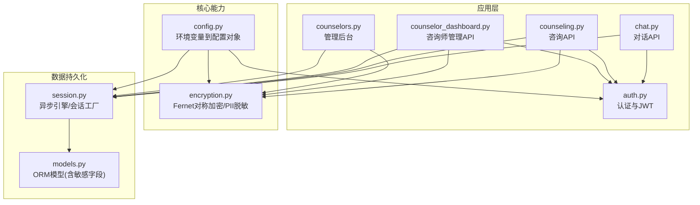
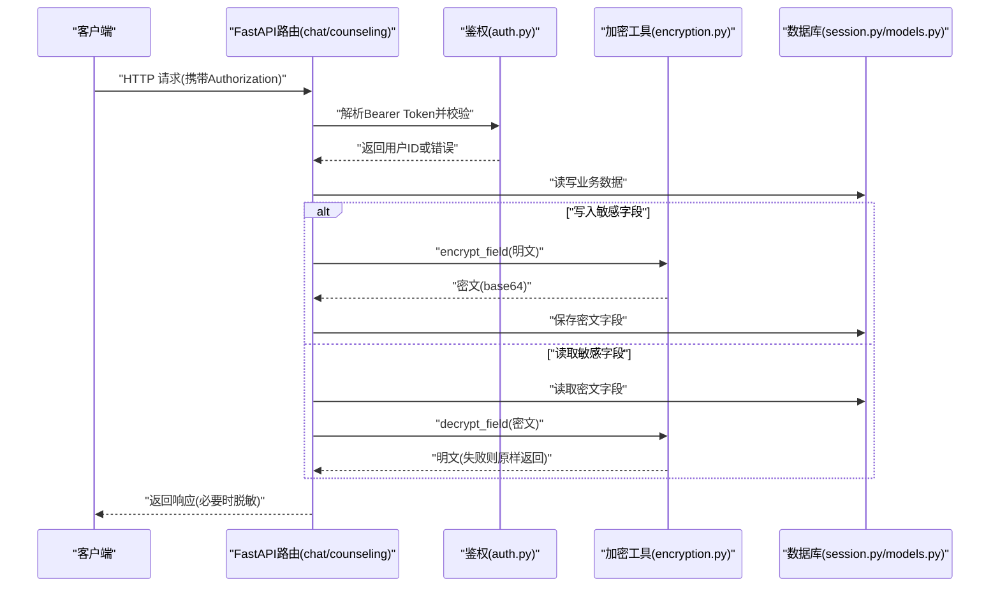
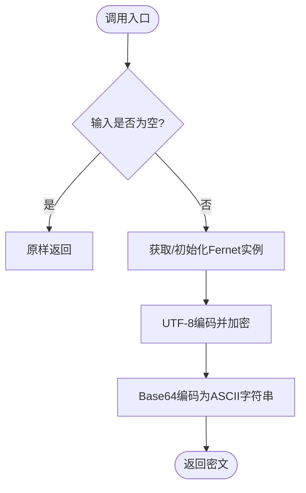
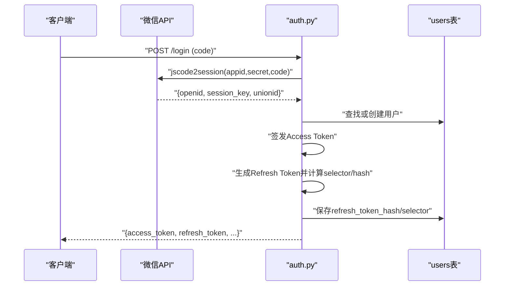
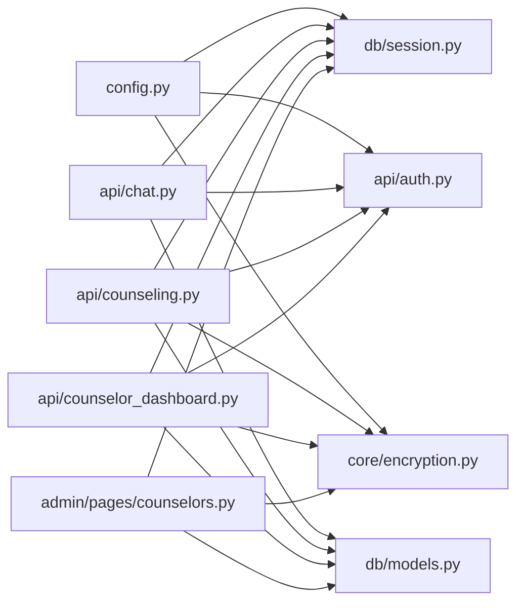

# 数据安全与加密

<cite>
**本文引用的文件**
- [hushai/meditation/core/encryption.py](file://hushai/meditation/core/encryption.py)
- [hushai/meditation/config.py](file://hushai/meditation/config.py)
- [hushai/meditation/db/session.py](file://hushai/meditation/db/session.py)
- [hushai/meditation/db/models.py](file://hushai/meditation/db/models.py)
- [hushai/meditation/api/auth.py](file://hushai/meditation/api/auth.py)
- [hushai/meditation/api/chat.py](file://hushai/meditation/api/chat.py)
- [hushai/meditation/api/counseling.py](file://hushai/meditation/api/counseling.py)
- [hushai/meditation/api/counselor_dashboard.py](file://hushai/meditation/api/counselor_dashboard.py)
- [hushai/meditation/admin/pages/counselors.py](file://hushai/meditation/admin/pages/counselors.py)
</cite>

## 更新摘要
**变更内容**
- 新增 Fernet 对称加密模块，提供敏感数据加密存储功能
- 新增 PII 脱敏工具，支持手机号、身份证号、姓名等个人信息脱敏
- 在咨询师服务记录中集成加密存储机制
- 在管理后台集成 PII 脱敏展示功能

## 目录
1. [简介](#简介)
2. [项目结构](#项目结构)
3. [核心组件](#核心组件)
4. [架构总览](#架构总览)
5. [详细组件分析](#详细组件分析)
6. [依赖关系分析](#依赖关系分析)
7. [性能与安全考量](#性能与安全考量)
8. [故障排查指南](#故障排查指南)
9. [结论](#结论)
10. [附录：安全配置示例](#附录安全配置示例)

## 简介
本文件面向 hush.ai 的数据安全与加密体系，聚焦以下目标：
- 数据加密存储方案：对称加密算法选择、密钥管理策略、数据完整性校验机制。
- 用户隐私保护：个人信息加密、敏感字段脱敏、数据传输加密策略。
- 数据库安全设计：连接池安全配置、SQL 注入防护、查询结果过滤。
- 文件上传下载安全检查：文件格式验证、大小限制、病毒扫描（现状与建议）。
- 备份恢复安全方案：加密备份、传输安全、存储隔离（现状与建议）。
- 提供完整的安全配置示例与故障排查指南。

## 项目结构
围绕数据安全与加密的相关代码主要分布在如下模块：
- 加密工具与 PII 脱敏：hushai/meditation/core/encryption.py
- 配置加载与环境变量映射：hushai/meditation/config.py
- 数据库会话与引擎初始化：hushai/meditation/db/session.py
- ORM 模型定义（含敏感字段命名约定）：hushai/meditation/db/models.py
- 认证与令牌签发/刷新：hushai/meditation/api/auth.py
- 对话 API（鉴权、限流、输出过滤）：hushai/meditation/api/chat.py
- 心理咨询业务 API（服务记录读取、解密展示）：hushai/meditation/api/counseling.py
- 咨询师管理 API（服务记录加密存储）：hushai/meditation/api/counselor_dashboard.py
- 管理后台页面（PII 脱敏展示）：hushai/meditation/admin/pages/counselors.py

图表来源
- [hushai/meditation/api/chat.py:1-245](file://hushai/meditation/api/chat.py#L1-L245)
- [hushai/meditation/api/counseling.py:1-572](file://hushai/meditation/api/counseling.py#L1-L572)
- [hushai/meditation/api/auth.py:1-171](file://hushai/meditation/api/auth.py#L1-L171)
- [hushai/meditation/api/counselor_dashboard.py:1-571](file://hushai/meditation/api/counselor_dashboard.py#L1-L571)
- [hushai/meditation/admin/pages/counselors.py:1-219](file://hushai/meditation/admin/pages/counselors.py#L1-L219)
- [hushai/meditation/core/encryption.py:1-78](file://hushai/meditation/core/encryption.py#L1-L78)
- [hushai/meditation/config.py:1-136](file://hushai/meditation/config.py#L1-L136)
- [hushai/meditation/db/session.py:1-83](file://hushai/meditation/db/session.py#L1-L83)
- [hushai/meditation/db/models.py:1-434](file://hushai/meditation/db/models.py#L1-L434)

章节来源
- [hushai/meditation/core/encryption.py:1-78](file://hushai/meditation/core/encryption.py#L1-L78)
- [hushai/meditation/config.py:1-136](file://hushai/meditation/config.py#L1-L136)
- [hushai/meditation/db/session.py:1-83](file://hushai/meditation/db/session.py#L1-L83)
- [hushai/meditation/db/models.py:1-434](file://hushai/meditation/db/models.py#L1-L434)
- [hushai/meditation/api/auth.py:1-171](file://hushai/meditation/api/auth.py#L1-L171)
- [hushai/meditation/api/chat.py:1-245](file://hushai/meditation/api/chat.py#L1-L245)
- [hushai/meditation/api/counseling.py:1-572](file://hushai/meditation/api/counseling.py#L1-L572)
- [hushai/meditation/api/counselor_dashboard.py:1-571](file://hushai/meditation/api/counselor_dashboard.py#L1-L571)
- [hushai/meditation/admin/pages/counselors.py:1-219](file://hushai/meditation/admin/pages/counselors.py#L1-L219)

## 核心组件
- 对称加密与 PII 脱敏
  - 使用 Fernet（基于 AES-128-CBC + HMAC-SHA256）对敏感文本进行加解密。
  - 提供手机号、身份证号、姓名等常见 PII 的脱敏函数。
  - 密钥通过环境变量懒加载，未配置时自动生成并回写至进程环境（仅开发建议）。
- 配置与环境变量
  - 集中从 .env 或系统环境变量加载配置，包含加密相关键位映射。
- 数据库会话与引擎
  - 根据 URL 自动适配 SQLite 或 PostgreSQL 驱动，设置连接池大小与线程参数。
- 认证与令牌
  - 微信 OAuth 登录流程，签发 Access Token 与 Refresh Token；Refresh Token 以哈希形式落库，避免明文存储。
- 业务 API 与数据访问
  - 对话与咨询接口统一鉴权；敏感字段在写入前加密、读取后按需解密展示。
  - 咨询师服务记录中的敏感字段（summary、counselor_notes）采用加密存储。
  - 管理后台使用 PII 脱敏函数进行个人信息展示。

章节来源
- [hushai/meditation/core/encryption.py:1-78](file://hushai/meditation/core/encryption.py#L1-L78)
- [hushai/meditation/config.py:1-136](file://hushai/meditation/config.py#L1-L136)
- [hushai/meditation/db/session.py:1-83](file://hushai/meditation/db/session.py#L1-L83)
- [hushai/meditation/api/auth.py:1-171](file://hushai/meditation/api/auth.py#L1-L171)
- [hushai/meditation/api/counseling.py:1-572](file://hushai/meditation/api/counseling.py#L1-L572)
- [hushai/meditation/api/counselor_dashboard.py:1-571](file://hushai/meditation/api/counselor_dashboard.py#L1-L571)
- [hushai/meditation/admin/pages/counselors.py:1-219](file://hushai/meditation/admin/pages/counselors.py#L1-L219)

## 架构总览
下图展示了关键安全路径：请求进入 API -> 鉴权 -> 业务处理 -> 数据持久化（加密/解密）-> 响应返回。

图表来源
- [hushai/meditation/api/chat.py:1-245](file://hushai/meditation/api/chat.py#L1-L245)
- [hushai/meditation/api/counseling.py:1-572](file://hushai/meditation/api/counseling.py#L1-L572)
- [hushai/meditation/api/auth.py:1-171](file://hushai/meditation/api/auth.py#L1-L171)
- [hushai/meditation/core/encryption.py:1-78](file://hushai/meditation/core/encryption.py#L1-L78)
- [hushai/meditation/db/session.py:1-83](file://hushai/meditation/db/session.py#L1-L83)
- [hushai/meditation/db/models.py:1-434](file://hushai/meditation/db/models.py#L1-L434)

## 详细组件分析

### 对称加密与 PII 脱敏（encryption.py）
**新增** 完整的 Fernet 对称加密模块和 PII 脱敏工具

- 算法与模式
  - 采用 Fernet（AES-128-CBC + HMAC），具备机密性与完整性校验。
- 密钥管理
  - 通过环境变量 MEDITATION_ENCRYPTION_KEY 获取；若为空，首次运行时生成并写入进程环境（仅开发场景建议）。
  - 提供 reset_encryption() 用于测试重置全局实例。
- 加解密行为
  - encrypt_field：空值直接返回；非空则 UTF-8 编码后加密并以 ASCII base64 字符串存储。
  - decrypt_field：空值直接返回；解密失败捕获异常并原样返回密文字符串，避免泄露内部错误。
- PII 脱敏
  - mask_phone/mask_id_number/mask_name：对手机号、身份证、姓名进行掩码处理，便于日志或列表展示。

图表来源
- [hushai/meditation/core/encryption.py:1-78](file://hushai/meditation/core/encryption.py#L1-L78)

章节来源
- [hushai/meditation/core/encryption.py:1-78](file://hushai/meditation/core/encryption.py#L1-L78)

### 配置与环境变量（config.py）
- 加载策略
  - 优先从项目根 .env 加载，支持覆盖；提供 from_env 将环境变量映射到 dataclass 字段。
- 加密相关
  - 包含 encryption_key 字段映射（MEDITATION_ENCRYPTION_KEY），供上层使用。
- 其他安全相关
  - JWT 密钥与算法、过期时间等配置项集中管理。

章节来源
- [hushai/meditation/config.py:1-136](file://hushai/meditation/config.py#L1-L136)

### 数据库会话与引擎（session.py）
- 驱动与URL适配
  - 自动将 postgresql/postgres 转换为 asyncpg 驱动；SQLite 自动添加 aiosqlite 前缀。
- 连接池与线程安全
  - SQLite 设置 check_same_thread=False；按驱动类型设置不同 pool_size。
- 生命周期
  - 提供 init_db/close_db/reset_session_for_tests 等辅助方法。

章节来源
- [hushai/meditation/db/session.py:1-83](file://hushai/meditation/db/session.py#L1-L83)

### ORM 模型与敏感字段（models.py）
- 敏感字段命名约定
  - ServiceRecord.summary_encrypted / counselor_notes_encrypted 明确标识"已加密存储"的字段。
- 其他安全相关字段
  - User.refresh_token_hash / refresh_token_selector：Refresh Token 的哈希与选择器，避免全表暴力比对。
- 索引与约束
  - 常用查询字段建立索引，提升安全性与性能平衡（如唯一性、外键关联）。

章节来源
- [hushai/meditation/db/models.py:1-434](file://hushai/meditation/db/models.py#L1-L434)

### 认证与令牌（auth.py）
- 微信登录
  - 调用微信 code2session 获取 openid/session_key/unionid，创建或更新用户。
- 令牌签发与校验
  - Access Token 使用 HS256 算法与配置的 jwt_secret 签发；verify_token 强制 type=access 防混淆。
- Refresh Token 安全
  - 随机生成 token，计算 SHA-256 作为 selector 做 O(1) 定位，bcrypt 哈希落库；刷新时重新签发并轮换。
- Bearer 提取
  - extract_bearer_token 兼容 Authorization 头格式。

图表来源
- [hushai/meditation/api/auth.py:1-171](file://hushai/meditation/api/auth.py#L1-L171)
- [hushai/meditation/db/models.py:1-434](file://hushai/meditation/db/models.py#L1-L434)

章节来源
- [hushai/meditation/api/auth.py:1-171](file://hushai/meditation/api/auth.py#L1-L171)

### 对话 API 与输出过滤（chat.py）
- 鉴权与限流
  - 所有受保护接口通过 _require_user 校验 Authorization；统一限流装饰器。
- 输出过滤
  - 列表接口仅返回必要字段（如 ConversationItem、MessageItem），避免泄露内部元数据。
- 错误处理
  - 业务异常转为 HTTPException，对外隐藏内部堆栈。

章节来源
- [hushai/meditation/api/chat.py:1-245](file://hushai/meditation/api/chat.py#L1-L245)

### 咨询业务与服务记录（counseling.py）
- 敏感字段读取与解密
  - 引入 decrypt_field，在服务记录读取路径中按需解密 summary/counselor_notes。
- 权限控制
  - 所有涉及个人数据的接口均要求 _require_user，确保只能访问自身数据。
- 支付回调签名校验
  - 微信支付回调先验签再落库，防止伪造通知。

章节来源
- [hushai/meditation/api/counseling.py:1-572](file://hushai/meditation/api/counseling.py#L1-L572)

### 咨询师管理服务记录加密（counselor_dashboard.py）
**新增** 咨询师服务记录的加密存储功能

- 敏感字段加密存储
  - 在更新服务记录时，对 summary 和 counselor_notes 字段使用 encrypt_field 进行加密。
  - 加密后的数据存储在 summary_encrypted 和 counselor_notes_encrypted 字段中。
- 权限控制
  - 所有服务记录操作都需要咨询师身份验证，确保只有授权人员可以修改敏感信息。
- 状态管理
  - 当服务状态更新为 completed 时，自动记录结束时间。

章节来源
- [hushai/meditation/api/counselor_dashboard.py:390-425](file://hushai/meditation/api/counselor_dashboard.py#L390-L425)

### 管理后台 PII 脱敏展示（counselors.py）
**新增** 管理后台的个人信息脱敏功能

- PII 脱敏集成
  - 在咨询师列表和详情页面中集成 mask_phone 函数进行手机号脱敏显示。
  - 模板渲染时传入脱敏函数，实现前端展示时的个人信息保护。
- 管理员权限控制
  - 所有管理后台操作都需要管理员身份验证。
- 统计信息展示
  - 提供咨询师排班、预约等统计信息的脱敏展示。

章节来源
- [hushai/meditation/admin/pages/counselors.py:85-95](file://hushai/meditation/admin/pages/counselors.py#L85-L95)
- [hushai/meditation/admin/pages/counselors.py:146-157](file://hushai/meditation/admin/pages/counselors.py#L146-L157)

## 依赖关系分析
- 组件耦合
  - API 层依赖 auth 进行鉴权，依赖 session/models 进行数据访问，依赖 encryption 进行敏感数据处理。
  - config 被多处消费，作为单一配置源。
  - 咨询师管理 API 和管理后台页面都依赖加密工具进行敏感数据处理。
- 外部依赖
  - 微信 OAuth、微信支付回调验签、JWT 编解码、bcrypt 哈希、asyncpg/aiosqlite 驱动。

图表来源
- [hushai/meditation/config.py:1-136](file://hushai/meditation/config.py#L1-L136)
- [hushai/meditation/db/session.py:1-83](file://hushai/meditation/db/session.py#L1-L83)
- [hushai/meditation/db/models.py:1-434](file://hushai/meditation/db/models.py#L1-L434)
- [hushai/meditation/api/auth.py:1-171](file://hushai/meditation/api/auth.py#L1-L171)
- [hushai/meditation/api/chat.py:1-245](file://hushai/meditation/api/chat.py#L1-L245)
- [hushai/meditation/api/counseling.py:1-572](file://hushai/meditation/api/counseling.py#L1-L572)
- [hushai/meditation/api/counselor_dashboard.py:1-571](file://hushai/meditation/api/counselor_dashboard.py#L1-L571)
- [hushai/meditation/admin/pages/counselors.py:1-219](file://hushai/meditation/admin/pages/counselors.py#L1-L219)
- [hushai/meditation/core/encryption.py:1-78](file://hushai/meditation/core/encryption.py#L1-L78)

章节来源
- [hushai/meditation/config.py:1-136](file://hushai/meditation/config.py#L1-L136)
- [hushai/meditation/db/session.py:1-83](file://hushai/meditation/db/session.py#L1-L83)
- [hushai/meditation/db/models.py:1-434](file://hushai/meditation/db/models.py#L1-L434)
- [hushai/meditation/api/auth.py:1-171](file://hushai/meditation/api/auth.py#L1-L171)
- [hushai/meditation/api/chat.py:1-245](file://hushai/meditation/api/chat.py#L1-L245)
- [hushai/meditation/api/counseling.py:1-572](file://hushai/meditation/api/counseling.py#L1-L572)
- [hushai/meditation/api/counselor_dashboard.py:1-571](file://hushai/meditation/api/counselor_dashboard.py#L1-L571)
- [hushai/meditation/admin/pages/counselors.py:1-219](file://hushai/meditation/admin/pages/counselors.py#L1-L219)
- [hushai/meditation/core/encryption.py:1-78](file://hushai/meditation/core/encryption.py#L1-L78)

## 性能与安全考量
- 对称加密
  - Fernet 加解密开销较低，适合文本型敏感字段；注意密钥轮换策略与历史数据迁移成本。
- 令牌刷新
  - 使用 selector + bcrypt 避免全表扫描，降低 DoS 风险；建议定期清理过期 refresh token。
- 数据库连接池
  - 生产环境建议使用 PostgreSQL + asyncpg，合理设置 pool_size 与超时；SQLite 仅用于本地或轻量场景。
- 输出最小化
  - 列表接口仅返回必要字段，减少信息泄露面。
- 限流与错误处理
  - 统一限流与标准化错误响应，避免资源耗尽与敏感信息泄露。
- PII 脱敏
  - 在前端展示层进行个人信息脱敏，避免敏感信息在日志或界面中明文显示。

## 故障排查指南
- 加密失败或解密返回密文
  - 检查 MEDITATION_ENCRYPTION_KEY 是否一致；确认密文是否为 ASCII base64 且未被篡改。
  - 参考实现：解密异常捕获后原样返回密文，便于定位问题。
- 无法登录或刷新令牌失败
  - 核对微信 appid/secret 配置；检查 refresh_token_selector 是否存在且匹配；确认 is_active 状态。
- 数据库连接异常
  - 确认 postgres_url 是否正确，驱动前缀是否自动替换；SQLite 需确保文件可写与路径正确。
- 支付回调无效
  - 验签失败通常由证书、私钥或时间戳导致；确认回调地址与签名算法一致。
- 服务记录加密问题
  - 检查咨询师服务记录更新接口是否正确调用 encrypt_field；确认数据库字段映射是否正确。
- PII 脱敏显示异常
  - 检查管理后台模板是否正确接收 mask_phone 函数；确认传入的手机号格式是否符合脱敏要求。

章节来源
- [hushai/meditation/core/encryption.py:1-78](file://hushai/meditation/core/encryption.py#L1-L78)
- [hushai/meditation/api/auth.py:1-171](file://hushai/meditation/api/auth.py#L1-L171)
- [hushai/meditation/db/session.py:1-83](file://hushai/meditation/db/session.py#L1-L83)
- [hushai/meditation/api/counseling.py:1-572](file://hushai/meditation/api/counseling.py#L1-L572)
- [hushai/meditation/api/counselor_dashboard.py:390-425](file://hushai/meditation/api/counselor_dashboard.py#L390-L425)
- [hushai/meditation/admin/pages/counselors.py:85-95](file://hushai/meditation/admin/pages/counselors.py#L85-L95)

## 结论
当前系统在敏感数据存储与访问方面采用了成熟的对称加密与令牌安全实践，结合最小输出与限流策略，整体安全基线良好。新增的 Fernet 对称加密模块和 PII 脱敏工具进一步完善了咨询服务敏感数据的保护机制。建议在后续迭代中完善密钥轮换、传输层强制 TLS、文件上传安全校验与备份恢复加密等增强措施，以满足更高合规要求。

## 附录：安全配置示例
以下为生产环境推荐的环境变量清单（请根据实际部署调整）：
- 加密与密钥
  - MEDITATION_ENCRYPTION_KEY：固定且安全的 Fernet 密钥（生产必须显式配置，禁止自动生成）。
- 数据库
  - MEDITATION_POSTGRES_URL：使用 postgresql+asyncpg://... 格式，包含用户名、密码、主机、端口与数据库名。
- 认证
  - MEDITATION_JWT_SECRET：高强度随机字符串；MEDITATION_JWT_ALGORITHM：HS256；MEDITATION_JWT_EXPIRE_MINUTES：合理过期时间。
  - MEDITATION_WX_APPID / MEDITATION_WX_SECRET：微信小程序凭据。
- 业务
  - 其他 LLM、嵌入、支付等配置按需设置。

章节来源
- [hushai/meditation/config.py:1-136](file://hushai/meditation/config.py#L1-L136)
- [hushai/meditation/db/session.py:1-83](file://hushai/meditation/db/session.py#L1-L83)
- [hushai/meditation/api/auth.py:1-171](file://hushai/meditation/api/auth.py#L1-L171)