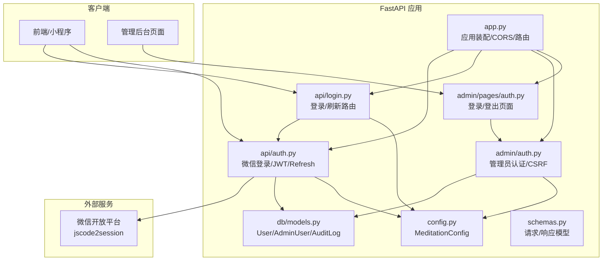
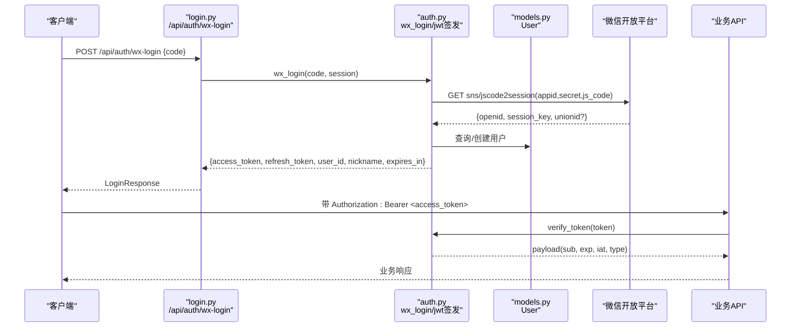
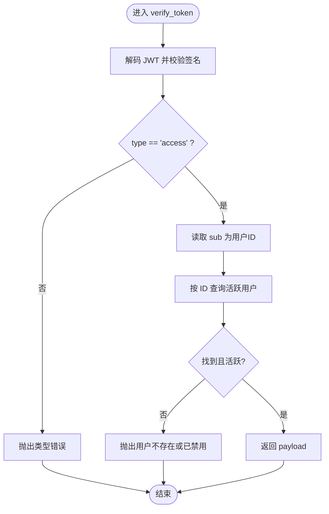
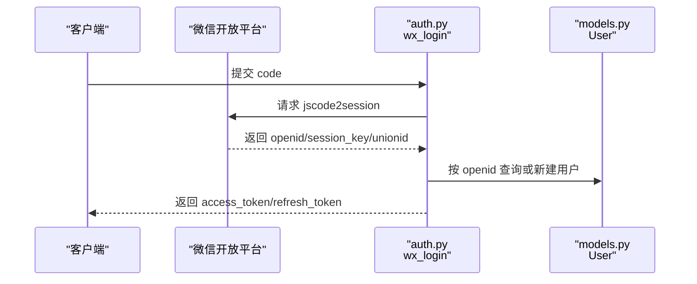
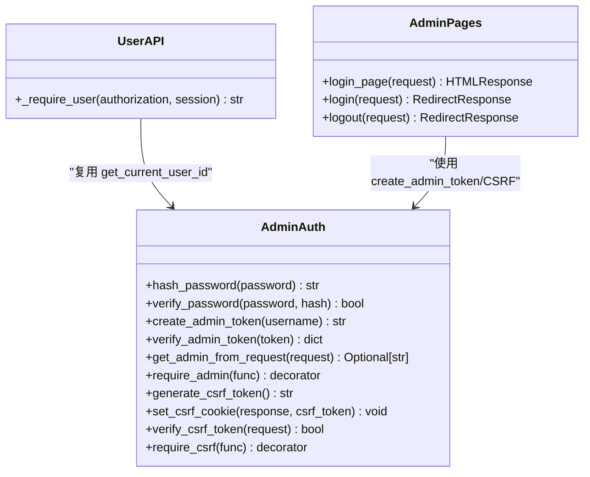
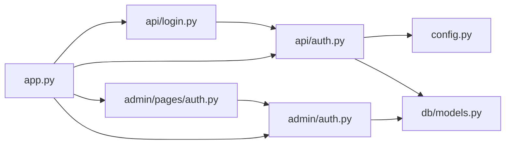

# 认证与授权安全

<cite>
**本文引用的文件**   
- [hushai/meditation/api/auth.py](file://hushai/meditation/api/auth.py)
- [hushai/meditation/api/login.py](file://hushai/meditation/api/login.py)
- [hushai/meditation/admin/auth.py](file://hushai/meditation/admin/auth.py)
- [hushai/meditation/admin/pages/auth.py](file://hushai/meditation/admin/pages/auth.py)
- [hushai/meditation/config.py](file://hushai/meditation/config.py)
- [hushai/meditation/db/models.py](file://hushai/meditation/db/models.py)
- [hushai/meditation/schemas.py](file://hushai/meditation/schemas.py)
- [hushai/meditation/app.py](file://hushai/meditation/app.py)
- [tests/meditation/test_auth.py](file://tests/meditation/test_auth.py)
</cite>

## 目录
1. [简介](#简介)
2. [项目结构](#项目结构)
3. [核心组件](#核心组件)
4. [架构总览](#架构总览)
5. [详细组件分析](#详细组件分析)
6. [依赖关系分析](#依赖关系分析)
7. [性能与安全特性](#性能与安全特性)
8. [故障排查指南](#故障排查指南)
9. [结论](#结论)
10. [附录：配置与最佳实践](#附录配置与最佳实践)

## 简介
本文件面向 hush.ai 的认证与授权安全体系，系统性说明以下方面：
- JWT Token 认证机制的安全设计（生成算法、签名验证、过期管理、刷新策略）
- 微信登录集成安全流程（OAuth2.0 协议实现、code 交换、用户信息获取）
- 管理员权限控制模型（角色权限、访问控制中间件、API 路由保护）
- 密码加密存储方案（bcrypt 使用、盐值生成、强度校验建议）
- 认证安全最佳实践（Token 传输、防重放攻击、会话管理等）
- 完整认证流程图与安全配置示例

## 项目结构
与认证和授权相关的核心代码分布在如下模块：
- API 层：微信登录、JWT 签发与校验、Refresh Token 刷新
- 管理后台：管理员登录、CSRF 防护、管理员令牌校验
- 数据模型：用户、管理员、审计日志等实体
- 配置中心：JWT 密钥、算法、过期时间、微信 AppID/Secret 等
- 应用装配：CORS、路由注册、异常处理

图表来源
- [hushai/meditation/app.py:136-167](file://hushai/meditation/app.py#L136-L167)
- [hushai/meditation/api/auth.py:1-170](file://hushai/meditation/api/auth.py#L1-L170)
- [hushai/meditation/api/login.py:1-52](file://hushai/meditation/api/login.py#L1-L52)
- [hushai/meditation/admin/auth.py:1-183](file://hushai/meditation/admin/auth.py#L1-L183)
- [hushai/meditation/admin/pages/auth.py:1-65](file://hushai/meditation/admin/pages/auth.py#L1-L65)
- [hushai/meditation/config.py:1-136](file://hushai/meditation/config.py#L1-L136)
- [hushai/meditation/db/models.py:1-434](file://hushai/meditation/db/models.py#L1-L434)
- [hushai/meditation/schemas.py:1-541](file://hushai/meditation/schemas.py#L1-L541)

章节来源
- [hushai/meditation/app.py:136-167](file://hushai/meditation/app.py#L136-L167)
- [hushai/meditation/config.py:1-136](file://hushai/meditation/config.py#L1-L136)

## 核心组件
- 微信登录与 JWT 签发：通过微信 code 换取 openid/session_key，创建或更新用户，签发 access_token 与 refresh_token。
- Refresh Token 刷新：基于 selector + bcrypt 的高效查找与校验，避免全表扫描 DoS 风险。
- 管理员认证：用户名+密码校验，签发管理员 JWT，Cookie 携带并受 CSRF 保护。
- 访问控制：API 侧通过依赖注入提取 Bearer Token 并校验；管理后台通过装饰器校验管理员身份与 CSRF。
- 配置与模型：集中式配置提供 JWT 密钥、算法、过期时间、微信凭据；数据库模型包含用户与管理员实体及审计日志。

章节来源
- [hushai/meditation/api/auth.py:1-170](file://hushai/meditation/api/auth.py#L1-L170)
- [hushai/meditation/admin/auth.py:1-183](file://hushai/meditation/admin/auth.py#L1-L183)
- [hushai/meditation/config.py:1-136](file://hushai/meditation/config.py#L1-L136)
- [hushai/meditation/db/models.py:1-434](file://hushai/meditation/db/models.py#L1-L434)

## 架构总览
下图展示从微信登录到签发 JWT、后续刷新与访问控制的端到端流程。

图表来源
- [hushai/meditation/api/login.py:21-36](file://hushai/meditation/api/login.py#L21-L36)
- [hushai/meditation/api/auth.py:63-106](file://hushai/meditation/api/auth.py#L63-L106)
- [hushai/meditation/api/auth.py:109-131](file://hushai/meditation/api/auth.py#L109-L131)
- [hushai/meditation/db/models.py:37-67](file://hushai/meditation/db/models.py#L37-L67)

## 详细组件分析

### 1) JWT Token 认证机制
- 生成算法与签名
  - 使用 HS256 算法（可配置），密钥来自配置项 jwt_secret。
  - Access Token 载荷包含 sub、exp、iat、type 字段，其中 type 强制为 "access"，防止未来引入 refresh JWT 时类型混淆。
- 过期时间管理
  - ACCESS_TOKEN_EXPIRE_MINUTES 默认 7 天；REFRESH_TOKEN_EXPIRE_DAYS 默认 30 天。
  - 可通过环境变量 MEDITATION_JWT_EXPIRE_MINUTES 调整。
- 刷新策略
  - 使用随机字符串作为 refresh_token，服务端仅存储其 bcrypt 哈希与 SHA-256 selector。
  - 刷新接口通过 selector O(1) 定位用户，再用 bcrypt 校验原 token，避免逐行比对导致的 DoS 风险。
  - 刷新成功后返回新的 access_token 与新的 refresh_token，旧 refresh_token 失效。
- 校验流程
  - verify_token 解码并校验 type == "access"，再根据 sub 查询活跃用户。
  - extract_bearer_token 支持标准 Bearer 前缀与宽松解析。

图表来源
- [hushai/meditation/api/auth.py:109-131](file://hushai/meditation/api/auth.py#L109-L131)
- [hushai/meditation/api/auth.py:45-55](file://hushai/meditation/api/auth.py#L45-L55)
- [hushai/meditation/api/auth.py:167-170](file://hushai/meditation/api/auth.py#L167-L170)

章节来源
- [hushai/meditation/api/auth.py:1-170](file://hushai/meditation/api/auth.py#L1-L170)
- [hushai/meditation/config.py:18-52](file://hushai/meditation/config.py#L18-L52)
- [tests/meditation/test_auth.py:34-44](file://tests/meditation/test_auth.py#L34-L44)

### 2) 微信登录集成安全流程
- OAuth2.0 实现要点
  - 调用微信 jscode2session 接口，传入 appid、secret、js_code、grant_type=authorization_code。
  - 成功返回 openid、session_key、unionid（可选）。
- 用户识别与会话
  - 以 openid 唯一标识用户，首次登录自动创建用户记录，后续登录更新 session_key 与 unionid。
- 错误处理
  - 若 errcode 非零或未获取到 openid，抛出明确错误信息。
- 安全性
  - 敏感参数（appid、secret）由配置加载，不硬编码。
  - 网络请求设置超时，避免阻塞。

图表来源
- [hushai/meditation/api/auth.py:63-92](file://hushai/meditation/api/auth.py#L63-L92)
- [hushai/meditation/db/models.py:37-67](file://hushai/meditation/db/models.py#L37-L67)

章节来源
- [hushai/meditation/api/auth.py:63-92](file://hushai/meditation/api/auth.py#L63-L92)
- [hushai/meditation/config.py:64-115](file://hushai/meditation/config.py#L64-L115)

### 3) 管理员权限控制系统
- 角色与权限模型
  - 管理员账号存储在 admin_users 表，支持多管理员、启用/禁用状态。
  - 管理员 JWT 载荷包含 is_admin 标志，用于区分普通用户与管理员。
- 访问控制中间件
  - API 侧：_require_user 依赖注入，从 Authorization 头提取 Bearer Token 并校验。
  - 管理后台：require_admin 装饰器从 Cookie 或 Authorization 头提取管理员 Token 并校验。
- API 路由保护
  - 所有需要认证的 API 均通过 _require_user 或 require_admin 进行保护。
  - 管理后台页面登录/登出路径在 pages/auth.py 中实现，结合 CSRF 保护。
- CSRF 防护
  - 登录成功后下发 admin_csrf_token Cookie（httponly=False，便于前端 JS 读取放入 X-CSRF-Token）。
  - require_csrf 装饰器对写操作进行 CSRF 校验，生产环境启用 secure 属性。

图表来源
- [hushai/meditation/admin/auth.py:24-183](file://hushai/meditation/admin/auth.py#L24-L183)
- [hushai/meditation/admin/pages/auth.py:20-65](file://hushai/meditation/admin/pages/auth.py#L20-L65)
- [hushai/meditation/api/counseling.py:50-63](file://hushai/meditation/api/counseling.py#L50-L63)

章节来源
- [hushai/meditation/admin/auth.py:1-183](file://hushai/meditation/admin/auth.py#L1-L183)
- [hushai/meditation/admin/pages/auth.py:1-65](file://hushai/meditation/admin/pages/auth.py#L1-L65)
- [hushai/meditation/api/admin.py:26-35](file://hushai/meditation/api/admin.py#L26-L35)

### 4) 密码加密存储方案
- bcrypt 使用
  - 管理员密码与 refresh_token 均采用 bcrypt 哈希存储，盐值由库自动生成。
  - 提供 hash_password/verify_password 与 _hash_token/_verify_token_hash 工具函数。
- 强度校验建议
  - 当前未在前端/后端显式实施复杂度规则，建议在注册/修改密码入口增加长度、字符集、历史密码对比等校验。
- 安全存储
  - 禁止明文存储，统一通过哈希函数写入数据库。

章节来源
- [hushai/meditation/admin/auth.py:24-29](file://hushai/meditation/admin/auth.py#L24-L29)
- [hushai/meditation/api/auth.py:28-33](file://hushai/meditation/api/auth.py#L28-L33)

### 5) 认证流程图与安全配置示例
- 登录与刷新序列图已在“架构总览”中给出。
- 安全配置示例（环境变量）
  - MEDITATION_JWT_SECRET：强随机字符串，生产环境务必保密。
  - MEDITATION_JWT_ALGORITHM：HS256（默认）。
  - MEDITATION_JWT_EXPIRE_MINUTES：Access Token 过期分钟数。
  - MEDITATION_WX_APPID、MEDITATION_WX_SECRET：微信登录凭据。
  - MEDITATION_ADMIN_USERNAME、MEDITATION_ADMIN_PASSWORD：初始管理员凭据（首次初始化时使用）。

章节来源
- [hushai/meditation/config.py:18-52](file://hushai/meditation/config.py#L18-L52)
- [hushai/meditation/config.py:64-115](file://hushai/meditation/config.py#L64-L115)
- [hushai/meditation/admin/auth.py:57-61](file://hushai/meditation/admin/auth.py#L57-L61)

## 依赖关系分析
- 模块耦合
  - api/auth.py 依赖 config.py 与 db/models.py，承担核心认证逻辑。
  - api/login.py 封装路由，调用 auth.py 能力。
  - admin/auth.py 独立于用户认证，负责管理员认证与 CSRF。
  - app.py 组装 CORS、路由与异常处理。
- 外部依赖
  - httpx 用于微信接口调用。
  - jose 用于 JWT 编解码。
  - bcrypt 用于密码与 refresh_token 哈希。
  - SQLAlchemy 异步会话用于数据库访问。

图表来源
- [hushai/meditation/app.py:136-167](file://hushai/meditation/app.py#L136-L167)
- [hushai/meditation/api/auth.py:1-170](file://hushai/meditation/api/auth.py#L1-L170)
- [hushai/meditation/api/login.py:1-52](file://hushai/meditation/api/login.py#L1-L52)
- [hushai/meditation/admin/auth.py:1-183](file://hushai/meditation/admin/auth.py#L1-L183)
- [hushai/meditation/admin/pages/auth.py:1-65](file://hushai/meditation/admin/pages/auth.py#L1-L65)

章节来源
- [hushai/meditation/app.py:136-167](file://hushai/meditation/app.py#L136-L167)

## 性能与安全特性
- 性能优化
  - Refresh Token 查找采用 selector（SHA-256 hex）索引，O(1) 定位用户，再进行 bcrypt 校验，避免全表扫描带来的 DoS 风险。
  - 测试用例覆盖 selector 长度与唯一性、未知 token 抛错、篡改 token 拒绝等场景。
- 安全加固
  - JWT 强制 type 校验，防止类型混淆。
  - 管理员 Cookie 设置 httponly、samesite、secure（生产环境）。
  - CSRF 防护针对写操作严格校验。
  - CORS 在生产环境限制允许来源。

章节来源
- [tests/meditation/test_auth.py:39-44](file://tests/meditation/test_auth.py#L39-L44)
- [tests/meditation/test_auth.py:111-136](file://tests/meditation/test_auth.py#L111-L136)
- [hushai/meditation/admin/auth.py:146-161](file://hushai/meditation/admin/auth.py#L146-L161)
- [hushai/meditation/app.py:148-155](file://hushai/meditation/app.py#L148-L155)

## 故障排查指南
- 常见错误与定位
  - “Token 无效/类型错误”：检查 JWT 密钥与算法是否一致，确认 type 是否为 "access"。
  - “用户不存在或已禁用”：确认用户是否被禁用或 ID 不正确。
  - “微信登录失败/未获取到 openid”：检查 appid/secret 是否正确，微信接口返回 errcode。
  - “Refresh token 无效或已过期”：selector 命中但 bcrypt 校验失败，可能 token 被篡改或过期。
  - “CSRF 验证失败”：确保前端将 X-CSRF-Token 设置为与 Cookie 一致的 admin_csrf_token。
- 调试建议
  - 开启 debug 模式查看更详细的错误信息。
  - 检查环境变量是否加载正确（.env 或系统环境变量）。
  - 核对数据库索引是否存在（refresh_token_selector、refresh_token_hash）。

章节来源
- [hushai/meditation/api/auth.py:109-131](file://hushai/meditation/api/auth.py#L109-L131)
- [hushai/meditation/api/auth.py:63-92](file://hushai/meditation/api/auth.py#L63-L92)
- [hushai/meditation/admin/auth.py:164-182](file://hushai/meditation/admin/auth.py#L164-L182)
- [hushai/meditation/db/models.py:46-51](file://hushai/meditation/db/models.py#L46-L51)

## 结论
hush.ai 的认证与授权体系围绕 JWT 与 Refresh Token 构建，具备以下特点：
- 明确的类型约束与严格的签名校验，降低类型混淆风险。
- 高效的 Refresh Token 刷新机制，兼顾安全与性能。
- 完善的微信登录集成，遵循 OAuth2.0 规范。
- 管理后台具备独立的认证与 CSRF 防护，满足后台安全需求。
- 密码与敏感 Token 采用 bcrypt 哈希存储，符合业界最佳实践。

## 附录：配置与最佳实践

### A. 安全配置清单
- JWT
  - 使用强随机 MEDITATION_JWT_SECRET。
  - 固定算法为 HS256，必要时评估切换至更强算法。
  - 合理设置 MEDITATION_JWT_EXPIRE_MINUTES，平衡用户体验与安全。
- 微信登录
  - 严格保管 MEDITATION_WX_APPID 与 MEDITATION_WX_SECRET。
  - 对外网请求设置超时，避免资源耗尽。
- 管理员
  - 生产环境启用 HTTPS，确保 Cookie secure 生效。
  - 定期轮换管理员凭据，限制登录 IP 范围（可在网关层实现）。
- CORS
  - 生产环境精确配置 allow_origins，避免使用通配符。

章节来源
- [hushai/meditation/config.py:18-52](file://hushai/meditation/config.py#L18-L52)
- [hushai/meditation/config.py:64-115](file://hushai/meditation/config.py#L64-L115)
- [hushai/meditation/app.py:148-155](file://hushai/meditation/app.py#L148-L155)

### B. 认证安全最佳实践
- Token 安全传输
  - 始终使用 HTTPS，避免中间人攻击。
  - 客户端仅在必要范围内缓存 Token，并在退出时清理。
- 防重放攻击
  - 对关键写操作启用 CSRF 保护（管理后台已实现）。
  - 对高价值接口可增加一次性 nonce 或请求签名。
- 会话管理
  - 短生命周期 Access Token + 长生命周期 Refresh Token 组合。
  - 刷新后轮换 Refresh Token，旧 token 立即失效。
- 密码强度与存储
  - 实施复杂度规则与历史密码对比。
  - 使用 bcrypt 或同等强度的哈希算法，禁止明文存储。
- 监控与审计
  - 记录登录、刷新、审核等操作审计日志，便于追溯。
  - 对异常登录行为进行告警与限流。

[本节为通用指导，无需源码引用]