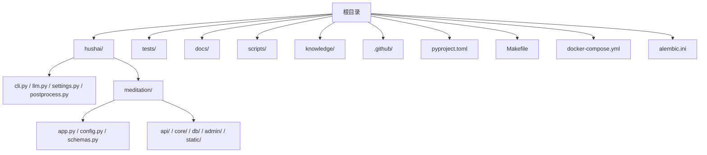
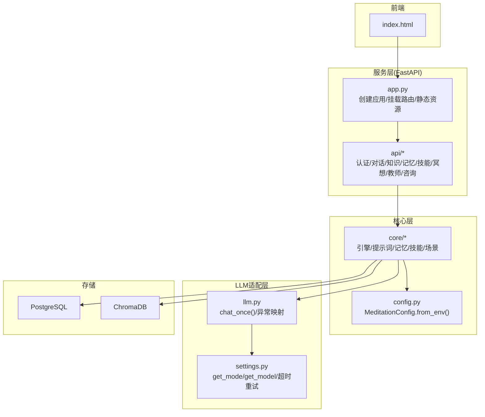
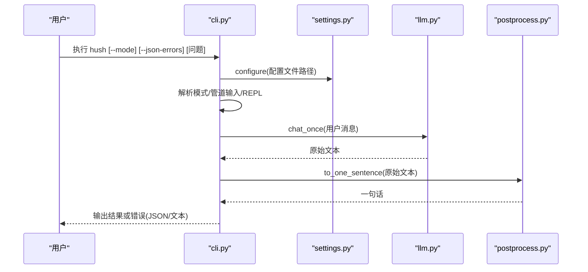
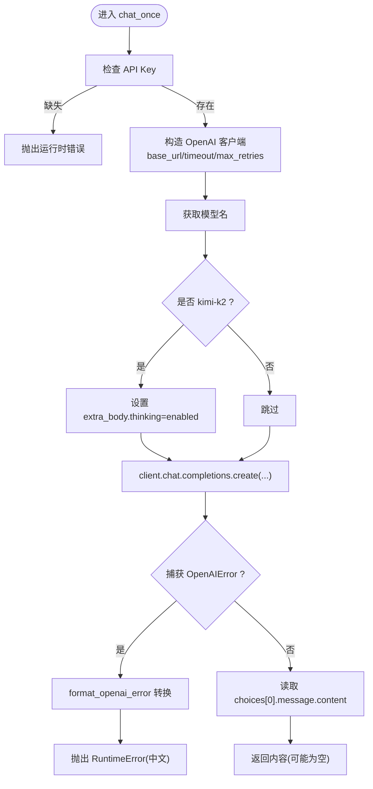
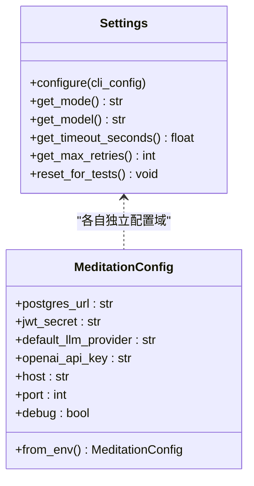
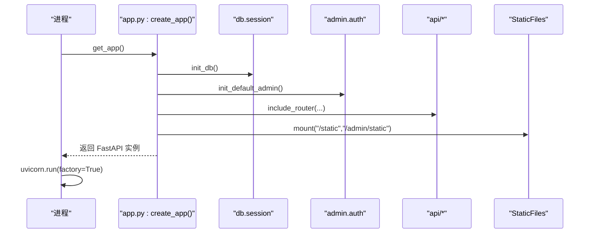
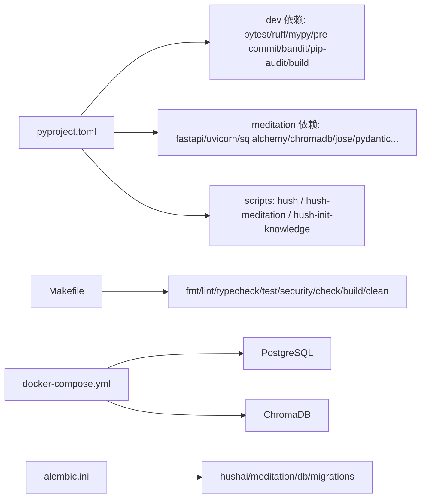

# 开发指南

<cite>
**本文引用的文件**   
- [README.md](file://README.md)
- [CONTRIBUTING.md](file://CONTRIBUTING.md)
- [CODE_OF_CONDUCT.md](file://CODE_OF_CONDUCT.md)
- [pyproject.toml](file://pyproject.toml)
- [Makefile](file://Makefile)
- [docker-compose.yml](file://docker-compose.yml)
- [alembic.ini](file://alembic.ini)
- [hushai/__init__.py](file://hushai/__init__.py)
- [hushai/settings.py](file://hushai/settings.py)
- [hushai/llm.py](file://hushai/llm.py)
- [hushai/cli.py](file://hushai/cli.py)
- [hushai/postprocess.py](file://hushai/postprocess.py)
- [hushai/meditation/app.py](file://hushai/meditation/app.py)
- [hushai/meditation/config.py](file://hushai/meditation/config.py)
- [hushai/meditation/schemas.py](file://hushai/meditation/schemas.py)
</cite>

## 目录
1. [简介](#简介)
2. [项目结构](#项目结构)
3. [核心组件](#核心组件)
4. [架构总览](#架构总览)
5. [详细组件分析](#详细组件分析)
6. [依赖关系分析](#依赖关系分析)
7. [性能与可观测性](#性能与可观测性)
8. [故障排查指南](#故障排查指南)
9. [结论](#结论)
10. [附录](#附录)

## 简介
本指南面向 hush.ai 的开源贡献者与开发者，提供从代码规范、Git 工作流、代码审查到新功能开发全流程的完整说明。同时涵盖目录结构与模块组织原则、开发与调试工具配置、社区行为准则等，帮助新贡献者快速上手并高效协作。

## 项目结构
仓库采用“包 + 功能域”的组织方式：
- hushai：可安装 Python 包（CLI、设置、LLM 适配、后处理）
- hushai/meditation：冥想服务（FastAPI 应用、路由、核心逻辑、数据库、管理后台、静态资源）
- tests：单元测试与集成测试
- docs：用户文档与架构说明
- scripts：辅助脚本
- knowledge：知识库语料与技能模板
- .github：CI、Issue/PR 模板、Dependabot 配置
- pyproject.toml：元数据、依赖、Ruff/Mypy/pytest 配置
- Makefile：常用开发命令封装
- docker-compose.yml：本地 Postgres 与 ChromaDB 编排
- alembic.ini：数据库迁移配置

图表来源
- [README.md:136-178](file://README.md#L136-L178)
- [pyproject.toml:1-131](file://pyproject.toml#L1-L131)

章节来源
- [README.md:136-178](file://README.md#L136-L178)
- [CONTRIBUTING.md:9-21](file://CONTRIBUTING.md#L9-L21)

## 核心组件
- CLI 入口与交互模式：命令行参数解析、REPL 与管道输入、错误输出格式控制
- LLM 适配层：系统提示构建、OpenAI SDK 调用、异常映射为中文提示
- 配置系统：环境变量优先于 JSON 配置文件；支持多模式与兼容旧开关
- FastAPI 应用：生命周期初始化、中间件与限流、路由挂载、静态资源挂载
- 请求模型：Pydantic 校验、批量导入、流式分块、咨询预约与订单等

章节来源
- [hushai/cli.py:1-152](file://hushai/cli.py#L1-L152)
- [hushai/llm.py:1-142](file://hushai/llm.py#L1-L142)
- [hushai/settings.py:1-226](file://hushai/settings.py#L1-L226)
- [hushai/meditation/app.py:1-228](file://hushai/meditation/app.py#L1-L228)
- [hushai/meditation/schemas.py:1-541](file://hushai/meditation/schemas.py#L1-L541)

## 架构总览
整体由前台页面、FastAPI 服务层、核心编排层（Engine）、LLM 适配层以及持久化存储（PostgreSQL、ChromaDB）组成。服务启动时完成数据库初始化、默认管理员与导师数据注入，并通过路由注册对外暴露 API。

图表来源
- [hushai/meditation/app.py:136-207](file://hushai/meditation/app.py#L136-L207)
- [hushai/meditation/config.py:18-136](file://hushai/meditation/config.py#L18-L136)
- [hushai/llm.py:100-142](file://hushai/llm.py#L100-L142)
- [hushai/settings.py:145-226](file://hushai/settings.py#L145-L226)

## 详细组件分析

### CLI 组件（hush CLI）
- 功能要点
  - 支持一次性提问、管道输入与交互式 REPL
  - 通过 --mode 或 --no-calm 覆盖运行模式
  - 错误输出支持 JSON 格式便于自动化
- 关键流程
  - 解析参数 → 加载配置 → 选择模式 → 调用 LLM → 后处理为一句话 → 输出

图表来源
- [hushai/cli.py:81-152](file://hushai/cli.py#L81-L152)
- [hushai/settings.py:98-113](file://hushai/settings.py#L98-L113)
- [hushai/llm.py:100-142](file://hushai/llm.py#L100-L142)
- [hushai/postprocess.py:14-37](file://hushai/postprocess.py#L14-L37)

章节来源
- [hushai/cli.py:1-152](file://hushai/cli.py#L1-L152)
- [hushai/postprocess.py:1-37](file://hushai/postprocess.py#L1-L37)

### LLM 适配层
- 功能要点
  - 根据模式构建系统提示（含反焦虑/反拖延/激励/反PUA演练）
  - 统一 OpenAI SDK 调用与异常映射为中文提示
  - 支持特定模型的 extra_body 透传（如 thinking）
- 关键函数
  - build_system_prompt：按模式拼接系统提示
  - format_openai_error：将 SDK 异常转换为可读中文
  - chat_once：组装请求、调用、返回内容

图表来源
- [hushai/llm.py:27-78](file://hushai/llm.py#L27-L78)
- [hushai/llm.py:81-98](file://hushai/llm.py#L81-L98)
- [hushai/llm.py:100-142](file://hushai/llm.py#L100-L142)

章节来源
- [hushai/llm.py:1-142](file://hushai/llm.py#L1-L142)

### 配置系统（CLI 与冥想服务）
- CLI 配置
  - 优先级：环境变量 > JSON 配置文件 > 默认值
  - 支持模式别名与旧版布尔开关兼容
- 冥想服务配置
  - 基于 dataclass 的 MeditationConfig，从 .env 与环境变量加载
  - 包含 LLM 提供商、嵌入模型、JWT、CORS、端口等大量字段

图表来源
- [hushai/settings.py:98-226](file://hushai/settings.py#L98-L226)
- [hushai/meditation/config.py:18-136](file://hushai/meditation/config.py#L18-L136)

章节来源
- [hushai/settings.py:1-226](file://hushai/settings.py#L1-L226)
- [hushai/meditation/config.py:1-136](file://hushai/meditation/config.py#L1-L136)

### FastAPI 应用与服务启动
- 应用生命周期
  - 初始化日志、数据库连接、默认管理员、默认导师与预约配置
- 中间件与限流
  - CORS、SlowAPI 限流、健康检查端点
- 路由与静态资源
  - 挂载 api/* 路由与管理后台路由
  - 挂载 /static 与 /admin/static

图表来源
- [hushai/meditation/app.py:24-133](file://hushai/meditation/app.py#L24-L133)
- [hushai/meditation/app.py:136-207](file://hushai/meditation/app.py#L136-L207)
- [hushai/meditation/app.py:217-228](file://hushai/meditation/app.py#L217-L228)

章节来源
- [hushai/meditation/app.py:1-228](file://hushai/meditation/app.py#L1-L228)

### 请求与响应模型（Pydantic）
- 聊天与流式：ChatRequest/ChatResponse/StreamChunk
- 知识与检索：KnowledgeImportRequest/KnowledgeSearchResponse
- 技能导入：SkillImportRequest/SkillImportResult（支持顶层数组兼容）
- 咨询与预约：Counselor/Appointment/Order/ServiceRecord 系列模型
- 校验策略：长度限制、去重、类型转换、枚举约束

章节来源
- [hushai/meditation/schemas.py:1-541](file://hushai/meditation/schemas.py#L1-L541)

## 依赖关系分析
- 构建与发布
  - setuptools 构建后端，动态版本从包 __version__ 读取
  - 可选依赖 dev/meditation 分离，便于按需安装
- 质量与安全
  - Ruff 负责 lint/format，Mypy 做类型检查，pytest 带覆盖率阈值
  - CI 在 Ubuntu 上执行多 Python 版本矩阵，Windows/macOS 进行冒烟测试
- 本地服务
  - docker-compose 提供 PostgreSQL 与 ChromaDB
  - alembic.ini 指向迁移脚本位置与数据库 URL

图表来源
- [pyproject.toml:1-131](file://pyproject.toml#L1-L131)
- [Makefile:1-39](file://Makefile#L1-L39)
- [docker-compose.yml:1-31](file://docker-compose.yml#L1-L31)
- [alembic.ini:1-37](file://alembic.ini#L1-L37)

章节来源
- [pyproject.toml:1-131](file://pyproject.toml#L1-L131)
- [Makefile:1-39](file://Makefile#L1-L39)
- [docker-compose.yml:1-31](file://docker-compose.yml#L1-L31)
- [alembic.ini:1-37](file://alembic.ini#L1-L37)

## 性能与可观测性
- 限流与稳定性
  - SlowAPI 基于远端地址限流，避免滥用
  - OpenAI 客户端支持超时与最大重试次数，提升鲁棒性
- 日志与调试
  - 服务启动时根据 debug 标志调整日志级别
  - 健康检查端点用于探针与监控
- 数据库与向量检索
  - 使用异步 SQLAlchemy 与 asyncpg，结合 Alembic 管理迁移
  - ChromaDB 作为向量存储，配合检索参数 top_k 控制召回数量

章节来源
- [hushai/meditation/app.py:24-40](file://hushai/meditation/app.py#L24-L40)
- [hushai/meditation/app.py:203-206](file://hushai/meditation/app.py#L203-L206)
- [hushai/llm.py:112-118](file://hushai/llm.py#L112-L118)
- [alembic.ini:1-37](file://alembic.ini#L1-L37)

## 故障排查指南
- 常见错误定位
  - 未配置 API Key：CLI 会明确提示设置环境变量或配置文件
  - 网络/鉴权/限频：LLM 适配层将 OpenAI SDK 异常映射为中文提示
  - 配置路径无效：显式指定配置文件不存在时会报错
- 建议步骤
  - 确认 .env 或环境变量已正确设置
  - 使用 make check 与 pytest 验证本地环境
  - 查看服务日志与健康检查端点状态
  - 对数据库与向量库进行连通性检查

章节来源
- [hushai/llm.py:81-98](file://hushai/llm.py#L81-L98)
- [hushai/llm.py:104-110](file://hushai/llm.py#L104-L110)
- [hushai/settings.py:98-113](file://hushai/settings.py#L98-L113)
- [hushai/meditation/app.py:203-206](file://hushai/meditation/app.py#L203-L206)

## 结论
本指南梳理了 hush.ai 的代码规范、开发流程、目录结构与核心组件，提供了从本地开发到贡献提交的完整路径。遵循本文档约定与工具链，有助于保持代码质量、提升协作效率并确保服务稳定运行。

## 附录

### 代码规范与质量门禁
- 语言与风格
  - Python 3.9+；Ruff 负责格式化与 Lint；Mypy 进行类型检查
  - 行宽 100，目标版本 py39
- 测试与覆盖率
  - pytest 自动启用 asyncio 模式；覆盖率阈值 70%（仅统计 hushai）
- 安全扫描
  - bandit 扫描 hushai 目录（排除 tests）
- 提交前检查
  - make check 串联 lint/format/typecheck/test

章节来源
- [pyproject.toml:85-131](file://pyproject.toml#L85-L131)
- [Makefile:1-39](file://Makefile#L1-L39)
- [CONTRIBUTING.md:53-72](file://CONTRIBUTING.md#L53-L72)

### Git 工作流与代码审查
- 分支策略
  - 从 main 分支拉取特性分支，提交聚焦且信息清晰
- PR 要求
  - 使用模板描述变更动机与测试方法
  - 确保 CI 全绿后再合并
- 签名提交（可选）
  - 若启用 DCO，使用 git commit -s 签名

章节来源
- [CONTRIBUTING.md:38-51](file://CONTRIBUTING.md#L38-L51)
- [CONTRIBUTING.md:74-82](file://CONTRIBUTING.md#L74-L82)

### 新功能开发流程
- 需求分析与设计
  - 明确业务目标与边界，评估对现有配置与模型的影响
- 实现与验证
  - 新增/修改 Pydantic 模型与 API 路由
  - 在 core 中实现核心逻辑，必要时扩展配置项
  - 编写单元测试，保证覆盖率达标
- 文档更新
  - 更新 README 与 docs 下相关文档
  - 涉及对话模式或配置变更时同步更新配置表与示例
- 提交与审查
  - 本地执行 make check 与 pytest
  - 提交 PR 并等待 CI 与审查反馈

章节来源
- [CONTRIBUTING.md:90-95](file://CONTRIBUTING.md#L90-L95)
- [README.md:300-326](file://README.md#L300-L326)

### 开发工具与环境配置
- 虚拟环境与依赖
  - python -m venv .venv 激活后安装 dev 或 meditation 可选依赖
- IDE 建议
  - 启用 Ruff 插件与 Mypy 类型检查
  - 配置断点调试 FastAPI 与异步任务
- 本地服务
  - docker-compose 启动 Postgres 与 ChromaDB
  - 使用 alembic.ini 中的迁移脚本位置与数据库 URL
- 常用命令
  - make install/dev/fmt/lint/typecheck/test/security/check/build/clean

章节来源
- [CONTRIBUTING.md:23-36](file://CONTRIBUTING.md#L23-L36)
- [docker-compose.yml:1-31](file://docker-compose.yml#L1-L31)
- [alembic.ini:1-37](file://alembic.ini#L1-L37)
- [Makefile:1-39](file://Makefile#L1-L39)

### 社区贡献指南与行为准则
- 行为准则
  - 尊重差异、包容多元、拒绝骚扰与攻击性行为
  - 维护者负责澄清与执行标准，保护举报人隐私与安全
- 贡献渠道
  - 先开 Issue 讨论方向，再提交 PR
  - 遵循贡献文档的质量检查与文档更新要求

章节来源
- [CODE_OF_CONDUCT.md:1-46](file://CODE_OF_CONDUCT.md#L1-L46)
- [CONTRIBUTING.md:105-108](file://CONTRIBUTING.md#L105-L108)